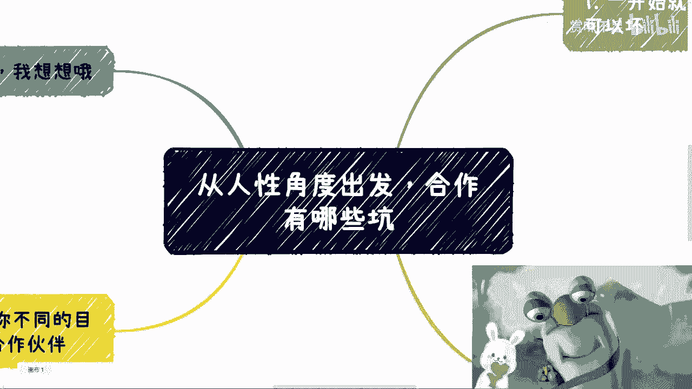
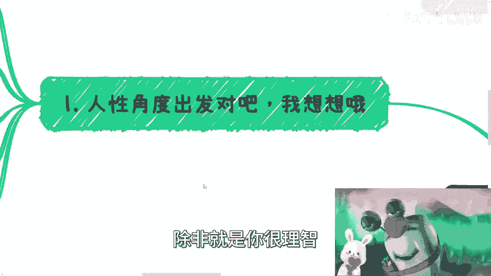
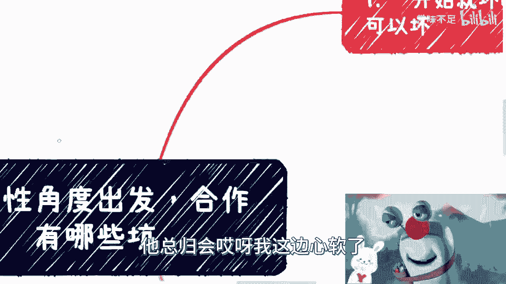
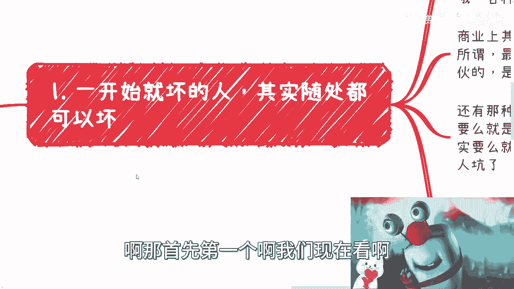
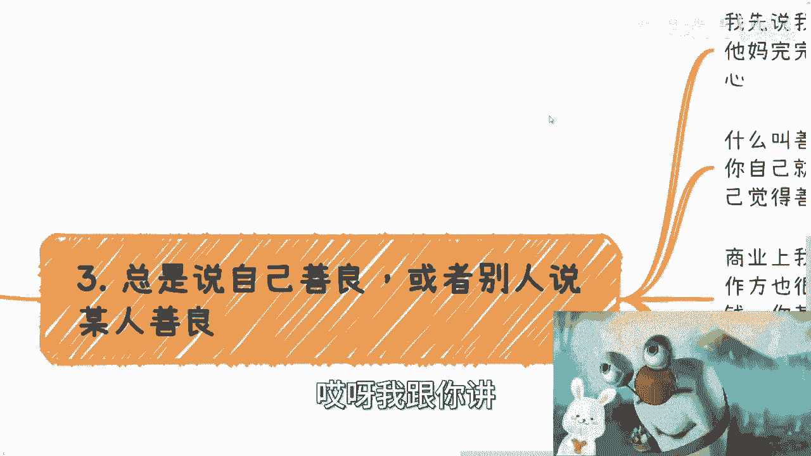
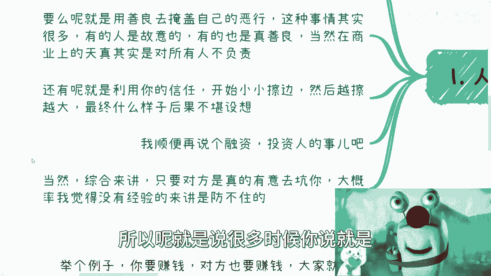
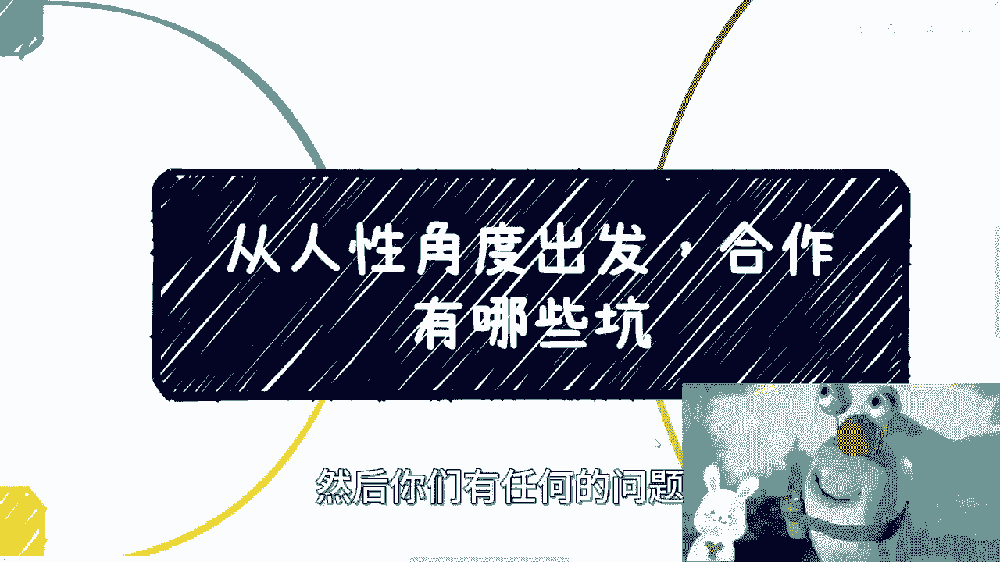

# 从人性角度出发，商业合作可能会有哪些坑 - P1 - 赏味不足 - BV14z4y1w7Dy

啊大家好，今天礼拜六礼拜六呃。

前两天我们先说啊，前两天有个小伙伴在评论区提的，就提的这个主题，我还觉得太大了，缩小一点，然后呢对方就跟我说的说，合作当中这个坑嘛，我觉得可以，但是我不可能列的全，我就随便列一些啊。

我以前碰到过的，然后广州活动呢我们继续报名好吧，我们线下现在应该还有十个人吧，差不多十个位置也差不多满了啊，这场地太多，人话也不好呃，我们线下呢可以说说更深入的问题对吧。

你们只要不要什么的什么什么什么录音啊，什么什么什么什么录像啊，然后举报我是吧，那就都好说啊啊好，那么我们继续来说啊。

就他这位小伙伴提出的问题呢，是说从人性角度出发哦，合作当中有哪些坑。

首先啊你看啊，他有个前提叫做从从人性角度出发，对吧啊。

我想了一想呢，我以前碰到过的男人是这样子的，就是第一难他有几种，第一种就是他一开始就是坏的，他就是要坑你，你就是个背锅背锅侠，你就是个劳动力，嗯嗯也许呢这个饼画的很大啊，就是呃非常多非常多非常大的饼啊。

那么呃呃也许你也听得很激动啊，但是不管怎么样，就是说从咳咳一个客观的角度，或者说等等，未来你经验比较丰富之后，你就会觉得自己就是个被坑的人啊，首先这低一点啊，那么要么呢就是说啊这个就是很人性。

要么就是说是什么呢，叫做用善良去掩盖自己的恶行啊，呃这种事情呢很多，而且有的人呢你会发现有的人是故意的，有的人呢也是真的善良啊，当然在商业当中，善良和天真其实就是对所有人不负责啊。

这个后面我也会再说的啊，然后还有呢就是利用你的信任啊，开始小小擦边，然后是越擦越大啊，最终什么样子呢，反正后果也不堪设想啊，那么顺便呢还有就是说融资啊，投资人这个事啊，这个这个好像漏漏说了，没事。

待会我来给大家补一下啊，呃呃当然啊综合来讲，只要对方我跟你说啊，就是商业这个东西是这样子的，就是你除非啊呃你是非常讲原则，或者你是就是就像我说的，就是说该所有东西该走合同走合同啊，该看背景看背景。

你但凡有一丝想要通过你的感性而去合作的话，那么我就这么跟你说，只要对方真的想坑你，大概率啊。

我觉得你根本是避不开的，你也防不住的，就没有任何概率防得住，除非就是你很理智。

但是大部分的人他在经过洗礼之前，他是不可能理智的啊，他总归会哎呀。

我这边心软了，那边干嘛了对吧，那首先第一个我们现在看就是一开始就是坏的。

这种人随处可见啊，因为你哎你能说他多坏就坏，这个东西你也是有有档次的对吧，有有程度的啊，那么有的人呢他就利用你，就是说他知道很多人不善于拒绝啊，然后呢更多的得寸得寸进尺啊，就比如呢我就跟你们说。

比如以前有个垃圾啊，就是找我帮忙啊，我呢也当时我心软对吧，只要我帮忙呢，就各种好，各种谦虚，我觉得行啊，帮就帮呗对吧，这个我也不多块肉，我也不少块肉对吧，也无所谓，然后得到这个等达到目的之后呢。

就各种自己捞好处啊，各种不听劝告对吧，那可能小伙伴要说了，那他捞好处不听劝告跟你有什么关系呢对吧，那很简单啊，他在那边搅屎棍，他在那边就是坑蒙拐骗，那他妈是我介绍的，怎么会跟我没关系呢。

你想想看是不是对吧，唉这他妈的就啊，我说我自己啊，第二呢就是商业上呢，其实最怕的不是坑自己啊，说真的啊，呃坑自己其实无所谓啊，你明白吧，你最怕的是坑别人哦，然后呢就像我说的。

就是别人感觉你还跟他是一伙的，那你跳这个黄河也洗不清啊，你怎么想对吧，而且我就这么跟你讲，就是如果今天你跟我合作吧，你介绍了一个人，然后他坑我，我会连带你一起删掉，但是呢你问我，比如说你有机会。

你问我哎呀，这个吕老师冤枉我是我就算冤枉你怎么了，因为对我来讲，我我就是从我的整个认知，或者我觉得我告诉你们，就是我冤枉，总比被坑好啊，我冤枉怎么了呢对吧，因为什么，因为你要知道我们被坑的风险很高啊。

我冤枉你，我是不耍快乐啊，但是我要是被坑了呢，我怎么办呢对吧，就这也是为什么我们一直说稳定是最重要的，安全是最重要的，但不是说那些什么什么，有很多人跟我说，哎我学历很高啊，我我能力很强。

who care啊啊，然后还有那种上来就跟你说呢，我们一起注册公司，要么就是你出点钱投资一下啊，我们合伙吧，反正就是给你画各种各样的饼，对吧，然后呢那个其实呢要么就是对方要坑你，要么就是对方其实也不懂。

就是被别人坑的，因为很多时候你要明白啊，就是说在我们达到一定的这个境界之前，那么他们呢就是说的很多东西，他们自己也没有得到过共识，他们自己也没有去验证过，所以很大可能他们自己也是被坑的对吧。

你说你说就像我以前这种人坑我很多次，你说我能怪他吗，我不能怪他，因为他也是个受害者，但问题是你如果从再从我的角度出发对吧，我也不关心他是不是受害者，因为我就是被他啃的，那我不怪他怪谁呢，那怪我自己嘛。

那当然怪我自己也对对吧啊那么坏这种东西呢，我跟你讲啊，你要真的防的是防不住的，但是贼也有办法，什么办法呢，就是第一点就是你得你无论如何，你管住管住自己的钱，别什么脑子一发热，然后说啊。

我他妈要是干了对吧，要是上了啊，那不行，对吧，然后这是第一个，第二个呢就是说任何东西看合同条款啊，其实我跟你讲很多这种人啊，他这种呃这种你说使坏也好，怎么样也好，这种人呢他对真正商业他不了解他。

他对合同信息也不了解啊，比如你们合伙对吧，他拿出一个雇佣的雇佣的合同来，明显就是坑你啊，你这样一看就知道我这是个，这不能就是合作对吧。

然后第二就是说总是说自己善良啊，或者别人善良，哎呀我跟你讲这事情他妈的真的。

我先跟你说结论啊，结论就是在我的认知里面，商业上说善良的就他妈完完全全是贬义词，你看到没有，就是我一般作为含妈区博主对吧，我一般也就嘴上说说，你看我这种文案里面出现含妈区的妈很少的，这说明什么。

说明已经不能忍了，你知道吗啊，就是这就是他妈的完完全全是贬义词，就我跟你说，听到这个词满满的就是恶心哦，如果你们现在听到善良这个词，还觉得哎有所这个恻隐之心，有所被铲动对吧，或者怎么样，那我跟你讲。

你得好好反省你自己啊，就是什么叫善良，我跟你说，任何事情都是相对的，你自己的善良对你自己就好了啊，我不管你怎么善良，你就对你自己就好了，一亩三分地自己搞好，别去祸祸害别人对吧，你对别人善良。

那么问题来了，你自己觉得善良，别人不这么觉得对吧，首先这第一点，第二点，商业上我们的合作出现过太多了，比如说啊我给你打个比方，比如说对方很善良啊，合作方也很善良，但是一年半载过去了对吧，就是不赚钱。

甚至你还贴了点钱，那我就问你嘛，你你到那个时候是不是还在那边想唉，我甚至不知道对方是真的善良呢，还是说是偷偷摸摸自己赚钱，就在那边给我画饼，你觉得是哪一种呢，你不知道啊对吧，但是我不知道啊。

我你觉得我关心他善不善良吗，这他妈是我想关心的事情吗，对吧啊，然后还有那种善良的很啊，什么善良的狠，就是不停的跪舔甲方或者不停的跪舔客户啊，哪怕客户画了个饼，没有任何实质性的东西，也没有合同。

他就是舔对吧，然后不停的PUA你啊，我们要对别人好，我们要长远发展，长远发展，你妈个头对，长远发展对吧，就是你碰到这种人，你甚至会发现卧槽他妈的，我是不是感觉这个人跟对方是不是蛇鼠一窝。

他俩是不是穿一条裤子来坑我对吧，因为什么，因为就是我不说对别人坑蒙拐骗吧对吧，你做商业你至少先对自己负责吧对吧，你做商业不赚钱，天打雷劈啊啊哪里有说自己做商业，然后不停的在PUA自己说哦这个我们要对。

我要为对方着想啊，我们我们一定不能得罪对方，那他妈你做毛商业了，你妈做和尚这么好的呀，对不对啊，所以我就说了这种啊，自己作死就好了，你别连累别人对吧，然后我跟你说，这种人还会不停的标榜自己，哎呦我的。

我觉得老善良了对吧，真的我跟你讲，我这个也就是在网上不该不能骂啊，你们看我线下，我他妈真的我很粗俗的啊，我跟你讲我很粗俗，对吧好，那么第四个就是人呢会变的。

你不同目的呢，你要选择不同的合作伙伴，什么意思啊，你举个例子，比如说你要赚钱，对方也要赚钱对吧，那么大家就赚钱就可以了啊，你就别去想着什么长期合作，互惠互利不存在了。

就是你赚完这笔case再说case by case去想啊，你不要去想那么远，没有这么远的东西的对吧，因为长远的合作基于什么，基于你们两者在商业上都很成熟，基于你们两者在三观上都很成熟，都很一致。

但是这种人你们现在大概率是碰不到的对吧，因为每一个人都有个成长期，成长期人都是会变的变得好和变得不好，没有人会知道善恶就在一念之间，没有人能保证他，你懂吗，就是对方可能是一个你特别信任的人。

可能是你的发小，但是他可能今天就是做错了一件事情，就是善念1111，善恶一念之间，你能拿他怎么办呢，但是他可能造成的后果是，你们很有可能被拘留，你们很有可能进去坐一年半，你怎么办呢，对不对，你怎么办呢。

你这你去怪他，其实你觉得我说我觉得你去怪他，可能也不太可能，为什么，因为其实你能理解他，你知道他什么样的人，但是做出这样的一些就是我们所谓的，就是就是变化的一些事情，这不可能也不是他本意所为。

但是很多时候就像我说的，善恶就是一念之差，没有人能控得住啊，但是你又不能以这个善恶，一念之下去定义这个人对吧，那怎么办呢，就像我说的，我们只能一刀切啊，我为什么要把风险留给自己呢，对不对啊。

所以你但凡和一个不成熟的人合作，你反而还要期望得到更多，那就是不可能的哦，无论是你希望他付出更多，或者说你们自己能够一直信任对方，都是不可能的，因为所有的人在达到一个真正的成熟。

或者三观就是比较成熟之前，他不知道自己会变成什么样子，对吧好，那么我们再来说说这个融资啊，融资这个东西呢，我就我就那个吧，我就是嗯带过一嘴巴啊，就是说白了就是我以前呢在融资之前啊，我当然我说以前的事情。

现在我就一个人嘛对吧，就是以前呢我去融资之前呢，我一直对资方，对很多东西呢是抱有很大的敬畏之心的啊，我也会觉得就是这可能是个比较神圣，比较严肃的一个事情，那后来我去谈了十多家之后呢。

我就发现妈的不是这样子，就是甚至就是就这么说吧，就是说对方我们其实都是资方的工具人，甚至对方可以不要脸的不要脸的告诉你，他妈就是我的工具人，你知道吗，但是你要想想看看，无论你觉得对方是不是要脸。

无论你也觉得对方是不是真的要利用你，但是你没有办法，你无奈啊，你要么就跟你，要么就别去融资，你自己去赚钱，我觉得没毛病的，你但凡想要去融这笔资，你是不是也只能呃他说什么，你说是什么对吧，这个他为刀俎。

我为鱼肉，你怎么办呢，对不对啊，所以呢就是说很多时候你说就是。

那我们回到这个核心上面啊，你说这个合作有哪些坑是这样子的啊，有些呢你说他是不是坑，是，但是这种坑呢，是商业当中已经这么多年都出现了，就像我们刚说的，投资方就是想利用，你说是不是坑是。

但是你必须你必须得踩啊，你不踩怎么办呢对吧，就是说白了只不过就是说你踩的这个坑，多大多小而已，但这个坑你必须是踩下去的对吧，但是剩下的一些就像我们刚刚说的，你说善良啊对吧。

你说什么你说什么什么推荐别人啊对吧，恻隐之心啊，哎呀别别不要啊，什么冤枉不冤枉对吧，哎刘老师，你冤枉我啊，刘老师这个这个你怎么就把我删掉了，怎么样子，我但凡我但凡去纠结你们，我但凡去纠结任何一个细节。

那我跟你讲，我我那你这么说吧，在头文字D里面啊，呃当时拓海有过一次是直线比别人快的对吧，当时那个剧情说的很清楚，你要不要纠结于直线，就是你要不要纠结于你胜利的情况，就是你胜利的这种模式对吧。

不要老觉得你是通过技术胜利，你也别老觉得你是通过弯道胜利对吧，别老觉得你的各个方面是优势，上面你才能取得胜利，如果来说你通过一些，就是就是就是让你觉得很卑微对吧，或者怎么样的可能违反你原本的一些想法的。

但是你胜利了就好了，为什么，因为你在商业上你要这么想，我们往上走，我们要面对各种二代，我们要面对各种领导，我们要面对各种有钱人，有有政治地位的对吧，我要是在拘泥于很小的细节，我要是在不停的去叫什么。

就是格局这么小，去看很多东西，我怎么往上走，你们怎么往上走，你是有取舍的啊，我们不是菩萨，我们不是如来啊对吧，所以你要明白啊，当然你不明白也无所谓，反正对我来讲，我也我也不少块肉，对不对啊，好吧行。

那就这么着吧，大家反正同样的就广州活动还能报名，应该还有十个人，然后你们就是有任何的这个问题好吧，有任何的商业上的，就像最近还有我觉得蛮好的，最近有些小伙伴让我来看合同，我觉得蛮好的。

嗯我也的确帮他们避了很多坑啊，我觉得这样才是有价值的，对吧好吧，然后你们有任何的问题总结好好吧。

