# 商业合作避坑指南（一）：人性视角下的常见陷阱 🕳️

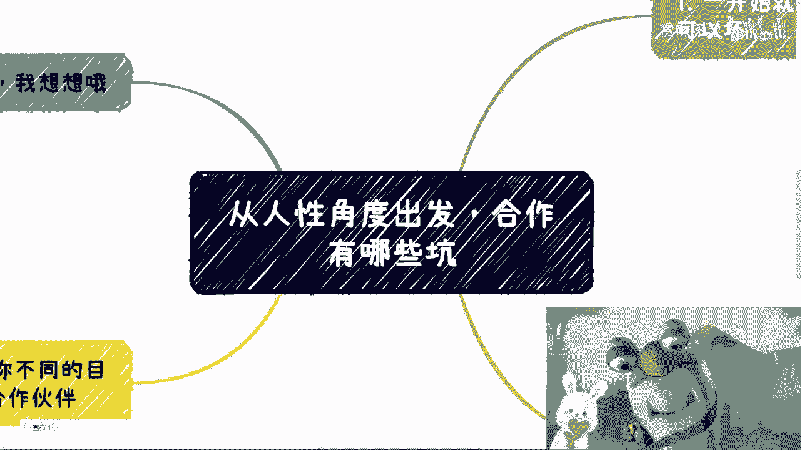

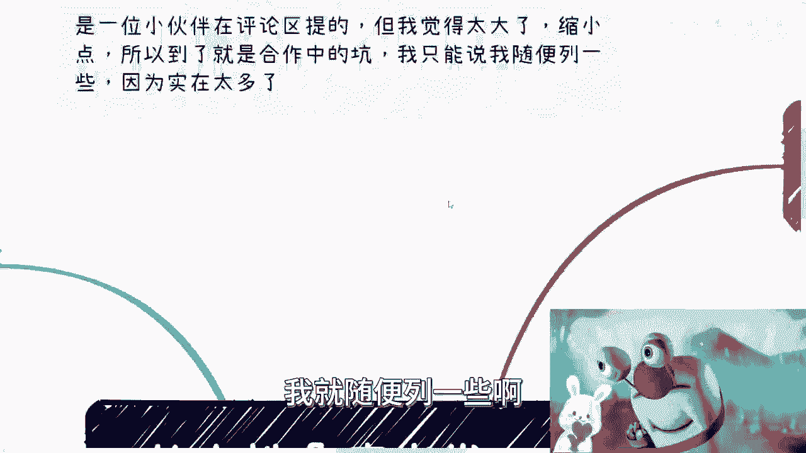

在本节课中，我们将从人性的角度出发，探讨商业合作中可能遇到的几种典型陷阱。理解这些陷阱有助于我们在合作中保持清醒，做出更理性的决策。

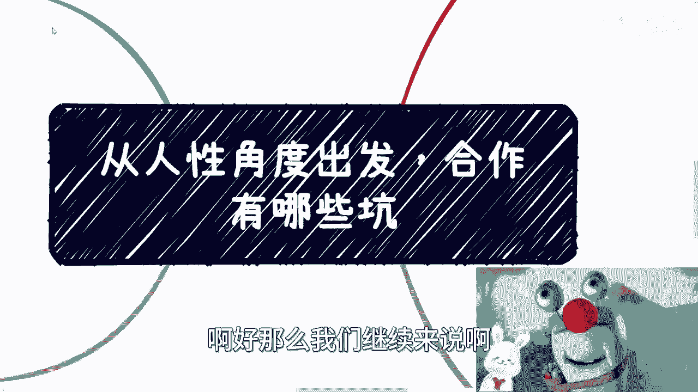

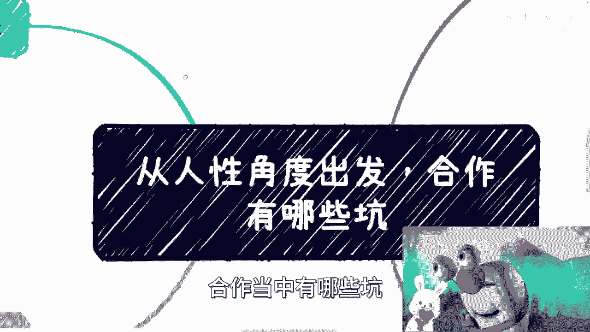

## 概述：合作陷阱的根源

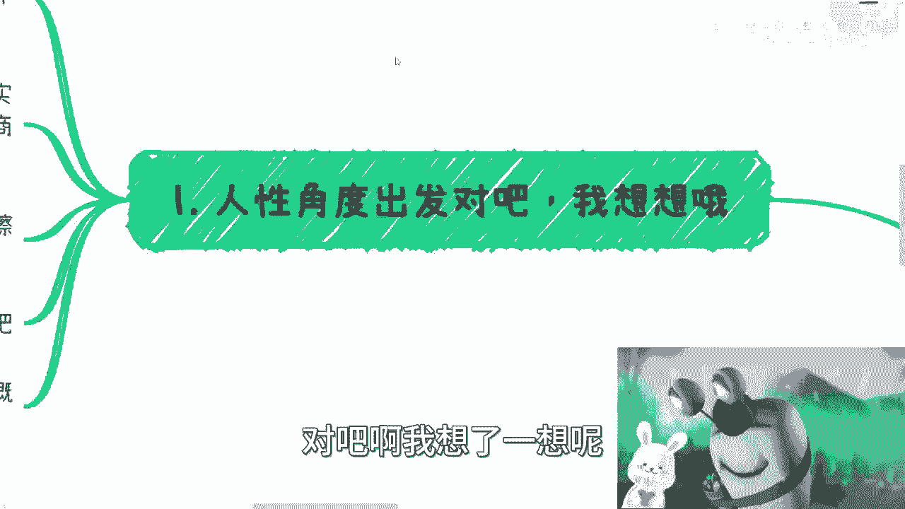

一位伙伴提出了“从人性角度出发，合作当中有哪些坑”的问题。这个问题范围很大，我将基于个人经验，列举几种常见的合作陷阱。需要明确的是，这些陷阱无法完全列举，且很多时候，如果对方真心想坑你，仅凭感性判断几乎无法防范。**核心原则是：保持理智，坚持合同与背景调查。**

---

## 陷阱一：蓄意设局者 🎭

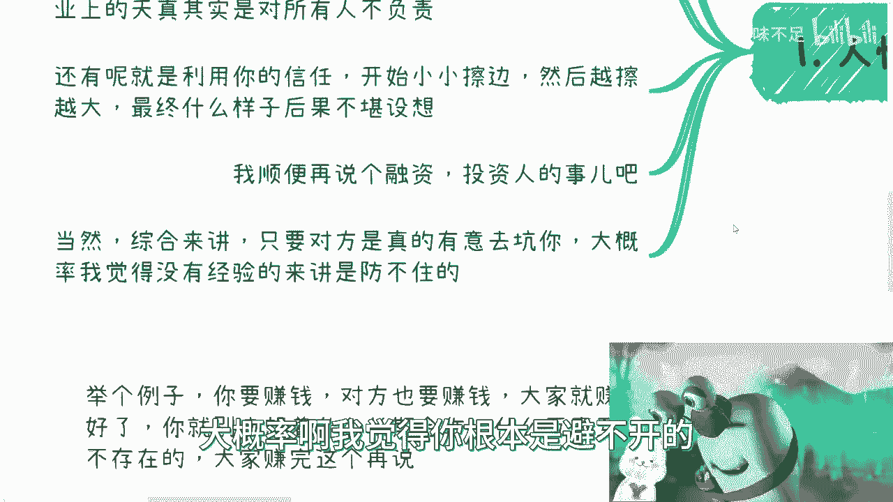

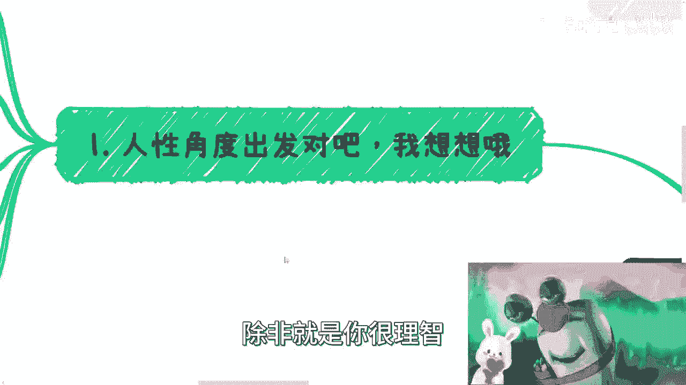

第一种陷阱的制造者，从一开始就心怀不轨。他们的目的就是利用你，让你成为背锅侠或廉价劳动力。

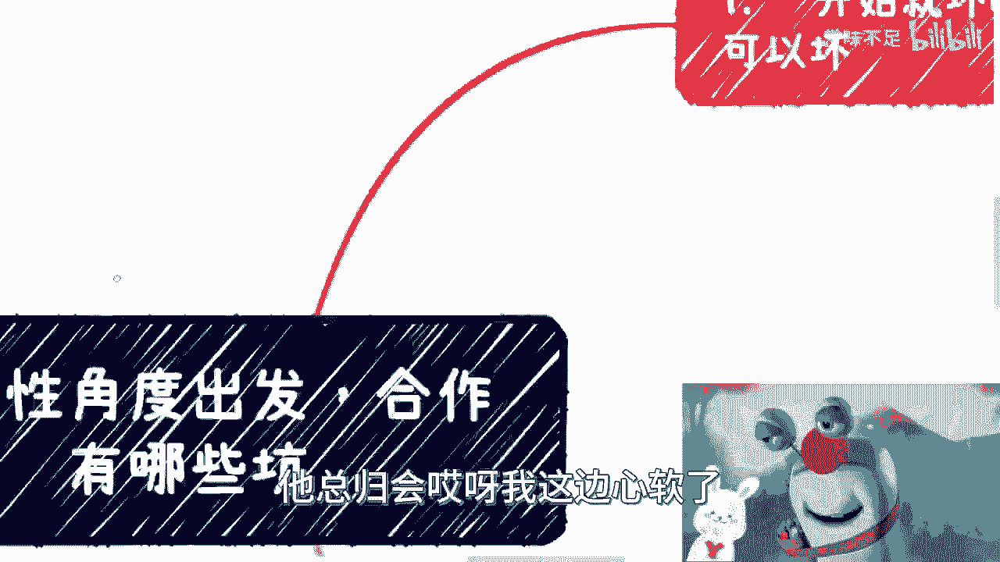

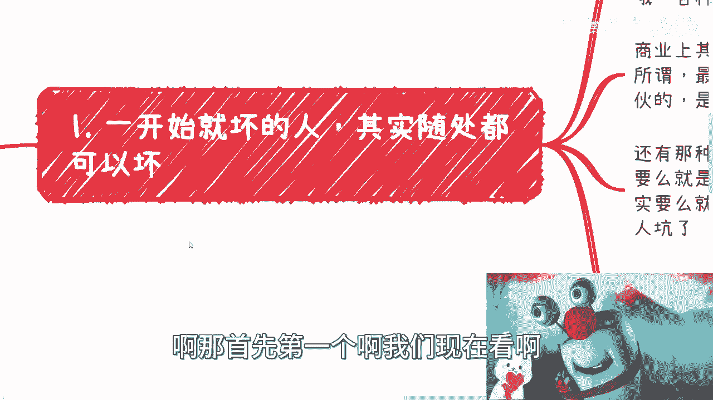

他们通常会描绘一个非常宏大的愿景（俗称“画大饼”），让你感到激动。但从客观或未来的经验来看，你会发现自己是被坑的一方。这类人的行为非常符合人性中“恶”的一面。

**应对策略：**
以下是识别和防范此类陷阱的关键点：
1.  **管住自己的钱**：切勿头脑发热进行投资或垫资。
2.  **仔细审查合同**：任何合作都必须有正式合同。许多蓄意坑人者并不真正懂商业和合同，其提供的合同条款（如用雇佣合同代替合作协议）往往漏洞百出，一看便知有问题。核心是：`一切合作以书面合同为准`。

---

## 陷阱二：以“善良”为名的危害 😇

上一节我们讨论了明显的恶意，本节中我们来看看一种更具迷惑性的陷阱：以“善良”为名。

在商业语境中，“善良”这个词往往是**完完全全的贬义词**。这里的“善良”可能指两种人：一种是故意用善良掩盖恶行；另一种是真心善良但天真，这在商业中是对所有人不负责。

**具体表现：**
以下是这种“善良”陷阱的几种常见形式：
*   **不赚钱的“善良”合作**：合作方很“善良”，但合作长期不盈利甚至亏损。此时你无法判断对方是真善良，还是暗中获利并给你画饼。
*   **无底线跪舔的“善良”**：不断无原则地讨好甲方或客户，即使对方只画饼、无合同、无实质付出。他们还会用“要对别人好”、“要看长远”等理由自我或对外PUA。这让人怀疑他们是否与对方是一伙的。
*   **自我标榜的“善良”**：这种人常把“我很善良”挂在嘴边。商业的首要原则是对自己负责，不赚钱的商业行为没有意义。这种“善良”往往是自我感动，并可能牵连合作伙伴。

商业合作的基础是**责任与共赢**，而非单方面的、无底线的“善良”。

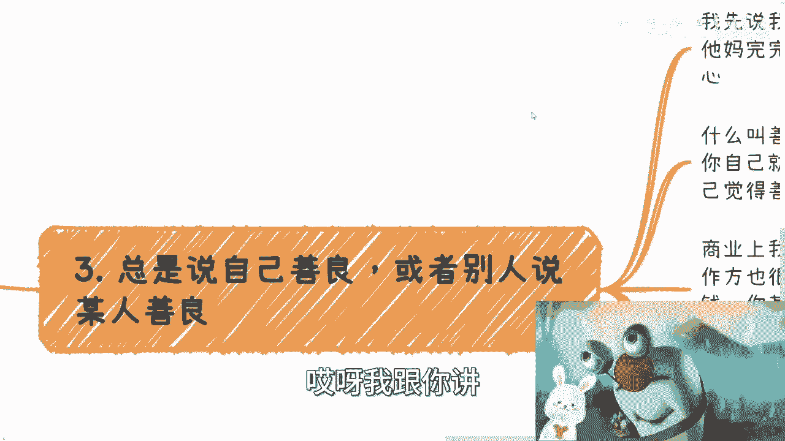

---

## 陷阱三：人与目标的动态变化 🔄

我们讨论了固定类型的陷阱，但人性与合作本身是动态的。本节中我们来看看因“变化”而产生的风险。

人是会变的，不同的合作目标需要匹配不同的合作伙伴。

**核心逻辑：**
*   如果合作目标只是**短期赚钱**，那就专注于当前项目（case by case），不要过早幻想长期深度绑定。
*   **长期的、互惠互利的合作**，需要双方在商业认知和三观上都足够成熟且一致。但这对于处于成长期的伙伴而言很难遇到。

在成熟之前，人的善恶可能在一念之间发生变化。你非常信任的发小，也可能因一个错误决定将双方置于险境（如法律风险）。你无法用一念之差去定义一个人，但商业上不能承担这种不可控的风险。

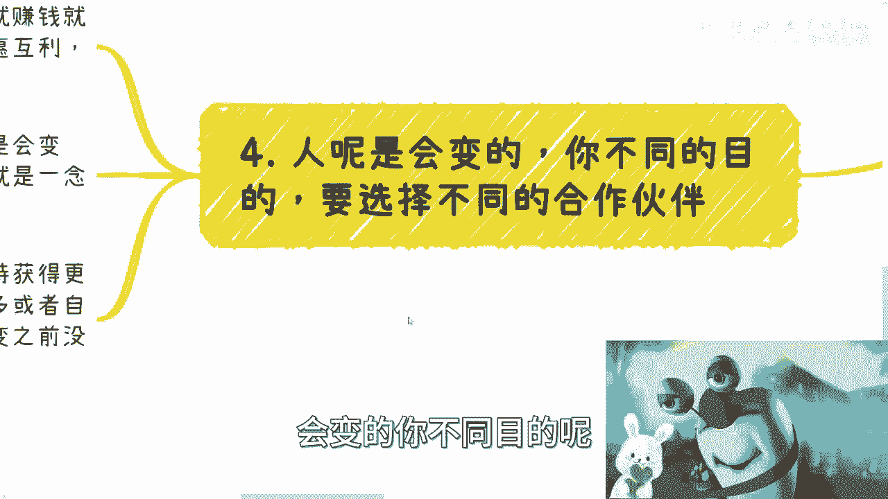

因此，与不成熟的人合作时，期望获得稳定、深度的信任或超额回报是不现实的。**公式可以概括为：`合作稳定性 ∝ 合作伙伴的成熟度`**。

---

## 陷阱四：融资中的必然“利用” 💰

最后，我们简要谈谈融资中的特殊“坑”。

在寻求融资时，创业者很容易对资方产生敬畏。但经验表明，在很多情况下，创业者就是资方的“工具人”，甚至对方会明示这一点。

这算坑吗？**是**。但这是商业世界中长期存在、且很多时候你不得不主动去踩的“坑”。区别只在于这个坑的大小。当你选择融资这条路径时，在一定程度上就接受了这种不对等的游戏规则。这涉及到**取舍**：是坚持所有细节的自主与尊严，还是为了获取资源和发展机会而做出妥协。

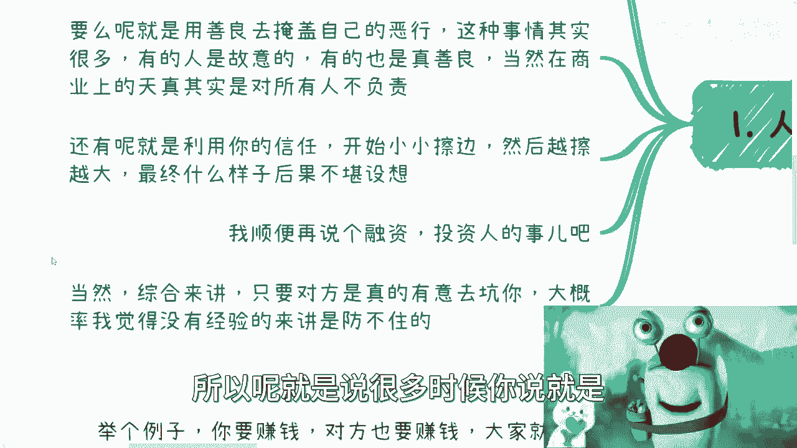

如同赛车，胜利不应只局限于你擅长的弯道技术；在商业上，要向上发展，面对各种资源方时，也需要有战略性的取舍，不能过于拘泥于所有细节。

---

## 总结与建议 📝

本节课我们一起学习了从人性角度出发的几种商业合作陷阱：
1.  **蓄意设局者**：警惕画大饼，守住钱袋，严审合同。
2.  **伪“善良”**：商业中无底线的善良是贬义词，合作需以责任和共赢为基础。
3.  **人与目标的变化**：根据合作阶段选择伙伴，对不成熟的关系保持合理预期。
4.  **融资的利用**：认清某些“坑”的必然性，在战略发展中做出必要取舍。

**核心防御机制**始终是：**保持理性、坚持书面合同、进行背景调查**。感性决策是大多数陷阱生效的前提。希望本课内容能帮助你在未来的商业合作中更好地规避风险。

（广州线下活动尚有少量名额，可深入交流。如有具体合同等问题，也可进行针对性探讨。）