# 从医学生到医师那些必须要知道的信息差！ - P1 - 赏味不足 - BV1GV4y1a7MB

啊这个我们欢迎这个今天我们的热心网友，热心网友来给我们讲一下这个医学生啊，医师对吧，这个相关的一些内容对吧，然后呃你要不要说一下，你简单说一下，你是现在这个在在在医学生感医师啊。

在医生这条路上是个什么情况好大家好。

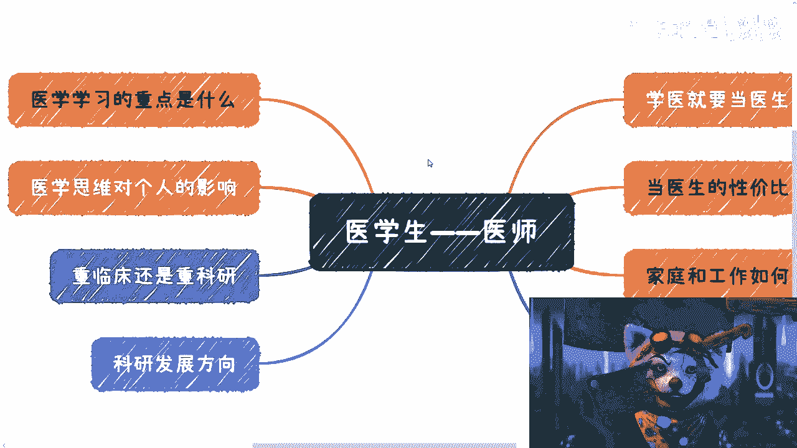

我是热心网友，然后我今天跟大家分享一下，就是作为一个医学生到医师啊，这个过程中遇到的一些呃问题啊。

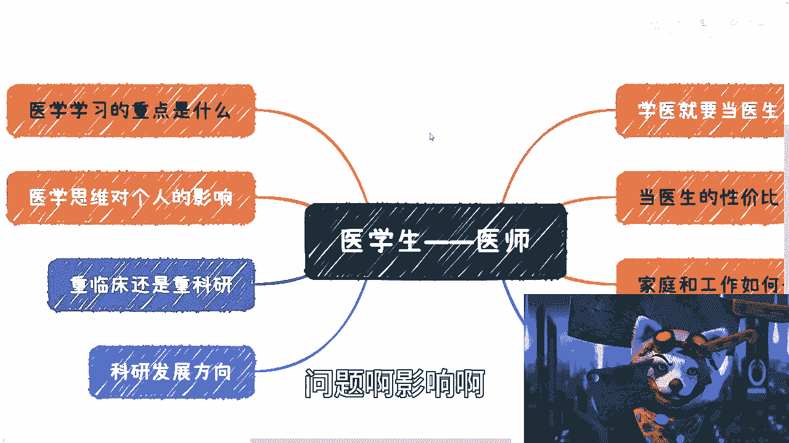

影响啊，然后我自己的一些经验的总结啊，然后刚刚针对沈总说的这个问题呢，嗯其实我现在是处于一个医学生，然后研究生已经毕业了，然后也已经完成了规培嗯，但是我现在并没有从事啊，在医院里面工作这件事情。

然后面具体的一些东西的话，我们还是在具体内容里面再展开啊。

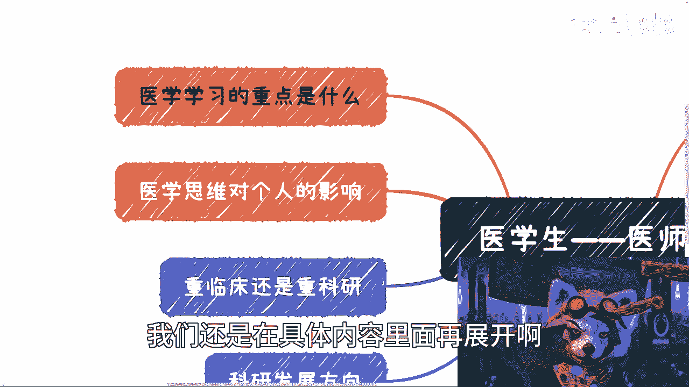

上总哦，好的呀，那那就先从这边一个来好吧。

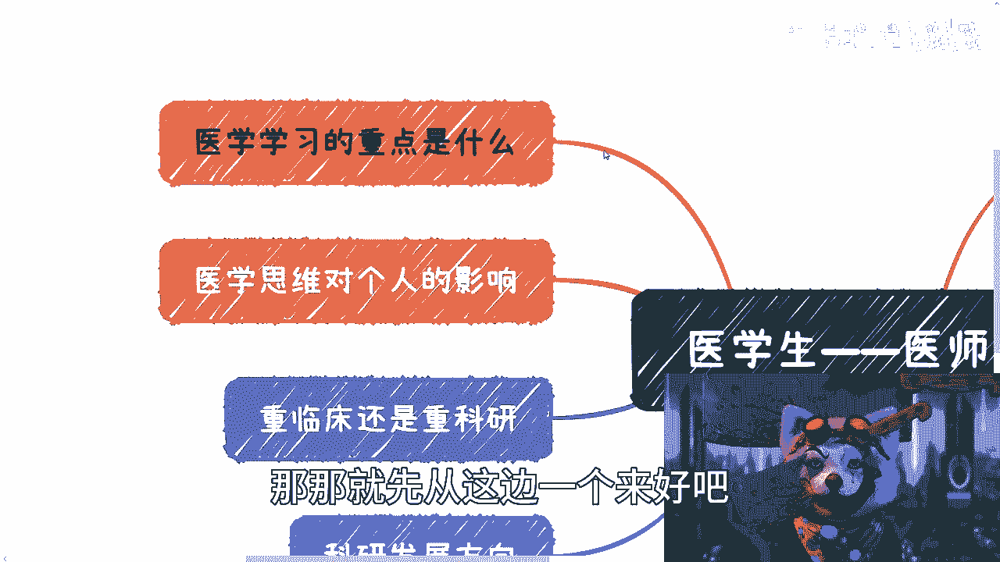

医学学习的重点是什么。

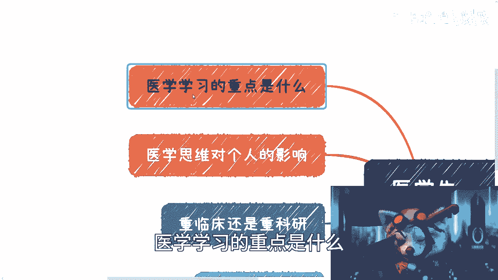

反正我不懂，呃其实这个主题我当时放在这里的，是因为我也看到说今年像是医学的呃，专业高考报考的人数挺多的嘛，嗯但是其实很多同学对这个医学，并没有一些深入的了解，他们只是说看到可能当一个医生。

有一定的社会地位，然后工作可能出来会比较稳定啊，然后是相当相当于其他工作来说，是一个比较好的一个岗位吧，嗯但是呢其实我们在这个医学的学习过程中，我们要学习的东西还是蛮多的啊。

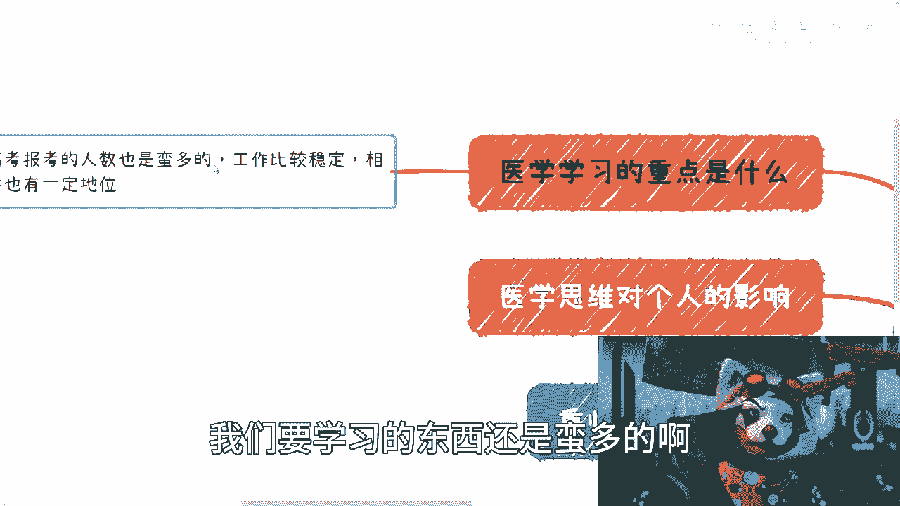

医学学习的重点是什么，针对于大家所知道的内容。

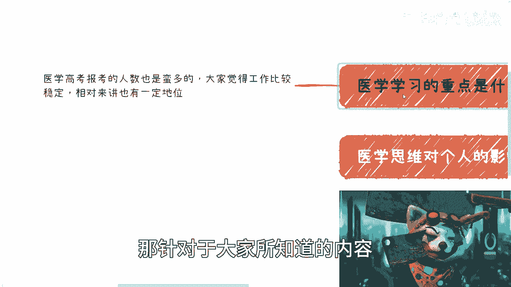

我们就不要多说了，比如说我们要学的最基本的一些医学的知识啊，什么解剖啊啊组胚啊，然后内内科，外科这些是我们都要学习的，最基本的一些基础理论知识，这个是在本科阶段我们要学的嗯。

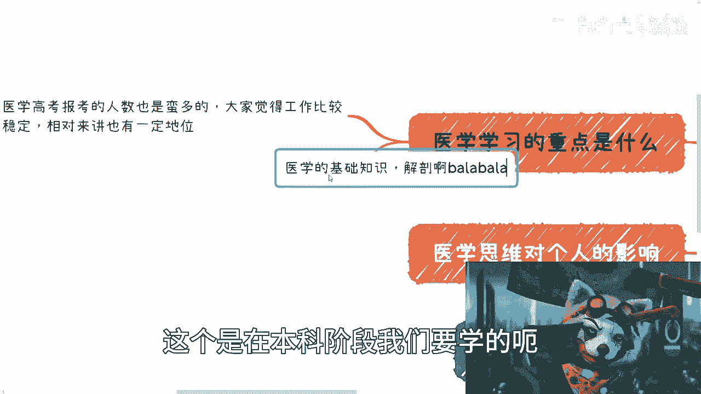

但是到了啊比如我们研究生阶段的时候，那就和本科阶段不太一样了，本科我们是打基础，到了你到了研究生阶段的时候，你就会开始分科了啊，你是想要从事哪一个，比如说内科里面你是想要从事啊，心内科，神经内科。

还是到了外科里面需要做手术的，还是说我们去一些辅助的检查的一些科室啊，这个是到了研究生阶段，我们要进行一个专业的培训嗯。

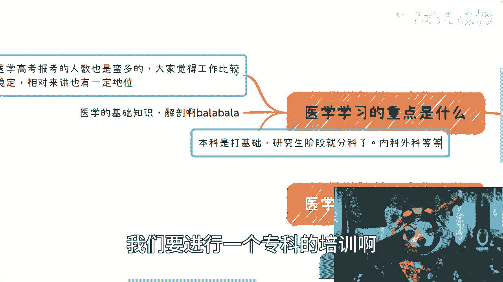

然后到了博士生阶段的，我们的学习就不再仅仅限于说医学方面，临床上一些的东西，可能更深入到具体的某一种嗯，探究性的一种学习过程啊，当然我们这个过程其实是说，从比如说你从本科生到研究生到博士生。

这个阶段逐渐累积开始，从最最开始的打好一个基础，慢慢得到啊，碰到了一个具体的问题。

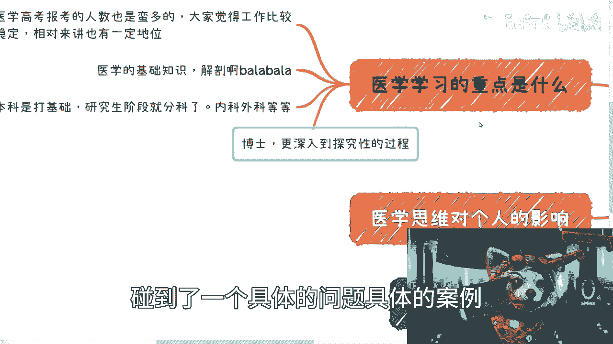

具体的案例，具体的分析，然后到开始自己去嗯，成立一个课题，做一些研究，然后发现一些新鲜的东西，嗯所以如果我说医学的学习重点是什么。

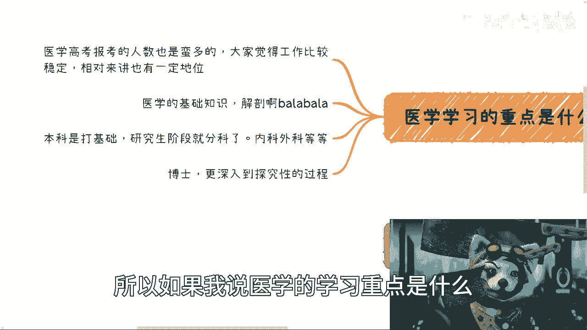

其实它是你一个医学思维培养的模式呃。

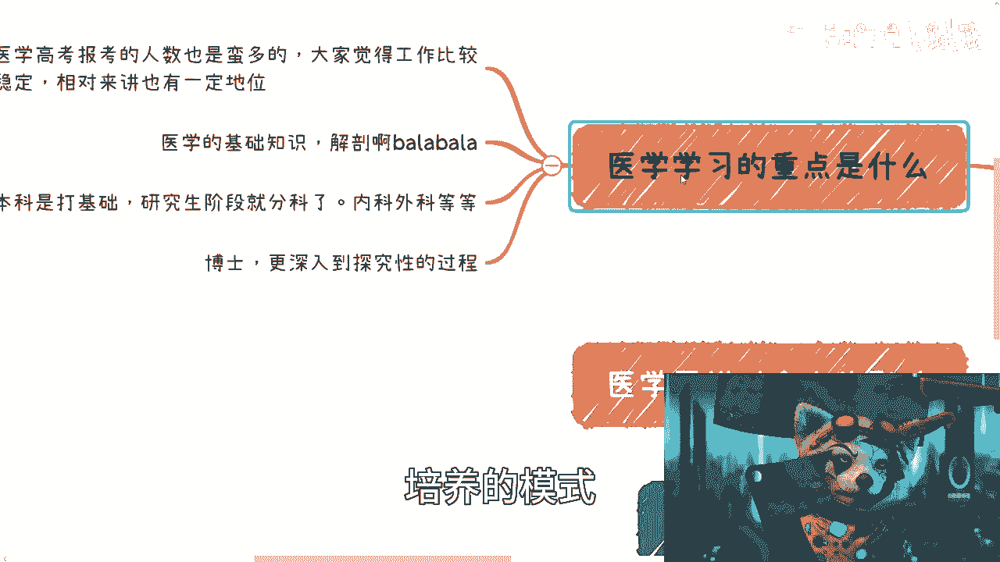

从最基础的理论到你去发现探索问题，解决问题，到最后变成一个系统性的能力的培养，也可以锻炼你这个医学思维的一个呃，对你这个思维也有一种不同的启发，因为其实我们医学的思维的话，可能更偏向于循证医学。

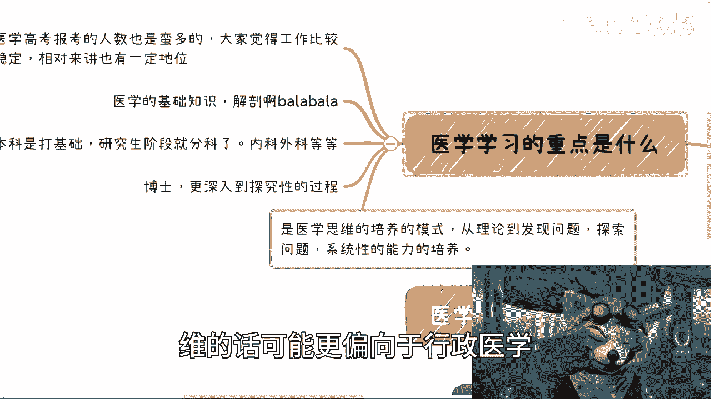

就是说你看到了某一个具体的情况，你会根据这个情况，比如说这个呃某个指标，然后你去探索，为什么说这个指标会变成这个样子，能是什么病，什么情况影响了这个问题，他这个思维是一个不断去发现。

不断去挖掘的一个过程，呃然后医学学习的重点呢，除了我们刚刚前面讲的一些理论啊，探究研究性的问题，另外一个就是我们一个是心理上的一个学习，呃，因为你作为一名医生的话，你首先这个心理的呃。

嗯心理的情况是要比较稳定的，你作为一个医生。

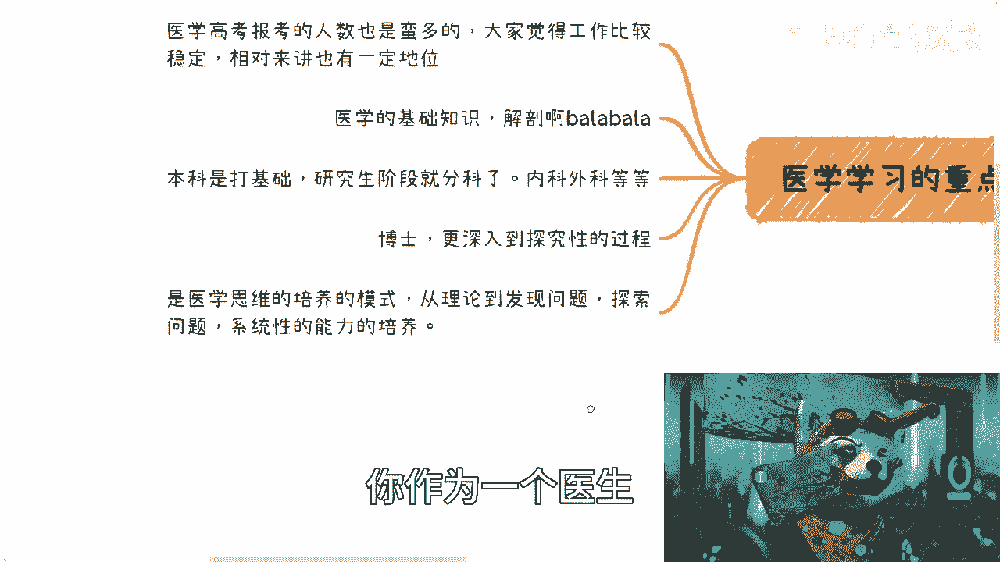

你要给你的病人，一定的心理上的力量的支持和扶持，嗯病人对于呃医生来说是相对一个脆弱的群体，他们可能会对你投入很多的呃各种问题。

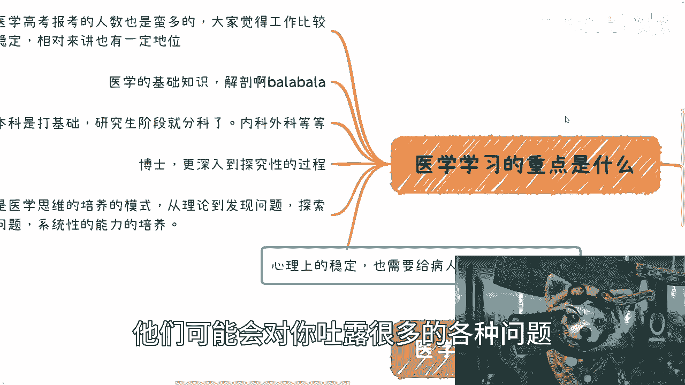

然后这个时候，然后我们有些医生，可能这个情绪上不会特别的热情，然后病人可能就会感觉不是特别的开心啊，所以我们有一门专门的课程叫做医学心理学啊。

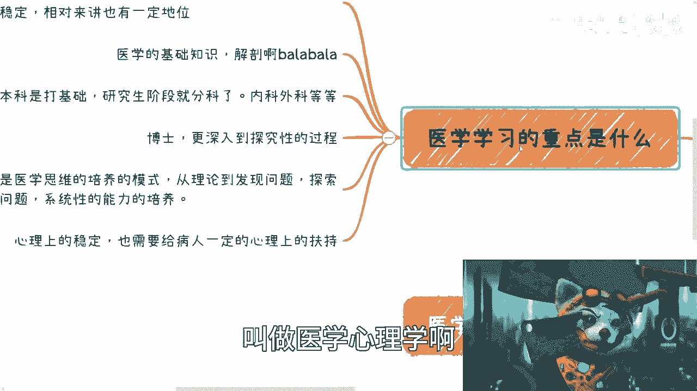

也是需要我们啊医学生去学习的，另外一个呢还有就是我们体能上的一个学习，为什么要这么说呢，啊比如说我们的外科医生，外科医生他们非常的辛苦啊。

啊可能早上一早上就进手术室了，到了晚上可能凌晨才能出手术室，那这样子的话，对他们的一个体能的考量就是非常的重要了啊，所以我们对于这个体力上的学习，也是非常的有必要性的。

呃比如说中医的话，像是呃可能一些针灸科，推拿科。

他会要求你有一定的功法的一个训练啊，这也是为了你在临床上能够有足够的气力，去和我们的病人打交道，然后做一定的治疗啊，大家也知道这个医学其实到了到了到那个医生，当临床的一个阶段的时候。

呃可能这个工作的呃任务啊就变得非常的多。

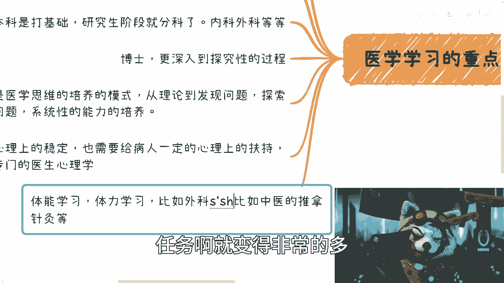

而且比较繁重，所以如果医生自己本身身体情况不太好的话呢。

呃其实对于呃整个工作来说也会有一定的损耗。

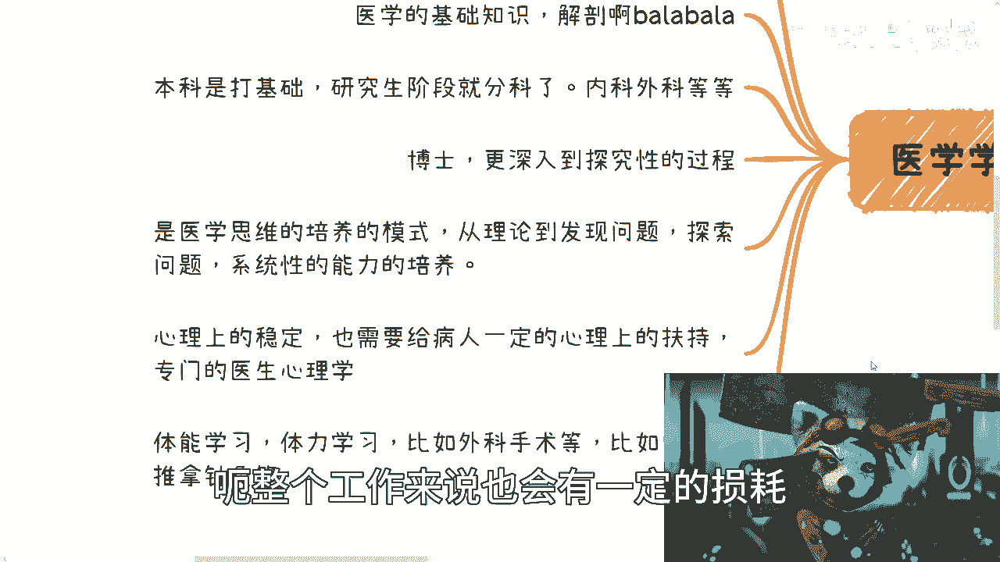

还是更希望我们的同学在呃不仅是知识啊，然后心理啊，然后呃体力啊，各个方面都有一定的发展。

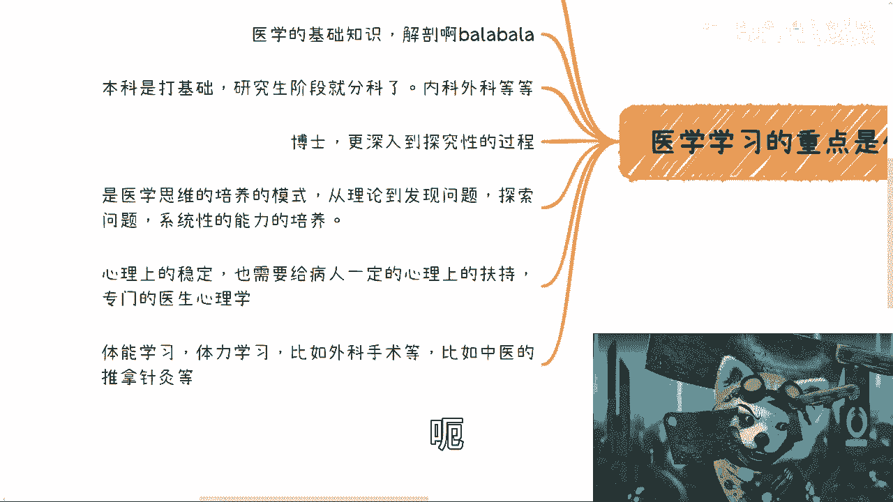

该学的学习重点暂时先讲这么多吧，后面可能还会有其他的内容补充到哦，哦哦这个学学学个一不但要学历好。

还得要德智体美劳，这个有点难度有点高啊。

但是他确实是一个非常综合性的学习，它不是单纯的理科或者工科。

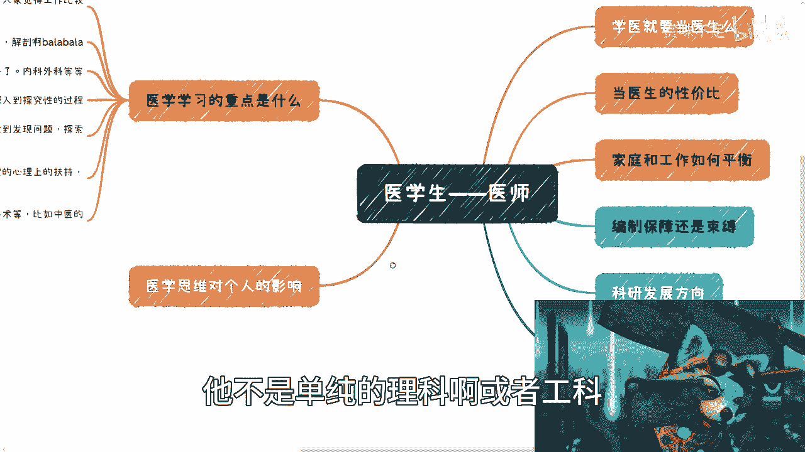

毕竟他是单独独立出来的医师嘛，哎呀你看这个这个东西写着写着。

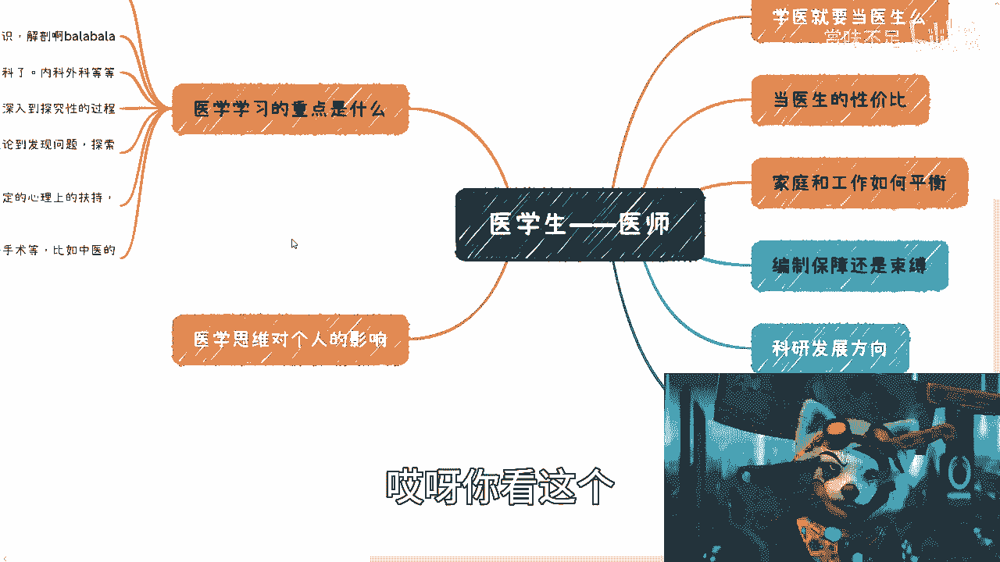

他把外面挤过去了，我们不管他们先这么着吧。

没关系，反正最后大家看一个完整的一个版图，就可以了哦，好那这个医学思维对个人的诶。

这是第二个吗，对这是第二个啊。

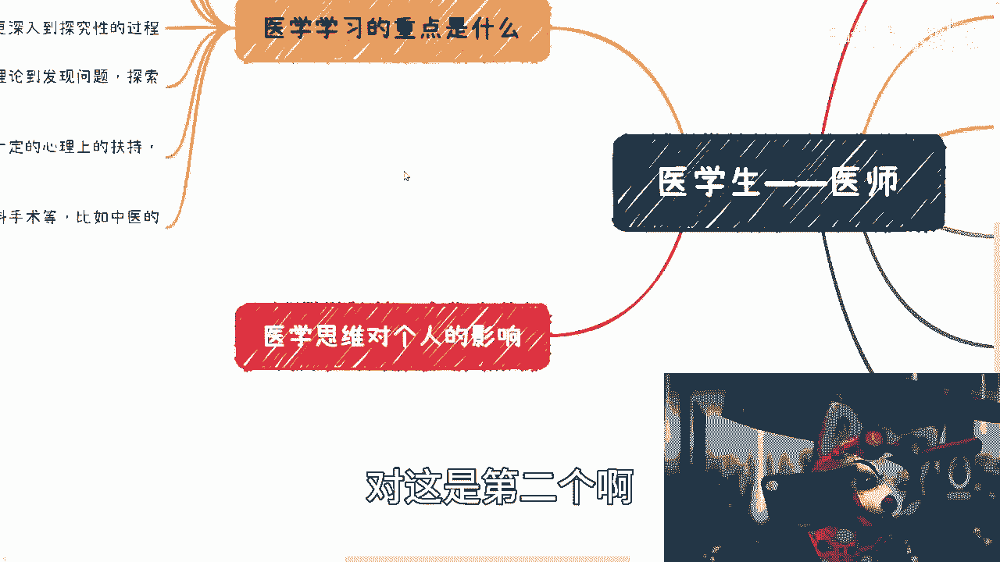

第二个好思维影响嗯，嗯然后说一下这个医学思维，刚刚其实讲到医学学习重点的时候，有稍微提到过一点点嗯，但是这个具体的这个思维是什么一个情况呃，我们首先我们打好了一个基础的知识以后，那我们要做的就是。

如何把你知道的这些知识应用到临床实际当中，嗯那那如果看到了我们啊具体的一个病人，他跑过来找你了，你有什么问题需要解决，什么疾病需要去帮他看好啊，那怎么去做这件事情，就是我们需要去锻炼的这个医学的思维。

我们有一门课程叫做循证医学行政，我们理解一下嘛，就是按照他给出来的一些表现，对不对，去解决相应的这些问题，在这个过程啊啊循证医学就是双人旁那个群，然后正是言字旁的一个嗯循证医学，循哦这个是吧啊，这个。

嗯第二个第二个第二个啊，哦正确的证啊，这啊这个啊对哦，Ok ok，好你继续说，嗯就是说我们要下一个诊断，说比如说它是高血压或者他是心脏病，那我们为什么要说它是高血压心脏病，那肯定是有原因的嘛。

那我们就去收集这个关于这个病人，他一系列的症状体征，这些在我们看来就是证据，首先这个病人为什么不舒服过来的对吧，这叫主诉，然后他最近这个以色列的这个病情的发展情况，现病史是什么样子的。

那既往有没有类似的疾病啊，然后我们做了什么检查啊，什么像是影像学的检查呀，或者你去抽血验了血的报告，有什么东西，或者有没有家族史，个人史这些一个个对于我们来说，其实是来发现这个问题的证据啊。

然后我们就针对这些证据说哦，我发现了这个啊，这个人血压高的家族有遗传史的，完了我们就知道这个人可能这个就是血压，血压高了高血压了，然后我们再去根据这个原因去分析说。

因为高血压它也有可能不同的因素导致的嘛，那我们找到了这个原因以后呢，我们再去对症治疗啊，那这个就是循证医学一个比较简单的一个讲法，那这个思维的锻炼，其实呃有点就是抽丝剥茧的意思嘛。

我们周期不断的发现问题去解决问题。

所以我们就会比较喜欢，非常直接的去讲这些内容呃，如果一个病人过来了，我们更希望这个病人说啊，我是那么早不舒服，不舒服了几天就很清晰的讲就可以了。

而不要说给你长篇大论讲了一大段话，那我们就要从这一大段话里面去提炼，这个重点啊，我们一般性这个主诉可能只要20个字以内，那么我们就希望他能把最重要的，主要的矛盾点说出来就可以了，然后比如说其他的见证啊。

次要矛盾，我们就可以放在后面的一个定式里面进行补充。

所以这个医学的学习，使得我们的这个思维会非常的直接，就直接去找这个问题的所在在哪里，然后抽丝剥茧的去解决这个问题就可以了，但这样子也会导致我们可能对其他的东西，关注会比较少。

我前面讲那个就是医学的学习重点的时候。

也讲到，我们还需要一个心理方面的一个学生，一个学习。

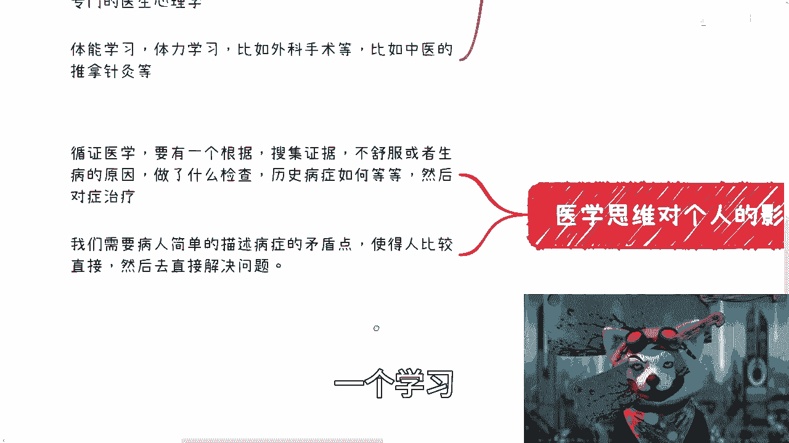

有的时候我们思维比较直接以后，你可能就顾及不到其他人情绪上的一个变动，这可能精神科的医生可能看的会多一点，但是其实像内科的很多疾病，好像是比如说他有些说觉得胸闷啊，心脏不舒服啊。

她很多你可能在气质上检查不出来有什么问题，可能就是情绪上引起的一个毛病，那这个也就需要我们去对这个病人有一些感知，嗯然后医学思维还体现在一个什么方面，就是说我们可能会把这种思维不只是局限在嗯。

对病人的一个治疗上面，可能对于我们其他的一些事情，也会有这种习惯性的思维去思考，说这件事情为什么会发生，后面要怎么去解决它，呃这种思维如果对于我个人来说呢，我觉得还是比较好的，因为你会非常的认真。

但是对于呃可能在某种环境之下呢。

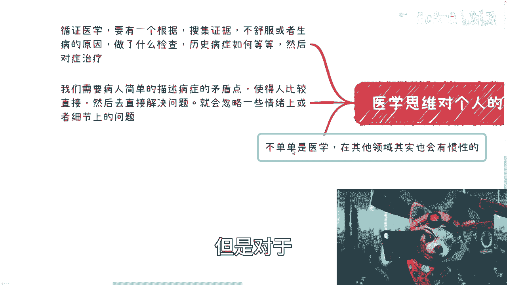

可能会变成不是很好的事情啊，如果大家都比较喜欢躺平，那你这样子的情况就不是非常的贴合大众了，好下一个哦。

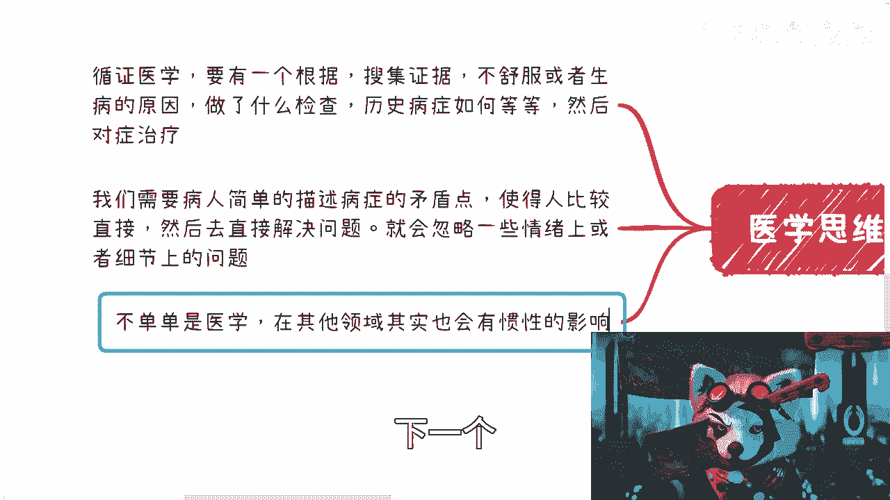

惯性影响，对这个这个其实之前我我跟你那次聊的时候，见面的时候聊的时候也提也提到嘛，反正就是这个怎么说呢，就大家都想解决问题的时候呢，都没问题，但凡这个只有你想解决问题。

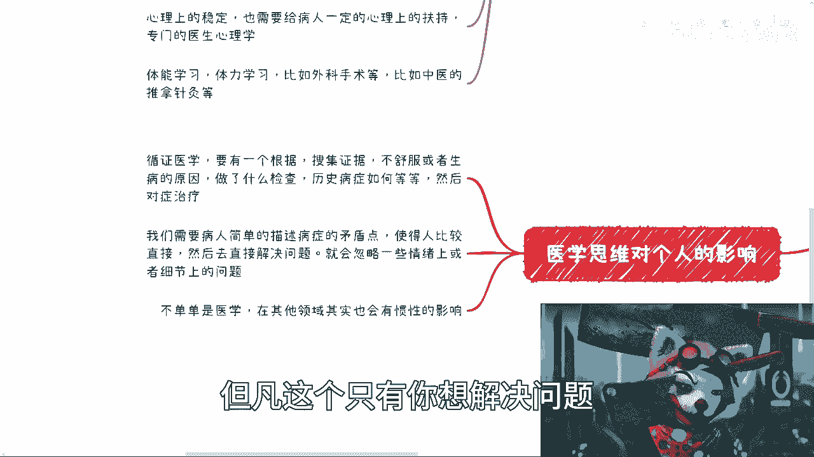

别人不想解决问题对吧，那可能就就就不好搞。

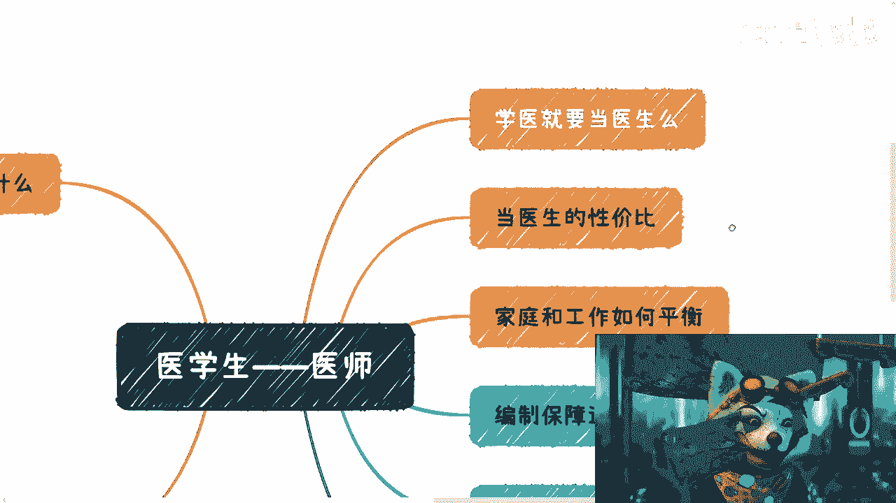

这个第三个刚刚是啥来着。

这个这个这个这个嗯，你往下一点应该跳到后面去。

科研发展，对中就科研发展吧，科研发展好。

科研方向的发展啊，对为什么讲科研这个东西，其实嗯科研其实对于每一个专业来说，都非常的重要，但是对于医学来说可能特别的重要，因为不管你是在呃嗯临床上面啊，然后你毕业啊。

然后以后当了医生以后进职称啊，都会有一定的要求，而且因为大家其实医学是一个比较卷的专业，你光本科学历肯定是不太够的。

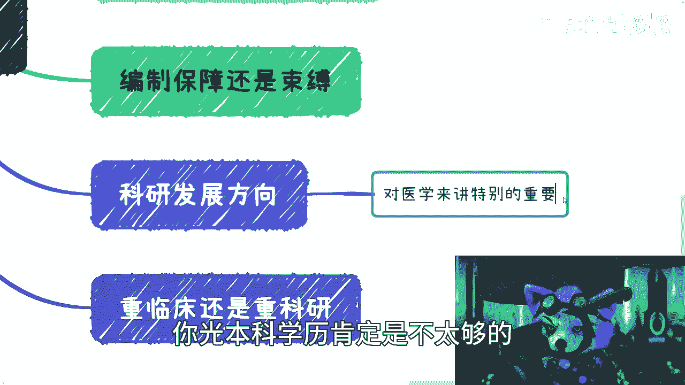

如果你想要最好的医院的话，硕士现在可能也已经不行了。

至少要博士了，现在呃，所以如果你要达到这些要求，那肯定在同等的条件下，大家肯定就会看你科研能力怎么样，所以科研的要求的话其实是呃比较高的。

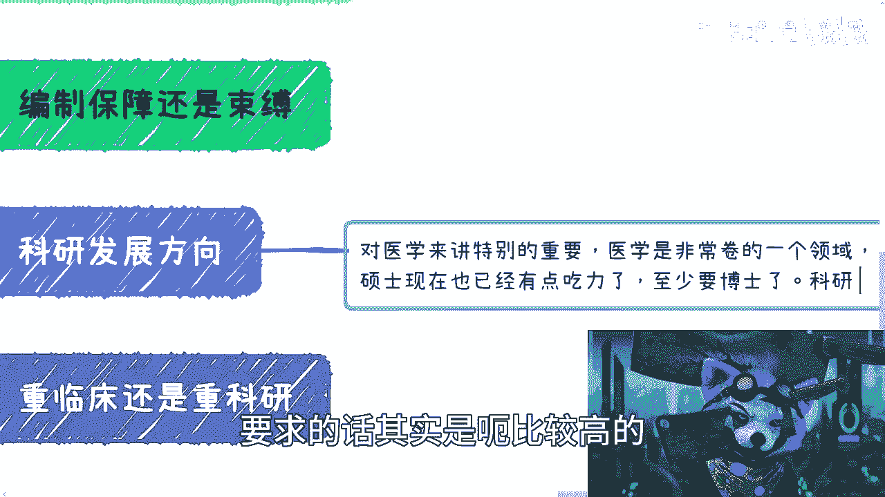

而且因为科研怎么说呢，大家这个科研研究的方向，其实大家就是如果学生越多，他科研方向其实真的少。

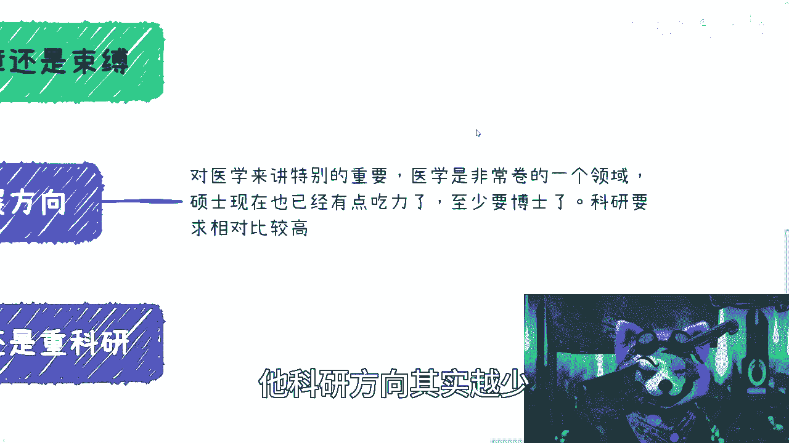

就是分配到每个人手上的就越少，科研的资源也就越少，所以这个方面要看一个是你的导师怎么样，另外一个也要看你自己给不给力了，科研的话嗯其实我们有一句话的话是说，临床其实是在减那种生物那方面的。

剩余的一些资源，然后如果像是中医专业的话，其实是在减呃，西医临床台湾的那些资源。

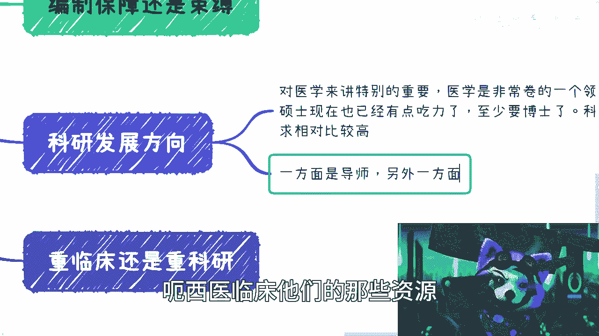

其实这个发展的话还是有一定的局限性的。

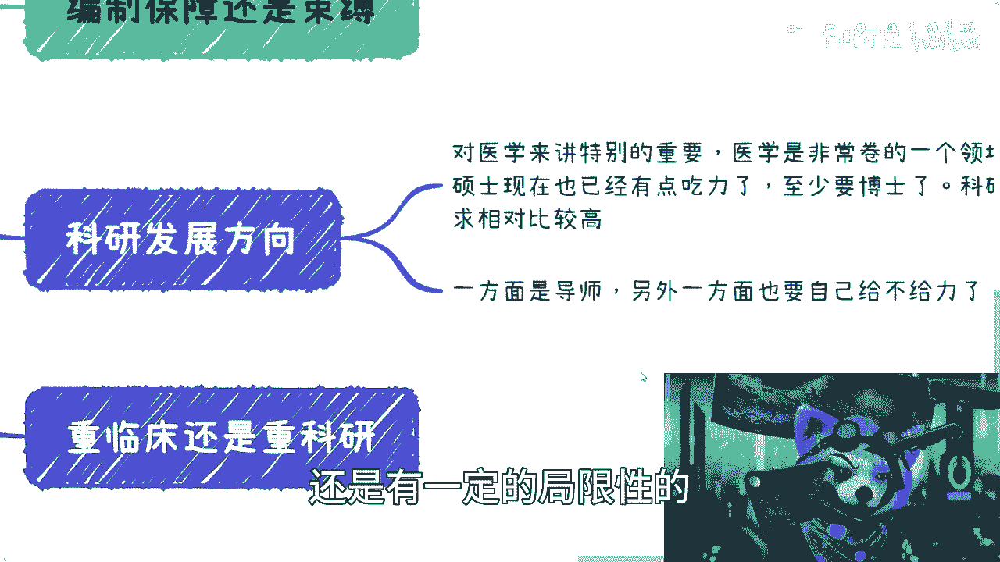

但是我们科研发展又不能不去做，因为它是有硬性的这种指标和要求，他也会变成呃，大家就是有一些同学可能从呃学生转到医师，这个过程中，可能会被这件事情所绊住，也可能会因为这个事情而感觉不是那么的开心。

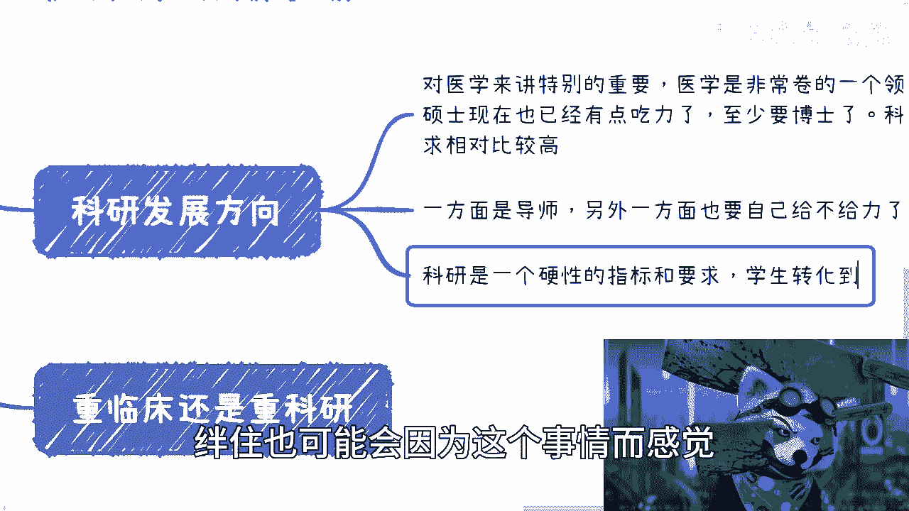

因为灯里除了毕业了以后，你哪怕到了临床以后，你还是继续的得不断的去做这方面的科研研究，但是这样子的话，就会非常的分散你的这个经历呃。

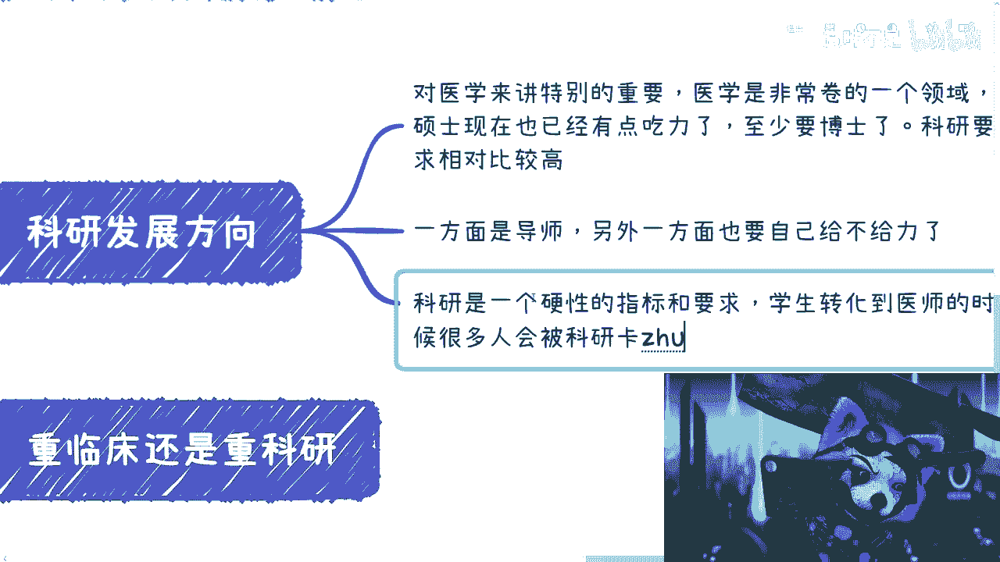

你要做科研还是做临床，这会有很难取舍，这就是我们下面一个问题。

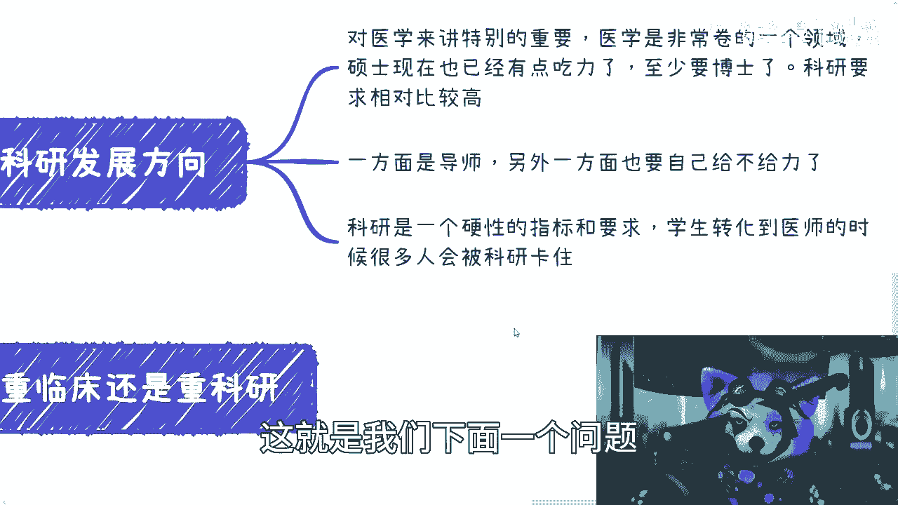

这种科研还是重临床的问题，因为我们很多医生进职称的时候，他是有异性指标的嘛，你必须要做到多少多少的呃，科研SSTI有多少多少分，然后这样子他们才可能会给你一个聘礼的，一个基本条件。

达到了以后才可能会给你这个岗位。

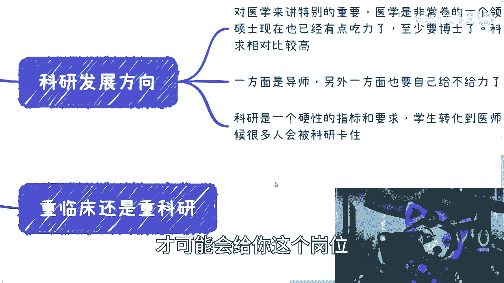

那这样子的话，我们很多同学他毕竟人的精力是有限的，他没有办法兼顾到，你这个临床和科研到底该怎么去办，尤其是我们刚进去的医生，他就会要求你，比如说你一年来一篇核心，一年来评SCI，他就会有这种硬性的指标。

那这样子的话，那那咋整，这个我问一下啊，就这个东西就是不管是未来他要往临床方向走，还是科研方向走，按照你刚那个说法，是不是说就是我选是未来可以选，或者可能有不同的路，但是不管我选哪个。

反正原本就是我还是得要在科研上，本来就是要有一定的成就是吧，嗯因为我们现在其实很多毕业，他要求你就必须已经要开始发核心的文章了，所以他这其实算是最基本的要求了啊，当然除非你是说你去稍微偏一点的乡镇。

可能这方面的要求还不是很高，但是你到稍微好一点的医院啊，好一点的城市，他就会对有这个有要求的，而且你科研做得好。

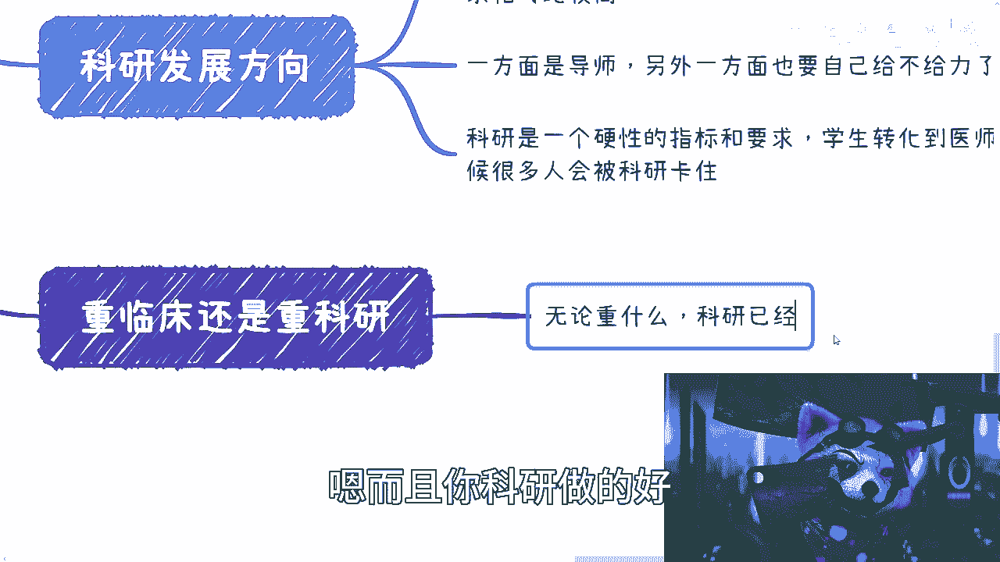

他可能还会给你奖金啊，什么是这样对，而且因为因为不不仅是你个人的评级。

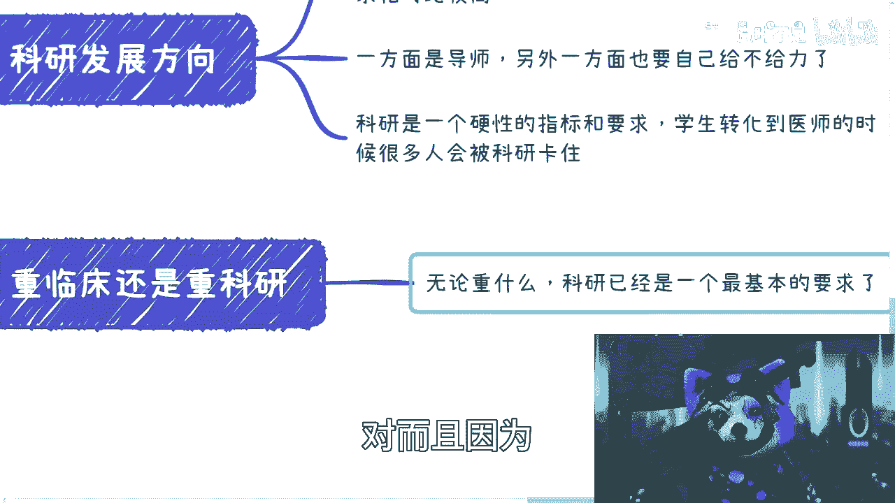

然后医院的评级他都会有要求，你有多少多少的科研成果，然后继续说这个重科研还是重临床的这个问题，因为其实很多医生就是刚刚进去的小医生的话。

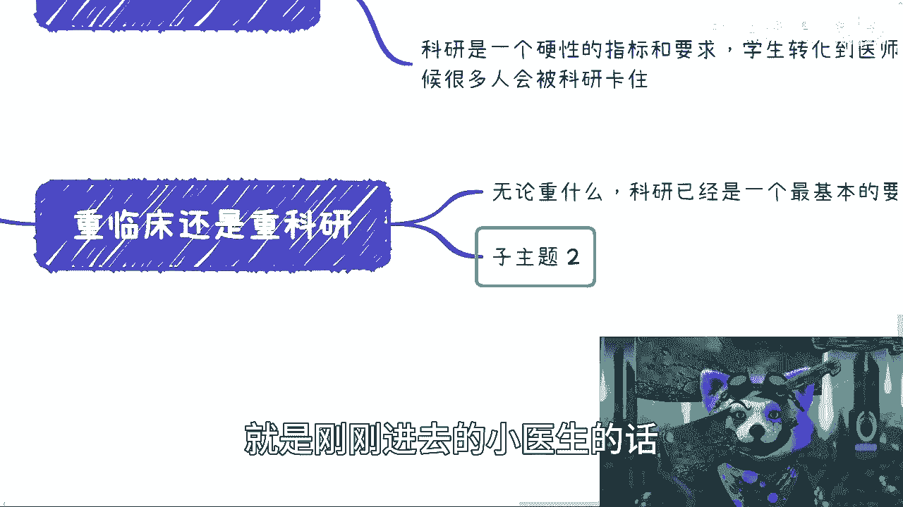

其实所有的工作都在他们的手上，一方面是他呃，那毕竟是一个新人，然后他的工作肯定是比较多而且繁杂的，然后在这个情况下，其实医院还会要求你有这种科研的任务，这样你这个精力肯定是会分散出去的，就这样子呃。

有一些大神我们就不说了，大神肯定是都能兼顾，非常厉害，对不对，凌晨起来看文献什么的肯定很多嗯，但是还有很多人，他就是因为只是想专门做临床而轻视的科研。

因为他没有时间，他没有精力去做这个事情，你一天管十几个病人的床位，还要写病史，你每天忙到晚上七八点啊，可能是这样，晚上10。21点之类的，还有值班，你就没有时间去连续性的去做这个科研的项目。

你只能放在周末或者放在节假日，你有空的时候。

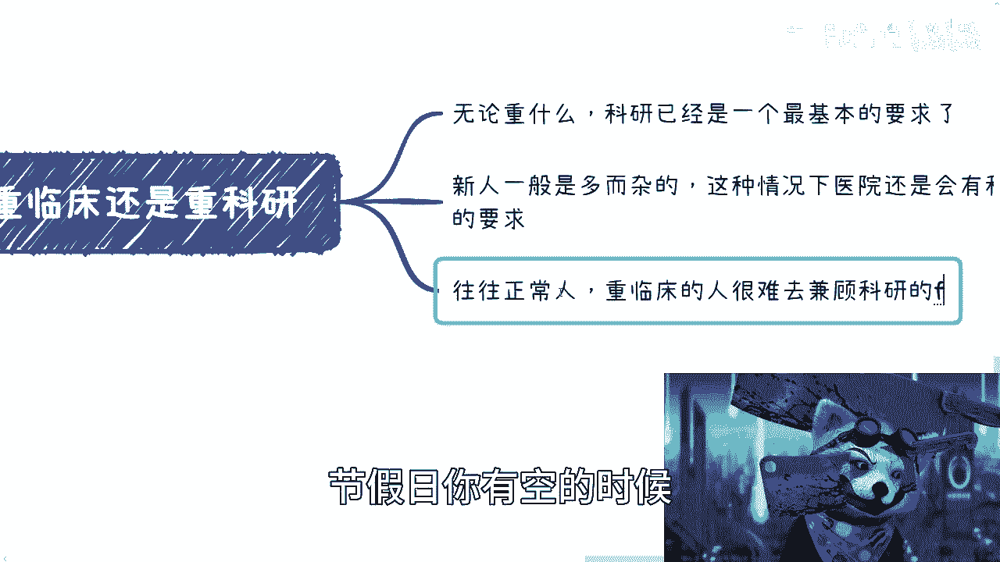

但是科研，不管你是做临床科研还是做我们动物实验，都需要有一个连续性。

一段时间是固定的，那这方面你就必须把这个经历挪出来，对于这种小医生的话，他其实并没有其他的资源来帮你去做这个事情，如果你是在一个大的课题组里面，你可能会有其他的导师的研究生或者实习生，来帮你做这些事情。

分担一点基础的工作，但如果你是你自己的项目什么的话，你其实资源比较少，你就必须自己去花精力做这个事情，但是呢定职称的时候。

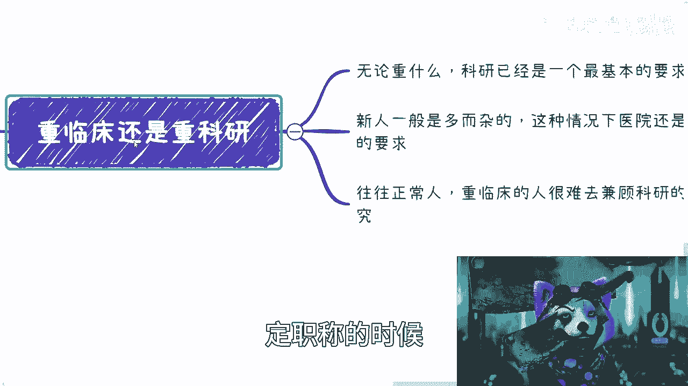

他可能会更偏向于看重你的科研的成果，那如果基于临床的这些医生啊，那他就没有这么多的科研成果，那他就比比不过别人了，那他只能就被排到后面去，那如果这种情况下，可能，更多的医生。

还是会倾向于去做多一点的科研项目，那这样就肯定会分散出去你很多的精力，另外一个是说我们因为现在有一个当医生的话。

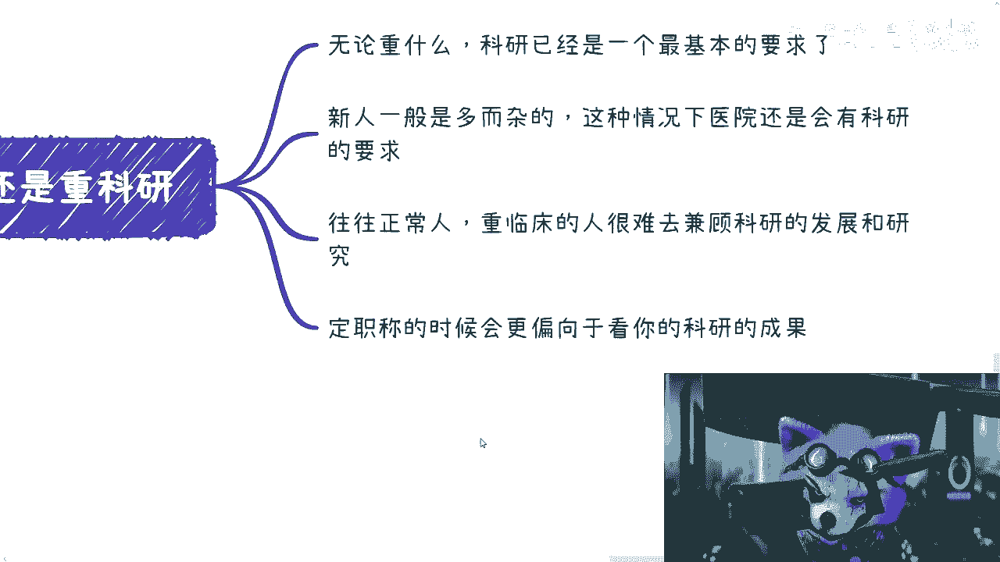

是需要经过规范化培训的，那规范化培训的很多是嗯我们叫医学专硕，专硕就是他一边读研，一边在医院里面工作，然后一边负责这些用自己的科研项目什么的。

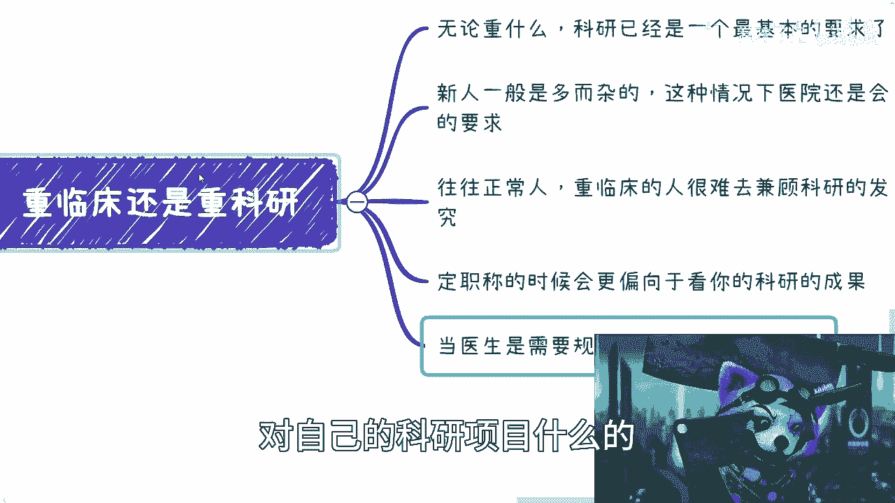

那这样子你啊，一边你还要管病人当成住院医的一个工作，另外一个你还要去搞这个科研项目啊，那这样子的话，你其实整个人的精力是非常分散出去的，然后就是等于是你学了临床上的东西没学好啊。

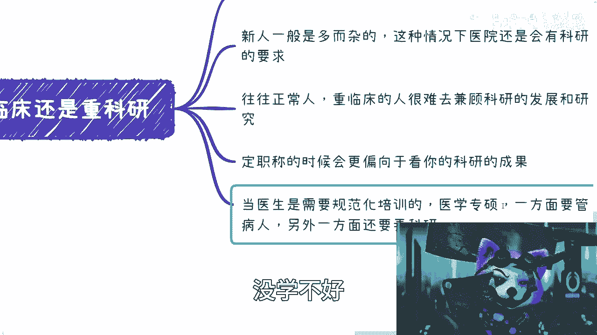

科研嘛反正也搞不好啊，然后最后就莫名其妙的，反正就大家就放过你们就毕业了嗯，但是对，但是你实际上这个两边都没搞好嗯，所以我们其实更嗯偏向于说你搞科研的时候。

就专门搞科研，比如说学硕，但是这样子的话，学硕毕业了以后还要专门再去规培，因为像上海啊一些城市的话，他是要求你当医生，就必须经过这个规范化培训的，但是如果你在一些小的地方，可能要求还没有这么高。

但是如果聘以后聘那个主治医师什么，他就会要求你有这个规培的证书，那上海的话是2010年以后，就必须有这个证的。

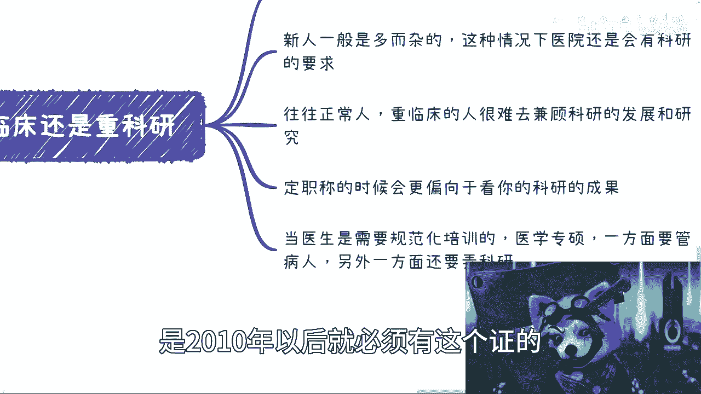

所以如果你是学硕，那你呃等于是8年硕士读出来以后，然后另外再花3年的时间去做这个规培的事情，嗯这样子其实时间成本还是耗伤蛮多的。

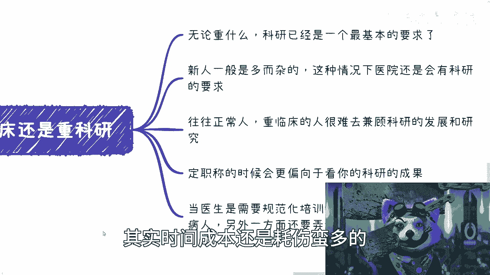

然后再说到那个再回来说这个晋升的这个问题。

晋升的就是必须要求你有科研，所以你很多临床的医生他就会啊，就是只要病人没出什么大事，他就不去管他了啊，早上查完房对啊，就是这个样子的哦，不要这么惊讶，他就是这样子的哦。

这能说吗，这是反正就是对，反正只要病人没事就行了，然后有的时候对，反正有的时候你就找不到这个医生，不知道他在哪里，他可能去搞他的项目去了，这是真的，然后然后可能同组的其他的医生。

就得帮他收拾一下这个问题，那你没有办法，你如果你要禁止称，你没有这些东西的话，你进不了，然后你还要去管别人，人的精力毕竟是有限的嘛，哦哦那那那那那那你看啊你看啊，就按照你这个刚刚这个描述。

那我理解就是说啊人家跟跟职称，跟跟很多东西发展有关的都是科研，那那那按照这么这么个情况来讲的话，那那没人愿意去做临床的嘛，对不对，我们有一些，老主治他就是有这个问题，他可能十几年20几年。

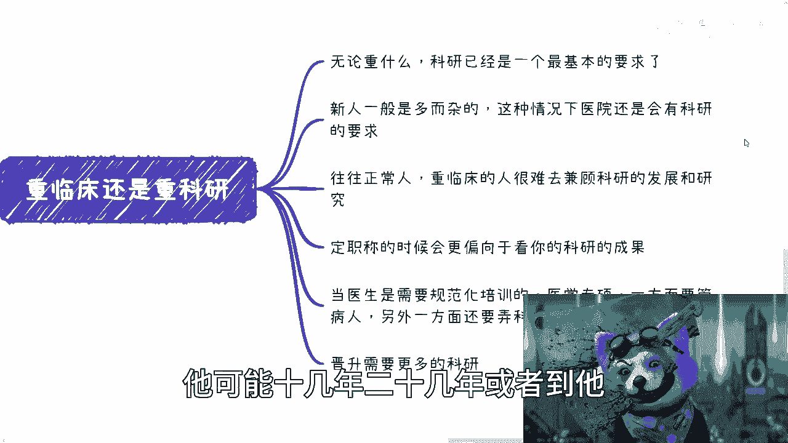

或者到他您退休的都是一个主治医师，因为他没有科研这方面的东西，嗯科研你要有项目啊，你要有经费啊，不是你突然说我要做科研都可以去做了的啊，然后如果这些医生并不想做这个事情，然后他就一直只做临床呃。

虽然虽然病人对他应该也很认可嘛，十多年的老主治啊什么的，但是他就一直都升不上去，他可能永远永远都是一个老主治，但是我们一些手里手里文章，手里文章比较多的，他可能升起来就快一点，嗯嗯那这样子的情况下。

肯定大家更偏向于做科研去了，但是就是有的人不适合做科研，做不来啊，怎么说呢，那不是，那那那那这个逻辑啊，这这倒没毛病了，那那那这样的话会不会出现那种呢，就是比如说这个，比如说年轻人很多都去卷科研啦。

这没毛病啊，那剩下的话临床，那临床这边可能嗯会不会出现那种，就临床这边的大部分的医生，他的这个基础水平啊，或者综合素质啊，没有那么高呢，对省主，你真的讲话好多哦，一下就说到问题的重点了。

那就是很多临床的医生。

他实际能力就是不行哦，哎呀太惨了太惨了太惨了。

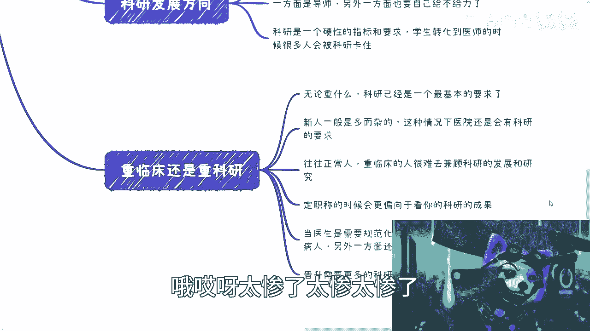

他实际能力就是不行，但是你可以看到他可能开头有非常的多，但是实际能力就是不行，开头又非常的多啊，那那那你不是说这种人职称定不上去的吗，不是我的意思是，做科研的那些可能有很多的抬头哦，那没办法。

那没办法对，但是怎么说，因为他就是除非啊除大神，我们不刷大神肯定很多的，对对对对，然后这些是非常厉害的，佩服他们，但是还有更多的一些事，临床不太临床能力不太行的，就是怎么说呢。

就只能说刚刚过那个平及格及格线对，然后可能科研什么做的好一点，就上升的更快一点。

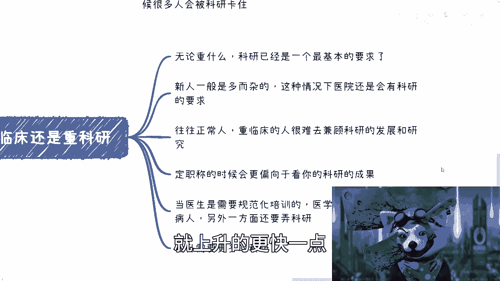

可能科研不行，那么他就一直在临床上哦。

嗯蛮好的，不要紧的，反正受苦的都是老百姓，问题不大。

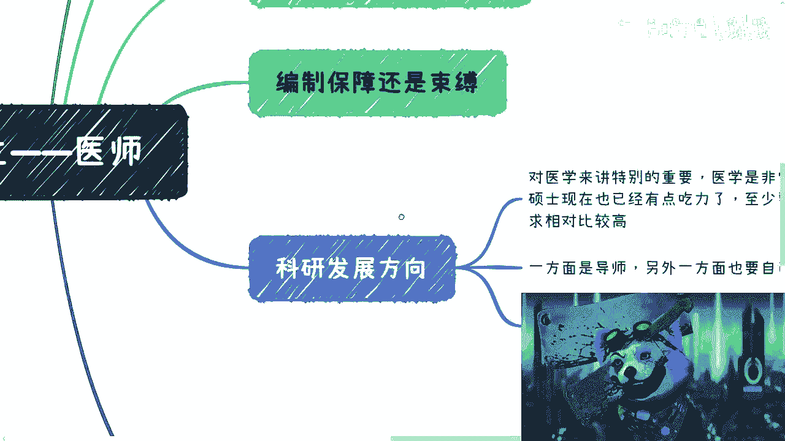

他们以前其实讲过，说要把这个科研和呃这个临床分开来，但是好像到现在为止，是没看出分出来有什么进步，算了算了，随他去吧，好像下一个。

原因就要当医生啊，其实这个问题我纠结了一段时间，因为大部分人都会觉得。

你读了一出来肯定是要去当医生的，不当医生能干什么的，甚至很多医学生也觉得说我学了这么多年，我其他技能什么都没有，什么都不会，那不当医生可以干什么呢，然后我看了一下，其实绝大部分的同学毕业以后。


还是会去当医生的，但是呢嗯因为嗯怎么说，就是说医院他毕竟招人的嗯，指标还是有的嘛，然后好的医院肯定是要求博士以上啊，然后呃一般性三甲肯定都是博士啊，然后比较优秀的硕士对吧啊。

然后二甲呢其实这个硕士什么是还能进的啊，然后现在的话一般性的一家，就是比如说我们社区医院啊什么的话，呃现在也是硕士啊，然后部分还会招本科，但是现在因为医学非常的卷，所以很多的博士也去了社区。

他们也准备躺平了。


你写好了好了嗯。

这是医院的一个情况啊，然后我们为什么说他这个周嗯。


我就是因因为医院他有一个规培的项目嘛，刚刚也提到了，所以有很多医院他是一个带教的医院，他会每年会招很多很多的规培医生，可能一年有个上班啊，几十上百肯定是有的。


那这样子的话，其实就等于是给医院补充了很多的廉价劳动力，这些同学这些规培的医生啊，他们就用非常一个工资来做这个，住院医师的工作，就帮这个医师医院减轻一下这个用人的负担。


那这样子呢虽然说有好处，但另外一个问题就是，医院就不愿意去招那么多人了，他不愿意提供那么多的正式岗位。


反正每年都有规培生回来的，那你也不用专门去提供正式岗位，所以现在其实很多医院他并不招人。


导致很多同学毕业以后，其实也没有办法取到医院，他招人的岗位就那么一点。


嗯然后公立医院的话，因为像我们知道的，它分成123级嘛，嗯大部分的医学毕业生，基本上都是去了公立的医院呃，然后现在公立医院呢也不会直接给你编制了啊，大部分其实还是以劳务派遣，还有合同制呃为主。

以后可能也会取消编制，但现在好像还是有的。


然后如果你要说像工资水平的话，那大家就不要期待太多了，反正刚开始都比较贫穷，那就可能只能满足自己的温饱吧，甚至有一些同学发现比规培的时候更穷了，有这么一个情况啊，比比规培还能更穷的对。

因为我们很多的同学。


他比如说规培的时候，去到稍微好一点的，大一点的三甲，他可能每年到每个月567千上，甚至甚至好一点的上万都是会有的，而在这个情况下，其实他自己的负担也不是很多，有些地方会提供宿舍啊，还有吃饭啊。

什么都会有，所以他还算是可以攒下一点钱，但是当你正式的入了这个岗位以后，你的工资的组成就变了啊。


除了你的基本的工资啊，然后绩效啊，一些奖金啊什么的，那你刚进去的时候又没有病人，又没有绩效，那你就变得非常的穷，就刚进去可能只有一两千块钱基本工资哦，哦哦因为他不会跟你说，跟一口价说一年多少钱的。

他肯定是按照你自己的这个工作来，来给你的那个收入嘛，那那这个规培就跟实习差不多了是吧，不是实习是实习，规培，是规培，规培等于是你在这个医院的编外人员，就这么理解吧，那实习的话受众是谁啊。

规培的受众是两种，一种是社会规培，就是我们毕业了以后去考这家医院的规培哦。


嗯这种的话要看其实以前有一个政策，就是说你硕士啊可以通过一个考试，然后缩短年限，但是现在的话一律都是规培3年的时间，本科硕士博士，就是你毕业以后，因为你要去当医生，你必须要有规培这个证。

然后你就必须找个基地去给你做规培哦，然后你规培你还要考试，但是要考研考了才能进去，然后现在因为大家非常的卷。


所以很多规培基地，他已经不接收本科学历的规培医生了。


他要求硕士以上哦。


对所以大家可以去看一下好一点的医院，他可能规培都有学历的要求。


然后因为像上海的话会好一点，他可能给你工资，当然可能没有正式的职工那么多，但它也会让你基本的生活是可以保障的，几句话肯定是有的嘛，那这样子的话呃，它就不算你是那个这叫什么应届生了，因为他给你交社保了。

然后对一种是社会规培，另外一种这种不交啊，这种就不算应届生的。


就是我们说的那个专硕的问题，专硕就是专业型的硕士，有医学生，医学分为那种学硕和专硕吗，专硕就是去医院里面，也做和社会规培一样的工作，就是住院医师的工作，每天去医院上班。

但同时你还要把自己的这个学业任务也搞定，就比社会规培可能会再辛苦一点，因为你是把人家6年的时间放在3年里面，全部做完了，唉感觉感觉感感感感觉半辈子已经进去了呀，对而且嗯怎么说呢，就是。

哎反正就是就是不停的在医院里面连下劳动力。


不停的工作，反正不对。

然后博士的话也是一样的，他出来也是要规培的。

只有一种情况例外，就是他是专硕毕业以后再去读博，那这样子他就不用再次规培，但是现在有另外一个东西再提出一个新的概念。


叫专培，专业性的专专培，这个并没有所有的地方全部展开来。


但是现在已经有一些，像上海已经在做这个事情了，也是3年的时间。


专培哦，有跟跟那跟上面你说社会培训，还有专硕都是3年有什么区别啊，嗯这个是就是规培是硬性规定哦，上海的硬性规定，其他省市不一定啊，专培的话是这个医院跟你的签订的，一个就是你个人的一个选择。

但是基本上好的医院都会要求你去做这个，这个这个事情的，因为他会又关乎到你这个禁禁止称的问题了啊，太复杂了太复杂了。

好干呀，确实很复杂太复杂了，好下一个。

带的是什么，让我看一下哎。

当医生的性价比吗，可以当医生的性价比的话。


这个其实每个人的看法不一样，我觉得嗯如果像我们刚刚提到的话，他其实有利有弊吧，一个如果你说优点的话，你肯定是比如说你的社会地位是高的，对吧啊。


然后大家对你会比较尊重嗯，然后工作也是相对来说比较稳定的。


对工作是比较稳定的嗯，但是这个稳定的话，反正后面的一个问题呃，然后，还有什么啊，我只固定一点，能不能能不能现在还能不能拿红包来嗯。


拿红包，这个其实按照正规的规定的话，是肯定不允许的啊，那就是可以，我知道了哈哈。

我可没有说过，反正按照规定来说是不行的，你要是被抓到就是问题很严重的哦。


嗯性价比的话嗯嗯大大致只有大致就这点吧。

然后但是缺点也很明显啊，一个就是它这个时间成本非常的长，对半辈子进水对，而且好的医院肯定都是博士啊。


你博士怎么算，5年加3年，再加3年11年哦。


好的那规培专培还不算对吧，哦归那14年哎再说吧，反正时间成本很长。


那这样子你正式开始工作都30多岁了，那你工资也不高，刚进去的时候，虽然大家都说这个是看后期发展的，但你前期真的很穷啊，你首先35岁你可能还要问家里要钱对吧。


就不要说别的事情了，嗯那就是用爱发电呗，嗯对很多都是用爱发电的，好牛逼，但是嗯怎么说呢，这个性价比的话还是要看吧，因为其实对于很多地方，可能医生确实是比较好的工作选择了。

所以也很难说，不然也不会有这么多人报这个了专业嘛，但是我觉得因为确实是有信息差的问题，他们可能不知道说你毕业以后还要再去规培啊，专培他们是我也觉得我感觉很多人报，不是因为他了解他，可能他是不了解他。


可能只是以为说你出来以后你就可以毕业了，直接去当医生了，不是这个样子的，因为他每年政策都会变，他可能今年有要求，以后可能就不要求了。

也也不一定，对对对，很多人可能不知道这个事情，所以就很理想化。

我感觉还得家里有有矿啊。


家里没矿，学不起医院呃，我觉得你至少得是中等条件。

至少吧太惨了太惨。

好不然的话对，如果如果你家里面条件一般的话，一个是这个工作时间赚钱，这个回馈太晚，另外一个是家里面确实有一定的压力，那这压力大了去了，压力很大呀，游戏对，是的呀，而且像我们很多刚毕业出来，工资确实很低。

他们这个压力就更大了，嗯然后说编制还是束缚吧，这个这个东西编制是保障还是束缚。

为什么要说到这个问题，是因为之前我们有很多师兄师姐去了一家医院，然后这种医院呢它并不是说三甲医院，他可能就是去了二甲或者社区，那一般像这种地方呢，它是比如说第2年第3年的时候会给你机会。

说你就可以去考这个编制，然后就变成了一个呃，和医院签合同的一个编制的职工嘛。

那像我们常规理解上来说。


就觉得啊那这个工资就是非常的稳定啦，你有编制啦，那这样就有另外一个问题，就是你在这家医院有没有发展的前途，前途是两方面的，一种是钱进了钱，一种是金字旁的钱，对不对，你二甲和社区本身工资也不高。

如果你要工资高一点，那你肯定得要升职成，这是没有办法的，那你要升职称的前提是什么，你有足够多的文章。


足够多的项目嗯，但是二甲和社区，他又没有足够的资源来支撑你这个事情没，这是一个蛮尴尬的一个事情。


但是为什么说这些医院会很高兴，给你提供这个编制，我觉得有一个考研。


可能是他想把你这个人留下来，因为我们有一些嗯社区可能好一点，但二甲的离职率其实还是有的蛮高的，嗯他可能两方面的前途都看不到的话。


他就可能有一些别的想法了，但是你入了编的话，呃，我其实没有太多了解，但是我知道应该是有一个服务器啊，什么的要求对，然后然后你如果在那个之前就离开的话，其实可能还要赔付医院一定的钱，就比如说你去进修了。

你可能还要把这笔钱还给医院什么的，我之前看到一个赔得最多的是赔了40多万，赔了40多万，我靠什么鬼东西啊，真是对，这真的是匪夷所思，他赔了40多万，34年的工资全进去了哦。


好干。


然后呃但是如果你在三甲医院的话，当然三甲拿编制比较困难，但是三甲医院的话给你编制确实会稳定一点，因为三甲的话一方面是病人多。


那你收入肯定会高一点，相对另外一个是他各方面的优势也很明显了，就不管是科研还是其他的项目啊，什么都会集中到三甲这边，另外一个就是三甲很多。


因为是代教医院，刚刚说过了，他就是你手下是会有学生的，那他就可以帮你分担一些工作，那这样子的话等于是你在让同学帮你干活吗，你等于算是一个小中层了，在这个科室里面对。

那这样子的话你就会相对有时间去做别的事情，对你个人的发展会好一点啊，我当我当然不能一概而论啊，可能可能有些不是这个样子的，也不能把话说满了嗯，然后如果你在社区呢。


那保障肯定也是有个编制的，保障肯定也很好对，但社区现在因为事情比较杂，比较多，还要管什么预防啊，什么各种各种事情，还是家庭医生的各种事情，但是因为去社区的，很多同学本来也是想要躺平的，所以这也无所谓。

这也蛮好的，嗯所以说来说去的话。

其实就是说，如果给你编制的话，三甲或者社区是比较好去的，但是二甲的身份比较尴尬，或者二甲或者二乙，就是二级医院的身份比较尴尬，就不是特别建议，然后因为很多人当医生。


其实也是为了谋求这个编制的岗位，所以他才会考虑公立的医院，而不考虑私立的医院。


但是像私立医院的话也分嘛，他一般比如说比较高端的那种。


还有那种比较一般性的私立医院，这种其实去的也有一部分嗯，但是怎么说呢，他这种工资也不是特别稳定啊，高端医疗可能好一点，但是一般性的私立医院工资也不是特别好的，而且可能会不是很开心。

就跟外面企业里面一样的嗯，然后还有一些像如果说不在编制里面干，还有一些会去干什么嘛，像是诊所诊所的话。


其实像中医和口腔会比较多一点。


你这种其实会比较好，如果你自己一个人干的话，但是除了这两个呃学科以外，好像其他没有办法去做个人的诊所。

好像没有个人的外科这种事情吧，不会有这种东西的，所以只有中医和口腔的同学。


可能可以做这个事情，但是有一个事情要说一下，除了说嗯你去那种已经有的诊所里面工作，如果你要自己想开诊所。


还有一个要求是你必须值已满了5年以上才行，对我们有一个叫执业医师证的东西，你如果没有这个5年以上的职业，你自己是开不了这个诊所的，然后这个职业证怎么考呢，呃一般性是在你规培的第2年就是newly呃。


也不一定是规培，就是说你呃去工作的第2年可以去考。

他要求你必须有一个单位挂靠在那里，有一年的工作经验才可以考，啊你不用不要写规培的第2年，你就写工作的第2年哦，那这个这个是什么，就是这个可以自己选，那不是一个强制的是吧，不是如果你要当医师。

你就必须有这个证，执医证是全国通用的哦，规培的话是可能部分地区的要求比较高，但是国执业证是肯定全国都要的哦，那这个东西的话就是说哎呀，这个可能也是一个信息差，因为很多同学报医师证。

报那个医学的时候不知道有这个东西，其实这个东西就要求你必须考出来以后，你才能去当一个医生，我这里讲的是本科，如果你是专科的话，你还必须考那个助理医师证，然后再生成执业医师证。

这样子一级一级去做这个事情也比较麻烦，他对每一个呃就是文化程度，它的要求是不一样的，考的东西也不一样，工作第2年考执医，这个是什么，就是你要你能够去做医师是吧，你有了这个证，你就可以去做这个医生。

而且你这个职业的范围，就是你这个医师证上的范围，如果你医师证写的是口腔，那你就只能从事口腔啊，如果你是内科，那你就只能做内科，是这个意思，那就是一个必须要考的东西吗，对就是你一个对，就是说你都要考的。

如果没有这个证，你就是非法行医，哈哈好的。


可以对，然后正规的诊所也会要求你有这个东西对，如果你没有这个执业证的话，嗯因为像上海的话，如果你有执业证，那你是可以去这些诊所工作的，但是你没有呃规培证的话啊，就是说你有执医证，你可以去诊所啊。

但是你有执医证，合规培证，你就可以去医院这样子哦。


对嗯嗯嗯是很复杂，然后是这个诊所的问题。


嗯后面是如果说不在医院编制里面的话，可能还有一些会考虑其他的事业单位啊。


公务员，那这个是另外的事情，大家自己去考就好。

其实考公务员是不是还是比较大，其实对于医学来说，考这个还是比较划算，因为报的少嗯，快什么公务员啊，对相对来说少一点几，别人可能一比100，你觉得可能一比十，一比20，这样对啊。

那我觉得你这考公务员比你比你这边什么。

后面什么又要值一，又要医师证啦，又要又要什么。

这只博士11博士要读个11年，规培3年，我考个公务员不香吗。

对所以很多会选择在毕业的时候，本科毕业的时候去考这个，我觉得那个时候是最划算的事情，但是很多人并不了解，很多人就脑子比较死，你知道就一门一门心思的时候，我要去当医生，他就不会去想这个问题了。

唉太惨了太惨了，半辈子进去了，太了，真的是，因为很多人，确实是没有人好好的指导过这个问题，并没有人跟他说过这件事情，他没有这个信息的来源，嗯嗯嗯有有点嗯，因为很多人太他不在这个行业里面。

他确实是不知道这些事情，然后还有哈哈，现在我们俩知道了嗯，好OK最后一个还有什么东西，刚刚说了啥了啊，编制的问题啊，其实编制还有一个还没说完啊。


就是就是还有一个就是不做边的话，就是还有一些医药公司啊什么的，反正这个就和外卖公司没有什么区别了啦，那就第三方就是对第三方，然后还有一些体检的体检，他其实和诊所是一样的，也是需要你有执医证的哦。

哦那这个不算在这嗯。


这个其实应该算诊所的嗯，嗯然后后面一个是啥家庭家庭啊。


这个比较尴尬，没有家庭，这个也不是没有家庭吗，你肯定有自己的小家庭啊，老爸老妈也是啊对吧，老就家庭和工作如何平衡呢，我觉得就是平衡不了，就不要想这个问题了，平衡不了，平衡不了蹦极。


没有我这么说，感觉有点不近人情，但是实际上的情况就是这个样子的，我们很多这不只是医学专业，其实很多其他的也是想的很好，工作家庭平衡一下啊，平衡不了，所以尤其是像医学这种很卷的专业。

他就要求你也不是说主动要求你，可能是你被动的就被卷进去了。


就要求你在很多其他的时间，花自己的时间去做其他的工作。

你不在医院里面，你也要想课题的事情，你要不停的写文章是吧。

嗯尤其是有些科室会好一点，像我们一些辅助型的科室，他上班时间是固定的嘛，还有想体检，那他就早八晚五或者07：30上班，几点几点下班，很固定，直上白班，那这种还稍微好一点，他是可以相对平衡嗯。

除了可能医院临时需要你的时候，但是其他的临床的医生的话，平衡起来真的非常的困难，你首先你在医院里面管病人对吧，你一个人管十几张床，你病时学到啥时候去，你能正常的下班已经是谢天谢地的事情了啊。

尤其是还有什么每个月好几次的值班。

通宵24小时的，上到第二天中午12点之类之类的，然后你也没有办法去调班，因为其他的同时也很忙，你根本就排不开，请假也很困难，你就没有时间去和你的朋友们出去玩啊，或者你带着小孩出去玩。

这个事情就就你要想请假这件事情都很难开口，因为其他人不会来帮你管理的病人，这些病人就是你的，然后内科医生的话相对外科还更好一点，像外科医生他时不时的就被临时召回去啊，做手术一坐坐一整天啊。

那这样子也不要再考虑什么家庭的问题了，在家里面能待三四个小时，我觉得已经很不错了，然后就因为之前也有看到很多说了嗯，另一半是医务人员啊，他们都非常忙啊什么的，这是很正常的现象。

我觉得如果你在嗯当了医生以后，再想考虑平衡这件事情，要么就是做比较清闲的工作啊，体检中心或者去做行政，相对来说会能平衡一下，或者你在社区里面也能稍微好一点，但如果你特别的有上进心。

就是一门心思的想要去当一个好医生的话，真的很难评判这件事情，只能说家里面对你的支持要非常的大，这个这个支持不仅仅是说了你的另一半，你的家长，还有你的小孩，也是我们甚至有一实用爱发电，对甚至怎么说呢。

可能很多医生其实是工作狂，嗯很多好的医院的医生都是工作朋友，但有的时候会觉得，家庭的生活可能还不如在医院里面呆着，那那那他可以选择单身保平安，那这还有其他社会的压力吧对吧，社会压力。

社会压力哪里有一一医生来的神圣，对不对，就很难受，我我我也挺奇怪这个心理的，反正啊哦。

可以的可以的，那我觉得当医生他当然社会，然后或者说有一定的这个工作满足感吧。


受人尊重还是比较令人开心的事情，这个成本太高了，成本高，其实大部分的成本是花在时间，然后你没有没有个人生活成本确实比较高，但它很难量化出来，但是你实际想一下，如果你在小地方的话。

你当医生肯定还是比较好的，因为其他工作也没有什么好的工作呀，但如果你在大城市的话，性价比真的不太高，嗯嗯嗯嗯对，那个我想想哈，那个诶我顺便问一句，那个他们说那个什么什么生物医学，这是个什么玩意儿啊。

生物医学，生物医学范围很大呀，问的是什么，就是就是我意思是说他只不过是方向不一样，但它出来整个的这个这个这个叫什么，就是就一步一步走出来的，这个路就其实跟别的都一样的是吧，生物医学不能当医生吧。

他不是临床哦，哦哦这样子是吧，他就是那那那那这种做实用些，可能更多是考虑那种什么能抗肿瘤啊，什么这种东西吧，那那种是什么，就是一般的这种就是基础的那种基础医学啊，然后那种呃就是生命科学，生物学。

它综合起来的比较偏偏理论，然后偏科科研的那种科研的这种对，并不是说并不是说临床去面对病人的那种医生，那这种工作是是什么，也是医院里面还是在在什么地方嗯，医院里面可能有一些呃，像那种检验啊什么可能可以。

然后更多的应该是那种生物，医药公司里面会多一点吧，要就那又变成第三方，就是就跟社会层面一样的性质了，对啊，OKOK那你要当医生的话，你首先本科就必须是临床专业，对对你，如果本科本科不是临床专业。

除非你是那个协和的那个4+4的那个呃项目，不然的话你是没有办法当医生的，这这又是个什么玩意儿了。


你那这个行业特殊性有点高嘛，结合有个加斯项目，就是说你本科如果不是医生，然后你可以通过这个项目去做医生，但是他们的要求非常的高，嗯这个大家自己查一下吧，我这边一下说不清楚哦，哦哦行啊行啊，太复杂了。

太复对。


他是本科生，直接攻读临床医学博士学位。


是比较特殊的一个失联的吧，哦你怎么什么都知道的啦。


啊你咋这么吊呢，我这怎么说呢。


不知道怎么跟你在这里巴拉巴拉讲话呢，你这哈哈。


你这突然卖萌，我也搞不搞，我也接不了了。


对不对，OK所以说其实本质上就是说。


我们这个主题的范畴其实是从一个医学生，就是到医生这个过程当中，他们想因为他们必须要去知道的这些事情是吧，一个是他们需要知道的事情，然后还有一些坑，然后是一些比较现实的问题，我其实之前也跟你说过。

这个因为我觉得要讲的东西实在太多了。


很难对，会发散出去非常多的东西，只能说一些个人的经验分享啊。

对这太复杂了，这是太复杂，这复杂的已经是过分了。


这个对，但是就是因为很多人他并不知道，这里面弯弯曲曲这么多的东西，所以可能大家抱着一腔热血就冲进来了，结果真的是爱心而归，这哎等一下啊，等一下，那那还有个问题啊，那那就比如说最后打个比方。

就是最后就是说有很多人是就卷不上去的对吧，或者怎么样的，那那这些人怎么办呢，嗯很多也有很多就是本科毕业就出来工作了嘛，对吧，那这种呃也嗯就是刚刚专业里面其实有讲过了，有一些就是去私立的医院。

私立医院可能要求稍微稍微低一点，有些大专业能进医美啊，什么行业对吧，中专也可以，然后还有一些，比如说医药公司里面去做医药代表啊对吧，然后可能做呃医疗相关的一些气息啊，让销售啊，然后还有一些啊。

当然还有我们的护士小姐姐们，他们可能转行的时候也会考虑这方面的东西嗯，然后还有就是我觉得就是说可能就是本科毕业，不当医生比较好的话，就是直接去考公务员和事业单位会好一点，然后还有一些可能不太行的。

他就直接转行了，他可能什么行业都会有啊，之前的话就要赔对吧，然后还有房地产，对不对，就直接转行也是有的，还有什么问题吗，没有没有。


暂时没有，你已经你已经很厉害了，这个讲的这么多东西，我他妈都给你跪了。


真的是我本来要讲的东西更多啊，就啊感觉说不完的样子对。


砍了一大半是吧，然后就跟要么跟大家最后分享一个，什么医学进职称的一个要求哦。


好你说啊，所以说我们我医学毕业以后对不对。


然后假设我们直接去单位里面上班了，那你上班的第一年怎么说呢，这首先你是一个正规的，比如说你去规培了，你第一年啊，你去当了一个不同的住院医师，但这个时候你是没有证的对吧，你没有执医证啊，那你没有执意症状。

你只能做这个学生班的工作，学生班的工作，然后啊钱也会稍微少一点，但是这个时候你还是有钱的，然后到了这个第一年快结束的时候，6月份，5月份，6月份，7月份，然后这个时候就开始你的执业考试。

职业考试呢要分理论和实啊，理论和笔试啊，理论和那个技能这两个都通过了呢，那你拿到了这个职业证，你其实现在才算是一个真的住院医师了，真的执业医师了，然后你现在其实可以算是有初级职称了，他聘不聘，你先不说。

他反正其实相当于是有一个初级职称了啊，然后到了你嗯毕业的时候呢。


就是说你规培3年结束了啊，这个时候你是一个执业医师，然后什么时候去考这个主治这个问题呢，主治就是我们中级职称啊，就是说在你这个规培结业的两年以后，就比如说你是22年毕业的，那你要去考的话。

就是24年去考这个中级职称的问题，前提条件是你规培和执意都过了啊，然后你考过了这个考试以后呢，你就是一个主治医师了，那你就其实是有了中级职称，但是医院可能不一定会给你这个主治的岗位。

但是你是有相当于这个水平了嘛，然后假设你已经变成了一个主治，那要再深一步呢，要变成什么呢，就是副主任医师不高的一个职称，这个有一个要求，就是你在主治支撑的5年以后。


而且这个也不是说你光考试就能够聘这个岗，副主任医师，你可能会需要有一个学历相关，有些可能会要求你去有一个博士学位才行啊，那可能可能很多医生就会去考，考个什么在职的读博啊什么的。

然后要求你有一定的科研成果课题，然后会要求你有海外的访学的经验，或者去当那种啊交流啊，或者访问学者都可以无所谓，或者说你去下基层，下基层什么干那个，比如说我们西藏啊，新疆啊这些地方。

他们会需要有医生过去啊，培训一下他们当地的一些医生，然后或者还有一种是云飞的项目，比如说去摩洛哥啊，什么这些非洲的一些国家啊，摩纳哥摩纳哥，不好意思，一些非洲的国家，然后这就是你一个下基层的一个经验。

然后呢还会要求你有继续教育的一个学生啊，就是比如说我们经常会有一些哪里，哪里的协会的一个培训班，对不对，那你这个经常去上课，他会给你有一个学生啊，这些东西都要有，然后还要求你可能会有一定的代价的经验。

好这些全部都有了，你可能是可以被聘上这个副主任医师了，因为你还要跟别人竞争，如果别人比你优秀呢，对吧啊，好，那这个好了以后呢，假设你聘上了，那你就后面要再后再进一步的话，就是我们正高的主治医师。

主任医师的要求呢，就是你副高以后5年这个要求的反正就更高了，就不再具体展开了，反正很多可能到副主任医师已经很了不起了，可能会拼不上去嗯，如果大家比较想躺平呢，可能很多最后就是一个主治医师对我的图呢啊。

在这在这啊，不是那按照这个的话，这什么啊，这那那那那那到这个得几岁啊，那四五十八你你付高，如果就正常的话，好的话，好的话肯定30几岁就可以了，非常优秀的，30几岁就可以了，身高的话是40多，50差不多。

你30多也是靠近40的呀，你按这个年份对啊，反正就这样算了哦，这反正就时间比较久嘛，他们就很多人都觉得说医学是越后期越吃香，工资越高，但你前期确实怎么说呢，嗯熬得比较久。

嗯对而且不是说很多很多人有个误区啊，他说你可能熬到了不高了就没事了，好了轻松了，不是的，我们医院里面你值班他也是分等级的，你最下级的学生班，一级的就是我们的这个住院医师，然后二级三级的这个值班制度。

还有总值班，总值班是行政的特殊情况。

那二级的话呢可能是一些副主任啊，或者谁谁谁，然后还有个三级，就是一个再再往上一层嘛，二级三二班三班，如果他就是有你一般解决不了的事情的时候，你就会去找这个二班，三班的医生来帮你解决这个问题。

二班三班一般性都是怎么说呢，就是副主任和主任主任医生在那边值班，所以其实你往上升了以后还是要举办的，只是没有之前频率那么高，你之前可能一个月四五个五六个班，对不对，四五个六个班。

然后到了副主任这个时候可能就一个月一个班，两个班这个样子，那也是要值班的，而且你这个怎么说呢，职称越高，你责任越大嘛，但他薪资高嘛对了，工资肯定也会上去啊，不然的话为什么那么多人要挤上去呢。

但是他每个科室的绩效的怎么分配，我不是特别清楚，各家医院不太一样，但是怎么说，就是说如果你想要工资高一点，那你至少得要到副主任，嗯嗯嗯嗯嗯OKOKOK，就是你至少35岁以后才能开始有点钱。


有点钱哦，好的好的，我那前提说了嘛，前提就是你得先有钱熬到35岁嘛，对不对啊，对前期你就好干啊。


我靠他妈太可以可以行，好好好好好好，那那那那那那那那就这样吧，这个感谢我们这个热心网友啊，能给我们提供了将近这个一个小时的坑是吧，然后这么长时间了吗。


对对对，59分钟12秒，然后那个反正内容我知道了，就是我到时候待会定个主题，反正我们就是定这个医学生往医师方面的，这个反正就就就这个内容，就这个方向我待会定好给你看一下，好吧，嗯啊行啊行啊。

那那要不先这样，你跟大家在在在有啥那个啥，我就点点关闭了，好谢谢大家，就这样吧，这么简单的吗，哦哦那就这么简单啊，哈哈哈好。

