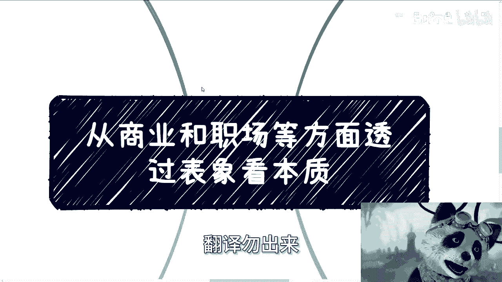

# 从商业和职场透过表象看本质-你选择做怎么样的一个人---P1---赏味不足---BV1kK411a7

在本节课中，我们将学习如何透过商业和职场的表象，理解其背后的核心本质。课程的核心在于引导你思考并主动选择自己希望成为什么样的人，而不是被动地接受环境或他人的定义。我们将通过具体案例，分析人性、立场与选择之间的关系。

---




## 一、 所有社会活动的核心：人 👥

上一节我们介绍了课程的主题，本节中我们来看看所有社会互动的基础。


无论我们从事何种工作——打工、创业或是担任公务员——我们面对和处理的核心对象都是“人”。整个社会的机制和运作逻辑，也都是围绕“人”这一生物设计的。

那么，人的本质包含哪些常见的特性呢？以下是部分列举：

*   **嫉妒与攀比**：倾向于与他人比较，容易产生嫉妒心理。
*   **欺软怕硬**：习惯挑选看似弱势的对象施加压力。
*   **恐惧未知**：对未曾经历过的事情感到害怕和抗拒。
*   **寻找借口与躺平**：为不作为寻找理由，缺乏进取心。
*   **认知局限**：容易被自身知识边界以外的人或信息影响。


**核心公式**：`社会互动 ≈ f(人性)`


这些特性并非对每个人的绝对定义，而是普遍存在的人性侧面。你是否具备这些特性，往往取决于两个关键因素：一是你所处的**位置**（“屁股决定脑袋”），二是你是否已经**找到了稳定的自我**。


---


## 二、 案例分析：职场加班风波 💼

理解了人性的普遍性后，我们通过一个具体案例来看看不同立场下的选择。

最近有一则职场热议：某创业公司管理者要求团队必须保持“创业状态”，周末需关注消息、随时加班，并声称“只想打工的请离开”。

面对同一事件，不同立场的人会有截然不同的反应：

*   **如果你是缺乏主见、害怕失业的员工**：你可能会选择服从，甚至在心里为这种要求寻找合理性。
*   **如果你是管理者或老板**：你很可能内心赞同此做法。即使不公开表态，也会担心如果自己表现得“好说话”，未来会失去对团队的控制力。
*   **如果你是一个已确立自我原则的人（无论身份）**：你会首先判断，这是否是一个有效的管理方式，以及它是否符合你的做事准则。例如，你可能会要求对方提供加班的合理理由，而非接受空洞的“创业”口号。如果沟通无效，你会基于自己的原则做出留下或离开的选择。

**核心洞察**：这件事本身没有绝对的“对错”，其本质是**不同的人基于自身立场和原则做出的不同选择**。关键在于，**你想选择成为哪一种人？** 是选择屈从于威慑的员工，还是选择粗暴管理的老板，抑或是选择有自己清晰边界和沟通方式的人？

---

## 三、 商业合作中的自我定位 🤝

职场中的选择逻辑，同样适用于商业合作。你的自我定位，直接决定了你将吸引什么样的伙伴和机会。

以我自身的转变为例：
*   **过去**：做事风格较软，即使对方画饼或忽悠，也常以微笑应对，避免冲突。这导致了大量无效社交和无法落地的合作，消耗了大量时间。
*   **现在**：确立了“共赢”为合作底线。如果不能明确看到双方获益的可能性，会直接拒绝，不再浪费时间听故事。这虽然会失去一部分机会，但能更高效地链接到价值观一致的伙伴。

**核心代码**：
```python
# 过去的模式
if request == “画饼” or request == “忽悠”:
    response = “微笑接受” # 导致无效社交
    energy -= 10

# 现在的模式
if cooperation != “共赢”:
    response = “直接拒绝” # 过滤低质机会
    energy += 5
```

这个转变的本质，不是简单的“变硬”或“需要积累”，而是**明确了“我是一个怎样的人”以及“我的做事底线是什么”**。你是什么样的人，就会吸引什么样的人，从而决定你事情发展的走向。

**重要原则**：做事应力求**彻底**或**极端**，明确传递你的信号。“中庸”和模糊的态度往往难以带来有效的结果。

---


## 四、 在变化中锚定自我：以结果为导向 🎯


我们必须认识到一个现实：社会中大部分人尚未找到稳定的“自我”。因此，人和关系都在持续变化。今天的朋友，明天可能因立场不同而分道扬镳。

在这种环境下，最有效的行动准则是什么？

**核心策略**：不要轻易相信“关系”或“承诺”，一切行动应以**可验证的结果**和**法律依据**为导向。简单说，就是 **“一切向钱看”** ，但这里的“钱”是广义的、有价值的结果。

例如，面对“嫉妒”这种人性：
*   **未找到自我的人**：可能陷入抱怨、诋毁甚至使绊子的情绪化行为。
*   **已锚定自我的人**：会承认并快速平复这种情绪，转而客观分析：“对方为什么能成功？有哪些值得我学习的地方？我该如何行动？”

同样，面对“捏软柿子”的现象，多数人在压力或利益驱使下都可能做出类似选择。这不是对错的评判，而是你是否能**清醒地认识到这人性的存在，并主动选择是否要对抗它**。

---


## 五、 多视角思维与成长路径 🧠


我们为什么要反复强调“选择成为什么样的人”？因为这是你应对一切复杂局面的基石。


看问题必须具备**多视角**：不仅要站在对方立场，还要站在第三方立场，更要站在“你想成为的人”的立场去思考。这样你才能理解行为背后的动机，做出适合自己的判断，而非简单地进行道德批判。

许多人在咨询职业或商业问题时，常陷入“无解”的困境：“老板很差但我没钱不敢辞职，怎么办？” 这恰恰暴露了核心问题——**你尚未明确“自己是谁”以及“自己的原则是什么”**。当把所有退路都预设为不可行时，问题自然无解。

**成长路径建议**：
1.  **意识先行**：首先建立起“我需要明确自我定位”的意识。
2.  **大量案例讨论**：通过与他人（如导师、同行）客观讨论大量真实案例，强迫自己从多个角度分析问题。这是借助外力拓宽视野、加速自我认知的最有效方式。
3.  **经历与复盘**：自我定位最终需要通过实践中的成功与失败来锤炼和固化。这是一个“先有鸡还是先有蛋”的循环过程，但必须开始行动。

不要等到35岁甚至更晚，才被人评价为“看问题幼稚和表面”。主动定义自己，是一切选择的起点。

---

## 课程总结 📝

本节课中我们一起学习了：
1.  **社会活动的核心是人**，普遍人性是分析问题的背景板。
2.  **职场与商业中的冲突**，本质是不同人基于不同立场和原则做出的选择，关键在于**你想选择成为哪一方**。
3.  **明确的自我定位**（包括做事风格和底线）决定了你将吸引的资源和事情的发展方向。
4.  **在变化的环境中**，应以**结果导向**和**法律依据**为行动准则，来规避风险。
5.  **掌握多视角思维**，并通过持续讨论与实践来锚定自我，是个人成长的关键路径。


记住，你不是被动接受环境的角色，而是可以主动选择“成为什么样的人”的决策者。这个选择，将定义你的所有后续道路。