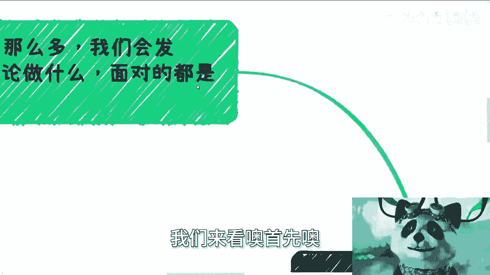
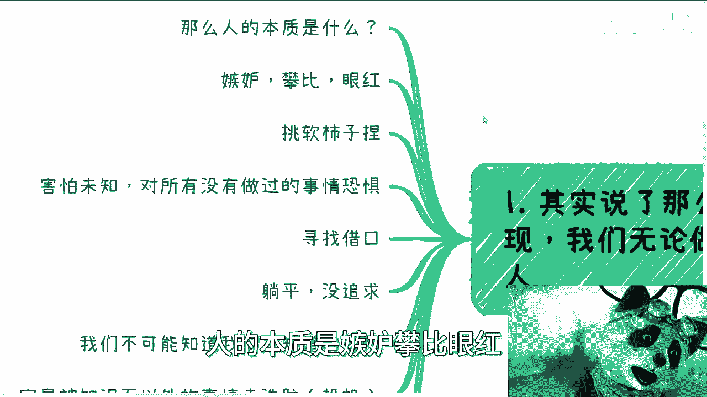
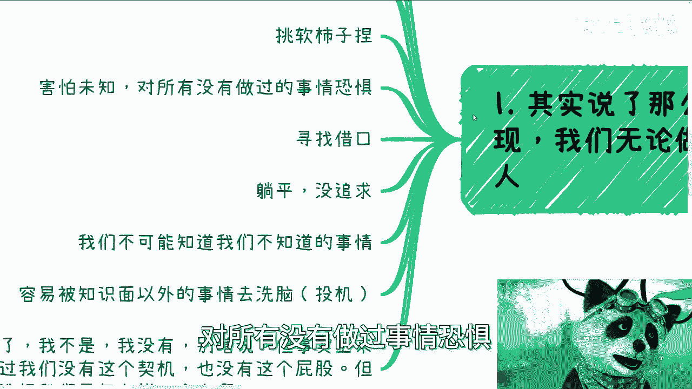
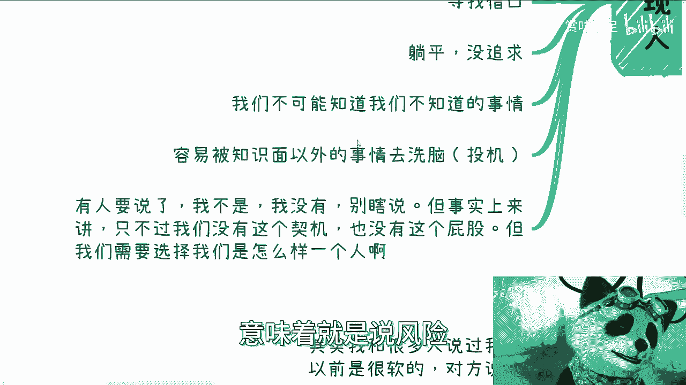
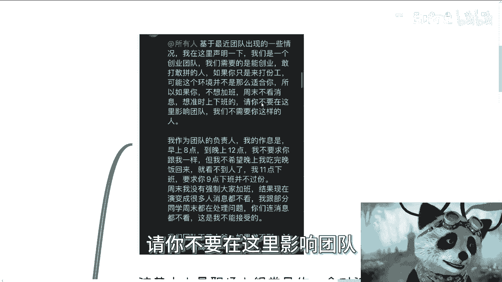
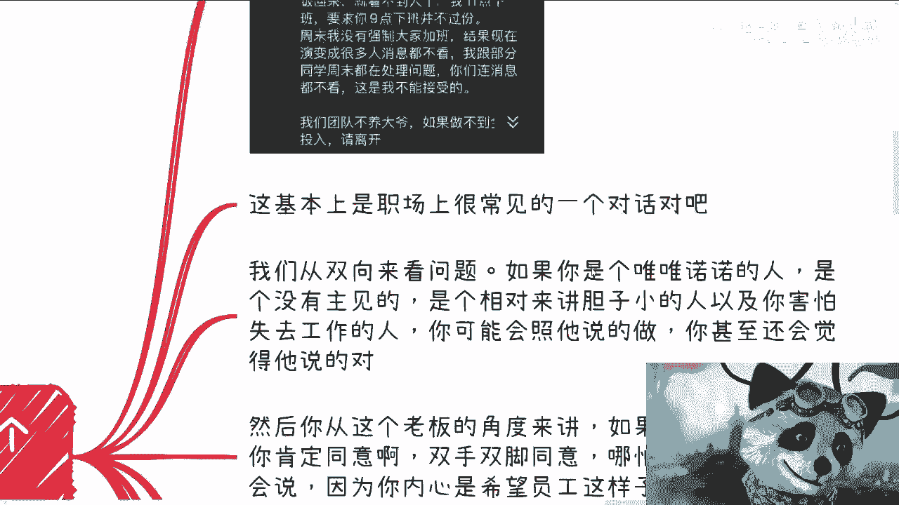
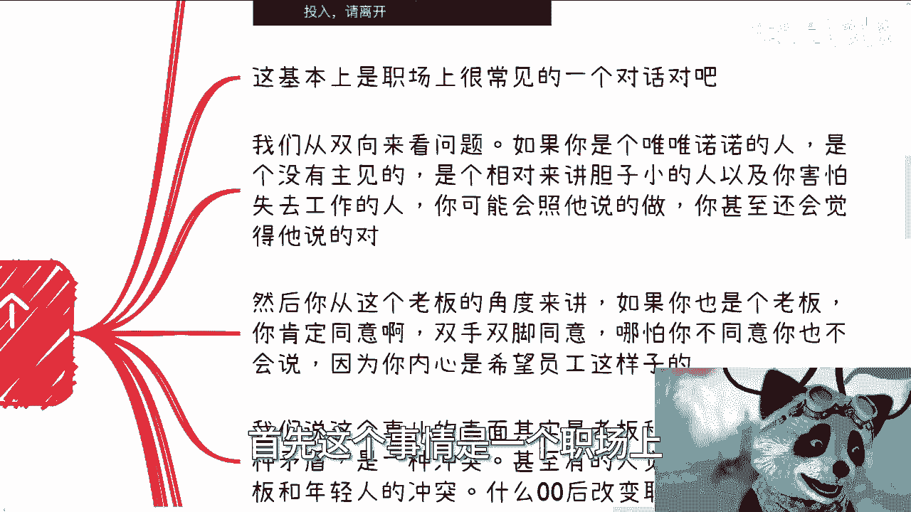
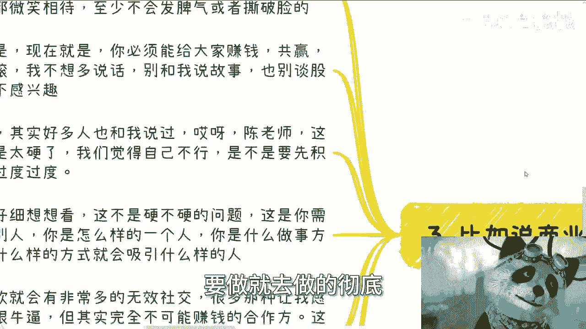
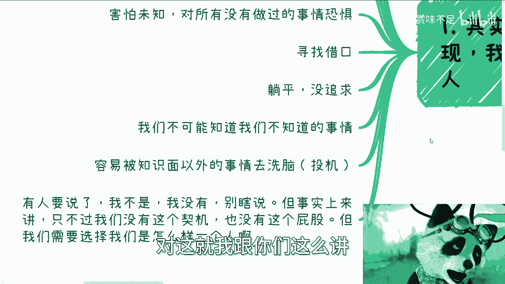
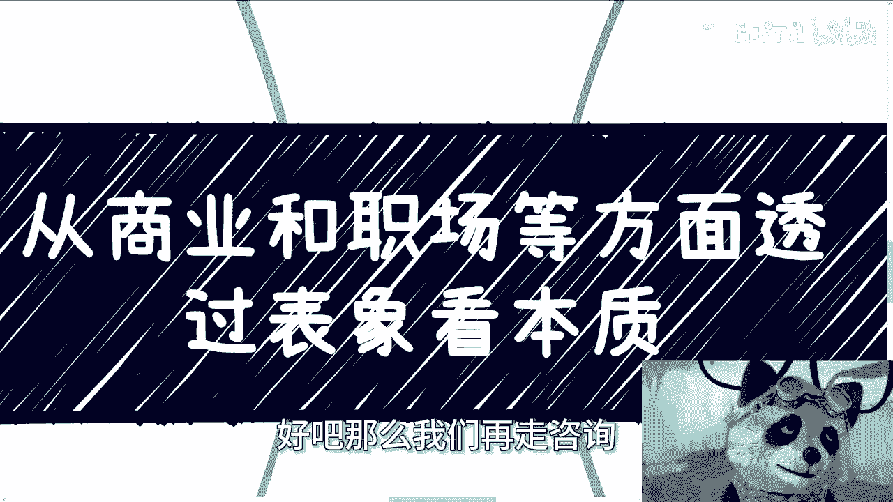

# 从商业和职场透过表象看本质，你选择做怎么样的一个人 - P1 - 赏味不足 - BV1kK411a7fS

啊大家好啊，这个最近哎呀太忙了，所以就就就晚了啊，嗯为什么呢，因为我也可以跟你们讲，就是因为差不多要过年了嘛，都是到上海这边来聊，其实都不能叫聊业务，应该是说聊商机，聊机会嗯，你像我周二约了去杭州。

就是找投资人去了解信息的嗯，我可能周三周四会再去趟上海市的协会，去碰一下一些信息，其实哎就是嗯整个市场肯定都是困难的，所以说呢大家都是在寻找不同的机会，然后包括后面两天，应该还有一些就是做金属加工的啊。

然后做教育的啊，还有做做水产的，可能会过来聊，哎呀，这不很多人肯定会觉得，那那这些业务跟陈老师有什么关系啊，有没有关系不重要啊对吧，你包括昨天我忙了一天接待的那个小伙伴，就是做抖音的，有没有关系。

无所谓啊，大家碰吧，对不对，机会是碰出来的呀，你不能一开始就是默认他有没有关系啊对吧，所以呢我还是很愧疚的啊，你看现在已经是1月22号，凌晨12。16分，我很愧疚的，还是来补一个视频啊。

这个视频呢也跟这两天聊的可能有些怎么说呢，心得有关啊，同样的给大家翻译一下啊，叫做怂啊，自助商议帮上贝啊改改方向，阿里要吃苦头骨啊，阿里要去通古啊，给favorite通过标本啊。

我们来看啊。

首先啊其实我们说这么多嗯，就是我说其实视频发了这么多啊，我们会发现我们无论做什么对吧。

面对面对面啊，无论我们做什么，面对的东西都是人对吧，就是我不管你今天是打工还是做生意，还是说去做公务员，做什么东西，因为你都是人对吧，你面对的也都是人，那么整个社会机制和运作逻辑一。

它背后涉及的人而设计的这个生物，他也是人对吧，那么你想想你面对的人，包括你身边的那些人，人的本质是什么，人的本质是嫉妒攀比。

眼红挑软柿子捏，害怕未知，对所有没有做过事情恐惧。

寻找借口，躺平啊，没有追求，包括我们不可能知道我们不知道的事情，容易被知识面以外的，就被你认知以外的事情，或者说人去洗脑对吧好嗯我相信啊，我首先啊这些是我随便打出来的，我没有说什么什么去总结啊。

或者怎么样，就是肯定也不止这些啊，但是啊我相信有很多人听到这，有的呢可能会觉得嗯啊我是这样的，有的人呢可能也会觉得啊我不是这样的对吧好，那么我跟你们讲啊，你说你是也好，不是也好，我跟你这么讲。

有的时候你是或不是取决于你的屁股，取决于你有没有这个契机对吧，而有的时候你是或不是，取决于你到底是怎样的一个人啊，什么意思呢，意思就是说在你没有寻找到自我，就是没有确定你这个人的本质没有。

就是说嗯怎么讲呢，就是说没有寻找到，没有固定住你自己的做事方式，没有寻找到你自己，这个人到底应该是怎么样子的时候，那么你是一直变化的对吧，因为你是会被改变的，而也也就是说无论是你还是其他人。

其实都是在不停的变的，除非这个人已经是就是说嗯他做事方式，包括他的整个的一个一个一个一个，一个一个一个本质吧，他已经确定了对吧，他已经寻找到了，就像他在这个世界，或者他在这个这个国家里面的一个定位。

那么他可能就OK往后走，但是大部分的人他没有寻找到，那么他就会不停的变，那么不停的变意味着什么，意味着就是说风险啊。

好那么我们往后看啊，首先比如说，今天我在微博上看到一个这样子的一个话题啊。

他说一个人，这好像是丁丁吧对吧，但是不知道是领导还是那个那个管理层，他意思就是说啊团队出现一些情况啊，我们是一个创业团队啊，我们需要创业的，敢打敢拼对吧，你如果你只是打份工啊。

那么可能这个环境不适合你啊，所以呢如果你是不想加班啊，周末不想看消息，想准时上下班，请你不要在这里影响团队。

我们不需要你这样的人，反正做半天吧，你们自己看啊，好。

我们来看这件事情怎么看待啊，首先这个事情是一个职场上。

我相信大家很容易看到的这么一个事情啊，很容易碰到的事情，第二我们从双向来看问题啊，如果你今天是个员工，同时你又是一个唯唯诺诺对吧，或者说这个胆小怕事，我不这可不是贬义词啊，我就客观的说啊。

同时你们也没有主见，同时你们也没有寻找到，自己到底应该是个怎么样的人的情况下面，那么我敢相信啊，我敢打赌呃，呃同样的，你可能还是一个这个害怕失去工作的人，那么你很有可能会按照他说的。

就是啊我就双休看看消息对吧，加加班对吧好，而且还有很多极端的人甚至会觉得嗯，杀他说的对，而且这种说的对啊，不是说认可他，而是说是一种怎么说呢，就迫于淫威之下吧，对这种说的对啊。

那么然后呢啊我们从另外一个角度来讲，如果你从这个老板的角度来讲啊，如同时呢你也是个老板的话，那么你肯定会同意，而且也会双手双脚同意，为什么，因为你跟他的屁股是在一起的，哪怕你不同意，你也不会说。

因为你内心是希望员工这样子的，也许你只是不敢说，你只是不敢发这个脾气，但是你一定会这么想，而且你也会思考另外一个问题，就是如果你跳出来去喷他，或者去纠正他，或者去说一些话，那么你的员工可能会觉得。

你是一个好拿捏的人对吧，也就是说你的员工可能会因为这件事情，反过来去挑战你，当当你以后希望他们加班的时候，他就不听你的对吧，那么我相信你大部分的老板，也会去做这么一件事情，那么我们就说啊。

这个是表面上看来其实是一个员工跟老板，就是老板跟员工这么一个工具人的一种矛盾，是一种冲突啊，那么甚至有人会觉得是什么老一辈的，什么老板啊，跟所谓的年轻人的冲突，就说什么零零后改变职场。

但我跟你讲这些都是扯淡，没有用的，因为本质是什么，本质就是你得看你到底是个怎么样的人啊，你得看你想从什么角度来看这个问题，就是说如果你今天跟我一样对吧，你是我这样一个人，那么本质就是说你。

你会觉得他就是个无能的老板，或者无能的一个资本家或者一个无能的管理者，他本质就是无能狂怒，就是说他其实有很多种方式去改变，但是他却使用了最的方式，让就是就是最爽的方式，希望大家去改变，但是你想想为什么。

因为这种方式最直接对吧，因为从他来讲，因为这种方式最最直接，也是最能威慑住别人的对吧，因而且他能明白员工层面的这种工具，人更多对吧，也就是说员工层面能够被他这种方式威慑住，能够留下来加班的人。

这种人其实是更多的，对吧好，那我们往下看啊，那么因为如果同样的啊，因为我是他，如果我是他，我会告诉你们什么，你别跟我谈什么方式方法什么，我无能狂怒，我不管这些事情，关我毛事啊对吧，我要的就是这是什么。

我要的就是要有牛马给我干，我不关心别的东西，你愿意留就留，不愿意留，你给我管对吧，按你就按照我的方式给我关呃，给我干别的事情，我跟我跟我没有关系对吧，所以你会发现这件事情本身有所谓的对错吗，没有对吧。

没有就是但是区别在什么地方，区别就在于说你你到底想做什么样的人，对吧，也就是说你可以是今天可以是老板，你也可以是员工啊，你也可以是这个这个这个第三方的一个视角，但是你如果是老板。

你就得去想我是不是要做这种老板对吧，你如果是员工，你要去想我要不要去做这种就是被威慑住，或者说就就就给他当牛马的员工对吧，而不是说你要你，你而不是说就是说你一天到晚去判断说啊，这个事情对啊。

这个地方不对啊，这老板啊，这员工不对，没有什么对不对的，你们仔细想想看所有事情都这样子，你举一反三看看，不要所有的东西，你就再去想对和不对，本质上是你要选择做什么样的人，你知道吗，然后你只要对这种事情。

你就是你选择做什么样的人之后，你只要对这些事情，做出你应该有的判断就可以了，对你比如说我给你们打个比方，比如说我是这个员工，我就会觉得很简单，你让我加班是吧，可以的呀，你给我理由有没有合适的理由。

我不做无意义的事情，那这就是我的态度，我没有说啊，你你你创业就一定双休日要看消息，或者说你不创业对吧，大家就是划水我，我没有这种判断力啊，我也不是这种做事情方式对吧，那么你按照我这方式是什么。

就是你要创业的话，可以你要我加班对吧，可以你要我出去回消息的话，可以给我足够的理由，而不是说就给我一个什么创业不创业，这不是吗，对不对，那当然就是说我会去沟通，如果沟通无果，OK那拜拜对啊。

不但是我不会说，因为看到这个消息，我就直接喷他，我说那么你就是，不会好，那么哎三呢啊三啊，比如说商业商啊，我们来看啊，其实我跟很多人说过啊，我现在做实验方式，就是说啊我呢以前做事情比较软啊。

对方说啥是啥啊，哪怕是忽悠，哪怕是骗子，哪怕就是给我画饼，我基本上也是以微笑相待的啊，至少说不会去发脾气或者撕破脸，但现在不会为什么，因为现在就是就是你必须给给大家赚钱，就是你跟我合作。

或者你跟别人合作，你必须是共赢啊，你如果不能共赢，管我不想多说一句话，你跟别人说，你跟别人去搞，跟我没关系，你别跟我说啊，你也别来跟我说故事，别跟我谈什么别的东西我不感兴趣，为什么，因为不能赚钱。

对不对，那同样的，其实很多人也跟我说过，他说张老师我们不见得能像你这样，我觉得我们还不行，是不是要先积累积累过度过度，我跟你讲，你们仔细想想看啊，本质是硬不硬的关系吗，啊本质是软不软的关系吗。

本质是那个要积累过多关系吗，不是而是你需要告诉别人，你是一个怎样的人，你是一个怎么样做事情方式的人，你是一个怎么样有底线的人对吧，因为你一定要明白你是怎么样的人，会吸引到什么样的人，同时你是怎么样的人。

会影响整个事情的发展对吧，因为你想想看啊，我跟你们讲，我以前软，他就会给我造成非常多无效的社交，会让我感觉到有非常多看似很牛逼，但是最终完全不可能给我赚钱赚钱的合作方，你回头看看。

这些都是在给我浪费时间，我那个时候很多时候也在抱怨，我抱怨什么，你知道吗，我抱怨就是，那为啥为啥他妈的我好像好像命很不好，为什么我我我好像身边人都不靠谱了，但是最终我明白了呀，他妈的问题不出在别人身上。

是出在我自己身上对吧，因为我怎么样的做事情方式，我怎么样的性格吸引到了怎么样的人啊，那怪谁呢对吧，你同样的道理啊，你选择什么样子，你都会有得有失，难道你选择某一种判某一种情况，你就可能十全十美嘛对吧。

你就可能说啊，这个说这个这个我能得到所有的人啊，你说你今天硬啊，你会失去一部分的人，但同样的你会得到你想要的人，但是同样的道理，你如果今天就算跪舔，你是一个八面玲珑的人，难道你就能得到你所有想要的吗。

不可能的呀，对未来，所以就是很多时候我为什么跟你们说，要做就去做的。

彻底要做就做得极端，因为中庸之道是没有结果的，你们明白吧，好然后看看啊，还有第第四个对吧好，那么你们看啊，就是说因为目前整个社会，大部分人是没有找到自我的。

所以呢这些人很容易被改变，什么意思呢，意思就是说因为很多人会跟我说什么什么啊，我们以前是发小啊，我们以前什么关系很好啊，或者怎么样子，我一般都会跟他们说，我一刀切，我都不信了，为什么，因为除了你自己。

哪怕包括你自己，包括身边的人，其实所有的人其实都在变化，除非你今天就跟我说啊，我已经明白了我自己的定位吧，我也找到了我自己做实验方式，我也找到了我这个人应该是什么样子，那没问题对，但是在这之前。

哪怕你自己，哪怕别人其实都在变，那么既然都在变，你做事情怎么样才能最有效，怎么样才能避开避开最多的坑，那就是说你什么都别相信，一切以赚钱，以结果已有，不凭有据，有法律依据为主，一切以赚钱为结果导向。

这才是你能够避开所有，这就是或者说尽最大可能避开坑的这么一个，这个这个方式对吧，就是我们一里面说的眼红攀比嫉妒谁没有啊，眼红攀比嫉妒，这是人性，我跟你们讲这个东西不是有没有，这个就是人性对吧。

那么但是问题是人与人最大的差别在哪里，如果你是一个已经活的明白对吧，清楚自己是怎么样的人的这么一个人，也就是说你应该明白你有这样的情绪，你应该去接受这种情绪，但是同时你要有能够控制住这种情绪。

或者说你要让这种情绪就是就一带而过，就过去了，同时你得客观地去判断，就是说诶我为什么要引哄他对吧，他又为什么能取得这种成绩，那为什么他能赚到钱，我不能赚到钱对吧，而不是说一味的去抱怨。

或者说哦因为他赚到钱，我没赚到钱，所以我就必须去落井下石，所以我就必须去举报对吧，就所有这种人其实都是还没有活明白的，还不知道自己应该是怎么样的一个人的这种人，但是你们要明白。

这种人在社会上是占大部分的对吧，包括我们说的捏软柿子也是一样的是啊，我相信很多人可能跟我一样对吧，觉得我们不会的啊，我们是这个客观的啊，我们是一个这个叫什么好人，哈哈对吧，但其实本质上人性就是这样子。

我们之所以没有捏软柿子，是因为我们今天还没有这个机会，或者来说我们还没有被杠到这个位置上面，你但凡到了那个地方，你往往因为各种各样的客观原因，你也会选择捏软柿子，没有办法的，当然啊你说有没有例外。

当然有啊，就是我们所说的是不是经得住考验，也有，但是很少很少，为什么，因为人都是自私的，人都只会就是在很多极端的情况下面，你也只会从自己思考，没有办法的，就是就是这不是一个就像我一直说的。

这不是一个对跟错的问题，你知道吗，这只是说你最终是选择面对这个人性，还是说选择你自己对我觉得就是这么个区别好。

那么我们回到第一点这边来说，我们为什么今天要来说这个点啊，是在于就是说我希望大家明白，就是我们面对的都是人啊，没有什么东西是就是特别牛逼或特别不牛逼，以及就是我们看问题一定要多面性的去看。

就是你不仅仅要站在他的角度，你还得站在第三方角度，你还得站在你是一个怎么样的一个人的角度，你知道吗，你得多面性的去看这个问题，这样子的话你才能对每个问题有深刻的了解。

你要你你也会明白他为什么会这么做对吧，而不是说我们一味的去批判啊，这样对这样不对，没有用啊，对这就是我跟你们这么讲。

这就像很多人咨询我的时候，他其实会问我，就说爱陈老师。

你看我比如说啊这点牌对吧，怎么样怎么样怎么样，就是我会告诉他。

你做事情你一定是要有选择对吧，也就是说也就像我刚刚说的，就是说面对这种老板，对这种无能狂怒的老板，你得有你的选择，如果你今天没有你自己的一个一个做人的方式，没有你自己的选择，你就问我，你说爱陈老师。

我今天就碰到这么多老板对吧，但是呢我又没钱，我也不敢辞职，但是我就觉得他是个啊，我又我又不想双休日加班对吧，怎么样怎么样好，这说明什么，就是就是你根本就不知道你是怎么样的一个人。

你也不知道你你你面对这种问题，你应该怎么去怎么去，就是说以什么态度去面对它，然后你就来问我，陈老师，你觉得这事有什么解，有没有什么解，有什么解，我跟你讲，你你你把所有的路都堵死了，你有什么解，对不对。

你无解啊，你等死呗，对不啦，就是我们所谓的就是说怎么说呢，我们所谓的这个这个你说啊我们要选择考研，我们要选择去大厂，我们选择职业规划，就是所有的选择的前提是什么，是你得先明白你是怎么样的一个人啊。

然后你以这个东西为基础去做选择对吧，所以这也是为什么你你我我为什么跟大家说，你说哎我们咨询的时候可能尽可能的啊，不是说一味的我给你一些方案，或者说你一味的你你来跟我讲，你的想法其实都没有用。

我觉得咨询最大的，包括你们未来去寻找最大的一个出路，方式是什么，是通过讨论，是通过客观的讨论，是通过就是一个人，两个人，三个人，跟你们能够把各种各样的情况都分析出来，都讨论出来。

你们才能够就是借助别人的眼光，去更多的从不同的视角去看待问题，那这样的话你才能有成长对吧，而不是说啊我们就是只从比如说资本家，或者只从比如说打工人去看，就就没有用，这样的话，其实嗯往前就还是怎么说呢。

还是一种你不知道自己是什么样子的啊，但是但是这个东西就是一个先有鸡，先有蛋的过程，就是说大部分的人要摸出来自己什么样子，要固定你的一个做摄影方式，一定是经历过很多的kiss，经历过非常多的。

我们称之为怎么说呢，就是失败跟成功这样走过来的，你知道吗，但是不管怎么样，就是我觉得我们得要有这个意识啊，你你你你千万不要就是那种就是说啊，我我现在还年轻对吧，其实还好，就千万不要说什么。

你到了30多岁甚至甚至40岁的时候对吧，35岁我觉得35岁算是一个节点了吧，就算15岁的时候，还是那种就是就是就是让别人感觉，你你你看问题非常的幼稚，或者看问题都很表面，那那那那我这就不行。

好吧哎其实也没什么，就是就是我我后来就我现在想想，其实也没有说就一定要跟大家讲什么东西，我觉得就当大家聊天嘛对吧，我只是跟大家嗯说说我自己的想法，或者说说最近跟来来来来找我，寻找商业机会的这些人。

聊下来的一些一些看法吧，就当聊聊天吧，好吧行，那就这么着吧，也希望能够有一些启发吧，OK那你们反正有任何的商业啊，或者有任何的职业规划，或者有任何的合同，或者有任何的这种什么什么什么创业的idea啊。

然后觉得诶不错的，或者说觉得自己拿捏不准的好吧。

