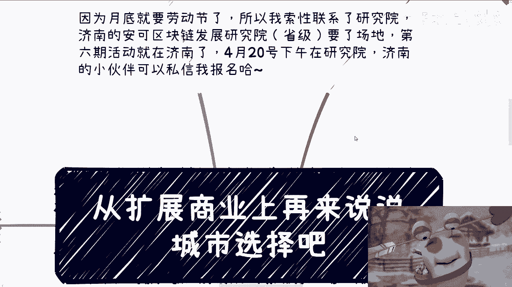
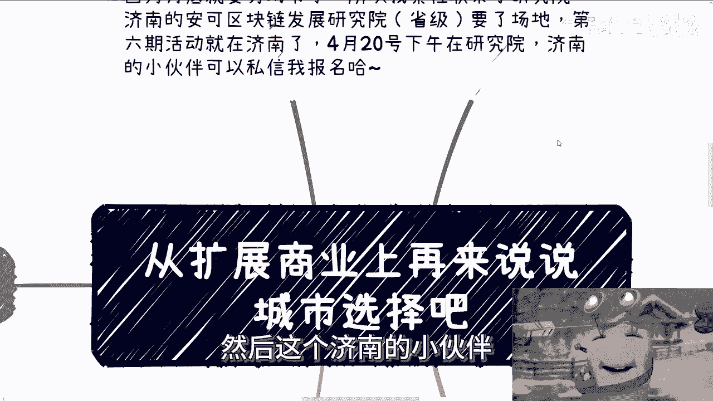
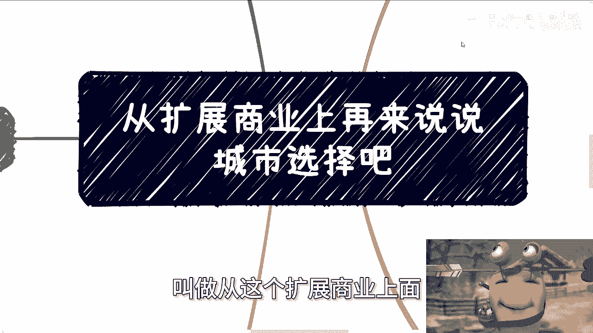
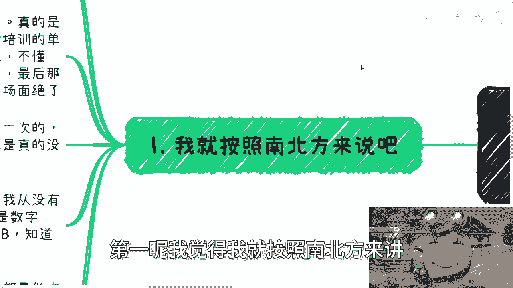
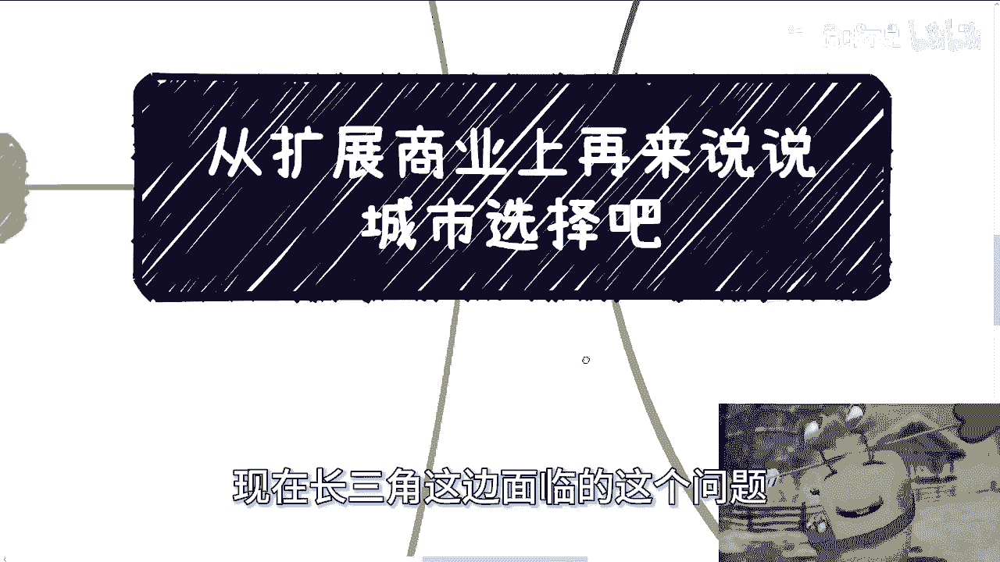
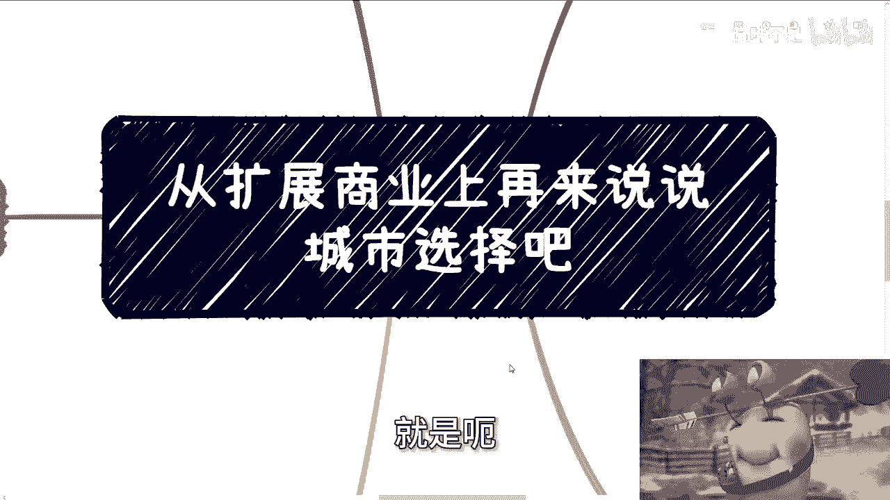
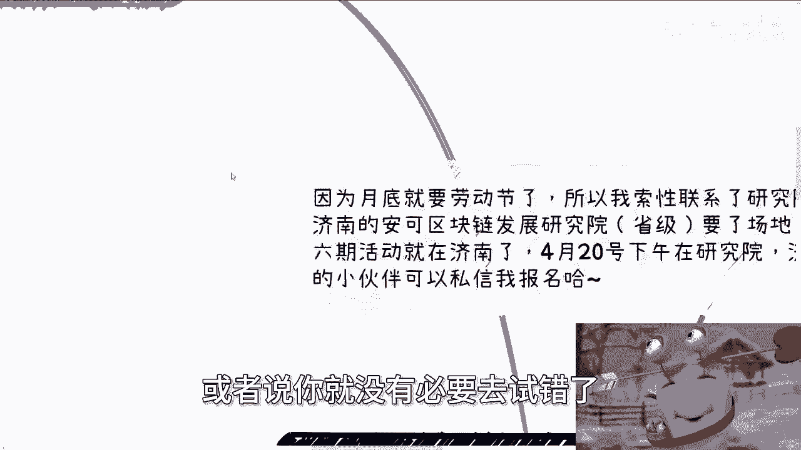
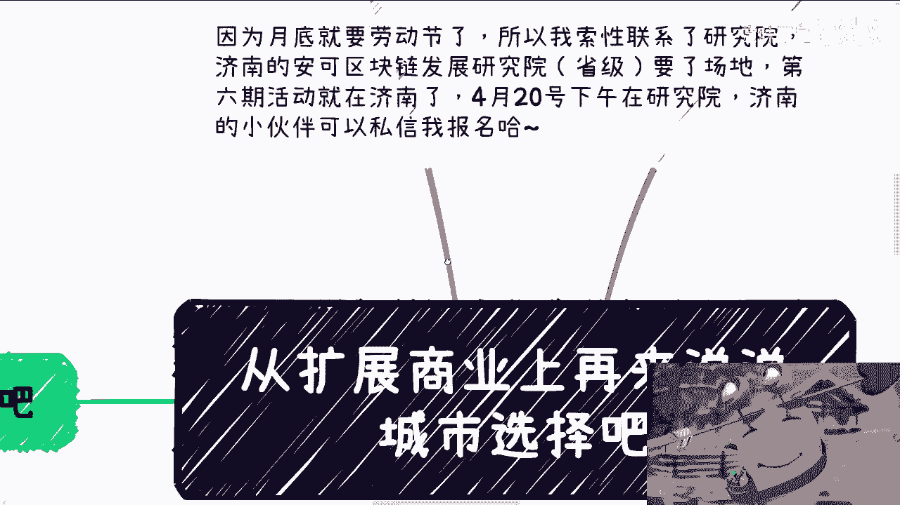
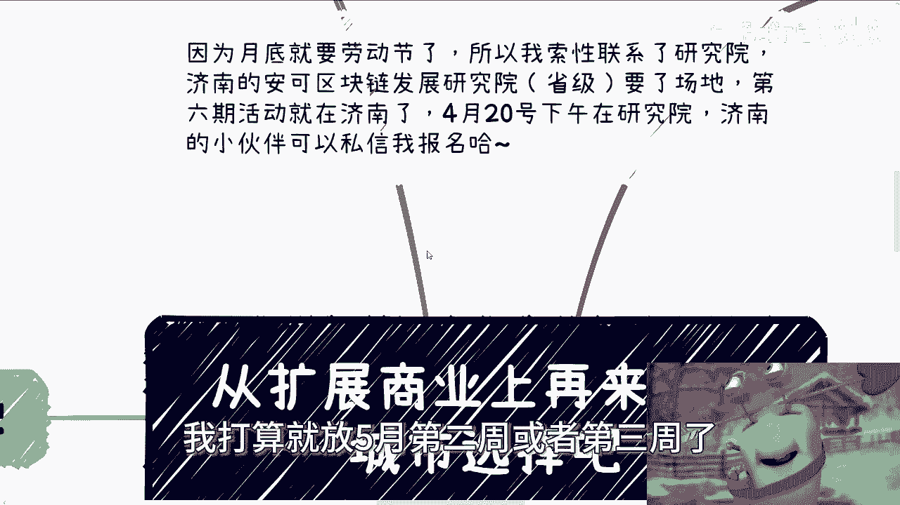

# 从商业扩展上再来说说城市选择 - P1 - 赏味不足 - BV1Mm421E792

好啊大家好啊，我先跟大家说个事儿啊。

就是月底呢是劳动节啊，我本来想着呢，这个月底呢是本来啊是想着说在农场活动的，但是呢我后来看了一下这个叫什么，就调休调的有点比较尴尬，就月底我也搬不了，因为大家肯定都出去了，呃劳动节呢肯定在外面啊。

然后劳动节之后第一周呢我估计也没回来，所以基本上我要办下一场呢，就是在劳动节第二周就5月份第二周了，那跟现在基本上就差一个月，所以我觉得也没必要啊，所以呢我就当机立断啊，索性联系了那个研究院好吧。

就是在那个山东济南啊，然后济南的这个安可区块链发展研究院，是省级的，是当时这个省政府啊，跟那个航天航空一起办的啊，然后我要了场地，然后第六期的活动就放济南，放在下周好吧，放在下周六。

4月20号下午在研究院，反正嗯能来多少人算多少人吧。

我也不指望了，然后这个济南的小伙伴反正有空的可以来啊。

顺便也可以到研究院参观一下好。

那么本期这个主题叫做从这个扩展商业上面。

我再来讲讲这个城市的选择，第一呢我觉得我就按照南北方来讲。

因为什么呢，因为你细分没法分，你容易被喷对吧，你说我说这个城市好像那个城市不好对吧，肯定要被喷啊，而且从经验上来讲呢，我出差虽然去过很多城市对吧，但是真的工作或者住呢其实还是少的。

所以说你让我说呢也可能也有失偏颇啊，那么我先说说，我这很久之前去一些城市的感受啊，就当就当八卦了啊，呃你比如说我第一次去武汉啊，那当然啊就是我以前出去啊，我自己从来不出去的啊，我出去开始。

就是因为接那个有了那个政企咨询的，这个业务啊，然后呢就是说嗯相对来讲吧，对我来讲吧，是因为有了政企咨询的业务，所以我才往各地方去跑，然后跑呢就我就顺当顺便当旅游了对吧，然后呢我跟当地的就是这个甲方对吧。

也会聊一下，那也也也也会有一定的这个这个感悟吧，啊那你比如说武汉对吧，我当时第一次去就是咨询培训的单子，然后呃我基本上就没出去过嘛，啊然后高铁到了武汉站呢，当时就是我印象很深刻啊，因为很多年前了嘛。

就当时还没停下来，就最后滑行的那段路嘛，我我我看窗外啊，我就有种那种核弹炸完的即视感，你知道吗，就那种漠视那种城市的既视感，就有种就是说啊高楼很多对吧啊，然后就是那种那种北北斗神拳跑出来的，这种感觉啊。

然后呢就是我当时给他们做讲座是在光光谷嘛，然后还有印象很深的，就貌似貌似就是到现在就这一次，就是我坐公交车是跟着跑的啊，然后我说实话，我到现在别的地方我是真没有跟着跑过啊，然后北京呢我第一次去呢。

我也很懵逼，因为当时我从我我我在的那个呃地方啊，就是那种地铁站都是数字的嘛，那没有AB口的嘛对吧，然后我到北京那边就过去啊，首先就北京这地铁我去呢就感觉很破对吧，然后那个AB呢，他旁边还有个圈是吧。

哎呀把你画个圈啊，然后那个我去那个地铁站，我反正肯定是不记得了，但是他那个圈呢还不是那种印上去的感觉，像那种手绘或者就是喷漆喷上去的，你知道吗，然后你就就知道是地铁站，我当时去，因为我不知道嘛对吧。

就知道的是地铁站，他妈不知道的，还以为他妈我在打cs呢，你知道吗，就嗨呀，真的是因为毕竟我怎么说呢，我对吧，以前出来没出去之前，我觉得啊这个首都嘛对吧，那么我当时就感觉我靠他妈的，果然城乡结合部是吧。

然后深圳最早的时候去呢，反正也还小，所以呃反正也是做咨询去的，那就像我之前说的对吧，就我是不懂的，你不就是比如说中介把我卖了，我都不知道的对吧，然后我去当时我接待我那个人啊，他们就吓唬我。

就说啊这个这边分关外关内的，关外很乱的对吧，怎么样怎么样怎么样，反正我我第一次去啊，我印象就是感觉好啊对吧，都是绿化，都是这种大树，因为上海上海看不到啊，上海当时他妈都荒漠啊。

我靠然后这个环境特别好对吧。

晚上去撸串，我觉得氛围都拉满了，哎呀就就就不太行啊。

就不太行，然后说说为主题啊，我觉得先说北方呃，北方这边呢，我觉得总总总结来讲就是如果你是一个普通人，并且你家底不够厚，并且你这个家底以后就是如果有一点家底，同时也不够你挥霍啊。

包括你家里面没什么关系的对吧，不就这种关系是不够，给你直接拉到那个对应的合作关系的，或者说你自身属于那种比较单纯，比较傻白甜的对吧，那我就跟你讲啊，你除非是吃饱了撑的，或者说觉得啊我对吧。

就就非要非呃就那种非要就是说啊我不入地狱，谁入地狱啊，那除非你抱有这种想法，否则呢我觉得你就不要去挑战那个地狱模式啊，那我在北方的总体感觉就是说喝茶吹牛对吧，然后就告诉你我上面有人，然后给你画饼。

然后表现出来自己非常牛逼啊，然后自己很有地位，很有钱，最后一毛不拔啊，就是就说白了，我觉得你把他说的话全部反向理解，我觉得也没什么太大毛病啊，那说实话我在北京这边耗的时间其实也不少啊。

至少也是按年算的对吧，就至少单位也是一年啊，一年以上，你就比如说北京山东这种地方对吧，就地狱模式啊，就是你真的要做点做点事情，你起码啊我们就说你起码是经历这几个大坎儿，而且这几个大坑你就算经历过去了。

你也不一定赚得到钱啊，第一个是什么，就拍马屁，拍马屁，你少不了的彩虹屁，我跟你讲啊，哦我就告诉你，不管对方是不是个，你反正都要拍，没办法怎么办呢，毕竟你说是不是真的有关系，你不知道对吧。

是不是真的能合作，你也不知道，那当然你说啊，陈老师我可以跟你一样，我行我素是吧，不他们我跟你讲，可以你不吊他们，你得有前提，就是你至少在别的地方，你的业务是稳定的，或者说你有自己的这个关系链。

那你可以不吊他们，但凡你如果没有啊，那么我觉得你还得吊他们，而且你真的要我行我素吧，我觉得你就没必要在北方这种地方自讨，没趣对吧，你们我是我，我说你可以去别的地方啊，对不对啊，然后就是喝酒啊。

我我我就这么说吧，别别别的，我是不知道，我是真不知道啊，反正我在别的城市属于喝的也喝就喝嘛，也喝的啊，呃但是去了北方或者去了北京之后，我就跟你们讲啊，就是呃一方面是它的量很大。

第二方面是他的这个怎么说呢，就节奏很快，第三就是他还他不但和他还得跟你讲规矩啊，反正我跟你说我是不懂的啊，每次去都是一脸懵逼的，就别人跟我说啊，这个这样这样那样那样啊，然后呢就是你说我在别的城市喝吧。

大家也就是哎就是说有的啤酒啊，有的红酒啊，有的意思一下对吧，你在北京就不一样啊，我在北京这他妈的所有时间对吧。

只有白的，没有别的东西的，只有白的啊，那么别以为我跟你讲，别以为到这就结束结束了啊，就最后呢你要赚钱，对吧，我跟你说啊，假设啊你能赚钱，我跟你说在北方大概率哦，我们说假设你可能赚到钱的情况下面。

你一定是先亏钱，就是说我总结下来就是这么个结论，就是北方是属于就是说你要么先花钱，加入个什么组织对吧，要么就是说先自己垫钱去做对吧，反正花不花钱跟你赚不赚钱绝对没有因果关系，就是在我看来花钱是一定的。

赚钱是看命哼，就这么个情况啊，然后南方呢我觉得分开来说，就是这几年呢，其实本身南方跟以前差别还是蛮大的，你比如说以前杭州啊，前几年啊我觉得是真的牛逼，就真的能折腾，包括浙江这一带其他的一些地方啊。

各种大会啊，然后吸引各种人才啊，各种政策其实很多很多，但是现在这情况啊，你先不说这今年的就是阿里撤撤，那个撤掉这个事，就算他不撤啊，杭州前几年用力也是太过猛了哦，你会发现就是说不管是政策还是说是基金。

还是其他各个方面都太猛了，就现在基本上有非常多，前两年留下来的产业园啊，小镇啊都是人去楼空的啊，我不能说都空嘛，就这就这就跟以前完全不一样啊，但是就如我之前跟你们讲的，不管怎么样呢。

当初因为因为这些项目，或者因为这些原值赚到钱了，反正也都赚到了对吧，就就这么回事啊，然后我我觉得呢上海其实以前呢也还行啊，也还行，但近几年也不行，就这种不行呢，跟北方设置的。

我刚刚说的那几道大门槛呢还不太一样，就是说他虽然不会出现那种，比如说太过于拍马屁或者这么猛的去喝对吧，但是他就是我基本上都会跟很多人说，我说上海这边的商业环境就属于那种排外啊。

就是说并不是说在玩的人他就一定有关系，而是怎么样啊，或者说怎么样，而是说他们可能只是因为入局早对吧，或者说已经自己有一亩三分地，但是你在上海这边接触，你就会发现，大部分的这种能够在里面有自己。

一亩三分地的人呢，他就不愿意分出来，就是他没有这种哼，他没有没有这种精神，也没有这种叫什么，就是这种态度，反正啊所以说总体来讲啊，南方这边是属于啊困难模式，那机会呢是有的，但是相比以前就少了很多。

以前我觉得就属于普通模式，现在就已经从normal变成hard啊，然后如果要探索呢，我觉得当下你可能一开始选择南方，多多少少还是有点有点有点可能性的啊，那么接下来就是来说这个珠三角和南三，长三角的问题。

我跟你讲啊，这两个地方其实片酬还是很不一样的，而且很明显就是你从宏观角度来讲，珠三角整体的成本它肯定是低于长三角的啊，然后珠三角你碰到的人你更会做生意，而且你会发现他们的这种生意的头脑。

是刻在DNA里面的，而且珠三角这边人呢你会发现他相对更积极，当然这个积极怎么说呢，就是说你你你你我们就这么说吧，就是他他的这种积极可以是正向的积极，也可以是野路子积极，但是不管怎么样，我们都叫做积极啊。

那么从政策整体整体来讲呢，我觉得你选择行业，如果符合政策发展或者红利期的话哦，那么长三角呢我觉得是更适合，就是呃做政府生意，做一些大弊端的生意啊，然后珠三角呢，就更适合去做一些中小企业的生意。

以及散户的生意，当然啊从做事的方式也很不同，因为这我跟你讲，这不是这两年的问题，一直以来都是如此的，长三角这边呢就相对来讲，条条框框相对有点放不开啊，其实我跟你讲，上海就属于一直放不开的。

就长三角这边我觉得就是一直放不开的，因为你但凡放得开，我就跟你们讲，2000年开始的互联网，上海也好，长三角这边也好，绝对不会这么垃圾，你们自己去看看，互联网企业内有几个大厂在上海的，有吗哈。

我之前也许有，后面他妈都被收购了，等于没有对吧，那你你你我知道你们现在在想什么，你们现在想的是当下啊，上海可能有几家，对不对，好，这就更垃圾了，我们就不说了对吧，没什么好说的。

说了也说不定要被人家发律师函是吧，反正呢我跟你讲当下发展发展啊，综合来讲就是我觉得珠三角的发展比较多，而且来说路子肯定比较野，你能碰见的合作伙伴的概率也肯定更高啊，长三角这边呢你你你你去沟通下来。

或者你碰到人，我跟你讲，你大概率感觉是什么，就是大面积躺平，就是因为现在长三角这边的情况是什么呢，就是嗯有点偏向于香港，有点偏向于香港，可能没有香港这么明显啊，就是我的感觉。

反正就是说啊上面有钱的或者是有资源的，他肯定自顾自的玩儿啊，那么呃如果有很多拆迁户啊，或者说他原本家底有点家底的，他也不想折腾，然后剩下那些没有钱，没有家底的，他自我感觉就是评估就是哎呦。

我折腾也折腾不出来，那不管他什么原因，你就会发现大面积躺平，所以说你说你能不能碰见，碰见一些人才能碰得到的，你说能不能碰到一些有积累的呢，做商业的也碰得到的。

但是你指望他们跟你合作不可能啊，这个就是我觉得现在长三角这边面临的。

这个问题，所以说你们可以想一想，就是呃但是在这个地方是这样的。

我忘记了，我还有最后一个没讲，就如果你要纠结大城市跟小城市的话。

我觉得是这样子的，假设你真的是要拓展自己的商业业务，我不管是你有业务要去拓展，还是说现在从0~1去做啊，首先城市这个东西你不要去纠结，因为我们要做商业就是看钱在哪，我们去哪。

你没有哪个人赚钱是限制在城市里面的啊，首先这是第一点，第二点，不同城市的特点是的确有点明确的，有点明显的，你考虑呢的确是要考虑进去的，比如说啊合肥互联网啊，大家说到合肥对吧。

说到互联网可能就有科大讯飞啊，然后重庆呢就很明显的是传统工业制造业对吧，那你说啊我去做互联网，你说我要做做游戏了，我要做什么好，我问你，我说你在哪里做，我在重庆做，那你不是自己跟自己过不去对吧。

然后你比如说还有无锡，无锡，我跟你讲，我就是我就是这辈子就黑啊，无锡是什么，就坐吃山山空，无锡就是垃圾，简直就是垃圾啊，好那么综合的思路呢，就是说你在大城市呢是为了套关系，套案例，不是为了赚钱的。

你真的为了要赚钱，你是要到比如说一线一点，五线或者二线或者准一线那些地方，双相对大城市来讲的下沉市场去赚钱的，然后一些再下沉的市场呢，基本上很多地方是地头蛇垄断的，所以说你如果没有太直接的关系。

你就不要去鸡蛋碰石头了，没有意思的，或者说你就没有必要去试错了。

这种试错试出来也是假的对吧，好好吧。

那么OK啊，那么4月20号好吧，下午在研究院好吧，在研究院，然后呃放在济南，你们要是济南这边小伙伴有空白的，那么你们就找我去报名好吧，然后4月份就结束了，因为大家就劳动节了，我在下一期的话。

我打算就放5月第二周或者第三周了好吧。

然后职业规划商业规划还有什么合同啊，啊股份啊对吧，包括你们这个手上有什么牌啊，你们觉得想通过我的这个视角啊，来跟你们讲讲怎么打的或者怎么样子的好吧。

