# 从商业扩展上再来说说城市选择---P1---赏味不足---BV1Mm421E792

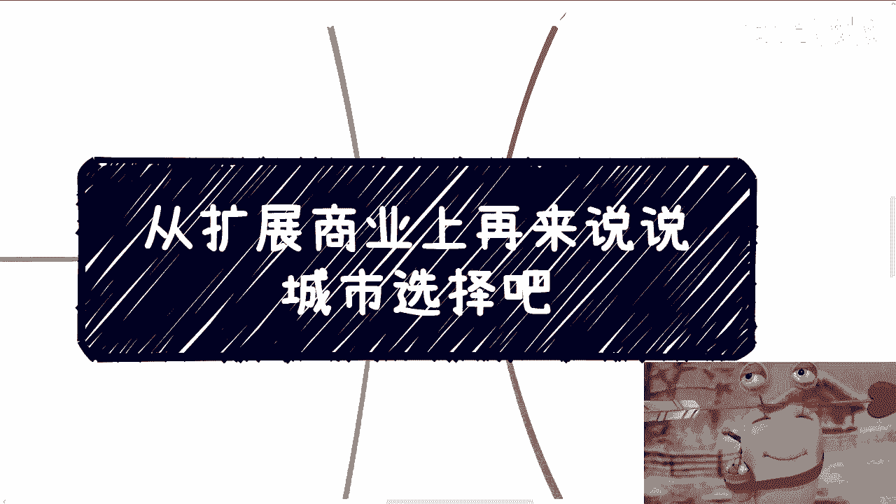

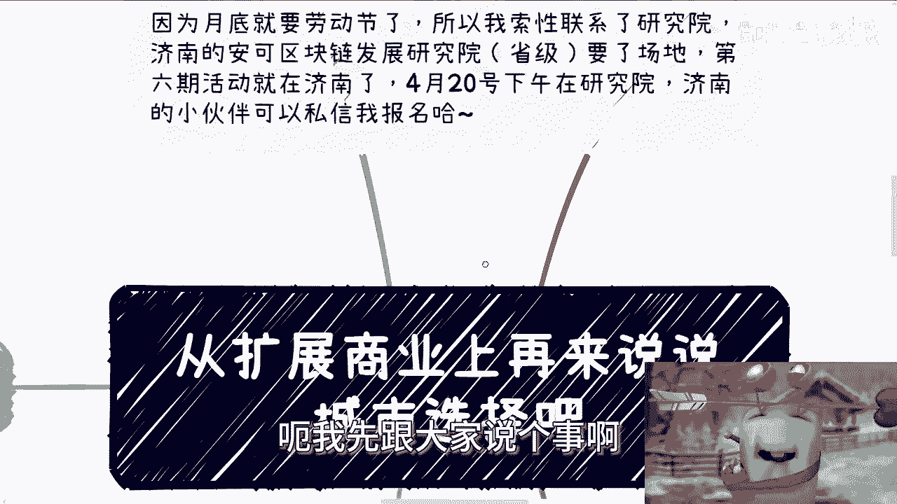

在本节课中，我们将从商业扩展的视角，分析不同城市的特点与选择策略。课程将涵盖南北方城市的宏观差异、长三角与珠三角的对比，以及大城市与小城市的定位思考。

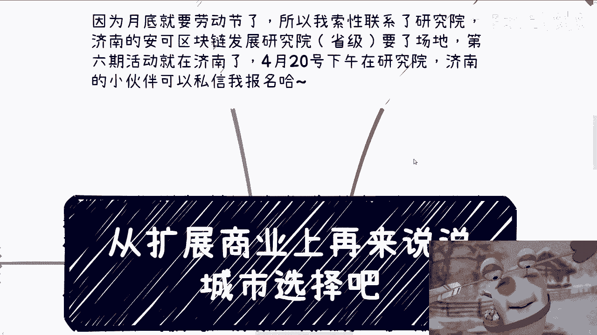

---

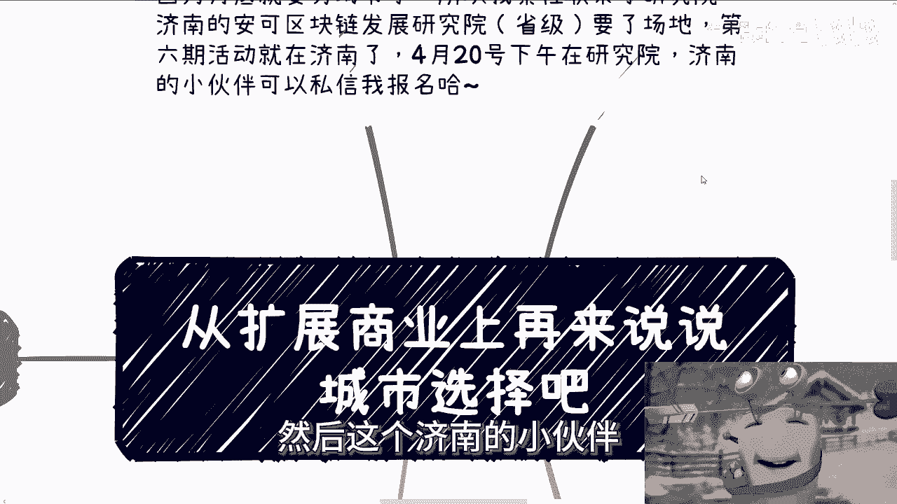

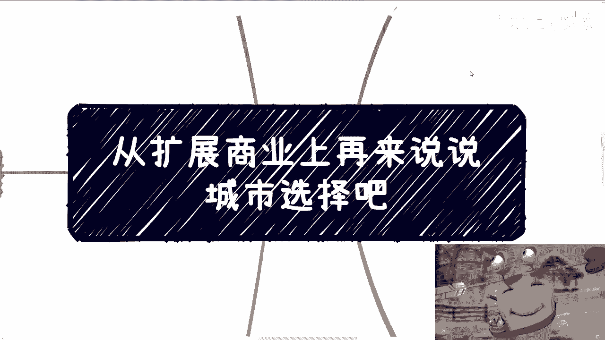

## 活动通知 📅

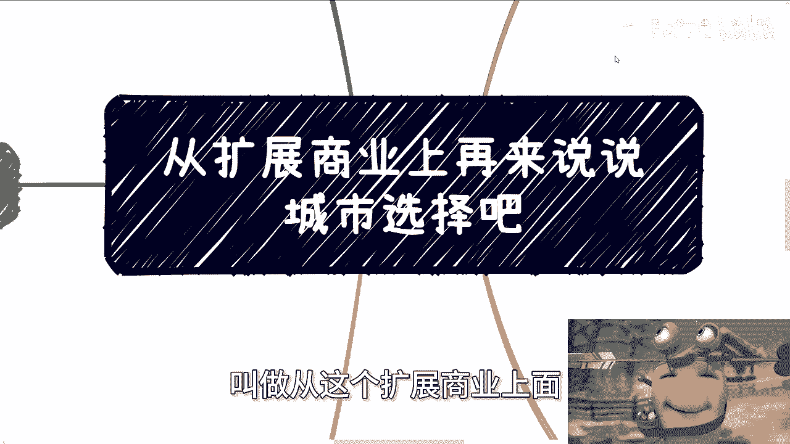

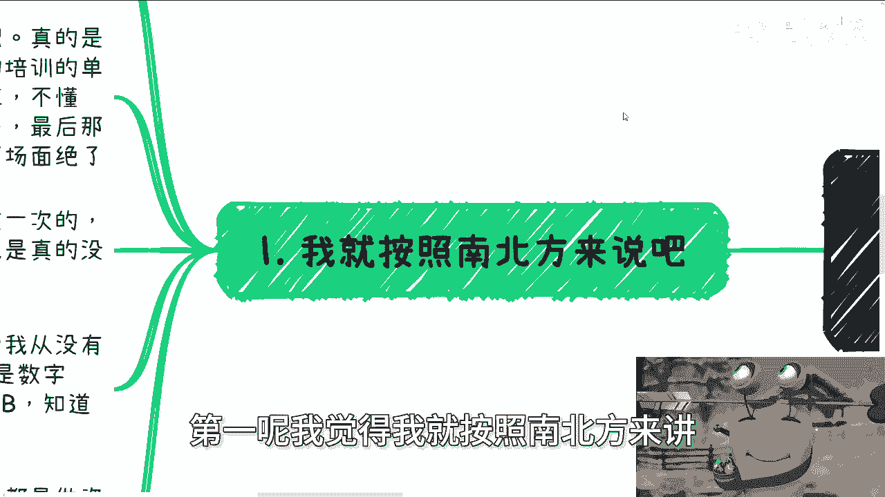

原计划月底在农场举办的活动，因劳动节调休安排，将推迟至5月第二周举行。

因此，第六期活动定于**4月20日（下周六）下午**，在**山东济南的安可区块链发展研究院**举办。该研究院由省政府与航天航空部门联合创办。

济南及周边地区有兴趣的伙伴可以报名参加，届时也可参观研究院。

---

## 个人城市印象杂谈 🧳

本节分享一些早年因政企咨询业务出差至不同城市的个人观感，这些印象虽带主观色彩，但可作为背景参考。

*   **武汉**：初次到访时，车窗外高楼林立的景象带来一种独特的视觉冲击。在光谷地区，曾有过追赶公交车的经历，这在其他城市未曾体验。
*   **北京**：首次抵达时，对地铁站的陈旧设施和独特的标识（如手绘风格的出口圈）感到意外，与想象中的首都形象存在落差。
*   **深圳**：早期到访印象是绿化环境优美，与当时上海的情况形成对比。晚间大排档的氛围令人印象深刻。

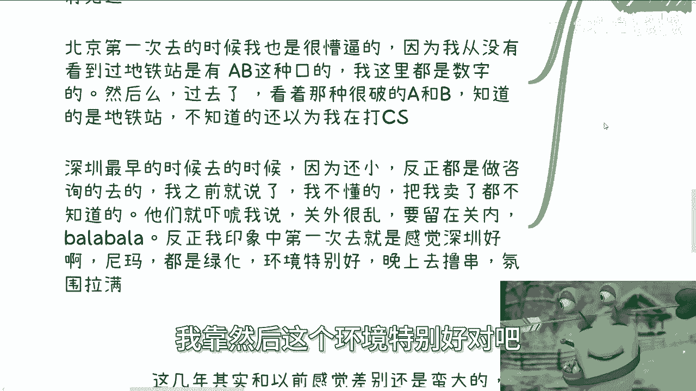

---

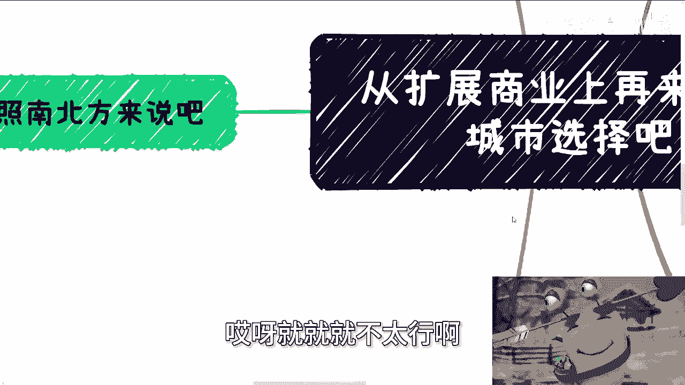

## 北方城市：地狱模式挑战 ⚠️

上一节我们聊了个人印象，本节中我们来看看更具普遍性的商业环境分析。首先聚焦北方。

总体而言，如果你是一个家底不厚、缺乏强硬关系背景，且性格相对单纯的普通人，那么选择在北方（如北京、山东）开拓商业业务，无异于挑战“地狱模式”。

以下是北方商业环境中常见的几个特征：

1.  **社交文化**：普遍存在“喝茶吹牛”的风气，交谈中常强调人脉与背景，但实际承诺与资源投入可能有限。一个简单的判断方法是，有时将对方的话语反向理解可能更接近现实。
2.  **关系维护**：“拍马屁”或表达敬意往往是必要环节。除非你在别处已有稳定的业务根基或独立的关系网，否则难以完全我行我素。若无法适应，或许应考虑其他地区。
3.  **酒桌文化**：饮酒不仅是交际，更讲究量、节奏和规矩。例如，商务场合可能主要饮用白酒，且有一套复杂的礼仪，对外来者构成一定的认知与适应门槛。
4.  **投入与回报**：在北方，**先投入资金（如加入组织、垫资运作）是普遍现象，但这与最终能否盈利没有必然因果关系**。公式可以概括为：`投入 = 必然；盈利 = 概率事件`。

---

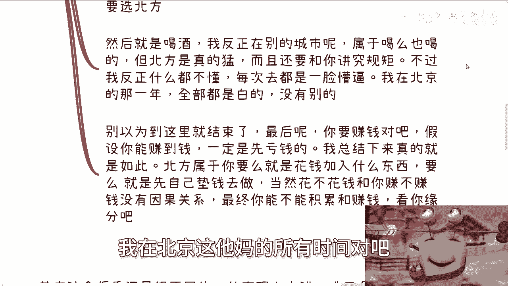

## 南方城市：从普通到困难的转变 📉

聊完了北方的“地狱模式”，我们转向南方。近年来，南方的商业环境也发生了显著变化。

*   **杭州/浙江**：前几年依托阿里巴巴等巨头，在政策、人才、会议活动上投入巨大，创造了大量机会。但近年来用力过猛的后遗症显现，许多产业园和小镇人气不及以往。不过，早期参与者确实从中获得了红利。
*   **上海/长三角**：与北方设置的高门槛不同，上海等地的挑战在于“排外”与“封闭”。早期入局者或拥有资源的人往往圈地自固，缺乏分享与合作的意愿。整体商业活力下降，大面积“躺平”心态蔓延。

**结论**：南方当前的商业环境可概括为“困难模式”。机会依然存在，但相比过去的“普通模式”，获取难度已大大增加。

---

## 核心区域对比：珠三角 vs 长三角 ⚖️

在南方内部，珠三角（如深圳、广州）和长三角（如上海、杭州、南京）也存在显著差异。

以下是两者的核心对比：

| 对比维度 | 珠三角 | 长三角 |
| :--- | :--- | :--- |
| **成本** | 相对较低 | 相对较高 |
| **商业风格** | 更灵活、积极、“野路子”多，生意头脑仿佛刻在DNA里 | 相对保守，条条框框较多 |
| **政策与机会** | 更适合中小企业及面向散户的生意 | 更适合对接政府、做大客户（B端）生意 |
| **人员状态** | 合作意愿相对更强，遇见潜在伙伴的概率更高 | “躺平”心态较普遍，虽有积累者众，但难促成合作 |

**宏观趋势**：珠三角发展路径多样，活力更足；长三角则面临阶层固化、奋斗动力不足的问题，与某些国际都市的形态有相似之处。

---

## 城市选择的核心逻辑 🧭

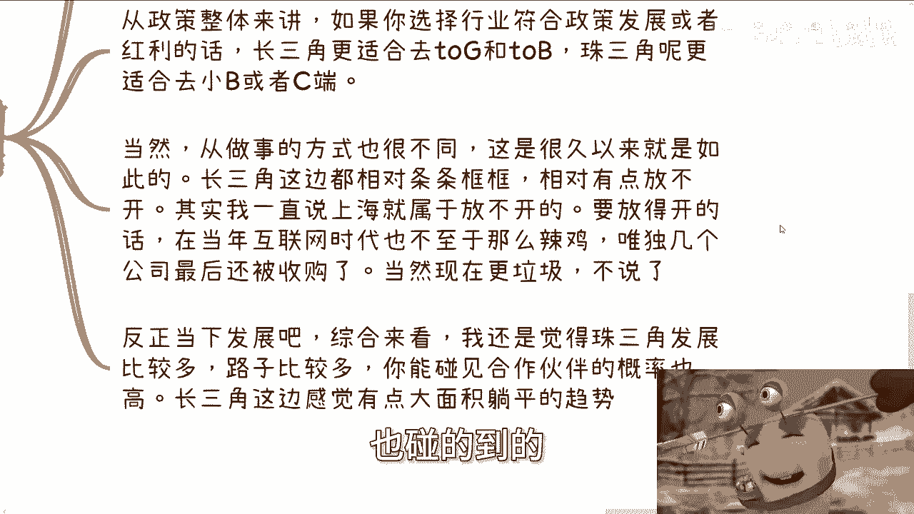

上一节我们对比了两大经济圈，最后我们来探讨城市选择的根本逻辑。

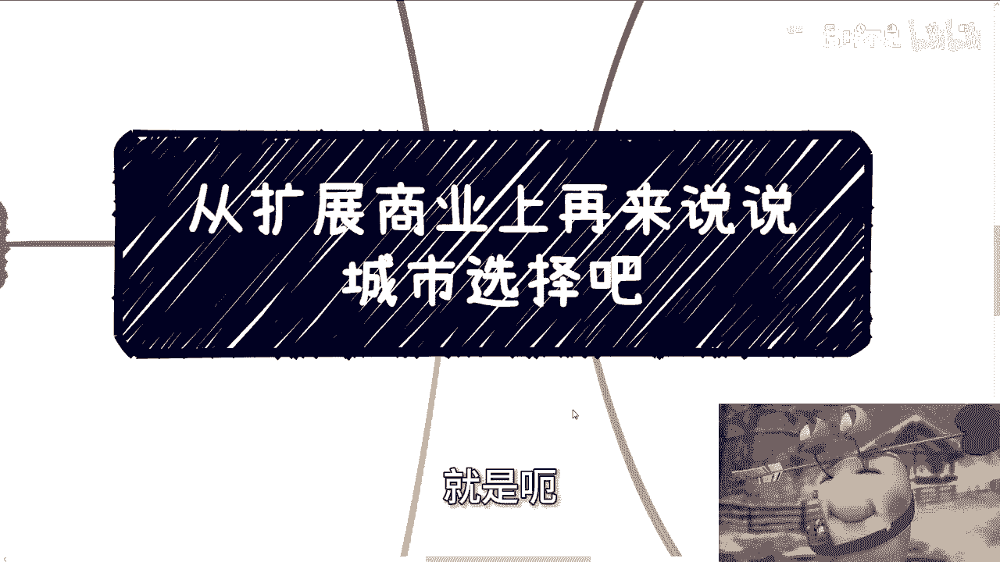

选择城市进行商业拓展，应遵循以下原则：

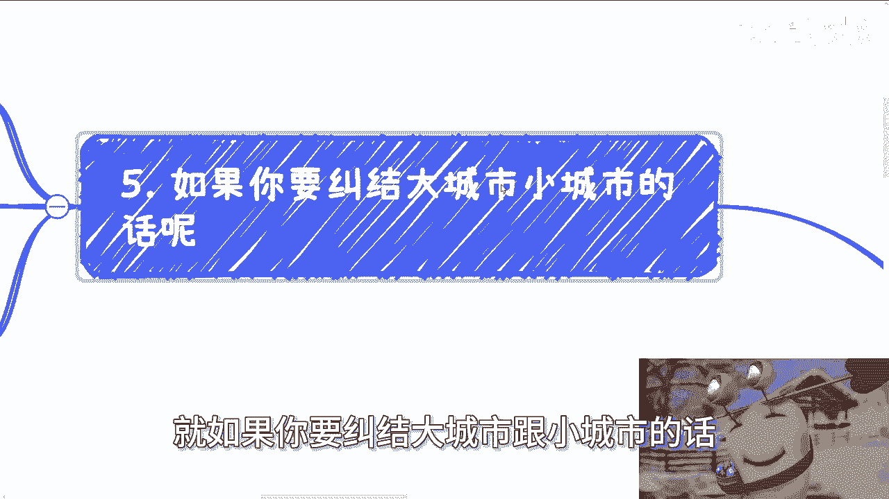

1.  **目标导向**：商业的本质是追逐机会。**钱在哪里，人就该去哪里**。赚钱不应受城市边界限制。
2.  **产业适配**：不同城市有鲜明的产业标签。例如，合肥以科大讯飞为代表的互联网/AI，重庆是传统制造业重镇。选择城市需与自身行业高度匹配。`错误示范：在重庆独立开发大型网络游戏。`
3.  **功能分层**：
    *   **大城市（如一线）**：核心功能是**积累关系、打造标杆案例**，而非立即赚取大量利润。
    *   **准一线、二线城市**：是**真正实现盈利**的主要战场，承接来自大城市的溢出需求和下沉市场。
    *   **更下沉的市场**：通常已被地方势力垄断。若无直接过硬的关系，不建议轻易进入，试错成本高且成功率低。

---

## 总结 📝

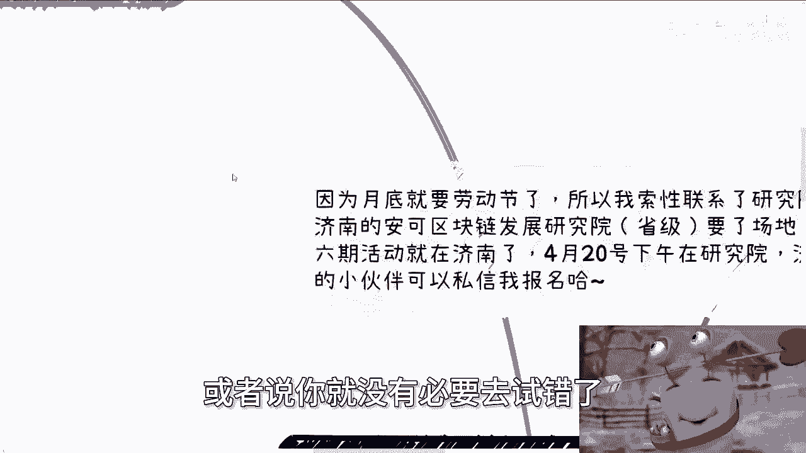

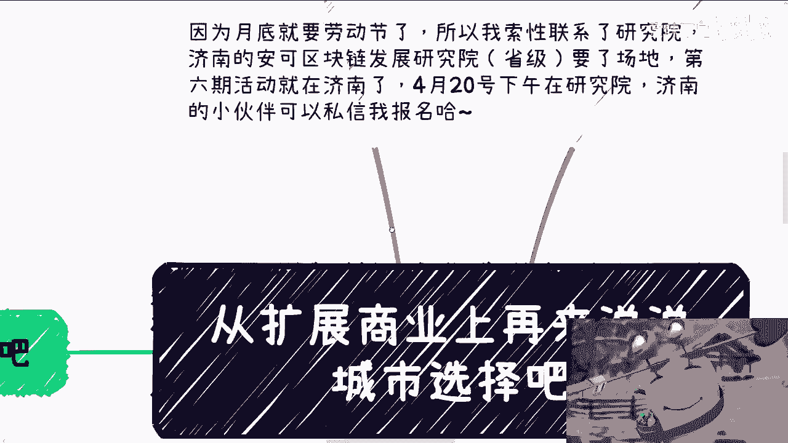

本节课中我们一起学习了从商业扩展视角选择城市的分析框架。

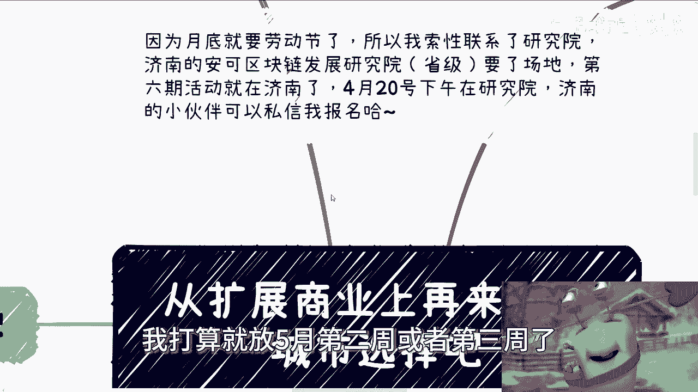

我们首先通过个人印象引入了话题，然后系统分析了北方“地狱模式”下的酒桌文化、关系学和高投入风险。接着，我们探讨了南方从“普通”到“困难”模式的转变，并重点对比了珠三角的灵活进取与长三角的保守固化。最后，我们明确了城市选择的根本逻辑：以产业适配为前提，理解不同层级城市的功能定位（大城市攒资源，下沉市场赚钱），并始终遵循“资金流向决定人才流向”的商业第一性原理。

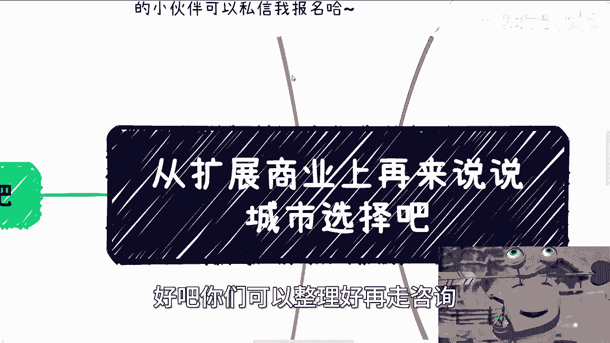

希望本课能为你未来的商业布局提供有价值的参考。我们下期再见。