# 从大头兵到管理需要的技能 - P1 - 赏味不足 - BV1gz4y1h7yx

好啊大家好啊，这个今天周一是吧，唉这个发生了一些事儿是吧，就唉呀，情绪也不是很好，这个前两天呢这个小伙伴说啊。

说呃让我讲一期啊，怎么从这个大头兵到这个leader。

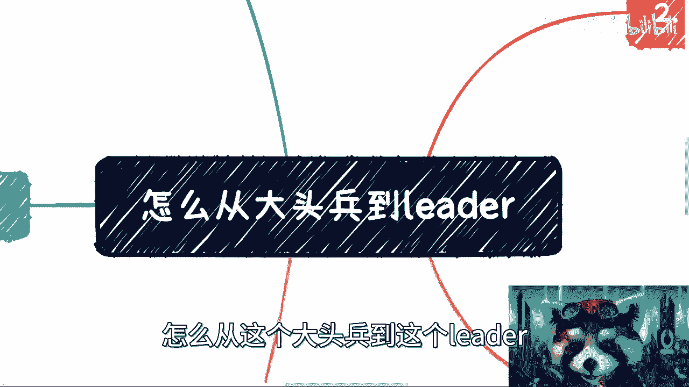

我大概罗列了一下啊，首先是这样子的，这个大头兵到leader这这件事情啊。

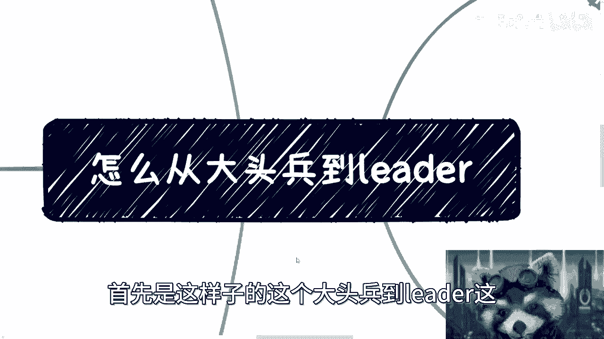

这边所有讲的内容呢是集中在公司里面的啊。

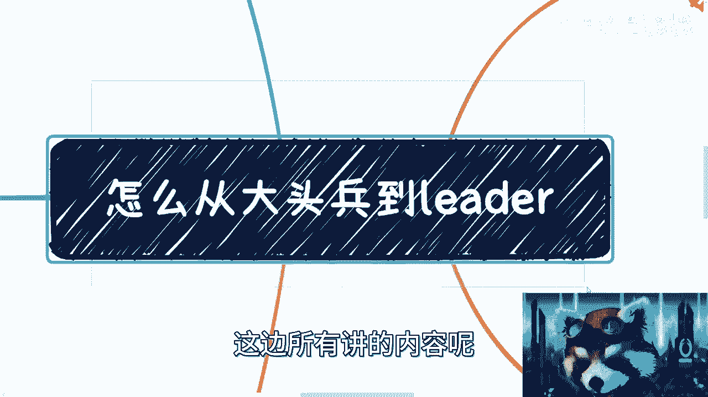

外面也没有什么大头兵跟leader的这么一个概念。

我这边呢把很多东西列了一个优先级啊。

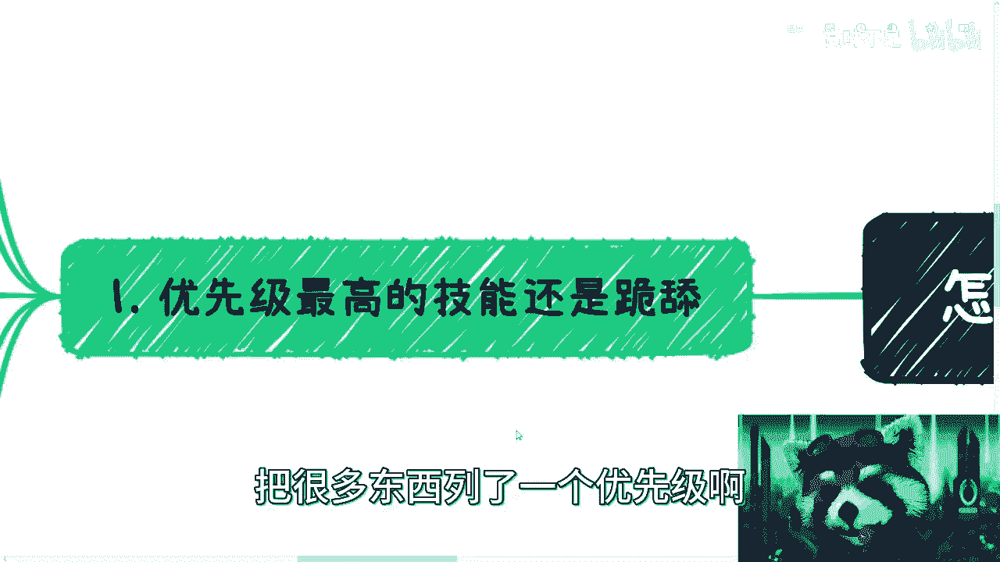

第一优先级最高的是技能啊，对啊优先最高的技能还是跪舔啊。

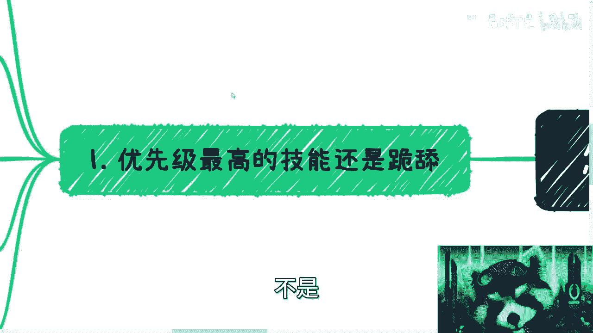

我跟你们讲，毫无疑问啊，想都不用想，就是，第一个呢就是很多人要问啊，怎么跪舔，跪舔不来怎么办。

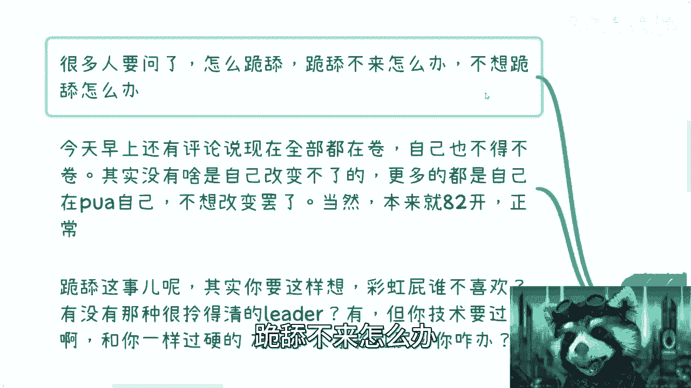

不想跪舔怎么办，是不是啊，我跟你讲啊，今天早上还有个评论啊，后来就被我拉黑了，这评论说什么呢，他说啊，他说现在都在卷啊。

自己也不得不卷啊，我没拉黑，我回复了啊，我想了一下呃，其实呢也没啥，我跟你们讲啊，就很多东西呢就都是自己束缚着自己的啊，没有什么东西一定是怎么样的，你告诉我，这个世界上有哪个东西一定是怎么样的。

有啊那没有呀，对不对，所有东西无非都是，无非都是人类这么一个生物，自己框出来的一个框架是吧，那很多东西你说现在全部都在卷，自己不得不卷，这也是自己在pua自己啊，有什么意义呢对吧，有任何东西。

尤其是这种叫做鸡毛蒜皮的事情，有什么事情是你不能改变的对吧。

你就是在自己pua，你自己不想去改变，当然本身这个社会就是八二开的对吧，很多人其实就是鸵鸟，自己在骗自己罢了，没有没有意义的，你知道吗，就像很多人跟我说，哎呀我是老百姓，我是个老普通人，我是个什么样子。

没有用的呀，谁不是普通人啊，大部分人，大部分人不是从普通人慢慢慢慢做的吗对吧，你每天pua你自己有意义的没有意义的呀是吧，然后还有跪舔这个事，其实我跟你说，你要这么想啊，彩虹屁谁不喜欢对吧。

你说有没有那种拎得清的leader，我跟你讲有的，但是就算是拎得清的leader，他知道你在彩虹屁，他他知道你在跪舔他，但你的技术本身也要过硬对吧，那么我们又在说跟你一样过硬的人，有没有多不多对吧。

整个面上面有多少对吧，那如果人家彩虹屁你怎么办是吧，就是很多事情就是就得要得要，就是得要你稍微站在一个高一点的高度。

去看这个问题对吧，然后另外呢就是跪舔这个车，在我看来，那并不是说啊就是只要说吃请客吃饭啊，或者说点好听的，其实这没什么用的，就在我看来呢，就无非两件事情，要么就是投其kpi所耗，稍等。

嗯嗯嗯嗯嗯嗯嗯嗯嗯嗯嗯好，那么对吧，这一个是kpi损耗，也就是说你要帮他完成他的kpi对吧，这个之前其实我也说过啊，那么第二个呢，就是说你要么就是私人生活的一介入，就比如说大家出去旅游啦，出去玩玩了。

怕把呃八八删了，打打游戏了对吧，大家打德扑啦对吧，很多大公司这种领导都喜欢打德扑是吧，我给你讲，一般也就这两点了，也没什么别的对吧，因为你要做很多东西。

你就不得不去啊，就是跟做这个决定的人啊，或者说做这个决定的二把手或者三把手，总归是有相关的人对吧，去做去去去去勾搭对吧。

这没办法的事情啊，那当然为什么还为什么还是称之为跪舔呢，因为很多人呢我相信大部分的这种叫什么啊，真正的啊这个好人对吧，有良心的人是吧，或者说循规蹈矩的人啊，大部分呢其实就想好好工作啊，不想尔虞我诈。

甚至呢，他也觉得就是说我也不想换什么工作对吧，我也不想就是啊大家什么什么金融危机啊。

什么东西影响我对吧，我就好，我们继续啊，我刚刚被一个事打断，嗯对那这就是第一点嘛对吧，第一点啊，嗯第二点呢。

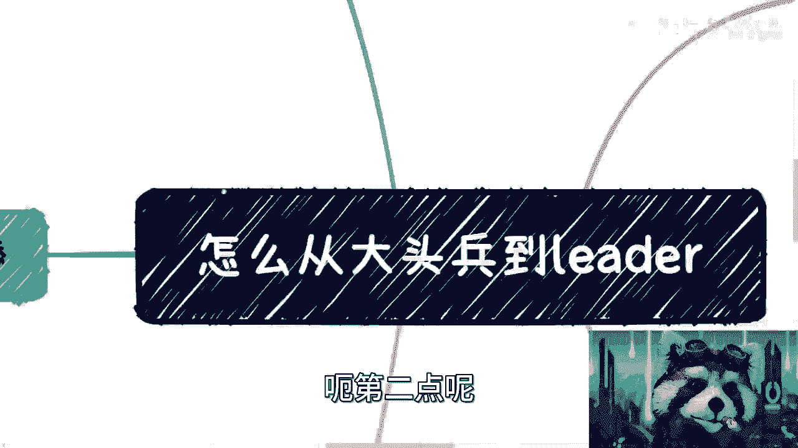

我觉得第二顺位呢就是这个到处了解信息对吧，这个事儿呢也是就是就必然要做的事情啊。

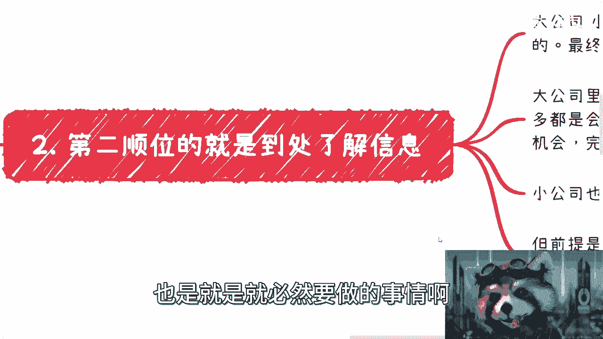

第一个呢就是大公司小公司啊还是不一样的，但本质上呢我跟你讲没什么区别，因为很多时候呢你你就是有这么个机会啊，这个机会呢要么是你通过人脉关系所得到的，要么就是通过信息差所得到的。

因为很多时候呢就是我们也知道嘛，就很多时候事情有个先后对吧，可能你今天优先了对吧，那么可能这个坑就是你的，那你落后了，可能就算你在匹配啊。

你在match那跟你也没什么关系是吧，那你比如说大公司里面有很多转岗啊，转bu啊，包括转公司啊，转合同啊，什么都有是吧，很多时候呢由于这种架构上的调整，公司上调整呢都会带来很多的head count啊。

那么这个时候就会有最好的机会啊，我跟你们说用这种时候呢就说啊，你们可以向你们的部门leader，你们可以向你们的hr bp啊，然后去这个，不是hr bp了，那个h i g毛遂自荐对吧。

我觉得这也没什么问题，而且这种时候呢可能选择性很多对吧。

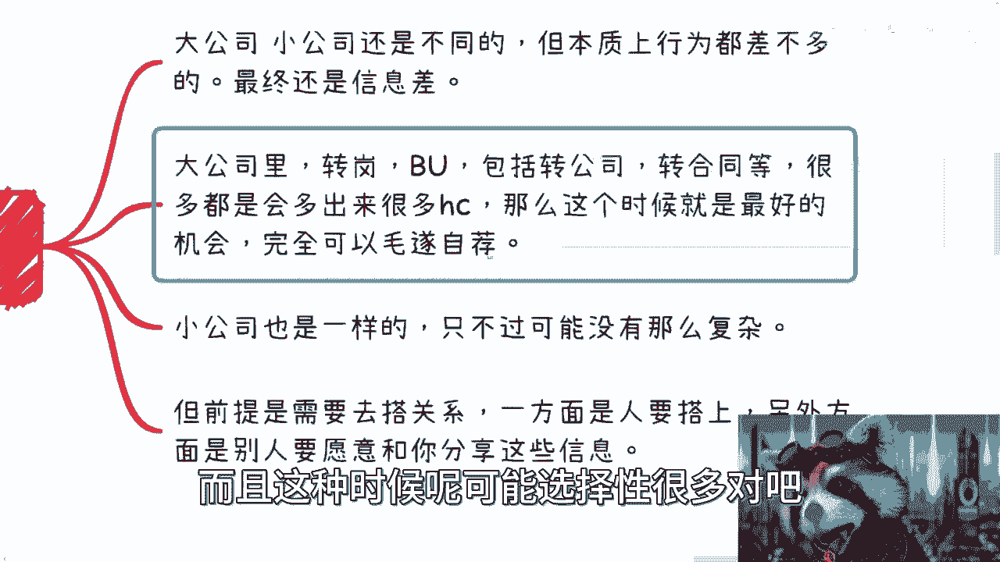

因为你不见得只有一个leader的岗位啊，那我觉得这第一个第二个呢小公司也是一样的。

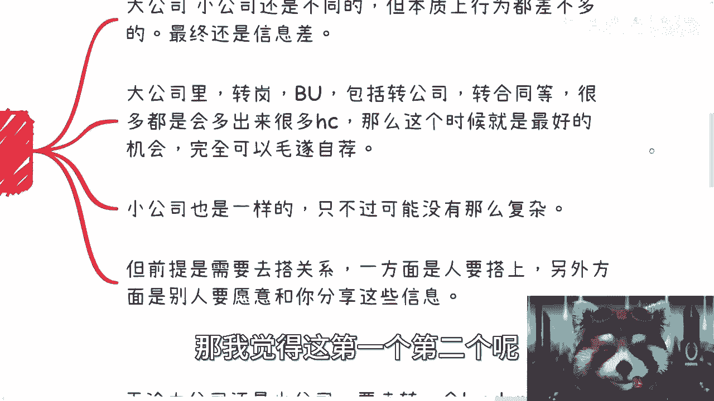

只不过呢它的流程和业务，复杂度上面可能没这么高，那么你要去这个联系的，或者你要去就是就是获取的信息，可能更多的也只是来自于比如说你的leader啊，或者你们的cpu啊，啊你们的这些这些ceo啊。

连创始人啊等等等啊，那么这种呢也就是日常得要啊，就是得要慢慢慢慢去了解的，那么在这个地方呢我也写了，就是说前提呢你要去搭这个关系，而且搭这个人啊，而且另外一方面你就算搭上了。

别人也不见得愿意跟你分享这些信息对吧，所以说你得跟他啊，就是沟通上面有非常多的嗯，就是不同的股东，有的是业务的，有的是生活的对吧，有的是你们的这个价值观的啊，有的是就是可可能其他各种地方的。

但是不管怎么样吧，啊你得沟通到，就是说让他觉得诶这个人不错对吧，这个人是一个不错的人选对吧，或者怎么样子啊，那么这个是。

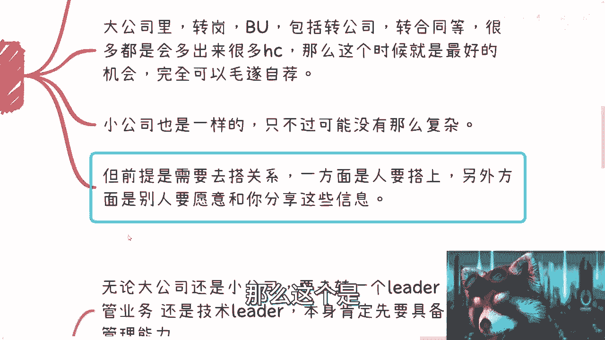

第二点。

好，继续啊，然后第三点呢就是管理技能跟大局观啊。

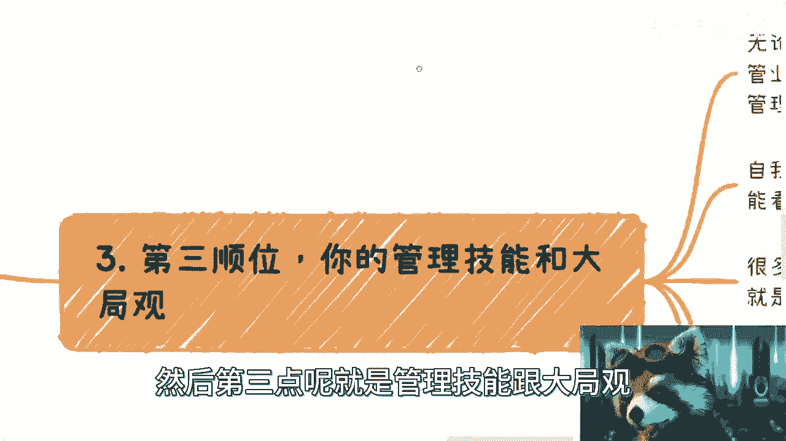

管理军团大局观念是这样子的。

你们看啊，首先啊这个无论大公司小公司，你要去转成一个leader呢，就不管你是转这个业务里的还是技术力的啊，本身肯定要具备一定的管理能力啊。

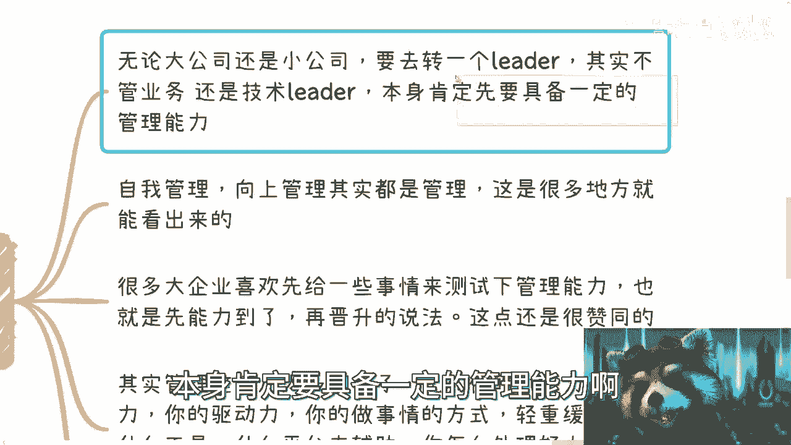

那么这个也有很多人会觉得就是管理上面吧，我觉得大家对这个东西的理解呢，可能不是那么的清晰啊，其实本质上呢就是很多人觉得。

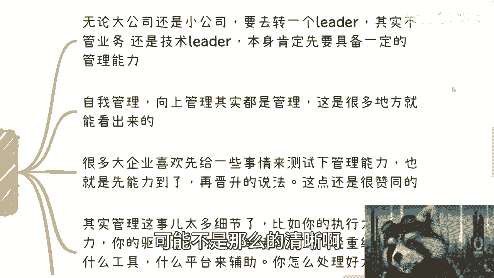

管理是一个管理团队，也就是所谓的向下管理的这么一个过程，但其实也不仅仅如此是吧，那也就是说自我管理啊，向上管理其实都是管理啊，很多地方呢就这么说吧，就是你你不用去说啊。

你说我有很强的management对吧，或者怎么样，其实很多时候的细节是能看得出你是不是有有，就是嗯你是不是一个自我管理，或者能够向上管理的人啊，这都不用去考验，你知道吧，这种这种东西。

就是说日程这个这个这个日常就能看得出来。

这都不用去考试的事情啊，然后呢还有你比如说很多大企业呢，其实喜欢他会先给你一些事情，就是很小的啊，比如说很小的一些测那个切入点，来测试你的这个向下管理的能力，那当然同时也会来看嘛。

就是说你的这个向上向上管理的能力对吧，也就是说他们秉持的原则是先能力到了。

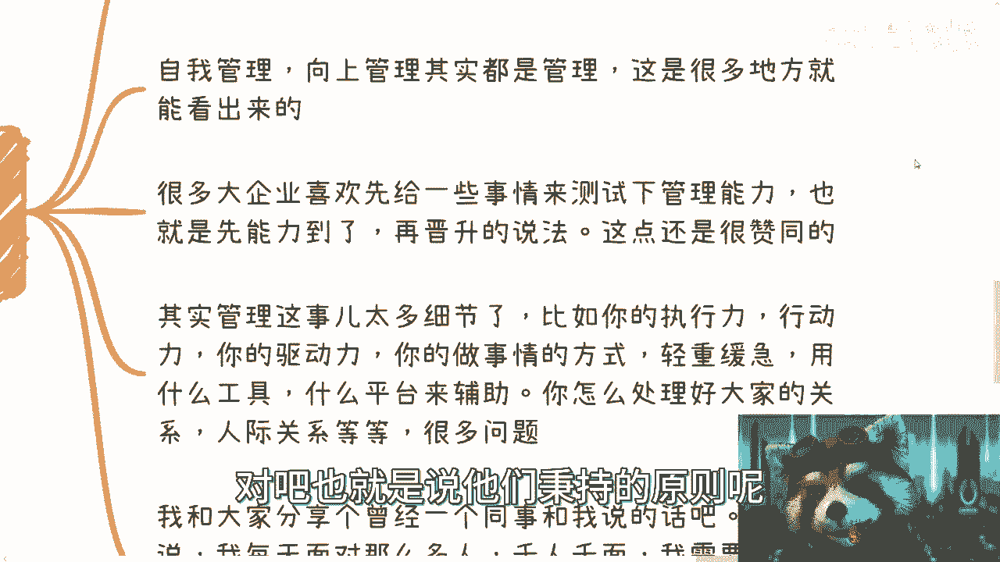

再有晋升的这个说法，那这点我还是很赞同的啊，这个肯定的嘛对吧，你如果表现不出你的一些能力或者一些方向，那给你生一个management的岗位也没有用啊对吧，呃其实管理这个事儿呢细节很多，我们举例子。

就比如说你这个人对吧，你在一个团队当中，你在一个公司里面的执行力，你的行动力，你的自我驱动力ownership对吧，你的自我驱动力，你的做实验方式，你的轻重缓急对吧，你会依赖到什么工具。

你什么平台来辅助你，怎么来处理稿，跟大家关系，人际关系等等等，也就是说你从一个大头兵对吧，到一个management这么一个岗位的时候，你会发现是你可能会有一定的管理技术。

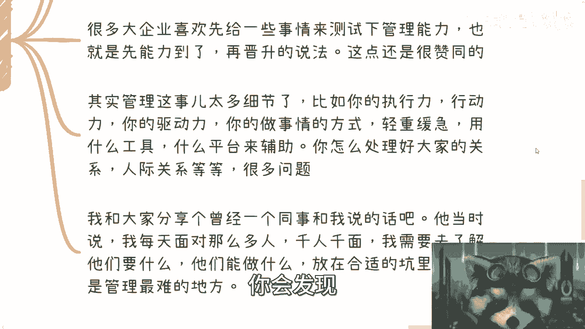

或者管理的这种能力，或者管理的这种方法，但其实最最最核心的点还是在于你与人打交道，你知道吧，就是之前我有一个朋友，他是做这个管理的嘛，他当时跟我说句话，我就我可能别的话我都不记得了啊。

啊当时跟我说句话呢，我就记得很清楚，他当时这么说嘛，他说啊他当时大概管理大概五六十号人嘛，他说我每天面对这么多人对吧，千人千面对吧，我需要去了解他们是他们要什么，我也得了解他们能做什么。

我也得了解他们自己的想法是什么对吧，然后呢包括他们的性格得要放在适合的坑里面，这其实就是管理最难的地方对吧，那当然了，这个人呢是在我看来就属于就是愿意做事情，想做事情对吧，你要说真正那些不干事的对吧。

就是靠忽悠的，靠什么样的，那其实他可能也不用考虑这么多啊。

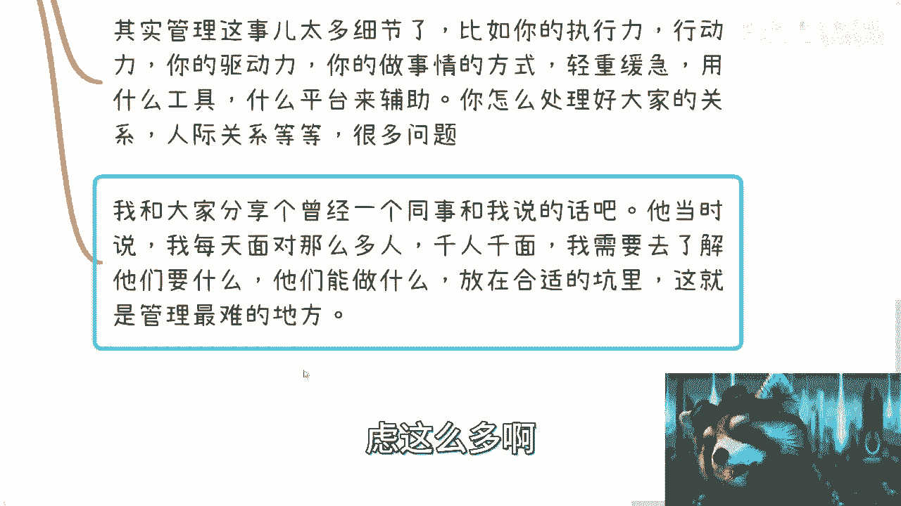

但是在我这边呢，我总归是要跟大家讲，怎么一个正常的价值观是吧。

第四顺位呢是技术跟业务啊，那么我觉得很多人呢他会把这个顺位搞错，你知道吧，他就觉得哎呀技术业务是第一顺位的，no啊no，其实呢在这个地方我也写了啊，技术跟业务呢，本身我们可能从本质上来讲。

也不能叫第四顺位啊，而是说你只要吃少过得去对吧，也就是说你你日常当中来，比如说啊不管你是80分啊，60分啊，40分20分啊对吧，反正就是你在这个公司里面混的下去。

就可以了啊，因为毕竟很多东西他没有一个固定值对吧，你今天在a公司混不下去，你可能在b公司混的风生水起，谁知道呢是吧，那这是一个第二个呢，就是太多小伙伴呢从小的价值观啊，就是说我要好好做啊。

就能得到应有的回报，这事呢我跟你们说，我只能认为这还是一种自我安慰，自我的pua或者一种逃避啊，我不管大家以前是受过什么创伤，或者小时候有过什么样的家庭，或者怎么样的背景啊，这并不重要。

重要的是你活着就是你对吧，你是为了自己活着的，那么不管你有什么原因，其实最终那个这个debuff加在，还是加在你自己身上对吧，呃然后为什么我这么说呢。

是因为本身真实的世界从来就不是这样子啊。

从来就不是这样子的啊，或者我换句话来讲，也许你们今天会看到啊，有些人做得好好的啊，做的做的蛮好的，然后呢他也得到了一定的回报，但是这两者没有直接的因果关系，或者这两者绝对不是一个完全的充分费。

充分必要条件。

这里面肯定还有别的因素，只不过你们不知道啊，那么第三呢就是其实我跟你们讲啊，学校里面是最单纯的，因为b站现在受众小伙伴大部分还在这，本科或者读研嘛，对吧，呃，然后是公司啊。

然后很多人觉得公司已经很复杂了，但是我跟你讲，你要去了社会上，你要去了商业化，完全不是一个量级的啊，在这个地方写的很清楚，对于社会商业而来讲，公司里的啊虞我诈跟你的所有的那些小九九啊，只不过都是过家家。

没有任何意义啊，为什么，因为还是那句话，你并没有赚钱，你只不过是为了帮别人打工，那么你所有的认知，所有的格局就是已经陷在那个地方了，你但凡要是想着说啊，我要自己赚钱了，我要自己去把商业这个流程打通了。

那么你才会上一个格局。

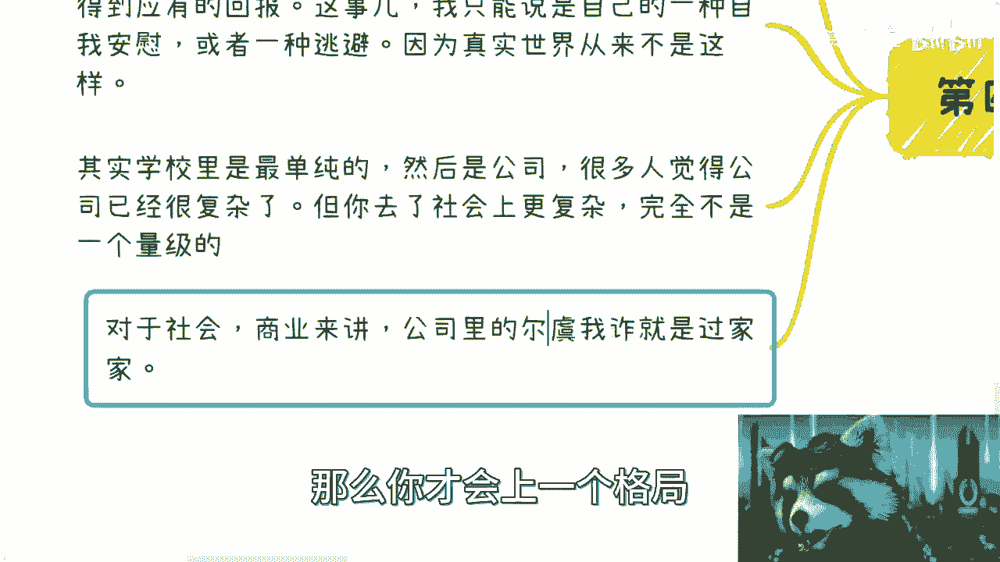

这是没有办法的啊，那么第五点我在这地方也写了啊，就是说啊当然啊这个这个这个这个leader，你就算做了leader啊，做了一个总监对吧。

你本身也只不过是一个新的开始，因为在这个地方呢，就是我要告诉你们，每个人呢都有很多知识盲区，说白了你做leader，那么lea这条这跟直线的职业发展上面，就就或者这个技能树的技能点上面。

你还有很多东西要去点，对不对，但是这跟技能点只不过是在公司这个框架下面，也就是说你在这个公司框架下面，你的技能数有一定的成长，但是从商业战场跟社会上，你根本就没有精准数啊，所以一定要客观的评估自己。

所以说从不同的格局看问题，得到的答案也会不一样，就像你站在公司里面格局，你跟我说，你当一个leader很有前途，而我站在商业角度告诉你，妈的蓝并卵对吧，但是这个时候我跟你讲，你不要杠，你知道吗。

所有人都不要杠，杠，只会让你永远止步不前，没有意义的，任何时候你都空杯心态，大家去讨论，去观察，为什么会这么说对吧，就好像我今天跟你们说，这个东西没卵用对吧，这个东西对你们有帮助的。

那么你们要客观的去评价，为什么我会这么说，我到底是因为站在商业的角度来看这些问题，还是说我只是为了pua，你们还是说我只是为了，我只是为了就是说啊有自己的别的想法对吧。

我故意的不说跟一些事实有关的东西对吧。

就很多时候你们面对任何一个人，你们都要客观的去看对吧，但是不管怎么样，你不能就不管我说的对不对啊，你不要上来就杠，你看的任何问题都一样，为什么，因为还是那句话，杠只会让你永远止步不前。

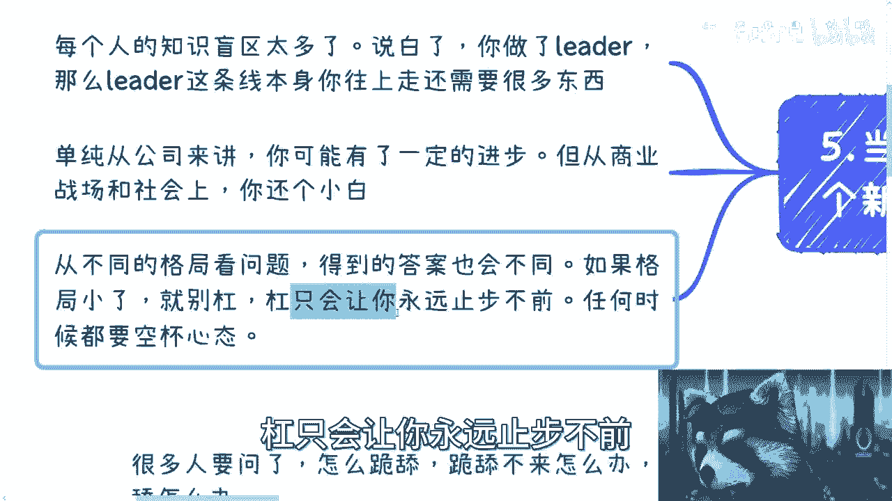

你就这点格局了，好吧啊，那包括我希望你们跟别人去传达价值观的时候。

也是一样的，因为你们如果有幸能够看过我所有的视频啊，包括如果线下跟我去讨论一些问题的话，你们就会发现我所有的问题，出发点从来不在于说这个问题本身，而在于我们是否能看清楚这个事件的样貌。

同时还保有自己的一份初心，你们大部分人，包括我所有人都做不到出淤泥而不染，但是能做能不能做到有一部分染对吧。

那剩下的保留一部分的雏形，那我觉得已经是很好好吧，ok ok那就这么着吧啊有关这个呃创业啊，或者说这个，啊创业啊或者兼职啊，全职啊对吧，职业发展反正有什么问题，你们私信我好吧。

kiss by kiss的还是比较好去走这种这个建议的，好吧行。

