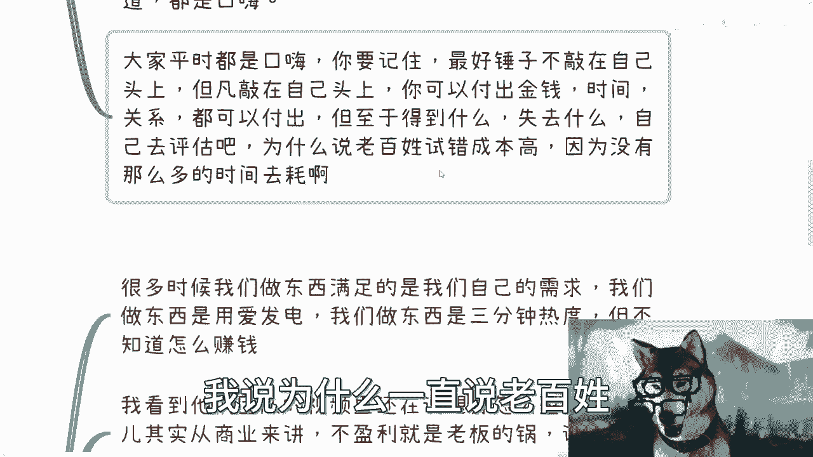

# 从小公司维权事件来谈谈商业创业的看法 - P1 - 赏味不足 - BV14V411A75c

啊大家好，这个我是狗子是吧，我换了个狗子啊，虽然也还是狗子。

这个今天早上我先说啊，今天早上看到首页呢推给我这个小鸡词典啊，这个我也我也我也不打码了对吧，反正这个事大家也都知道，我之前好像看到过啊，但是我没仔细看他的那个打官司对象呢就是新。

好像是新浪微博的国际版啊，但具体我也没仔细看呃，也许呢上下文我也不清楚，但这个事儿呢我看了一个视频，就是最新的啊，他们老板是黄老板对吧，订的写的那个视频呃，这个事儿呢我可以说每一天啊，每一个角落。

每个城市呃，每个创业公司都会碰到，当然这里面孰孰对孰错，孰是孰非，我就不去判断这个东西，我们说难听点，这个除了当事人以外，别人对吧，都不知道里面什么情况，也没啥好判断的，呃那么从这个事啊。

我说一下，就是说关于这个商业啊，还有大家创业的这个说想法啊，呃首先呢我说第一点，就是我曾经一直说的很清楚，就尽量别创业啊，因为大家根本不懂创业。

就是首先这个事来讲啊，我不判断谁对谁错，因为呃就我大概看下来，我第一感觉就是说这里面也有可能，律师都有猫腻对吧，我也看到评论区，他那个评论区有小伙伴就说嘛，其实律师也有很多是两头吃的，哎这是那没没办法。

我跟你讲，没有办法，你怎么办呢，对不对，但是谁知道呢对吧，但有一说一啊，就是说这个模式呢，我说实话就真的是太用爱发电了啊，你看啊版权也好，产权也好，这个事已经非常多年了，包括专利对吧，包括你说书。

哎我跟你我跟你们说吧，就是图书出版，就是纸质版的图书出版，这个纸质出版物里面啊，这个抄来抄去的太多了，你怎么判断他抄，你怎么让他抄了之后，比如说呃就是处罚他，我跟你讲，没有办法，有个屁的办法啊。

很多时候你面临这个问题，他就是不是非黑即白的问题，没办法啊，就很多人分不清楚啥是创业，其实在我看来，我跟你讲啊，就是呃你要去创业也好，你要做商业也好，其实都是一个很复杂的事情，我之前有个视频说的很清楚。

就是关于轻资产去做副业或者商业的，为什么呢，因为在我看来，大家要的是赚钱，而不是所谓的投入对吧，你说我要是今天过度的去投入金钱，投入时间，投入这个叫什么，我的人脉关系。

或者投入我的就是各种各样的这个时间成本，精力成本没必要啊，对不对，甚至你说你现在投入钱去做任何的成绩，我都是不支持的，就有大病吗，这不是要要当然要么你钱多了没地方用对吧啊，但是如果你跟你讲。

你个人了解不多的对吧，你依然会在每一个点上面，而任何一个点上面你都会被坑，你之所以没被坑，只是因为你当下还没被坑，并不是因为你做的很完美，你知道吧啊就我们就说游击C对吧。

因为那个小G词典也是有GC嘛对吧，你就说游击C，你你就拿我的视频来讲对吧，你B站有所谓的版权保护，没毛病啊对吧，你每次我发布的时候，上面也会点一个叫做叫做这个呃，没有我授权不允许转发，有卵用啊。

我就问有卵用，对不了啊，你们跟我说哎这个有用的对吧，你你勾了对吧，回头要是有什么问题，你可以起诉他，是这个我们待会来讲啊，或者别的平台的版权维护对吧，有用吗，没卵用的啊，就是别人你只要稍微变下声音。

变下画面，哪怕我跟你讲每个字照抄哦，就是任何一个东西你全部照抄，我们拿别人就是没办法，那怎么办呢。

对不对，无解啊，这第一第二呢我早就说过了呃，极光粉并不重要。

呃就像我们刚刚说的，你说我可以起诉台对吧，好没问题啊，所有的过程都是自证几碗粉的过程，不管你是进法院还是说网上去声讨，随便你都是自证几碗粉的过程，但是你要明白所有的在自证的这个过程当中。

你你所受到的伤痛，你所受到的伤害，你所背负的东西，只有当事人自己是永远记得的，也都是只有对当事人自己会造成伤害哦，就是那你作为粉丝，或者你作为路人，你可能会感同身受，但是这只是一段时间啊，很多人。

更何况大部分人其实就是来看笑话的对吧，你们要是不记得去把让子弹飞再看一遍，对不对，就是你要明白当事人永远是受伤最重的，我自证了之后怎么样呢，我请问怎么样呢对吧，当然在电影里面写的很清楚。

当当事人当时这么说，他说几万粉的钱对吧，你跟我说一碗粉，两碗粉，10万粉我都付得起，这是钱的问题吗，不是这个就是几碗粉的事，就是一碗就是一碗，两碗就是两碗，就是我要自证清白，但是我就请问嘛。

他之后剖腹对吧，当场没了，那自证啊怎么了呢，我就请问当时周围还有人关心吗对吧，这就好像我们今天有呃，你们作为当事人啊，你们说我最终不管了，我要玉石俱焚对吧，我就要自证，那请问他自证之后。

你说是你们作为粉丝会关心呢，还是我作为路人会关心呢，我相信不管你们现在如何义愤填膺，最终都不会关心，那没办法，只有当事人才是真正自己明白了，你知道吗，那这个是当下这个环境就这个样子怎么办呢，对吧。

你无论你是个人还是企业，很多时候你说起诉就像我们刚刚说的，哎呀你说你说很多人会跟我说，哎呀那个卢老师，你这个东西勾了对吧，万一有人抄，你就可以起诉他，是啊，我就问吧，你们知道怎么起诉吗。

你们知道流程是什么吗，你们知道去公证处公证要多少钱吗，你们知道法院通知周期是多久吗，你们不知道啊对吧，就是唉就是我们有时候啊，就是说我知道你们都是好心哦，很多人也是出于好心，但是你知道吗。

有很多时候你想想看啊，如果你们不懂，我也不懂，我就听你们的啊，然后开始我去做，但到最后谁付出时间呢，谁付出精力呢对吧，我又得到什么呢，这最终不是还是我自己挖自己挖坑吗，你说是不是。

这就好像当时我3月份刚开始做视频的时候，我记得有个人在评论区后来被我拉黑了，对啊，在评论区一直一直在跟我说，他说他说哎陈老师你你你可以出本书啊，不是我不能出，我，请问我出了我，我为什么出我图什么。

这一本书起码都十几万字，我我花这个时间，我是为了傻啊，我就为了你一句话嘛，对吧，我是吧，就是很多时候呢就是我跟你说，很多人他平时都是口嗨，你知道吗，但是我跟你讲很多呢是属于锤子，你没砸到自己头上哦。

你砸到自己头上了，你可以付出金钱，时间关系，你都可以付出，你可以去自证，但是你要去想啊，你到底得到什么，失去什么，你得去评估啊，你知道吗，你真的我就跟你说，就像黄老板，他如果真的二速，他胜诉了。

但是你想想他花了多少时间，我看过他前面几个视频对吧，单纯律师费付了15万，我就问嘛，这个当中到底为了什么，是争口气，我同意争口气对吧，但是失去的太多了，对吧，那我觉得这个地方也写了对吧。

我说为什么一直说老百姓这个事错成本高。

是因为老百姓输不起啊，耗不动了。

对吧啊，第三点，无论做啥呢，都要想好赚钱的啊，先赚钱，你知道吗，都是后话，你看啊，我这边写的很清楚，我说所有的一切一切啊都是赚钱，为什么，因为夜长梦多，什么叫夜长梦多，就是你当下能赚钱。

先赚钱以后发生什么没人知道，你知道吗，就说很多时候，我们做东西满足的是我们自己的需求，我们做东西是用爱发电，我们做东西是3分钟热度啊，但是你会发现无论是哪一种，你就是不赚钱呃。

呃包括就是说我看到他们团队里那个视频，还在说，就说要去想怎么盈利对吧，呃客观的说啊，这个事儿其实从商业来讲，你如果做一个商业开始开始去创业了，我不管你融资不融资不盈利，我跟你讲就是老板的锅，你不用看了。

说白了就是你说白了就是你要受苦，一个人受苦啊，还是说拉着团队一起受苦对吧，那你不盈利不盈利，创业是为了什么呢对吧，因为你只有盈利了才代表认可，你只有盈利了才是细水长流对吧，你你你说为什么。

那我告诉你为什么，就因为社会就这个样子，人类社会就这个样子，那怎么办呢，对不对，当然你比如说我有一个专辑名字也写的很清楚，我说错的不是我们是这个世界对吧，那因为如果我们撇开所有的东西对吧。

就是用一个非常客观的这个三观来评价的话，我觉得用爱发电没有错啊，去做自己想做的事情更没有错了对吧，没有赚钱其实也没有错，谁说创业一定要赚钱啊，但可惜的是你活在这个环境里面，你活在这个时代下面。

你怎么办呢，你没办法呀，对不啦，那视频里面还提到一个观点，说没有盈利之前用户的资产啊，产出的这个数据，产品的这个数据是不是有价值，我跟你讲这事儿怎么说呢，对吧，就是说你从我角度来讲啊。

首先我会质疑这些数据的版权到底怎么定义了，对吧，这些数据又如何判断是不是原创的啊，他的就是说版权是怎么去定义啊，其次有没有价值这个事儿，你在人类社会里面不是自己说了算的，你想想看啊。

如果价值是我们自己做的说了算的，而同时有了价值之后，你又能得到对应的报酬或者盈利的盈利额，或者说就对，对应的这个这个这个叫什么产出的话，那我们也不要找工作了，我们卷什么学历啊，我们明明什么事了，对不对。

我跑过去就是毛遂自尽呀，我的，老子觉得我有价值，管我，你说我没有价值，关我事，但问题是设计师怎么转怎么了，不是呀，对了没有用啊，对吧，所以很多时候先赚钱也是一种抗风险力，你知道吗。

也是一种抗风险的一种布局啊，那么第四点，我靠，我这个电脑怎么回事，我电脑怎么一下子风火轮不转，他这个风扇不转，我慌的一匹，看着感觉感觉我感觉他就这受众正寝嘶，那个叫什么，第四点啊，商业里肮脏的事啊。

就是我跟你说啊，大概几年前你知道吗，只要只要有人跟我谈产品，我就会劝，就是能别做就别做，因为这个环境，这个时代，他不适合再去做任何一些创造性的东西，因为几方面，一方面是创造这种东西。

创造性的东西你需要投入很多，你大概率没有这些能力啊，第二方面就是说创造性的东西我们能想得到，也许前人都想过了，我们只是在重复造轮子啊，第三点就是说，就是本来现在就是越来越快节奏的，再加上现在都没有钱。

那么都是只要今天不要明天呢，那那你还要创造一个东西，还要可持续发展，那这个不可能啊，几乎对吧，那么很多人做东西呢，我跟你讲客观的说啊，我不是说大家不好啊，就很多人做过东西呢，是真的不懂，你知道吗。

你说这公司注册吧，他也不懂网站备案吧，他也不懂数据备案，他也不懂，如果你要做个区块链链还要备案，他也不懂对吧，然后你还要申请专利，还有ISISIO标准对吧，包括就是说可能还有什么呃，什么什么。

什么什么当地的这个这个这个协会合作啊，或者别的东西啊，包括版权登记合同签署等等，你都不懂啊，都不知道啊对吧，就跟一个愣头青一样，说我想做个产品，那没有用的，你靠一腔热血是没有用的对吧。

那很多人会觉得很烦，你知道吗，就是如果你真的想做点事情，你可能会觉得很烦，你可能会去就concern对吧，去去去去去啊，质疑就说是不是真的要做，但我跟你讲无所谓啊，因为其实还是那句话，你在一个框架里面。

你在一个人类社会，你没有办法，就是什么意思呢，就是说你这样做，也许你觉得很烦，也许你会觉得浪费时间，但是我为什么会告诉你，我为什么在这地方，一而再再而三的强调这个事情，是，因为这也是你在这个框架里面。

唯一的能够保护你自己的手段，没了呀没了呀，你你怎么保护，靠舆论吗，不好意思，不可能的，你别想了，对不啦啊，你我跟你讲，抄袭举报，造谣诬告对吧，无中生有，跳单抢单，这都是日常啊，你要活下来已经很不容易了。

你更别说赚钱了。

对吧，那总结一下啊，我最我最后再来总结一下。

就是为什么我始终是不支持啊，因为大概率，99。9999999%的人，他不懂创业啊，他不懂商业啊，那你去创啥玩意呢，商啥玩意呢，对不对啊，然后我一直说，我说我为啥让大家先去社交，就是为了让大家。

除了就是说被9年制义务教育和高等教育，PUA了20多年甚至30年以来，你们要去了解这个社会的真正的样子，你们不了解啊对吧，你要去了解社会的手段了，而不是动不动自己想啥就去做了，没有用的啊，我我跟你们讲。

我还记得曾经就是这几个月吧，陆陆续续有些小伙伴私信我，我我后来就不回了，我实在不知道怎么回，就我想骂的，我觉得算了，妈的有什么好骂的呢，对不对，就是有很有一些人跟我说，他想做app，他想做什么东西。

就是你知道吗，就是在我看来，我就有一种感觉，就是就是商业商业不动产品，产品不懂市场，市场不懂，你甚至都不知道，你甚至都没去过中国几个城市，你甚至都没接触过几个创业者，你甚至都不知道app到底怎么做。

你甚至都不知道这些背后，他到底是怎么从小做到大的，你就说好，我认为我做的是刚需，我做的是有需求的啊，我这个东西能够赚钱，就你知道什么感觉，你知道吗，就有种那种幼儿园的小朋友跟我说，这个他想创业啊。

然后他跟我说，这个以他的这个五六岁的这个智商和能力啊，然后能够什么什么月入100万，就这种感觉，这are you kidding me对吧。

就就就我就觉得哎。

对吧，所以说啊就是就是嗯有很多时候，我们如果从感性角度来讲呃，你会觉得就是很难过啊，很伤心啊，包括就是说我在视频里面还看到什么，就说那个国内外搜索引擎的事情，尼玛我的真的想骂娘啊。

你知道吗啊但是呢你你又反过来想，如果你站在一个商业角度，你站在一个就是呃我不说资本家吧，我就站在一个就是呃纯老板的啊，就是只关心投入产出比的这么一个角度的话，你也会发现其实就是怎么说呢。

就是很多时候他是偶然中的必然，你知道吗，就是你自己不想好，你自己不保护好，你自己不怎么样，就是没有办法，你有空子，你真的做的，那你就会发现你真的做的烂吧，也就算了，但你真的做的好吧。

我可以说一步一个坑对吧。

那怎么办呢，这不还是自己不了解带来的问题吗是吧，唉呀。

行吧啊就这么着吧，我觉得呃我也是正好今天早上就翻开来，正好看到这个事，我跟大家讲讲，因为当时看的时候我就感触蛮深的，然后就一直拖拖到现在好吧，然后反正反正就这样这样这么招吧啊，然后就是你们啊这个副业啊。

商业啊，然后不知道手上牌怎么打的，然后这个不知道接下来就是说就业啊，包括赚钱怎么做的啊，然后也也也或者说你们更想了解，就说啊这个社会或者商业层面，大家投入投入产出比高的赚钱方式。

到底怎么赚的啊，那么你们可以整理好问题，然后私信我好吧，我们可以走咨询，哎呀哦最后提一点啊，别来这个，我下面来秀存在感，说卖不卖课的，第一我不卖课，我卖的是咨询，第二我也没有强迫大家买，无所谓呀。

哎咋就就想买就买，不想买拉倒，对不对，在我这刷存在感干嘛呢。