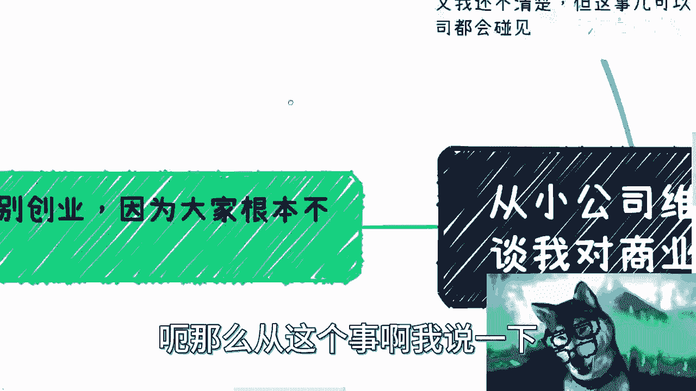
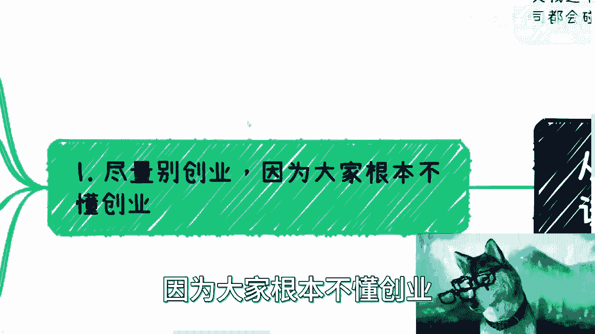
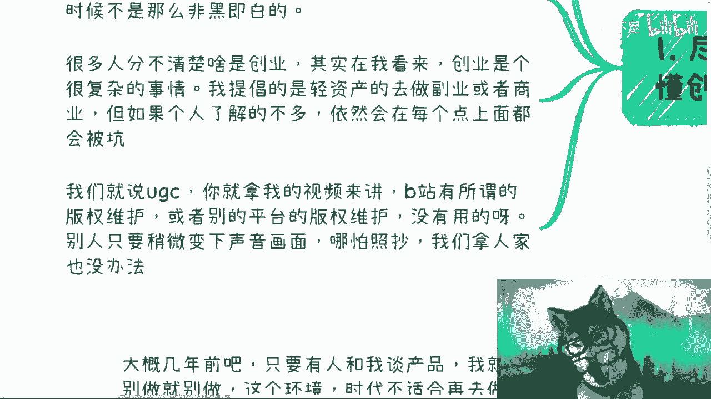
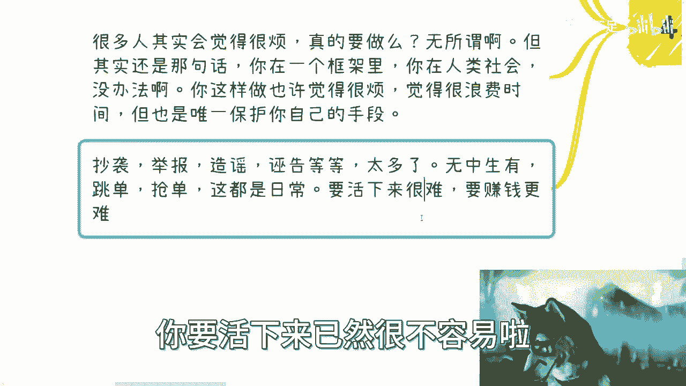
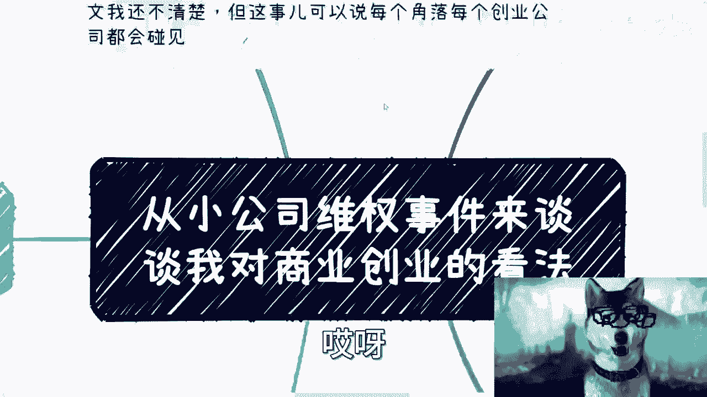
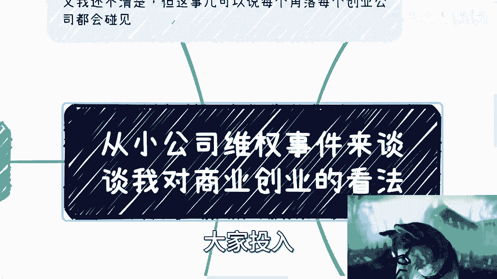

# 创业避坑指南：从小公司维权事件看商业现实 🚨 - 课程01

在本节课中，我们将从小鸡词典的维权事件出发，探讨商业创业中的核心现实问题。我们将分析创业的常见陷阱、版权保护的困境以及如何在复杂环境中保护自己并实现盈利。课程旨在为初学者提供直白、实用的商业认知。

---

## 概述：创业的现实与挑战

今天早上，我在首页看到了关于小鸡词典的新闻。该公司正在与新浪微博国际版打官司。虽然事件的详细背景和是非曲直我并不完全清楚，但这类纠纷在创业公司中非常普遍。

从这个事件，我们可以延伸讨论关于商业和创业的一些根本看法。

---

## 第一点：尽量别创业

我始终强调一点：尽量别创业。根本原因在于，大多数人并不真正理解创业是什么。

创业并非简单的“有一个好想法”或“用爱发电”。它是一个涉及法律、财务、市场、运营等多方面的复杂系统。在你没有充分了解这些领域之前，盲目创业风险极高。

---

## 第二点：版权保护的困境与“自证”的代价

上一节我们提到了创业的复杂性，本节中我们来看看知识产权保护这个具体难题。以内容创作为例，版权保护在实际操作中往往形同虚设。

例如，在B站发布视频时，可以勾选“未经授权禁止转载”的选项。但这个选项的实际作用非常有限。即便他人完全照搬你的内容，只要对声音或画面稍作修改，维权就极其困难。

**核心困境在于“自证”**。无论是通过法律诉讼还是网络声讨，维权过程都是一个“自证几碗粉”的过程。这个过程耗时、耗力、耗钱，而最终受到最大伤害的只有当事人自己。

就像电影《让子弹飞》里的情节，当事人为了自证清白付出了巨大代价，但围观者很快就会忘记。在商业环境中，普通创业者的“试错成本”极高，根本“输不起”也“耗不起”。

---

## 第三点：盈利优先是生存法则

无论做什么项目，首先要思考如何赚钱。盈利不是可选项，而是生存的前提。

**公式：可持续性 ≈ 盈利能力**

所有商业活动，最终都要回归到盈利。用爱发电、满足自我需求或三分钟热度都无法支撑一个项目的长期发展。在创业初期没有清晰的盈利模式，是创始人的重大失职。

盈利代表市场认可，也是项目能够细水长流的保障。先赚钱，也是一种对抗未来不确定性的风险控制策略。

---

## 第四点：商业世界的现实与自我防护

商业世界里存在着许多不为人知的“肮脏事”。抄袭、举报、造谣、跳单等现象是日常。

如果你决心要创造一些东西，就必须了解并遵守现有的商业框架和规则。这听起来很烦琐，但这是保护自己的唯一手段。

以下是创业前必须了解或完成的部分事项清单：
*   **法律实体**：公司注册、税务登记。
*   **知识产权**：商标、专利、软件著作权登记。
*   **合规备案**：网站ICP备案、公安联网备案、数据安全评估。
*   **标准与认证**：ISO体系认证、行业特定资质。
*   **合同与协议**：完善的股权协议、劳动合同、用户协议。

不了解这些，仅凭一腔热血创业，就像在雷区中裸奔，每一步都可能踩坑。

---

## 总结与核心建议

本节课中，我们一起学习了从具体事件中抽象出的商业创业教训。

我始终不建议大多数人创业，因为99.9%的人并不真正懂商业。创业不是凭空想象，它要求你对社会运行规则有深刻的认知。

**核心建议**：在考虑创业之前，请先深入“社会”。这意味着你需要：
1.  摆脱学生思维，了解真实的社会和商业逻辑。
2.  广泛社交，接触不同的创业者和行业人士。
3.  积累经验，明白一个产品从无到有、从小到大的全过程。
4.  永远将“如何盈利”作为思考的首要问题。

创业之路布满荆棘，成功是偶然，失败是常态。每一步决策都需要基于对现实的清醒认识，而非不切实际的幻想。希望本课能帮助你更冷静地看待商业世界。