# 从工作角度来聊聊城市吧 - P1 - 赏味不足 - BV1pP411X7t9

好啊大家好啊对吧，这个虽然我人在北京，但是呃我竟然把我的麦克风也带过来了，所以你们听上去应该没有任何的对吧，不一样的地方啊。

啊这个首先呢因为昨天是这样子的啊，有这个小伙伴呢说提到这个事儿啊，我觉得也蛮好的，呃先声明啊，我就是以我浅薄的认知来说一下啊，呃不要引战哦，不要大家跑过来说啊，我这个什么排外是吧。

然后大家什么就是城市吵过来吵过去，千万别啊。

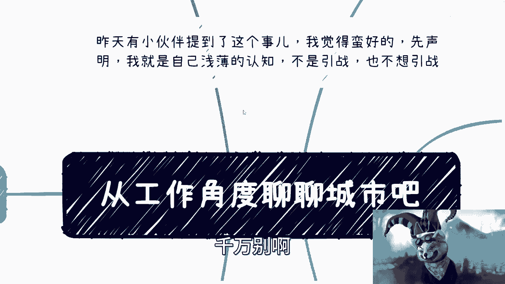

别别别搞得，到时候咳咳咳，这个到处指举报我是吧啊。

这个带有一定主观啊，但是我觉得我这个人还是比较客观的啊，首先对吧，这个必须把北京放在第一位是吧，毕竟我现在人都在北京，然后他必须放在第一位，要有尊重啊，首先第一点啊，我觉得北京不管怎么样呃。

互联网宇宙中心毫无疑问啊，这绝对绝对绝对中的绝对，而且不单单互联网宇宙中心对吧，就是这个政策啊，各个方面都宇宙中心啊，这毫无疑问啊，这第二点呢就美食荒漠啊，他妈荒的，我简直就是无无敌，你知道吧。

就是我每次来啊啊这么多年了对吧，每次来对吧，除了我第一次来以外，不吃了，豆汁儿跟这个什么爆肚是吧，后面啊每次来呃，炙子烤肉啊，火锅没了，就这两个东西，反正烤鸭是不太去吃的，因为本地人都跟我说。

马都是坑是吧，然后就这俩玩意儿没了啊，反正我也实在是，而且我在路边想买个奶茶都难，哎呀反正就是这种感觉对吧，然后这个第三个呢就是说啊，北京呢，我觉得我可能真的别的别的城市城市呆的少了。

北京这是唯一的给我一个感觉呢，就是很多的打工的人就是纯纯的电池，就纯纯种中的纯种，你知道吧啊，这大多数人在我看来根本没有一点生活，每天只有妈的白天在耗电，晚上在充电，为什么，就是就因为我在西安。

其实这个地方呆了有也有个一年时间嘛对吧，我在龙泽对吧，希尔奇，反正天通苑啊这一块就是哎呀，就是就是你知道吗，就是我每天就是可能这一年的时间，我每天晚上11点，我能够看到。

就是望不到头的人在里面排队等公交，我晚上我早上去呢，就是要被后面那种这个辅警啊，还不是那种辅导员对吧，要要这种推上地铁的，我你说还好，我就是给出差的对吧，你说我要在北京吧，我其实我有时候甚至我真的觉得。

就是就是我就是很多人能在北京这么生存下去，绝对是这个精神抗压很强的，就是就是我甚至觉得我时间太长了，我我就很抑郁，就是我就不明白我活着是意义干什么，你知道吗，而且我每天看着他们吧。

我就在那边思考他们活着的意义是什么，就真的很难，你知道吗，而且另外一方面呢，在北京我就觉得我进入了一个时间黑洞啊，就是我觉得在北京大家能聚一次，这个能见一次都是生死之交，就是就很难。

我也不知道为什么是因为北京真的大吗是吧，我我我表示不理解，反正就真的很难，你知道吗对吧，然后呢交通呢也是真的拉胯非常的拉垮，我跟你说这个拉垮是几方面，一方面呢就是啊比如说他设计对吧。

有些比如说地铁太绕啊对吧，这个一些太陈旧啊对吧，我第一次我记得很清楚啊，我第一次来北京这个人家因为我我我又不懂啊，我第一次来，我说我说这个口是啥口啊对吧，A口B口是吧哦好，然后我就在那边地铁上看哦。

这地方诶这叫A口B口啊，这个左边有一个像粉笔写的A1个圈对吧，B右边有个B1个圈，我知道的在打在地铁，我不知道的，还以为在打cs，你知道吗就对，然后北京呢还有一些地方呢，它设计就很拉胯。

就是我我记得很清楚嘛，就是我在北京打车，你知道吗，我在北京就自自从打完几几次车之后，我就再也不敢打车了，呃主要原因就是因为他的这个交通设计吧，就是就是你比如说啊，你说一个这个这个两车道对吧。

这个这个双向的两车道，然后呢他在这个两车道左右两边呢，还有两个停车场的进口和两个停车场的出口，卧槽这跟道具他妈的动都不动，你知道吗，嗯对吧，而且我反正是觉得北京这打车吧还老贵老贵，真的死贵死贵啊。

嗯然后北京这生活成本也太高，也不生活成本吧，各方面成本都很高，然后北京呢还有一个给我的很大感觉是什么呢，就满地都是北啊，满地都是上面有人，反正每满地都是都是泡泡啊。

满地都是说这个一聊就是一喝喝茶喝一天对吧，然后要么就是晚上干白酒，而且呢就让我感觉那种这个饼干我也吃了对吧，泡泡我也吃了对吧，这个满地上面有人，我也听了对吧，然后茶嘛我也喝了，你说是不是。

但是呢到最后哎事儿都没成，你知道吧，就是我也没在北京赚到，赚到啥钱啊，这我有一说一啊，是吧啊啊，不过最终啊我这个地方也得说一点啊，就是有一说一，这具体还要看大家干嘛，很多时候呢我们并不是直接赚钱的。

而是拿名去换钱，你明白吧，就是比如说同时呢你在别的地方可以降维打击，我跟你说，这的确很北京，你明白吧，就是如果你打工纯纯的电池，我简直就我真的，我说实话，我反正是找不到在北京活着的意义啊。

就是我我作为一个普通人，我就是这个感觉，那很多人要说了啊，他说吕老师，你作为一个在上海的对吧，你肯定得喷北京好，没事，来上海来喷了是吧，我跟你讲，上海妈的互联网是真的拉垮什么什么巨人啊。

什么什么叫什么什么盛大是吧，什么鸟毛玩意儿是吧啊，然后后面你去看吧，点评啊，垃圾是吧啊，然后我们什么什么你看吧，上海有几个这个互联网公司的吧，都是互联网分公司对吧，那上海有互联网公司的，要么被收购了。

要么就是反正不行了，没落了是吧，然后这个最近呢你说出了几个有吗，有的啊，但是价值观又不正对吧，我也不点名了，也就那样了是吧啊，这是第一个啊，但是呢哎吃的我跟你讲真的多，上海是真的牛逼，我跟你说。

上海是真的海南百川，以至于我现在都觉得本帮菜都已经没什么啦，没什么，就是做的好的，妈的都都被外来这个这个美食入侵了，你知道吧啊，然后上海现在这个这个口味越来越重啊，真的越来越重呃。

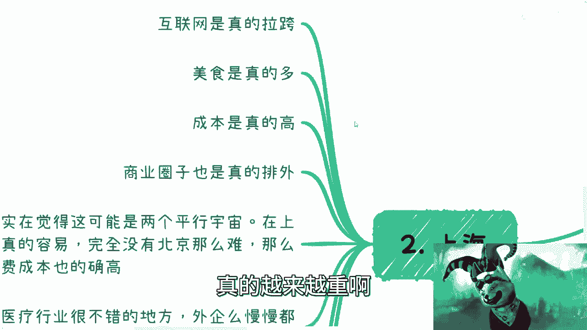

成本也是真的高啊，就毫无疑问啊，你说是上海高还是北京高吧，我，说不好啊，半斤八两吧，这个上海商业圈子呢我也觉得真的排外啊，这个地方呢我提一点啊，这个排外不是说叫做户口排外啊。

就是他是是是指就是说这个商业圈子里面，蛋糕呢他不太愿意给分给别人，当然你说别的地方也也不愿意。

是不愿意，但上海是相对更不愿意，你知道吧，你就算是个上海人。

他也不愿意跟户口没有关系啊，跟你这个这个哪哪个地方人也没关系啊。

那相比北京呢，我觉得这个可能就是两个平行宇宙啊，我表示也不大理解，就是在上海见一面呢是真的容易啊，完全没北京那么难，也没那么累啊，当然消费成本也的确高呃，我觉得北京呢主要还是在于这一方面。

下班也比较晚啊，第二方面呢主要在于这个交通的确是不太行啊。

你说我这个之前约了一些渣浪的人对吧，哇靠我说晚上吃个饭好好吃吃吃吃吃，我吃个饭什么时候啊，最早九点钟啊，行吧行吧，就到九点钟九点钟，上海都他妈的，我都第二场了是吧啊，然后你看嗯上海啊，最近啊就近几年啊。

我其实是觉得他是一个医疗行业不错的地方啊，就是说有一说养呃，外企呢其实慢慢慢慢都已经嗯，就就已经滚了嘛对吧，然后金融啊有很多人都在说啊，他说哎上海是个金融城市是吧，当当当当当说半天啊，我跟你讲。

我觉得这个聊下来啊，金融其实是真的不如北京啊，如果你做金融是真不如北京啊。

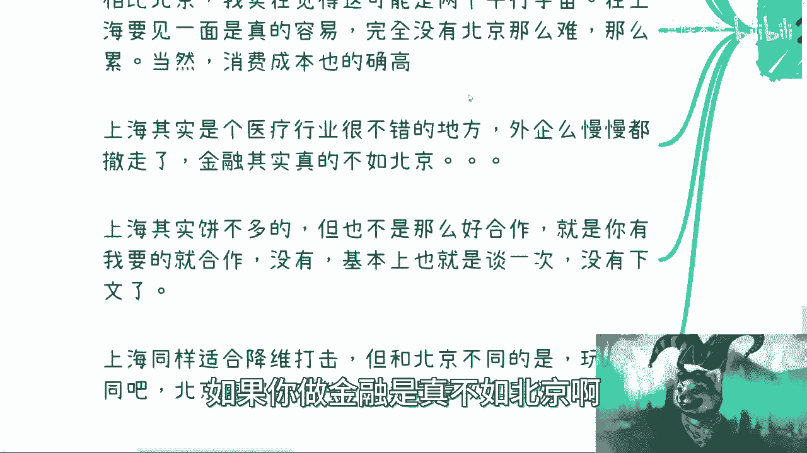

呃你做电池也好，不做电池也好，就赚钱角度来讲，它也不如北京啊，当然了，这个生活上面还是有的嘛是吧，生活上也有的啊，那上海呢其实并不多大啊，我上海我觉得其实你去聊商业吧，他没有这么多饼的呃。

但是也不是那么好合作的，就像我们刚刚说的，就是说呃你有我要的对吧，就是就合作没有呢，基本上也就谈那么一次啊，你好我好，大家好，就没下文了啊，就那么就就那样啊，嗯上海呢同样是和降维打击。

但是我觉得这个跟北京不太一样，玩法不同，就北京那是喜欢拿红头文件啊，上海呢是喜欢拿案例，它不一样，北京呢就属于拿名换利，上海呢是拿一些就是说具体东西啊。

具体政策来降维去复制对啊，这个是两个对吧。

我就喷完了啊，好第三个深圳啊。

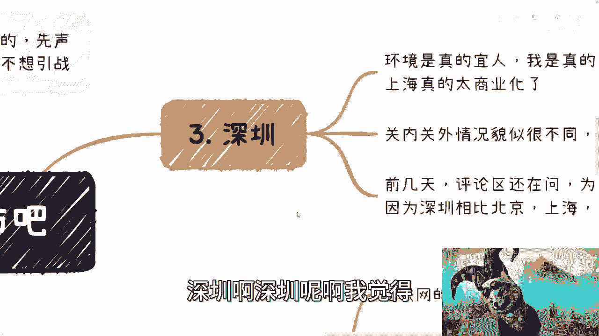

深圳难啊，我觉得啊就深圳毕竟我不太熟啊。

不太熟啊，这个环境呢的确宜人啊，我也是真的喜欢啊，比上海呢喜欢多了呃，当然了，也有很多人会说啊，上海也有很多什么黄浦滨江啊对吧，其他地方啊我跟你不能这么说啊，其实你们在上海逛过的人。

你们就会发现上海的很多地方逛南，他没有人情味儿，你知道吧，就是就是他逛啊，他没有那种就是让你舒心对吧，让你这种散心的感觉，他没有他太商业化，哎就就没什么感觉，你不像你说深圳对吧，一看啊就心旷神怡对吧。

这么多绿化对吧，那上海就没有啊，对吧啊，然后那个嗯关内关外情况也不太一样，当然这个因为深圳我也好久没去了，最近也不太了解啊，呃但是呢前几天呢这个评论区还有人在问问，他说他说为什么深圳大家都说啊。

他说深圳容易赚钱啊，他说为什么我当时评论区是这么评论的，我说很简单，一个字也为什么就是野呀，你是看好了，对不对，什么我就不点名了，就什么什么行业A你去看吧，就同样的啊，就A行业B行业C行业对吧。

这个这个叫什么呃，不管实的虚的啊，不管真的假的，反正愿意冲在前面的啊，在一线城市里面，就深圳的，别的不敢的。

哪里敢啊是吧，这个我野的不要不要的，我跟你们说是吧啊绝对是啊。

这个挣钱牛逼的城市啊，然后呢你说南京是吧，南京呢我也住了一段时间啊，南京给我感觉是什么呢，就蛮简单的，就温水煮青蛙，政策上面吧，有的啊，没不是没有，你们也可以看得到的啊，什么什么什么播几个亿啊对吧。

什么什么新的什么扶持政策啊对吧，新的什么专业啊，老多了都南京南京很多对吧，但是呢我跟你们讲啊，这个南京呢是一个雷声大，雨点就是小的城市，当然从最近来就就这两年是这个样子啊，以后咱不知道啊。

反正就是那种就是让你感觉那种很纠结哎，就是他想做，但是呢他好像又撒不开腿，坐，还还不知道是，就是说还还不知道是不是，上面钱申请不下来的原因，不知道什么原因对吧，反正就是那种很纠结啊。

让你感觉他就很纠结啊，卷呐我觉得不是特别卷，一般卷啊，但是呢薪资看不上去嗯，就这个样子，南京成本嘛啊一般吧，一般吧。

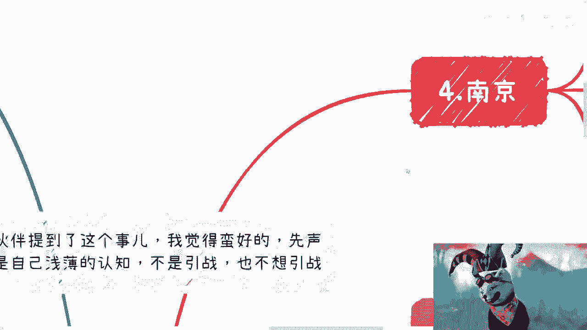

呃然后这个是死啊，然后五杭州哎，杭州要来说的对吧，杭州你看啊大家都看出来了，就有钱啊，霍霍啊，绝对的啊，杭州就是就就人家就这么说吧，就你说杭州现在定位准一线城市是吧，然后你说杭州这个人也有很多人说。

什么上海后花园啊，什么乱七八糟的，我觉得这种就扯淡了，你说是吧啊，然后呃这个咱们不去管它那种什么北上呃，广深对吧，什么什么固有的印象，咱不去说他啊，我们就说从近几年这个这个叫什么新闻啊。

或者来说这个整个面上面看到的杭州，就是有钱哎，就是霍霍，你知道吧，而且呢杭州还紧跟潮流哎，就的一批，你知道吧啊。

那第三呢就这个呃当然了，这个杭州我觉得他那个成本越来越高呃，房租房租房不是不是房价中间的，我写错了，这个房产房产中介呢最近有点忙对吧，这个原因嘛我就不说了啊，呃但杭州有一说一，我觉得发展一直是蛮好的啊。

而且红利期也一直在，毕竟阿里在嘛对吧，这毫无疑问嘛是吧，当然不仅阿里在别的很多嗯，说实话不错的企业也都呃前两年也从上海啊，从其他地方啊就迁移到杭州，为什么，因为杭州政策是啊实打实落地的啊，这有一说一。

而且杭州有蛮多的这种就是就是比较针对性的，你比如说什么呃智慧智慧生叫什么啊，人工智能小镇啊，对吧，这个EFCEEFC啊对吧，然后什么区块链区块链的这种裁员啊对吧，然后像那个，什么呃那个那个那个呃哦对。

最近那个比较火的那个直播带货是吧，直播电商里面小姐姐不要太多是吧啊，我关注点错了是吧，然后呢就是但最近几年吧，我是觉得杭州就是因为这么一些情况导致，其实越来越卷，因为你本来嘛是蛮好的，你说你现在政策嘛。

这个你你你你太激进啊，在我看来，其实杭州太激进，导致就是说你可能得消消火是吧，第二方面就是说吸引的人也越来越多，那你人越来越多，就越来越卷了，这就没办法了嘛对吧，而且哎呀我看看。

而且杭州呢还有一个问题是什么呢，就是他以前哦现在我不知道啊，反正以前我去的时候就是地铁线路的确不多呃，而且高峰期的时候啊，这个交通也基本上也是堵在那边不动，所以呢我觉得这个呢也是也也也蛮蛮尴尬的。

其实啊但总体来讲我觉得蛮喜欢的。

我是蛮喜欢杭州的，然后看看有六吗。

6412啊。

没有六了，那就其他对吧，其他啊其他就是说我可能不太了解啊，但是也嗯一面之词吧是吧，苏州呢因为我跟他们政府是有合作的是吧，所以我是觉得苏州呢我其实是很看好的，因为苏州属于有钱，而是真的有钱啊。

而且不那么卷啊，但是可能产业上面呢，就是说由于他的这个这个叫什么产业的分布吧，它可能不像，就是说大家觉得啊互联网就是上海啊，杭州啊，北京啊对吧，这个什么地方，他可能苏州那边相对也比较少对吧。

所以我觉得可能就是就选择不嗯，不像一线准一线这么多吧，但我觉得苏州的确是个不错的地方啊，这个当然也是我片面啊，我单纯从这个政府的角度去看，这个真的情况怎么样，我也不知道对吧，那这是第一个，第二个。

济南济南山东是吧，山东这地方呢还是那句话，就太看关系，太看关系就是空对空啊，但是这个关系呢你得要真的就是说是硬啊，如果不硬呢，就很很难变现，反正就这么简单好吧，呃济南薪资嘛也就真的一般般啊，真的一般般。

那黑龙江这边呢，我说实话啊，我合作下来这个人不太靠谱啊，人不太靠谱，就呃怎么说呢，就是我也不能说人不靠谱吧，我只能说就是这个人的商业思维有点混乱啊，不能说人不靠谱啊，商业思维混乱啊。

当然这个比较有可能比较个例啊，有可能薪资性性存者偏差啊，这个大大家别这个叫什么呃，说我地域攻击是吧，呃武汉那真的就哎呀怎么说呢，武汉就真的有点就是就提到武汉就光谷啊，那么就就那么一些啊，他唉就怎么说呢。

就是说大学生要么在本地啊，要么就出来，要么就留不住啊，留得住嘛，也就那么一些，就就就就就还是要发展新的东西，天津嘛我就不提提了对吧，这个叫什么不犯错啊，呃不犯错求稳啊，然后呢这个跟着老大哥是吧。

就结束了啊，你别指望有什么新的东西，成都哎成都我想说啥来着，成都反正就是哎成都我是不了解我了解的，就是冲麻酱哈哈冲麻酱火锅节奏慢是吧，然后之前这个币圈创业比较发达对吧，就就这种情况。

别的我真的也不知道了，呃无锡就算了，无锡这无锡我真的，我无锡就让我有种什么感觉呢，就是呃就没都没想干活啊，就大家都在混日子，就是上上下下都在混啊，每天都在混，反正就这么回事啊。

这个薪资嘛反正也低得可怜是吧，吊州吊州吊州吊州我还真不太了解，反正吊州这边政府呢我也有合作啊，这个，执行力还行啊，钱嘛也可以批呃，但是你说他产业分布吧，我觉得哎呀也是弱了一点。

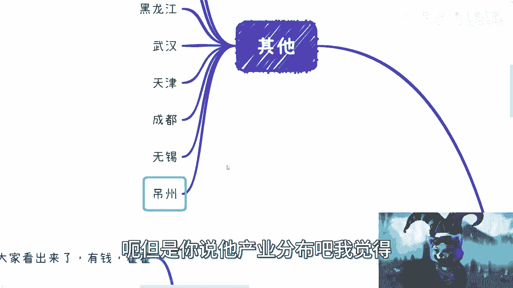

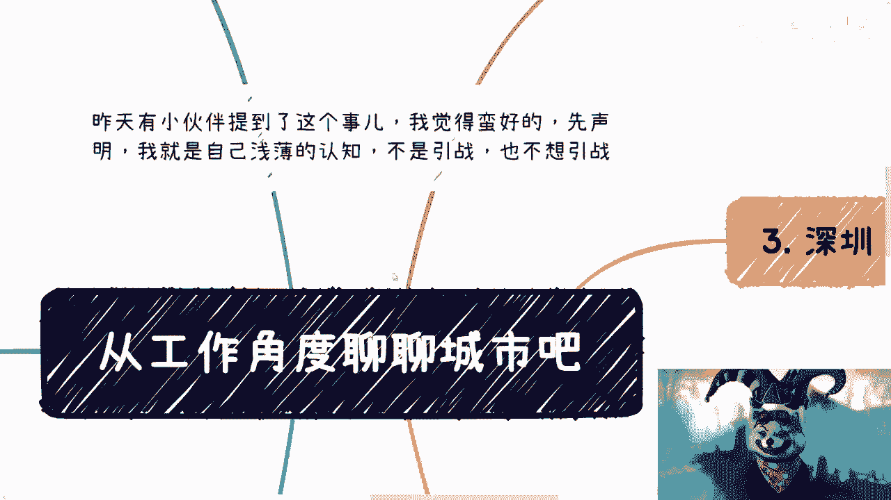

反正就这么这么一些情况吧，啊这个我最后提提几嘴巴。

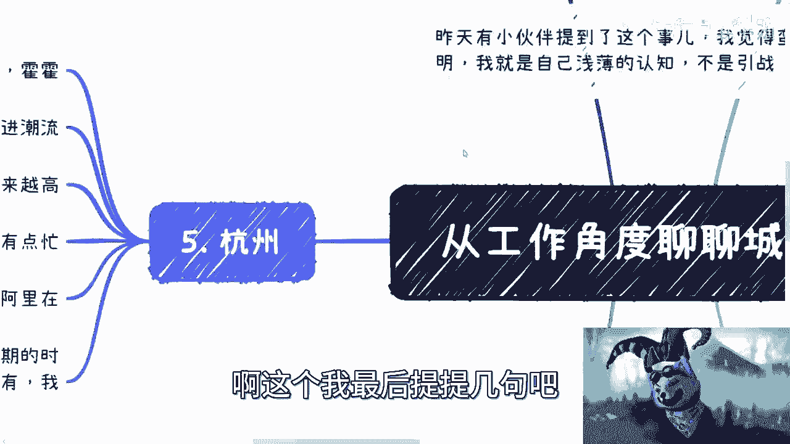

就从未来角度来讲呢，如果我给大家建议的话啊，上海我不建议啊，因为上海未来很容易两极分化，从目前来看很太容易两极分化了，就是他要么就过得很好，要么就就他妈的过得很拉垮，你知道吧。

就中间那些人呢是活不下去的，就是比如说我说过的很难华那种人呢，就是比如说没办法无能为力对吧，他可能户口也在那了对吧，买了房子了，但是呢就过不了很好的生活对吧，要么就是能过得很好。

中间这些人呢我觉得未来会慢慢慢慢迁移走，因为上海这地方过不下去啊。

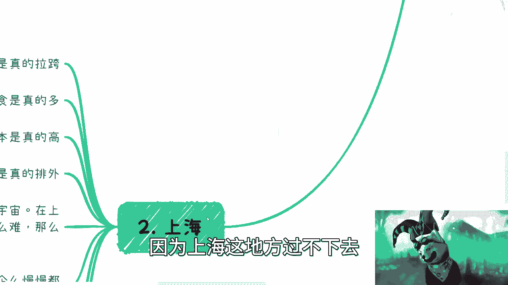

你知道吧，北京吧，哎呀死活不推荐这么回事。

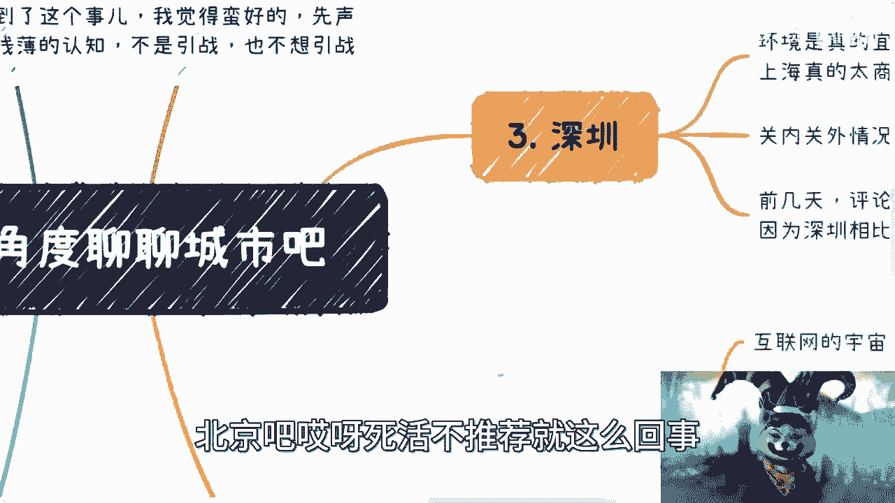

深圳我觉得蛮好的啊，灵活就是看大家本事对吧，你要有本事野。

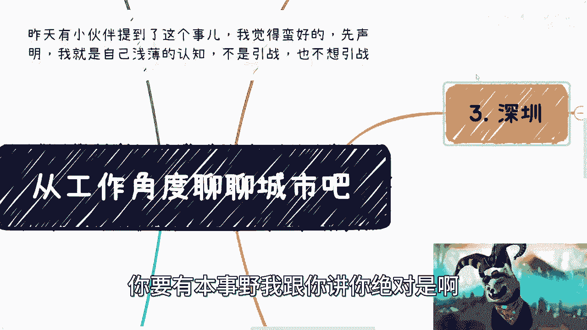

我跟你讲，你绝对是一把手，你没本事也就算了。

杭州嘛，哎呀越来越卷，唉，南京就算了，拉倒吧。

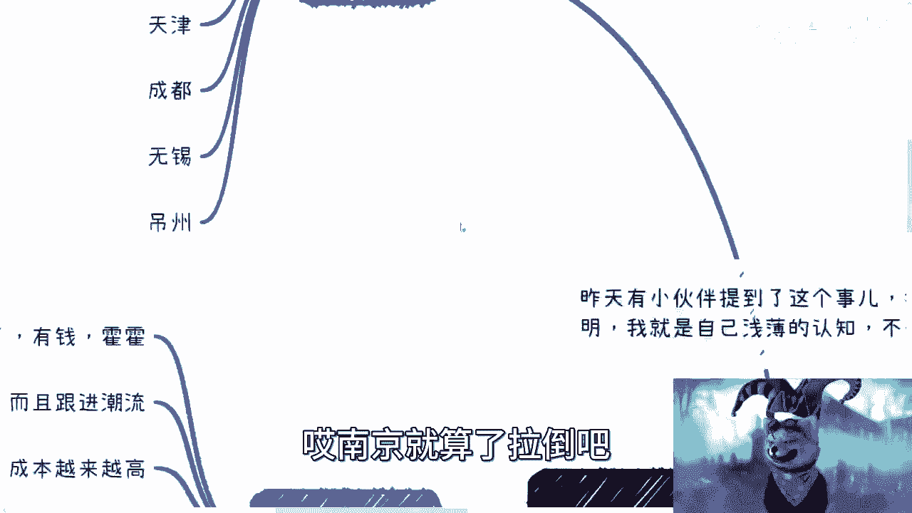

其他反正大家自己看吧。

我我别的我也不太了解对吧，海南诶，海南蛮好的啊，海南就是封关有商机，但这个商机呢就看大家能不能把握得住了。

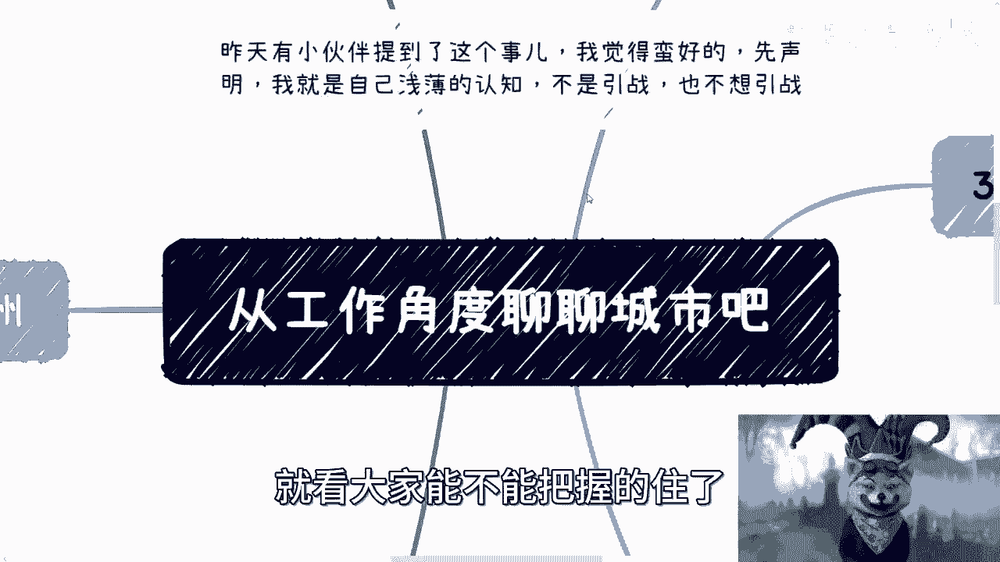

呃，其实我觉得其实这个真的就跟大家，这个做做工作呢是有蛮有相关性的，就是你们要是选择做电池呢，我觉得在哪都一样对吧，但是最好选一些有生活的地方，否则你说这人活着干嘛呢是吧，但如果来说你们懂得四两拨千斤。

也就是说懂得用这个城市的长处，到别的地方去降维打击，那我觉得你们基本上就飞黄飞黄腾达，你知道吗，行就这么着吧好吧，有任何问题，有这个这个创业对吧，失业或者来说这个叫什么呃，职业规划对吧，或者其他的。

反正想的都可以私信我们走这个付费咨询好吧，然后最近我在北京这个可能比较忙，所以大家约的话。

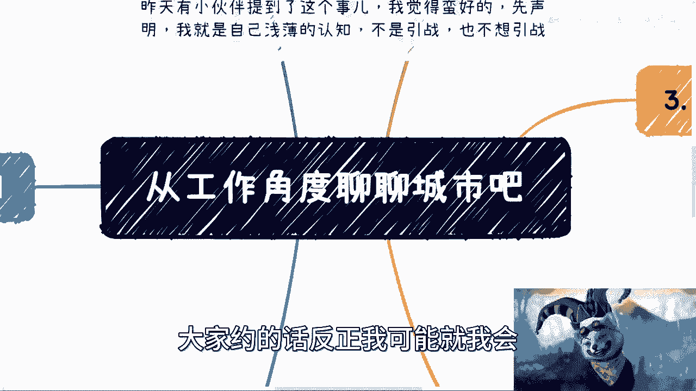