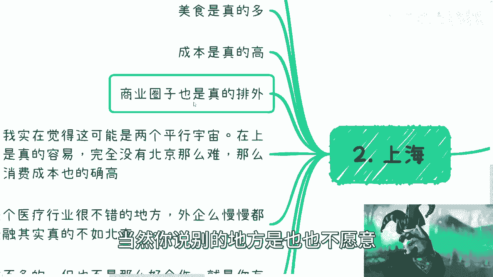

# 城市工作选择指南 🏙️ - 课程01

在本节课中，我们将从工作与生活的角度，分析国内几个主要城市的特点。课程内容基于个人观察与经验，旨在为初入职场的你提供一份直观的参考，帮助你理解不同城市的职场环境、生活成本与发展机会。

## 概述：我们为何要讨论城市？

选择在哪个城市工作与发展，是职业生涯中至关重要的决策之一。不同的城市拥有截然不同的产业生态、生活节奏和文化氛围。本节课将逐一剖析北京、上海、深圳、杭州、南京等城市的核心特点，助你做出更明智的选择。

---

## 一、 北京 🇨🇳：互联网宇宙中心与生活挑战

首先，我们必须将北京放在第一位讨论。北京无疑是互联网与多项政策的中心。

**北京的核心特点可以总结为以下几点：**

以下是关于北京的三个关键观察：

1.  **互联网与政策中心**：北京是绝对的互联网行业中心，同时也是许多核心政策的策源地。
2.  **“美食荒漠”**：在饮食多样性方面体验较差，可选种类相对有限。
3.  **高强度“电池”生活**：许多打工者的状态如同“电池”，公式可描述为：**生活 ≈ 白天耗电 + 晚上充电**。通勤时间长，生活与工作难以平衡，容易让人感到压抑。
4.  **社交成本高昂**：由于城市面积大、交通拥堵，朋友间见面一次非常困难。
5.  **交通系统体验不佳**：部分地铁站标识陈旧，路面交通设计常导致严重拥堵，打车费用也较高。
6.  **生活成本高**：各方面开销都比较大。
7.  **“画饼”文化盛行**：商业交谈中常遇到夸夸其谈但难以落地的项目。
8.  **“名利场”效应**：在北京，很多时候不是直接赚钱，而是用“名望”换取资源，再到其他城市进行“降维打击”。

上一节我们介绍了北京作为中心城市的复杂面貌，接下来，我们将视线转向南方，看看另一座一线城市——上海。

---

## 二、 上海 🏙️：商业重镇与精致生活

上海呈现出一幅与北京不同的图景。

**上海的核心特点可以总结为以下几点：**

以下是关于上海的五个关键观察：

1.  **互联网行业相对薄弱**：本土知名互联网公司较少，多为大型互联网公司的分支机构。
2.  **美食天堂**：餐饮选择极其丰富，海纳百川，本帮菜与各地美食交融。
3.  **生活与商业成本高**：生活成本与北京不相上下。
4.  **商业圈子相对封闭**：商业合作中，圈子文化明显，资源更倾向于在内部流转，而非户口排外。合作模式常为“一次性的友好交流”。
5.  **社交便利性高**：相比北京，在上海与人见面、约饭要容易得多。
6.  **特色产业突出**：医疗健康行业发展不错，但金融行业的实力和机会被认为不如北京。
7.  **“案例”驱动**：上海的“降维打击”玩法与北京不同，更倾向于依靠成功的具体案例和政策进行复制推广，而非“红头文件”。

看过了两座超一线城市，我们把目光投向更具活力的南方——深圳。

---

## 三、 深圳 🌳：活力之都与“野性”机遇

深圳是一座充满活力的城市。

**深圳的核心特点可以总结为以下几点：**

以下是关于深圳的三个关键观察：

1.  **自然环境宜人**：城市绿化好，环境让人心旷神怡，更具人情味。
2.  **“野”性十足，机会多**：商业氛围大胆、灵活，敢于尝试各种新行业与新机会，赚钱机会相对较多。
3.  **内部差异**：关内与关外的发展情况和氛围有所不同。

接下来，我们来看看几座备受关注的“新一线”城市。

---

## 四、 杭州与南京：新一线城市的两种面貌

### 杭州 💰：有钱、敢追风口

杭州近年发展迅猛，特点鲜明。

**杭州的核心特点可以总结为以下几点：**

以下是关于杭州的四个关键观察：

1.  **财政充裕，敢于投入**：城市发展资金充足，愿意大力投资新产业。
2.  **紧跟潮流**：对直播电商、人工智能、区块链等新兴行业反应迅速。
3.  **政策落地扎实**：吸引了许多企业从上海等地迁入。
4.  **日益“内卷”**：由于吸引力强，涌入人才多，竞争变得越来越激烈。同时，高峰期交通拥堵问题也较为突出。

### 南京 🐸：温水煮青蛙

南京给人的感觉则相对温和。

**南京的核心特点可以总结为以下几点：**

以下是关于南京的三个关键观察：

1.  **“雷声大，雨点小”**：政策宣传很多，但实际落地效果和力度感觉不足，给人一种纠结感。
2.  **竞争压力一般**：内卷程度不如一线城市剧烈。
3.  **薪资水平普通**：薪资竞争力与一线城市有差距。

除了上述重点城市，其他一些城市也有其独特之处。

---

## 五、 其他城市速览

以下是对其他几个城市的简要印象：

*   **苏州**：经济实力强，生活压力相对较小，但互联网等新兴产业聚集度不如杭州、上海。
*   **济南**：非常看重人际关系，商业合作中“关系”的硬度至关重要。
*   **武汉**：大学生多，但人才留存率有提升空间，产业有待进一步升级。
*   **成都**：生活节奏慢，以美食和休闲文化著称，曾为加密货币创业活跃地。
*   **无锡**：整体节奏慢，薪资水平较低。
*   **海南**：随着“封关”政策推进，可能存在新的商业机遇。

---

## 六、 总结与个人建议 🎯

本节课我们一起从工作角度分析了多个城市的特点。最后，提供一些非常个人化的总结与建议：

**未来城市选择参考：**

*   **上海**：容易两极分化，中间阶层生活压力大。
*   **北京**：不推荐仅为“打工电池”模式而选择。
*   **深圳**：推荐给有本事、敢闯敢拼的人，机会多。
*   **杭州**：发展好，但越来越卷。
*   **南京**：发展动力和机会相对一般。
*   **其他城市**：需根据自身行业和资源具体判断。

**核心建议：**

你的职业选择与城市选择息息相关。
*   如果选择做普通“打工人”，最好选择一个能让你感受到生活意义的城市，否则人生会非常疲惫。
*   如果懂得利用城市的特点和资源，进行“四两拨千斤”式的操作（例如，在一线城市积累名望或案例，到其他城市寻求发展），则更容易获得成功。

最终，城市的选择没有标准答案，关键在于认清自己的目标与城市的特质是否匹配。希望本课的分析能为你提供有价值的参考。