# 从我个人经历来说下移动互联网的商业发展 - P1 - 赏味不足 - BV1xg4y197Hi

哈喽大家好，之前还有小伙伴跟我提了这么一个东西，叫做让我来说一下嗯，这个移动互联网整个的一个商业发展啊，呃简单来讲呢，我觉得我也不可能知道全部，因为那个时候我也刚毕业对吧。

那我只能从这几个角度跟你们说啊。

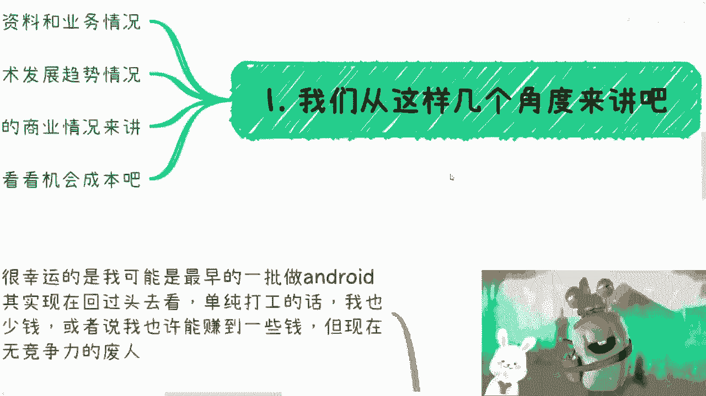

一个呢是从当时的学习资料跟业务情况，一个呢是我们整个行业的这个技术发展啊，和这个业务发展趋势，一个呢是我经历过的这个商业情况啊，另外一个就是我们看这个机会成本对吧。

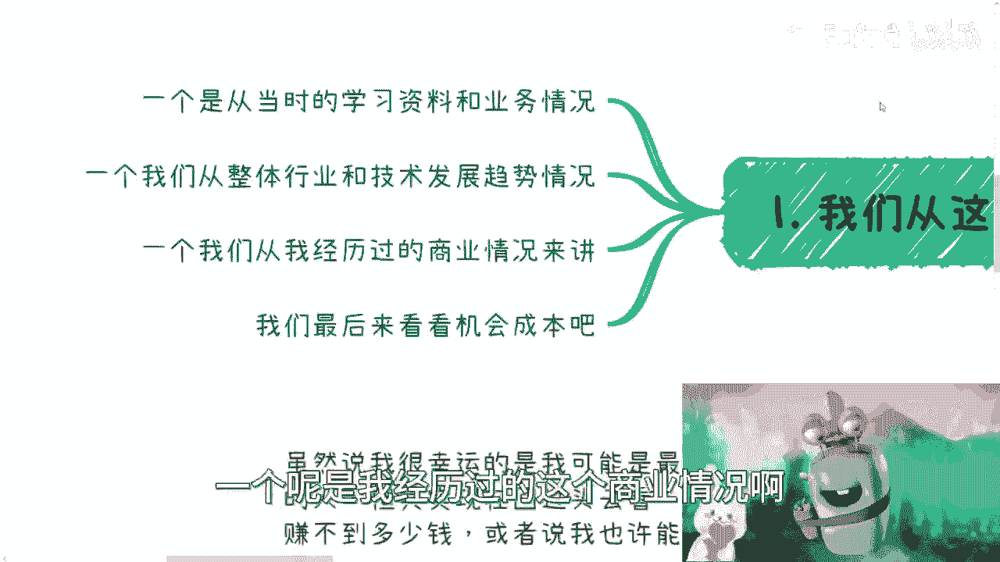

那一个来说啊。

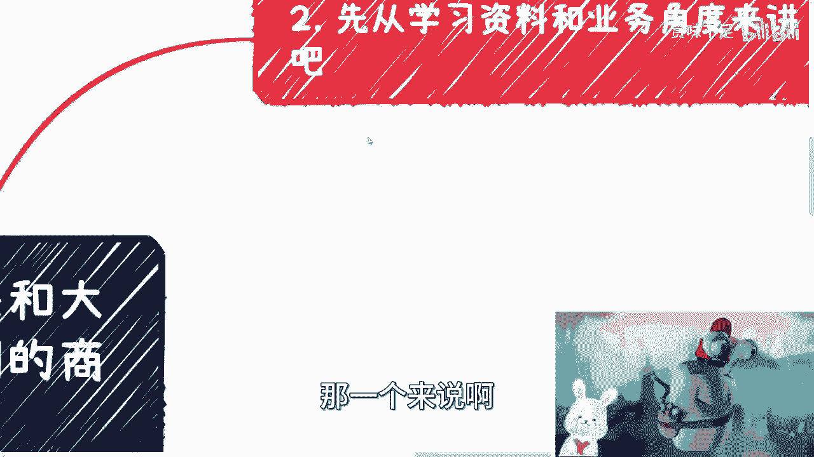

先说这个学习资料跟业务业务角度啊，首先呢，就是我跟很多人不一样的地方在于哪里呢，就是呃所有的，因为我本身也算互联网的技术这个岗位嘛对吧，那我跟大部分人不一样的地方在于，我没有做过一秒钟的前后端。

就是可能现比我后面毕业的人，其实可能出来很多人，他还是做前后端，但是我不一样，就是可能机缘巧合，我就一秒钟都没有做过前后端，就是我可能到现在为止，我我对于前后端的嗯理解啊。

更多就是在理论知识我没有怎么做过，当然就是后面我做了架构之后，就是会很多涉及到一点，就是你不可能说你你不涉及到web端，不是不涉及到后端嘛对吧，但是就是说在我一开始毕业的时候，我属于从来没做过啊。

呃一毕业我做的就是安卓啊，我没有任何前后端的经验，所以说呢我觉得在这方面呢，我也节省了非常多的时间啊，然后当时那个情时代是什么情况呢，就是我的圈子除了我在做安卓，就几乎没有人做啊，就你别说什么我身边了。

我就在网上找，我都找不到，我发帖，我都只能到什么stack of floor上面去发，GITHUB上面去发，我发在哪都没用啊，所以在那个技术跟业务上呢，其实我根本找不到人沟通，你更别说什么商业了。

商业个屁妈的商业两字我都不知道怎么写啊，就整个网络除了google android，当时原生的那个SDK网站就没有了，就只能啃那个谷歌的文档啊，但是呢谷歌文档对我来讲呢，就是因为啊因为我刚毕业嘛对吧。

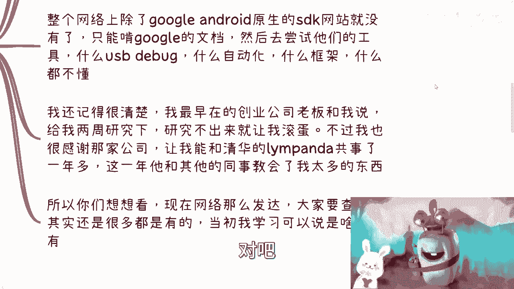

那我对于很多中文的东西我都没看过，你别说英文的东西，那我更更没看过了啊，然后去尝试他们的什么工具，比如什么USB debug啊，什么automating，automatically啊。

automation啊，什么什么framework，看人家给我什么都不动弹啊，我还记得很清楚，我最早在一家创业公司啊，我们那个老板跟我说，给我两个礼拜研究一下啊，研究不出来让我滚蛋。

我还记得我当时哎我当时多少钱呢，转正那家创业公司转正好像是3000吧，2000多2600好像啊，对2600转正，但这不是我第一份工作，而这只算是我最早的一份创业工作，不过呢我也很感谢那家公司啊。

能够让我跟当时清华毕业的那个叫那个id，叫l l i m panda对吧，就这个很有名非常有名啊，你们就可以全球有名的，可以说啊，我跟他共事了一年多啊，可以说这一年多呢。

他跟其他同事呢就教会了我太多东西，就说白了如果没有他们，我觉得唉就我我没法跟你们比，你们大多数人的基础其实都比我好，你们大多数人的家境都比我好，就这个样子，我就这么说吧，我比你们了解中国老百姓。

我可以说我属于这个底层老百姓当。

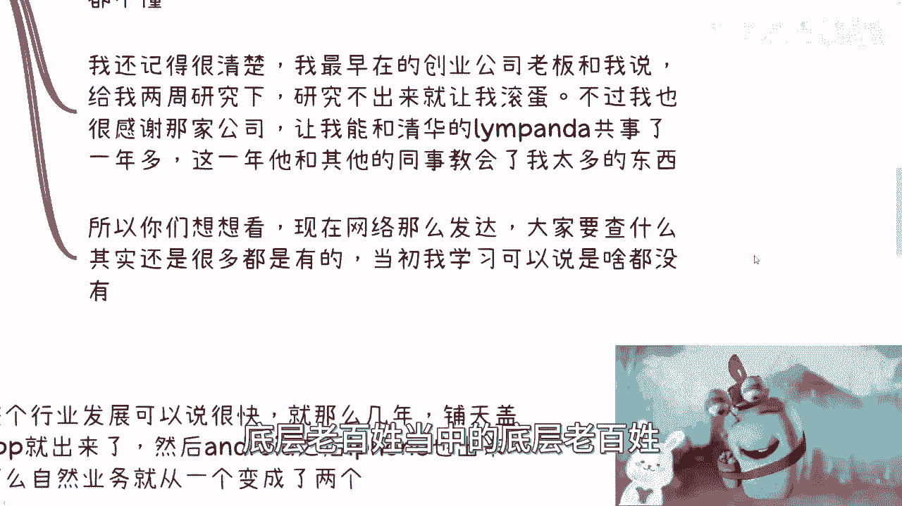

中的底层老百姓啊，所以你们想想看啊，现在网络这么发达，大家要查什么东西呢。

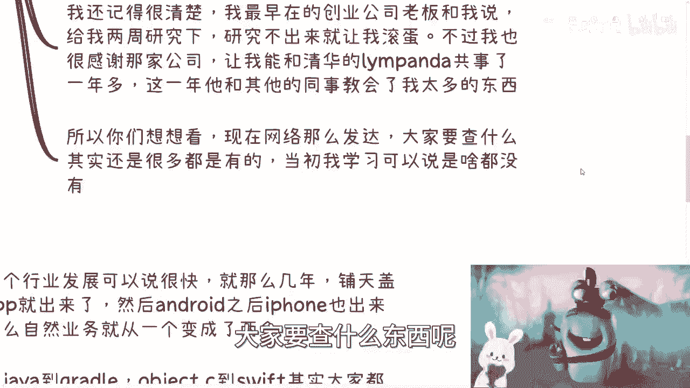

其实很多还是有的，当初我学习可以说是真的是啥都没有，你们其实很幸运啊。

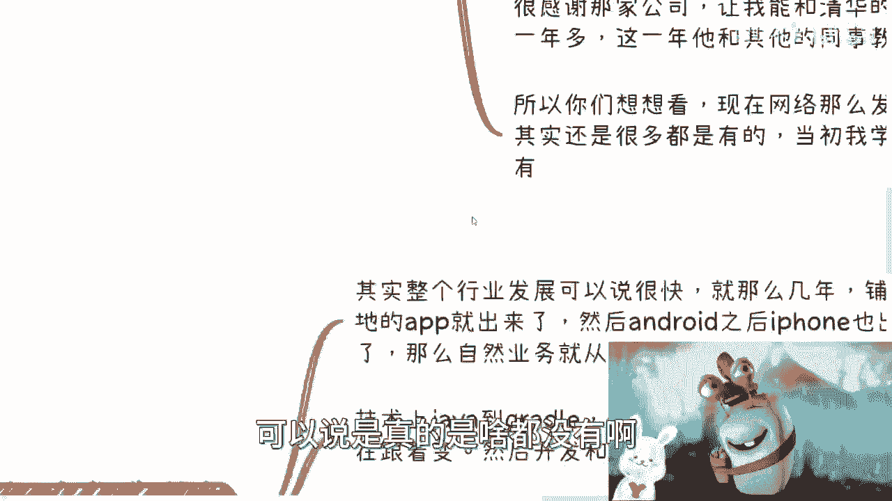

那么第二个我们从整个行业和技术发展啊，你看啊，呃其实整个行业发展的其实很快就那么几年啊，铺天盖地的app就出来了，然后安卓之后IPHONE也出来了，那么自然业务也就从就是整个业务的一个一个。

我比如说我学习的这个路线，就从一个变成两个呃，但其实很乱啊，非常的乱，就是你会发现每天都有新的东西出来，每每个礼拜都有新的东西出来，然后每就是就是每隔一段时间你会发现哦，可能海外有这么新的啊。

各种各样的，然后国内有新的各种各样。

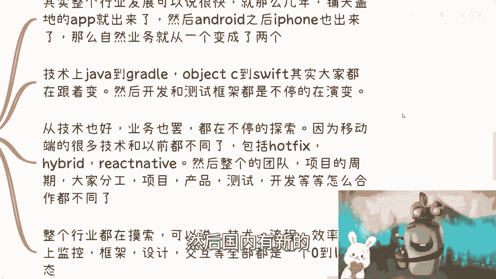

你根本来不及学啊，然后技术上你看我当时从写java到grade对吧，到object c到swift对吧，其实大家都在跟着变，那你不跟着变，那不可能你就没有竞争力啊。

然后开发跟测试框架呢也是不停的在演变啊，然后从技术也你看啊，从技术也好，业务也好，都在不停的探索，因为移动端很多的技术它跟以前就不同，它完全不一样，它不单单是技术不一样，它整个使用的理念。

整个的这个业务情况也都不一样，所以说对于很多的这种企业来讲，包括就是说政企，那这个也为我后面就是做那个咨询培训，打了铺垫嘛对吧，因为但凡我做过前后端，就我这种垃圾水平还去做咨询呢。

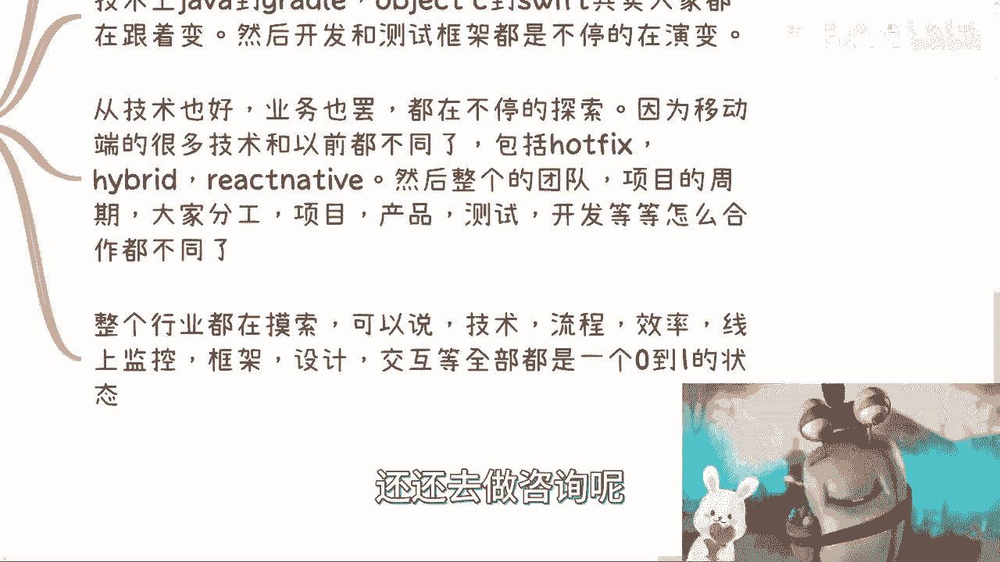

谁你是吧，然后你看就是这个移动端很多技术跟以前不同，包括hot fix，hybrid renative对吧，然后整个的团队对项目的周期啊，大家分工啊，项目产品测试开发等等。

就是所有的你会发现他的角角落落，就甭管从技术到流程，甭管从业务到框架，反正都不一样啊，那么整个中国各个领域呃，就整个中国各个企业其实都在做摸索，可以说全球都在做摸索啊，技术啊，流程啊，效率啊。

线上监控啊，框架设计啊，交互啊对吧。

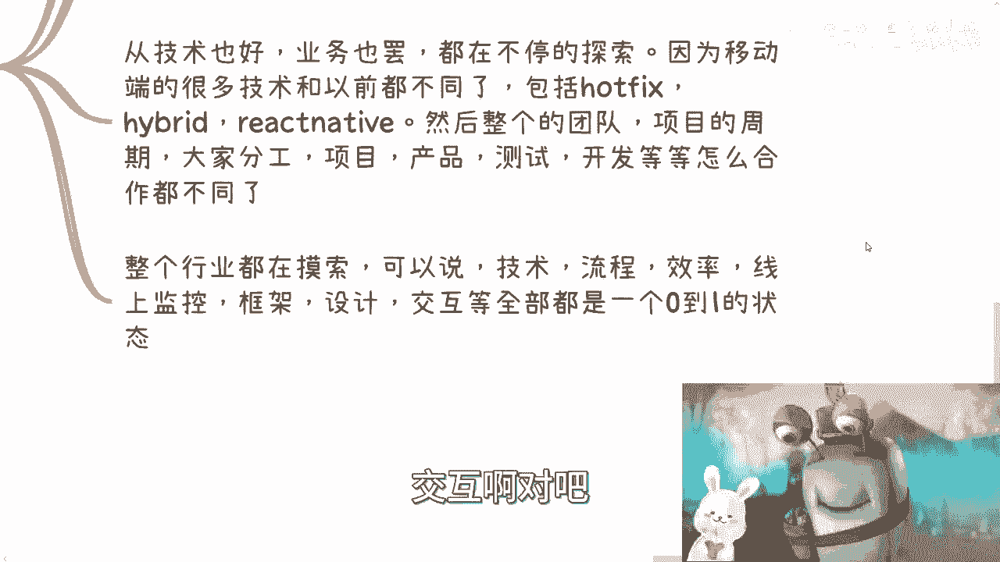

UIUX啊，这些就全部都是0~1的状态，属于百废待兴对吧。

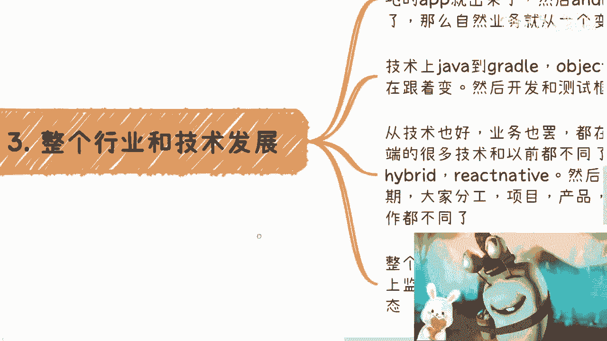

那所以说你会发现就是说呃，这个也算是一个契机嘛。

那么第四点我们来看商业情况啊，就是我曾经跟我朋友其实聊过这个东西呃，你看啊，虽然我很幸运啊，而且我可能是最早的一批做安卓的，但其实现在回过头去看看，就算我单纯，我我就算是最早做AP做安卓的，单纯打工。

我也赚不到多少钱，就是你们想啊，如果我们得我们先从一个因果关系来讲，就如果你们觉得很早的打工的这一批，做安卓或者做IOS的，他能够赚很多钱花，那现在，那现在你们在市场上就不可能看到这么多。

做安卓IOS还是转行，你知道吗，还是转型，为什么，因为真的真的不可能赚到很多的钱啊，就或者说也许啊我觉得以我的能力，根依我的这个当时的这个机缘。

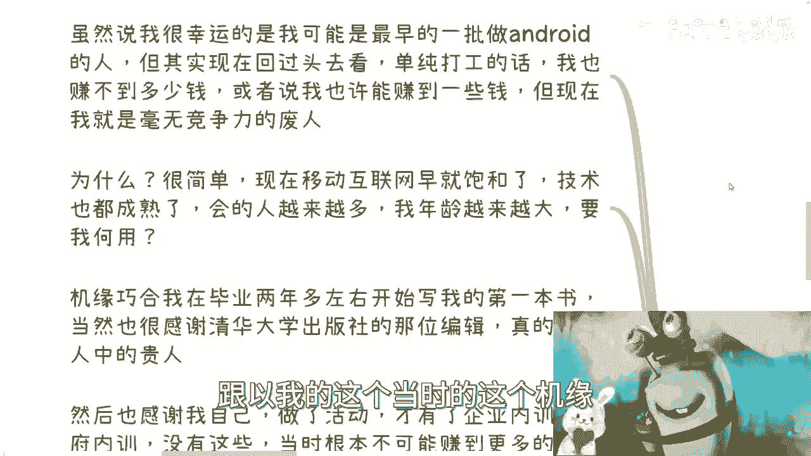

我的确也的确能赚到一部分钱啊，但是我现在就比如说到今天啊。

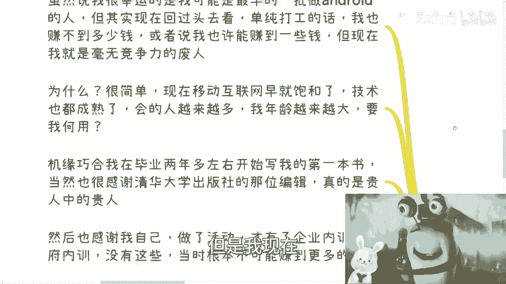

我绝对就是个毫无竞争力的废人，你们也不可能认识我，我也不可能认识我，富二代没有机会，为什么，很简单，因为现在移动互联网早就饱和了，好技术也早就成熟了，会的人越来越多，我年龄越来越大，要我何用啊对吧。

就那句话要你何用啊哈哈，然后机机缘巧合呢，你看啊在我毕业两年多的时候，我开始写第一本书啊，当然这个东西呢很感谢当时的那个时机，因为首先我肯定是不敢写的对吧，因为我以前语文从来不及格的啊。

我觉得我语文老师基本上要是知道，我现在这样子，怕不是就笑，就真的就开心的不得了啊，就是我为什么很那个呢，因为一方面是因为的确就是说我在那个行业，当时没有多少人在里面，大部分人还在那边关注塞班对吧。

那我觉得这点就是可能给我的底气吧，第二方面就是说呃，还是很感谢当时清华大学出版社的那位编辑，那个编辑呃，应该岁数嘛也不叫蛮大吧，我印象当中我我毕业的时候，他应该有个30多，40岁了，一个女的那个编辑呃。

真的特别好，因为当时我记得很清楚，我在北京，我要去赶飞机了，我根本来不及，然后呃而且我也没有这个信心，没有这个底气，没有这个勇气去见他，因为我觉得离我太远了，然后呢他一点都不排斥我。

就是他也他非常平易近人，然后我们在清华大学隔壁的一个麦当劳吧，还是哪个地方见的面，然后我就就急匆匆我就去赶飞机了，然后我记得他，当时我跟他因为没有多少时间聊嘛，其实我记得很清楚，他问我想干嘛。

我说我我想拥有更大的影响力，至于你问我有影响力之后干嘛，我说我不知道啊，我也没想过，然后他就跟我说，他说他认为中国，那当然当时啊现在我不知道啊，他以当时的那个背景，他就跟我说。

他认为中国拥有最大影响力的要做，你要做这件事情，还是要去纸媒啊，还是就是传统媒体啊，所以就是他嗯建议就说我要是能写就写，然后呢我当时没有拒绝，我也没答应，因为我说我不太行。

但是我回上海之后大概半年的时间，我想明白了，我要写，然后我就去联系他，才有了这第一步啊，然后呢我也要感谢我自己，就是我当时做了活动，然后做了这些活动呢，才会有后面的企业内训跟政府内。

因为你们要明白很多东西它是有因果关系的，你们现在知道这些是因为我告诉你们，我当时知道，我当时不知道这些是因为不可能有人跟我讲了，对不对，就是我们不可能去想出来，我超出我们认知的事情，所以说你想想看。

没有人跟我讲，有有什么企业内训，政府内训，我难道会做一件事情，目标是企业内训，政府内心，这他妈托梦吧，要买啊，对不对，所以不现实的啊，当时模式呢就跟我曾经就是在杭州线下活动，说的一样。

就是最早几年呢所有的业务只能去企业跟政府，为什么只有企业跟政府是关心的，你你问问C端，C端用户，老百姓这些开发，我靠，我刚才是说安卓他肯定会跟我讲的，就是什么乱七八糟的对吧。

我们现在做做做网站做的蛮好的，做后端做的蛮好的，就是因为C端啊，中国的C端跟老百姓他是不会有危机意识的，就是他永远是安于现状的，没有办法，这就是老百姓对，这就是C端嘛，你跟他讲一个新的东西。

他就会觉得你要么是骗子一样，要么就是说是来割点韭菜的，你知道吧，他不愿意改变，所以说呢这一点是什么呢，就是我们要从整个趋势来讲啊，是这样子的，就是说你看啊对我来讲，我是先稳定的做了政企内训之后。

然后由于有了这些经验和我的工作经验，然后再参加了像QQ这种，各全国甚至全球的各种大会，然后随着时间推移，在政企做了几年之后，我也开始做C端的技术培训，所以我也告诉你们，就是在整个移动互联网的整个周期。

我基本上是什么呢，打工啊，加政府培训，加企业培训，再加C端的培训，我四四条线是一起走的啊，包括就就这些还没有，包括就是那些什么什么，各个各个各种大大小小的会议啊，包括什么各种各样的活动啊。

这些都没算进去啊，这些算进去的话，我起码有六条线，六七条线是并行的啊，所以说你们要明白，就是任何行业发展趋势其实都是一样的啊，那么所以说呢就是说有很多人就是打个比方，你说他们说什么真的要去做AI对吧。

或者做什么做什么，那个数字经济就不是先从C端切的，你要先从C端切，可不可以可以，那你就直接去骗，因为你不可能去做C端的，C端，没有这个认知的，你怎么可能做得了C端对吧，你就像我当时刚做完ROID做两年。

我去做C端做个屁啊，他妈的哎哎C端连是什么东西都不知道，还做呢对吧，但其实饱和呢我跟你讲也是能看得出来的，就在整个过程中啊，因为我明显能感觉到竞争越来越激烈，我明显感觉到就是我哪怕作为一个安卓的前辈。

我哪怕作为做成作为一个IOS前辈，虽然别人对我很尊重，但是我明显感受到网络上的文章我以前搜不到，后面是铺天盖地对吧，我手上会的内容越来越没有竞争力，同时那些年龄比我大的前辈。

由于他们没有赶上这波移动互联网的，这个这个这个叫什么，就是就是前期吧对吧，因为后面其实很多人，很多人为了生存嘛，他们也不得不去学习移动互联网，但是由于他们没有赶上前面的那波。

就是比相对来讲和我一样比较早的这拨人，那么他们就会随着越来越疲软。

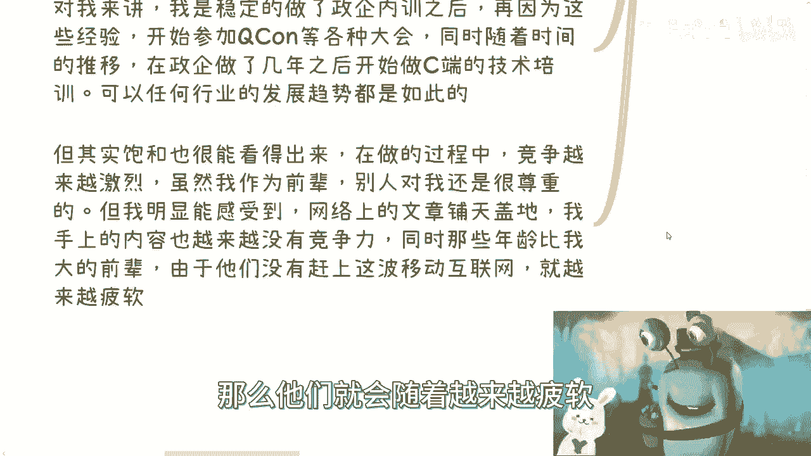

但是你们会发现这是一个螺旋的一个过程，也就是说这些人他们对移动互联网，可能是这个慢慢慢慢被迫无奈去学，那你们年龄大了之后，你们也会被迫无奈去学习别的东西，但是如果只走这条路，基本上就是死路。

没有办法的啊。

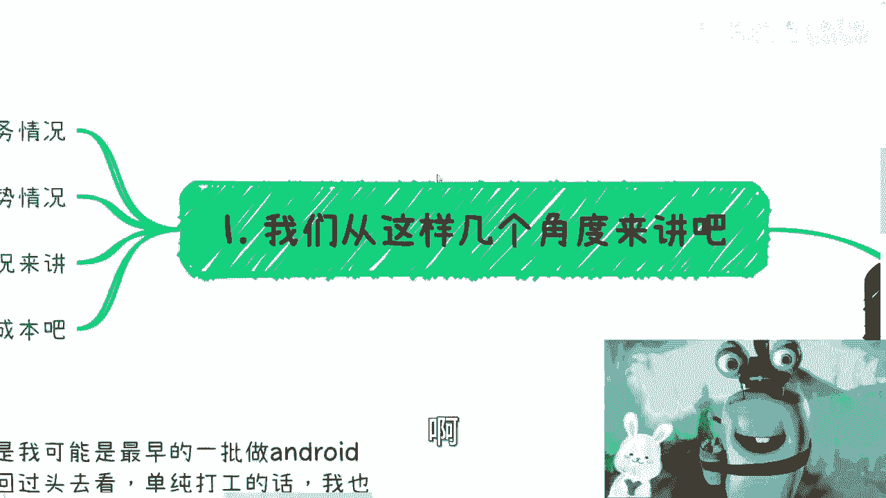

所以啊我们想想看啊，我们要明白，任何一个行业它都是有周期性的，而且周期会越来越短，因为这没有办法，这个是时代造成的啊，你你不要去说为什么没有，为什么哪来这么多事情，为什么对吧，就我们要保持竞争力。

核心并不在于你们的技术，因为就像我们刚刚说的，任何行业周期越来越短，你的核心不在于你的技术，而在于你的赚钱的模式和你的关系对吧，那当然你要说我们还回到m pa pa对吧，就我们这位同事。

你们去搜搜看他和楼教主，你们但凡能达到他跟楼教主的高度，那OK当这句话就不适合于你们，但但凡你们只是跟我处于一个level的，那我跟你讲，不好意思，唯一的出路就是你的赚钱模式跟关系。

别的东西不要想了啊啊天时地利人和。

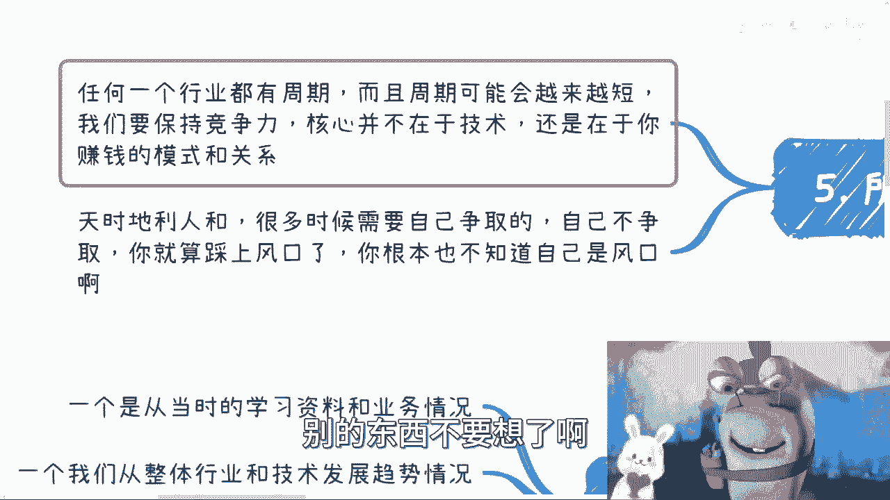

你要记住啊，很多时候需要自己进，需要自己争取的，自己不争取，你就算踩在风口了，你根本就不知道自己是风口对吧，你想想看，我毕业的时候做安卓，我以为我就是个垃圾啊对吧，当然事实我也的确是个垃圾对吧。

你说那个时候甚至我做了两三年，有人会跟我说风口吗，没有的呀，谁来跟我说对吧，你你说中国有没有这么高瞻远瞩的人，有啊，但是我对他来讲是什么，我就是个垃圾，你觉得他会认识我吗，不可能他就算认识我。

他会跟我讲吗，也不可能对吧，但是你要明白，没有人在最早的时候，知道你自己在一个风口上面不知道的对吧，而且你就算知道知道你在风口上，你把握得住吗，你不一定把握得住吗。

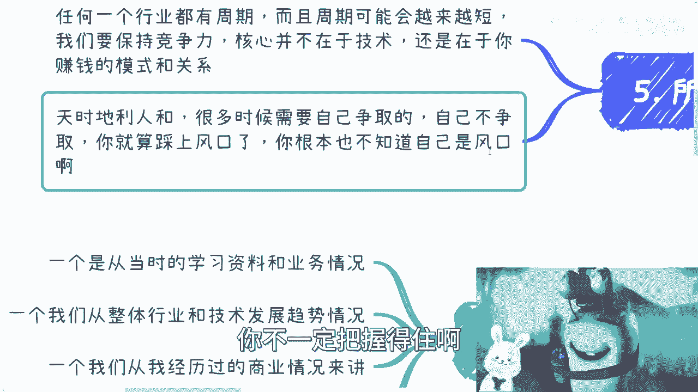

你就像我之前跟我那个特斯拉的朋友聊天，也是的，他当时跟我说，他说哎呀，你之前在移动互联网也算赚到过钱，我说你要想明白啊，我要是真的打工，我赚到个啥，对不对，我说我要不是第2年左右，我出去做咨询，做培训。

我要不是开了这几条副业，我要不是自己摸索到今天，我说我赚到啥对吧，然后他说嗯这倒也是对呀，是呀，没办法，我说如果不开这条路，我自己很明确的，我差不多到116年左右，我基本上就找不到工作了。

因为那个时候已经井喷式增长了，你找个屁啊对吧，当然我可以找，我只能亲自往下降，整个派克就往下降，对不对，你你怎么玩，你更不要说现在了，16年你就继续，现在7年对吧，我起码我客观的说啊，如果我继续做。

我差不多到现在应该事业有个56年了，应该对吧，当然不是说我找不到，我可以找，但是我也不愿意去做那种，就是说996007，然后你每个月可能就给我个，给我个1万多2万块钱的这种开发工作，主要我不做的呀。

对不对，你年龄放在这呀，对不对，所以呢我觉得就是说嗯，其实我觉得环境还是越来越好，当然我指的环境是指大家学习的环境，大家能够获取信息的渠道对吧，但是呢就是说人也越来越浮躁，这也是真的。

因为我相信如果你们现在，就算像我当时有一个领域，给你们去做一个全新的，你们大部分人也静不下心来，跟我当时一样，能够去看看文档，看什么东西，哪有啊，都是伸手党对吧，所以说你们知道吗，在我看来。

真正的就是如果你们能踏踏实实做事情，能够静下心来做事情对吧，就已经，我觉得就基本上就是成功的一个一个必要条件，因为在现在这个时代，太多人浮躁了，就太多人想急功近利，想想走捷径对吧。

那其实你们跟他们就不用再去，就是就是去去去在这种扭曲的地方竞争，你还不如好好做对吧，当然我好，我说好好做就不是好好打工对吧，就一定是你要好好的去摸索你的赚钱的逻辑，赚钱的这个叫什么模式啊，好吧。

那么这个东西呢我觉得就是大家得明白，因为我完整的走过整个的逻辑，所以我很清楚基本上是怎么的一个样子啊，哦好吧，所以就希望大家以后能把握住吧，嗯先这样吧好吧，有什么你们反正整理好。

