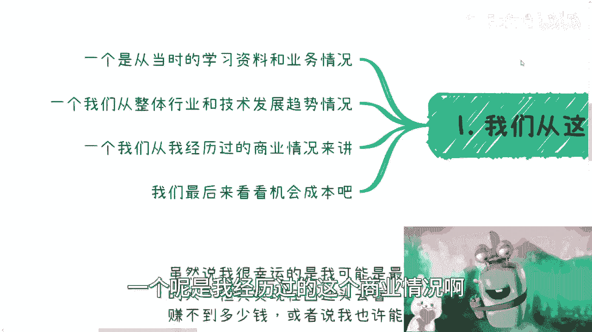
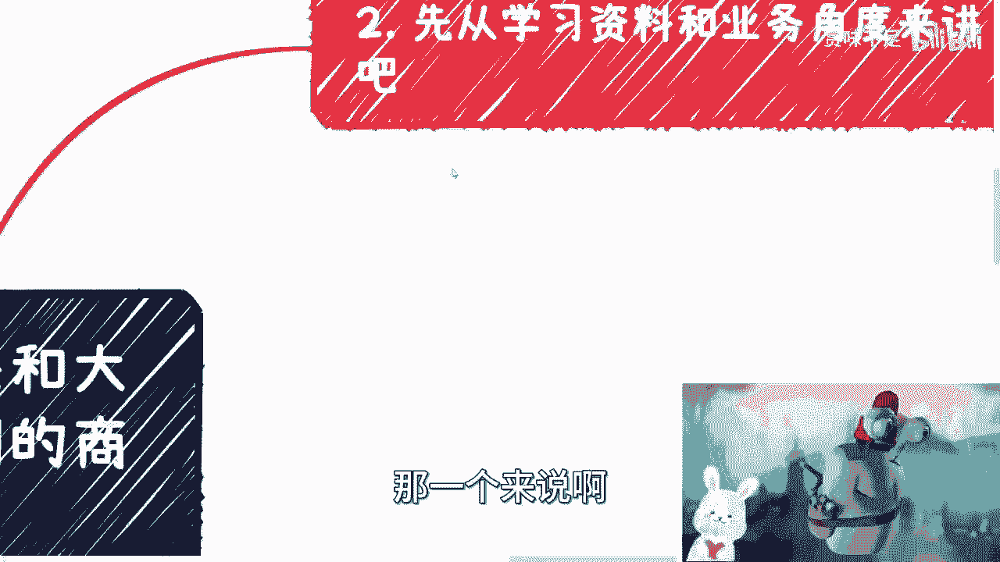
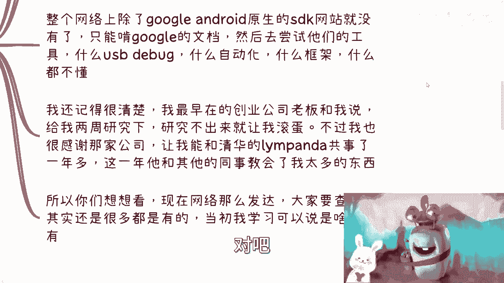
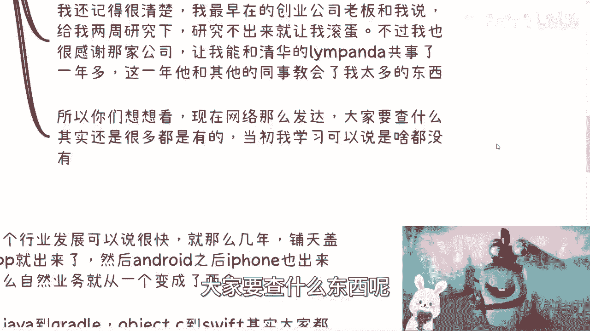
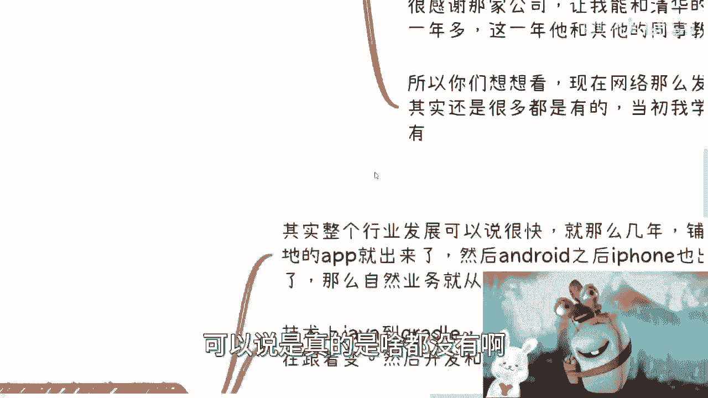
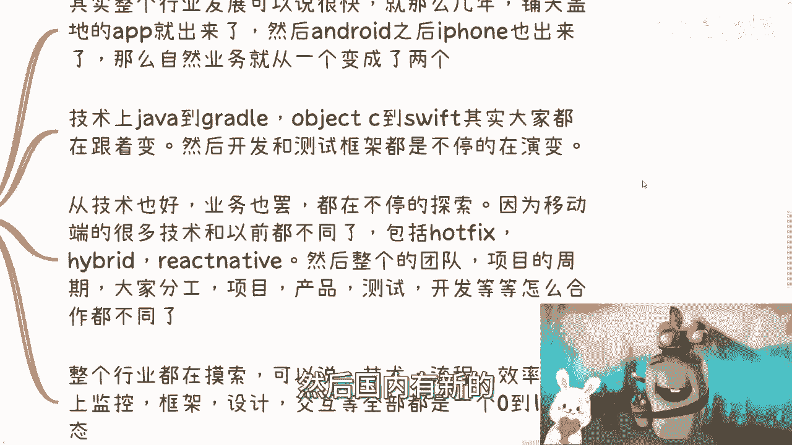
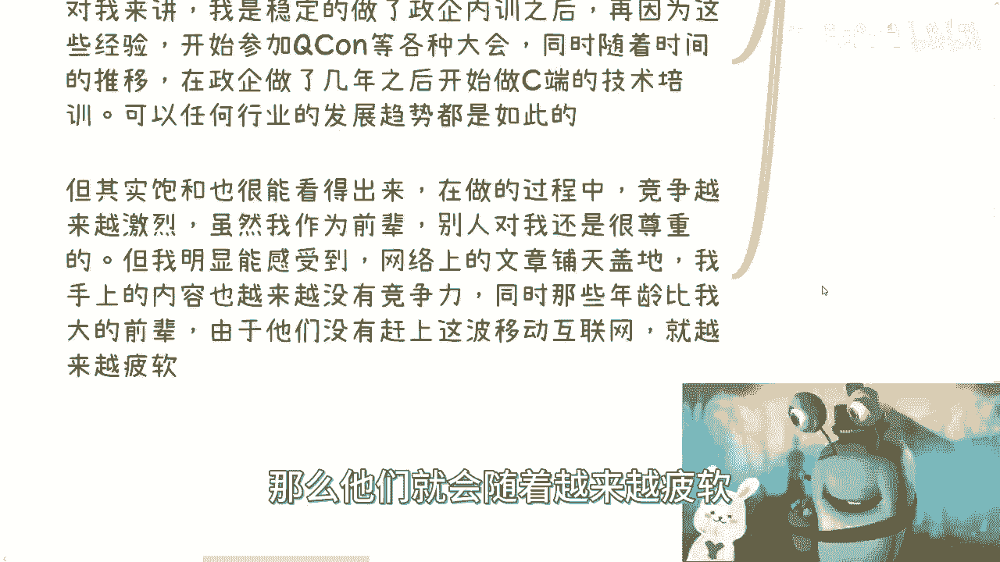

# 从我个人经历来说下移动互联网的商业发展---P1---赏味不足---BV1xg4y197Hi_not

在本节课中，我们将从一位早期从业者的个人视角，回顾移动互联网的商业发展历程。我们将探讨技术学习、行业发展、商业机会与个人选择，并从中提炼出对当前技术从业者的启示。

## 概述：四个观察角度

我将从四个角度来分享我的经历：当时的学习资料与业务情况、行业技术发展趋势、我亲身经历的商业情况，以及关于机会成本的思考。

---

## 一、 学习资料与业务环境 📚

上一节我们概述了本课程的角度，本节中我们来看看最初的学习与业务环境。

我的技术起点与大多数人不同。作为一名互联网技术岗位从业者，我从未从事过前后端开发工作。我的职业生涯始于安卓开发，没有任何前后端经验。这种起点让我节省了大量时间，但也带来了挑战。

当时的环境非常特殊。我的社交圈里几乎没有人从事安卓开发。在网上也难以找到同行交流，更不用说探讨商业问题。学习资源极度匮乏，主要依赖谷歌官方的Android SDK文档。

由于刚毕业，阅读英文文档本身就是一个巨大挑战。尝试使用各种开发工具，如USB调试和自动化测试框架，过程也异常艰难。

我记得在一家创业公司的早期经历。老板给我两周时间研究一项技术，研究不出来就得离开。当时的转正薪资大约是2600元。尽管如此，我十分感谢那家公司，因为它让我有机会与一位毕业于清华、网名为“llimpanda”的杰出同事共事一年多。他和团队教会了我许多东西。

我的基础可能比许多人都薄弱，家境也更普通。我深刻了解中国普通百姓的生活。你们现在所处的网络环境要发达得多，学习资源丰富。而当初，我几乎是在一片空白中摸索。

---

## 二、 行业与技术的飞速演变 🚀

上一节我们回顾了早期的学习困境，本节中我们来看看行业是如何快速发展的。

整个移动互联网行业在短短几年内爆发式增长，铺天盖地的应用涌现。安卓之后，iPhone也迅速崛起。业务和技术路线从单一变得复杂。

技术生态非常混乱，几乎每天都有新框架、新工具出现。国内外的技术动态令人应接不暇，根本来不及系统学习。

从技术栈的演变可见一斑：
*   **开发语言**：从 `Java` 到 `Kotlin`，从 `Objective-C` 到 `Swift`。
*   **构建工具**：从 `Ant` 到 `Gradle`。
*   **开发与测试框架**：也在持续不断地更新迭代。

移动端的技术理念和业务模式与PC时代完全不同，这迫使所有企业——包括互联网公司、传统企业和政府机构——都在进行探索。这种普遍的“从0到1”的摸索状态，为我后来从事咨询和培训工作埋下了伏笔。

移动端引入了许多全新概念，例如：
*   **热更新**：`Hot Fix`
*   **混合开发**：`Hybrid`
*   **跨端框架**：`React Native`, `Flutter`

团队分工、项目周期、产品设计、交互体验等各个环节都在重塑。技术、流程、效率、线上监控、框架设计、UI/UX等领域都处于百废待兴的状态。

这既带来了混乱，也创造了巨大的机遇。

---

## 三、 亲历的商业现实与多元路径 💼

上一节我们看到了行业的混乱与机遇，本节中我们来看看具体的商业情况。

即使作为早期安卓开发者，如果仅靠打工，也难以获得巨额财富。一个简单的因果逻辑是：如果早期打工者能轻松赚大钱，那么今天市场上就不会有如此多安卓/iOS开发者考虑转行。

以我个人的能力和机缘，确实赚到了一些钱。但如果我只停留在技术打工层面，到今天很可能已毫无竞争力。因为移动互联网早已饱和，技术成熟，从业者众多，年龄增长会带来巨大劣势。

我的转折点出现在毕业两年多后，开始撰写第一本技术书籍。这得益于两个因素：一是我所处的细分领域当时从业者稀少；二是很幸运地遇到了清华大学出版社的一位编辑，他给予我鼓励和建议，认为在当时通过传统纸媒能建立更大影响力。

我后来的发展路径是多元并行的。以下是几条主要的业务线：
1.  **本职工作**：技术开发。
2.  **政府与企业内训**：得益于早期积累的技术经验和行业认知。
3.  **C端技术培训**：在政企培训经验之后逐步开展。
4.  **行业会议与活动**：参与并分享经验。

整个商业模式是逐步演进的。最初，只有企业和政府机构愿意为新兴的移动互联网技术付费。普通开发者缺乏危机意识，安于现状，对新事物往往持怀疑态度。

我的路径是：先通过政企内训建立稳定基础和口碑，积累经验后，再拓展至C端培训。在整个移动互联网周期中，我多条业务线是同步进行的。

我也清晰地感受到了行业的饱和：网络上的技术文章从无到有，再到泛滥；我所掌握的技术竞争力逐渐下降；更多开发者涌入，竞争加剧。这是一个螺旋式的过程：后来者被迫学习新技术，而先行者如果停滞不前，也会面临淘汰。

---

## 四、 核心启示：超越技术周期 🔄

上一节我们分析了多元路径的重要性，本节我们来总结超越技术周期的核心。

我们必须认识到，任何行业都有周期性，且周期正变得越来越短。这是时代发展的必然结果。

保持竞争力的核心**不在于技术本身**，而在于：
1.  **你的盈利模式**：是否多元化？是否具有可持续性？
2.  **你的关系网络**：能否连接资源，把握机会？

公式可以概括为：**长期竞争力 ≈ 盈利模式 × 关系网络**

对于绝大多数普通从业者而言，这是更现实的出路。只有极少数能达到技术巅峰的人可以仅依靠技术立足。

“风口”需要自己争取和识别。即使身处风口，早期也无人知晓。即使知晓，也未必能把握住。以我为例，如果不是在从业第二年就开始探索咨询、培训等副业，构建多元收入，很可能在2016年左右就面临职业危机。

现在的学习环境远比过去好，信息获取渠道畅通。但人也更容易浮躁，急功近利。在这个时代，能够**静下心来踏实做事**，已经是成功的必要条件。这里的“做事”，不是指单纯打工，而是指认真探索和构建属于自己的商业逻辑与盈利模式。

---

## 总结

本节课中，我们一起回顾了移动互联网早期的技术学习困境，见证了行业与技术的爆炸式演变，分析了一条结合打工、政企培训、C端培训及行业活动的多元商业路径。

核心结论是：技术迭代迅速，行业周期缩短。从业者要想获得长期发展，必须将目光从单纯的技术提升，转向构建**多元盈利模式**和培育**优质关系网络**。同时，在信息过载的时代，保持专注与踏实，是抵御浮躁、抓住本质的重要品质。

希望这段完整的经历回顾，能帮助你更好地理解技术行业的商业逻辑，并为自己的职业规划带来启发。