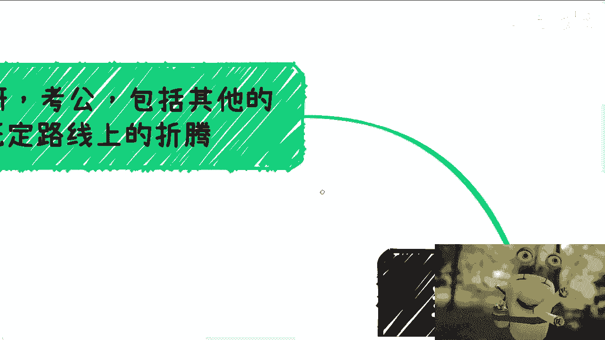
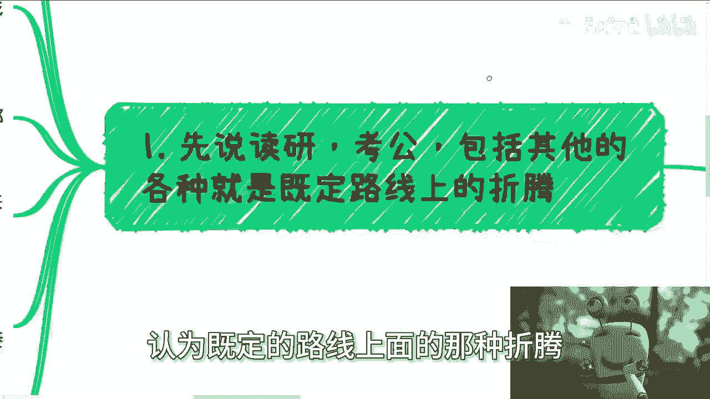
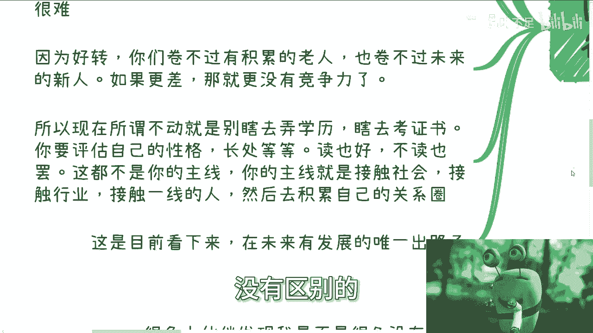
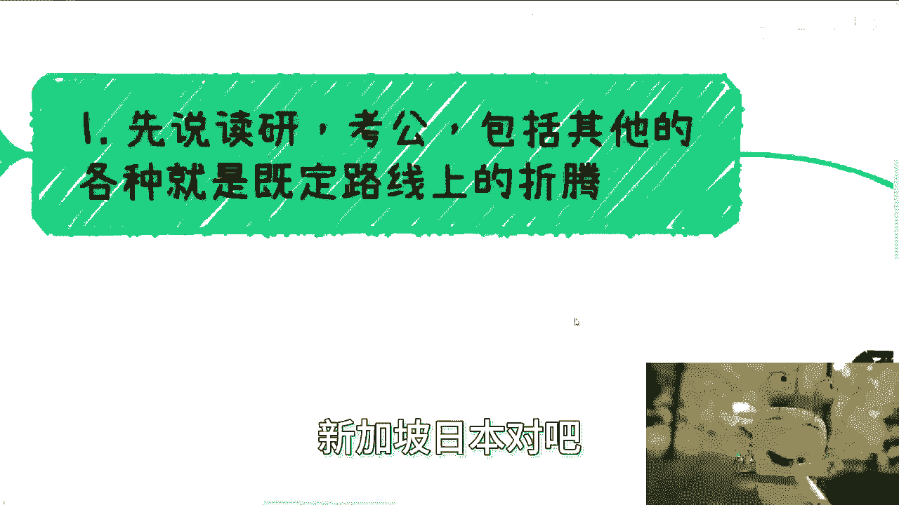
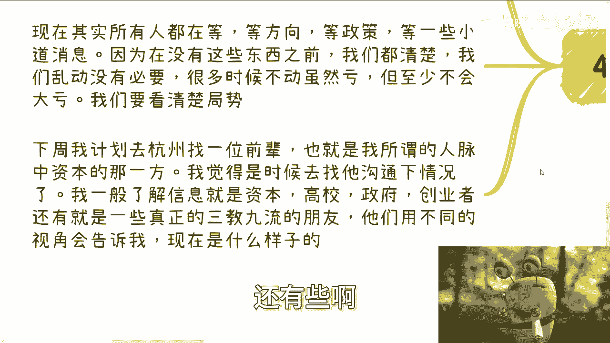
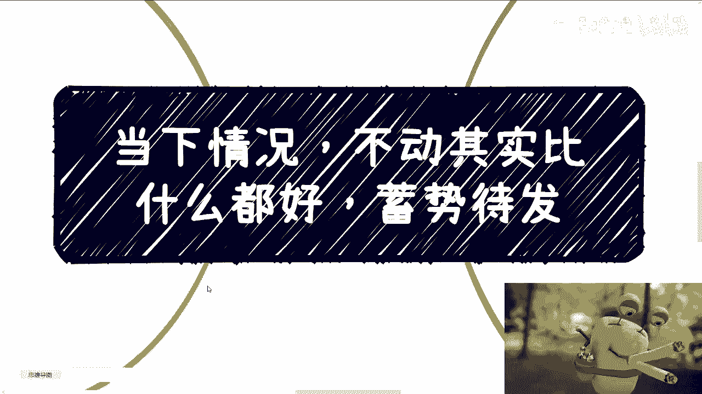

# 从我和我的圈子来和你们说下当下的情况 - P1 - 赏味不足 - BV1zC4y1C7ag

啊大家好啊。

我先说一下啊，就是说这个内容啊，并不是说啊我跟大家就这个内容，不是说我想告诉大家，你们在当下情况下面不要动，比什么都呃。

比比比做什么都要好啊，而是说我会跟你们讲，就是说从我的角度，从我身边的这些人的角度，他们会有这么一个这个认知或者这个判断，你们可以做参考啊，你们可以做参考动员了。

我来帮他分析一下啊，就是那种情况我不懂，是讲比东越来越好啊。

要洗了个蓄势待发，物资死的废物起来啊，实在是翻译不来啊，好那么第一个啊。

先说读研考公，包括其他的，包括就是你们在人生当中既定的。

认为既定的路线上面的那种折腾嗯。

怎么叫不动啊，也就是说你要去读啥考啥，其实我觉得都可以啊，但是你得明白现在什么情况，就是说就是我们之前说的，我们所有的人都在等政策，对啊，都在装死啊，你就像前两天有人问我，他说陈老师你最近在忙什么。

我说我不忙，我装死，为什么，因为没什么好忙的对吧，因为对我来讲，就是说白了就是我熟悉的人，合作的人我都已经问过了，就要么没预算，要么就是没什么好做的，我不熟悉的人怎么样，我跟他们合作。

我等于在自己作死对吧，我之前就跟你们讲过了，就是我不可能去做一个亏本买卖哦，你说我今天跟一个不熟悉的人，我要去做一个业务，除非啊除非就是我不投入任何精力，不投入任何的一些东西，然后你说可以做，那没问题。

那剩下的可能都是作死对啊，但是这个地方说的装死呢不是真的不动啊，而是说其实所有的人都在铺垫，所有的人都在讨论，所有的人都在见面，所有的人都在啊，就就就盘资源啊，都在找机会，那么我们假设未来两种情况。

就像我们之前说四往前推4年，往后推6年的那期视频，就是说我们假设未来有两种情况，一种是好转，一种是更差没了呀，要么横盘横盘其实也是更差对吧好，但是无论好转还是更差，其实相对于你们就是。

尤其是你们就是我说往前推4年，跟往后推6年的这些人，就其实对于你们这些应届生来讲，其实都是很难的，我倒不能说我不能给你们打死，说没有机会对吧，都很难，为什么，因为好转了，你们积卷不过有积累的老人对吧。

或者说卷不过有积累的那些年纪大的人啊，那么同样的也卷不过未来的那些应届生对吧，或者说在你们有一定的这个毕业了几年之后，那么未来的这个新一届的应届生，你们也卷不过他们，那如果更差呢。

反反过来说你们就更卷不过所有人，因为你们就处在一个当中，上不上下不下的一个阶段，就要积累，没积累要跟别人去拼一些，就是这种听一些这种啊，这个这个加班啊，或者怎么样，你们也拼不过人家啊。

所以现在所谓不动了，就别瞎去弄学历，瞎去搞证书，什么意思呢，就是说你还是要先去评估你的性格，你的长处，你擅长的点啊，当然你最后是读读也好，不读也罢啊，无所谓啊，你只要记住一点，这都不是你的主线。

你的主线就是与社会去接地气，没了啊，也就是说你可以保证你的学历，你可以去读，一点毛病都没有啊，但是你的核心一定是接触社会，接触行业，接触一线的人，然后积累自己的关系圈，因为只有这个东西。

在未来N年后对你是有帮助的，剩下午我就明确跟你讲，N年后对你们没有任何软帮助啊，那么在目前看下来，我我真的我觉得这是唯一的一条出路，没有了，你哪怕选择出国，也是这个逻辑没有区别的。

你们自己去问问美国，澳大利亚，加拿大现在什么情况，新加坡日本对吧。

你们自己去问问看，你们就知道了啊，那么第二个就是说赚钱跟投资啊，我跟你讲，很多人呢看书觉得呢复利很牛逼对吧，好没毛病，复利是很牛逼，但是问题是大部分人没有本金啊，你跟我谈什么复利对吧。

而且更何况投资不投资不是看几本书的事，什么意思，就是说现在有很多人跟我说，老师我要投资，那我跟你们这么说啊，你们所说的所有的话，在当下我其实都是不信的，为什么，因为你们所说的话一定是带有主观意愿的。

我只会看你们以前过去的历史对吧，你比如说你压根以前就没有投过资，你现在突然跟我说，你要投资，你说我怎么信你呢，对不对，你信不信你自己我不知道，但是你你历史上没有做过任何东西，你现在跟我说说。

我要做这个东西，我他妈信你，我他妈出轨了，要么对吧，那么当下情况是什么，你要但凡以前没有投资，你就更不应该投资，就像我们说的，不动对吧，你是闲着钱在手上太烫手吗，还是怎么样，你太烫手。

你存银行有什么不好呢对吧，你不要去想着瞎他妈的投资对吧，你赚不到认知以外的钱，你们自己去看看人民币对吧，一年两到三个点，我今天看了一下美元，差不多是在一年是在4。1%对吧，我发现很多人貌似觉得。

投资一年可以稳定二三十个点，哎我操，我跟你们讲，我不知道你们是哪里了解的，按照整个中就平均数十个点以上，这他妈在以前就是神操作，你知道吗，就是神操作啊，就我们假设你有100万，你想想啊。

我们假设你现在有100万，你一年是多少，是10%就10万，对不对，好，那我就问你，你能干嘛，我算你30吧，你就算一年30万，你能怎么样，我真奇了怪了，你能怎么样对吧，你你难道不应该去找机会想办法赚钱吗。

啊而且更何况我们就想想看，现在有很多人在想骂他，30万很多了，对吧，是啊是，但是你们难道没有发现一个问题吗，能保证每一年是稳赚不赔的吗，啊我靠，我们能够按照每年30%来做前提吗，这他妈天方夜谭了。

那如果按照这个作为前提，那我还每一年那个把我买福利彩票能中奖，作为前提有意义吗，对吧，而且另外一方面请问你有100万吗，灵魂拷问是不是没有用的呀对吧。

就是我们无论活在什么样的一个朋友圈里面，也无论活在一个怎样的网络下面，我们自己几斤几两，你得摸摸清楚啊，第三就是把所有的资源都盘一下，没有你就去找。

但是我跟你们讲，你们一定有的最多，你们就是不了解哦，也就是说我跟你们这么说啊，我在疫情第3年，我把身边的就是所有的关系好的不好的，只要我没有拉黑的，我基本上可以说所有的都聊了一遍，就是我跟你讲。

你赚钱嘛，不要脸的，要什么脸，对不对，你你不用管他跟你感情好不好，你赚钱谈什么感情对吧，你好好聊聊，去问问看你身边的这些人到底做什么业务的，包括你如果现在你刚毕业，你就去问问你同学对吧。

我相信总有业务可以合作的，你比如说我身边开有开奶茶的，有做量化的，有做服饰的，有做海关的，有做进出口贸易的，什么没有啊对吧，我会尽可能快的去盘一下他们做什么，然后他们是在整个上下游负责这个链路里面。

他们是负责哪一块对吧，就是其实大家都有合作机会，有谁没有合作机会啊，我就介绍合作，那当然我也不会去问他们要钱，因为没啥好要的，为什么，因为我就我这么跟你们讲哦，真正他们谈商业谈合作的人。

其实心里都知道的，就是如果真的是，比如说今天陈老师介绍了一个对吧，哪怕是我介绍的，他们第一开始合作，你想想看啊，也不可能你们一上来合作什么合作个100万，200万可能不来，不可能点。

大家其实都是相互试探的，你知道吗，所以说你做个5万10万了不起哦，5万10万里面我还问他们要个百分之几，卧槽我他妈太low了，是不是啊，所以说呢就是说他们只要能合作啊，我相信未来总归不会忘记的。

那么同样的因为在当下这种情况下，大家都很困难，就说白了跟你一样label的人很好沟通，而与此同时呢，以前高高在上的那些也很好沟通，你知道吗，就以前可能你你会比如说觉得哎呀他好像不，我对吧。

或者说鼻孔看我对吧，怎么样子，但是现在不会了啊，你可能就是更高概率能跟他们去聊，为什么，因为大家都难啊，谁不希望多个机会啊，而且更何况聊一次他也不少块肉啊对吧，用上海话怎么说，我跟你们说。

真的真的真的那个我一直翻译不来，上海话怎么说叫PE，但是我一直不知道这个PEEZ我应该怎么翻译啊，我妈也很单纯啊，硬要翻译应该叫这么说，叫做有胜于无啊，那么最后一个呢就是但还是那句话，就是前提呢。

呃所有人其实是得知道，相互之间是他是一个东东，真正的是懂得去做商业的人啊，而不是说就是说就说这个人，好像就就就就小当小闹，然后是那个过家家的，然后就野路子的，那么这种其实我说白了你去盘资源也没用啊。

也盘不出什么东西来，因为大家相互之间不会合作的，那么最后一点就是数字经济啊，有很多小伙伴发现，我是不是很久没有更新数字经济了对吧，因为没有政策，2024年新的一年，到现在到现在还没有新的东西。

我说再多没有用了，对不对，就是如果他今天出了一个重要的政策，我觉得跟着那个方向我们可以去做猜测对吧，去做一些呃评价做什么东西，那他现在没有啊啊那那那我我就在猜测，我他妈瞎猜有啥用对吧。

呃现在其实所有人都在等，我就跟你讲，等方向，等政策，等一些小道消息都在等，而一边在等的时候呢，一边就这个铺垫，就是大家合作呃讨论，但是不会在那边瞎动，你知道吧，就什么就什么，虽然现在大家很急啊。

但是你你千万不要就是说这个病急乱投医啊，因为你要这么想啊，在没有这些东西之前，你在这个国家你们都要清楚，包括我们也要清楚，就是我们乱动是没有必要的，因为很多时候你可能会觉得我不动啊，我可能很亏啊。

别人都在动，但没有毛病啊，但至少你会发现你动了很有可能是大亏，你知道吧，没有必要啊，啊我们要看清楚局势，而且真的你比如说对方他就没有什么单子，或者没什么机会，你硬逼着他有什么用吗，没有用的，对不对。

下周啊，我计划去计划去杭州找一位前辈啊，啊虽然是前辈吧，但其实也没比没比我大多少啊，也就是我所谓的我曾经关系链，人脉当中的资本的那一方啊，我觉得是时候找他去沟通一下，我上次去找他沟通呢。

还是2022年的下半年啊，啊我跟你们讲过，我一般了解信息的资源，就是我自己的就是很好的，也不是很好吧，就是就是常经常建立联系的，分别是在资本高校，政府创业者，还有一些产业园生态园。

还有些就是真正的三角九流的，为什么，因为我需要他们用不同的屁股来告诉我，他们的眼睛里面，所真正看到的现状是什么样子的，那么当他们通过不同的视角告诉我的情况，比较一致的时候，那么我基本上可以断言对吧。

10年情况什么样子对吧啊，如果来说它们之间有非常大的差异化，那么我就会去想到底是什么原因造成的差异化，那如果来说差异化是真的对吧，那么我肯定是会先把那些觉得有预算，有钱的地方，我去提升优先级啊。

比如说资本跟我说，哎高校政府可能这边比较好做，那我就先做那边对吧，那创业者跟我说，比如说某些政策好好，那我就去薅那一边对吧，就是你做就像我跟你们讲的，做事情啊，你们得要有依据啊。

你不能说就是就是就是网络上怎么样子，抖音怎么样子，你朋友怎么样子，没有用的，你看我给你们所有讲的一句，有哪件事情我跟你们讲的是说啊，朋友圈发了个什么东西啊，然后什么我在什么看了一个视频啊。

然后以这个东西为依据，绝对不可能绝对不可能的啊，我所有的依据一定是通过我跟你们讲，以我为中心的这么一个关系链，我线下去获得的基础啊，这个信息基础，否则没有意义的呀，就是你本身的信息依据。

就是就是有问题的，你怎么可能做出来一个正确的判断，对不对，好吧，所以我综合来讲，最后还得说一句，就是一切才刚刚开始，但是真的留给你们的时间不多了，你们可以，现在我敢打赌，99%的人。

你们没有明白我说话的意思。

