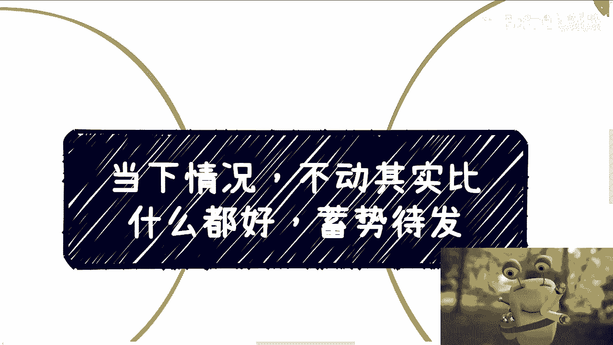
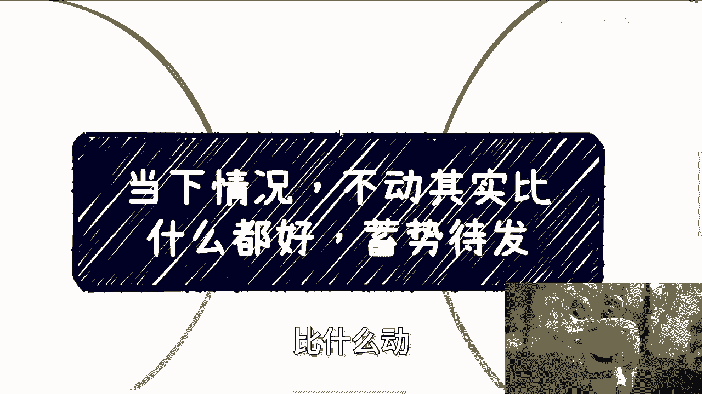
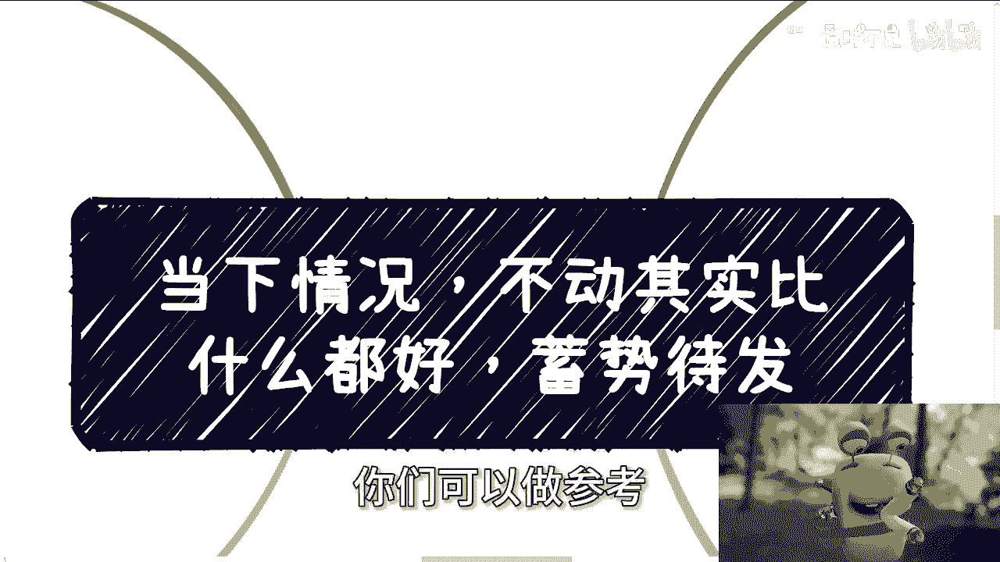
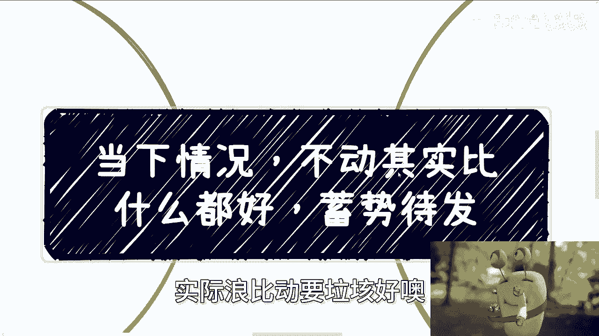
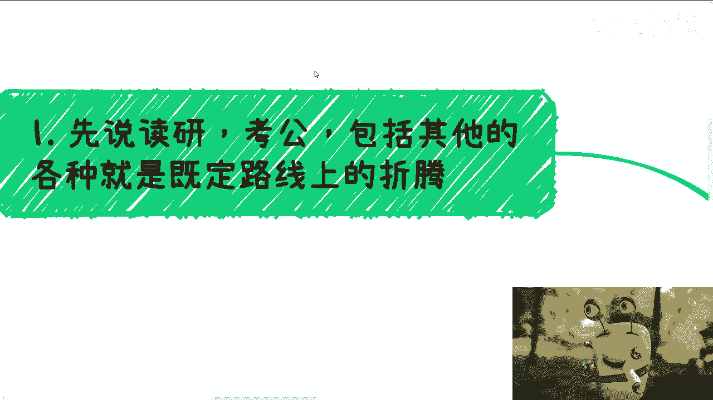
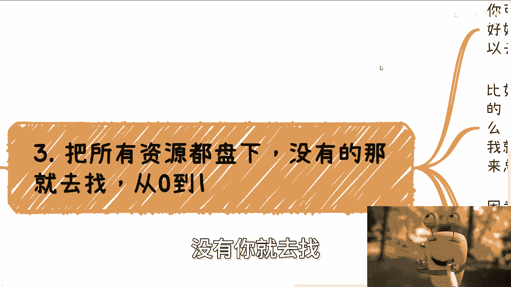
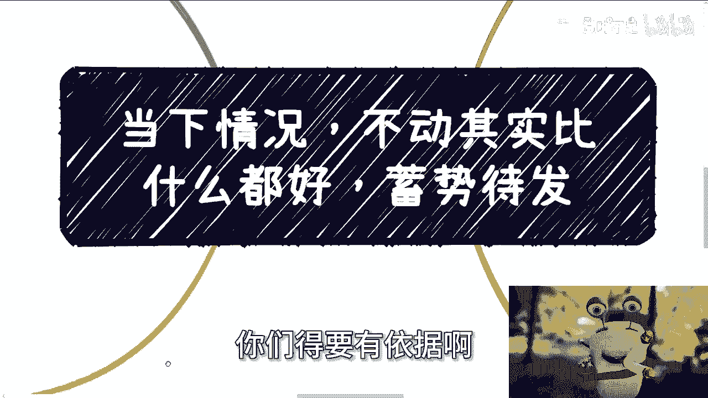

# 课程 P1：当前环境下的个人发展策略 🧭

在本节课中，我们将从个人及其社交圈的视角，分析当前的社会与经济环境，并探讨在此背景下，个人应如何规划学业、职业与投资。课程将提供具体的行动建议，帮助你做出更明智的决策。

---

上一节我们介绍了课程的整体目标，本节中我们来看看关于学业与职业路径的第一个核心建议。

## 1. 关于学业与职业：主线是接触社会

当前，许多人选择读研、考公或沿着既定路线发展。这些选择本身没有问题，但你需要明白一个核心前提：**你的主线任务是接触社会**。

无论是继续深造还是准备考试，这都不应成为你唯一的重心。你的核心必须是走出校园或固有圈子，去接触真实的行业、一线从业者，并积累自己的人脉关系网。因为只有这些实践经验和社会关系，才能在未来的竞争中为你提供实质性的帮助。单纯追求学历或证书，在多年后可能收效甚微。

这个逻辑同样适用于考虑出国的人。在做出决定前，建议你主动去了解目标国家（如美国、澳大利亚、加拿大、新加坡、日本）的真实就业与生活现状。

---

在明确了学业职业的主线后，我们来看看另一个常见误区：急于投资赚钱。

## 2. 关于赚钱与投资：警惕不切实际的幻想

很多人被“复利”概念吸引，渴望通过投资快速积累财富。但这里存在两个关键问题：
1.  **大部分人缺乏足够的本金**。没有本金，复利无从谈起。
2.  **投资能力并非来自书本知识**。它需要实践经验和市场认知。

如果你过去没有成功的投资经历，那么在当下环境，更明智的选择是“不动”——**持有现金，而非盲目投资**。将钱存入银行获取稳定利息（例如人民币年化2-3%，美元约4.1%），远比追求不切实际的高回报更安全。

请理性评估：假设你有100万本金，年化收益10%即为10万元，30%则为30万元。这听起来不错，但关键在于，**没有任何投资能保证每年稳定获得如此高的回报**。将小概率事件作为规划前提是危险的。更重要的是，请诚实地问自己：你拥有这笔本金吗？

---

既然不建议盲目投资，那么在“不动”的时期，我们应该做什么呢？答案是：盘点并整合你已有的资源。

## 3. 关于资源整合：主动盘点，寻求合作

你拥有的资源可能远比自己想象的多，只是尚未被充分了解和利用。

以下是进行资源盘点的具体步骤：
*   **全面梳理联系人**：将你的社交网络（包括同学、前同事、朋友，甚至未曾深交的人）全部梳理一遍。
*   **主动沟通，了解业务**：放下“面子”，主动与他们联系，核心目的是了解每个人具体从事什么业务、在产业链中处于哪个环节。
*   **寻找合作契机**：基于了解的信息，思考彼此间是否存在合作的可能。初期合作可以从小额、试探性的项目开始，重点是建立连接和信任。

在当下环境中，无论是与你背景相似的人，还是以往觉得“高不可攀”的人，都更有可能进行平等沟通。因为大家面临相似的挑战，都希望寻找新的机会。一次沟通不会有损失，用上海话说，这叫“有胜于无”。

**前提**：这种资源整合建立在双方都具备基本商业头脑和诚意的基础上，而非儿戏般的“过家家”。

---

最后，我们来探讨一个宏观领域：数字经济，并总结全课的核心行动逻辑。

## 4. 关于宏观趋势：等待与铺垫

以“数字经济”为例，目前该领域缺乏新的明确政策。在没有明确方向时，业内普遍的策略是“等待与铺垫”。

这意味着：
*   **等待方向**：密切关注政策动向和行业信号。
*   **积极铺垫**：在等待期间，积极与各方讨论、交流、规划可能的合作，但**不采取盲目、重大的行动**。

“病急乱投医”往往导致更大损失。在局势不明朗时，保持耐心、持续观察并做好基础工作，比乱动更为重要。我的信息主要来源于一个多元的关系网络（包括资本方、高校、政府、创业者、产业园区等），通过交叉验证不同视角的信息来做出判断。**做决策必须依据可靠的一手信息**，而非网络传言或碎片化资讯。

---

## 总结

本节课中我们一起学习了在当前环境下的个人发展策略。我们主要探讨了四点：
1.  学业职业方面，**接触社会、积累人脉**应成为主线任务。
2.  投资理财方面，应**认清现实、保持谨慎**，避免追逐不切实际的高回报。
3.  个人发展方面，应**主动盘点并整合**现有及潜在的资源，寻求合作机会。
4.  面对宏观趋势，应采取 **“等待与铺垫”** 的策略，依据可靠信息做决策，避免盲目行动。

一切或许才刚刚开始，但时间宝贵。希望你能真正理解并实践这些基于现实观察的建议，为未来打下坚实基础。