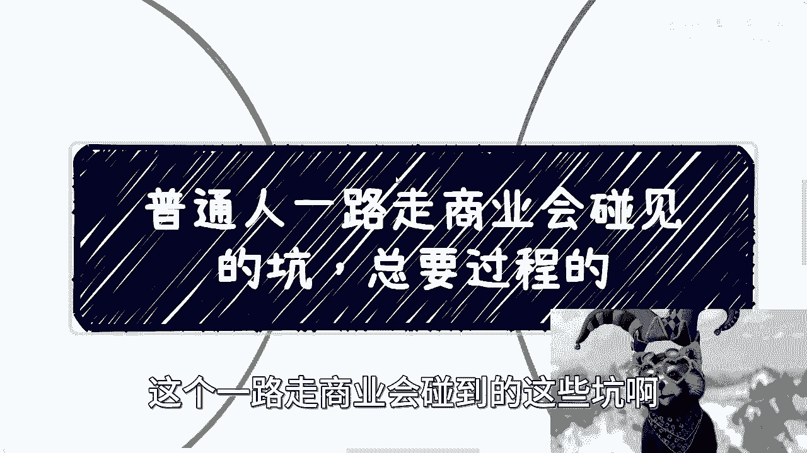
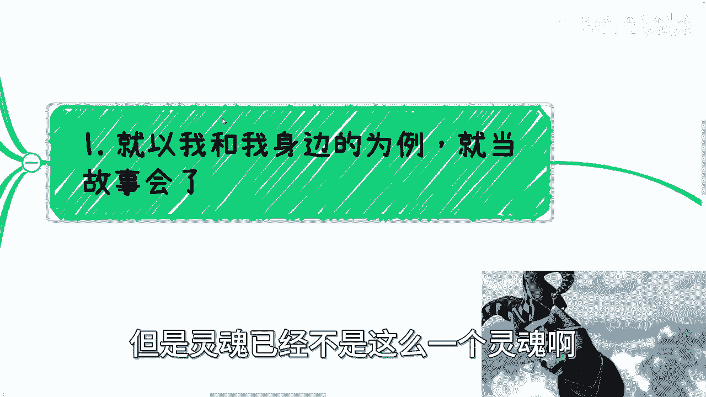
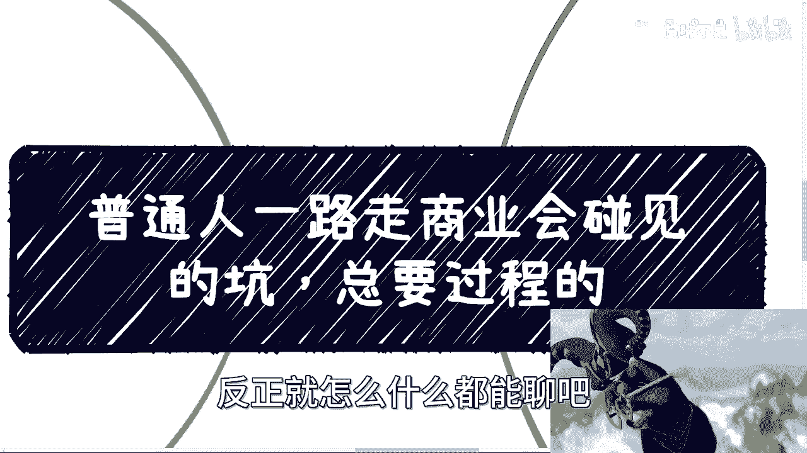

# 课程一：普通人商业避坑指南 - 从天真到现实的蜕变之路 🚧

在本节课中，我们将要学习一位经验丰富的商业实践者分享的心路历程。他将以自身经历为例，剖析普通人在创业或商业活动中可能遇到的各种陷阱与挑战，帮助你提前建立认知，避免重蹈覆辙。

## 概述：商业世界的真实面貌

上一节我们介绍了课程的主题，本节中我们来看看分享者的核心观点。他认为，商业世界并非表面那般美好，其真实面貌往往与初入者的天真想象大相径庭。从满怀理想的毕业生到历经磨砺的实践者，其认知发生了根本性的转变。

核心转变公式可以概括为：
**初始认知（世界美好，人皆可信） → 经历挫折 → 最终认知（人性复杂，需保持警惕）**

这个过程并非简单的“黑化”，而是对现实规则更深刻的理解。

## 初入社会的天真心态

许多人，包括分享者自己，在职业生涯初期都持有一种典型心态。

以下是几种常见的初期表现：
*   **过度信任**：认为世界美好，每个人都单纯善良，可信度高。
*   **自我牺牲倾向**：做事时将他人的优先级置于自己之上，追求完美与负责。
*   **代际优越感**：年轻气盛，容易轻视前辈的经验，认为“我们这一代更行”。
*   **缺乏风险意识**：对合作、合同等商业细节不够重视，抓住机会就上。

这种心态源于单一的教育和成长环境，导致对复杂的社会和人性缺乏足够的认知。

## 商业实践中遭遇的各类“人”

当你开始运营任何公开平台（如活动、自媒体、朋友圈）时，你就从“暗处”走到了“明处”。这意味着你将暴露在各种目光之下，其中不乏审视与算计。

根据分享者的活动组织经验，接触到的人大致可分为以下几类：
1.  **默默支持者**：内心认可你，但可能因性格内向或自视较高而不主动表达支持。
2.  **功利利用者**：接近你的目的性强，只关心自身利益，表面维持友好关系。
3.  **恶意打击者**：目的就是为难、恶心或打击你，包括线上线下砸场子、提出刁难问题。
4.  **“劝退关心者”**：以关心的口吻劝你放弃，但其逻辑往往站不住脚（真心支持应提供建设性建议而非单纯劝退）。
5.  **挑拨离间者**：故意传递他人对你的负面评价，试图制造矛盾。

理解这些分类，有助于你更理性地看待人际关系，不因少数人的支持而狂喜，也不因部分人的反对而崩溃。

## 合作中的陷阱与认知迭代

由于缺乏资源和积累，早期商业合作往往“抓住啥是啥”，这带来了诸多问题。

以下是合作中常见的陷阱：
*   **轻信口头承诺**：与看似光鲜（实则为“阿猫阿狗”）的人空谈合作，耗费大量时间却无实际成果。
*   **忽视合同与流程**：不在意合作是否正规，导致后期权益无法保障，甚至接触三教九流、高风险业务。
*   **项目频繁落空**：满怀信心谈妥许多项目（Task），但最终一一失败，陷入自我怀疑的循环。

核心教训是：一次次对人的失望，最终塑造了更现实的合作观。无论对方头衔多高、背景多硬，都可能不可信。

## 建立现实主义的合作原则

经历了无数次失望后，分享者总结出一套严格的合作筛选原则。这套原则的核心是**用客观证据取代主观信任**。

当前合作的前提条件如下（必须全部或大部分满足）：
1.  **出示成功案例**：证明有执行能力和历史成绩。
2.  **提供权威背书**：来自可信第三方的推荐或认可。
3.  **准备正规合同**：条款清晰，权责分明。
4.  **出具公章证明**：公司或机构的正式文件。
5.  **阐明盈利逻辑**：清晰解释如何赚钱，核心逻辑经得起推敲。

不符合以上条件者，不予合作。其背后的逻辑是：**“我谁都不相信，我只相信可验证的事实和逻辑。”**

## 关于“老师”与成长动力的重新定义

很多人好奇成功者的“老师”是谁。分享者给出了一个独特的答案。

他真正的“老师”是：
*   曾经黑过、举报过他的人。
*   曾经挑拨离间、利用他谋利的人。
*   所有曾试图阻碍他，却未能让他停滞不前的人和事。

**成长动力公式**：
**真正的成长 = 吸收正面知识 + 消化负面冲击（并将其转化为前进的动力）**

他认为，年轻时期经历“三观崩塌”是好事，这比中年时被迫面对现实更有时间和心力去调整。同时，他也指出，能承受住商业世界残酷一面并保持正常心态，本身也是一种稀缺的天赋。

## 给普通人的核心建议

最后，分享者对所有普通人提出了恳切的建议。

核心行动建议如下：
*   **主动窥探平行世界**：不要局限于打工思维，要去了解社会更多元的真实面貌。
*   **接受概率搏击**：成功是少数，但不去努力，连搏击概率的机会都没有。
*   **尽早建立现实认知**：越早看清现实规则，适应和调整的空间就越大。
*   **保持联系与复盘**：如果未来某天理解了他的话，可以回来印证。人的认知会随时间成熟。

其最终态度是：**“如果你愿意听，这些经验或许能让你少走弯路；如果你不愿听，那就遵从你自己的成长节奏。”**

## 总结

本节课中我们一起学习了普通人踏入商业世界可能经历的认知蜕变过程。我们从初入社会的天真心态出发，探讨了实践中会遇到的各种类型的人，分析了合作中常见的陷阱，并最终总结出一套基于现实主义的合作原则和成长观。记住，商业之路充满坑洼，提前认识这些坑洼，不是为了变得 cynicism，而是为了更清醒、更坚韧地前行。真正的老师往往是那些让你痛苦的经历，而最大的资本是消化挫折后依然向前的能力。