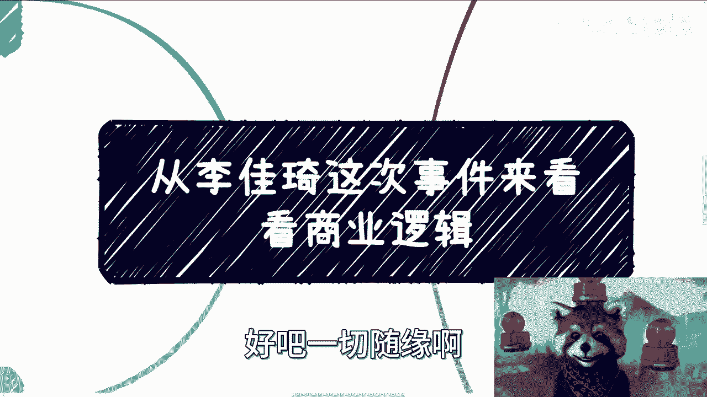

# 课程名称：从李佳琦事件看商业逻辑 - P1

## 概述
在本节课中，我们将通过分析一个具体事件，探讨其背后蕴含的商业逻辑。我们将聚焦于几个核心概念，包括商业的“骑虎难下”特性、赚钱的“性价比”悖论以及“分布式商业”模型。课程旨在帮助初学者理解商业运作的基本规律和个人在商业生态中的定位。

---

## 事件背景与核心观点

首先需要明确，我们并非评价事件本身，而是探讨其背后的商业逻辑。

事件源于一次直播。主播在直播中表达了疲惫与厌倦的情绪，并提及了与收入相关的内容。从表情和表述分析，这些言论是其真实感受的反映。

主播提到每天工作很累、感到头疼。这些表述表明，他可能真的不愿意继续当前的工作模式，并且从财务角度看，他的收入已经足够。

---

## 商业的“骑虎难下”特性

上一节我们简述了事件背景，本节中我们来看看商业运作中的一个常见困境。

很多时候，商业行为会陷入“骑虎难下”的境地。个人背后连接的商业体系通常非常复杂。主播作为个体，其专业领域可能在于直播销售，对于更宏观的商业运作未必完全清楚。这会导致他需要花费大量精力去了解不熟悉的领域，因为不了解就容易产生风险。

在商业层面，很多事情并非想停止就能立刻停止的。这是一个复杂的系统决策过程。

---

## “赚钱性价比”的人性悖论

理解了商业的惯性，我们再来探讨一个关于动机的核心问题：赚钱的“性价比”。

赚钱的性价比永远没有上限。人们普遍认为赚钱不会累，但实际情况是，达到一定收入水平后，厌倦感会随之而来。

**核心逻辑**：当劳动报酬的“性价比”达到一个阈值后，继续工作带来的边际满足感会急剧下降。你会觉得没有提升，觉得累，情绪不好。这不是膨胀，而是人性使然。

**举例说明**：
例如，有人提供单日税后20K的咨询报酬。但在沟通具体需求时，冗长的讨论会引发不耐烦的情绪。产生不耐烦的情绪是人性，但因此向对方发泄情绪则是膨胀。需要区分这两者。

以下是处理此类情绪的几个要点：
*   **选择多样性**：对方的选择很多，并非非你不可。
*   **感恩心态**：对方支付报酬，本质上是一种合作，应心存感谢。
*   **就事论事**：个人情绪是个人问题，不应迁怒于合作方。要理解对方可能也只是执行者。

---

## “分布式商业”模型与价值分配

讨论了个人在商业中的感受后，我们将视角拉高，看看整个商业生态的价值创造与分配。

在商业领域，有一个概念叫做“分布式商业”。它描述了商业的真正组成。

**分布式商业的核心组成部分**：
1.  **资本方**
2.  **创始团队**
3.  **用户/劳动者/执行层**

任何商业（To B, To G, To C）都包含既得利益者（资本）、劳动者和执行层。传统商业中，劳动者和执行层往往处于被剥削的位置。

**分布式商业的理想模型**是让劳动者和执行者同时成为受益者。以B站为例：
*   **资本方**：必要。
*   **创始团队与员工**：必要。
*   **UP主与用户**：同样必要。没有用户，平台就没有价值。

**公式**：`产品价值 ∝ 用户认可度`。网红因用户追捧而成名，产品因用户使用而存在。

当前商业逻辑的问题在于，受益主要集中于资本方和创始团队，而用户和广大内容创作者（如UP主）的受益与他们的劳动贡献往往不成正比。用户支付了溢价，但其中大部分流向了股东等既得利益者。

---

## 商业成功的关键：认清“衣食父母”

基于前面的模型，我们可以得出一个关键结论。

本次事件中最被诟病的点，并非主播喊累，而是他没有认清谁是自己的“衣食父母”，没有理解商业运转的真正核心。

**核心要点**：
1.  **成功的核心要素**：个人努力只占很小一部分（可能低于20%）。真正的核心是**用户的喜爱**和**时代的风口**。努力没有门槛，辛苦是普遍的。
2.  **利益对等原则**：不能只抱怨自己的辛苦，而忽视自己获得的远高于普通人的报酬。心里需要有清晰的认知。
3.  **个人角色的可替代性**：以直播电商为例，很多老板曾寻求购买“数字人”或虚拟形象。这是因为他们担心用户只认人不认公司。这反过来说明，主播的话术、形象本身门槛不高，更像一个销售工具，理论上可以被标准化内容或虚拟形象替代。主播并不深度参与产业链、供应链、物流或品控。

因此，无论赚多少钱，达到什么地位，都必须清楚自己的斤两，明白市场和老百姓的现状。否则就容易“飘”，或者放大了本性中不好的一面。

---

## 根本立场：与老百姓站在一起

最后，也是最重要的，是一个根本立场问题。

无论如何，我们必须明白“敌人”或“对立面”是谁。但无论如何，这个对立面终究不能是老百姓。

**核心原则**：
*   **如果赚老百姓的钱**：必须提供**足够等值的价值**，不能让他们支付了金钱却所得甚少。
*   **如果不直接赚老百姓的钱**（如To G、To B）：在赚钱的同时，应思考如何为老百姓创造更多的**就业机会**或**商业机会**。

老百姓内部分层，有做得好和做得不好的，但大家始终是一个队伍里的。内部互相举报、抹黑没有意义。不明白这一点，就是没有格局，没有认清自己的根本身份。

许多人成功后，容易脱离群众、脱离地气，忘记了自己是谁。无论个人成就多高，都需要记住：我们源于老百姓，也服务于老百姓。

---

## 总结
本节课我们一起学习了从具体事件中剖析商业逻辑的方法。
我们探讨了商业运行的“骑虎难下”特性，分析了“赚钱性价比”背后的人性悖论，介绍了“分布式商业”的理想模型与现实落差，并最终强调了认清“衣食父母”和坚持与老百姓站在一起的根本立场。
商业的成功离不开用户和时代的加持，保持清醒的自我认知和正确的价值立场至关重要。

