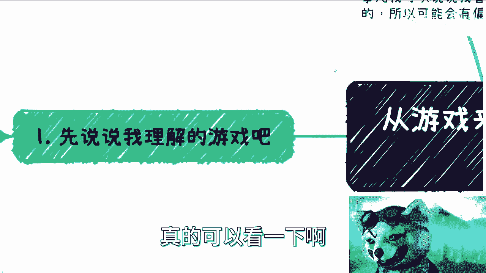
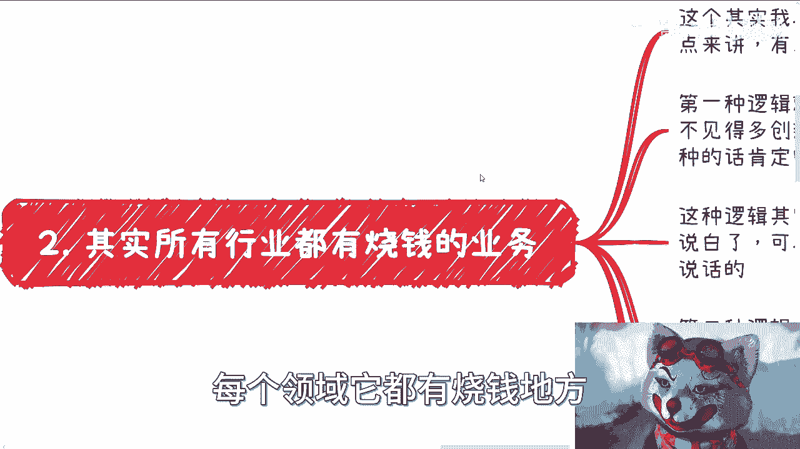
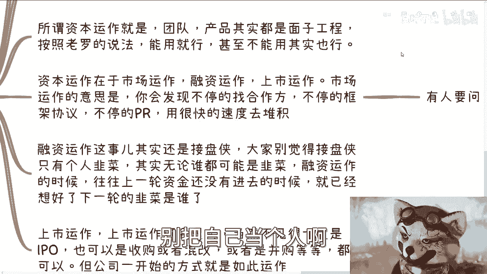

# 从游戏来说说资本运作吧，大家可以看看信息差 - P1 - 赏味不足 - BV1bw411t7TN

大家好啊，今天礼拜奖励礼拜三呃。

首先是这样子的啊，昨天那个小伙伴啊提了一个事儿啊，他说意思是游戏行业，问我怎么看呃，因为很难一单一单去做，同时呢用户的需求也多变啊，那么他原话的意思是说，这个用户的这个需求可能一直在变。

然后游戏本身因为是一个很庞大的东西，所以他可能跟不上变化，然后就会导致就是说啊这个成功率比较低啊，我理解是这么意思啊，成功率比较低啊，还很烧钱，这事呢我可以说说我的看法。

但是呢由于我的确不是游戏行业的啊，所以就是说在游戏部分可能会比较偏颇啊。

但是但是呢就是说在剩下的资本部分，是我觉得大家可以看一下啊，呃首先是这样子的，本期呢这个内容呢会比，我个人觉得还是比较硬核的啊。

你们可以看一下，真的可以看一下啊。

首先呢先说说我理解的游戏啊，游戏是首先烧钱是必然的，他就算不烧呢，也会变得烧，为什么呢，因为这个是一个行业所导致的啊，成本相对会很高，并且呃毕竟其开发成本本来就比同类型的，比如说这个应用啊。

或者说这些叫什么这个网站啊，什么东西来的来的来的来的更高啊，这很正常。

那么这第一个第二个呢，就是说你说有没有一单一单的呢，这个要看开发者或整个团队是怎么定位。

这个游戏的，因为游戏概念很大，你比如说今天米哈游做的对吧，是游戏，那之前1024这种就是很小的这种手游，也是游戏，包括比如说今天你做一个远程的电子抓，娃娃机啊，其实也算游戏。

那游戏这玩意呢，其实本质上还是要看你的业务流程，通俗点来讲，就是说呃你到底走的是长线的融资逻辑，还是说去走那种短平快的啊，就是就是这种一单一单的逻辑，因为短平快的逻辑是什么呢，就是你那咱就说不好听点。

有很多人他其实是拿着开源项目来改的对吧，你拿一个开源项目来改，他的目标是什么，他的目标就是要去找那些榜一大哥，榜二大哥，榜十大哥对吧，就找这么若干个大哥喜欢这种游戏的，给他充钱啊。

就是说假设今天这个游戏啊，它的用户量是100万，那10万也行啊，那么真正给这个游戏赚钱的或者充值的，其实你会发现，可能每个月就那么二三十个人或者50个人，但是养活这个游戏也够了。

有的这种不少的啊，好那么第二点啊。

我们关注点回到那个烧钱上面呃，首先烧钱这个东西，因为昨天那个小伙伴在原话中也提到了，他说游戏行业跟别的行业可能会有些背道而驰，呃本质上没有背道而驰，而是说所有的东西都是一样的。

只不过由于游戏这个东西的这个叫什么，它的特殊性啊，导致可能大家会觉得他在烧钱，但其实本质上每一行每一业啊，每个领域都有烧钱的地方。

只不过就是说呃不一定大众碰得到，那么这个呢其实我之前跟大家科普过。

因为这个东西是做商业的一些通用逻辑，我们做商业通俗来讲有三种逻辑啊。

第一种逻辑叫什么叫做我要做个产品，做个服务啊，这也是现在非常多的这种呃，刚刚PUA出来啊，这个比如说刚毕业，甚至还没毕业的小伙伴，想所谓的说我想去创业啊，那么他们的想法就是说我想做个产品，做个服务啊。

那当然不见得多么创新，而是在市场上分一杯羹好就好了，这种的话呢是需要前期的投入的，而且投入可能会很大啊，当然我们这边先不管谁投入啊，你可以自己投入，你也可以找别人投入啊。

这无所谓啊，那么这种逻辑呢其实走的是产品跟用户的增量，市场的占有，说白了可以走虚实结合的路线，但最终是用产品来说话的，而这种也是当下我最最不建议的，为什么，因为你要做成一个产品，要天时地利人和。

当下的整个中国的土壤是天时地利人和，一个都没有啊，而且大部分就像我说的，大部分的学生，他对商业一无所知啊，他就算是博士出来，硕士出来，他也是一无所知，你就说啊，我对一个一无所知的东西，我就想去创业了。

那我就我我如果你能成功，那我反过来就在说，那的这个读书真的就是白白读了，你读书这么多年，十多年还不如你一朝创业，可能未来对不对，你即将他可能问了没这个概率的啊，不要用那个扯那个幸存者偏差来说服自己啊。

第二种逻辑叫什么，叫做资源整合，也就是字面意思，也就是说你可以不用投入资金，你也不用有自己的团队，你可以通过资源互换的方式经营赚钱，这也是当下就最多的一种模式，为什么，因为它成本低啊，试错快啊。

呃而且找钱当下很难，无论国内国外都很难，你们自己去了解一下，就知道很难，这种模式呢一般呢它有两种方式，一种如果你是个人的话，往往会就是呃就不遮掩了，就告诉大家，我就是个资源池，为什么呢。

因为你要做个人品牌，你要做自媒体，你要把你的个人的整个的影响力打出去，那么你必须是个资源池，要否则的话你怎么打出去，打不出去的啊，你不需要做太多的信息隔离啊，但是如果你是个企业，我跟你讲，那就不一样了。

你企业打出去名头打得越大，你需要站得住，立得稳对吧，但是你如果只是做资源的话，那么你一定要把双方的信息隔离好，也就是说你今天做大客户，B端或者大客户政府端，你说你是乙方对吧。

但其实你是把真正的这个乙方的东西，是外包出去的，那当然虽然政府跟你的甲方，也许是不会很关心这件事情，但是你但凡不做好信息隔离，那么一旦信息有透风，那么你依然会很尴尬对吧。

那么这也是那个个人跟企业的这个差别性，那么有人就要说了，那那一个人不尴尬吗，个人没什么尴尬的，为什么，因为你个人就是灵活的，你就告诉别人，我就是拉皮条，而我的皮条资源很牛逼，对不对，有什么问题呢。

没有问题的，但是你今天作为一家企业跑出去，我的，老子就是拉皮条的，你想想看怎么弄对吧好，那么我们重点就来说第三种模式，第三种模式在商业当中，我们称之为叫资本运作。

所谓资本运作什么意思啊，就是说烧钱这件事情呢，只不过是你们看到的表象对吧，也就是说烧钱我就问啊，那么这些钱的主人是吗，资本是吗，一定不是吧，对吧哦，你说我今天烧个钱，这个项目烧30个亿啊。

你他是有钱割得慌吗，肯定不是啊，那么问题来了，他为什么要去烧呢，对吧哈，那么所谓资本运作也就是说什么意思啊，其实都是附属品，或者说当然这个时候你也会发现一个问题，团队跟产品也许自己不觉得自己是附属品。

但是不好意思，你们就是附属品，不管你们怎么样，因为你们不重要啊，who care啊，别把自己当个人啊。

按照老罗的说法，就是能用就行，而且我跟你们讲，在很多资本运作当中，甚至甚至是他妈不能用也行啊，那么资本运作呢在在于三种方式，一种是市场运作，第二种叫融资运作，第三种叫上市运作，那么市场运作的意思呢。

就是说你会发现不停的找合作方，不停的去框架协议，不停的去P2对吧，也就是说你会发现有些企业它你要具体问他，你有什么业务啊，哎说不清楚的，你有什么产品吗，哎也说不清楚的，但是呢你会发现他有巨多的合作方啊。

你他有巨多的这种合作框架协议，它有各种各样的，比如说每个月这里嘛跟什么什么国企，央企业签个什么协议，那边嘛干嘛就不停的PR对吧，用最快速的速度去积累这些东西，这个叫做什么叫市场运作，那么有人要问啊。

做这个事怎么赚钱呢，啊不着急，咱们后面会说的啊，第二融资运作啊，融资运作这个地方呢，顾名思义，简单意思就是说找接盘侠啊，你们别觉得接盘侠只是个人韭菜，其实无论是谁都有可能是韭菜，包括企业，包括资本。

包括所谓的大佬，对啊就说白了因为一山更有一山高嘛，呃呃为什么你想想看，为什么有人会做接盘侠是甘愿吗，那肯定不是因为什么，因为信息差，因为其地位比别人低，因为其慕强的这种心理，所以他会做键盘侠啊。

那么融资运作的时候呢，往往我可以跟你们讲啊，往往上一轮资金他妈还没进去，就他妈已经想好了，下一轮的韭菜是谁啊，这很正常，真的这很正常啊，那么第三种就是上市运作，上市运作顾名思义呢。

就是说是以股份变现的这种方式，当然不见得一定是IPO，都可以，但是呢这个当中有一个点是什么，就是在这家公司刚开始的时候，你可能就是资本家，我不知道创始人是不是这么想的啊。

但资本家可能一开始就已经做好了局，就说这家公司原本的目标就是被收购，而不是说什么做到多少用户啊，做了多少盈利啊，滚，你知道吧，那么顺便在这地方提一嘴啊，有人说，那你不盈利，你这账怎么做，我这么说吧。

做账啊，有一他妈的不知道多少种方法可以做账啊，这不重要啊，这不重要啊，好那么我们最后来说说怎么赚钱对吧，先说市场运作啊，这很简单，你有了虚名，你可以做很多的事情，企业也是一样的。

你们会看到很多那种企业啊，包括产业园对吧，墙上有非常多的合作方对吧，然后很多荣誉啊，很多什么软著对吧，包括什么什么什么什么文戏啊，那个叫什么叫什么学术paper，对吧啊，我跟你讲这种怎么赚钱。

这种最适合的就是去拿政府补补贴啊，就是它更像一种就是针对政府，针对这个框架所练的一身内功，那么说白了他就是走国家给的饭啊，掐我就要给的饭啊，那么第二种叫上述运作，上述运作呢最简单啊叫做什么呢。

就是股份股份分配好，合同签好啊，大家看看怎么拿或者什么时候退出啊，还是说走股份额就依然是走股份套现的模式，只不过他不一定要等到IPO啊，这些比较简单啊，那么第三种就是融资运作。

融资运作呢这其实是从小钱来讲的，呃呸就是呃从小学来讲呢，比如说像融资过程当中的FA，就是FA指的是融资的这个渠道费，那么FA一般来讲我们就是根据融资额的不同，差不多会在0。5%到3%不等。

那么当然1%也有可能啊，比如说你融了融了十个亿对吧，那么FV也能赚啊，但是呢这些都是需算小钱啊，但是从融资本身来讲呢，剩下的比如说从下一轮去退出啊，或者下下轮去退出啊对吧，就是A轮想的就是BC要退出。

天使想的就是说AB要退出对，就这么简单一件事，那当然就是说具体case具体去讨论，就是到底是哪一轮退出，到时候再说，而且往往退出之前，就像我们说很多企业做IPO，招股书还要去做润色或者做包装。

那你退出之前可能还要通过一些pr，通过一些别的东西，吸引更多的东西来拉整个的估值，他才会去退出对吧，那这些都是所谓的商业运作啊，都是所谓的商业运作那么好，那么再回到这个游戏上来啊。

昨天小伙伴在这当中还提到一个点，叫什么叫做用户需求会一直变，游戏也好，其他东西也好，其实很难去掉头或者跟着去变化对吧，那这个也是很多人，他可能觉得哎呀他妈的我看不懂啊，为什么他妈的要烧钱。

然后这玩意又好像这个很难去贴合用户对吧，所以已经说到现在，我相信你们聪明的小伙伴啊，应该已经明白了，就是你们所正因为会说这些话，是因为你们从用户的角度去看，的确如此啊，没有毛病。

但是你会发现如果从资本的角度去看，你觉得用户重要吗，啊我跟你讲狗都不如啊，是人吗，不是人啊，是不是人不重要啊，who care啊，对不对啊，狗都不如啊，你以为你以为榜一大哥，榜一大哥啊。

你以为大家这个用户赚多少钱很重要吗，不重要，而真正赚钱的永远不会在这上面啊，看中这个东西的，我跟你讲，那就算了，唉格局就这么大了，你懂吗，所以啊所以啊我们在这个地方我总结一下。

就是说你们一定要明白很多事情啊，表面去看没有用的，往往很多很多东西都是醉翁之意不在酒的啊，真的就这样，醉翁之意不在酒的啊，你看似比如就像我们随便打个比方，你看似今天有一个人对吧，就像我们上周举例子啊。

比如说看似一个人是来做开发的对吧，他说哦我开发能力怎么样怎么样，我开始秀肌肉啊，开始怎么样怎么样，其实他的野心诶可能是老板娘对吧，可能是当老板啊，把老板踢出局对吧，这谁知道呢啊。

对吧，所以说呢就是说很多事情呢，嗯做直他可能会花很多钱，但是呢他会从不是这个值的，这个局里面去捞到更多的钱，他才会去花，还是那句话啊，就是说你们一定要想明白一点，不是一个资本家我能明白的东西。

真正的资本家一定明白资本家什么概念，不会去做亏钱，绝对不会做亏钱的生意的啊，绝逼不可能好药，可能也是因为他们贪心啊，他们要去赌，你知道吗，但凡他理智的去做一件事情，我跟你讲，绝逼不可能亏，因为亏不亏。

说不好，今年在很多时候，你但凡有点经验，一开始就能看得出来啊，或者说这么说吧，退1万步来说，这个项目就算亏死了，他妈的创始人进去坐牢了啊，背了几千万债，他妈投资人都不会亏，你懂吗啊，哎呀行吧。

那就这么着吧，啊嗯好吧，大家反正有什么商业的啊，或者有什么这个职业规划的啊，或者有其他的，反正你们就是想到的啊，觉得就是整理好问题，可以想跟我聊聊的，那么你们就整理好。

