# 课程一：从游戏行业看资本运作与信息差 💰🎮

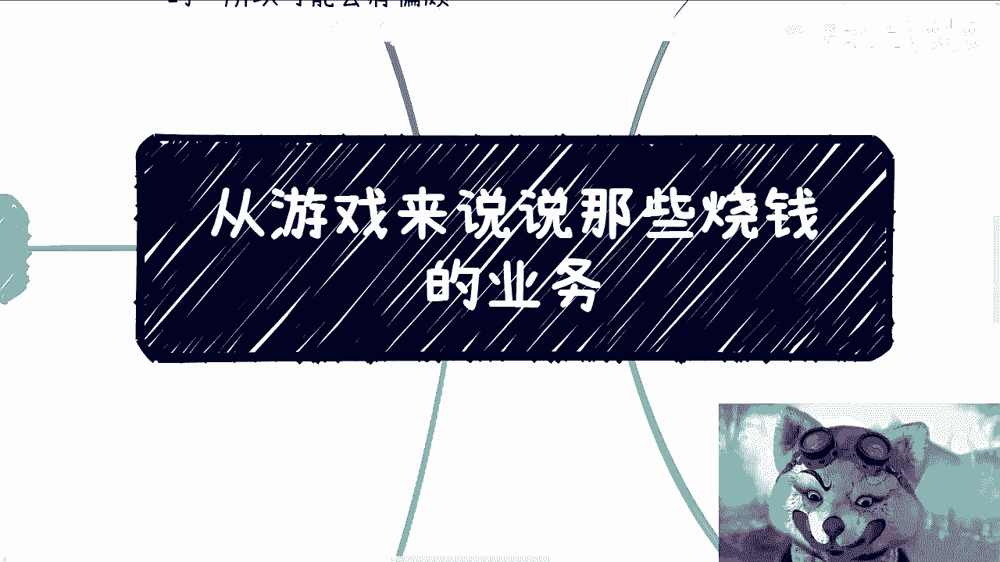

在本节课中，我们将以游戏行业为例，探讨商业运作的三种核心逻辑，并重点解析资本运作的本质。我们将理解为何某些看似“烧钱”或“不贴合用户”的商业行为背后，往往隐藏着更深层的资本逻辑。

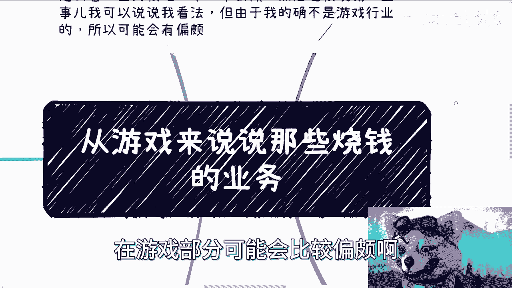

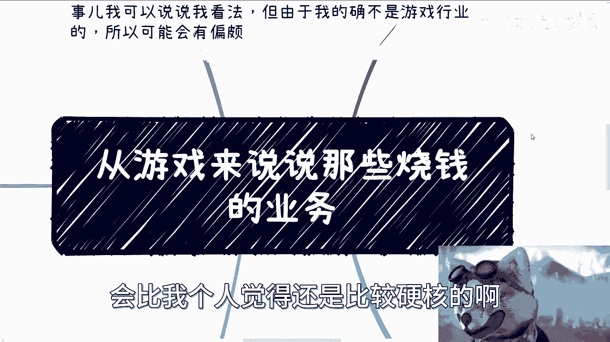

---

## 游戏行业的固有特点

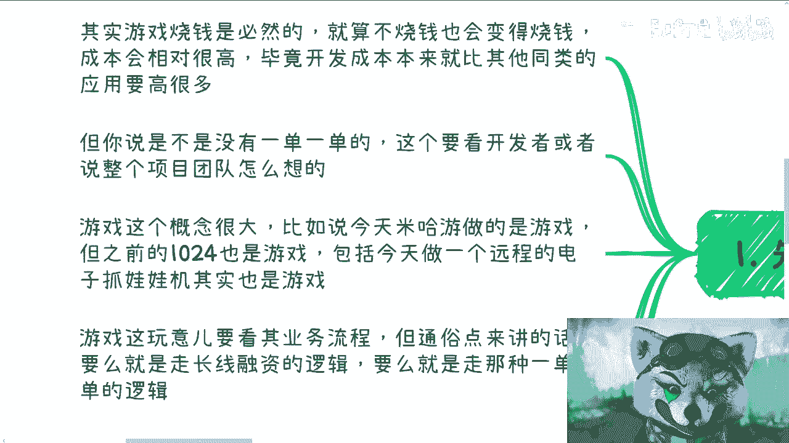

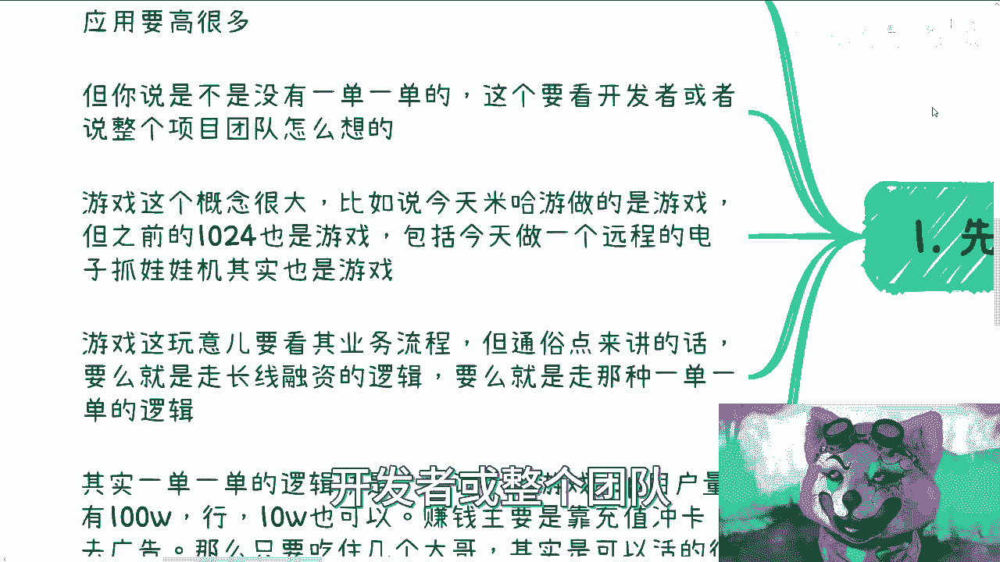

上一节我们介绍了课程主题，本节中我们来看看游戏行业本身的特点。

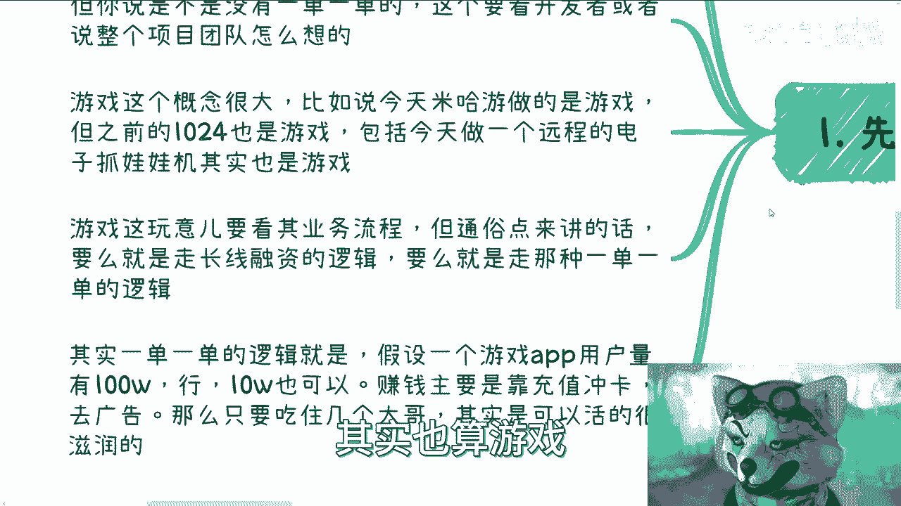

游戏开发成本必然很高。其开发成本通常比同类型的应用或网站更高。

游戏能否“一单一单”地做，取决于开发者或团队的定位。游戏的概念很广，从米哈游的大型作品到小型手游（如1024），甚至远程电子抓娃娃机，都属于游戏范畴。

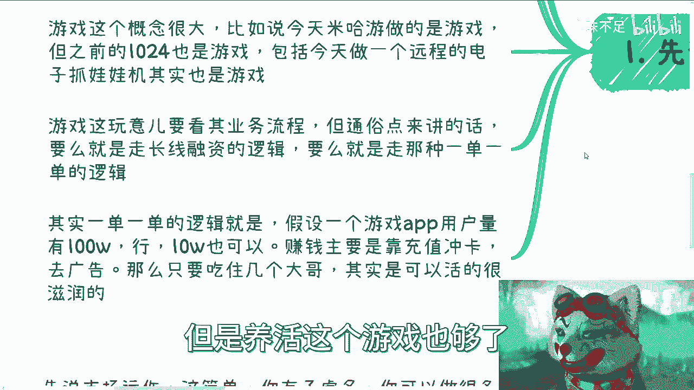

本质上，游戏业务要看其选择的商业模式。以下是两种主要路径：

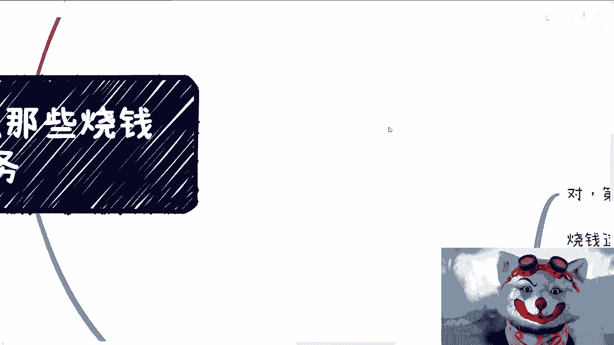

*   **长线融资逻辑**：追求大规模、长期的市场占有和资本故事。
*   **短平快逻辑**：追求快速变现。例如，有些团队基于开源项目修改，目标明确是服务少数高付费用户（如“榜一大哥”）。即使总用户量有100万，可能仅靠几十个核心付费用户就能养活整个项目。

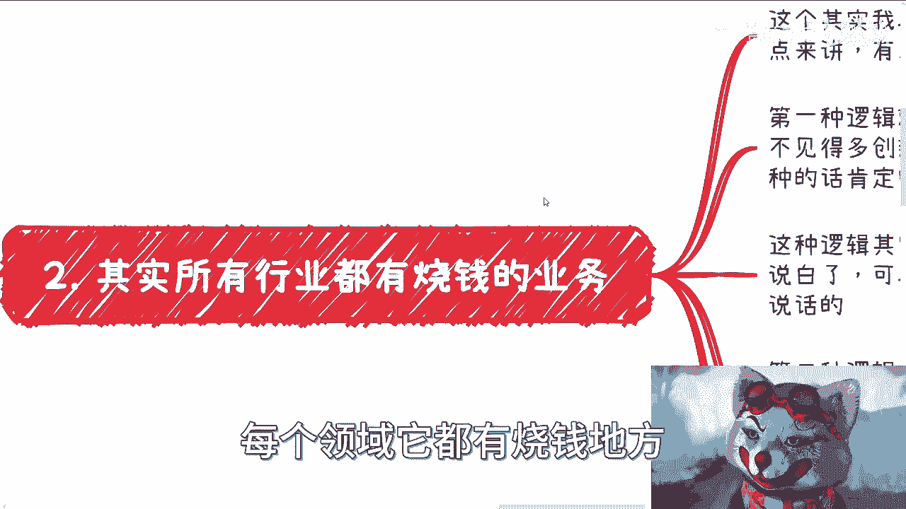

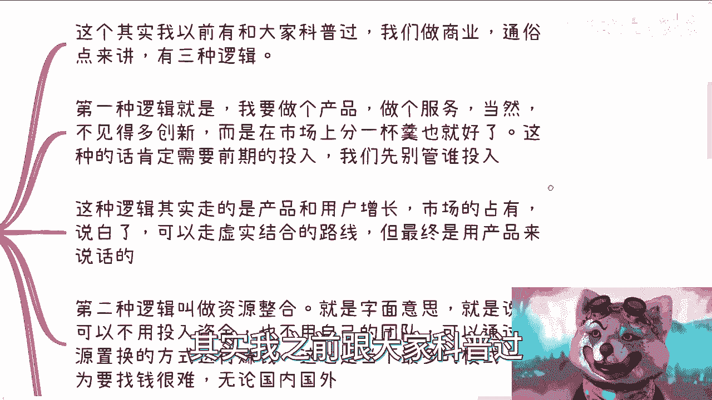

---

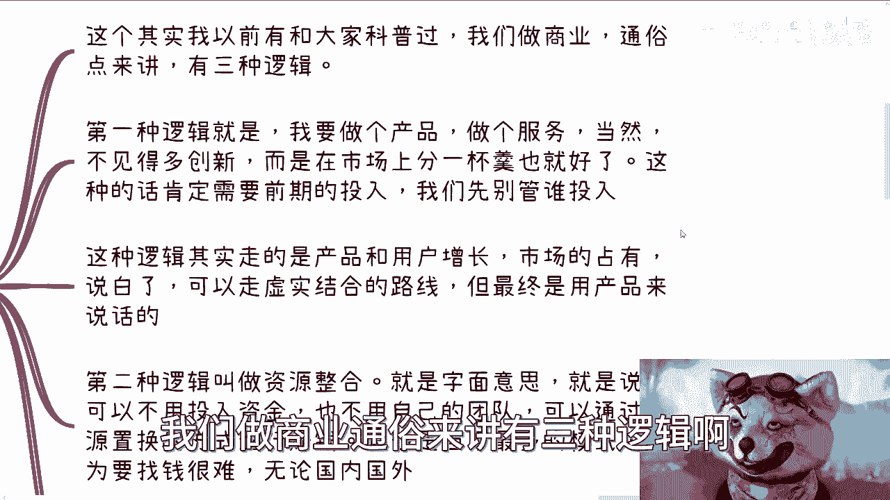

## 商业运作的三种通用逻辑

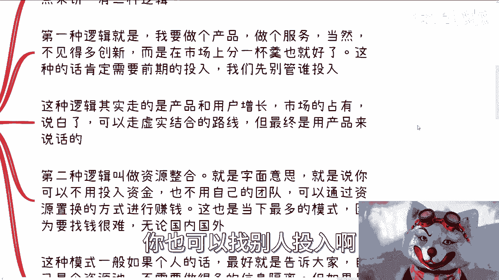

上一节我们讨论了游戏行业的特性，本节中我们来看看所有商业领域共通的三种运作逻辑。

烧钱并非游戏行业独有。每一行每一业都有需要投入大量资金的地方，只是大众不一定接触到。

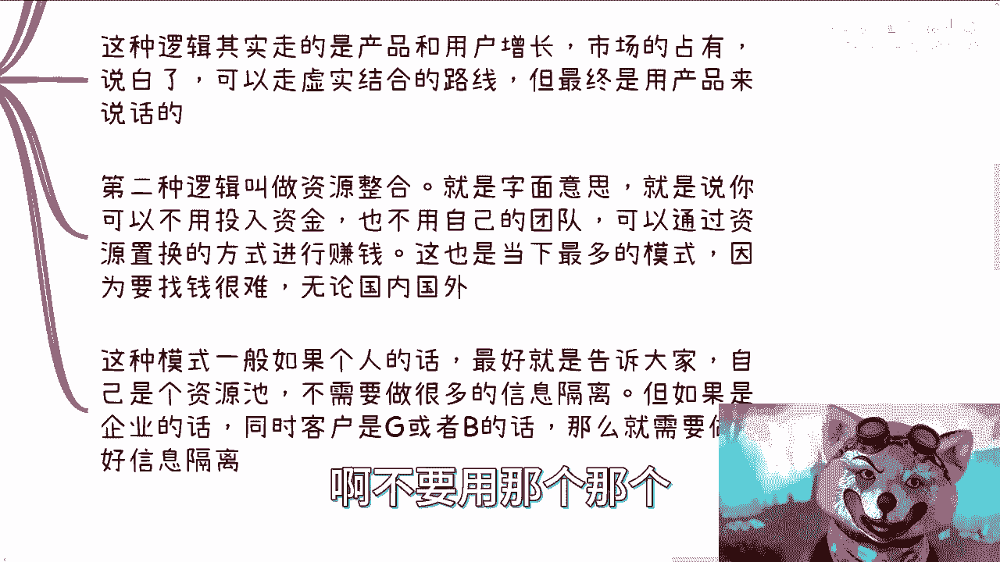

商业运作通常有三种通用逻辑。

### 1. 产品/服务逻辑

这种逻辑的核心是创造产品或服务，通过市场增量盈利。其公式可以简化为：
**利润 = (用户数量 × 客单价) - (产品研发成本 + 运营成本)**

这是许多刚毕业或想创业的年轻人的常见思路。它需要巨大的前期投入，并且成功需要天时、地利、人和。在当前环境下，这是最不建议初学者尝试的模式，因为对商业缺乏认知的创业者失败率极高。不应以“幸存者偏差”来说服自己。

### 2. 资源整合逻辑

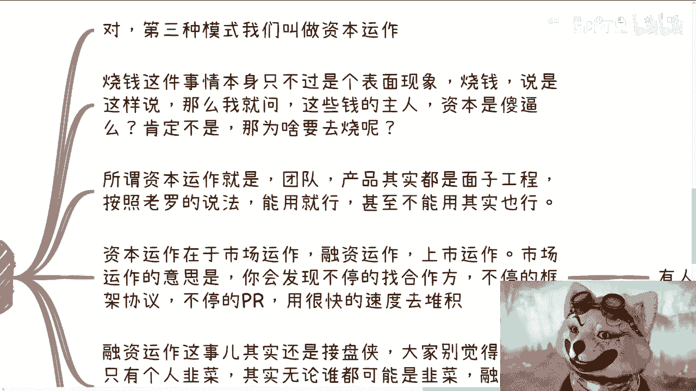

这种逻辑的核心是通过连接资源方来盈利，自身可能不投入资金或拥有团队。其模式可以描述为：
**利润 = 资源A的价值 + 资源B的价值 - 信息对接成本**

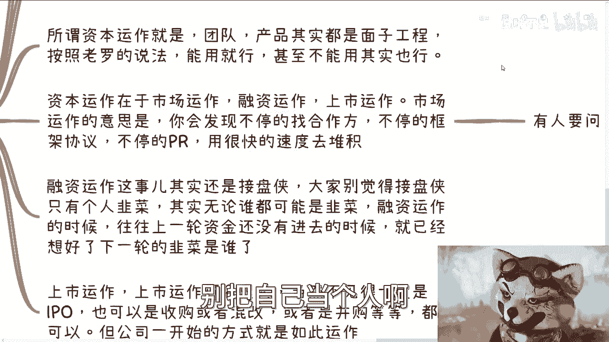

这是当下最普遍的模式，因为成本低、试错快。个人和企业在此模式下的策略不同：
*   **个人**：通常需要打造个人品牌，公开作为“资源池”，以建立影响力。
*   **企业**：则需要做好“信息隔离”，即作为中间方时，要防止合作双方直接接触，以维持自身的价值。

### 3. 资本运作逻辑

上一节我们介绍了产品和资源两种逻辑，本节中我们重点剖析最核心的资本运作逻辑。

所谓资本运作，烧钱只是表象。资本绝不会做亏本的生意。其核心在于，项目、团队甚至产品本身，在资本眼中可能都只是实现更高层目标的“附属品”。

资本运作主要有三种方式：

以下是资本运作的三种具体形式：

*   **市场运作**：核心是快速积累虚名和合作背书。例如，企业不断与国企、央企签订框架协议，进行大量公关宣传。其目的往往不是为了直接的产品盈利，而是为了获取政府补贴、政策支持等“国家给的饭”。
*   **融资运作**：核心是寻找“接盘侠”，利用信息差获利。在资本游戏中，上一轮的投资方可能早已想好下一轮的退出对象。融资过程中的渠道费（FA）只是小钱，真正的利润来自股权在后续轮次中的增值退出。
*   **上市/并购运作**：核心目标是股权变现，不一定是独立IPO。有些公司从创立之初，目标就是被收购。盈利与否并非首要考量，因为“做账”的方法有很多。关键在于设计好股权结构和退出机制。

---

## 回到游戏：为何用户需求似乎不重要？

上一节我们拆解了资本运作的手法，现在让我们回到最初的游戏行业问题。

从用户或开发者角度看，紧跟多变的需求确实困难且成本高昂。但从资本运作的角度看，用户本身可能并不重要。

资本关注的是**估值、退出渠道、政策红利和资源置换**。游戏是否赚钱、用户是否满意，在资本的全局棋盘上可能只是无关紧要的一枚棋子。真正赚钱的环节，往往不在产品本身的流水里。

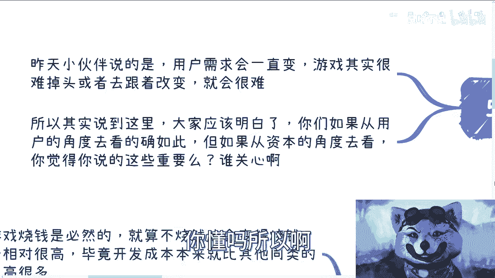

很多事情都是“醉翁之意不在酒”。看似在做一个产品（比如游戏），真正的野心可能在资本市场、资源整合或政策套利。资本家绝不会做亏本生意，即使项目失败、创始人背负债务，背后的投资人往往也有办法确保自身不亏。

---

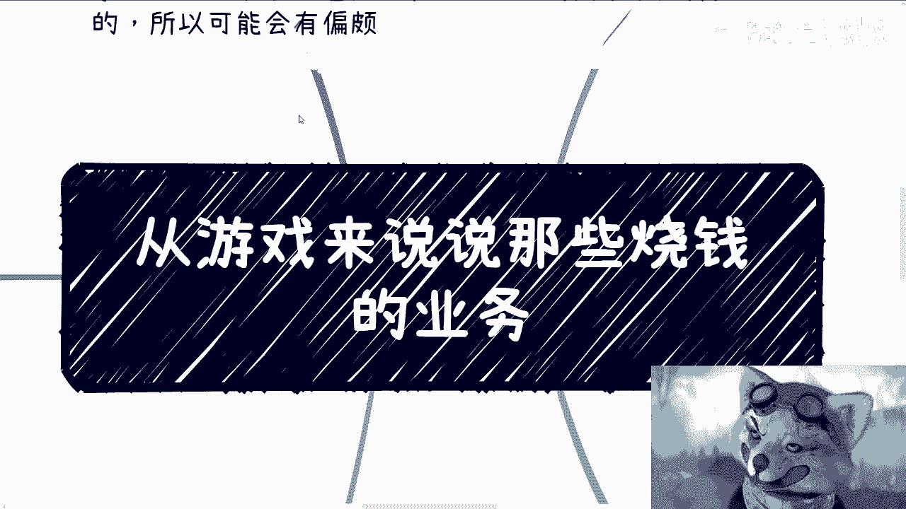

## 总结与回顾

本节课中我们一起学习了商业运作的三种核心逻辑，并重点剖析了资本运作的本质。

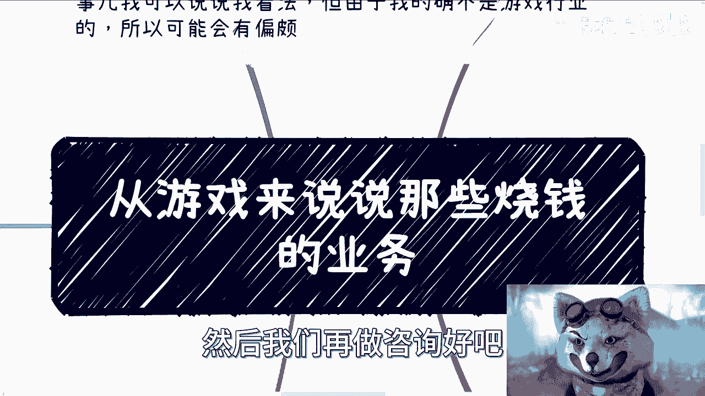

我们了解到：
1.  游戏行业高成本、需求多变是常态，其商业模式选择决定了发展路径。
2.  商业运作分为**产品逻辑**、**资源整合逻辑**和**资本运作逻辑**。
3.  **资本运作**是最高维的打法，其核心是利用信息差和资源杠杆，通过市场运作、融资运作和上市运作来实现资本增值。在这种逻辑下，产品本身和用户需求可能并非首要考量。
4.  许多看似不合理的“烧钱”行为，背后都有其资本层面的算计和退出路径。理解这一点，有助于我们穿透表象，看清商业世界的真实运行规则。