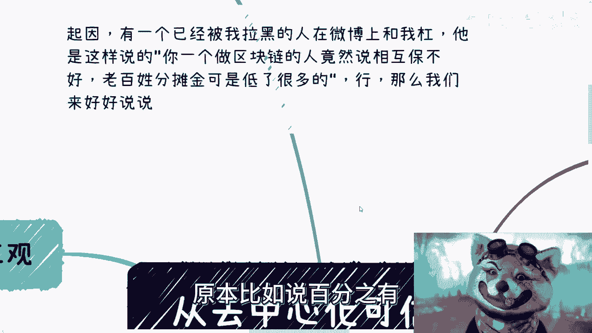
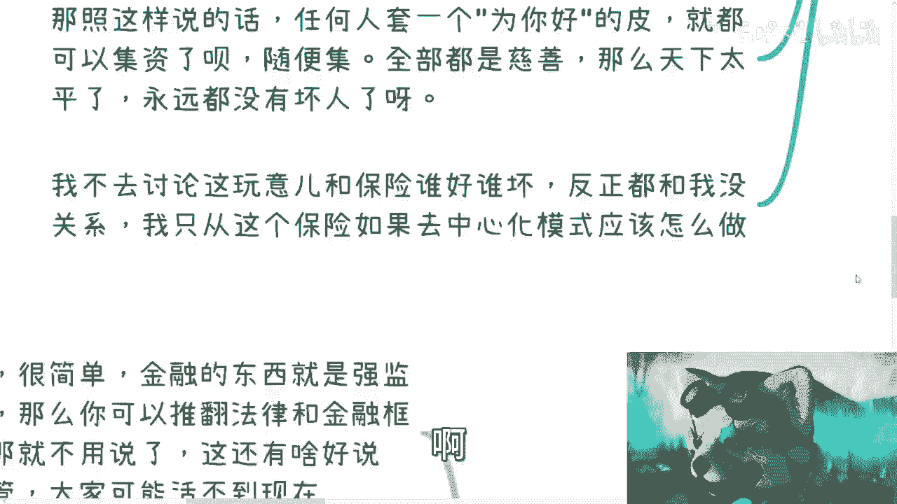
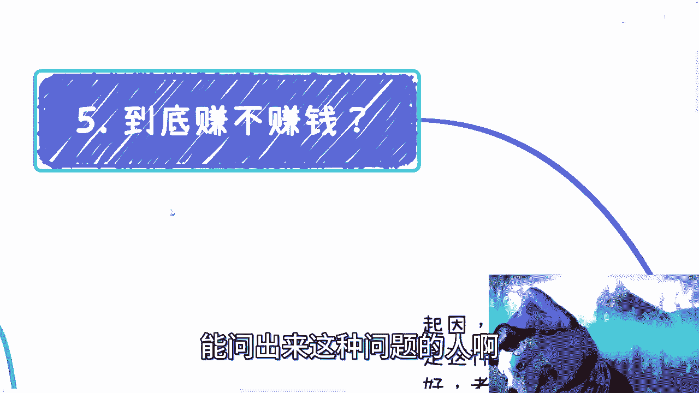

# 从网友说我应该支持相互保，被我拉黑说起 - P1 - 赏味不足 - BV1kh4y1E7hc

好啊大家好啊对吧，特别有趣啊。

哎呀前两天呢是这样子的啊，有一个人已经被我拉黑了啊，他在微博上是这么跟我杠的啊，他说什么啊，他说啊我呢转发了一下相互宝的一个事儿啊，然后就说了一下啊，就是怎么样怎么样一个观点啊，他是这样说的。

他说你一个做区块链的人，竟然说相互保不好啊，老百姓分摊金是低了很多啊，比如说20%多对吧，原本比如说百分之有其他的可能。

50%多对吧，行啊好可以啊，我我跟你们讲这个事儿，我来跟你们说一下啊。

首先先正一下三观，什么叫正下三观啊，有人说从相互保的出发点来讲是好的，甚至呢这个相互宝的这个以前的那个CEO对吧，现在说亏钱是来做生意的，亏了50个亿对吧，我也大概看过了啊，你就我就这么问啊。

你们谁来跟我讲，做到现在哪个大的企业，哪个资本家是他妈的，从开始做生意，有做过亏本买卖的，有没有啊，你们举个出来有没有啊，然后哪个产品的出发点，而且另外一方面我就跟你们讲，哪个产品的出发点不是好的。

哪个产品的这个饼画的不是好的，你不是好的，谁来谁来参加对吧，人家水滴时候还他妈的说公益呢，然后呢，然后呢我就问你，你一个公益的东西怎么上市的啊，怎么IPO的，你再来跟我说说看对吧啊，另外按照这个说法。

那我就问啊啊我就问啊，我先说我先做坏事，我他妈做了10年的害伤天害理的事，然后我开始做慈善，怎么了呢，啊从那一刻开始，我就是个大善人啊，以前的事一笔勾销是吧啊，就我觉得现在带二极管真的是越来越多啊对吧。

这个读书读大学，读到大学不知道读些什么东西啊，再来说区块链怎么了呢，相互保就他妈的公平了啊，你一个中心化公司做的产品，你跟我说公平，你跟我说我一个做区块链的人，就必须去支持相互保，那莫名其妙嘛对吧。

那你就跟我说，大家打工是一样的，让不让你滚对吧，给不给保，这还不是中心化公司，公司说了算吗，啊我就问你，你今天去找他们，客服说哎不能能不能保，他说如果不能保，你跟他在那边比比，还是你找马云比比。

有公平不了，你跟我谈公平啊，你跟我谈公平，你跟我谈公平，他妈的，现在大家就不是就不会再去讨论什么，失不失业对吧，也不是讨论什么职业规划，有什么好讨论讨论的了对了，大家大富翁直接人均富卡嘛，好了呀。

然后你跟我谈公平，真的搞笑也是搞笑的啊，那按照这么个话说的话，任何人套一个为你好的皮就都能集资了呗，对不对，因为在我看来这就是集资啊，没有任何区别呀，随便挤，反正都是慈善，那天下太太平了呀，对不对。

大家均富有的啦，真的吗，真的，我真的觉得他妈绝对是觉得，妈的书不知道读到什么地方去了啊啊我先说啊，这次这个视频我不来讨论相互保这个东西，我也的确对保险这个东西，没有这么深入的了解啊，所以我不去讨论。

这玩意儿跟保险到底谁好谁坏啊，反正在我这里跟我都没关系啊，我只是先从这么一个事情啊。

影子来说一下啊，就是如果说要去做整个可信任的。

应该怎么个做法对吧，首先先说公平啊，你要跟我真的说公平对吧，可以啊，那么老百姓进食既是付钱方，也是受益方对吧，什么意思呢，也就是说，至少这个钱他不应该是给到中心化机构的，那这理想状态OK啊。

那老百姓也得管理啊对吧，老百姓也是节点，老百姓也是也是有话语权的，有的啦有吗啊，你告诉我哪个产品有的啊，是不是啊，那就就算老百姓没有话语权吧，你至少得多个中心啊，多个中心化的系统。

来来来来来进行管理吧对吧，你至少得有个多签的过程嘛对吧，所谓多签过程就是说，无论它里面有任何改变改变，比如说要薄也好，或者要改变规则也好，它不是一家说了算的，有吗，没有呀对吧，那就算啊。

现在说现在没有多中心化或者去中心化的机制，保证你单纯的一个中心化的机构，你跟我谈公平有不了啊，有什么公平啊是吧，我当然啊，我在这地方就说啊，咱不说一定要用区块链或者用什么技术，这个用什么并不重要。

我们就说从业务逻辑上来讲，你什么叫公平，就是我参与我付钱，我也得有话语权，这他妈叫公平，对吧啊好，然后再来说机制啊，你参与你均摊你受益，这个就是最最基本的机制，那么问题来了，如果真的有问题，收益不收益。

谁说了算对吧，就是说我我今天比如说我得病了对吧，我要我要我要保，那谁说了算啊，是老百姓说了算，还是大家说了算，还是说是是所有投保人说了算对吧，参与方说了算，还是你你还是中心化机构说了算对吧。

你说啊这个这个某一个查查宝对吧，出来一个规定，他一定是有海报的，有一定有明确规定的，是有啊，但是是马上赔吗，不是呀，他需要中心化去沟通啊，你需要去找客服啊对吧，他需要中心化流程啊。

但最终保不保是你说了算吗，不是呀对吧，那么应该怎么样，应该说老百姓他得参与到所有的流程当中，你多中心化的去投票表决，某一个人应应不应该保也可以啊，对不对对吧，那你至少不是中心化数要算的对吧。

或者说我们说从大数据，从比如说互联网的机制来讲，你从各方比如说医院啊对吧，各个方面医保啊对吧，各个方面各个数据上面你能能够去保证啊，或者说能够获取到这个人的确得病了，这个人不是造假的对吧。

这个人不是来骗保的对吧，那么你从各方面数据来看，是不是应该保，对不对，好那么问题又来了，我说到这个时候一定有人会在想嘛，他说那你不是扯淡嘛对吧，这个东西做不了的，你从哪去获得数据呢对吧。

所以说这才叫事实啊，你明白吗，什么叫事实啊，就是大家接地气啊，什么叫接地气啊，就是说你就算现在中心化去做，或者多中心化去做，参与方投票也好，老百姓投票也好，你要说从各方数据搜集之后。

能判断某个人能不能保，你觉得这事靠谱吗对吧，你但凡有点脑子的人，都觉得这事不靠谱啊，对不对，你要是说现在啊我们通过这个大数据对吧，通过互联网，通过各种东西哦，数据都能够搜集的到来对吧。

然后没明确的能够保证说哦，这个人好马上就能保啊，这个人不能保对吧，然后然后所有的东西都非常的透明公开了，这事就靠谱啊，但是现在是为了不可能的呀，对不对，所以说所以说本质上是什么。

本质上就是说你现在是个中心化的系统，或者去中心化的系统，你无论谁去做，都有各有利弊对吧，不是说你要是不，并不是说我今天我是做区块链的，或者我是做数字经济的，我就一定要去支持这种社会实验对吧。

或者类似的产品，有道理的，没有道理的呀，因为在我看来，不管你中心化也好，去中心化也好，都他妈的是在骗呀，有什么区别了，你要么就在打擦边球，要么就在骗，有什么区别呢，对不对，我为什么要去支持他。

就是因为你机制好啊，那照你这么按照这么一个网友对吧，按照这种这种二极管，这种这种叫什么大学生的说法，那照你这么说好了，那全全国人民都是集字幕，好了呀，啊都说都说我是社会实验，都说我是为老百姓好。

那他妈我们全部支持，可能吧啦唉对吧。

我跟你们讲核心是什么，核心是很多事情，你要么就监管，要么就全开放中间状态，要么就是因为中间状态就是耍流氓。

你懂吗啊就是说这事在我看来我跟你讲很简单，我不管他什么叉叉宝，什么乱七八糟的东西对吧，金融这个东西就是强监管的，你别去想了，你别来跟我说什么国内国外，放国外也是强监管的呀，对了。

你当时FACEBOOK发发一系列发发LIBRA的时候，那SEC为什么要去听证会了，为什么要开听证会，那照你这么说，全部开放不好了呀，对不了啊，然后如果我跟你讲，如果你不同意，可以啊。

那代表着你推翻所有法律和金融框架上的，所有监管呀，对不了，那我就不用说了，我跟你们讲，这还有什么好说的，你要我说你要推翻所有金融和法律下面的监管，那他妈大家也不可能活到现在，我就很明确告诉你，对不对。

这是第一点，第二点就是你要么就是全开放，什么意思呢，你别别我看到，因为我看到网上就不管是这个相互宝的人也好，还是还是网上很多人也好，他总归会去说，哎呀，这是为老百姓好的事情，这是一个社会实验对吧。

这是一个互联网实验，怎么样东西也好，这他妈都他妈是废话，你知道吗，这种屁话有什么好讲的呢，对吧你你别我甭管你什么实验，你要么就监管，你要么就开放对吧，你你要是大家都开放，那大家谁谁想做都去做。

每个人都是慈善家就结束了啊，别这么多BB的话，有什么好逼逼的，对不对，我跟你讲，还有一点是什么，看事情，我们要用发展经济眼光看什么意思，不能完全从结果导向，因为你要这么想。

任何一件事情都有可能往不同的方向发展，我们任何一个人都可以做慈善，但是你做的不好和做得好，你会发现有区别吗，当然有区别了对吧，你如果今天做的不好，一片骂声，你很有可能跑路，你也可能被战，对不对。

你也可能进去对吧，但是做的好的时候，我们就问啊，如果今天真的发展很好对吧，这不是50个亿，几百个亿对吧，几千个亿啊，盘子越来越大对吧，那么我就跟你讲，水下的事情里面的猫腻只会越来越多，为什么。

因为没有监管呀，对不对，但你说盘子大，我就问你盘子大了，是所有人受益吗，是不是所有人受益是吗，你自己问问看自己是吗，对吧啊，所以说我跟你讲，所有只要是中间状态的都他妈是耍流氓，因为好坏。

这个结果根本不是这个组织方和自己能控制的，对吧，人是会变的，组织方也是会变的，中心化的，所有东西都是会变的，哪个东西不会变啊对吧，中心化的组织者永远都是扑克脸，随时都是会变的，我们能控制吗。

我们作为参与方，我们作为老百姓能控制吗，不能不就这么简单吗，那这么多哪这么多就是就是就是什么，要么那我看到是这样子的，我不赞同大家对吧，就是说啊无脑的去黑，比如说相互保或者叉叉宝。

我也不赞同大家无脑的去赞同，但是你得客观的去看明白这件事情，对吧啊，然后好，那么我们来说最后的一个问题到底赚不赚钱，对吧，唉呀，我就举这个例子啊，今天啊你做了一家公司啊，比如说几万啊，几十几万用户。

而不是几万用户，十几万员工啊，几个亿的日活啊，你是老板啊，你是CEO啊，你是CEO哈，然后呢今天你们下面有个员工啊，老牛逼了啊，这个脑洞很大啊，呃跟你说我要给全宇宙做慈善啊，我要把这个地球是不不够了啊。

我得把什么各种而已，整个银河系都纳入进来啊，我要这个让外星人都知道我是最牛逼的啊，好啊，然后呢就跟你说我要做个产品啊，我想做做个什么火箭啊，我想做个产品，让让全银河系的人都懂啊，我们最牛逼啊。

好然后呢我就这么问你啊，你作为一个老板啊，如果几万的啊，几亿的日活啊，然后几万的员工，十几万的员工啊，你每个月啊发出去的钱加五险一金啊，已经是数不胜数天文数字啊，那么我就问你。

你今天P1个项目是以什么东西为主的对吧，你们自己想想看是以什么东西为主的，只会以赚钱不赚钱为主，是以慈善不慈善为主吗，不是吧啊不是吧对吧，而且另外一方面，当你们做大一个生意的时候，只要跟金融擦边。

你们作为老板，你们会不懂吗，我不相信啊，所以每个人都懂，就算不懂，他也懂得进入里面的风险，那么我就问嘛，为什么这个产品会被做出来，或者会被允许做出来，你们想看结论只有一个，对不对，还用说吗。

这有什么好说的呢，没什么好说的，结论只有一个能问出来这种问题的人啊。

唉就那样吧，是吧，所以说呢就是说很简单啊，别用那些表面的东西去定义啊，什么中心化就是不好的，去中心化就一定好的啊，这他妈叫二极管啊，也别从现在结果来说，只不过做到现在。

可能这个由于这个这个参与的人越来越多对吧，然后由于这个参保的人越来越年轻对吧，导致最后大家分摊金额越来越大对吧，让大家很不满对吧，然后呢还有什么90天，180天的等待期对吧等等等。

逼逼这些东西没什么好逼逼的，还是那句话，你要么就监管，要么就别监管就结束了，你知道吧，就这么简单啊，没什么好不好好不好，这他妈都是后话啊，核心怎么样子，那我就这么个说明核心什么样子，就跟我这个框诶。

这个框背景的颜色啊。