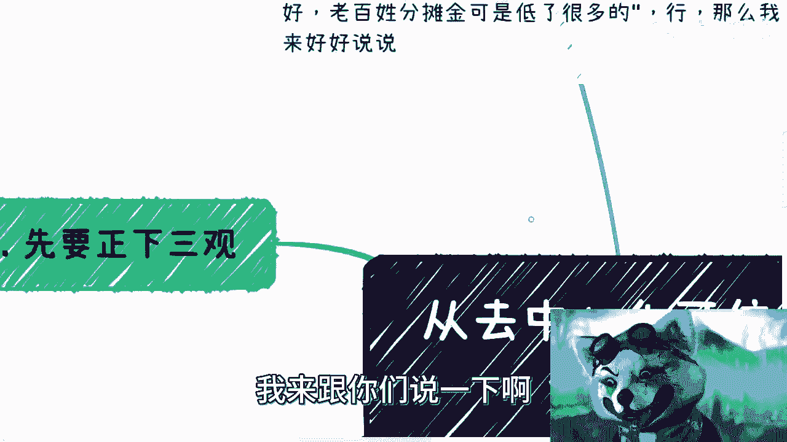
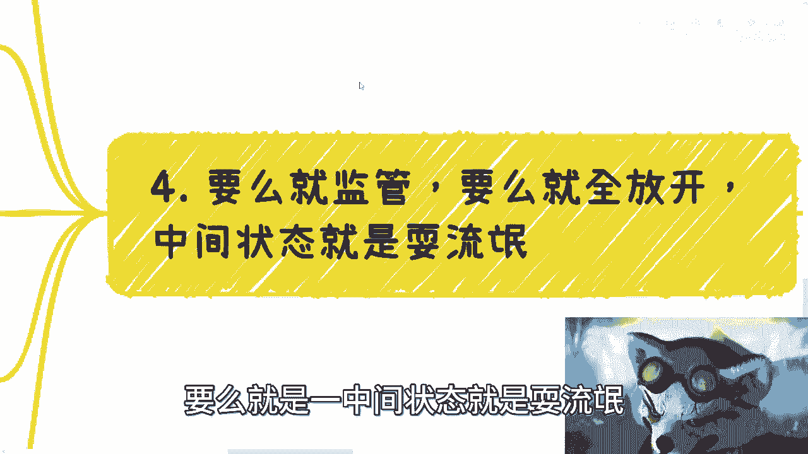

# 从网友说我应该支持相互保-被我拉黑说起---P1---赏味不足---BV1kh4y1E7hc_not

## 概述

在本节课中，我们将从一个关于“相互保”的网络争议案例出发，探讨如何构建一个真正公平、可信的系统。我们将分析中心化与去中心化模式的利弊，并梳理出设计可信系统时应遵循的核心原则。

---

## 事件背景与核心争议

有网友因指责我（一个区块链从业者）不支持“相互保”产品而被我拉黑。他的核心论点是：我作为区块链从业者理应支持“相互保”，因为它降低了老百姓的分摊金（例如从50%+降至20%+），出发点是为人民谋福利。

上一节我们介绍了事件的起因，本节中我们来剖析这个观点背后的逻辑问题。

## 正本清源：商业逻辑与“公平”辨析

首先需要明确几个基本观念。有人认为“相互保”的出发点是好的，甚至提到其前CEO声称亏损数十亿来做生意。

**核心质疑一：商业本质**
请问，有哪个大型企业或资本家是从一开始就做亏本生意的？任何产品的出发点听起来都是美好的，否则无法吸引人参与。例如，“水滴筹”也曾标榜公益，但它最终实现了IPO（上市）。如果一个组织前期做了十年坏事，后期开始做慈善，难道就能立刻被定义为“大善人”吗？

**核心质疑二：公平性**
“相互保”由一个中心化公司运营。一个中心化公司推出的产品，能称之为“公平”吗？作为区块链从业者，就必须支持它吗？这没有逻辑。保障与否、规则变动，最终都由中心化公司决定。用户能与客服或马云本人理论“公平”吗？这谈不上公平。

如果任何事物套上“为你好”的外衣就能集资，那与非法集资有何区别？若都称之为慈善，世界就大同了吗？事实并非如此。

**本节重点声明**：本次讨论不深入评价“相互保”与传统保险的优劣，也不对保险行业做专业评判。我们仅以此事件为引子，探讨构建可信系统的方法论。

## 构建可信系统的核心原则

上一节我们驳斥了简单的“动机论”，本节中我们来看看，一个真正追求公平可信的系统应该如何设计。

### 原则一：参与即拥有话语权

真正的公平意味着：参与者（付钱方）也应是受益方和管理方。理想状态下，资金不应完全由单一中心化机构掌控。

*   **现状**：目前有哪个产品让普通用户真正拥有管理权和话语权？
*   **改进方向**：即便不是完全去中心化，也应实现**多中心化治理**。系统的任何重大变更（如保障规则、赔付决策）不应由单一方决定，而应通过**多签（Multi-signature）** 等机制共同决策。
    *   **公式/代码示意**：`决策生效 = 签名A AND 签名B AND ... AND 签名N` （需多个独立密钥共同签署）

### 原则二：透明化的决策机制

系统的基本机制是：参与、分摊、受益。但关键问题在于：**谁来决定受益人是否符合条件？**

*   **现状**：目前由中心化机构根据条款和内部流程审核，用户需要与客服沟通，最终决定权不在用户手中。
*   **改进方向**：参与者应能参与到关键流程中。例如，通过**多中心化投票**来决定某个案例是否应该赔付。或者，从更技术化的角度，系统应能接入多方数据（如医院、医保数据），通过可验证的方式自动判断事件真实性，减少人为干预和欺诈。
    *   **面临挑战**：有人会质疑，目前从各方可靠地获取并验证数据是否可行？这确实是一个现实难题。如果大数据和互联网能确保数据真实透明，那么自动化可信赔付就是可能的。但现阶段，这尚不成熟。

**过渡**：讨论了理想模型后，我们必须回到现实。无论是中心化还是去中心化系统，在现有条件下都有其局限。

## 现实考量：监管、开放与中间地带的陷阱

核心在于：许多事情，要么接受**强监管**，要么**彻底开放**。处于中间模糊地带往往是“耍流氓”。

### 观点一：金融必须强监管

金融活动在全球范围内都是强监管领域。例如，Facebook发行Libra时也需要接受SEC（美国证券交易委员会）的听证。如果否定监管，就等于要推翻现有的金融和法律框架，这是不现实的。

### 观点二：警惕“社会实验”话术

不要被“为老百姓好”、“互联网社会实验”等话术迷惑。如果真要做慈善实验，那就应该彻底开放，允许任何人参与和发起，形成充分竞争。否则，这些话语只是掩饰。

### 观点三：用发展的眼光看问题

不能仅从当前结果评判。任何组织都会变化，尤其是中心化组织，其决策者（“扑克脸”）的意图可能随时改变。当盘子（资金规模）越来越大时，缺乏监管的系统中“猫腻”只会更多，最终受益的未必是所有参与者。

因此，对于“相互保”这类产品，既不建议无脑黑，也不应无脑赞同，而应客观看待其机制和潜在风险。

**过渡**：最后，我们不可避免地要触及一个根本问题：商业公司的终极驱动力。

## 终极问题：商业公司的本质与驱动力

让我们思考一个简单场景：你是一家拥有数亿日活用户、数十万员工的公司的CEO。每月薪资和运营成本已是天文数字。

*   **核心决策依据**：这时，你批准一个P1级项目的首要标准是什么？是“慈善”还是**盈利潜力与风险控制**？
*   **逻辑推论**：当生意规模做大，尤其是涉及金融边界时，管理者不可能不清楚其中的风险。那么，这类产品能被推出并允许存在，其背后最可能的结论只有一个。

## 总结

本节课中我们一起学习了如何从一个具体争议中抽象出系统设计的原则：

1.  **摒弃二极管思维**：不要简单认为“中心化=坏，去中心化=好”。评判应基于具体机制，而非标签或当前结果。
2.  **明确可信系统的核心**：公平性体现在**参与者的治理权**和**透明的决策过程**上。理想模型包括多中心化治理和基于可验证数据的自动化执行。
3.  **认清现实约束**：在数据可信度和互通性未解决前，任何系统都有局限。金融领域**强监管**的必要性不容忽视。
4.  **洞察商业本质**：大型商业项目的核心驱动力是盈利与风险控制，而非单纯的慈善。“社会实验”等话术需要辩证看待。

最终，一个系统的核心颜色（本质），就像我背景框的颜色一样，需要褪去表面浮华才能看清。关键在于其底层运行机制是否真正做到了权责对等与透明可信。