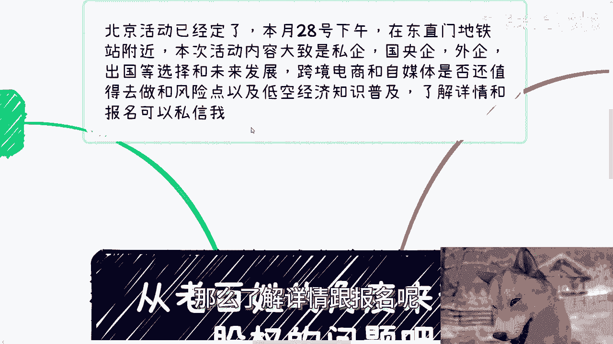
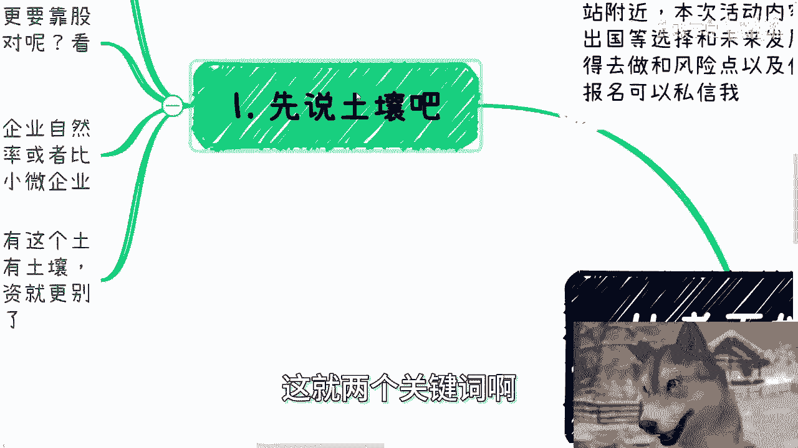
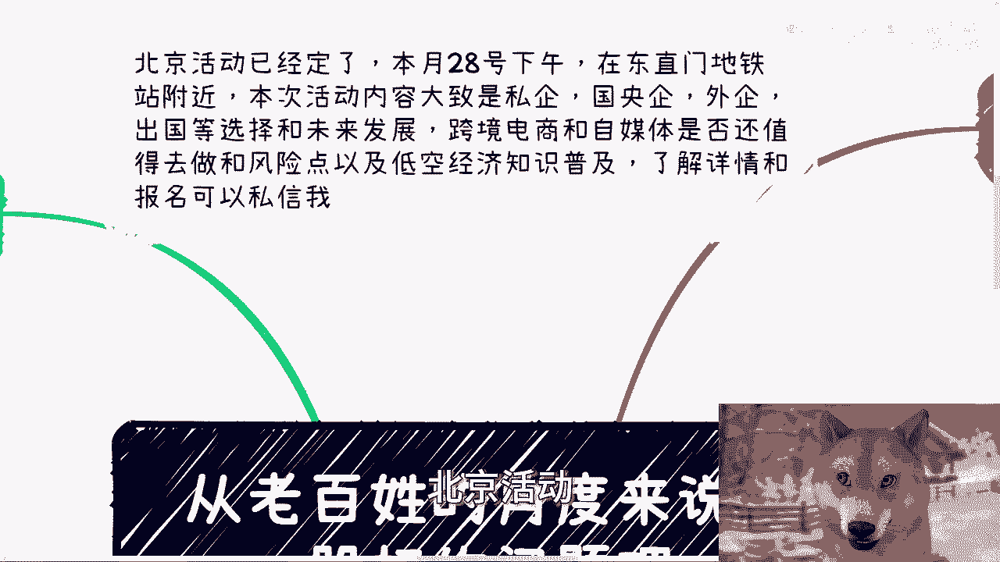

# 从老百姓的角度来说下股权的问题 - P1 - 赏味不足 - BV1Mm42137BX

好今天这个主题啊，也是前两前两天三四天前了吧，这个也是小伙伴跟我提到，说那个呃国家这个政策扶额鼓励大家，这个怎么说呢，就是啊更多的是超级个体啊，然后然后说啊股权分配啊，然后呢赚赚钱或者怎么样子。

我看了一下呃，有点早啊，有点早，就是政策的话，差不多是在2018年给我看的东西啊，而且这里面有些不可描述的东西对吧啊。

但是不管怎么样啊，我觉得也可以来讲一下，也可以来讲一下啊，首先呢这个我先再说一下啊，北京活动已经定了好吧，本周日28号下午啊，在东直门地铁站附近，那么本次活动内容呢，就是一个就是说我会跟大家说一下。

就是说私企啊，国央企啊，外企啊啊出国啊，当下就选择呃，当下的一些选择跟未来的一些发展，那么跨境电呃，还有另第二点呢，就是说从个人角度来讲，做这种跨境电商和自媒体呢是否还值得去做啊。

包括就是说一些风险点啊，那么同样的还有一些低空经济的这个知识普及，那么了解详情跟报名呢可以继续私信我啊。

好然后我觉得呢这个老百姓跟股权，这就是两个关键词啊。

首先第一个先说土壤呃，股权这个东西问题其实很大啊，我不打算在视频里面把它分开来，而且本身我也不是这个专业的对吧，我只不过就是说因为我在创业的过程当中，或者我在创业过程当中，就多多少少看到过一些东西啊。

你让我讲我也讲不清楚啊，所以说我觉得你们碰到问题呢，我们可以就问题来讨论或者分析，那么有的公众号说呢，他说老百姓赚钱很难啊，要赚大钱呢更要靠股权，或者说啊股份啊，分红啊，怎么样子啊。

呃或者说说股权呢是一个很重要的方式，那你说这句话对不对呢，啊对也不对啊，因为什么，因为要看时代，看土壤，你打比方说我们就说2010年往后啊，左右就说土壤很好啊，满地都是可以融资的。

那个时候阿猫阿狗都能融到个四五十万51，或者说七八十万100万的啊，这很正常啊，那么融资多呢，企业自然也就多，初创企业也就多，那么自然股权能分配的概率或者比例也就高啊，那么毕竟中国从比例角度来讲。

大比例还是小微企业啊，但是现在整个这个经济情况，财政不好，自然也就没有这个土壤，这跟政策没有关系，因为你本身就像我们说现在内需卷不动，要卷外需嘛对吧，你本身内需卷不动，你政策再扶持，你没有这个土壤。

内需卷不动，那就白搭，对不对，你政策是政策嘛对吧，但现实是现实嘛对吧啊，那就像现在很多创业呢也没有土壤融资，就更别说了啊，那么一级市场，二级市场他妈一片狼嚎啊，那那你要说股权的简直就是更难上加难对吧。

首先这是第一点，第二点呃，我们再来说股权的用处啊，那股权这个事，其实无论谁要把它总归有个用处啊，就如我以前说的，要么是名，要么是利，对吧，你比如说你分一个股权啊，在哪怕我比如随便说啊，比如说哪怕1%啊。

2%啊，那么你说在企查查里面，这个企业当中你是能露出的啊，我先不说你在这个企业里面是不是有话语权，这个是后话啊，你也算有个虚名啊，但如果来说你不懂得用企业这个虚名，在社会上啊，在外面去赚到更多的钱。

或者说去让政府给予你更多钱，或者说或者说不管就从任何角度来讲，你无法给自己带来更多钱的话，那么你要这个名就是个饼，那你说你这1%的股份握在手里干嘛呢，你不要跟我说，你这你打算传给你的孩子，对不对啊。

好那么我们再来说，你要么这股权这个东西，要么就给钱，钱这个东西呢就现在这个经济形势来讲，你说很多人讲IPO啊，套现我跟你讲啊，你别说套现了，你指望IPO你还不如去买个福彩对吧，就当下这情况。

你跟我讲IPO，你自己去看看有多少提交IPO那个预IPO的，PREIPO的被退下来的，你们自己去看对吧，哦当然股权本身退出机制也有很多啊，也不是说只有IPO对吧，你比如说投资的话。

那么下一轮融资你也可以退出啊，那么呃可以是融资，也可以是并购啊，都可以啊，但是现在这种情况很简单，如果你想找到一个正规的私募基金，或者来说这种投资机构啊，或者来说嗯嗯这个国央企业来并购。

你自己去谈谈看啊，这个难上加难啊，所以如果你要你，所所以如果你投资了，比如说你现在头脑一热对吧，一上头卧槽，我他妈的，我先投个三五十万啊，然后呢后面说啊，可以退出，怎么退出啊，我告诉你怎么退出啊。

你只能期待找到一个，第二个跟你一样是大冤种人来接盘，就这么简单，否则怎么退出啊，谁来推啊啊卧槽回购，我跟你们讲，你妈有很多人跟我提过回购回购很搞笑，来啊，你你你合伙人或者你们的第一个投资人。

或者你你其他投资人是吗，谁来回购啊，是不是钱他妈多到没地方用了，来回购啊啊人家找的都是接盘侠啊，有几个悔过的，你去看看，更别说当下这种经营情况了对吧，那有的人要说了，钱还有啊对吧。

企业可以回购或者说分红，我跟你讲，还是那句话，你对企业如果有绝对的掌控权，比如说你有一票否决权，那么你说了算啊，那没问题，你想怎么折腾怎么折腾，如果你没有掌控权，你手上握了个1%也好，或者99%也好。

没卵用的，这些东西都是虚的啊，我说的不好听点，很多企业连注册资金都不是实缴的。

都没有盈利，你跟我谈什么分红啊，啊妈奇了怪了，对不对哦，第三股权跟技术一样，是死的，人是活的，什么意思，意思就是说股权这个东西，很多人觉得哎好像自己占股多了，就会就会分的多，或者说话语权就多了。

我跟你讲这事怎么说，我跟你讲，记住合同也好，股权也好，股份也好，期权也好，所有东西都是死的，只有人是活的，为什么，因为在实际过程当中，我打个比方，你占的多，我举个例子啊，比如说你跟我合作啊。

你我举个例子，比如说你占70%，我占30%，然后难道在做的过程当中，每一步每做一个东西，当我跟你有矛盾的时候，怎么滴啊，你用股权压我啊，对不对，你压我有用吗啦问题是就是我就说白了。

如果我今天就是有意要来坑你，或者我有意就是要要借这个壳子来赚钱，我有意就是想多分钱，你管得着我们了啊，这你用股权来压我有用吗，这又不是一个开关，你说压就压的，对不对，你要说打官司可以啊，你打呗。

你打呗对吧，哦那么另外一方面分钱这个事儿就更复杂了，你比如说到底怎么分分的，是合同的销售额还是分纯利润对吧，如果分纯利润，那么成本是多少，怎么来区分成本对吧，那么你分的话是按照项目分，还是按照一个月分。

还是按照一个季度分，还是按照一个一个半年一分，还是一年一分对吧，你很多人根本这些东西都不谈清楚，也不了解清楚，你谈什么股权啊，你要我说股权这个事很简单，如果你们真的要去关心对吧。

别老兴奋的去关心怎么赚钱，就上来就跟我说，哎陈老师，我是不是拿的多分的多，我跟你讲，你要关心的是风险啊，我举个例子，就比如说你跟你的合伙人合作了对吧，你合伙人跟别人去签了合同，或者跟别人去合作。

他就不跟你同步，他就不告诉你，你怎么办啊，你去压他有用没啦，对不对，你更多的要考虑这件事情里面的复杂度啊，以及你要把一些我们叫做约法三三章，或者说把风险点的事情提前去说，而不是说就在那边脑子一热。

卧槽他妈的我要拿股权了，你看看我拿多少合适，有屁用啊，对不对，我跟你讲，每次谈这种问题啊，我上来第一句话就是我就问你们业务盈利了吗，没有，那你谈个屁啊，有什么好谈的，就画个饼，有谁不会画的，对不对啊。

第四本质上啊，我觉得现在这个事情吧，老百姓尽量不要去碰，为什么，因为说直白一点，股权这种东西你要是明白，你要是懂得怎么玩，你就是很清楚的，会明白他是对上，是如何通过这个东西去运作资本。

来给自己套利的对象，就是如何运用这个东西来给别人画饼的，这就是正常呀，你要是个资本家，你也怎么做对吧，那么反过来说，你要不懂呢，股权就是别人用来给你画饼的，让你上头的工具，那就如我前面二跟三所说的。

你要指望股权能躺赚，我告诉你啊，除非你是一个纯资金投资，而且你还是个主要投资人，不是跟投的，那么还有那么一丝可能性，否则我跟你讲，你这笔钱就是相当于扔在水里面，连水花都没有的，明白吗啊，所以记住一点啊。

就是很多事都是如此，所有的事几乎都是如此，你不要来跟我谈技术，不要来跟我谈逻辑，技术跟逻辑走都走得通的呀，没问题呀，但是你一到实践上面，你沟通的是人啊，人才是最大的问题啊，对吧你你你在过程当中。

人的问题没法解决，别的东西有用的啦，本质上我跟你讲，这也是最大的信息差，所以我们一直在说啊，就是要实践要实践，因为什么，因为你要面对的和解决最大的问题是人，是人性，对吧。

是人过程当中你到底通过哪些东西得约束它，而不是别的东西。

对吧，你这里面复杂的东西多了去啦。

那你说到这一点，你又让我想到了一点是什么，就是之前还有小伙伴来问我啊，给我一个什么某某某城市的政策啊，问我，他说爱陈老师，你说这个政策你说我应该怎么去这切，或者说我应该这个项目申报书怎么申报。

没我就我我跟你们这么说啊，一样的道理，就是政府给的所有的东西，包括高校企业给的所有的对外的东西，它都是宏观的，或者说都是叫做粗犷的内容，为什么，因为他要找的是众多他认为满足条件的人，从而在里面筛选对吧。

你说你是不是符合，或者你是不是在这个这个这个里面，到底怎么申报，你不是单纯看这种粗糙的东西的，你要进去跟里面的负责人要聊，要见面要谈对吧，为什么，因为里面有非常多的细节，是不会写在公开的文件里面的。

也不会写在红头文件里面，也不会写在任何一个公开的地方的，这才叫真正做事情的方式，对不对，一样的道理呀，你不能说啊，陈老师啊，我因为我自己看了一下啊，我这个条件啊，从理论上我都很符合这个政策呃。

列出来的东西，那你说我能不能百分之百申报到，那他妈你觉得能不能百分之百申报到啊，对吧哦社会你说说看社会上这么多东西，这那怎么滴啊，就你一个人符合的，别人不符合的啊。

那到最后我就问你符合他符合有100个人符合，那凭什么最终只有两个人能拿到钱，或者两个人能申报成功项目，为什么另外98个人不能申报成功呢，诶奇了怪了，对不对，一样的道理呀。

对吧就是我觉得很多人真的我我我还是那句话，很多人读书读的多，但他读傻了，他认为逻辑跟理论走得通的，就好像一定走得通啊，我们不是跟电脑打交道，我们不是跟书打交道，我们跟的是那些。

你要让我说就是跟那些老狐狸打交道啊，哪这么容易啊啊这么容易，大家早就均富了啊，大富翁玩过没有，对不对。

好吧啊行，先这么着吧，然后那个呃北京活动好吧。

咨询也不是咨询嘛，就了解详情或者报名，你可以去私信我，然后你们自己就是比如说有些什么副业啊，或者跟别人一起做些什么业务啊，在合同啊，分红啊，分润啊对吧，包括那个项目计划书啊，白皮书啊啊股权期权啊对吧。

或者其他的有各种各样问题的呃，你们希望啊包括你们的职业规划，商业规划啊，你们希望通过我的一些呃认知，和对于整个社会的一些呃理解啊，给能结合你们的个人情况，给你们一些更接地气的呃建议或者说规划的话。

那么你们可以整理好对应的背景跟问题的呃，这个question list，然后我们再来走咨询好。

