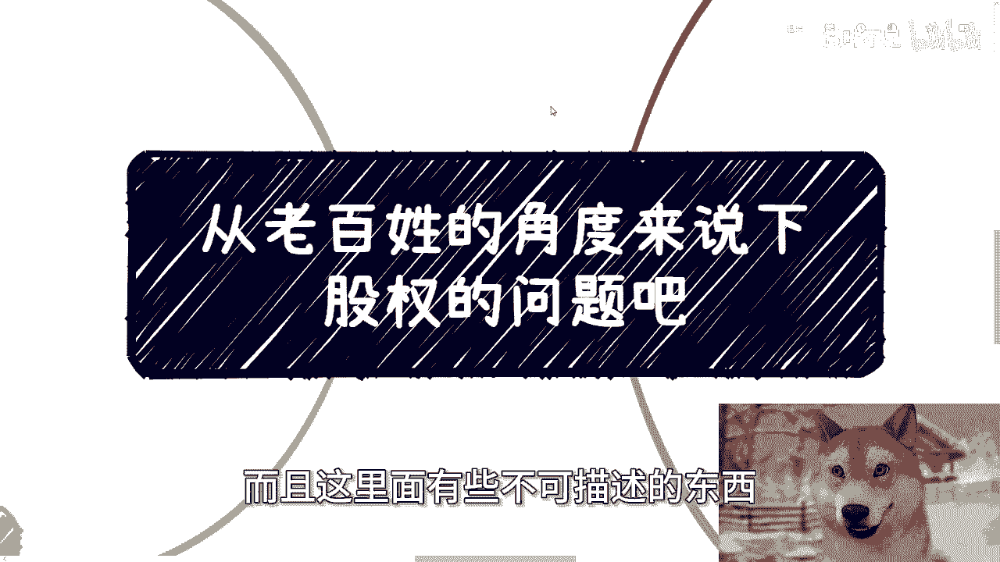
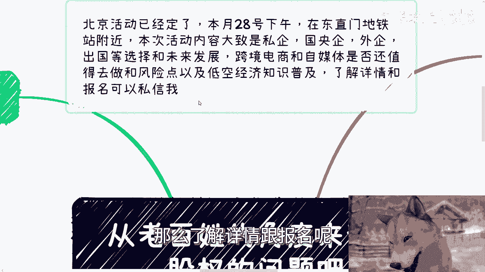
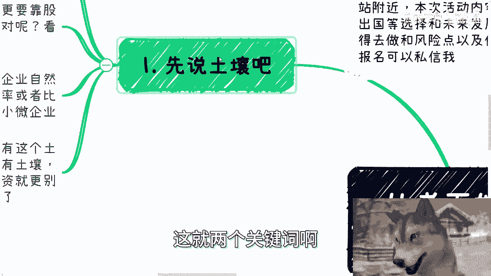
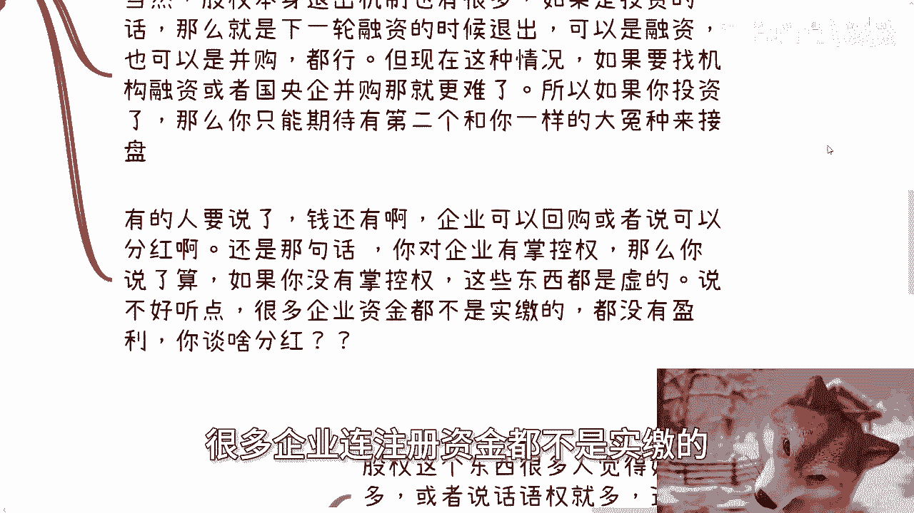
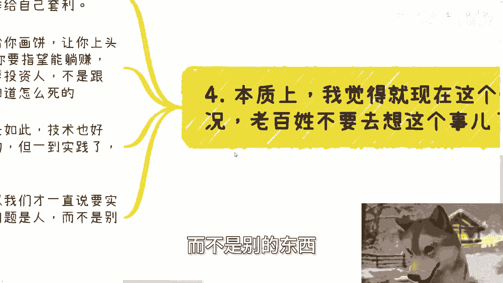
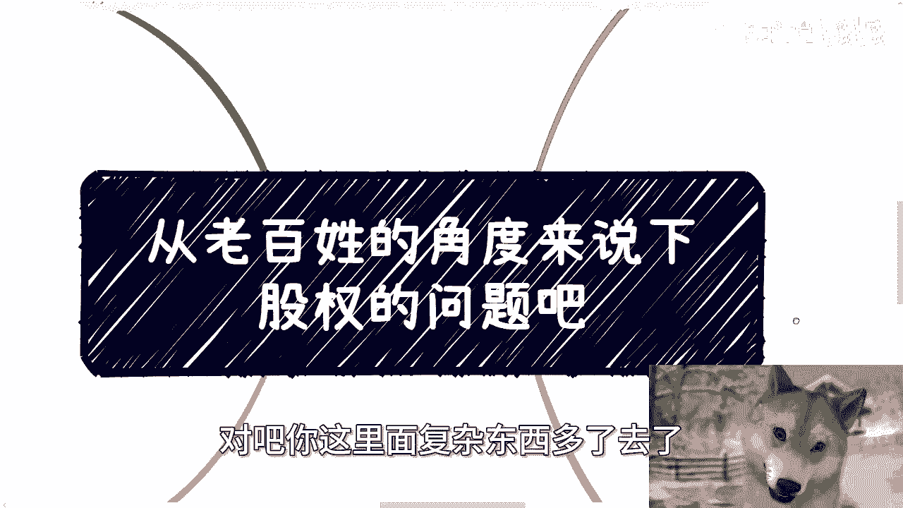
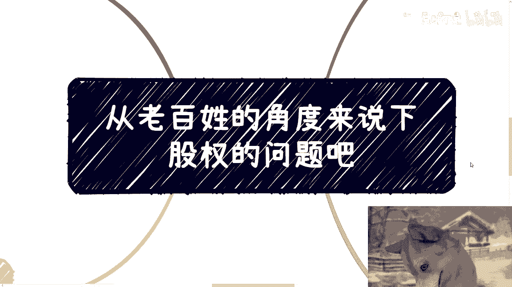
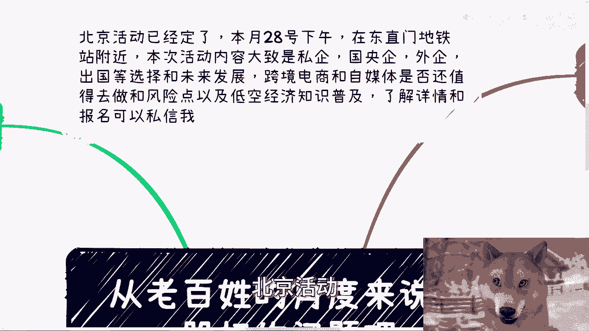
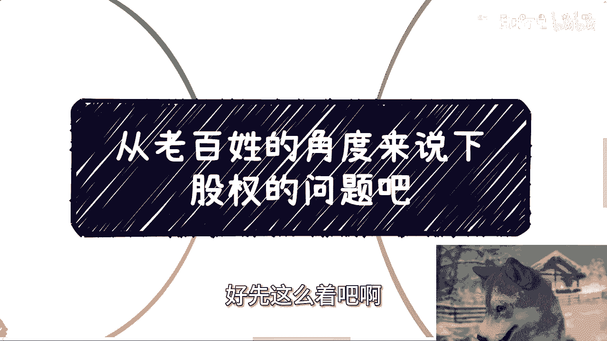

# 课程：从老百姓角度理解股权问题 - P1 📚



在本节课中，我们将从一个普通人的视角，探讨“股权”这一概念。我们将分析其本质、在当下的实际意义以及普通人可能面临的风险和误区。课程旨在帮助初学者建立对股权的基本认知，避免不切实际的幻想。

## 概述 🌱





股权，常被视为通往财富的捷径，但其背后的逻辑远比表面复杂。本节课程将拆解股权的几个核心层面，包括其依赖的“土壤”、实际“用处”、与“人”的关系，并最终给出对普通人的建议。

## 一、股权的“土壤”问题 🌍

上一节我们概述了课程内容，本节中我们来看看股权赖以生存的“土壤”。任何事物的价值都离不开其生长的环境，股权也不例外。

股权分配与融资的活跃度，与整体经济环境密切相关。在2010年左右的繁荣时期，融资相对容易，初创企业众多，因此普通人获得股权的机会也相应增多。其核心逻辑可以概括为：

**经济繁荣 -> 融资活跃 -> 初创企业多 -> 股权分配机会多**

然而，在当前经济形势下，内需不足，融资困难，一级和二级市场表现不佳。缺乏活跃的“土壤”，股权本身的价值和变现可能性就大大降低。政策鼓励是宏观导向，但缺乏市场土壤的实际支撑，股权难以真正发挥作用。

## 二、股权的实际“用处” 💰

了解了股权所需的土壤后，本节我们来看看股权究竟能带来什么。股权的用处通常归结为两点：“名”或“利”。

**1. “名”的层面：**
持有股权（哪怕是1%）意味着在企业信息中“露出”，获得一个“合伙人”或“股东”的虚名。然而，如果无法利用这个名头在社会上换取更多资源、机会或资金，那么这个“名”就只是一张无法兑现的“饼”。

**2. “利”的层面：**
这是大多数人关注的核心，即通过股权赚钱。赚钱的途径主要有以下几种：
*   **IPO（首次公开募股）套现**：在当前环境下，企业成功IPO的几率极低，堪比买彩票。
*   **下一轮融资退出**：企业获得新投资时，老股东可以将部分股权出售给新投资者。
*   **并购退出**：企业被其他公司收购，股东获得收购款。
*   **企业分红**：企业盈利后，按股权比例向股东分配利润。

以下是当前环境下这些途径面临的问题：



```plaintext
问题清单：
- IPO困难：大量企业IPO申请被驳回。
- 融资/并购难：找到正规投资机构或并购方非常困难。
- 分红不现实：许多企业连注册资本都未实缴，更无盈利可分。
```

因此，对于普通投资者而言，所谓的“退出”很可能只是寻找下一个“接盘者”。如果没有对企业（如通过一票否决权）的绝对控制权，即使持有高比例股权，在分红、回购等事宜上也缺乏话语权，权益难以保障。

## 三、股权是死的，人是活的 👥

上一节我们讨论了股权的理论用处，本节中我们来看看实践中最关键的因素——人。合同、股权协议都是静态文本，而商业活动是动态的，由人执行。

股权比例并不直接等同于控制力或实际利益分配。例如，即使你持有70%的股权，合伙人（持有30%）若在运营中隐瞒信息、私下签约或操纵成本，你的股权也无法像开关一样立即制止他。纠纷最终可能诉诸法律，但过程漫长且成本高昂。

利益分配更为复杂，涉及多个需要事先明确的细节：

以下是分红前必须厘清的关键问题：
*   **分配基数**：是分配合同销售额，还是税后净利润？
*   **成本核算**：如何定义和核算成本？哪些支出算作成本？
*   **分配周期**：是按项目、月度、季度还是年度进行分配？

普通人更应关注股权背后的**风险**，而非盲目憧憬收益。在合作前，应优先考虑如何通过“约法三章”来约束合伙人行为、明确权责利，而不是只纠结于持股比例。业务尚未盈利时，过度讨论股权分配无异于“画饼充饥”。

## 四、给普通人的核心建议 ⚠️





综合以上几点，本节我们将给出对普通人的核心建议。股权本质上是一种工具，其属性取决于使用者的认知水平。

对于资本运作者，股权是**对上融资、对下激励**的工具。而对于不了解其复杂性的普通人，股权很容易成为他人用来“画饼”、让你“上头”的手段。

除非你是拥有主导权的纯资金主要投资人，否则指望通过小额股权投资“躺赚”极不现实，这笔投资很可能血本无归。

最大的信息差和实践难点在于**人性**。技术、逻辑在理论上都可行，但实践中最难处理和预测的是人的行为。因此，一切商业活动的核心是与人打交道，并通过有效的规则去约束人性，而不是仅仅依赖一纸合同。

这一点在申报政府或高校项目时同样适用。公开政策文件是宏观和粗线条的，旨在广泛筛选。能否成功，取决于你是否能接触到内部负责人，了解到那些**未写在公开文件中的细节和真实标准**。理论符合条件不等于实际能成功，因为最终是在与人（评审者）竞争和沟通。





## 总结 📝

本节课中我们一起学习了从老百姓角度理解股权的几个关键点：
1.  **土壤决定价值**：股权的价值高度依赖经济环境和融资活跃度。
2.  **用处分“名”“利”**：“名”需兑现才有价值；“利”的多种退出途径在当前环境下均面临巨大挑战。
3.  **核心在于人**：静态的股权协议无法完全约束动态的人的行为，利益分配和风险防范的细节至关重要。
4.  **谨慎对待，认清本质**：对多数普通人而言，股权风险远大于机遇。商业实践的核心是解决人的问题，应对复杂的人性。



希望本教程能帮助你更清醒、更务实地看待“股权”这个概念。