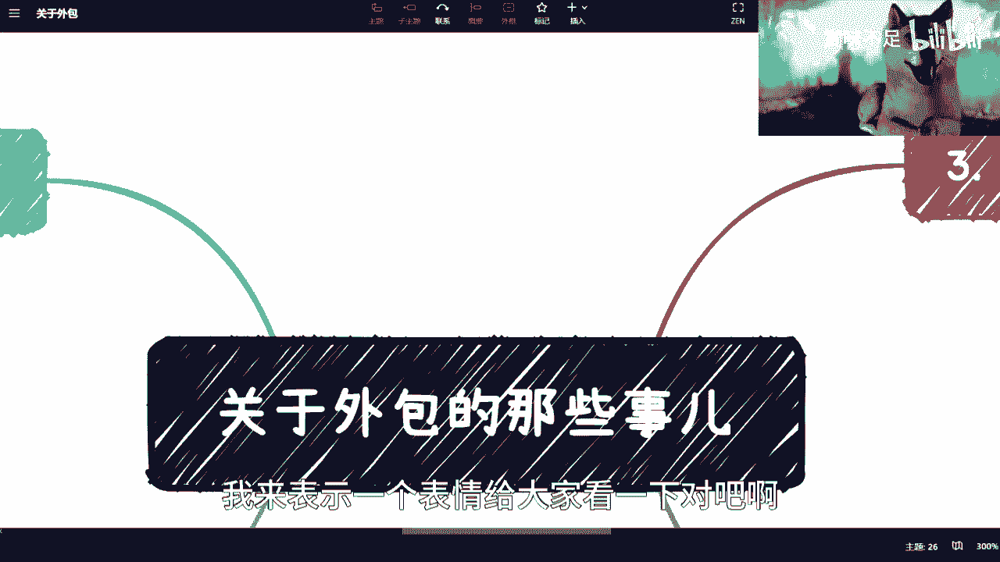
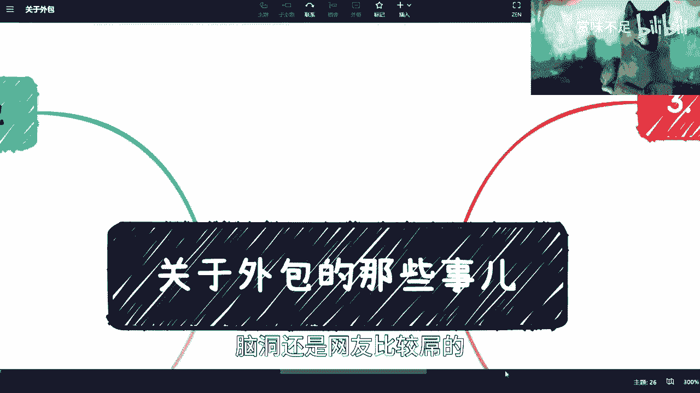
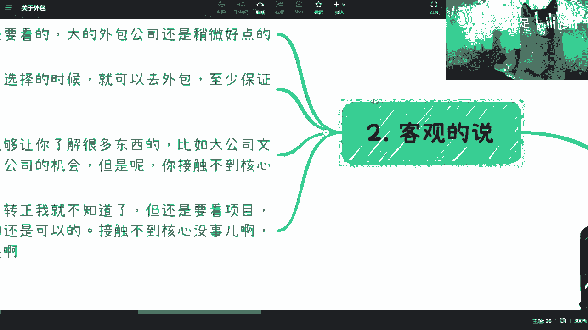
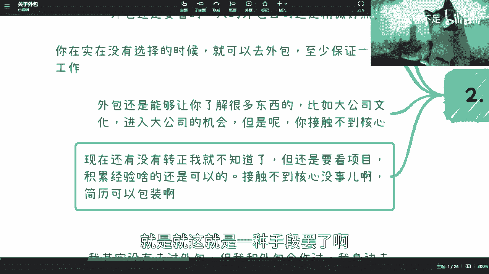

# 仔细罗列外包那些事儿以及其商业模式 - P1 - 赏味不足 - BV1ix4y1A7vv

好啊大家好啊，这个对细心的小伙伴发现了，我现在是只旺财是吧，来来来画个，我来表示一个表情给大家看一下对吧啊。

然后我早上看了一下数据啊，然后是这样子的，就震惊我1万年是吧，我看了数据87%是男性粉丝是吧，然后评论区就更震惊了，然后有人就马上说要到我这里来找对象对吧，就现在果然这个单单单身大龄女青年单单身。

这个不是大龄啊，这女性也很多是吧，然后还有人说可能那13%也是男性。

我对吧，脑洞还是网友比较的啊。

然后那个我总结一下外包啊这件事情啊。

我大概能把我想到的以及我这个能知道的，我基本上都列在这了啊。

呃首先第一个呢是我的态度啊，态度是什么呢，就是说首先啊我没有去做过外包啊，但是呢我基本上围绕外包做过好多事情啊，只不过我就没录制过外包啊，那么我身边也去过很多外包公司的，这个小伙伴啊。

然后我就到处也问啊，然后反正嗯得出的情况呢，这个也大差不差啊，大差不差诶，你看他还是蛮好的，哎呀你看我我一甩头，这个这个狗子就就跟不上我了，来来，哎哎好了好了好了不行不行不行，这跟踪做的也不行啊。

甩个头啊，然后你看啊，其实外包最早的时候呢，我是觉得所有事情其实是有一个这个过程的嘛，对吧，咱不能现在一刀切说好或者不好啊，嗯因为我知道呢，其实外包在早年其实还是非常好的，因为什么呢。

因为它满足了大部分人的一些需求，就说嗯外包相对门槛比较低啊，然后呢其实做的好呢，在一些你们会发现在一些比如说日企外包啊，呃这个美企外包啊，或者就有国也不叫国企吧，就是国内大企业外包。

有很多外包呢在早年他其实是可以转正的，因为什么呢，因为嗯早年就没有这么卷嘛，然后早年其实大家呃，我说实话就早年大家还是蛮讲道理的啊，蛮讲道理的嗯这是第二方面，第三方面呢就是说随着这个时间的推移呢。

其实我是觉得身边的就是这种案例会特别多啊，那多了之后就不好的案例特别多，那多了之后呢，我就就不太会再去啊，这个推荐啊，说啊我们是不是啊还要去，还要去啊，还还去不去这个外包对吧，或者怎么样。

就我就不再展开说啊，到底去还是不去啊，怎么样的情况去怎么样情况不去对吧，我就一般就不推荐了，因为怎么说呢，就吃你去外包，我觉得没有问题，但是去外包，主要还是说你自己得要有比较好的自控力啊，自律啊。

自学能力啊，包括其他各种各样的这些呃，点对吧，否则就是说时间一长就回。

回头又要说了，陈老师，你坑我是吧，哈哈啊，那好那我们客观的说啊。

客观的说是这样子的，就是说外包呢还是要看的，就是说大的外包公司还是会好一点，就不管是在福利啊，在稳定性上面还是会好一点，但是就是说实话吧，就是这2年其实也不太行，因为毕竟就很多公司一开始做还是蛮好的。

就做着做着做着就烂掉了，你知道吗，就唉也不能怪他们是吧，那第二点呢，我是觉得，就是说当呃大家在没有太多选择的时候呢，其实是可以去的，你包括最近就私信我的小伙伴，我也跟你们讲，他我说我说一般我是不推荐的。

但是你在这种就是特殊情况下面对吧，那我还是会推荐对吧，你就去呗，你你实在不行，就找外包，怎么了怎么了呢对吧，你至少可以保证个工作嘛是吧，而且外包的这种岗位类型很多啊，就开发新呃设计啊对吧。

就很很多很多啊，就是那个理科文科都有嘛，然后呃第三个呢，就是说我觉得外包还有一个好处呢，就是说至少能让你了解很多东西，因为你去外包，你一般是什么，一般是onset的。

就我们说onset就是你是外派的对吧，那外派呢你就是有机会，你比如说去华为啊，去阿里啊，去腾讯啊，你是你你是去的，你知道吗，只不过呢就是说你接触不到他们的系统的核心。

就比如说你在公众号里面可能是有wb的啊，是外包，不是微博啊，对吧哈哈wb对吧，然后呢你有很多的这种呃document，就文文件的权限啊，系统权限是没有的对吧，那我相信做过小伙伴其实都知道啊。

但是呢就是说你至少是能够去啊，比如说进公司的对吧，你也能看到哎里面是什么样子，大家是怎么合作的，包括大家一起开会的，其实这个过程呢是一个你学习啊，就是比如说项目流程啊对吧，产品设计啊。

就有很多东西你是能够呃学习到的，那你先不用去care你是不是一个外包嘛，我觉得这个关系不大对吧，然后第四点呢就是说呃现在你说有没有转正吧，其实我就不清楚了，但是这件事情是要看项目的。

因为我们退1万步来讲嘛，就是你就算没有转正是吧，那你做了一些项目，你说啊我做的是外呃，华为我做的是这个联通对吧，或者怎么样，那接触，其实我觉得呃接触不接触到核心是无所谓的，因为你简历可以包装嘛，对不对。

因为还是那句话嘛，我以前跟很多人都说，我说我那当然可能跟我这这个这样人，好的人比较少，就是我会给他们建议，我就说，其实你们在简历上是没有必要去写外包的，为什么呢，因为无所谓啊，就是对方问我就如实回答。

那对方不问，那我就这么招对吧，有什么区别呢，那你说我参与这项目了吗，参与了，你说我做了吗，我也做了，我只不过是身份不一样，怎么了呢，我也没有欺骗你是吧，所以我觉得这个不是太大问题啊，不是太大问题。

就是哎呀这也不是我教你们学坏啊对吧，就是就这就是一种手段罢了啊。

只不过在什么时候用的问题好吧，然后第三个呢。

我觉得外包这边呢，就是大家要知道一些问题对吧，第一个呢就是说它项目不稳定，那当然了也有很多人知道嘛，就外包本身其实就是个人头，就是个包工头嘛对吧，包工头，那你包工头项目不稳定也正常啊，也正常。

但是包工头项目不稳定的就会就是当然啊，就是我们话又说回来，包工头里面也有项目稳定的啊，但是这个项目不稳定是多占多数呃，项目不稳定呢其实嗯就相当于你自己的啊，就像我刚刚说的嘛，你自己这个自学啊对吧。

包括这自律能力要强一点，否则你说呃虽然你能赚钱啊，项目一直换，但是一样的嘛，因为你大家属性不一样，就是你对外包公司来讲，你只不过是你只不过是个人头嘛对吧，那他随时可以换掉你啊。

那换掉你之后你就很尴尬了对吧，你总不能说啊，我一直在外包公司，哎你我跟你们讲，你还别说啊，我还真认识一些就是一直做外包公司的，你知道吗，就从来没有去过甲方，全部在乙方的这种，但是呢我也得跟你们讲啊。

就是他们是有他们的特点的，什么特点呢，就是要么就是在海外的啊，要么就是说是那种就是说非常相对来讲比较，high level的这种，就是说美企或者日企，就国国家而不是国家，就国内的这些企业呢其实比较少啊。

就比较少，那第二个呢，就是说那package上面可能小动作比较多，这个嗯，反正其实无非也就是说你要说它复杂也不复杂，就派克就给你拆嘛对吧，就比如说啊我给你合同签1万块钱对吧，那可能这1万块钱呢。

当中有多少钱是给到哪里的，给到哪里的，但是呢我们保证你工作的对吧，然后呢，或者来说交税呢，是按照这个这个多少基数交代对吧，怎么样怎么样，反正就是小动作多啊，这个呢就是外包上面小动作特别多啊。

因为毕竟他是个人力外包嘛对吧，所以说这个上面可以做的这个叫什么，就是空间比较大啊，这是第二点，第三点呢就是一般呢就从目前看啊，就是外包比较好的呢，就是你能不能去一个有价值的项目。

但是有价值的项目肯定不多嘛，一般而且你要真正说高机密高高这种叫做呃，就是就是或者说是比较紧急的这种项目，他也不会用外包对吧，你知道它都是内部人原力就直接掉对，就各个bu各个bu去掉，那你说时间长了呢。

其实你对自己就是越不利的，因为就像我刚刚说的，你出来技术战就是你打一个游戏对吧，你就是技技技能点都乱点是吧，然后人家都是什么，比如说啊这个这个专精的对吧，你不是的，你每个地方都点一下。

那这个就很尴尬了是吧啊，嗯然后呢就是在这个地方，还有一点就是说有非常多的人反馈啊，今年其实呃很多甲方的这种真实员工，对外包是很歧视的，唉其实我觉得怎么说呢，就是说嗯我觉得说骑士可能重了一点啊。

但是但是的确就甲方有很多员工，对这种这种外包人员，他不是说态度很好，你知道吗，就是唉我我说白了吧，其实就是甲方的这些优越感啊，就他们会觉得哎呀你是个外包对吧，然后就就不是说去看这件事情做的对不对。

而是说就是就本能上对你态度就不好，尤其是那些manager啊，所以呃当然了，我觉得这些事大家也不用放在心里啊，就是其实我也无所谓，就是人鸟大了，什么林子没有是吧，啊然后这个还有一个呢就是画饼。

就画饼这边呢其实就比较的多了，因为画饼这边我跟你讲，画的最多的无非就是转正对吧，就是啊我们好好做对吧，年底有转正的啊对吧，怎么样怎么样，那这个还是很心动的对吧，但是呃我记得前两前两天评论里有说嘛。

就说那个呃做了几年之后能去日本对吧，就是就是干嘛的对吧，那那那一样的呀，其实其实你想啊，如果你今天去外包对吧，他跟你说，你看啊年底做的好啊，你是可以去联通的，你可以去百度的，对你是可以去阿里的。

那么很多人就会觉得啊，这可能是我这辈子唯一的机会了对吧，哎但是我跟你们说，就未来的事情说不好的啊，真说不好的，我之前说过的嘛，就是说你但凡现在跟我签合同的，我也就信个百分之八九十对吧，你只要不签合同的。

我他妈一个一一个平a都不行啊。

那但是呢我们话又说回来啊，就是外包呢是我们有很多可以学的商业模式啊。

我在这个地方也列了啊，就是嗯外表本质上是一个拉皮条，拉皮条，但是这个呢就是说你也可以选择这个，纯粹拉皮条，什么叫纯粹拉皮条呢，就是说你就做个皮条公司啊，批发公司，然后呢你可以向上对接啊，不要这么说吧。

就向下去对接外包公司，向上去对接甲方对吧，其实你就是来撮合甲乙方的诶，这是这活也可以啊，这活我跟你讲很轻资产很轻自斩，为什么呢，因为你不用招人啊，你就拉皮条啊，我靠不要太开心了对吧，这是第一个。

第二个是什么呢，就外包可以去做就业模式，什么意思呢，就是你自己注册一家公司，或者你找几个外包的合作伙伴对吧，然后呢你可以去跟学校或者跟就是说呃，广大这个c端对吧，用户说啊。

你看啊我这边这个可以帮大家保证就业对吧，那我只说保证就业啊，我又没说保证就业是哪里是吧啊，但是有一说一啊，就是去外包的确是保证就业啊，他也没说谎啊，但是呢，就是说这个的确是一个不错的商业模式啊。

因为在在pr上面是个不错的噱头啊，这个咱也有一说一啊，第三呢，就是说外包其实是可以有个多项目盈利的，什么叫多项目盈利呢，就是你可以再多点去赚钱啊，什么叫多点呢，我给你们举个例子啊，这事情很简单啊。

就比如说你对吧，推荐一个人可以拿猎头费，对不对啊，猎头费啊，猎猎猎猎头费啊，好好，然后呢唉有人教我是tab哎对对吧，猎头费啊，然后呢你比如说这个这个你还可以分啊，每个月的人头工资啊，可以的。

我跟你讲这不可以的，你看你们怎么谈啊，三呢你还可以收，我说说说诶诶我啊对对对，就是你还可以就是呃一个team做多个项目外包，对吧，就是因为你不是所有的项目你都需要外拍的，你有很多就是不是onset对吧。

就就就在外包公司里的，那你人家又不知道你一个人做做几个，你就多做几个呗对吧，就三个人，三个人当六个人用，对，三个人当九个人用对吧，这不得了，不要太开心了对吧，所以你会发现呢就是说啊对对对，还有啊。

你你你你是可以拿这个甲方或者乙乙方的，这个这个叫什么人头服务费的，唉其实合作服务费吧，应该说啊就这个合作服务费跟猎头费，跟峰哥每个人的人头工资，他是可以区别开来的啊，那我们举个例子来讲。

你招了一个1万块钱的人，对不对，你可以问外包，如果你自己是外包公司对吧，那么你可以问乙方说，哎你看啊，我们这边有个人啊，然后呢这个以后我可以跟你谈怎么谈呢，就是我这个项目啊，在几月几号之前。

我给你推荐我，我给你拉了五个人的团队，然后这五个人的团队呢，你除了服这个这个工资以外，因为工资是他是个人要的嘛，但是我是需要有这个那个合作费的对吧，因为我是一家企业，我是需要b to b商业合作的对吧。

合作费用，那同样的，我还需要你每个人的人头工资的，这个这个这个长尾，就是叫做可持续性的收入对吧，你比如说你给每个人开1万块钱，那我需要每个人1万块钱当中抽掉500块钱啊，这个我跟你讲都可以谈的。

都可以谈的，反正就是你可以躺赚啊，你可以躺赚啊，第三个呢就是外包，你可以拿各种政策，因为因为外包就是从这个政府角度来讲啊，外包就是一家企业，他又不管你什么这个叫什么属性的对吧。

你企业比如说有多少纳税人对吧，你企业有多少的全职员工，你企业比如说做的什么方向，你都可以去拷打，我跟你讲，各地方都有靠打，因为各地方要的是什么，就是就是你得有企业，你得有人啊对吧，你只要纳税了。

你只要有全职员工，你就是大佬是吧，那管你做啥呢是吧，然后呃这是一块，然后外包模式其实抗风险性更高，因为你是卖人头对吧，因为你是卖人头，你根根根本就不care，就是哪个哪个行业好或不好，今天这行业不好。

没关系，我换个行业呗对吧，反正我人就这些对吧，我今天可以做约约那个那个叫什么假吧，我明天可以做python，我后天可以做军工对吧，我都可以做，反正只要有需求对吧，技术站这个东西不是问题啊。

这个对我来讲技术站是什么问题啊，你跟我说今天今天要做这个人工智能了，没问题啊，我就招啊，招人工智能啊，反正我是外包啊对吧，我又不care是不是啊，这个我觉得就很好，最后呢其实相对盈利更多对吧。

因为什么呢，因为它不会受行业限制，因为有很多地方呢，它行业上的这个这个政府的一些纳税啊，包括政府的一些这个很多的这个这个叫什么，就是规范上面可能会有些限制，但是它是外包，所以他走的一般都是技术服务。

那技术服务本质上其实嗯，他的合作方一般都是甲方嘛，就企业去企业嘛对吧，去企业去企业，他其实不太会受这个叫什么，就是行业限制啊，这里面所以说哎呀还是很好的。

所以说怎么说呢，就是我跟大家讲嘛，就是说你们再去看一个东西的时候呢，我们就会说啊，你说外包怎么样怎么样怎么样啊，大家都吐槽，我觉得大家这个日常生活当中，也会跟很多小伙伴说啊。

但是你们就是就是空下来的时候呢，还是得要去学习模式，因为你你你你自己看吧，我们稍微总结一下，这个模式还是很有参考价值对吧。

啊行吧，就这么着吧，好吧就这么着吧，我考虑考虑之后是不是弄个给大家相个亲是吧。

