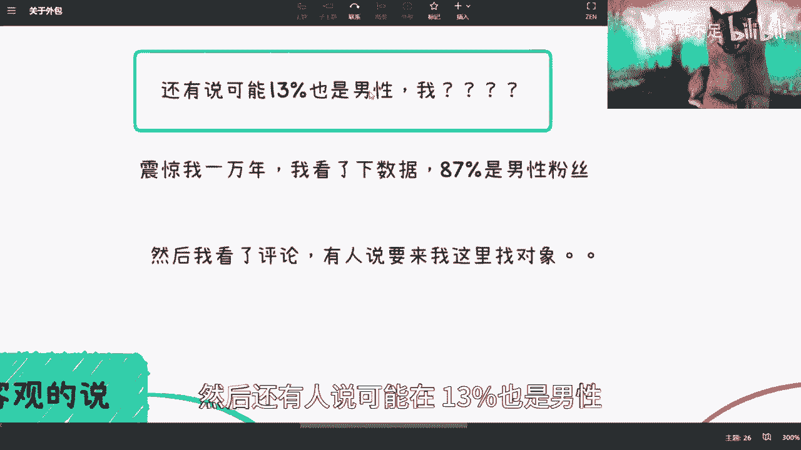

# 课程P1：详解外包行业及其商业模式 📋

在本节课中，我们将系统性地探讨外包行业的各个方面，包括其定义、利弊、从业者注意事项以及背后潜在的商业模式。我们将以客观、直白的语言进行梳理，帮助你全面理解这一领域。

## 概述

外包，即企业将部分业务或服务工作委托给外部专业机构或个人完成。本节课程将首先分析外包对从业者的影响，然后深入剖析其作为一种商业模式的运作逻辑与盈利点。

## 外包对从业者的影响分析

上一节我们概述了课程内容，本节中我们来看看外包对个人职业发展的具体影响。我的观点基于多方信息汇总，并非亲身经历，但具有普遍参考价值。

首先，需要以发展的眼光看待外包。早期外包行业具有其积极意义，它满足了大量求职者的需求。外包岗位通常门槛较低，并且在某些情况下，例如日企、美企或国内大型企业的外包岗位，历史上存在转正的机会。这是因为早年市场竞争不如现今激烈，规则也相对明晰。

然而，随着时间推移，行业中出现的负面案例增多。因此，我通常不再主动推荐选择外包岗位。选择外包需要从业者具备较强的自控力、自律性和自学能力，否则长期来看可能面临职业发展困境。

客观分析，选择外包需要考虑以下几点：
1.  **公司规模**：大型外包公司在福利和稳定性方面通常优于小型公司，但近两年整体行业环境有所变化。
2.  **个人选择**：在就业选择有限的情况下，外包可以作为一个保底选项，它提供了进入知名企业（如华为、阿里、腾讯）工作的机会。
3.  **学习机会**：外派（On-site）形式的外包工作，能让从业者亲身观察和学习甲方的项目流程、协作方式与工作文化，即使可能接触不到核心系统。
4.  **简历策略**：项目经验本身具有价值。在简历中，可以着重描述参与的项目和贡献，而无需刻意强调“外包”身份。这并非欺骗，而是对工作内容的如实呈现。

## 外包行业面临的主要问题

了解了外包可能带来的机会后，我们再来审视这个行业普遍存在的一些问题。

以下是外包从业者可能面临的几个挑战：
*   **项目不稳定**：外包业务本质是人力服务，项目周期性强。项目结束或变动可能导致人员被替换。
*   **薪酬结构复杂**：外包合同的薪酬（Package）可能被拆分为多个部分（如基本工资、补贴等），在社保缴纳基数、税务方面可能存在操作空间，需要仔细甄别。
*   **技术成长路径模糊**：外包人员可能频繁切换不同技术栈的项目，不利于在某一个领域深入积累，形成“样样通，样样松”的局面。
*   **职场环境**：部分甲方正式员工可能对外包人员存在区别对待或态度不佳的情况，这需要从业者保持良好的心态。
*   **职业承诺（“画饼”）**：外包公司常以“表现优异可转正”等承诺作为激励，但这些承诺往往缺乏合同保障，不确定性高。

## 外包的商业模式剖析

前面我们讨论了外包对个人的影响，本节我们将视角转向商业层面，分析外包作为一种商业模式是如何运作和盈利的。

外包本质上是一种人力资源配置服务。其商业模式灵活多样，具有以下特点：

以下是几种典型的外包商业模式：
1.  **轻资产撮合模式**：作为中间商，向上对接甲方需求，向下对接外包公司或自由职业者，专注于促成交易，自身不雇佣大量员工。公式可简化为：`利润 = 撮合服务费`。
2.  **就业培训结合模式**：与教育机构或直接面向求职者（C端）合作，以“保障就业”为卖点，将培训后的学员输送至外包岗位。这是一种将教育产品与人力资源服务结合的商业模式。
3.  **多重盈利点模式**：外包公司的收入来源可以是多层次的。例如：
    *   **猎头推荐费**：成功推荐人选的一次性费用。
    *   **人头服务费/管理费**：按外派人员工资的一定比例每月抽取。例如：`每月额外收入 = 外派人员数量 × 人均月工资 × 抽成比例`。
    *   **项目利润**：一个团队同时承接多个非驻场（Off-site）项目，提升人效。
    *   **B2B合作服务费**：作为企业向甲方收取的项目合作或技术服务费。
4.  **政策红利获取**：外包公司作为合法纳税、雇佣全职员工的企业实体，可以申请地方政府提供的各类产业扶持、税收优惠或就业补贴政策。
5.  **强抗风险能力**：业务不依赖于特定行业。技术栈可根据市场需求快速调整，从一个行业切换到另一个行业相对容易。代码示例其灵活性：`if (marketDemand == “AI”) { hire(“AI Engineers”); } else if (marketDemand == “Web”) { hire(“Web Developers”); }`。
6.  **高盈利潜力**：由于提供的是通用的“技术服务”，不受特定行业监管政策的严格限制，客户群体（企业端）广泛，盈利天花板相对较高。

## 总结

本节课中，我们一起学习了外包行业的双面性。对个人而言，它可能是职业起步的跳板或权宜之计，但也伴随着稳定性、成长性和职场环境方面的挑战。从商业视角看，外包是一种灵活、具有多重盈利点和较强抗风险能力的商业模式。理解这些层面，无论是对求职者做出明智选择，还是对创业者寻找商业机会，都至关重要。核心在于，我们不应仅停留在对外包的简单评价，而应深入分析其背后的运作逻辑。