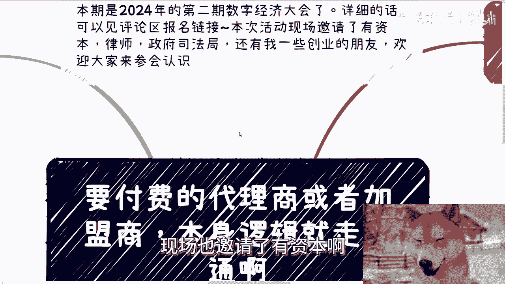
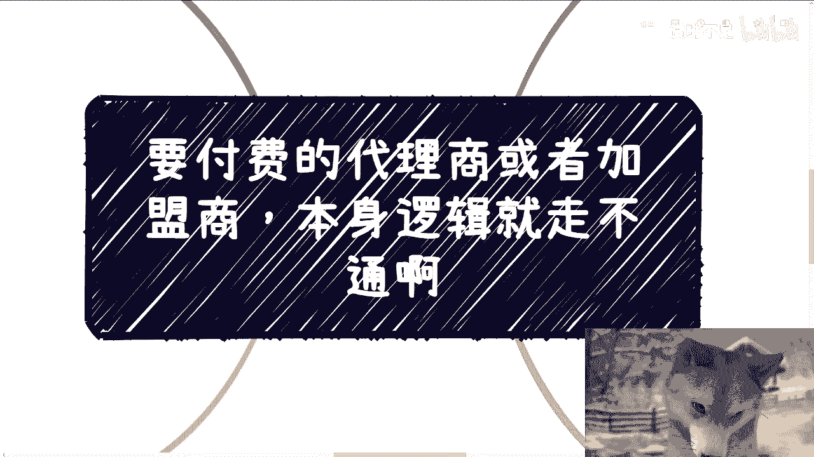
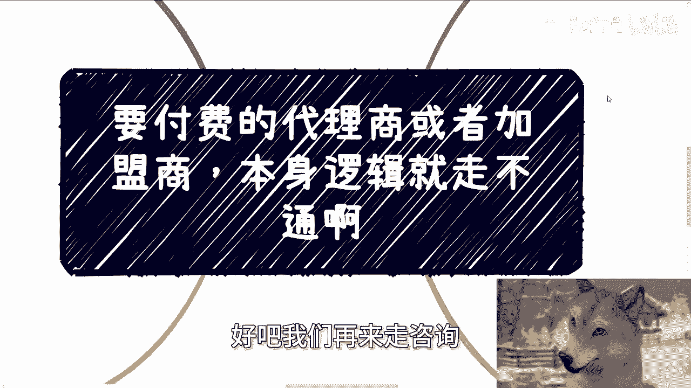

# 付费的代理商或者加盟商，项目方永远稳赚不赔 - P1 - 赏味不足 - BV1eiH1eaEK4

首先大家好啊，这个我们今天来讲这个主题呢是要付费的，这个代理商或者加盟商啊，本身逻辑他就是走不通的。

那么呃我们首先先说下一期活动啊，下一期活动已经定了9月8号啊，在上海，那么本期呢是2024年的第二期，数字经济大会啊，那么详细的话呢可以见评论区，也可以见我今天发的那个动态。

反正报名链接里面就是所有的议程啊，嘉宾啊都在里面，那么本次活动呢现场也邀请了有资本啊。

律师啊啊，还有我的一些创业伙伴好吧，然后欢迎大家过来认识，反正我相信这些这些嘉宾呢，就是现在就算帮不上你们啊，未来多多少少可能跟你们嗯。

你们都有求，肯定是他们能帮得到你们的啊。

那么首先呢先说前两天的一个事啊，就有评论问我，我都搞不懂这种评论到底是真的，他有这个问题呢，还说是过来钓鱼的对吧，我就搞不懂了啊，妈的是蠢还是坏啊，就很奇怪啊，就是他问我，他说怎么分辨贿赂跟收礼啊。

你送礼物是为了积累关系去拓展关系的啊，那么无论贿赂还是收礼，跟你都没有吊关系，对不对，因为你不是收礼那一方啊对吧，这是对方要去考虑的问题，跟你有啥关系呢对吧，那你多操这份心，这份心干嘛呢，其次啊。

我跟你讲，这就很好玩，那我就要问了，你告诉你你那那我回答是怎么回答，我说你告诉我风怎么分辨，你来给我回答，回答对吧，别老问我这种问题啊，也别老问我这种他妈赚不到钱的问题，这种问题有什么好问的，对不对。

我跟你讲蠢和坏，你肯定占一个，就这么回事啊，然后还有一个私信啊，就把我问笑了，就他那意思就是说啊这个我想创业啊，我要赚钱啊，我还要稳定，我还要有固定的休息，问我能不能帮忙介绍诶，我他妈奇了怪了。

那我可能跟你们跟跟那个人啊，活可能活在不是一个星球上面。

那你先别说我帮不帮他介绍了，谁给我介绍一个是吧，嗯那么第二啊。

我看到有人问我，他说付费代理是不是丙啊，是不是画饼啊，其实我蛮伤心的，我也觉得这个社会蛮悲哀的，为什么，因为到今天到2024年啊，甚至就是看我的视频的人里面，他竟然还会有人问出这种问题。

我说实话我是不明白的啊，因为在我理解大家都是高材生啊，都是大学生，都是读过书的，就这个事情逻辑难道就想不明白吗，啊你说一个代理或者加盟为什么需要保证金呢，哎那么奇了怪了，你拿你跟我说啊。

因为他们要实实体的这个装修，因为他们实体要有要有成本，那我还是那句话呀，他有没有什么关我们吊事，哎奇了怪了，那凭什么我们要保证金呢，保证什么东西呢，保证我们不跑路，那要跑也是他跑路啊。

你听到过加盟商跑路了，对不对，难道是因为他而而而而，或者说难道是因为他们的材料足够，那个需要保密吗，还是怎么说，如果真的很保密对吧，就国国密级别的国家机密级别的，那为什么还需要加盟商呢。

呃自己直营不好吗，哎你按我的话来讲，他妈的他有钱自己不赚，给你赚，有毛病啊，对不对，所有的保证金或者事先付款，本身他就是一种集资啊，没别的作用了，咱从合作角度来讲，比如说我是我项目方，是项目方。

我来参加的目标是赚钱，又不是来付钱的，对不对，你向魔方有任何的要求，关我吊事啊，啊，项目方如果跟我说，要保证金或要别的东西需要付的，我的逻辑就是关我屁事，我为什么要付不付，怎么了，不能做了，对不对。

那事实是不付不是不能做，只不过是在这个项目方这边不能做，在这种这这个项目方这边定制出来，这种要保证这个规则的地方，我们不能做对吧，那他为什么要定了，他不就是不让我们白嫖吗，对不对，这就好像什么。

这就好像哪一天你们跟我说下，陈老师，我们合作，我说好的呀，可以的呀，我说你跟我合作，你先付我2万保证金，那我就奇怪了对吧，那你也奇怪呀，哎那那2万保证金保值什么东西呢，我怎么回答，我根本就不用回答。

为什么，因为我根本就不关心你们。

谁不愿意愿愿不愿意付，因为什么，因为总有人愿意付他妈的社会，就这个逻辑你们懂了没有对吧，第三啊，我们以前就说过。

赚钱的核心无非是买跟卖，对不对，那么买跟卖的核心是什么，是产品跟流量啊，那么无论实体店还是虚拟产品，他们都会告诉你们，你们先要付保证金，然后产品啊，店铺啊他们来提供对吧。

当然实体的话可能装修还需要你们来支付一下，对吧，那么问题来了，我我接下来就要问了，产品是什么，如果我付了，因为因为一般来讲啊，你们的加盟商或者你们的那个呃叫什么，就是代理费啊，一般来讲都是几万块钱。

那我就问我付几万块钱，请问流量保证吗，你是帮我引流呢，还是怎么地呢，对吧，我都不说变现的数据了，就单纯公寓流量你给我吗，给我多少转化率多少能保证吗，写在合同上吗，对吧，我就这样说。

你们所有看到几乎所有的代理跟加盟，都不会把这些写在合同上，为什么，因为你们付的是加盟费对吧，别的他们不管说白了什么产品，什么流量关他们吊事，他们只管收钱，所以到现在为止，用你们高材生的脑子思考一下。

你说这是不是饼啊啊，你说这是不是贩卖未来呢，你但你的钱是真金白银出去的，你说是不是丙瞒了，这他妈还用问呐对吗，第四赚，你说赚到钱有没有，总有的，其实大家要明白，所谓击鼓传花并不是真的赚不到钱。

而是要看谁跑得快，谁都不愿意相信自己是最后一个接棒的人，对不对，其实代理跟加盟和纯粹的击鼓传花，还是有点区别的，代理跟加盟商其实对于付钱的人，而言很吃地理位置很吃城市，还有市场占有率的影响。

你们想想看是不是对吧，我们就假设一张白色地图，今天开始染成黑色，其实你会发现本质还是技不过传话，因为为什么，因为最新开始染的那些人或者店家，他一定是能赚到钱的，因为整个地都没人染过对吧，那利润也高。

那慢慢慢慢的染染的地方越来越多了，那么利润也就越来越少了，那么问题就在于你加入的时候，你根本就不知道整个地图什么样子，也不知道别人是不是已经退出了，的还不是两三万，23万45万45万往里面投。

那我就问了，这是不是饼干对吧，所以我一直跟大家讲，无论什么代理，对于项目方而言，他们都是稳赚不赔不赔的，我他妈管你现在是第几个人啊，对项目方而言，他你他收34万，他亏个屁啊，对不对，他是纯赚，而你呀。

你反而作为一个莫名其妙的一个一个付钱方，对吧，人家都说什么，就都说付钱应该是大爷对吧，父亲应该是甲方，变成了一个乙方，然后还自己想办法在那边哦，我要回本对吧，然后风险全部在你手上啊。

全部在你身上，那个项目方式没有风险的，你说是不是画饼了，卧槽到今天还要问这个问题吗，啊我不知我说实话，我是真不明白你们是是怎么长大的，我也不明白你们是怎么被教育大的对吧，我一点不都不理解。

为什么到今天为止，还有人会认为付钱的东西莫名其妙，交钱的东西，什么保证金的东西会是不是丙这种问题，这难道不应该就他妈默认就是个骗局吗，有什么好想的呢，那么奇了怪了。

对吧，好吧啊，那就这么着吧好吧，然后那个我们待会会讲另外一个案例，这个案例呢跟这个叫什么，就这个代理商跟加盟商，还还还真有那么点关系啊，好啊，那么报名的话继续报名好吧，评论我会在评论区置顶的报名链接。

然后剩下的话就你们工作上面职业规划啊，你们的这个副业啊，主业啊啊副业啊，或者跟别人的商业合作啊对吧，里面涉及到一些合同啊，分红啊，丰润啊，商业计划书啊，白皮书啊对吧，这个股份啊，估值啊，融资啊等等等啊。

只要跟商业有关的，你们觉得需要通过跟我的沟通，给你们带来更呃直观的，更接地气的规划和建议的话，或者说让你们少走点弯路的话，那么你们可以整理好对应的问题跟个人背景，好吧。

