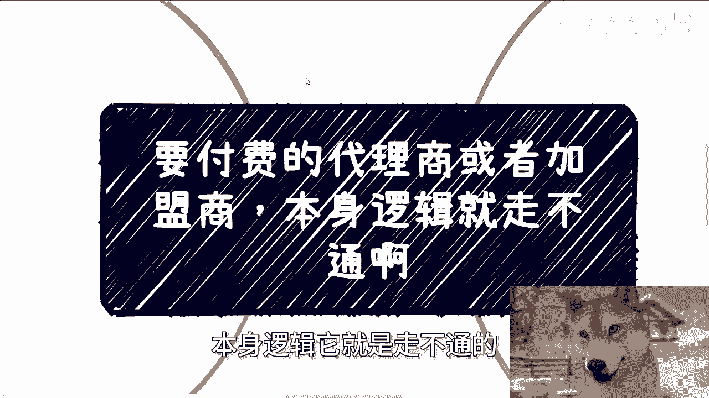
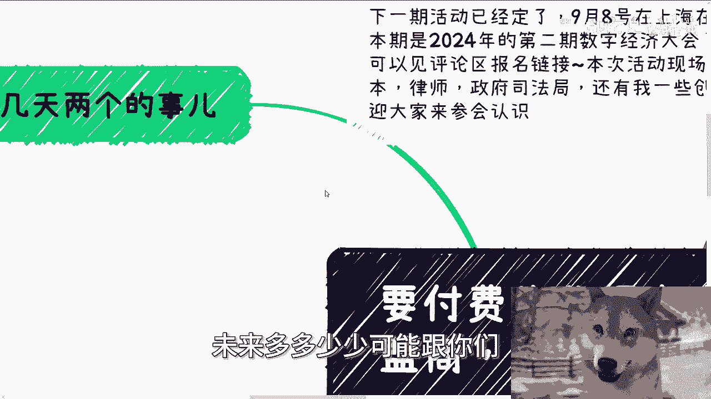
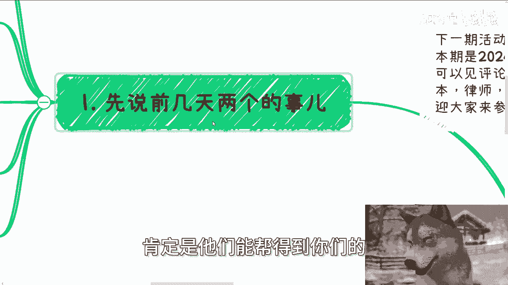
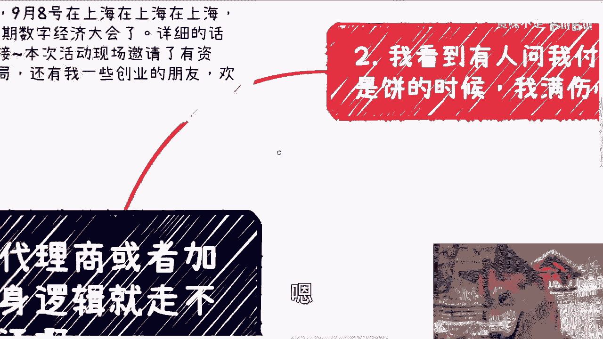
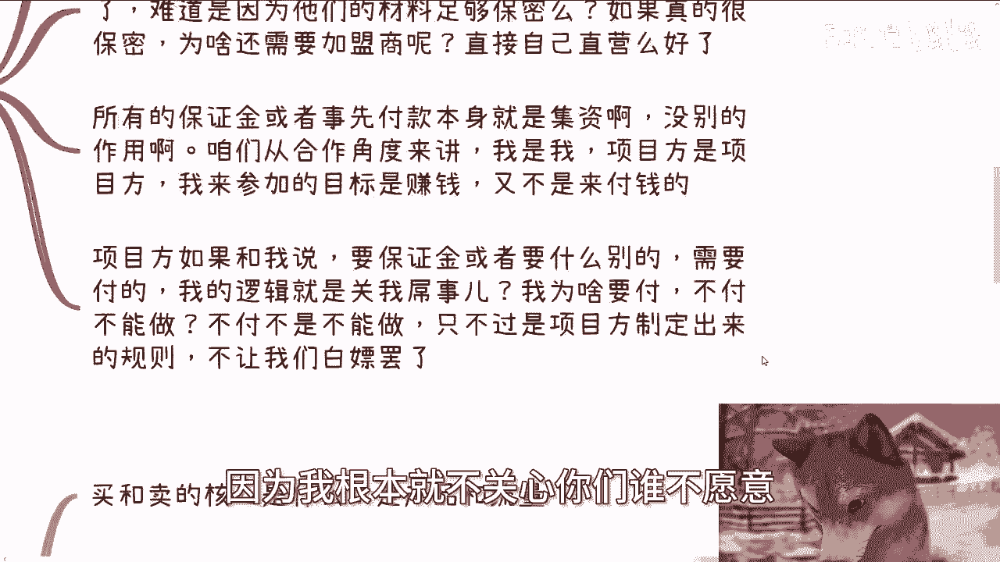
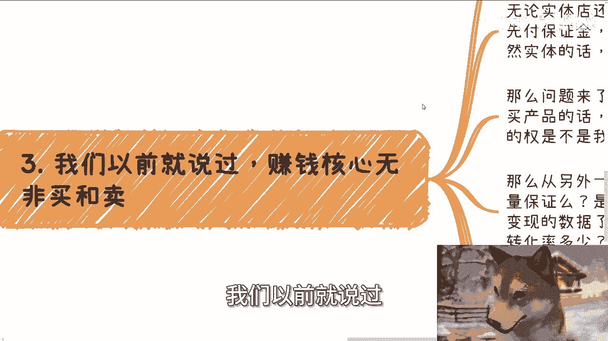
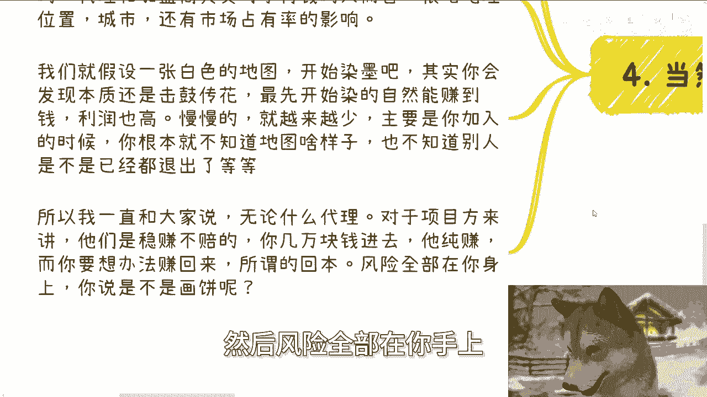

# 课程名称：识破付费代理/加盟陷阱 🚫 - P1

在本节课中，我们将要学习如何识别和分析那些要求预先付费的代理商或加盟商模式。我们将剖析其内在逻辑，理解为何这类项目对发起方（项目方）而言几乎是“稳赚不赔”的，而对参与者则风险极高。

## 课程前言与活动通知

下一期活动已定于9月8日在上海举行，这是2024年的第二期数字经济大会。详细议程、嘉宾信息及报名链接请见评论区或我今日发布的动态。

本次活动现场邀请了资本方、律师以及我的创业伙伴。欢迎大家前来交流结识。这些资源或许当下未能直接助益于你，但未来很可能在你需要时提供帮助。

## 对几个常见问题的回应

在进入正题前，先回应近期收到的两个颇具代表性的问题。

**问题一：如何分辨贿赂与收礼？**

送礼是为了积累和拓展关系。至于行为被定义为“贿赂”还是“收礼”，这是收礼方需要考虑的问题，与你作为赠送方无关。不必过度纠结于此。

**问题二：想创业赚钱，还要稳定和固定休息，能否介绍项目？**

提出此类要求，或许意味着我们对于“创业”的理解存在根本差异。创业本身伴随着不确定性和高强度付出，追求稳定与固定休息的“创业”机会几乎不存在。

## 核心议题：付费代理/加盟的逻辑陷阱

上一节我们回应了一些基础疑问，本节中我们来看看付费代理或加盟模式的核心问题。

### 1. 保证金与预付费用的本质

有人问：付费代理是不是“画饼”？时至今日仍有此问，令人费解。

我们思考一个基本逻辑：项目方收取保证金或加盟费的目的是什么？常见的理由是：实体店需要统一装修、物料有成本、防止加盟商跑路或泄露机密。

然而，这些理由均站不住脚：
*   若涉及高昂实体成本或核心机密，项目方为何不选择直营而非要发展加盟？
*   防止加盟商跑路？更常见的案例是项目方跑路。
*   **核心在于：所有要求参与者预先支付大额费用的行为，本质上都是一种“集资”**。

从合作角度看，参与者的目标是赚钱，而非付钱。项目方任何需要我方预付资金的要求，其逻辑都是：你若不付，就无法参与。但这并非不能做，只是不能按这个（不合理的）规则做。项目方设定此规则，就是为了筛选掉不愿“付费入场”的人。

因为社会总有人愿意支付这笔钱。

### 2. 商业的核心：产品与流量

我们之前说过，赚钱的核心是 **`买与卖`**，而买与卖的核心是 **`产品`** 与 **`流量`**。

付费加盟模式通常承诺提供产品、品牌甚至店铺装修。但关键在于，你支付的数万元加盟费，购买到了“流量”吗？

*   项目方保证为你引流吗？
*   保证多少曝光量或转化率吗？
*   这些会明确写入合同吗？

**答案是：几乎都不会。** 因为你支付的是“加盟费”或“代理费”，项目方只管收钱，至于产品是否畅销、流量从何而来，风险完全转移给了你。

用你的钱，去赌一个对方不承担任何责任的未来，这是否是“画饼”？你的真金白银已经付出，而对方的承诺却虚无缥缈。

### 3. “击鼓传花”与市场饱和

有没有人通过加盟赚到钱？有。但这类似于“击鼓传花”游戏，关键在于你是否在早期入场以及能否及时退出。

这种模式受地理位置、城市和市场占有率影响极大。想象一张白色地图（空白市场）被逐渐染黑（加盟店覆盖）：
*   **早期入场者**：市场空白，竞争少，利润高，可能赚钱。
*   **后期入场者**：市场渐趋饱和，利润摊薄，风险激增。

问题在于，当你支付数万乃至数十万加盟费时，你根本无从知晓自己是第几个“染色者”，也不知道已有多少参与者退出。你投入重金，却是在赌一个信息完全不透明的局。

### 4. 风险分配的真相

无论代理或加盟进行到第几轮，对于项目方而言，其商业模式几乎都是：

**项目方利润 = 收取的加盟费 - 极低的品牌/物料支持成本**

这个公式的结果几乎总是正数，意味着项目方**稳赚不赔**。所有市场风险、经营风险、流量压力，全部由支付了费用的“乙方”（你）来承担。

原本付钱方应是“甲方”，在此类模式中却沦为承担全部风险的“乙方”，还需苦苦思索如何回本。这本身就是一个极不平等的结构。

## 总结与建议

本节课中我们一起学习了付费代理与加盟模式的深层逻辑。

1.  **本质是集资**：预付保证金或加盟费，核心是项目方进行无风险或低风险集资。
2.  **风险完全转移**：项目方通过合同规避了为产品与流量结果负责的义务，将经营风险全部转嫁给加盟方。
3.  **类似击鼓传花**：成功与否取决于入局时机和市场饱和度，后期入局者风险极高。
4.  **不对等的关系**：付费方并未获得相应的权力保障，反而承担了几乎所有风险。

因此，面对任何要求预先支付大额费用的“机会”，都应保持高度警惕，默认其存在不合理性，并仔细审视合同中的责任与风险分配条款。

对于职业规划、副业、商业合作中的合同、股权、融资等实际问题，如需更接地气的建议，可以整理好具体问题和个人背景进行交流。

---
**报名链接已置顶于评论区。**