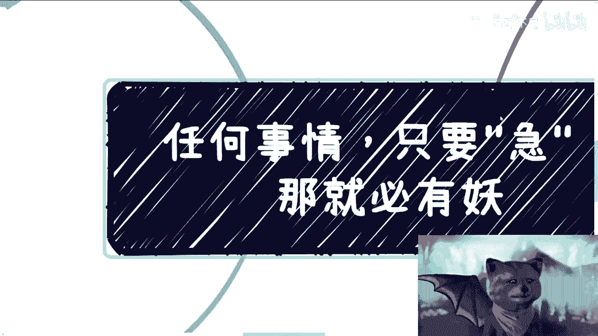

# 课程 P1：识别“着急”背后的风险 🚨

在本节课中，我们将要学习一个重要的生活与职场原则：**任何事情，只要对方让你感到“着急”，背后通常隐藏着问题或风险**。我们将通过多个场景分析，帮助你识别并规避这些潜在的风险。

---

## 概述：为什么“着急”是危险信号？

“着急”本身是正常的情绪，但若一方持续地、不合常理地向你施加压力，催促你快速做出决定或行动，这往往是一个危险信号。这种现象背后，通常意味着对方缺乏规划、管理不善，或其提供的服务或机会本身存在问题。

上一节我们概述了核心观点，本节中我们来看看“着急”在工作场景中的具体表现。

## 一、 职场中的“催命符”

在工作中，持续的、无章法的催促是管理无能的表现。

以下是几种典型的工作场景：

1.  **领导或老板频繁更改需求并催促**：如果领导或老板频繁改动需求并不断催促你完成，这通常说明他们**缺乏管理能力**和**项目规划**。公式可以表示为：`频繁催促 + 需求变动 ≈ 管理混乱`。跟随这样的管理者，职业发展前景有限。
2.  **面试后要求快速入职**：无论公司背景多么光鲜，如果对方在面试后表现出异常的急切，催促你立刻入职，这通常是个陷阱。背后的逻辑是：`急切要求入职 ≈ 岗位或公司存在隐藏问题`。
3.  **合作方在谈判阶段过度催促**：在商业合作尚未敲定、双方仍在评估的阶段，如果一方不断催促签订合同或成交，这往往意味着：`催促成交 ≈ 对自身服务缺乏信心` 或 `服务本身不靠谱`。其动机可能是“能割一个是一个”。

---

上一节我们分析了职场中的催促现象，本节中我们来看看催促行为本身所暴露的个人或组织缺陷。

## 二、 “着急”的本质是无能狂怒

不合常理的催促行为，本质上暴露了催促方的无能。

以下是其核心表现：

1.  **缺乏应对紧急情况的能力**：即使事情本身确实紧急，一个有能力的人或组织会有预案和章法。如果对方只会通过不断打电话、发消息来施压，说明他们**没有能力处理紧急状况**，合作未来必然爆雷。
2.  **没有并行方案，风险集中**：健康的业务或合作会有多套备选方案。如果对方把所有希望都压在你这一条线上，并因此疯狂催促，说明他们**没有其他靠谱的选项**，风险极高。这可以类比为：`把所有鸡蛋放在一个篮子里`。
3.  **情绪不稳定，不适合商业合作**：商业合作最忌讳与“缺钱”或“急于求成”的人共事。因为“急”会导致不择手段和决策失误。公式为：`越急于表达 ≈ 越缺乏某物`；`情绪不稳定 ≈ 高风险合作对象`。

---

上一节我们剖析了催促行为的本质，本节中我们将探讨如何建立正确的应对心态和行为准则。

## 三、 如何建立健康的互动节奏

无论是避免被催，还是避免成为催人者，都需要建立健康、平稳的互动节奏。

以下是几点行动建议：

1.  **相互评估是基础**：任何重要的合作关系（雇佣、商业、个人），都需要一个**相互评估的过程**。如果一方跳过评估，直接要求快速推进，这件事或这个人大概率不靠谱。就像看病，好医生一定会详细问诊，而非直接开药。
2.  **保持规划性沟通**：要有基于时间节点的、有规划的沟通，而非情绪化的催促。否则会给对方留下“你无事可做”或“能力有限”的印象。
3.  **树立“不亏欠”心态**：在合作中，双方是平等的。你**不亏欠**任何人一个仓促的决定，别人也不亏欠你。例如，提供帮助与否，应基于自愿而非压力。健康的互动模式是：`自愿提供 + 尊重对方节奏 = 可持续关系`。
4.  **警惕“白嫖”心态**：如果对方在向你索取重要资源或帮助时，连基本的关注和尊重（如关注你的动态）都不愿意付出，这本身就是一种不健康的“着急”，应果断远离。

---

## 总结

本节课中我们一起学习了“着急”背后的风险逻辑。我们了解到：

*   **“着急”是重要的风险预警信号**，尤其在职场招聘、商业合作等场景中。
*   **催促行为暴露了对方在管理、规划或情绪上的缺陷**，本质上是“无能狂怒”。
*   **建立健康的互动节奏至关重要**，这包括充分的相互评估、有规划的沟通以及平等的“不亏欠”心态。

记住这个原则：**任何事情，只要让你感到不合常理的“着急”，背后必然有“妖”**。主动规避这类情境和人，是保护自己、降低风险的有效手段。

---
**附注**：对于个人职业规划或具体决策有疑问，可以整理好问题后私下咨询。一切交流基于相互尊重和自愿原则。