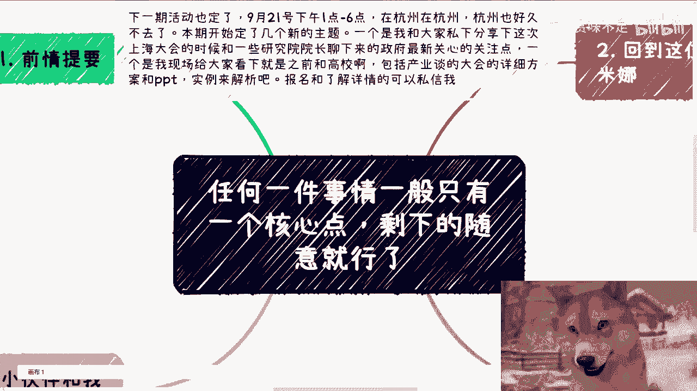

# 任何事情只有一个核心点-剩下都用草台班子的方式就好了---P1---赏味不足---BV1ot4He7

在本节课中，我们将学习一种高效的工作与思维方式：**任何事情通常只有一个核心要点，其余部分可以简化处理**。我们将通过几个具体案例来理解如何识别核心，并避免在不重要的细节上过度消耗精力。

---

## 活动预告与主题引入

下一期线下活动已定于9月21日（周六）在杭州举行。本期课程将开始几个新主题。

我会私下分享在上海大会期间，与一些研究院院长交流后了解的政府最新关注点与相关动向。同时，我会现场展示之前与高校及产业方洽谈大会的详细方案和PPT，进行实例解析。报名与了解详情请私信。

今天我们讨论的主题是：**任何一件事情，通常只有一个核心点，剩下的部分随意处理即可**。

也可以理解为：**任何一件事，只有一个核心点，剩下的用“草台班子”的方式，想怎么来就怎么来**。

---

## 案例一：培训与咨询的撮合

前情提要是，一位小伙伴咨询关于他撮合培训与咨询项目的事。这类撮合无非涉及讲师方和客户方。

我先插个题外话。例如我们自己寻找讲师时，通常要求试讲10分钟。原因在于，培训或咨询，尤其是需要与客户线下打交道的，最重要的只有两点：
1.  **逻辑思维**
2.  **普通话**

**逻辑思维**能让听众觉得此人很能讲，且听起来有道理。关键在于能否自圆其说、不冷场、内容有趣。许多所谓的讲师、老师或专家只是读PPT，实为浑水摸鱼。

**普通话**的重要性不言而喻。试想，若我用浓郁的地方口音和不标准的普通话做视频，内容再有道理也无济于事。这不是歧视问题，而是社会现实。对于资本家、政治家或企业家而言，他们可能就是在歧视你，但你无能为力。

回到这位小伙伴撮合的事情上。很多时候，我们并非想做表面功夫。但正如之前所说，许多看似技术能力强、经验丰富的人，却讲不好课，这毫无用处。

例如，你找到了阿里、百度、清华北大的专家，头衔听起来很厉害。但只要此人逻辑思维不足或普通话不标准，那么再大的头衔也无用。顺便提一句，能进大厂或读清华北大，并不代表具备逻辑能力，这两者没有因果关系。

许多人可能和这位小伙伴一样，找到的人选让客户反馈一塌糊涂。我们要做的就是**只解决核心问题，其他都不重要**。

对于培训咨询，核心要点是：**让来的人听得舒服、能听懂**。听着舒服、普通话标准、有逻辑性。至于能否学到东西，并不重要。茶歇、现场环境等更是次要。

---

## 案例二：与政府或企业领导谈业务

当我们需要与政府或企业领导谈业务时，目的是让对方出钱，达成合作。

那么，你的团队、产品、你是谁，这些重要吗？如果你只是普通人，这些都不重要。

核心要点是：**想领导所想，让领导开心**。至于领导如何才算开心，每个领导痛点不同。有的需要满足当地政府或企业的KPI，有的需要找到合适的切入点。

举例来说，如果你去谈人工智能业务，但对方所在的城市、部门或政府条线今年根本没有人工智能相关的预算或项目名目，那么合作就不可能达成。这与你的团队、产品或个人背景毫无关系。

我一直强调要果断断舍离。因为我们是普通人，只能费尽心思攻克一个核心痛点。攻克了，就能成功。剩下的部分，用“草台班子”的方式处理即可。我们不可能面面俱到。

---

## 案例三：流量变现的简化思路

之前有小伙伴提到想利用手上的流量变现。我当时的建议是：**简单化**。

你的逻辑可以翻译为两点：
1.  你怎么赚他们的钱？
2.  他们的痛点是什么？

赚钱可以通过三方支付、企业支付甚至个人支付。痛点则需要根据客户年龄、性别、用户画像等来确定一个通用性较强的。

沟通时，对方问我是否需要做软件平台、注册公司、拉群或社区运营。我说，大哥，你做事情为何要如此复杂？你的目标就是流量变现。

你知道“快团团”吗？直接上架一个产品，发到群里。或者直接开一个“知识星球”，把二维码发出去不就好了吗？想这么多干嘛？

我觉得很奇怪，我们明明是为了达成目标、赚到钱，但大家在没有能力把事情做得很好的情况下，却总想着做得复杂。这有什么意义呢？

很多人其实很简单：**明明什么都没做，没赚到钱，却在从0到1的阶段思考事情要做多大、所谓正不正规、要投入多少钱**。这很奇怪。你是钱多没处花，还是天生冤种？正不正规，关你什么事？

每次沟通时，我都会说：你知道吗，你们给我一种感觉——**你们压根就不想赚钱**。他们不认同，说“老师，我很想赚钱”。我说，你的行为没有让我感觉你想赚钱。

第一，你所有的核心思考点都不在赚钱上，而是在那些有的没的上。
第二，你的思考周期很长，都是半年、一年。现在哪有项目需要思考半年一年的？思考半年一年，还跟我说想赚钱？

所以我觉得世界很割裂。很多人自己确实是普通人，也很焦虑、很苦，但就是没有驱动力朝着赚钱或落地的方向走。你说这怪谁呢？回到我上上个视频说的：**可怜之人必有可恨之处**。

怎么办？没有办法。你跟他讲了，他不听。他非要来说：“陈老师，我觉得我不太行，我不知道怎么样。”那你不太行就不太行呗。如果你觉得自己不太行，还能翻身、改变，那我只能说中国老百姓早就财务自由了，人均一个王思聪了，但这不可能。

---

## 总结与下期预告

本节课我们一起学习了“**聚焦核心，简化执行**”的思维模式。我们通过培训咨询、商务洽谈和流量变现三个案例，分析了如何识别一件事的唯一核心点，并学会将非核心部分用最简化的“草台班子”方式处理，从而避免精力浪费，更高效地达成目标。

下一期活动是9月21日（周六）在杭州。详细情况请私信报名。

此外，在工作、职业规划、商业、副业、与人合作、合同、估值、融资等方面，如有任何问题，或希望沟通后能少走弯路，请整理好对应的问题与个人背景再联系。

---