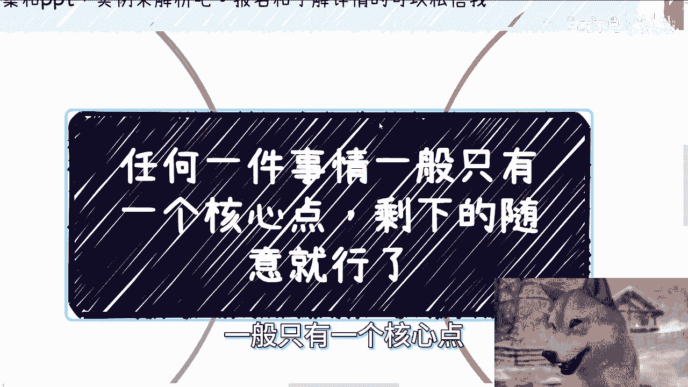
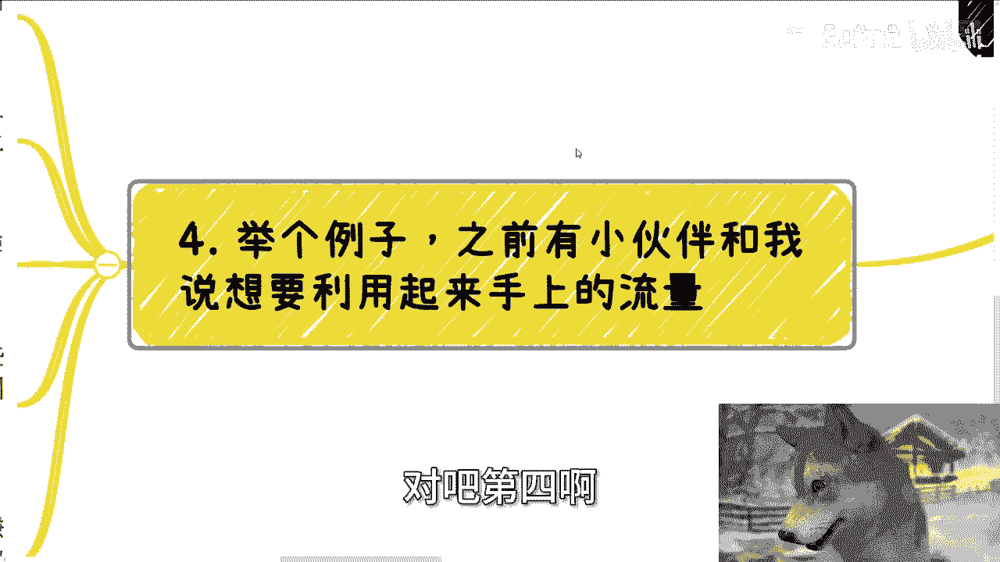
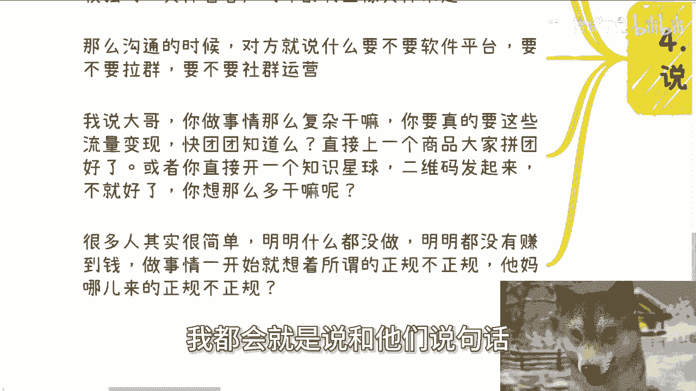
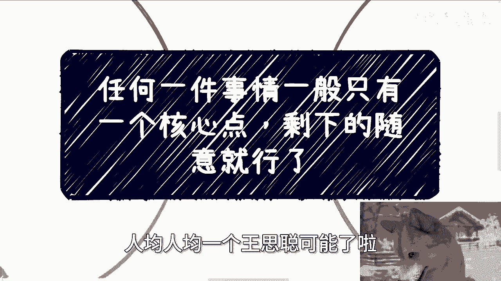

# 任何事情只有一个核心点，剩下都用草台班子的方式就好了 - P1 - 赏味不足 - BV1ot4He7EgY

好这个大家好啊，我们来讲今天的这个另外一个主题啊，首先呢这个下期活动我也定了9月21号啊，9月21号就是下周，21号礼拜前礼拜六啊，礼拜六在杭州好吧，然后杭州呢也好久没去了啊，本本期呢开始几个新的主题。

一个是我会跟大家私下分享一下，这次上海大会的时候，我跟一些研究院的院长聊下来，一些政府最新关心的一些关注点，还有一些相关的动向吧，啊然后呢一个就是说我现场会给大家看一下，就之前跟高校啊。

包括产业谈的大会的一些详细的方案和PPT，好吧，就实力来解析一下啊，那么报名跟了解详情的可以私信我啊，那么今天我们来讲这个主题呢，叫做任何一个事情，一般只有一个核心点呃，剩下的其实随意就可以了。

那你们也可以理解为就是说任何一件事情呢，一般只有一个核心点。

剩下的呢就他妈草台班子，想怎么来怎么来就行啊，那么前情提要啊，就是说之前有个小伙伴来咨询的时候，跟我提过这么一个事啊，就是说他撮合了一个培训跟资或者咨询啊，那么我们就这么来讲，他撮合个培训跟咨询。

无非也就是说一个是讲师方，一个是客户方嘛，对不对啊，我先插个题外话啊，你比如说先说我们自己找讲师，就比如说我们啊，我或者我的一些合作方找讲师啊，一般都是要试听10分钟的，为什么，因为培训也好，咨询也好。

尤其是跟客户这种线下当面要打交道的，五重要的就两点，一逻辑思维，二普通话没了啊，你不要来跟我说什么，讲的内容专不专业不存在的啊，讲的内容好不好，不存在的，为什么，因为对方听不懂，不要来讲这些东西。

你认为它很重要，我告诉你TMD屁都没有用，明白吗，那么逻辑思维呢，主要是让别人听起来这个人很能讲，而且听上去很有道理，对说白了就这个人到底讲的有没有道理，我不关心，听上去能忽悠，能自由其自圆其说。

不能人不能冷场，这就是我要要啊，第二而且讲的内容也很有趣啊，那么很多所谓的讲师，所谓的老师，所谓的这些mental都是停留在读PPT或者文字上面，很多都是浑水摸鱼的，就出来骗钱了啊，这他妈很离谱。

但是从你们来讲呢，你们可能分辨不出来啊，这个我们后面会来说的啊，那么第二点普通话就更别说了啊，你们想象一下，我给你们做视频，操着一口浓郁的地方口音，并且完全不标准的普通话，我他妈说的再有理有卵用啊。

你们仔细想看，我跟你们讲，这不是歧视不歧视的问题，你放到社会上面，就是别人对你没有好的印象，对不对，你说再退1万步来讲，你说他其实对资本家跟跟跟政治，政治政治家或者说这些企业家就他妈歧视你，怎么了呢。

怎么了呢，你能把他怎么样。

对不对啊，第二回到这位小伙伴。

这个这个撮合的这个事情上面啊，就是其实很多时候呢我们要做，我们嗯你就这么想，是我们想做表面功夫吗，但并不是，那就如我们之前说的很多这种事情，看似很有技术能力的，很有经验的人，但是他讲不来呀，有卵用啊。

是不是你比如说你找了阿里，百度清华北大的对吧，什么五道口金融专家啊对吧，什么东西听上去很牛逼，你可能啊觉得自己千辛万苦找到的啊一个专家，但只要这个人不能讲，就像我刚刚说的，这个人如果逻辑思维不够。

或者说这个人普通话不标准啊，也就是呃我说的这两点如果他都没有的话，那你找的这个人单纯的这种头衔大不大，没有用啊，啊而且顺便提一嘴，能去大厂和能读清华，清华北大的，并不代表他有逻辑能力。

谢谢啊啊没有人跟你们讲这两者有因果关系的，非要你非你们非要自己把他们联系起来，那他妈怪谁啊，对不对，那回到这件事情本身啊，也许很多人和这个小伙伴一样啊，就找了一些人呐。

然后客户反馈一塌糊涂或者非常糟糕啊，那么我们接下来要说的就是，我们只要解决核心的一个问题，别的都不重要，你比如说培训咨询这个事情，核心的要点就是让来的人听得舒服，能听得懂对吧，听着舒服，普通话听得懂。

有逻辑性，至于为什么为什额，至于能不能学到东西，重要吗，不重要，至于什么茶歇啊，现场环境啊，那他妈就更不重要了啊，那么比如我们去找政府和企业领导谈业务，你的目的是要让对方出钱。

也就是为了你跟对方要达成这个合作，谈成这个case，对不对好，那么我们就来问你有啥团队，你有啥产品，你是谁重要吗，哦你是谁可能还是重要的，当然你可能比如说你是区长的儿子，那也许是重要的。

但是如果前提是我们是普通人的话，那么我们就问你有什么产品，你有什么团队，你是谁重要吗，重要的个屁对吧，那么核心要点是什么，核心要点是你要想领导所想，也就是说领导开心就好了，那至于你问我领导怎么算开心。

那不我告诉你，不好意思，每个领导都有不同的痛点对吧，那有的可能就是要满足当地企业政府的KPI啊，有的就是要找到对应的切入点对吧，你比如说今天这个领导所在的部门跟组织，我举个例子啊。

比如说你要去聊的是一个人工智能的业务对吧，那么但是你今天所处的这个城市，所处的这个部位，所处的这个这个这个这个怎么说呢，政府的这条线，他压根就没有人工智能相关的费用，或者今今年就没有相关的名目出这笔钱。

你非要去合作人工智能，这他妈不就是不可能吗，对不对，这跟你是谁，你是有什么团队，你有什么产品有卵关系啊，对吧啊，我为什么一直要一直要说果断要断舍离，因为我们是普通人，我们只能费尽心思去打一个点。

打中那个痛点，我们就能成功，剩下的东西我们只需要草台班子的做法就好了，因为我们是普通人，我们不可能面面俱到。

可能吗，对不对，又不是个二代对吧，第四啊。

我们举个例子，之前有小伙伴跟我说，他想利用起来手上的流量啊，啊这个事情你我当时怎么跟他讲，我说你简单化就好，什么意思呢，就是你的逻辑我帮你翻译一下，就是你怎么赚他们的，他们就是两点。

第一你怎么赚他们的钱，第二他们的痛点是什么，那么赚钱这个事情你可以走三方支付，你也可以走企业支付都行，甚至你个人报税你就走个人支付也行啊，对不对，那至于痛点是什么，那么你要找一个通用性比较强的。

具体要看客户的年龄啊，用具体的性别啊，用户画像啊等等等，你来定对不对，好那么沟通的时候，对方就问我说，哎，我说老师我要不要做个软件平台，要不要注册个公司，要不要拉群，要不要社区运营对吧，我说大哥。

你做事情干嘛这么复杂呢，你要的真的也就是所谓的流量变现，那快团团知道吗，你直接他妈的上架一个产品，直接到群里去发，或者你直接开一个知识星球，二维码直接发起来不就好了吗，你想这么多干嘛呢，对不对。

哎我觉得很多时候就很奇怪，就是我们明明就是为了就是要去做那个目标，为了去赚这笔钱，但是大家明明没有这个能力去把事情做得很好，对不对，但是还要去想想着做的很复杂，有什么意义呢，对吧就是我就跟你讲。

很多人其实很简单哦，就是明明什么都没做，明明都没有赚到钱，做事情一开始0~1就是在那边思考的事哦，我的，我要做的大不大，我要所谓的正规不正规哎，我要投入多少钱，哎，我他妈奇了怪了，你是他妈的钱多了。

没地方用，还是他妈的天生冤种，对不对，哎正不正规，关你吊事啊啊哎我这么奇了怪了对吧，所以我每次跟他们沟通的时候，我都会就是说和他们说句话。

我说你知道吗，你们给我种感觉是你们压根就不想赚钱，但他们不他们不觉得他们觉得他们跟我说爱吃。

老师我很想赚钱，我说你的行为没有让我感觉你很想赚钱啊，对不对，第一你所有的核心点思考点都不在赚钱上面，都是在那些有的没的对吧，第二你整个的这个周期思考周期也很长，他们思考项目周期都是那种半年一年的。

我说哪里有，现在还半年一年思考的，半年一年思考，你还跟我说，你想赚钱，对不对对吧，所以说我就一直觉得啊，就是说这世界割裂在什么地方，就是很多人他自己的确是个普通人，他也很焦虑，他也很苦。

但是他就是没有这种驱动力去往这个赚钱上，或者往这种落地上面去走，你说这种事情怪谁呢，就回到我跟上次说的那句，上上个视频说的那句话，叫做可怜之人必有可恨之处，对不对，怎么办呢，没有办法。

就是那种你跟他讲了，他不听，他非要来跟你说，哎哎呀，陈老师，我觉得我不太行，我不知怎么样，那你不太行呗，那怎么样了，对不对，那你要是都觉得不太行，然后你还能翻身，你还能改变。

那我就说中国老百姓早就财务自由了，人均人均一个王思聪不可能了啦。

啊好吧啊行，那么下一期活动9月21号啊，礼拜六周啊，杭州啊杭州，那么反正详细的话，反正你们就是说私信啊，我们在报名，那么剩下的话就是说工作上面啊，就是说职业规划啊，包括商业，你们做副业啊。

做一些跟别人的合作啊对吧，合同啊，估值啊，融资啊等等等啊，你们要有任何的问题啊，或者希望呃跟我沟通之后，能够让你们少走点弯路的话，那么你们可以整理好对应的问题跟个人背景。

好吧。