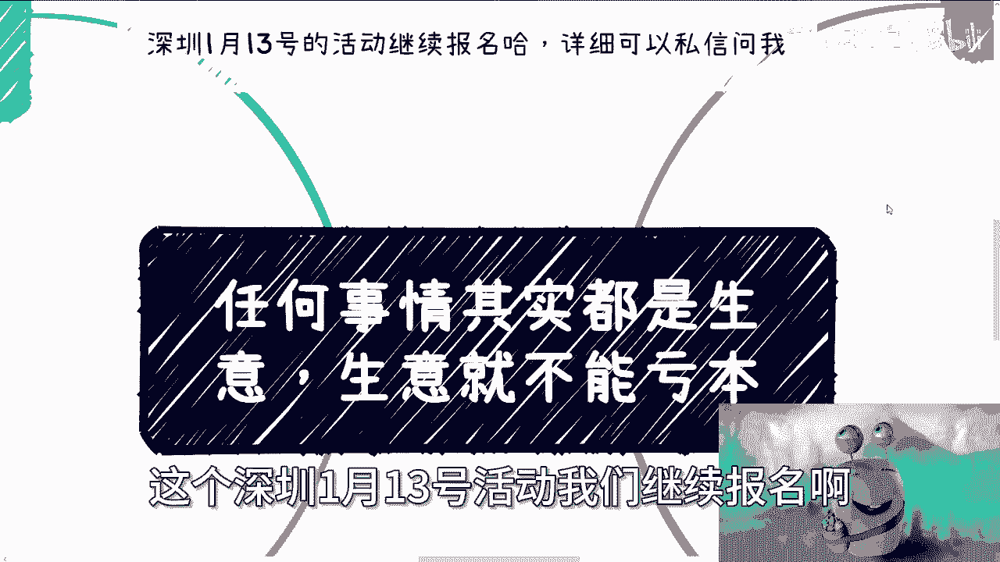
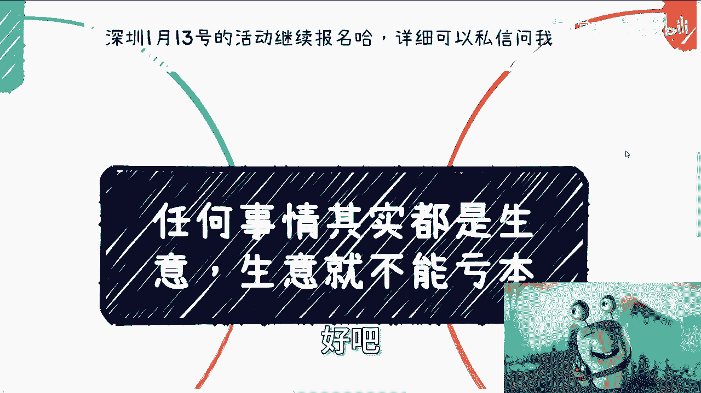
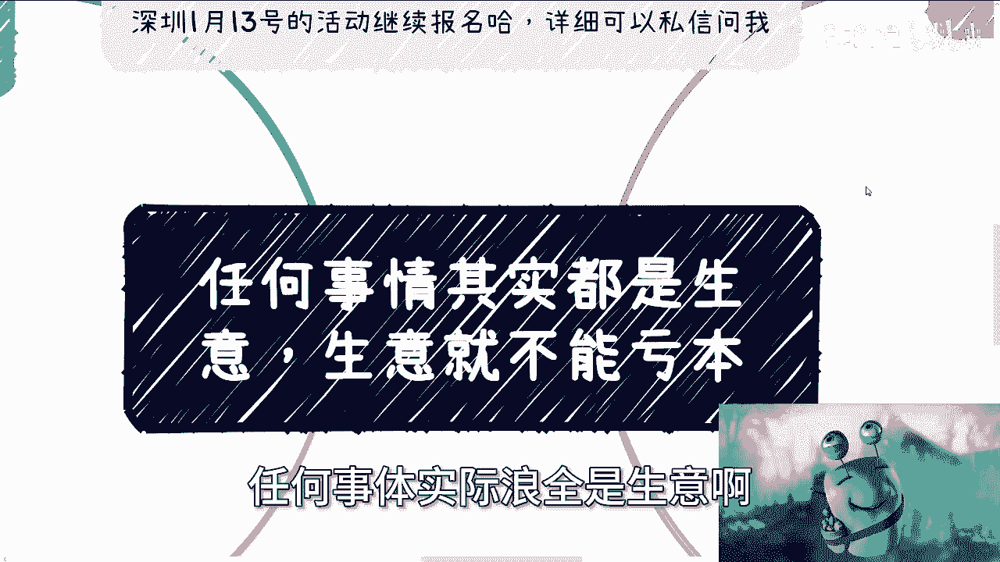
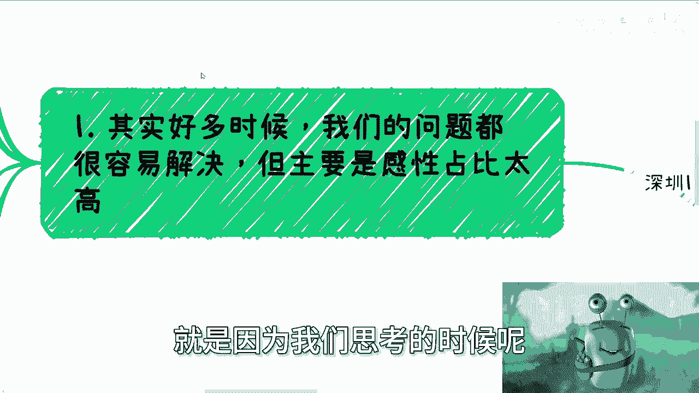
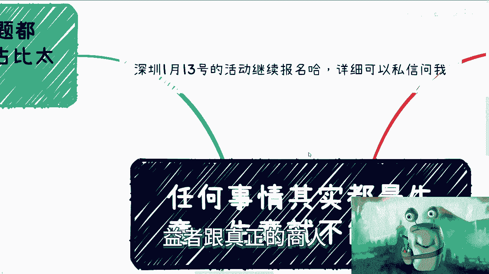
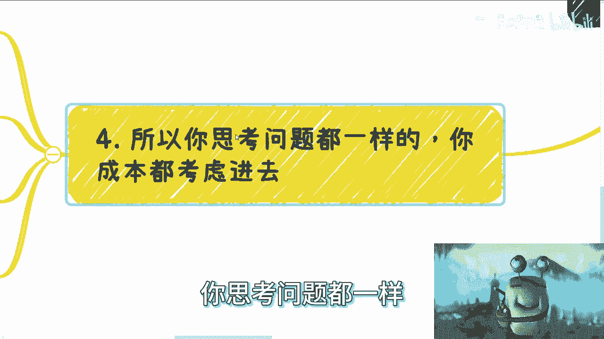
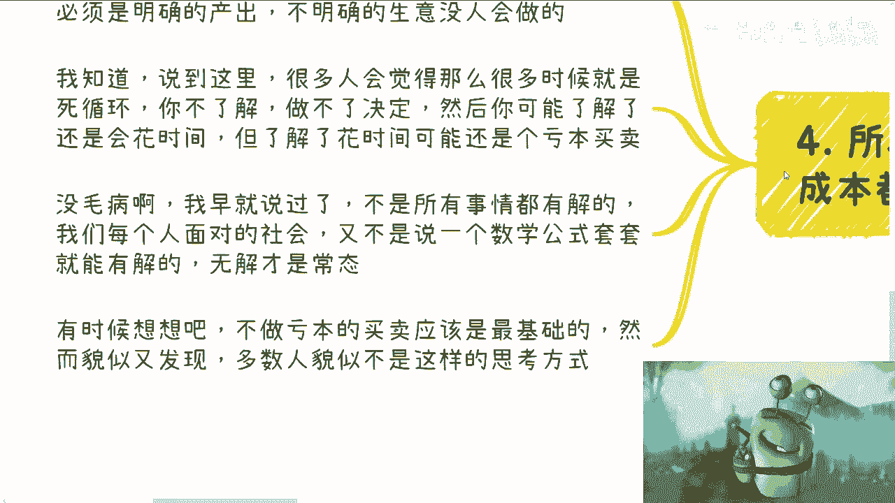
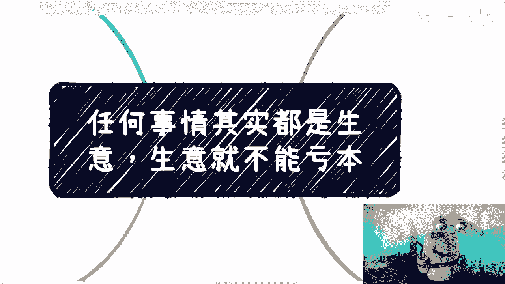

# 任何事情都是生意思维，生意就不能赔钱 - P1 - 赏味不足 - BV1HW4y1P7DQ

啊大家好，最近电视剧看多了是吧，这个哼动不动开上海话，哈哈啊咳咳，这个深圳1月13号活动。

我们继续报名啊，然后详情可以私信问我好吧。

呃那我们这一期讲的这个内容呢，叫做任何事情呢，其实都是生意啊，生意就不能亏本，这句话我来想想怎么翻译啊，我还翻译不来啊，生物日记杀鸡了。

这是上衣，上衣就不能亏本，是这样翻了，哈哈哈。

呃第一个啊，其实很多时候我们的这个问题很容易解决，但其实呢你会发现之所以不容易解决，就是因为我们思考的时候呢。

呃有太多的感性啊，在这个里面就是说你看啊我这么多人咨询下来，其实问题本质它都很好解决，他没有什么不好解决的啊，因为你要这么想，就是任何的事情啊，你有问题大家去讨论，大家去。

比如说啊这个沟通大家是什么样子，就总有办法总比问题多对啊，那么你比如说考公为啥要考公，自己想考嘛，就问下来都不知道啊，那么你考了目的又是什么啊，然后所有的矛头都指向说啊，家里让考的对吧啊。

大大大家都在考对吧，怎么样子啊，那么既然大家都在考，家里让考，你自己又不知道要不要考，那么你纠结什么东西对吧，那你纠结纠结的原因，不是因为就是说你真的纠结这个事情，而是在于说你不知道你要什么对吧。

而且你也不知道你跟着别人走，对不对，那你比如说我要不要落户，我跟你讲哎呀，落户这个东西我待会会跟你们讲的，妈的哎，我觉得真的没必要。

就是有时候装逼啊，你得有资格装，你知道吗，就是真的户口这个事，我后面会说的就是有什么用，你要我说，就像我说的，你要有资本，你要有本事可以，你要没那么大本事，你为了户口去折腾它干嘛对吧。

就为什么我们会讨论到这个问题，就是一切都是生意嘛。

就是说你考虑一个问题啊，你把那些感性的成分去掉，就是把那些什么哎呀，因为家里，因为朋友，因为环境这些都是感性问题，因为这种东西你放在就是说我投入什么东西对，就是你想啊。

你投入X你得到Y你刚刚说的这些东西，其实X也算不进去，Y也算不进去，因为所有东西都是抽象的，都是宏观的，你不能做生意，没有人去做宏观的生意的对吧，那么你想啊是不是赚钱的买卖，你凡是不知道你做一件事情。

你凡事不知道，其实都是亏本买卖，都是赌博对吧，你比如说我今天跟你说，哎陈老师给你们做生意对吧，然后你肯定问我爱陈老师，那我做的这个东西我能得到什么呢对吧，比如说你让我投入时间投入钱。

那你说我能赚多少钱呢，我跟你说哦，不知道的啊，这个东西我开始给你们，开始给你们画饼啊，绕半天，然后我就跟你说，这个东西赚不赚钱，不知道的，要看未来的趋势的，卧槽，这他妈不是屁话吗。

对不对啊，所以说真正赚钱的人，没有人会做亏本生意的啊，你去看看真正的记得利益者跟真正的商人，谁会去做这种莫名其妙模棱两可的事情呢。

不会的啊，那么第二个，我们先来说说一里面的这几个问题啊，你看啊你读个书好，你投入的是什么，是你的钱，你的时间，你的青春，对不对好，那么你读的专业是什么，你专业能干嘛，你喜不喜欢你的专业。

其实大部分人是不知道的，那当然哦哦OK我觉得也没问题，因为大部分人那个时候还小啊，咱咱可以先不说这个啊，你说还小，咱不说这个好，那么你考研考公出国总归你成年了吧，对吧好，那么你自己想你投入的是钱。

时间还有青春，你得到的是什么，OK我们撇开那些感性的对吧，你得到是什么，一张纸，一份工作，一个机会好，你不要来跟我讲这张纸，我的，未来能给我带来多少工作，或者说你你，你说这个指未来社会的认可价值有多少。

你给我带来多少工作跟认可价值是多少，这都是屁话，为什么，这都是感性抽象的语言对吧，没有任何确定的语言，你拿出来干嘛呢，你我还是那句话，你骗骗别人没问题，你不要把自己骗进去对吧好，那么你问下自己。

你说你知道怎么利用这张纸赚钱吗，你知道这份工作接下来能给你带来多长时间，以及多高的收益吗，你知道这个机会能给你带来什么，就是后续的一些些发展吗，对不对，你自己问问你自己，你代码不知道。

那么你要做的是什么，就说明这是个盲区对吧，那么你要去了解你，如果说OK我来不及了解，我没有这个时间，我马上就要考研了好，那么你不去，你来不及了解，那就意味着投入产出比就是问号，那投入产出比就是问号。

他就不应该做这个决定，为什么，因为这就是亏本买卖就这么简单啊，当然好，你说到这儿啊，说到这，有些人要说了，他说很多事情我们想不清楚的，你得走一步看一步，我告诉你啊，很多事情想不清楚，你要走一步看一步。

这他妈就是PUA的，你懂吗，你懂不懂，就是就是这种话就是真的就是鸡汤啊，很多事情想不清楚，你走走一步看一步，这他妈就是赌博，你知道吗，这就是没有做事情的方式，你有没有想过一个问题。

你今天可以走一步看一步，你未来也是走一步看一步，但是如果你的思想不改变你的做事情方式，不改变你的思考方式，不改变你走一步看一步又如何呢，这就好像你今天再做一个亏本买卖，等你读研读出来。

你还是在做亏本买卖，有什么用啊，没有用的，对吗，好第三个我来说咳咳咳咳咳咳，我来说说这个户口啊，我跟你这么说，这个事户口能不能给你带来钱，你知不知道如何利用这个户口去赚钱，一样的道理，如果你不知道。

那么我们进入下一个阶段啊，下面啊你能赚到你能赚到多多的钱，你你你你能给你的未来，给你的下一代带来多少多么多的钱，就是说很多人他觉得户口是为了下一代考虑，为了让自己的孩子能够，就是说不像自己一样对吧。

就是有个出生的时候有个户口好，没问题啊，你会发现如果要这个户口，你得好好赚钱啊，你不能说他妈的，我我你给你的孩子就是一个户口，然后然后大家日子过得很苦，你要明白到你孩子就是十几岁，20多岁。

这个世界卷的已经不要不要了，通货膨胀要到什么地步啊，对不对哦，你说我给孩子带个户口，你听上去很好听，但是他妈的在我看来你是让孩子受苦啊，你想是不是一些小伙伴觉得，户口是自己为孩子争取来的。

是为了让他出生就可以有的，那你有没有想过你孩子在上海，在北京，在深圳面对的是什么啊，他面临的是什么，你觉得有户口就是就是什么平起平坐，就是同一个起跑线，这他妈这就听着就可笑，你知道吗。

这这这哪里像一个就是2024年，成年人思考出来的问题，对不对，更卷更难，更没钱，更苦要命了啊，咋还无脑搞作孽啊是吧，哎人往高处走没有错，但是你得有这个能力往高处走啊对吧，当然啊。

我的意思是说你要能够轻而易举有机会弄户口，你当然弄，但是很多人现在弄户口是什么，是签一个合同，签5年，签10年，10年没有啊，签3年签5年有意味了，没有意义点，你你所有的时间都被绑住了。

你现在被户口绑住，未来被房贷绑住，你告诉我你图啥呢，怎么了呢，哦老家不能过啊，还是别的城市不能过。

对吧，所以你要明白你思考问题都一样。

你得把成本都考虑进去，什么意思，就是你的时间，你的青春就是你得把优先级排好，就是你的时间给你的青春，首先是无价的对吧，你在所有投入时间里面，时间跟青春应该是最优先去考虑的哦。

也就是说你应该投入尽可能少的时间，跟你的青春对吧，然后用数字算得出来的成本，比如说投入多少钱啊啊投入多少人力啊对吧，然后这个时候你的产出必须是明确的，不明确的生意没人会做的，你懂吗。

就是说我知道我说到这边，很多人会觉得很多时候他是死循环，就是你不了解，你做不了决定，然后你可能了解了要去花时间，但是了解了花时间可能还是个亏本买卖，因为你不知要花多少时间去了解，对不对，好没有毛病。

我早就跟你们说过了，不是所有事情都有解答，对不对，我们每个人面对的社会，又不是他妈带一套数学公式，你去套，我去套，大家都能解对吧，你无解才是常态，你得面对这个事实对吧，所以说就是说我们为什么要去社交。

我们为什么要去搜索呃，呃不是搜索，我们为什么要去做做做各种各样的项目对吧，就是我为什么今天要来讲这个视频，就是因为无解，对所有人来讲，这是常态，但是你不去思考，你不去改变你，你哪里会有解呢对吧。

你所有的思考方式带很多的感性啊，然后说哎呀，今天我被我的父母牵绊住了，明天被我的对象牵绊住了，后天被那个东西牵绊，主任，那到最后你这人生，你的一辈子不就是为别人买单吗，有意义吗，你有时候想想。

不做亏本买卖，这是一个人，一个活在世界上，活在人类社会，他应该是最基础的思想啊对吧，人不为己，天诛地灭，是不是。

然而你貌似发现，其实很多人貌似他妈的不是这样的思考方式啊。

对吧，所以说我觉得就是这种内容，可能依然还会有人来杠我，但是你想想看，你杠我有意义吗，没有意义的呀，因为我的所有出发点，咳咳咳，不是说跟你们讲哦，有一套解决方案对吧，比如说你们花个56万。

花个七八百买一套解决方案，没有用的，哎，这个东西，我待会我后面也会出个视频给你们讲啊，就是真正有价值的东西，你们花钱是买不到的，真的是买不到的，怎么可能买得到呢，他是个悖论啊，你明白吧。

啊你你花个几百几千，你说我们稍微去认识点人对吧，大家就是正常的就是拓展一下社交面对吧，了解一些东西，这没问题，你指望说哦，我花个几万甚至花个十几万，我他妈就买到一个什么叫什么，就是葵花宝典。

呵呵流量宝典，他们我前两天看到他们翻译叫什么叫NO jj book x，哎这翻译好信达雅是吧，就是你你买到一个这个这个，这个这个这个叫什么，就是就是就是就是人生什么走上人生巅峰，可能为啥不可能的呀。

对不啦，你今天有任何的有价值的，真的我们说说真的有价值的人或者事情，是你花十几万，20几万能买来的吗，就是你就简单想想，如果你能买来，别人也能买来，那还有什么价值，对不对，所谓价值就是信息差。

信息差是什么，就是稀缺，就这么简单这件事儿，啊行啊，就这么着呃，你们有问题的啊，有有这种合同啊，有这种创业啊，有这种就是职业啊或者什么东西，你们就是整理好问题好吧。

