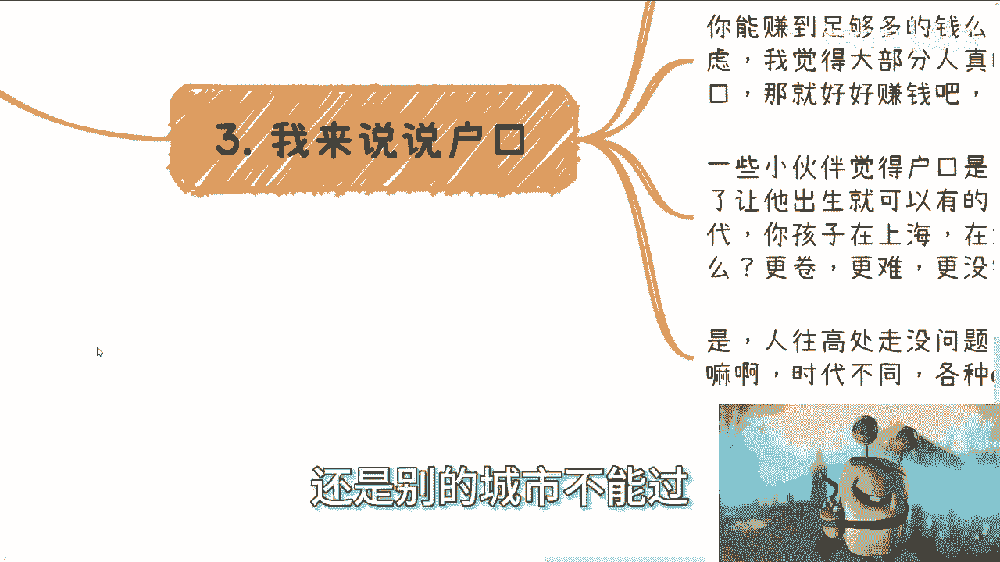
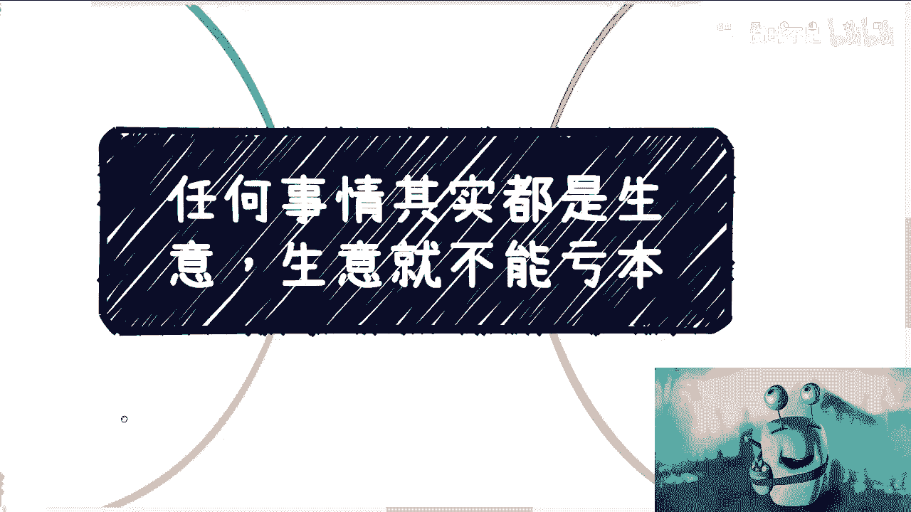

# 任何事情都是生意思维-生意就不能赔钱---P1---赏味不足---BV1HW4y1P7DQ

在本节课中，我们将学习一种核心的思维方式：将生活中的各种决策都视为“生意”。生意的核心原则是不能亏本。我们将探讨如何通过去除感性干扰，理性分析投入与产出，从而做出更明智的人生选择。

---

## 概述：一切皆是生意

我们常常面临各种选择，例如考研、考公、落户等。许多问题看似复杂，难以解决，但本质上是因为我们的思考掺杂了太多感性因素。如果我们将每个选择都看作一笔生意，只关注明确的投入（X）和产出（Y），决策就会变得清晰。

**核心公式：`决策价值 = 明确产出(Y) - 明确投入(X)`**

如果Y不明确，这就是一笔亏本买卖或赌博。

---

## 第一节：问题的本质与感性陷阱

上一节我们提到了生意思维的基本概念。本节中，我们来看看为什么很多简单问题会变得难以解决。

很多时候，问题本身并不复杂。复杂的是我们思考时夹杂的感性因素，例如“家里让考的”、“大家都在考”。这些因素模糊了真正的投入与产出，让你不清楚自己到底想要什么，只是在跟随他人。

例如，在考虑是否考公时，如果你不清楚自己的目的，只是因为外部压力而行动，那么你的“投入”（时间、精力）和“产出”（一份工作、一种生活）都是不明确的。这种状态下的纠结，根源在于你不知道自己要什么。

---

## 第二节：如何用生意思维做决策

理解了感性陷阱后，我们来看看如何具体应用生意思维来分析重大决策。

以下是分析任何决策的三个关键步骤：

1.  **明确你的投入**：这包括你的金钱、时间、青春等最宝贵的资源。在公式中，这就是 **X**。
2.  **明确你的产出**：你需要一个具体、可衡量的结果，而不是“未来的可能性”或“社会的认可”。在公式中，这就是 **Y**。例如，一份年薪多少的具体工作，一个能带来多少客户的项目机会。
3.  **计算投入产出比**：如果Y是未知数或问号，那么 `Y - X = ?`。这意味着这是一笔风险极高或注定亏本的买卖，不应该轻易决定。

以读研为例：
*   **投入X**：学费、2-3年时间、职业机会成本。
*   **产出Y**：一张硕士文凭。
*   **关键问题**：你知道如何用这张文凭，换取一份具体薪酬和发展路径明确的工作吗？如果不知道，Y就是不明确的。

“走一步看一步”在这种重大决策中是一种危险的思维，它等同于将人生的主动权交给运气，长期来看是一种“思想上的亏本买卖”。

---

## 第三节：案例分析：落户的“生意经”

学会了决策分析框架，让我们将其应用到一个具体且常见的选择上：是否要在大城市落户。

户口本身不能直接带来金钱。关键在于，你是否知道如何利用户口这个资源去创造明确的价值？

很多人将户口视为给下一代的礼物。但这笔“生意”需要仔细核算：
*   **你的投入**：可能包括签订长期服务合同、牺牲职业灵活性、承受更高的生活成本。
*   **你孩子的“产出”**：一个出生在大城市的户口。
*   **后续成本**：你的孩子将面对更激烈的竞争、更高的物价。如果你无法提供充足的经济支持，他可能反而更辛苦。

因此，决策逻辑是：如果你能轻松、低成本地获得户口，那当然可以。但如果你需要被一份合同绑定多年，牺牲了时间和职业发展的多种可能性，那么你需要问自己：**这笔生意划算吗？老家的生活或其他城市的机会，是否是一笔“投入产出比”更明确的生意？**

---

## 第四节：优先级与面对无解

在分析了具体案例后，我们需要建立一个更底层的决策优先级。

在所有成本中，你的**时间和青春**具有最高优先级，是无价的。任何决策都应优先考虑如何节省或最有效地利用它们。其次才是金钱等可量化的成本。

你可能会陷入一个循环：不了解就无法决定，去了解又需要花时间，而这时间本身可能也是亏损。这引出了一个重要事实：**不是所有问题都有完美解答，“无解”是人生的常态。**

这正是我们需要社交、探索、实践和改变思维方式的原因。如果总是被感性因素（如父母、伴侣、环境的期望）牵绊，你的一生就是在为别人的期望买单，这无疑是一笔巨大的“亏本买卖”。“人不为己，天诛地灭”，这里的“为己”指的是为自己的核心利益和成长负责，这是生意思维的基础。

---

## 第五节：警惕“解决方案”的买卖

最后，我们需要警惕一种思维陷阱：期望花钱购买“终极解决方案”。

真正有价值的东西，如稀缺的信息差、深刻的认知、关键的人脉网络，是无法通过花费几千、几万元就能买到的。如果它能被轻易购买，其本身就不再稀缺，也就失去了价值。

你可以花钱拓展社交、获取知识，但不要幻想花钱购买一本所谓的“人生秘籍”。价值的核心在于**稀缺性**，而稀缺性需要通过你自己的思考、实践和积累来创造和识别。

---

## 总结

本节课中，我们一起学习了“生意思维”的核心框架：

1.  **将重大决策视为生意**，核心原则是**避免亏本**。
2.  **用`决策价值 = Y - X`的公式**，剔除感性干扰，只关注**明确的投入与产出**。
3.  在决策时，将**时间和青春**视为最高优先级的成本。
4.  接受“无解”是常态，并通过主动思考和探索来寻找更优解。
5.  明白**真正的高价值资源具有稀缺性**，无法简单用金钱购买。

掌握这种思维，能帮助你在考研、求职、落户等人生关键节点上，做出更理性、更有利于自身长期发展的决策。