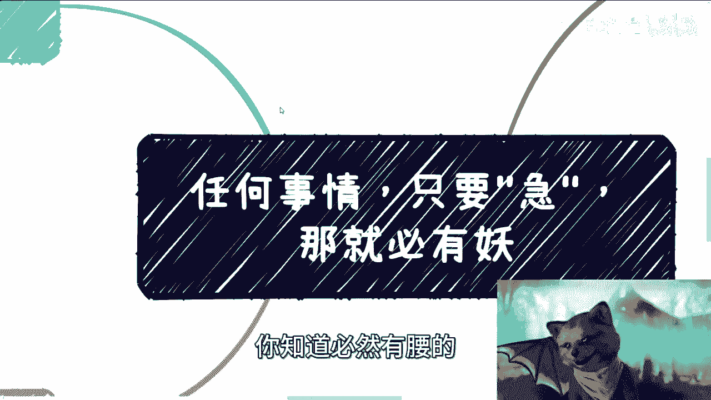
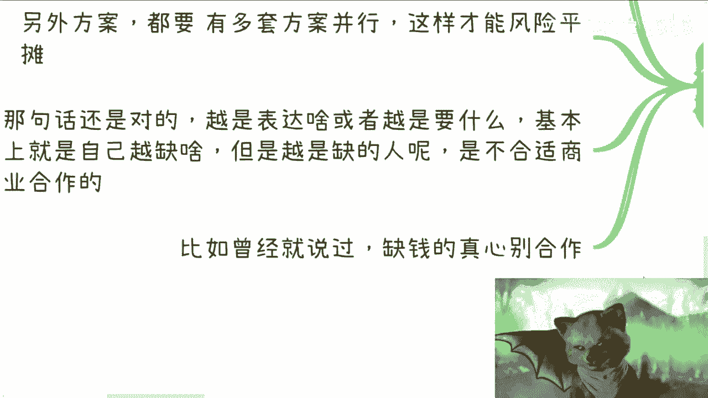

# 任何事情，只要“着急”，必有妖 - P1 - 赏味不足 - BV1D8411q7S2

好今天我们讲的这个内容啊，很有趣是吧啊，我其实之前就想讲了，我一个一直忘一直忘，这是什么呢，叫做任何事情呢，你只要急啊，我跟你讲，那就必然有腰的，你知道必然有腰的。

那什么妖我们不知道啊，但是反正肯定有问题啊，呃本质上呢这也是个非常好的一个避险的方式，什么意思呢，就是说啊任何事情啊，我跟你讲，就真的任何事情，只要对方让你感觉到对吧，他很急啊。

这必然是有腰这个腰的腰的厉害了，我跟你讲啊，当然啊，就是说事情本身你说有个轻重缓急，那很正常，对不对，就是你有很多时候出现一些紧急的事情，这也很正常是吧，这我觉得没有毛病，啊但是事情本着急。

并不代表他一定这件事情要在你身上挤对吧，就是说你今天跟我合作对吧，你说我有一件很急事情，我来找你没问题啊，但是我但凡一直盯着你，那就说明哎啊，那这肯定是有问题了啊，那么这直接来就工作上啊。

比如说有很多人就跟我说，他说他领导啊，还有他老板啊，一天到晚就改改需求啊，呃这个各种各样的，你想想你想啊，你领导你老板盯着你催一次，两次三次没问题对吧，时间长了说明什么，说明他们根本没有不懂管理啊。

没有management对吧，没有做事情的规划，说白了他懂个屁对吧，那跟着这种老板，跟着这种公司有什么前途啊对吧，就他自己都不知道他要什么，你要做啥呢，是吧啊，还有呢就面试之后对吧，很快就是要你入职的。

我跟你讲，这种全部枪毙掉，你别管在哪啊，我跟你讲，但凡哪怕是个国企，央企是个很牛逼的地方，你也别去，你知道吧，就那种很急很急的这种枪毙掉啊，没什么好说的啊，去了也是坑啊，很多很多很多很多。

我跟你讲它都是同一个逻辑，第二啊，着急归着急啊，盯着你吹就不行啊，我们举例子啊，比如说其实最直接的例子是什么，就比如说今天A做一个服务，对吧啊，但凡自己他自己如果这个业业务做的靠谱啊。

或者说A有A有多个啊，就不单单这一条线，它有多个靠谱的服务，那么他就不可能盯着某个服务往死里搁，你想想看是不是就他但凡定制网磁力格，就说明他自己没有别的业务啊对吧，无论是b to b还是b to c。

就企业去企业合作，还是体企业去个人合作，你但凡如果签了合同，在迭代line之前对吧，在这个约定的时间之前，他催很正常对吧，但是如果你们现在还在谈服务对吧，还在就说，就说客户还在考虑要不要买单的情况下。

大家还在考虑要不要合作的情况下面，你说你客户也好，或者其中一方一直盯着另外一方去签合同，或者去成交对吧，我跟你讲，这要么就是意味着他对自己的服务没有信心，对吧，反正能割一个是一个啊。

要么呢就是这个服务就不靠谱对吧，那那还有什么原因呢，没了呀对吧，你说你说有没有着急事情用对啊，你说比如说啊，我说我今天有个政策的项目，我就很着急去找供应商或者乙方，没问题啊，今天我找到你。

也许你是合适的啊，我就跟你说有这么个事儿，但是你想想，但凡啊，我今天跟你说，我说哎那个谁对吧，嗯我说你必须三点钟之前给我答复啊，必须要告诉我今天能不能做，必须怎么样子，我跟你说一次没问题啊。

我要是什么三点之前，我他妈每隔10分钟来催你一次，打你一次电话，我跟你讲，这说明肯定有问题，就必然有妖，你只是不知道这腰在什么地方，你知道吧，但是你能知道一点，就是这件事情代表着什么。

代表着就是要么就是我这个人做事情没有章法，要么就是根本没有能力去应对这种紧急的事情，那么说白了我要是没有能力应对这种情急事件，或者我做事情没有章法，那你也没必要跟我合作，因为就算合作了，未来也一定有雷。

一定会爆，就这么简单的事情，对不对，那说白了你盯着催或者很着急去催，就是无能狂怒对吧，就是无能狂怒啊，你能怎么办呢，哦搞得好像你去催了别人，就就就一定会买单或者一定会成交一样对吧。

那说白了就算别人真的因为你催了，去买单或成交，也是被你割，你后面还是要被骂的对吧，那第三个，很多时候上午面试，下午入职，哎我跟你讲这事多了去了对吧，这事儿吧，我跟你讲啊，很多人跟我讲过。

一般跟我说这种人的细节我听都不想听，没什么好听的，反正就不靠谱，就仨字不靠谱对吧，又有啥好听的呢对吧，你非要问为什么的话，哎这是简单，我跟你讲啊，这就跟相亲，啾啾跟你认识朋友，啾啾跟你做商业啊。

这就跟你找工作，这就跟你去，比如说看一看医生一个道理呀，哦你跑过去我就这么跟你讲，靠谱的医生对吧，你跑过去你跟着他一顿操作猛如虎，你说哎那个医生啊，我这边不舒服啊，我这边什么状态，我这边怎么样子对吧。

我可能觉得我可能是感冒或者发烧了，或者怎么样，我跟你讲，靠谱的医生一定会跟你讲，那他妈你是医生，我是医生，对吧啊，你别自己做判断，我要来判断的对吧哦，那你要是今天碰到一个医生，我就问啊，你碰到一个医生。

他三刚刚不跟你说的，他也不问啊，这个这个上来就跟你说啊，我大概知道了就开这个药，你觉得呢你觉得呢对不对啊，你想想看啊，无论你去干什么对吧，就是所有的事情你一方可以没有想法，你一方可以不懂。

但是你不能双方都没有想法，什么意思呢，就是说你所有的人逢萍水相逢，你从认识马上就要你入职，你从认识马上就要你做男朋友，你从认识马上约你出去旅游，你怕不是去爬山呀对吧，要约你去爬山是吧啊。

要么就是呃这个马上让你入职，你觉得呢你会觉得靠谱吗，你这你肯定会觉得风险到处都是风险嘛对吧，只不过你不知道风险在什么地方对吧，那对方没有评估的过程，没有评估的意识，这事情说明本身这个人就不靠谱对吧。

所以很多时候你做事情你想想看啊，不管你做什么，他都是相互评估的对吧，任何一方其实不评估就都代表这件事情不靠谱，或者这个人不靠谱，所以反过来你看看自己也是一样的对吧，你遇到事情你也别去老去催别人。

你也别盯着老别人去催，有规划性或者有时间节点的去沟通对吧，你否则就是你否则就会让别人觉得对吧，你你你你是不是没事干是吧，你说没就是没没没能力啊，你们没有办法做别的东西啊对吧，这是第一个。

第二个就是另外的方案，你都要有多套方案去并行，因为你这样的话，你风险才能平摊嘛对吧，你说你所有的菜放在一个篮子里面，你风险怎么平台发哦，还有呢那句话还是对的，就是你就是你越是急于表达什么东西。

你越是缺什么东西，但是你不要让别人觉得你缺啊对吧，你越是缺，越是这表达，也就代表着你越是一个情绪不稳定的人，你越是情绪不稳定，你越是不适合做商业商业，你知道吧，就说我曾经在商业这个视频里面提到过。

就是创业也好，做项目也好，最不应该合作的是什么，就是那些缺钱的人，为什么，因为他们急啊，他们没有章法，他们正因为缺，所以他们容易出幺蛾子，他们容易不择手段，容易给你爆雷呀，你怎么合作，合作什么东西啊。

对吧。

啊，为什么会想到做这个主题啊，是因为呃，我觉得大家日常当中都会碰到这样的人啊，或者都会碰到这样的事情，我现在做事情态度很简单是什么呢，就是当然我觉得所有人都一样啊，就是我们不去，又不欠任何人员对吧。

就是问题，比如说就像我做视频一样的，我愿意做，那是我的事情，我不愿意做，那也是我的事情对吧，就包括我给很多东西，我愿意给，那是我的事情，我不愿意给也很正常对吧，就我不欠任何人，你们也不欠我任何东西对吧。

但是如果来说但凡啊有有人，就比如说我急着打个比方，我说我要做咨询，然后呢比如说你你我就这么跟你们讲吧，但凡加过我微信的，我可以说到今天为止，没有一个人是我催着咨询的，从来没有的，一个人都没有的啊。

都是你们去安排时间来跟我讲，爱陈老师什么时候有空对吧，然后我说你们排，或者说我跟你们说，比如说三四天后怎么样，你们排从来就你们不发消息，我也不会不发消息来催你们的，不会的，从来不存在的，对吧啊。

那么一样的道理，就是你们也没有说啊，比如说有有人来问我要东西或者怎么样子，我愿意给就给，不愿意给拉倒，就这个样子对吧，就是我觉得任何一件事情急一定是有问题的啊，然后呢我跟你们讲，还有个搞笑事情。

就是有有人来问我要东西也有的，但是我发现啊，就是我我就是就是我我觉得啊他问我要东西，我看了一下，他又不关注，我，又不又不充电，他问我要东西，我就觉得就我我也不欠你的说，那那我就不想回，你知道吧。

就何必呢，是吧嗯那这基础基本尊重还得要有啊，然后那个好吧，反正我觉得这个内容吧基本上就这个样子，我希望大家能明白好吧，就是不管什么事情都一样啊，就是那种嗯上上海话叫什么叫后拉赫对吧。

就沟通这种结合了和人或者这种事情啊，能不接就不接哦，就是你们也好，我也好，大家也不是缺这一单的单，也不缺这一单的钱啊，也不缺这个合作方啊，地球也不是围着他转也不足，我也不围着我们转啊。

不用太去看重这种东西好吧，哎呀行，那就这么着吧，我觉得这个不多废话啊，然后反正一样的好吧，就是有什么呃排怎么打的啊，这个职业规划的，或者说想要了解更多的一些东西呢啊，然后你们觉得有什么事情想做。

然后自己摸不准的或者不清楚的，反正你们整理好问题好吧，私信我好吧，随缘啊。

