# 企业家培训／私董会篇01：我们先来说说为啥能赚到钱，钱又从何而来 - P1 - 赏味不足 - BV19j411a7Bk

哈喽大家好啊，我在这里给大家开一个新的短片，我估计这个应该讲不了多久，估计223期吧，最多三四期，我觉得了不起啊，企业家培训啊，企业家培训私董会什么NBA这种其实都差不多啊，那首先第一期。

那这个我们来说啊，为什么能赚钱啊，赚的谁的钱，首先呢我会先说几个大的前提。

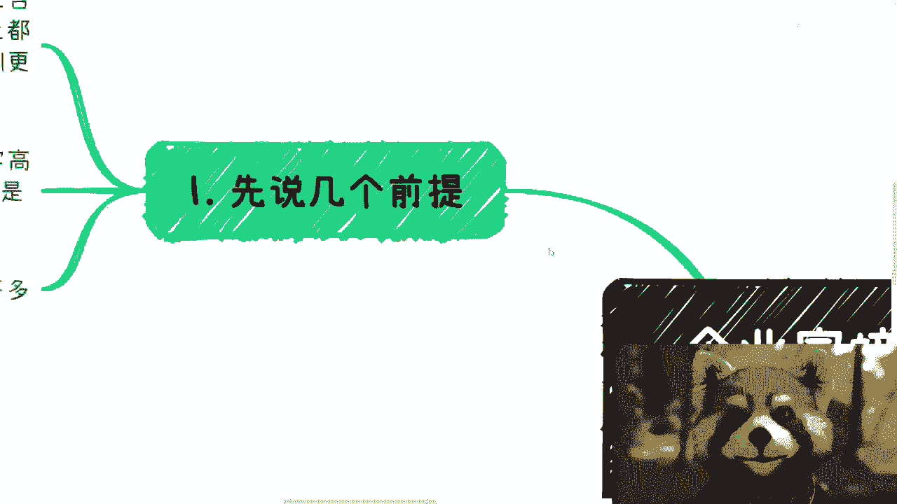

因为很多人对这个东西也没概念对吧。

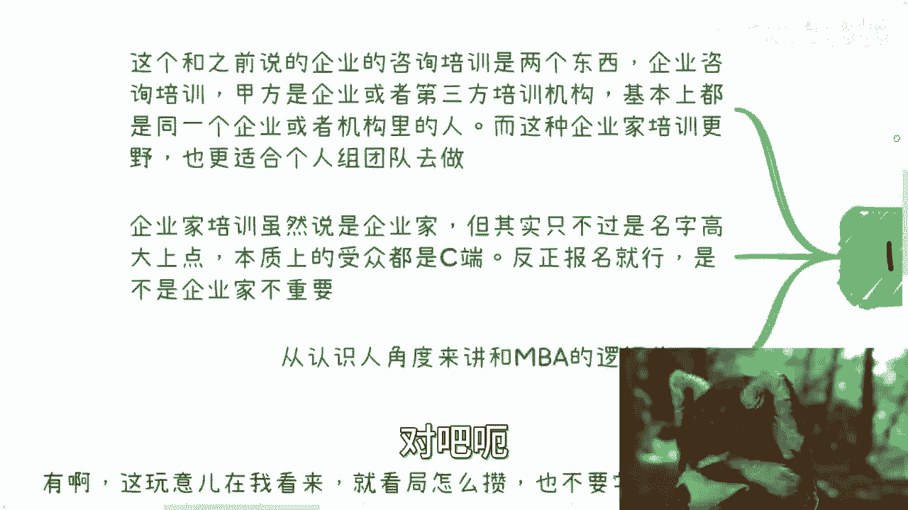

之前呢我们提到过就是企业培训，企业咨询啊，那么这个呢跟之前说的这种企业咨询培训呢，它是两个东西啊，大家别去把它混为一谈啊，觉得这是一个东西呃，企业的咨询培训呢，甲方基本上就是企业。

或者直接第三方的培训机构，也就是说我们的合同，基本上是要跟企业或者第三方培训机构，去签的啊，那么呃同时呢这种这种内训啊，他基本上都是同一个企业里面的，可能来自于不同的部门，也可能来自于同一个部门啊。

但anyway就是说基本上都是一家人啊，那么在这种企业家的呃，这个我们今天所要讲的这个新开的，这种企业家培训呢，他跟更加野，而且也更加适合个人团队去做啊，基本上这种就是to c的东西啊。

那么企业家培训呢。

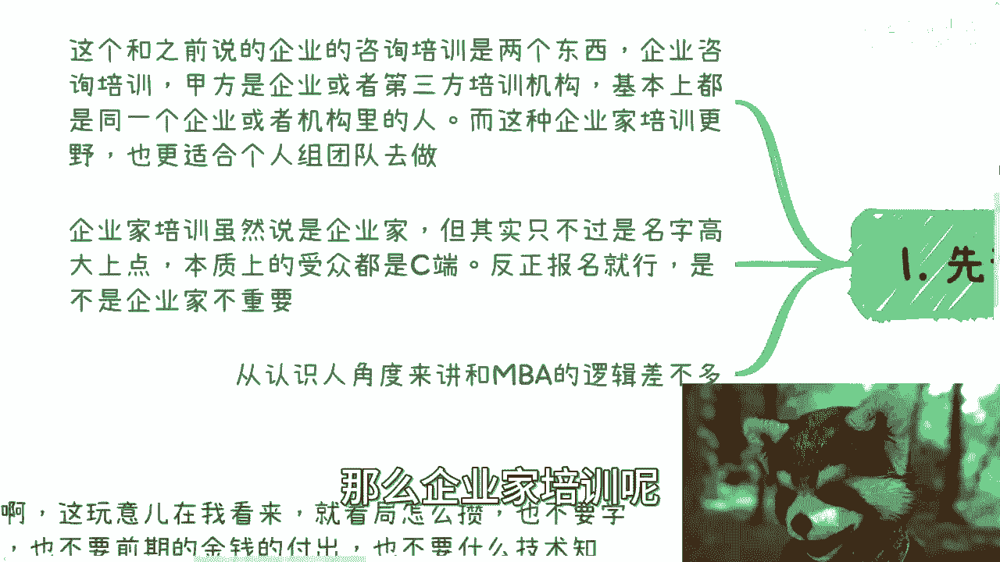

在这个地方基本上虽然说是企业家，但其实只不过是我们在包装啊，在名字上面比较高大上啊，本质上受众基本上都是C端，那当然这个C端啊并不是说只有老百姓，因为你来报名的，我甭管你是企业啊，叫什么，就是高管也好。

创始人也好，怎么样也好，就是简单来讲它就是散户啊，他不是说一个组织类型的这么一种报名啊，就是说只要他报名就行了啊，你说他是不是最终是不是写一下无所谓，你可以啊，你可以弄一个什么身份的认证对吧，你说好。

你呃写一下你的公司啊，写下什么东西，但其实这都是走走形式的，是为了你自己把你的逼格提上去对吧，一个道理，就我跟呃就就我们差一个话题，就比如说就好像天你弄个游轮啊，邮轮的party对吧，然后你就说你说哎。

我这个这个报名列表上面对吧，我必须让你填一个什么，填一个这个资产，对不对，但是问题是你填一块钱也好，你填一个亿也好，你都能来，无所谓，你想付钱就可以了，我管你这么多呢，对不对啊。

所以说逻辑上面呢大家一定要记住啊，就是你们去思考问题的时候呢，就是说的直白一点，就是说你们既要从韭菜的角度去看这个问题，你们也要从就是镰刀的角度去看这个问题，这样的话这些问题才能够看得比较清楚啊。

从认识人的角度来讲呢，呃企业家的培训啊，跟NBA的这种逻辑其实大差不差啊，呃好我们往下来看啊。

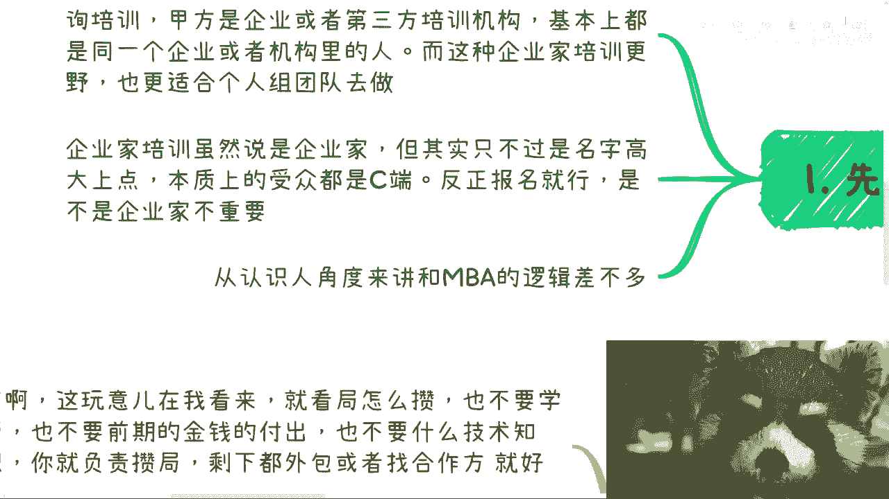

第一个我们先说赚谁的钱对吧啊。

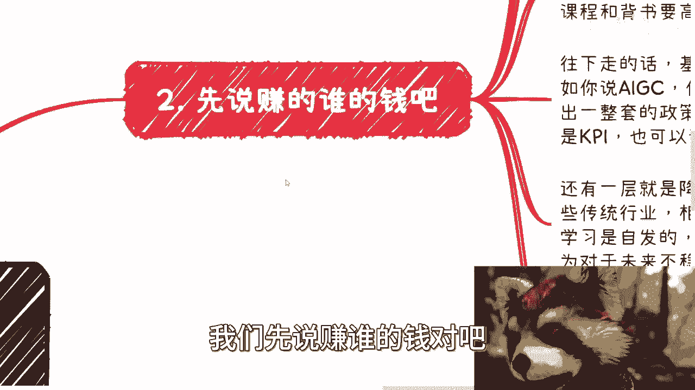

呃首先主要是这么几块啊，企业家培训私董会也罢啊，或者club也好啊，呃其实也是分等级的，也就是说你做这些东西呢，你可以往高端做，你也可以做那些普适性的，你也可以做下沉市场，呃，说白了就是说整个业务逻辑。

从你开始做到最后对吧，包括收费啊，周期啊，包括你的那个那个细节执行啊，这些东西啊，其实都大差不差的啊，呃你甚至可以CTRLCCTRLV啊，都不是问题，只不过区别是在于说比如说你细节上面。

比如说要不要给些茶歇啊，给一些高级的这个叫什么就是三折页啊对吧，宣传宣传物料啊对吧，包括话术啊肯定不一样，但是其内核都是一个东西对吧啊，这就好像我们再打个比方，这就好像今天你做一个呃叫什么就是餐饮啊。

然后呢我就跟你说啊，我说你呢你这个提供的这个客户啊，有的是政府，有的是高校啊，有的是这种叫什么乞丐对吧，就是各种各样的类型的，那其实对你来讲，你可能觉得你可能是这样做的，你说啊我每每一个地方呢。

我提供的这个呃菜色菜单其实都大差不差啊，都是比如说啊鸡鸭鱼肉对吧，这些东西啊，但是呢你说我只不过是每个做法不一样啊，那没毛病也可以啊，那么往下走呢，基本上还有两层哦，不对，我这个还没说呢啊。

嗯先说第一层啊，就是这个大企业，大企业外企呢每一年都有培训经费啊，或者学习的经费，但这种经费呢肯定是需要申报的啊，他肯定是一层层往上报，要审批，所以说本质上就是说你得想他所想啊，所以说你的活动要举办。

你的培训，要举办你的NBA要举办也好，课程跟背书，你一定要高大上，否则你想想看嘛啊你让对方就是我有心要来，你让我怎么把这个钱批得下来呢是吧，你就像很多人跟我说，吕老师，我我办了一个活动，我妈一看，对吧。

要海报没海报，要介绍又没介绍，要主题没主题，要要包装没包装，什么都没有，那这是怎么来的，对不对啊，那么往下走呢，基本上还有两层，一层是背靠政策啊，比如说啊，你说你这个做一个AIGC或者做数字产业化。

产业数字化，你首先首当其冲的就是说你得拿出一套政策，可能是中央的，可能是政府的，就可能是地方政府的，无所谓啊，那么很多地方其实是需要的啊，你可以说啊我们帮助他们完成KPI，你也可以说他们也许真的需要啊。

这个括号对吧，你们自己看我就不说了，对吧啊，反正就这么个意思啊，那么还有一层呢就是降本增效呃，和能够带来更多的钱，就说白了啊，针对那些传统行业，或者相对传统行业的管理和老板来讲呢，他们的学习是自发的。

就是对他们来讲，他们并没有什么审批啊，就他要出钱自己就出来啊，都是说的不好听点，就是土老板嘛对吧，但主要是因为他们对什么呢，主要有几点，第一点是他们对信息的恐惧，而对信息差的控制啊。

他们觉得可能会脱离这个叫什么，就是脱离社会或者脱离一些前沿的东西啊，那么第二点呢也是对于未来不稳定性的恐惧，因为本身你说全球经济不好或者怎么样子，那企业家其实是更担心的，因为企业家要要做的东西很多。

而且要接触的东西很多对吧，所以说啊养养养养团队啊对吧，各种各样的啊啊。

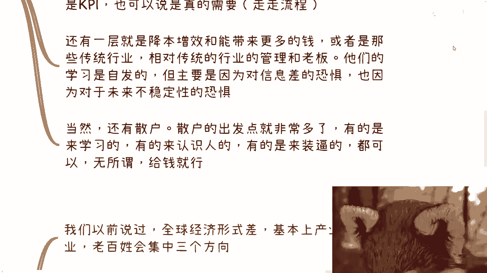

那么最后一点当然还有散户，散户呢的出发点就很多了，因为有的呢散户是来学习的，有的就来认识人，有的是来装逼的。

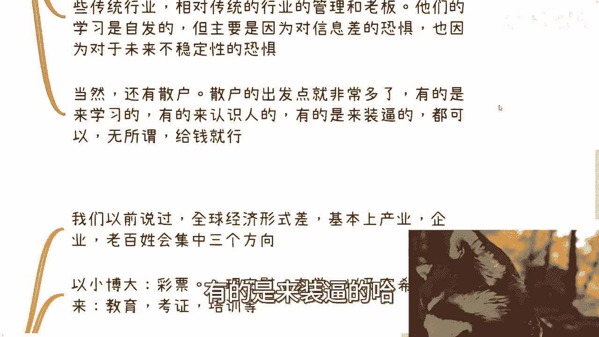

但是无论怎么样都可以无所谓啊，反正就像我刚刚说的，你给钱就行，我管你是谁啊。

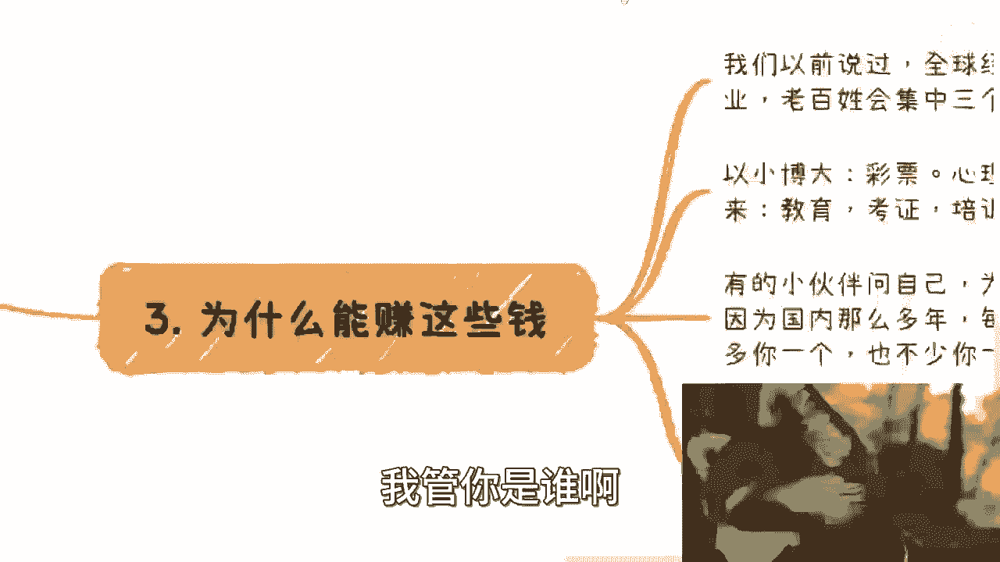

就是我跟大家在这个地方说一嘴，就是你一定要学会镰刀的思考逻辑，连到思考逻辑，就是说哪怕今天有个人跟你说，我都是父母都绝症了啊，我你你这个课程什么五六千块钱我也来付的，你不要阻止他，让他来，为什么很简单。

因为这样的思维，你你不收他的钱，总有人会收他的钱。

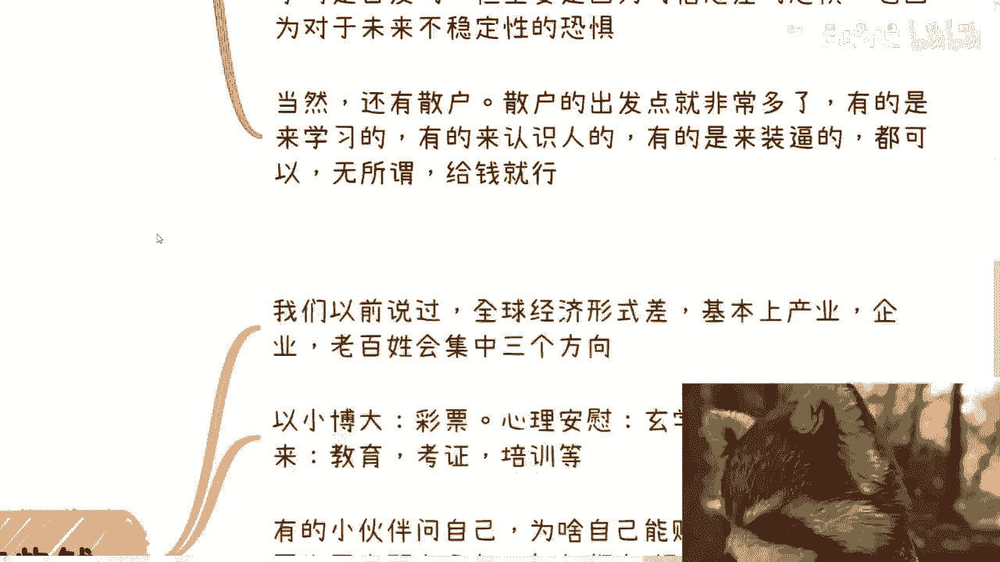

就这么简单，你要拥有轮镰刀的思维啊，你你你到时候又要说了。

哎呀这个你这话说的不对吧，你这话毫无人性啊，怎么那然后呢，人心当饭吃啊，人心能赚钱吗，切对吧，这我们又不是活在一个乌托邦的世界。

是吧啊，那么第二点啊，为什么能赚这些钱。

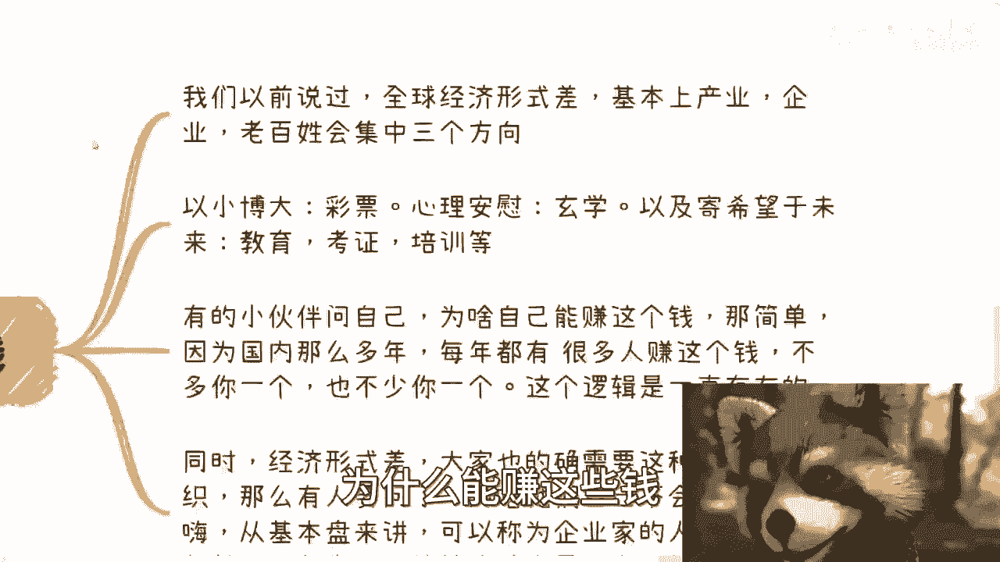

我们来看啊，我们以前说过，全球经济形势很差，基本上产业企业老百姓会集中在三个方向啊，你看啊，第一以小博大彩票对吧，第二心理安慰玄学对吧，第三寄希望于未来教育，就这三者没了，就这么简单。

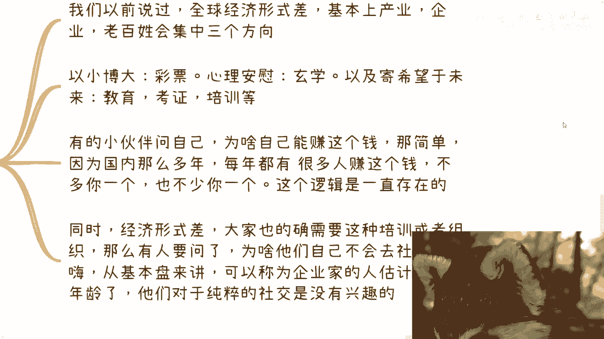

那剩下的就是看政策方向，走一步看一步嘛，但是你要从整个基本盘来讲，他就这么三个方向嗯，当然啦就是说呃，我我这个地方只不过是举些例子对吧，但是其实核心就是以小博大啊，心理安慰啊，继续网易归来对就这三个啊。

那么有的小伙伴要问自己了，他说那为啥我能赚这个钱呢对吧，那他说我是个nobody，那个那个我要要名没名要钱没钱，那为什么我能赚这个钱呢，很简单，因为国内这么多年，每一年都有很多人赚这个钱不多。

你一个也不少，你一个，也就是说这套逻辑一直是存在那边的，而不是说你你自己自创了一套逻辑，或者说你自己在那边想着说啊，我今天这个天马行空想了一个东西出来，那可能很有风险。

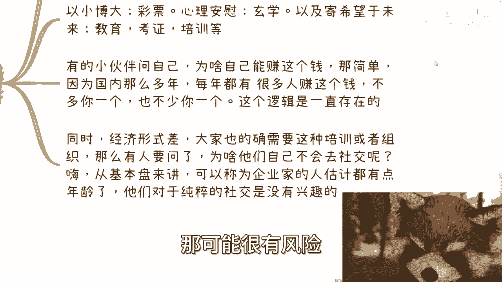

这个东西是你做或不做，反正每年都有这么多人这么多人做啊，那么同时经济形势差啊。

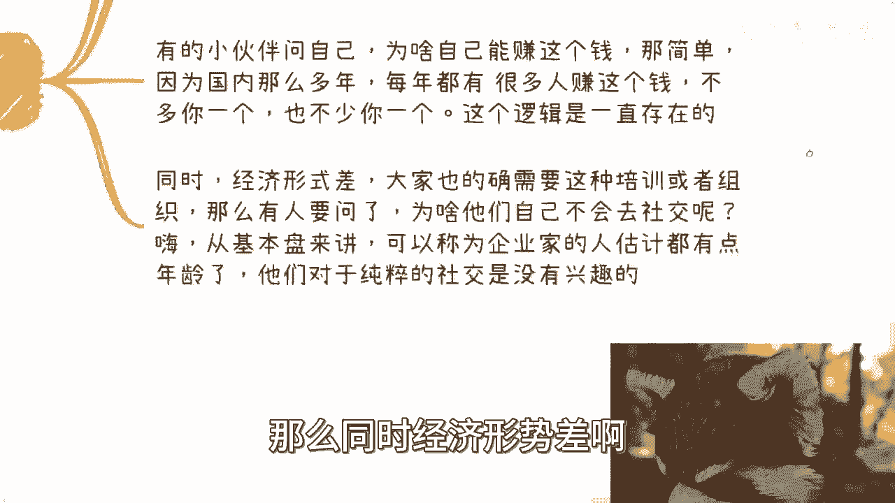

大家也的确需要这种培训或者组织啊，那么有人要说了，他说那为啥他们这个作为老板对吧，作为什么企业家，为什么他们自己不会去社交呢，哎呀我跟你讲啊，从基本盘来讲啊，你可以成为企业家的人啊，估计都有点年龄了。

而且本质上啊很多企业家他这个怎么说呢，就都是上不上下不下的水的，很难啊，不是大家什么什么都是马化腾，都是马云对吧，你要都是这个label嘛，我们也不要说这个话题，你知道吧，就很多都是很水的。

就他们对于纯粹的麝香呢没有兴趣，眼高手低，唉也都眼高手低，你知道吧，只不过就说天时地利人和，由于一些红利期游历一些风口，他们可能赚到一点钱，但并不代表他们的认知很高。

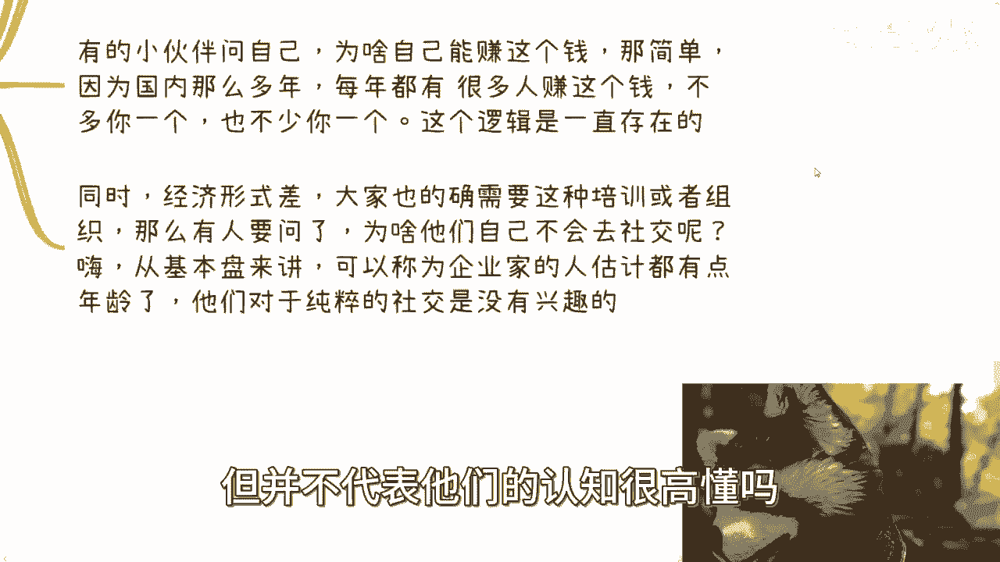

懂吗啊，好那么第四个你说和老百姓有什么关系对吧好。

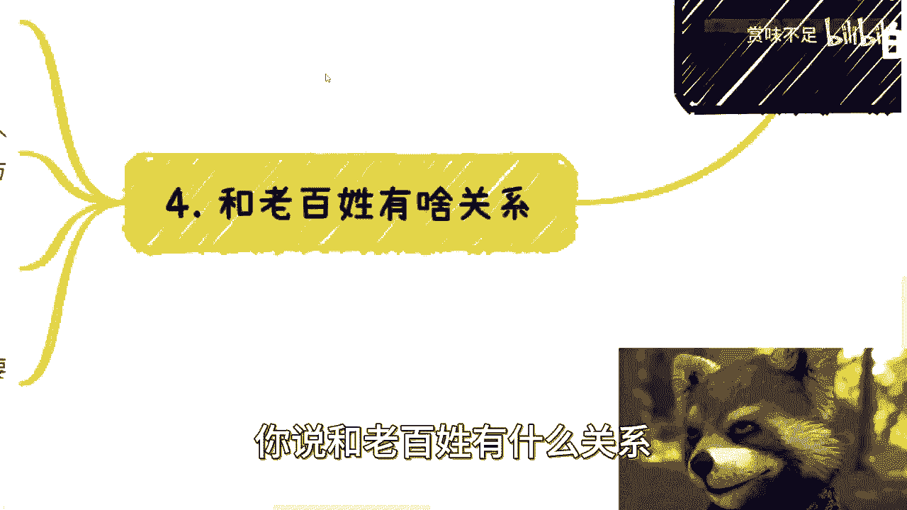

那么你看啊，那个首先我跟你讲，既然讲这个内容就一定跟大家有关系，因为这玩意儿在我看来他就是看局怎么攒啊，你你你你本身也不要学历啊，也不要前期的金钱的付出啊，也不需要你有什么技术的积累啊。

你就负责转职啊对吧，你只要把这个值攒出来就可以了呀，剩下的全部外包或者交给交给合作方就好了呗，你还需要啥呀，啥都不需要啊对吧，就说白了你有背书的，你往一二线搁，你没背书的，你往三四线搁呗。

这种逻辑不就这么简单吗，对不对，我反正现在就很直接的，就是就是也不叫哥吧，你就做呗对吧，那大家都是要赚钱，都说普通人赚钱难啊，这个难那个难，这个难更难，那我就跟你们讲了这个方向，我觉得没啥门槛。

没有什么难的地方对吧，你要说真的难，它是技术性的难吗啊，他是这种，比如说你要写个paper啊，你要发顶会对吧，你要你你要有有什么博士后，博博士学历还是怎么样子，没有啊对吧，他我觉得难难在最多啊。

对于普罗大众来讲，难是难在什么，难在放不下面子啊，放不下那些有的没的，放不下，你们从小被父母被学校教育PV出来的面子观，对吧，那你要是放不下这些东西，这辈子赚不到钱，那么你有小伙伴要说了。

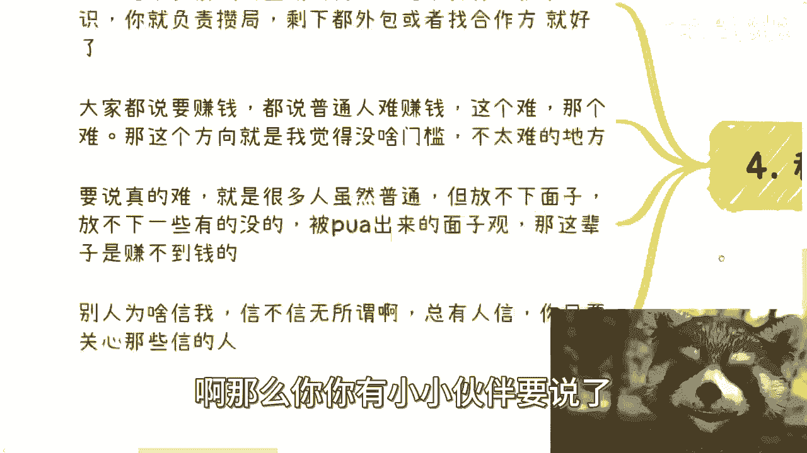

他说那别人为什么信我呢，信不信无所谓啊，中国14亿人啊，这么大块地方啊，你你我就问你啊，你今天做一个这个企业家培训对吧，好，你是你做这个企业家培训，你是希望来的人，你是希望来来1万个人。

来2万个人不可能的呀，你来个二三十人差不多了啊，我后面反正后面会跟你们说这个定价的对吧，这定价不会便宜的，对不对，你只要找到那些愿意信你的人不就好了嘛，对不对，这就跟钓鱼一样的，哎我说来走钓鱼啊。

然后你上来钓还没钓呢，你就跟我说哎这些鱼傻的对吧，这些鱼不要活吗，他为什么要咬我鱼饵呢，你管他呢。

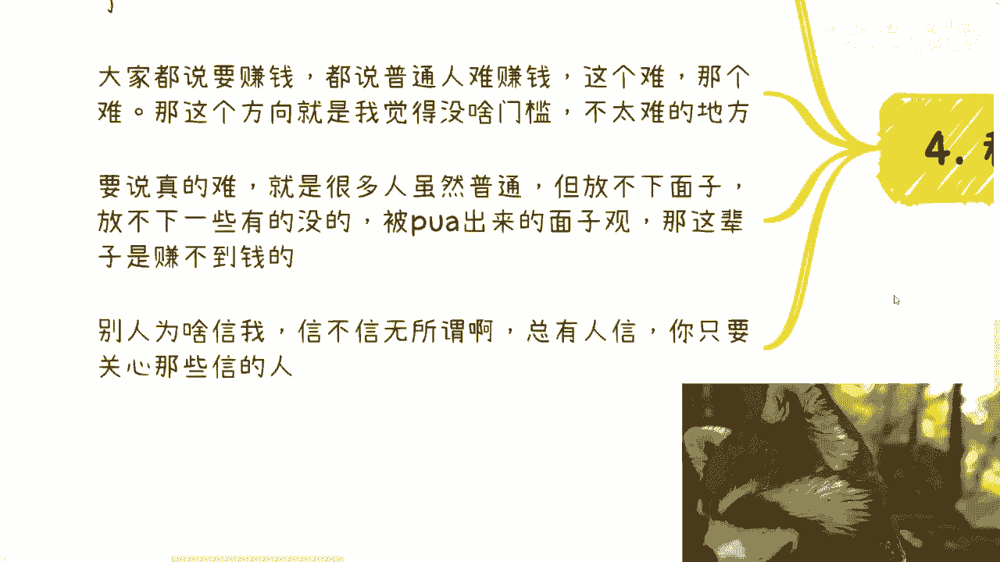

对不对，啊所以啊我觉得呢是这样子的啊，还是那句话啊，我们在达到一定的境界和level之前呢，不要老是这个卖白菜，哎没必要轮不到我们操这个心啊，我们抄也好，不抄也好，我们影响不了大局啊。

我所以说我觉得核心点就在于第一思想要改变，第二好好赚钱，结束了就这么简单，对不对，好好那就这么着吧，后面我会把一些细节包括定价，包括其他东西，我给你们再拆开来好吧，OK反正有什么东西大家整理好。

