# 企业家培训／私董会篇01：我们先来说说为啥能赚到钱，钱又从何而来 💰

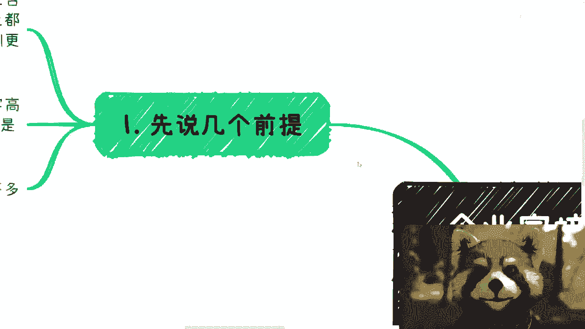

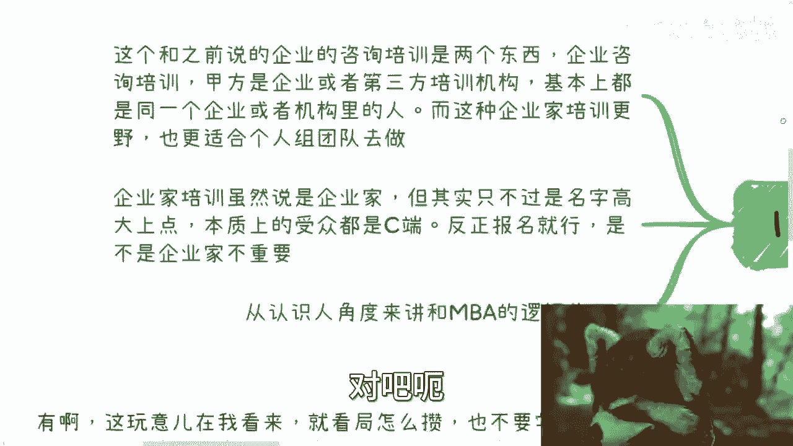

在本节课中，我们将要学习企业家培训与私董会业务的基本逻辑。我们将探讨这个行业为什么能赚钱，以及钱具体从哪里来。课程内容将帮助你理解这个市场的核心驱动力和潜在客户群体。

## 课程概述与定位

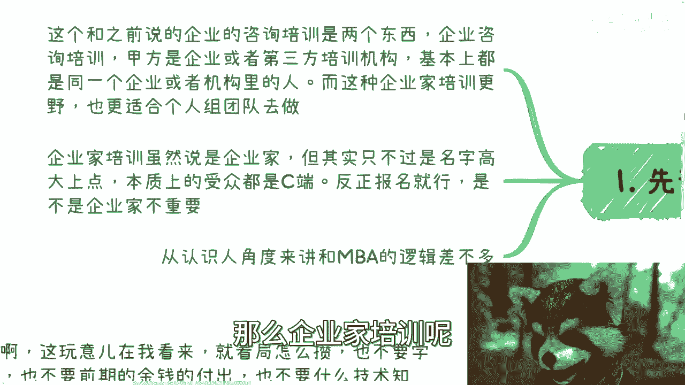

首先，我们需要明确本课程所讨论的“企业家培训”或“私董会”业务的具体定位。这与传统的企业咨询或内训是两个不同的概念。

传统企业培训的甲方通常是企业本身或第三方培训机构，合同是与组织签订的。培训对象也基本是同一家企业的员工。

而我们今天要讨论的“企业家培训”，其本质更偏向于面向个人（To C）的业务。虽然名称上包装得高大上，称为“企业家培训”，但实际的受众群体是广泛的个人用户。

报名者无论是企业高管还是创始人，本质上都是以个人身份参与的“散户”。要求填写公司信息等资料，主要是为了提升活动的逼格和形式感，并非强制性的组织行为。思考这类业务时，需要同时具备“镰刀”（运营方）和“韭菜”（用户）两种视角。

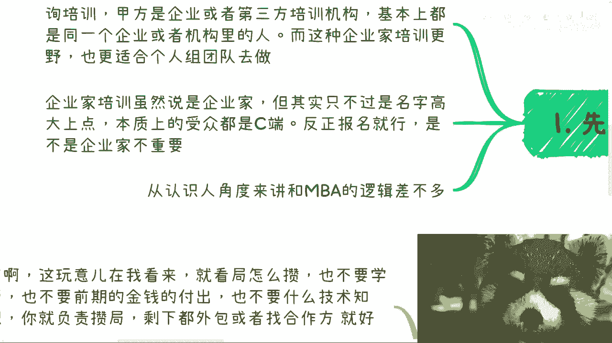

## 钱从何而来：目标客户分析

上一节我们明确了业务的定位，本节中我们来看看这个业务的钱具体从哪些客户群体而来。

企业家培训、私董会或俱乐部业务是分等级的，你可以选择做高端市场、普适性市场或下沉市场。虽然细节执行（如物料、话术）有所不同，但核心业务逻辑是相通的。

以下是主要的几类目标客户：

1.  **大企业与外企**：这类组织每年都有需要审批的培训或学习经费。要赚他们的钱，你的活动、课程和背书必须足够高大上，以便客户内部能够顺利申请和批复预算。

2.  **政策驱动型需求**：你的培训主题如果能够贴合中央或地方的政策（例如AIGC、产业数字化），就能吸引相关领域的企业或机构。他们可能有完成政策KPI的需求。

3.  **传统行业老板（自发性学习）**：许多传统行业的老板或管理者有自发的学习需求。他们付费的动机主要包括：
    *   对信息差的恐惧，担心脱离前沿趋势。
    *   对未来经济不确定性的焦虑，希望寻求破局之道。
    *   核心诉求可以概括为“降本增效”或“开拓新盈利渠道”。

4.  **散户（个人参与者）**：个人参与者的动机多样，可能是为了学习知识、拓展人脉，或是为了满足虚荣心。但无论如何，只要他们愿意付费，就是目标客户。

**核心运营思维**：在这个领域，你需要具备“镰刀思维”。即作为运营方，你的核心目标是成交。只要用户自愿付费，无论其个人处境如何，都不应成为你拒绝的理由。商业世界遵循自身的规则。

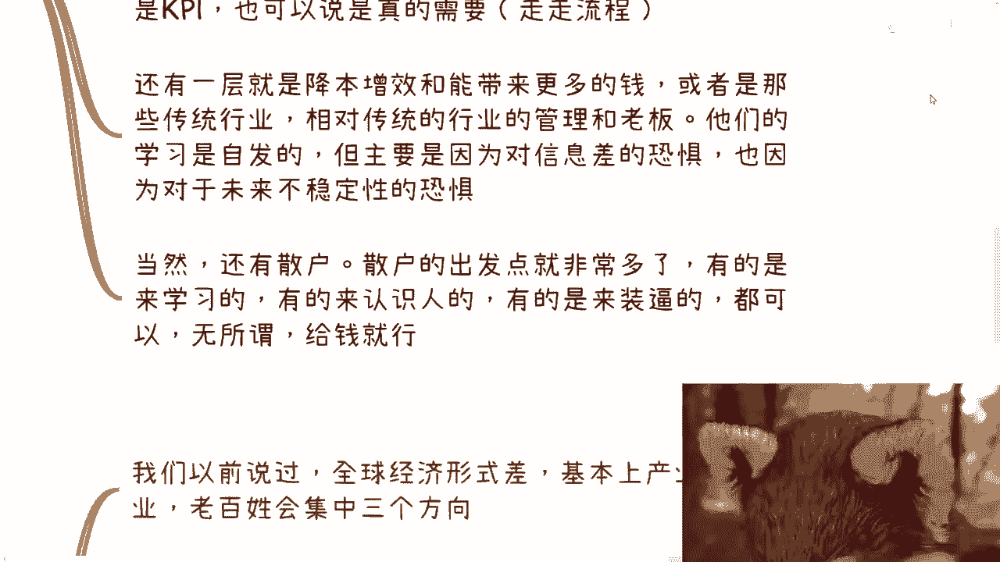

## 为什么能赚到这些钱：市场基础

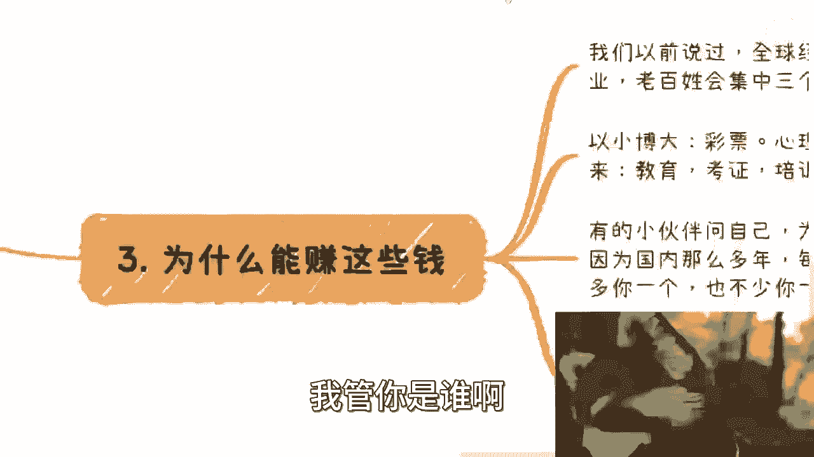

了解了客户是谁之后，我们再来分析为什么这个市场能够持续存在并盈利。

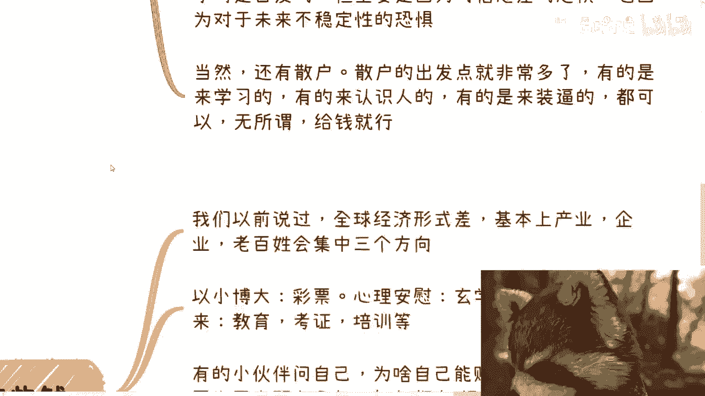

从宏观经济层面看，在经济形势不佳的时期，产业、企业和个人的资金往往会流向三个方向：

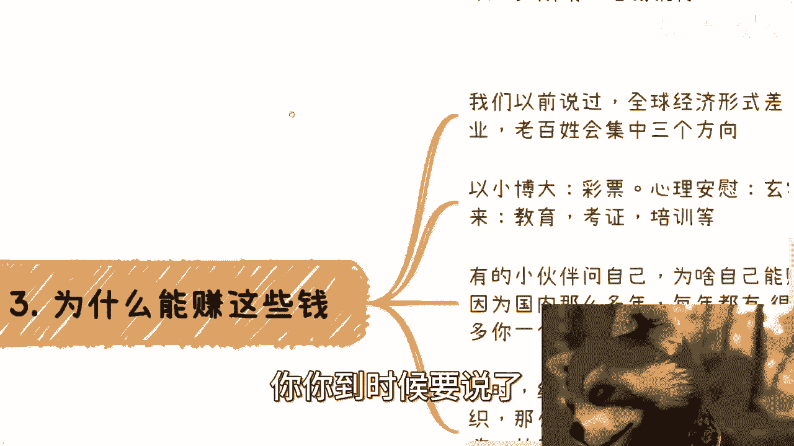

1.  **以小博大**：类似彩票，希望用小额投入博取巨大回报。
2.  **心理安慰**：类似玄学，寻求心灵慰藉和确定性。
3.  **寄望于未来**：投资教育或培训，希望提升自己以应对未来。

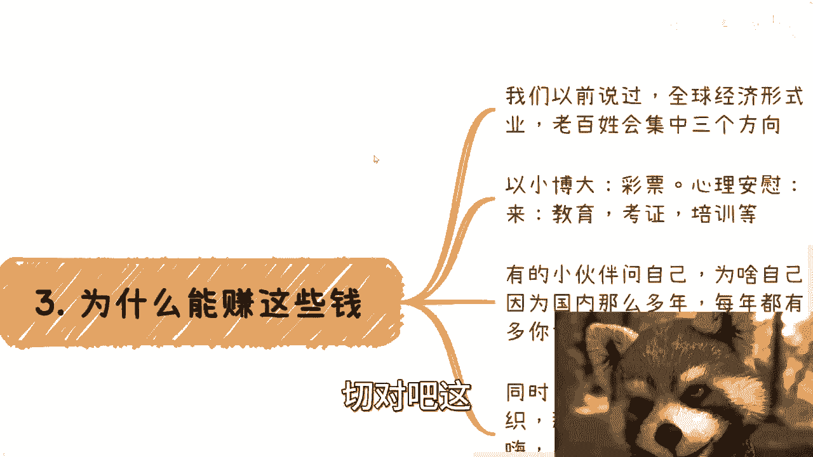

企业家培训业务恰好契合了“寄望于未来”和提供“心理安慰”（圈子、信息）的需求。这套商业模式长期存在，并非凭空创造，因此风险相对较低。

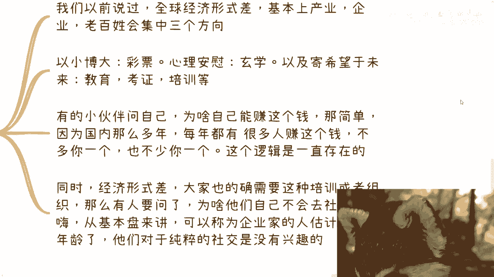

那么，为什么那些企业家自己不去社交，而非要参加这类培训呢？

很多中小企业家年龄偏大，其成功可能得益于过去的红利或风口，但认知水平未必同步提高。他们对于纯粹的社交可能兴趣不大，或眼高手低，需要一个组织者来搭建圈子和提供价值。

## 与普通人的关系：入场门槛

最后，我们来谈谈这个业务与普通人有什么关系，以及普通人如何参与。

这个业务的核心在于“组局”，对从业者几乎没有硬性门槛。它不需要高学历、大量前期资金投入或深厚的技术积累。

**核心公式可以概括为：成功 = 组织能力 + 资源整合**

你只需要负责策划和召集，其他如场地、内容等都可以外包或与合作伙伴共同完成。如果你有强大的背景和背书，可以主攻一二线城市的高端市场；如果资源一般，可以瞄准三四线的下沉市场。

主要的难点不在于技术，而在于能否放下“面子”等心理障碍。很多人从小被灌输的观念可能成为赚钱的阻碍。

关于“别人为什么会相信我”这个问题，其实无需过度担忧。中国人口基数庞大，你的目标不是吸引成千上万人，而是找到几十个认可你、愿意为你付费的人即可。这就像钓鱼，总会有鱼上钩。

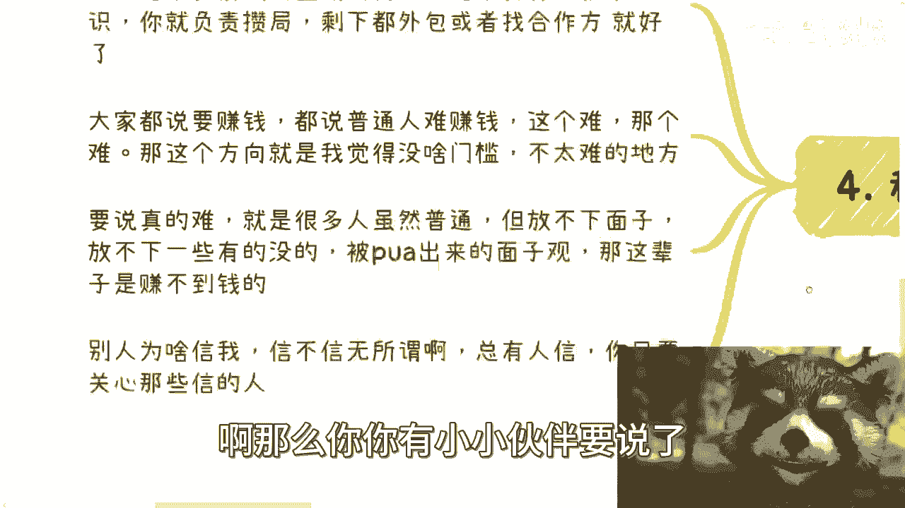

## 课程总结

本节课中我们一起学习了企业家培训与私董会业务的盈利逻辑。

我们首先区分了它与传统企业培训的不同，明确了其To C的本质。接着，我们分析了四类主要的付费客户群体：大企业、政策驱动型机构、传统行业老板以及个人散户。然后，我们从宏观经济和人性需求的角度，理解了为什么这个市场能够持续存在。最后，我们探讨了普通人参与其中的可行性和低门槛特性，指出核心在于改变思维、敢于行动并整合资源。

记住，在达到更高层次之前，我们的首要任务是理解和运用现有规则，踏实地赚钱。在接下来的课程中，我们将继续拆解具体的定价策略和执行细节。