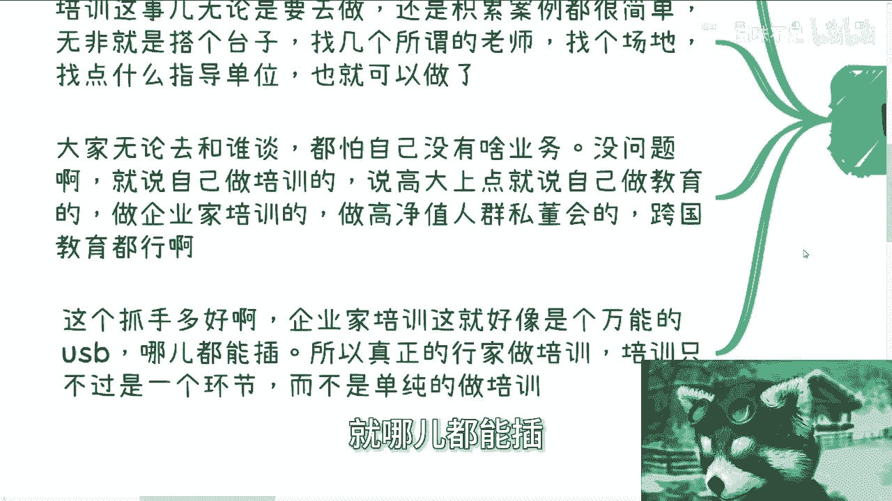
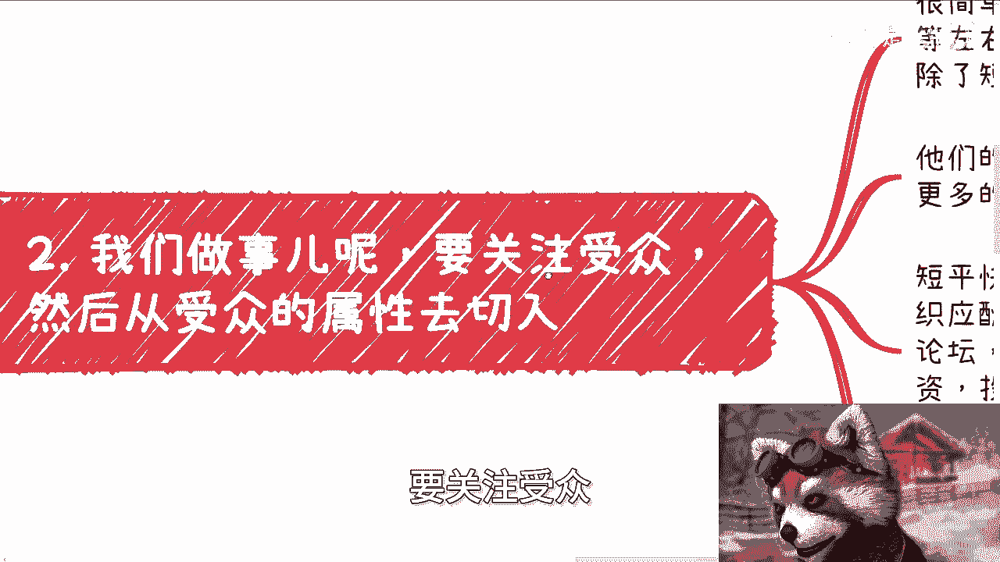
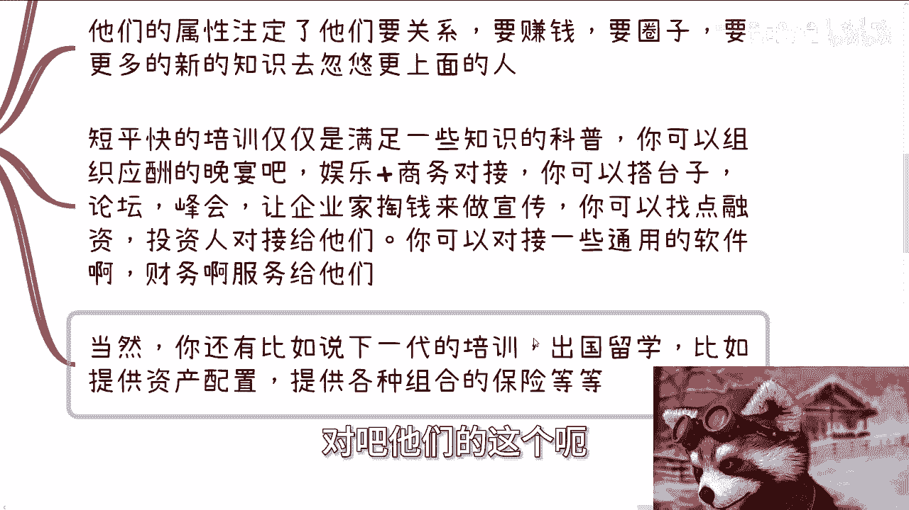
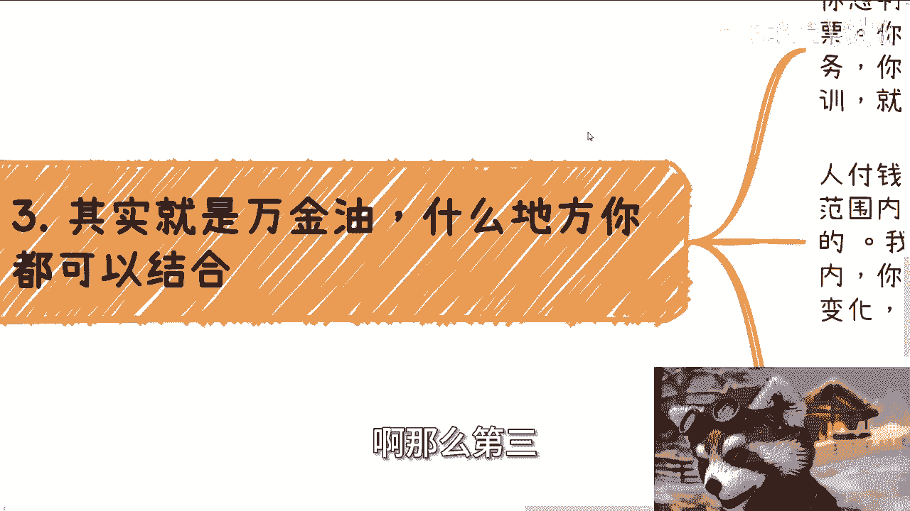
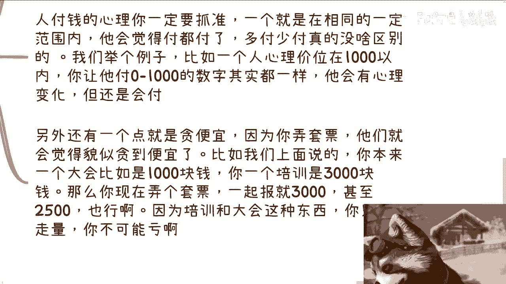
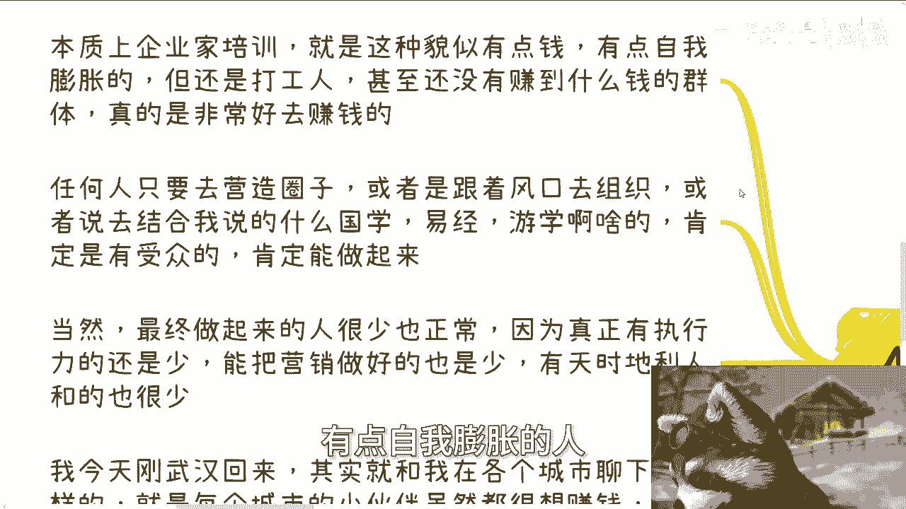

# 企业家培训只不过是商业闭环中很小的一环 - P1 - 赏味不足 - BV1Gz421271t

啊大家好，我已经从武汉回来了啊，然后5月底的话，我还在想这个活动放在什么地方啊，呃我们今天来讲呢是跟前前天吧。

前天那个免费视频挂钩的啊，就是这个企业家培训啊，只不过是商业闭环当中很小的一环。

那第一个啊我们从免费视频这边来继续来讲。

记录免费视频说的啊，其实模式还是很多的，但培训这个事呢，真正会做的机构从来都不是单纯去做的啊，或者说机构也好，个人也好，他都不是单纯去做的啊，我们一直说就我们一直可能日常在里面讲啊。

就是说啊做事情要有个抓手，有个抓手，什么所谓有个抓手是什么意思呢，就是大家要有一个案例，要有一个好的切入点啊，那么可以说对于普罗大众来讲，为什么这么多人会去做培训，就是因为培训是个很好的切入点。

而且他门槛不高啊，那么培训这事无论是要去做还是积累案例，他其实都很简单，无非就是搭个台子啊，找几个所谓的老师，找个场地啊，找点什么指导单位，他就可以做了，那当然这个地方又要有人说了。

他说那那那陈老师指导单位不好找对吧，我就跟你讲，也没说什么高大上指导单位，你你随便找些也行啊，对不对，你你怎么打不是打呢，就像咱就这么说，比如说你打个游戏，打个比方，比如说你打怪物猎人对吧。

你打怪物猎人你一级，你比如说没有装备，初始装备，你技术好，你也可以去打他妈的很牛逼的怪对吧，你要是说我技术不好，那我就多多攒点装备再去打很牛逼的怪都行啊，啊那么大家无论和谁去谈呢，都怕啊。

自己没有这个业务或者没什么背景，我跟你讲没什么问题，你就说自己做培训的啊，说的高大上一点对吧，就说呃你比如说高大上点，你就说自己是做教育的，做企业家培训的，做高净值人群，私董会的，做跨国教育的妈都行啊。

怎么说不是说啊，而且这种抓手也很好，另外说教育对吧啊，你说我这个针对的主要是企业家相关的，那人家也会觉得啊，你不是你，你至少做的东西还相对高大上对吧，那么企业培训这个事呢，就像一个万能的一个USB。

就哪都能插。

而且真正的行家做培训啊，他明白培训只是一个环节，而不是说单纯做培训啊，你比如说第二点啊，我们说做事呢要关注受众。

然后要从受众的这个属性去切入，很简单，什么意思，就是说你要真的能做企业家的培训，我们就说啊中等左右的那种企业家，就不是特别高大上的，像这次这个叉叉公司的这个事，他相对也还是个副总裁是吧。

那我们就说下面的这种中高管吧，啊那么你就去想，企业家除了短评官的培训还缺什么，他们的属性注定了他们要关系，要钱要圈子，同时也会要一些新的，更多的一些宏观性的东西去忽悠跟上面的人。

那么短平快的培训呢，仅仅也只是满足了一些知识上的科普啊，那么你还能给他们什么，你你能组织应酬啊，啊然后组织娱乐和商务对接啊，你可以搭台子，搭论坛，搭峰会，让接下来掏钱做宣传啦对吧。

你可以找点融资投资人对接给他们，你还可以对接一些通用的软件啊，财务服务啊，法务啊什么不能做，对不对，就是说培训就像我们说的培训啊，或者说别的东西都是你的抓手，你可以通过各种各样的方式给他去。

产生这个现金流对吧，就我跟你们讲，很多人做事情他太死板，就比如说我们跟他讲培训，那怎么地啊，哦我我我们还保姆似的跟你讲啊，所有这张地图上所有人都跟你讲对吧，然后呢就是我给他讲培训嘛。

他就在那边思考这培训怎么做啊，然后呢他就在那边走，就是叫什么一条路走到死对吧，就是那种钻牛角尖的啊，就是说啊就是做培训啊，做不起来啊，怎么样怎么样怎么样，然后做培训呢。

他又觉得可能赚不到钱或者怎么样怎么样，你不能单纯这一根线上去走的，一根线上走，你能赚出多少钱对吧，当然啊还有比如说他们的下一代对吧，就比如说这些中高企中高管理对吧，他们的这个孩子的培训对吧。

出国留学啊，比如说提供资产配置啊对吧，提供各种组合的保险啊。

这不都是这些人群的需求吗，那你给呗聊呗对吧，你你要明白培训只是你的一个切入点，又不是你哦赚钱，你说为了赚钱，难道你还限制自己的自己的领域嘛，那肯定不行的啊，那么第三我们就说这是一个USB的一个万金油。

对吧，什么地方你都可以组合，比如说啊大会前后你可以查培训啊，做一个大会的套票啊，你出去旅游你也可以查培训啊，旅游你可以穿插穿插在当中啊，也同时呢，这种培训呢也还做的可以娱乐性一点对吧。

比如说你卖软件或者高端服务，你还能送短平快的培训啊，那么你做竞赛也可以查培训，也就是说几乎你无论做什么你都可以逃啊，那么说白了是什么意思呢，就是你要是做的一个业务，跟这个培训单价差不多，你就做套票。

你要是做这个业务跟培训这价格差的很远对吧，你说我比如说卖个软件要100万的啊，这培训平时可能也就5万10万，那你就可以送，为什么，反正羊毛插在羊身上有什么关系呢，对不对，你就跟他说，我卖软件。

我送这个培训怎么了呢，你赚这100万怎么地怎么地了，你就这10万利润，你不能你不能给吗，对不对，更何况你这10万里面你利润肯定也很高啊，你不可能说10万都是成本啊，对不对，那么我跟你讲人呢付钱的心理。

你一定要抓住一个，就是在相同的价位范围内，他会他只要愿意付的，他都会付，就负多负少没什么区别，就我们举个例子，比如说一个人的心理价位，在一千一千块钱以内对吧，比如说这个培训啊。

那你让他付100块钱和让他付300块钱，可能让他付800块钱，可和让他付999，其实本质是一样的，你说他心理上有没有变化，有的但他不会阻碍他去付这笔钱啊。

另外还有一点就是，你一定要让他们觉得贪到便宜，因为你弄套票，他们就会觉得贪到便宜，就像我刚刚说的，比如说你今天买一个，当然你们也可以看我这边的例子吧，就比如说你你刚刚卖一个软件对吧。

你说我本来就是软件100万啊，那那我们就随便说啊，比如说这个软件100万，你的利润50万是吧，那你现在说好好，我卖你这个软件对吧，我还比如说送你一个价值20万的培训对吧，那说是怎么说的呀。

那这培训成本能有多少钱，对不对，你就像我这边说的，你本来一个大会，比如说这个门票是1000块钱，你一个培训是300块钱，你现在弄个套票一起包就2500啊，啊就3000或者甚至2500也行啊，对不对。

为什么，因为你待会这门票多报一个就是利润，你培训这种东西多报一个就是利润，你这种东西多报一个就是利润，你只要走量，你不可能亏的呀。

你打套票好了，对不对啊，那么最后呢我提醒一句。

就是说本质上企业家培训就是这种貌似有点钱，有点自我膨胀的人。

但其实他们基本上还是打工人，而且大部分人呢你说能不能赚到比较高的薪水，他可能有的，但是他并没有赚到更多的钱，你知道吗，那么我就这么跟你们讲，任何人只要去营造圈子，甚至那或者说跟着风口去组织。

或者说结合我说的那些国学易经啊，有血啊，肯定是有受众的，肯定是有变性的，肯定是有流量的啊，当然那么有人要说了，那陈老师按照你这说法，这个做起来的人应该很多吧，那为什么最终做起来的人也很少，很简单啊。

因为真正能有执行力的人能有多少呢对吧，真正能把营销做好人又有多少呢，然后真正做好的里面有天时地利人和的，又有多少人，对不对啊，你比如说我今天刚从武汉回来，其实我就会发现我跟各个城市聊下来。

每个城市里面的小伙伴其实都很想赚钱，但他们还是会把目光放在自己的城市，这就对我来讲，就从我的角度来讲，我就会觉得非常的神奇，就是你都为了赚钱了，你为什么还要把这些东西把把把把。

就是什么地域限制在某个地方的，就很奇怪呀，你比如说你说最神奇的是什么，最神奇的就是他们上来会这么说，他说陈老师哎，你看武汉这地方怎么样，怎么样怎么样对吧，有些什么也有些什么啊，以他们觉得不好的地方。

或者有些觉得他们他们以往啊，就是感觉到就是说啊，这个可能有些短板或者怎么样，反正就是意思就是说反正这地方可能不太好，这么容易赚钱，然后啊就他们得出来的结论不是说爱陈老师，我们换一个城市对吧。

他们得出的结论就是问我我能有什么办法，我说大哥，你每个城市都有每个城市的属性，你每个城市都有每个城市所面临的一些问题哦，你都已经知道了，这个城市有这样那样的问题，你你你你你你怎么滴啊，你神仙来了。

你也救不了你啊，对不对啊，然后我还是那个观点，大家无论做还是不做，千万不要去做那种上不上下不下的，比如说如果你要做，要么就是正规能正规的过别人，什么意思呢，比如说你有你比如说做正规的，你就是院士啊。

你就是比如说什么，类似于像什么阿里的这个地方的CEO，对地方的总经理对吧，或者怎么样的，你就是往这种PPP10P11上面去做啊，然后往这种什么什么院士啊，教授啊上面去做对吧，各种title牛逼的很啊。

你要么就野路子，要比别人还要野啊，要比别人赚的多，你你就是我跟你们这么说，大部分人赚钱他是这样子的，他正规呢也正规，不过人家就是他也不知道正规的路应该怎么走，也奈他也不过别人啊，他底线嘛也比别人高好了。

你怎么搞的，你怎么搞。

对不对，啊我然后我这次在武汉的时候，我线下也跟他们讲啊，就是我说我有一说一啊，我说你们不要老是去说升格怎么样，升格怎么样对吧，那我说实话笙歌也好，包括之前的那个呃陈前那个朋友圈对吧。

还是说做采访的那个包括那个谁，包括那个诶那个那个谁啊，那个说商业的叫什么名字啊，刘润对吧，就是我们就这么讲，他们你们可以觉得很割对吧，或者觉得很水啊，或者觉得怎么样，但是我跟你们讲，真的叫做比上不足。

比下有余，就是你往上面走吧，他的确就是说哎呀好像是有点草台班子啊，有点怎么样子，但是你往下面比，说实话比他们没有底线的多了去了哦，哦对对，然后最后我提一点啊。

就是我这次在线下的时候，我也跟他们说，我说我是这么讲的，我说你们知道吗，就是20年左右到现在，其实很多人找我找我做过抖音啊，我告诉你们啊，你们知道所有人找我做抖音，真的清一色啊。

清一色第一件事情你知道是什么吗，我问过线下人的，武汉这边线下人线下小伙伴就没一个猜对的啊，我跟你们讲，你知道第一件事情是什么吗，就是指他们都有现成的资源啊，就是比如说啊别墅豪车啊，然后就说干嘛干嘛。

反正就是第一件事情就是要做营销，第一件事情就是夸大啊，就是今天提车，明天提别墅或者怎么样，没办法呀，我告诉你们，就是这就是抖音上赚钱的必经之路，你做不做嘛，就这么简单，你做就能转，你别跟我逼逼，对不对。

嗯好行吧，那就这么着吧，反正我就是这么个意思啊，你们你们反正真的就是呃，对社会要有真实的了解，好吧好吧，那那那我们今天这个主题就到这儿啊，呃然后就是职业规划，商业规划啊，然后就是那个融资股权分红对吧。

这个商业计划书啊，包括你们手上有什么牌，你们手上没有什么牌的啊，那么希望就是说通过我的视野啊，通过我的一些规划，能够帮你们做更多的一些，这个未来的一个规划的话，那么你们整理好自己的问题好吧。

