# 企业家培训只不过是商业闭环中很小的一环---P1---赏味不足---BV1Gz421271t_not

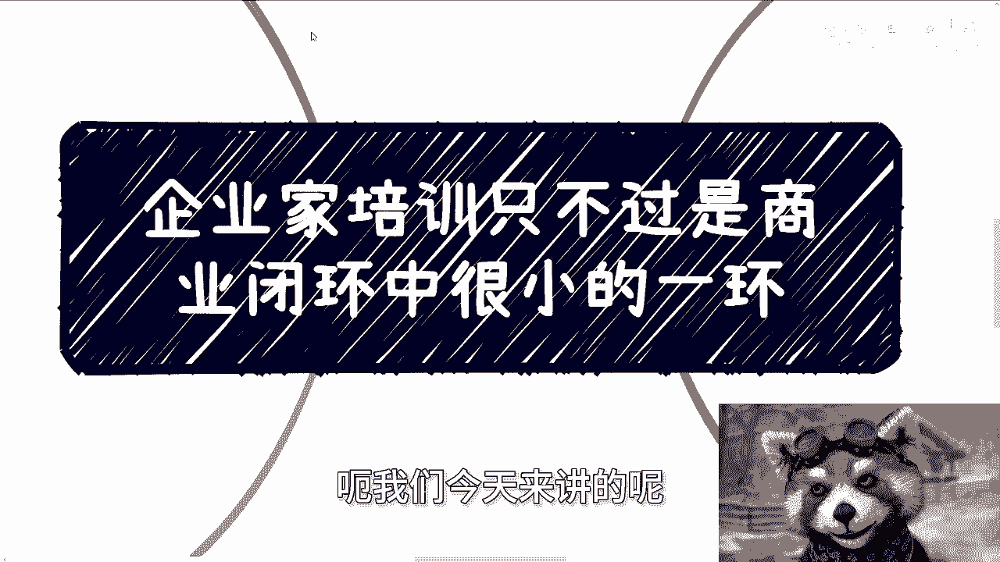

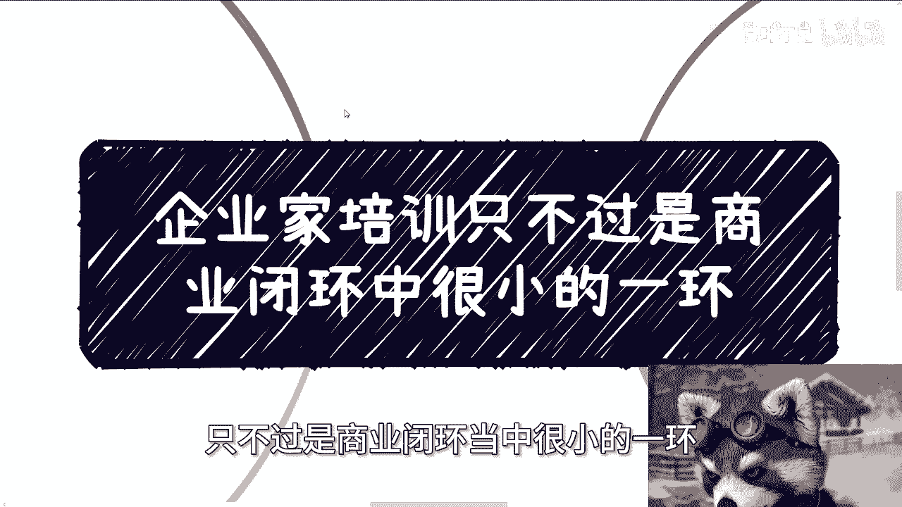

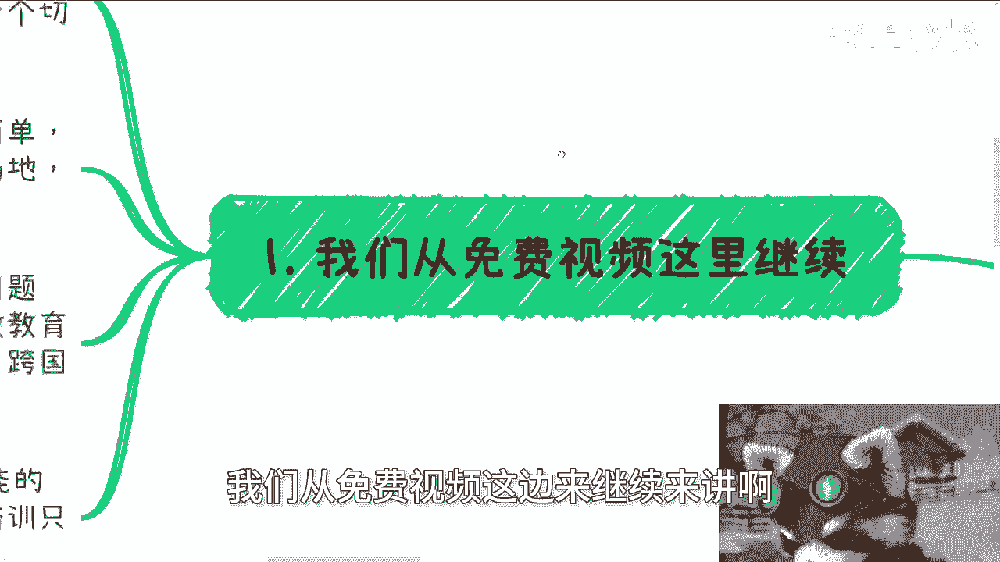

在本节课中，我们将学习企业家培训在整个商业闭环中的真实角色。我们将探讨为何培训只是一个“切入点”或“抓手”，以及如何利用它来撬动更广泛的商业机会。

---

上一节我们提到了培训的定位，本节中我们来看看为什么培训是一个理想的商业起点。

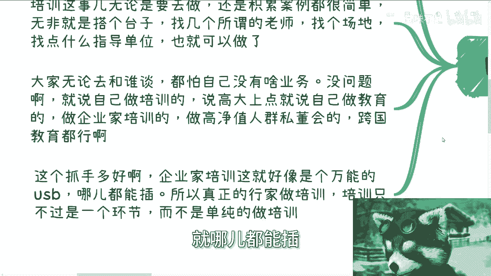

对于大多数人而言，培训是一个极佳的切入点。它的门槛相对较低，操作也较为简单。核心操作可以概括为：**搭台子 + 找老师 + 找场地 + 找指导单位**。这就像在游戏《怪物猎人》中，你可以选择用高超的技术（**初始装备**）挑战强敌，也可以选择先积累更好的装备（**资源**）再去挑战。关键在于，你需要一个“抓手”来开启你的业务。

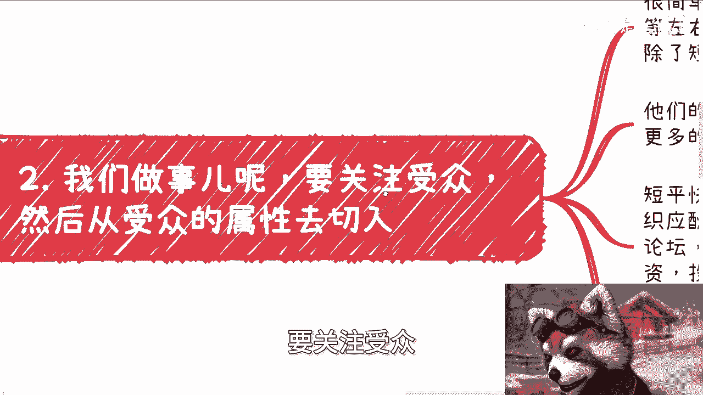

以下是培训作为切入点的几个优势：
*   **身份包装**：你可以将自己定位为“教育者”、“企业家培训师”或“私董会组织者”，这能快速建立相对专业的形象。
*   **易于启动**：无需复杂的初始业务或深厚背景，培训本身就是一个很好的开场白。
*   **灵活性高**：它可以作为多种商业活动的引子或组成部分。

---

理解了培训作为切入点的价值后，我们来看看真正的行家是如何操作的。他们从不将培训视为终点。

真正的关键在于**关注受众**。你需要从企业家的属性出发，思考他们除了知识之外，真正需要什么。他们的核心需求通常包括：**关系、资金、圈子、以及用于向上管理的宏观信息**。

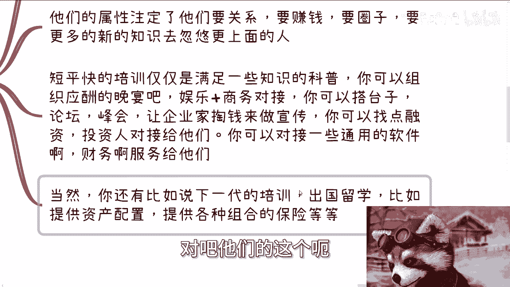

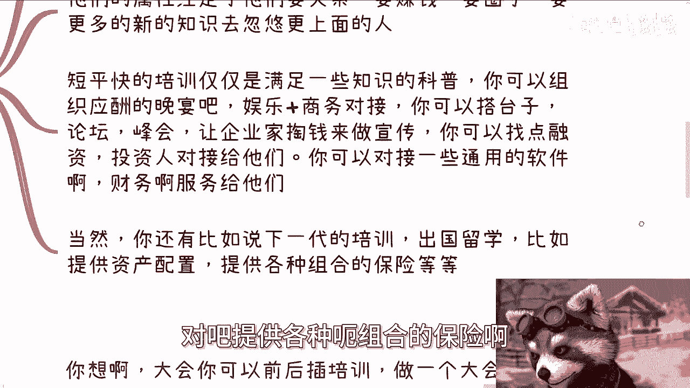

短平快的培训只能满足知识科普的需求。而作为一个组织者，你可以提供更多价值。以下是你可以拓展的服务方向：
*   **社交与商务**：组织应酬、娱乐活动和商务对接。
*   **平台搭建**：举办论坛、峰会，提供宣传曝光机会。
*   **资源对接**：引入投资人进行融资对接，或对接财务、法务等专业服务。
*   **衍生需求**：满足企业家下一代的教育需求（如留学规划）、资产配置、组合保险等。

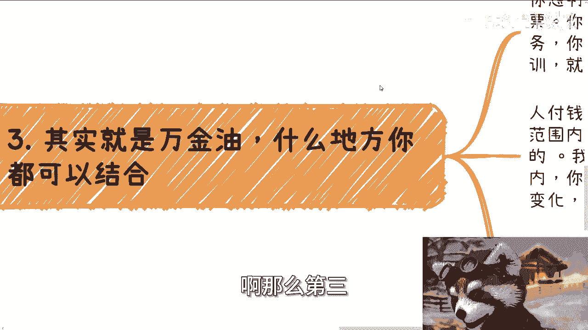

培训只是你接触客户的**USB接口**，通过这个接口，你可以连接并销售各种能产生现金流的服务。思维不能僵化，不要只盯着“培训”这一件事钻牛角尖。

---

既然培训是一个“万金油”式的USB接口，那么具体如何与其他业务组合呢？本节我们来探讨几种组合策略。

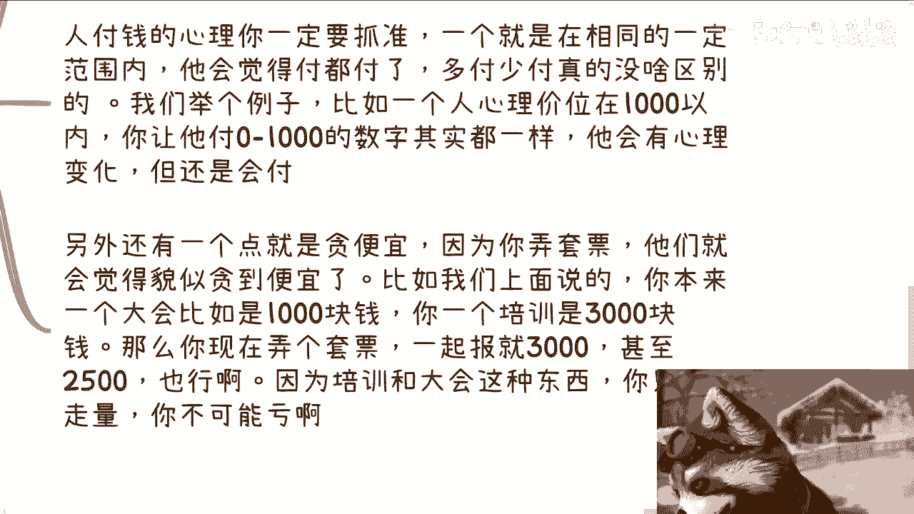

核心原则是：**将培训作为增值工具或组合产品的一部分**。具体策略取决于你主业务的定价。

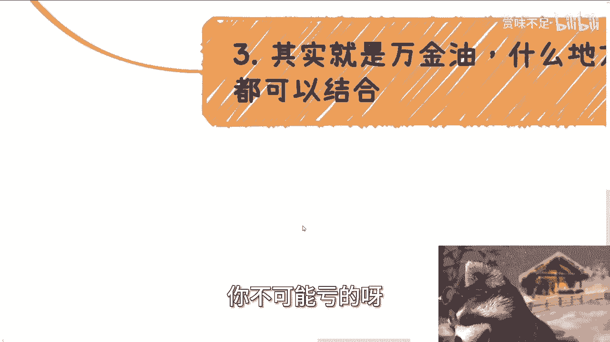

以下是几种常见的组合方式：
*   **做套票**：如果你的另一项业务（如大会门票）与培训单价相近，可以将它们打包成套票销售。例如：`大会门票（1000元） + 培训（300元） = 套票价格（1200元或更高）`。用户会觉得划算，而你增加了利润。
*   **做赠品**：如果你的主业务（如高端软件）价格远高于培训，可以将培训作为赠品。例如：`购买100万元的软件，赠送价值10万元的培训`。这能极大提升主产品的吸引力，而赠品的成本其实很低。
*   **灵活穿插**：在旅游、竞赛、软件销售等几乎所有活动中，都可以嵌入培训环节，增加活动的价值和吸引力。

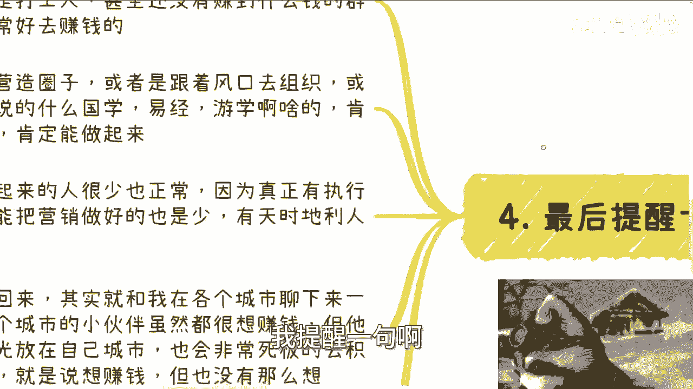

这种策略利用了用户的消费心理：**在可接受的价格区间内，用户对具体金额的细微变化不敏感，但非常看重“占便宜”的感觉**。套票和赠品正是为了营造这种超值感。

---

最后，我们需要认清企业家培训市场的本质，并明确自己的行动策略。

这个市场的受众，很多是“**有一定收入和自我膨胀，但本质上仍是打工人**”的中高层管理者。他们渴望提升、圈子和机会。因此，只要你能营造圈子、结合热点（如国学、易经），就肯定能找到受众。

那么，为什么成功的人不多？核心在于**执行力、营销能力和机遇**。很多人想法很多，但行动时却自我设限，例如过分纠结地域问题。如果发现一个城市不适合你的业务，更优的策略是**换个城市**，而非试图改变一个城市的属性。

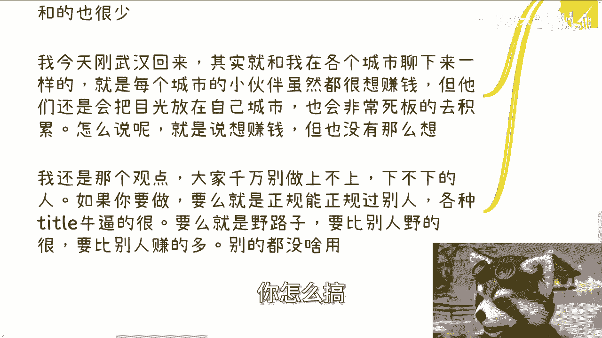

在行动策略上，切忌“不上不下”。你有两个清晰的选择：
1.  **走正规高端路线**：拥有顶尖的Title和资源（如院士、知名企业前高管），建立权威。
2.  **走差异化野路子**：在营销和玩法上比别人更大胆、更灵活，以效率取胜。

最糟糕的状态是：正规比不过别人，底线却比别人高，导致束手束脚。同时，要对市场有清醒认知。例如在抖音等平台，**夸张的营销和资源展示往往是吸引流量的“必经之路”**，这是平台的游戏规则之一。

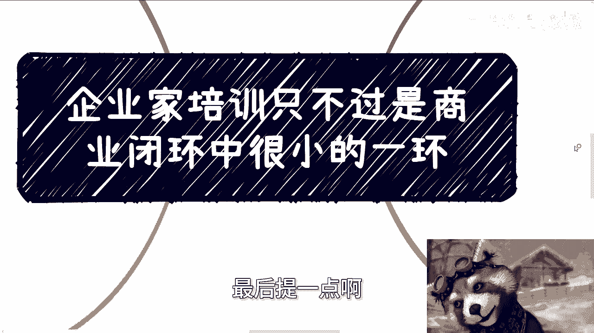

---

本节课中我们一起学习了：
1.  企业家培训是商业闭环中一个**低门槛、易启动的切入点（抓手）**。
2.  培训本身不是目的，真正的价值在于以培训为**USB接口**，连接并满足企业家在**关系、资金、圈子**等方面的深层需求。
3.  可以通过**套票组合**或**增值赠送**的方式，将培训与其他业务灵活结合，利用用户“占便宜”的心理提升成交率。
4.  要认清市场本质，提升执行力，并选择**要么极致正规，要么极致灵活**的策略，避免陷入“不上不下”的困境。

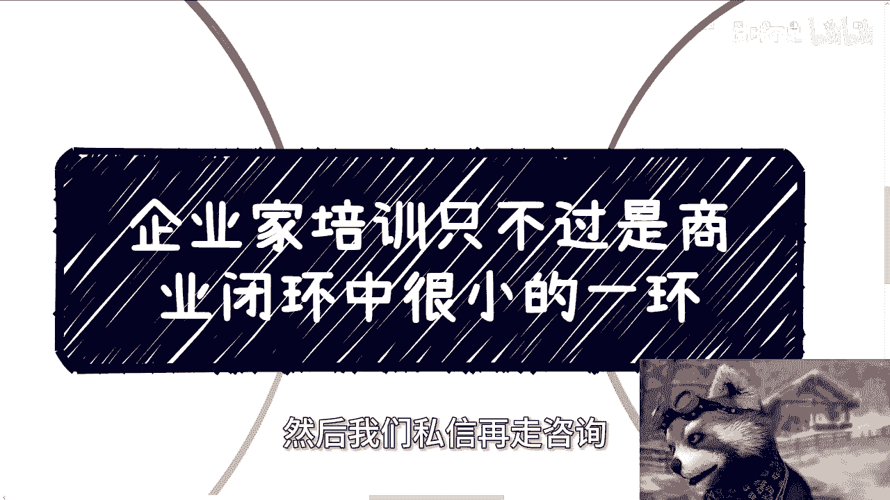

希望本课程能帮助你更清晰地规划商业路径。如果你在职业规划、商业设计或资源整合方面有具体问题，整理好你的现状与目标，可以寻求更进一步的规划建议。