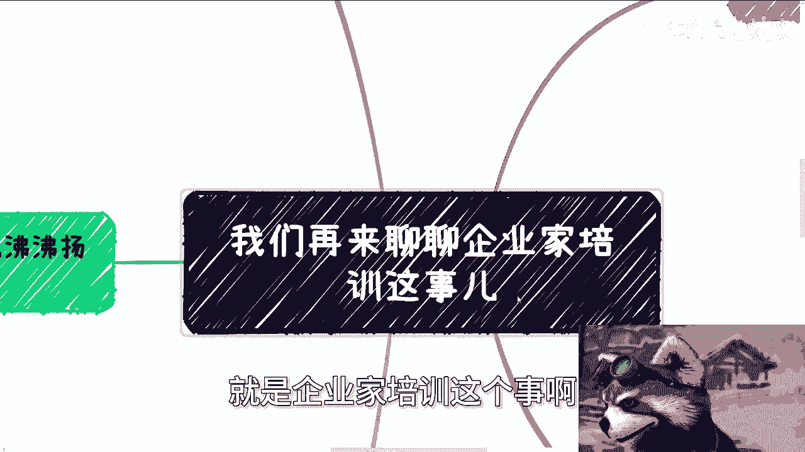
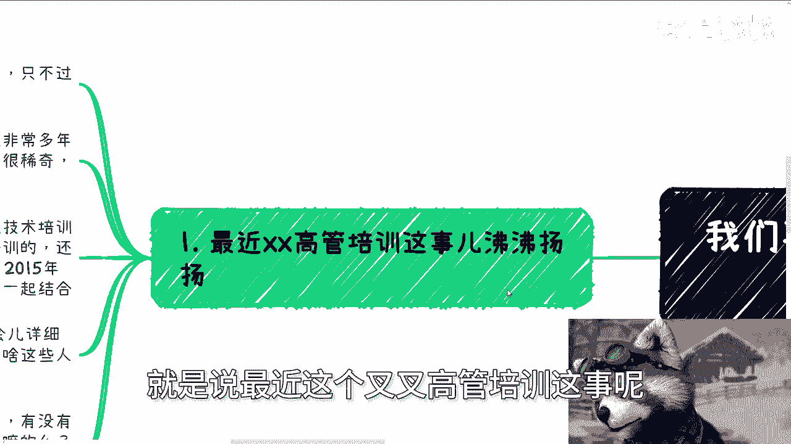
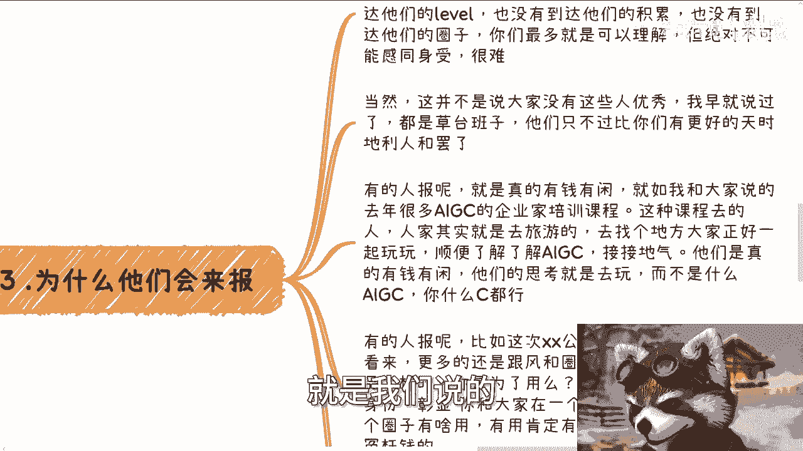
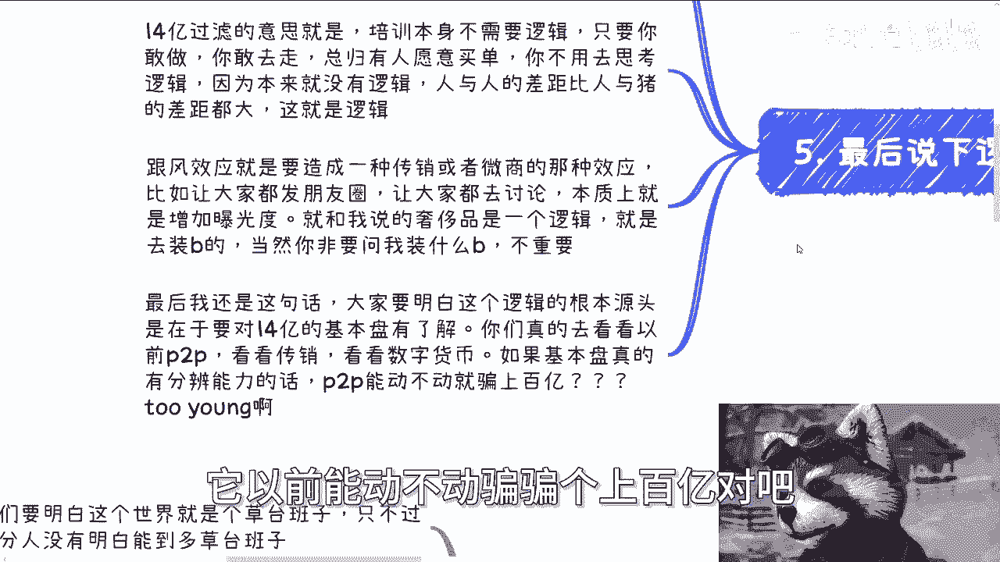
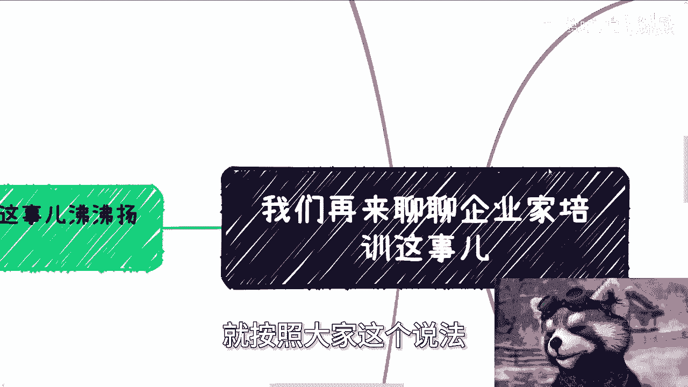

# 企业家培训的模式以及别人付钱的原因 - P1 - 赏味不足 - BV1xE421V7w6

好大家好啊，这个终于来武汉了啊，终于来武汉了，然后今天就比较晚了，因为晚上正好有人请吃饭，所以就哈哈哈事情比较多啊。

然后最近这个百度这个事情大家也看到了对吧，我来聊一下，就是企业家培训这个事啊。

就是很多人可能之前也没听到啊，呃第一呢就是说最近这个叉叉高管培训这事呢。

沸沸扬扬，首先啊你们要明白啊，这个世界就是个草台班子，只不过呢你们大部分人没有能明白，这个草台班子，草台能够多草台班子啊，那么企业家培训这个事呢，其实套路很多，而且已经非常多年了。

就我知道可能10年十多年都有了，那么我跟你讲啊，大家呢也别觉得这个东西很稀奇啊，同时也别觉得就是说啊，这个东西怎么还会有人，那个什么还会有人什么付钱对吧，或者怎么样，或者付很多钱啊，不用这么稀奇。

我跟你讲就是too young too young，那企业在培训这个事呢，我跟你我跟你们分一下类啊，有单纯技术培训的呃，管理领导力培训的啊，类似于高管商业培训的啊，还有什么CXO对吧。

CTOCOCFO啊，训练营的啊，还有这种跨国游学啊，2015年之后呢，还流行什么沙漠徒步，易经中医结合在一起，我跟你们讲啊，你们不要觉得稀奇，不要觉得就是啊我还能这样子，我跟你讲，不是还能这样子。

是已经这样子很多年了啊，你明白吗啊好当然啊，从你们来讲可能没什么概念啊，我待会会详细跟你们说一下，而且大家呢可能也就是没有想明白对吧，为啥这些人会去啊，包括就是说价格啊，我们待会再来说。

我先最后来提一下价值啊，就是说任何一件事情呢，我都是这个看法，就是有没有价值是看两面性的啊，就要看两方面，一个就是你如果知道你自己去干嘛，那么你知道你的目的是什么，那么你就可以去对吧。

另外一个就是说你你你比如说你，你另外一个就是你刚开始的时候，我相信啊，这些叫什么，就是企业家培训或者私董会啊，或者类似于这种东西，我都相信是这个认认真真做的啊，但是我跟你们讲这种东西都一样了。

时间一长他就开始水了，而且随着时间推移，他越来越水啊。

那么好，那么我来我先来说价格啊，呃首先这个价格由于不同城市肯定不一样啊，你们只能做参考，我不敢我不敢说，就是说怎么样子，但是我主要是给大家有这么一个概念啊，就脑子里面你们对我们说的就是这么一个量级。

你得知道啊，那么首先啊我觉得大家还是too young啊，没有经历过，就说当年全民创业啊对吧，真正经济上行的这种时候，单纯的技术培训啊，这种训练营中上层的管理层技术leader真整啊。

这种企业家培训差不多1万到2万之间啊，然后一场差不多，比如30人啊，当然也有可能更多啊，那么剩下私董会啊，游学啊对吧，什么跟比如说国学易经结合的，当然根据不同的城市不同的定位啊，我知道的话。

反正就是说3万5万7万10万啊不等，那再高可能你说有吧，有的啊，但是他就不是属于那种比较主流的这种啊，那么然后还有一些就是说这种风口的，那么这种风口的领域的，比如说像去年的AIGC啊，或者怎么样。

那么稍微高的地方其实可以开到10万20万啊，这样子，那么跨国的就更别说了，反正几10万起步也有可能小几10万，小几10万，小几10万吧，大几10万可能比较少，那毕竟都是对标那些真正NBA或者NBA的。

但是他肯定是低于相对来讲低于那些NBA和NBA的。

那么第三点就是我们说的为什么他们来报啊。

我之前活动上面呢其实也说过这个问题，就报名的人呢都是有不同目的的，呃你们不用去纠结，因为大部分人也没有到达他们这个level，也没有到达他们的积累，也没有到达他们的圈子。

所以呢大部分人其实最多呢你说理解能理解。

但绝对不可能感同身受啊，这很难，因为你没有到达这个level，没有这个圈子，你不可能感同身受啊，那么当然这并不是说大家没有这些人优秀啊，我早就说过了，无论是谁啊。

大大部分来讲都是草台班子，他们只不过是比你们有更好的天时地利人和，或者说不好听点，他们就是比你们早生了，那么呵呵也N年，那么有的人报呢就是真的有钱有闲啊，就是我跟大家说的，去年很多AIGC的企业家培训。

这种课程去的人，人家就是去旅游的，去找个地方，大家正好一起玩玩，顺便了解了解AIGC接接地气，我跟你讲啊，他们是真正意义上的有钱有钱，他们的思考模式就是去玩，就是大家组个队，然后找一个借口。

而不是说什么他妈的AIGC管你什么C对吧，都行啊，那么有的人报呢，比如说这次啊叉叉公司的这个事情啊，这种在我看来呢更多的都是跟风和圈子，有这这这这这种事，我跟你讲，你就跟买奢侈品是一样的，你我就这么问。

很多人买这种很贵重的手表，他是为了用吗，怎么滴，你看时间他们还用买手表吗，啊你你你你买很多包包是为了用吗，不是的，他是为了彰显他的身份，彰显他和某某人在某个圈子，但你非要问我这个圈子有什么用。

我就告诉你有用肯定有用的，但是不是说你一定要去花这个冤枉钱的，他没有因果关系，那那么当然还有一点啊，还有一点嗯啊好。

那么还有一点就是什么呢，就是那个啊我以前也说过，就是说有的人呢去纯粹就是为了装逼，这种就是说自己其实没有这么大格局，也没有这么大的积累，但非要去参加拍拍照，发发朋友圈啊，纯粹就是为了装个逼啊。

那么就好像很多人啊，为了一个就是这个什么对吧，叉叉学历啊，花个几10万是一样的，你问他有用吗，我大我说了，大概率，这个人他自己都不知道这个学历有什么用啊，那么第四啊，培训本身呢其实可以分成两点。

一类呢是短期的宏观跟案例的培训，一类呢是陪跑的那种操作培训啊，当然两者各有弊利啊，各有利弊啊，那么而且做得好的人呢，他其实两者都做，而且是分层分层做的啊，那么宏观跟案例培训呢更多的是高举高打。

也就是说国内外的趋势啊，说一些成功的案例啊对吧，而呃这种课程呢大部分来的比如说VP啊，manager啊，或者说企业战略层的，那当然啊，大家可以理解为动动嘴皮子的那类人啊，就很适合。

那么这类人的特点呢就是说他相对比较有钱，而且喜欢装逼，当然也有弊端啊，这这类人相对整个的基本盘来讲是少少部分，而且呢会容易要求很高，活动本身在各种细节付出的成本也好啊，包括培训本身内容也好。

包括晚上的晚宴也好等各个细节啊，当然可能还有些娱乐活动对吧，这里就不具体展开，不方便具体展开对吧，那么都要安排好，那么说是说培训其实更像一种跟团旅游啊，那么陪跑的那种呢，其实就如我之前说的，就是说啊。

就像现在小红书啊，抖音啊这种训练营啊，大家叫什么，培训完啊，其实还会有自己的这个操作啊，需要去陪跑，跟着大家一起来做操作，那么这种呢就是呃到最后能跑出来的，毕竟也是很少数的，但这个呢就跟彩票一样的。

大家都知道概率很小，但买的人不还是每天领三次换三次能买吗，对吧，他逻辑是一样的，就是你说大部分人知不知道这种，比如说陪跑这概率低，他也知道的，但是他就是有这么多人报，你怎么办呢，对不对。

那么这种优势就在于说基本盘呢，呃这个毕竟多韭菜多，但缺点就在于说时间周期长啊，就无论陪跑成本呢，还说流量的运营成本都很高，而且这类人呢往往根本没有第一类人，那么有价值，毕竟高举高达的企业家啊。

还有可能撮合一些项目而制成，而这些就是说底层的这种老百姓呢，他其实就是属于那种交完钱对吧，做嘛也做不出来的对吧，做出来嘛也是凤毛麟角的啊，就是相对来讲就不太可能会有这种项目，这种东西好。

那么最后一个就最后说一下这个逻辑啊，我以前也说过，很多人不听啊，或者不了解，就社会化的培训呢是这样子的啊，就是这个事无非就两个逻辑，一个呢是14亿人里面在做过滤，另外一个呢就是跟风效应。

就14亿人里面的过滤的意思，就是说培训本身它不需要逻辑，因为只要你敢做，你敢去走，总有人会愿意买单，你不用去思考逻辑，因为本来就没有逻辑，就是人与人的差距比人与猪的差距都要大，都要大，这就是逻辑啊。

那么跟风效应是什么呢，就是造成一种传销或者说微商的那种效应，比如说让大家在发朋友圈啊，让大家拉人头啊，让大家去讨论啊对吧，本质上就是增加曝光度，然后就跟我说的奢侈品是一个逻辑。

就是大家就是为了圈子而去的，为了所谓的潮流而去的，为了所谓的跟风而去的。

而不是说他真的为了参加这么一个东西啊，那么你非要问我这个装了什么笔啊，这并不重要，那么最后我还是这句话，大家一定要明白啊，逻辑的根本源头是在于说，要对这14亿的基本盘有基本的了解啊。

你们真的去看看以前的p two p啊，看看传销，看看数字货币，如果基本盘真的如你们所想的，有这么强的分辨能力，或者像你们想的说，哎呀很多人他妈不是对吧，怎么样怎么样啊，就有分辨能力的话。

你们自己去查一查啊，就是p two p他以前能动不动骗骗个上百亿对吧。

或者怎么样子，那就不可能啊，他骗不动了对吧，包括比较多的一些就是这种什么金融产品啊，保健品啊，那他也听不懂，就按照大家这个说法是吧。

所以说本质上来讲的话，你说这个为什么后面会增加一些国学啊。

或者说增加一些这个这个这个这个易经啊。

相关的一些东西啊，就是因为就是说这些东西呢，相对来讲跟那些参加这个企业家培训或者EMBA，培训的这种人群呢，他的这个受众人群是同一种群体，就是说这类人呢，他相对来讲就是说又是一个管理者对吧。

又是一个比如说啊这个喜欢跟风的啊，然后呢又会对这种玄学啊，对这种某些东西又又比较感兴趣，或者怎么样的啊，那么所以说就是是这么个情况啊，好那么基本上就是这么个情况好吧，然后武汉活动明天就开始。

然后呃我们职业规划啊，商业规划，然后股权啊丰润啊对吧，包括分红啊，包括就是呃这个商业计划书啊，包括就是说你们手上有什么牌，或者说你们手上呃没有牌啊，那么你们希望通过我的一些视角，或者大家一些沟通啊。

能够给大家带来一些呃更好的一些规划的话，你们也可以整理好对应的背景跟问题啊。

