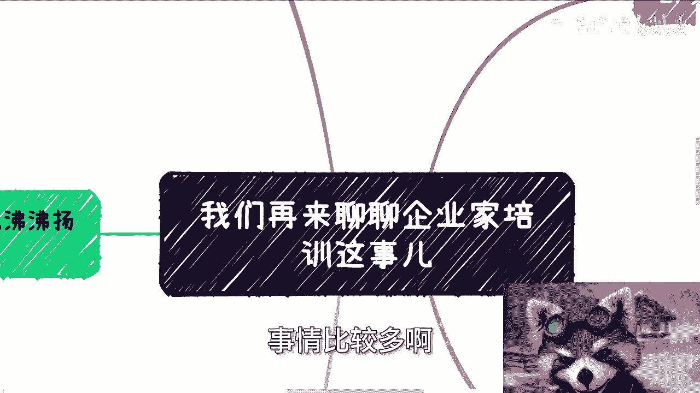
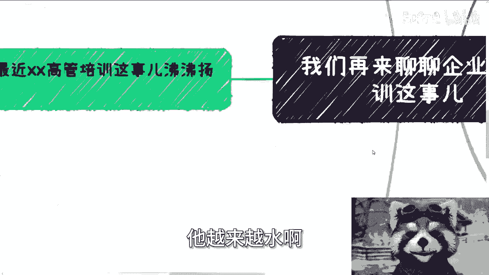
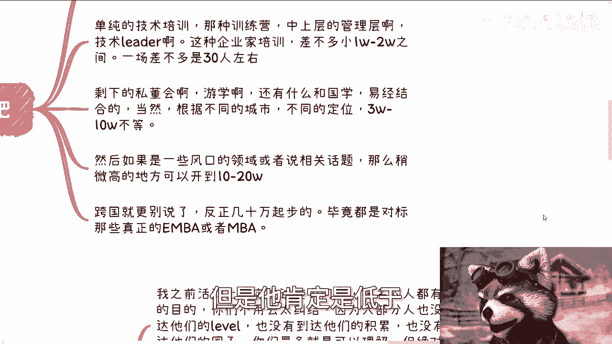
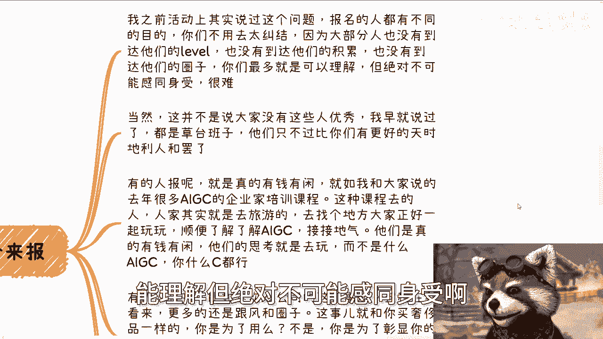
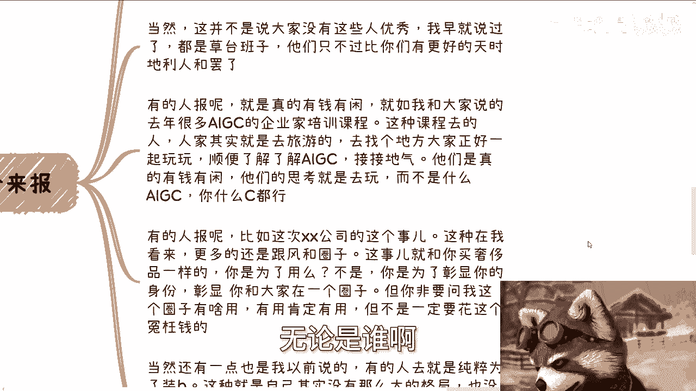
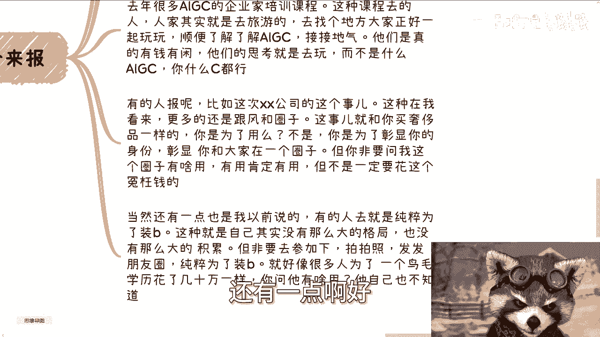
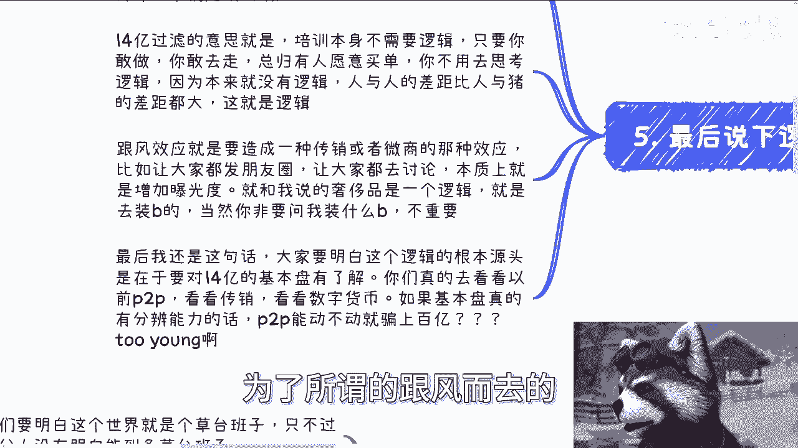
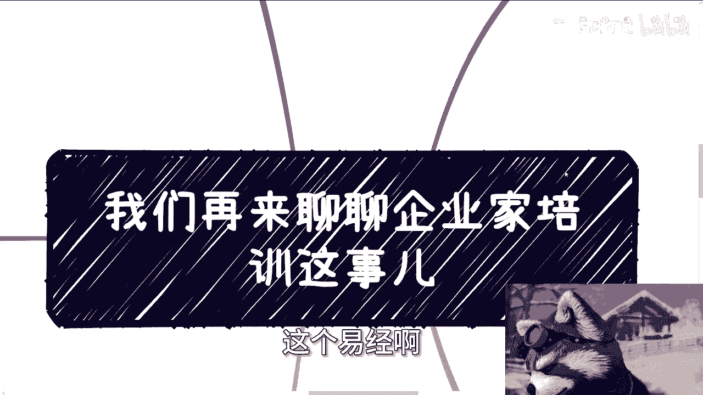
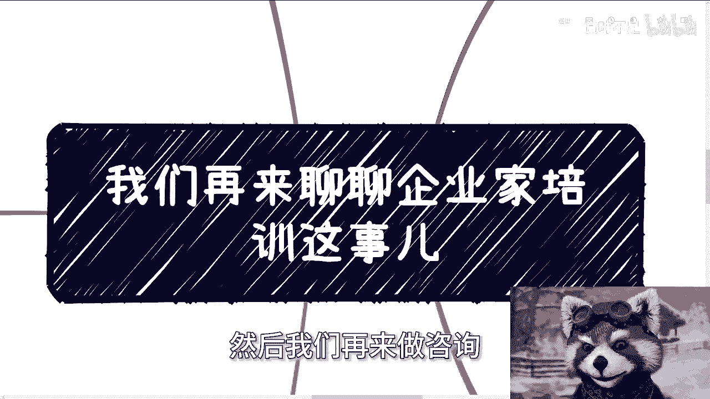

# 企业家培训的模式与付费逻辑解析 🧠 - 课程 P1

在本节课中，我们将深入探讨企业家培训行业的常见模式，并分析其背后的付费逻辑。我们将从培训的分类、价格区间、参与者的动机以及行业的核心运作逻辑等多个维度进行拆解，帮助你理解这个看似复杂却有其内在规律的市场。

## 培训模式的分类 📊

上一节我们概述了课程内容，本节中我们来看看企业家培训的具体分类。这个行业已经存在多年，模式多样，并非新鲜事物。

以下是几种常见的培训类型：

*   **技术培训**：面向中高层技术管理者的专业技能提升课程。
*   **管理与领导力培训**：侧重于提升管理能力和领导艺术的课程。
*   **高管商业培训**：针对企业高管设计的综合性商业课程。
*   **CXO训练营**：专门为首席技术官、首席运营官、首席财务官等角色设立的训练项目。
*   **跨国游学**：组织学员前往国外进行考察与学习。
*   **复合型培训**：例如自2015年后流行的将沙漠徒步、易经、中医等元素与商业培训相结合的课程。

## 培训的价格区间 💰

了解了培训的类型后，我们来看看它们的价格水平。价格因城市、定位和主题差异很大，以下数据仅供参考，旨在提供一个量级概念。

以下是不同培训的大致价格范围：

*   **技术与管理类培训**：针对中上层管理者的课程，价格通常在**1万到2万元**人民币之间，每场规模约30人或更多。
*   **私董会、游学及国学类培训**：根据城市和定位不同，价格在**3万、5万、7万到10万元**不等。
*   **风口领域培训**：例如去年的AIGC主题培训，价格可能高达**10万到20万元**。
*   **跨国培训项目**：价格通常**几十万元起步**，但一般低于真正的顶级商学院课程。

## 参与者付费的动机 🤔

那么，为什么有人愿意支付如此高昂的费用参加这些培训呢？参与者的动机各不相同，这与他们的个人背景、所处圈子和具体需求密切相关。

以下是几种主要的付费动机：

*   **有钱有闲，以玩会友**：部分参与者纯粹是为了休闲和社交。例如，参加AIGC课程的人可能只是想找个理由与同层次的人一起旅行、聚会，顺便了解新趋势。他们的核心诉求是“找个借口组队玩”。
*   **融入圈子，彰显身份**：这与购买奢侈品逻辑相似。参与培训是为了进入或巩固某个“圈子”，彰显自己的身份和地位。其价值在于社交归属感，而非培训内容本身。例如，某公司高管集体报名事件，更多地被视为一种跟风和圈子行为。
*   **盲目跟风与装点门面**：有些人自身积累不足，但为了拍照发朋友圈、装点个人形象而参与。这类似于花费几十万元获取一个自己都不清楚具体用途的学历。
*   **实际学习需求**：当然，也存在真正希望获取知识、趋势或案例的参与者，但这并非唯一甚至不是主要动机。

## 培训内容的两种形态 📖

接下来，我们分析培训内容本身。市场上的培训主要分为两种形态，它们的目标人群和运营模式截然不同。

以下是两种主要的培训内容形态：

1.  **宏观与案例培训**：这类课程**高举高打**，主要讲解国内外趋势和成功案例。目标学员多为企业副总裁、总监等战略层人员。课程更像一种高端的“跟团游”，非常注重活动细节、晚宴安排等体验。优势是学员价值高，可能促成项目合作；劣势是受众群体小，要求苛刻。
2.  **陪跑式操作培训**：这类课程**注重实操**，培训后提供一段时间的“陪跑”服务，指导学员具体操作（如小红书、抖音运营训练营）。目标学员是希望落地执行的创业者或个体。优势是潜在学员基数大（“韭菜”多）；劣势是周期长、运营成本高，且成功转化率低，学员价值相对较低。

## 行业底层的核心逻辑 ⚙️

最后，我们来揭示支撑这个行业运转的两个核心底层逻辑。理解了这些，你就能看透许多社会培训现象的本质。

社会培训的运作主要依赖以下两个逻辑：

*   **14亿人口基数过滤**：培训本身可以没有严谨逻辑。因为在中国巨大的人口基数下，只要敢于推出产品并进行推广，**总会有一定比例的人愿意买单**。人与人在认知、需求和判断力上的差异极大，这本身就是一种市场逻辑。公式可以简单理解为：`潜在客户 = 总人口 × 转化率`。即使转化率极低，绝对数量也可能非常可观。
*   **跟风与圈子效应**：通过营造稀缺性、鼓励学员在朋友圈展示、拉人头等方式，制造**传销或微商式的跟风效应**。这本质上是在销售一种“圈子”归属感和潮流身份认同，与奢侈品营销逻辑一致。人们付费是为了进入“潮流行列”，而不是为了产品本身。

### 课程总结

本节课我们一起学习了企业家培训的多样形态、价格体系、参与者的复杂动机以及“宏观案例”与“实操陪跑”两种内容模式。最重要的是，我们揭示了该行业赖以生存的两个根本逻辑：**利用巨大人口基数进行概率筛选**，以及**营造跟风与圈子效应来驱动消费**。理解这些，有助于我们更理性地看待市场上纷繁复杂的培训产品。