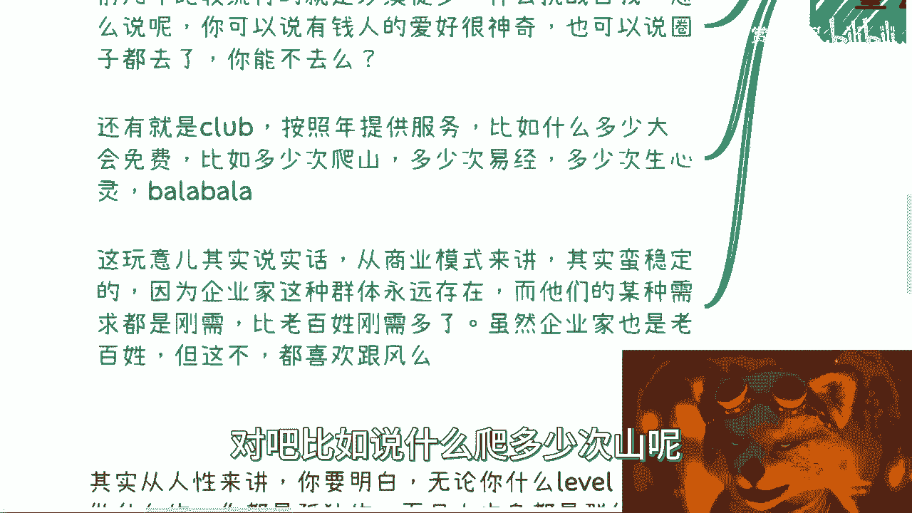
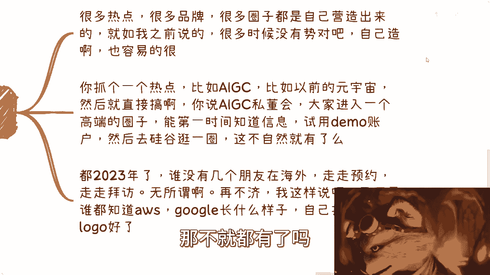
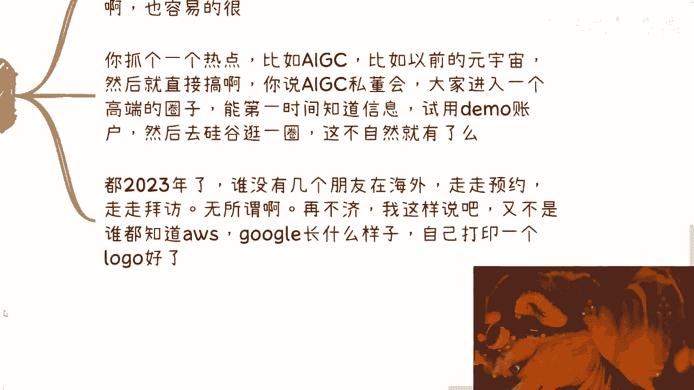

# 企业家培训私董会篇02：完整的商业逻辑框架 🧠

在本节课中，我们将深入探讨企业家培训与私董会背后的完整商业逻辑框架、核心流程与运营本质。我们将剖析这一商业模式稳定存在的根本原因，并理解其目标用户的核心诉求。

上一节我们介绍了企业家培训的基本概念，本节中我们来看看其背后完整的商业逻辑框架。

## 商业模式的核心：打造圈子

无论这类活动每年流行什么名称（例如“私董会”、“Work”等），其本质都是**打造圈子**。培训本身在这一逻辑中是价值较低的一环。所有企业家活动的运营核心都是围绕“圈子”展开，没有圈子，就不会有人参与。

因此，针对企业家的营销、运营和话术，无论是明示还是暗示，都必须围绕“加入高端圈子”这一核心感受来设计。绝不能让他们感觉只是来“上课”的。

## 企业家的核心刚需：展示与认同

许多创业者或企业家在取得一定成功后，往往更倾向于展示自我、获得认同，而非单纯听课学习。因此，“私董会”这类形式应运而生，它本质上是一种**高端化的头脑风暴**或情景体验，旨在满足企业家的展示欲与圈层归属感。

以下是过去流行的几种满足该需求的活动形式：

*   **沙漠徒步/挑战自我**：例如前几年的戈壁徒步。参与者多非顶级富豪，而是渴望通过此类活动接触更高圈层、实现阶层跨越的人群。其参与费用可能来自贷款。
*   **高端主题俱乐部**：提供诸如易经、身心灵等免费课程或活动打包，制造“超值”感，但其实际效用有限。
*   **游学与研学**：参访知名企业（如BAT、字节跳动）、前往稀有或高档地点（丽江、玉龙雪山、海外）。核心目的是为参与者提供**可用于展示的素材**。

## 商业逻辑拆解：提供“装逼”解决方案

企业家参与此类活动的**最大刚需**是**展示自我价值（俗称“装逼”）**。商业模式的核心就是为他们提供一套完整的、高端的展示解决方案。

**商业公式**可简化为：
**利润 = 提供高端展示场景与服务 - 实际运营成本**

具体操作方式包括：

1.  **营造高端环境**：选择高档场所、提供稀有体验（如怀石料理、黑珍珠餐厅）。
2.  **制造展示素材**：组织参访名企、海外游学，核心是创造拍照和社交分享的机会。
3.  **捆绑热点概念**：借助AIGC、元宇宙等热点，自行打造“高端圈子”或“俱乐部”，承诺提供内部信息和前沿体验。

关键在于，许多参与者并不具备鉴别这些服务真伪或实际价值的能力。他们购买的是“进入某个圈层”的感觉和后续的展示资本。

## 底层逻辑：理解时代与群体差异

这一商业模式之所以稳定，是因为它精准命中了特定时代背景下崛起的企业家群体的心理：

*   **幸存者偏差与认知局限**：许多当前的成功者，其财富积累源于特定历史时期的趋势红利，而非全面的认知或实力。他们可能对新兴事物（如技术）了解不深，但拥有强烈的展示和圈层融入需求。
*   **危机感与群体归属**：越是身处高位，潜意识中的危机感越强。融入圈子能带来安全感和归属感，这是人的基本社会需求。
*   **发展眼光看问题**：不能用当下高知年轻人的认知标准去评判另一个时代崛起的群体。他们的思维模式、信息获取方式和展示需求是特定环境的产物。服务提供者需要的是“接地气”，理解并满足他们的真实需求，而非进行价值评判。

本节课中我们一起学习了企业家培训与私董会商业模式的核心。其本质并非教育，而是**为企业家群体打造高端圈子、并提供用于展示价值的“素材”与“场景”**。成功的运营者需要深刻理解目标用户（特定时代背景下的企业家）的深层心理诉求——展示、认同与圈层归属，并围绕这些诉求设计完整的体验流程。理解这种“需求创造与满足”的逻辑，是看懂此类商业模式的关键。