# 企业家培训私董会篇02：我们来说下背后完整的商业逻辑 - P1 - 赏味不足 - BV1dH4y1z7Zn

好，今天我们来讲第二个就是企业家培训私董会啊，整个框架和流程以及商业的逻辑是什么，我先跟你们说个事，其实我刚刚录了一遍了，但是他妈的没有录进去，我的心中一一千匹草泥马奔过去的。

诶怎么回事啊，啊真的现在怒气值很高。

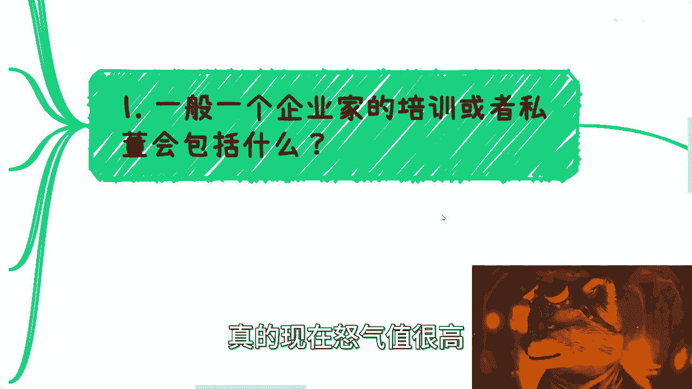

我刚刚其实还可以啊，首先第一个，一般一个企业家的培训或自动会包括什么啊。

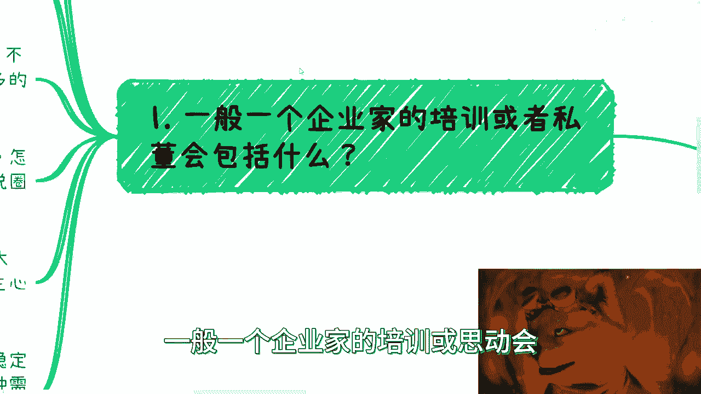

首先我们来看啊，首先这玩意每一年都有这个流行的东西，比如说现在work啊，你们不知道work可以去看一下。

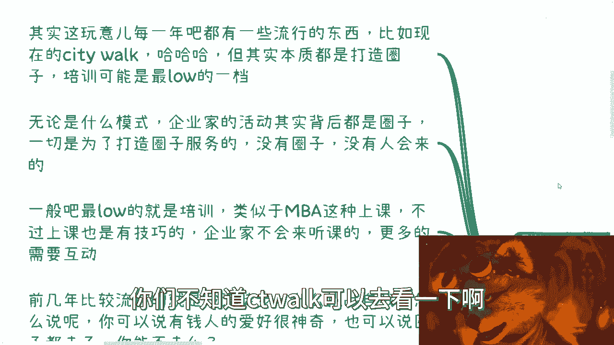

但其实本质啊，你甭管它叫什么东西，你明天叫什么叫什么别的work啊，也可以啊，本质上都是打造圈子啊，所以而且呢你得明白啊。

所有的逻辑当中，培训这一层逻辑是最low的一档啊，最弱的一档，第二点呢就是无论什么模式啊，企业家的活动其实背后都是全职啊，一切都是为了圈子服务的，一切为了打造圈子服务，没有圈子，没有人会来的哦。

所以说你要明白，如果你要做企业家培训，你对他们的营销，你对他们的那个呃营那个叫什么运营，或者你对他们的话术，一定是围绕这个圈子，甭管你是明面还是暗地里，你要让他们感受到这么一个东西啊。

你别让他们感觉到卧槽他妈的，你是来给我们上课的，那不好意思，谁哪些企业家过来上课，对啊，一般嘛我跟你讲，最low的就是培训，类似于像BA这种上课，不过我跟你讲，上课也是有技巧的，因为你要明白。

很多的企业家或者很多的创业者，他们的性格都是有缺陷的哦，或者说也不叫有缺陷吧，就是有一些人赚了一件一点钱之后，他就开始膨胀了，你懂吗，他就喜欢鼻孔看人啊，指着别人鼻子说，指着别人鼻子说，你知道吗。

就一点修养都没有啊，那么所以你要明白企业家很多他不会来听课啊，他更多的是希望展露自己啊，那么希望有这个圈子，那么所以说呢，我们在给他们做这种东西的时候呢，可能更多的叫私董会，私董会就是什么。

就是头脑风暴啊，就是营造那种非常高端的，小朋友过家家的感觉啊，那么前几年比较流行的是什么呢，沙漠徒步啊，什么挑战自我啊，什么乱七八糟的呃，可能很多人很小啊，他不知道啊，我来给你们描述一下啊。

你像2017年2018年啊，特别很多人喜欢什么爱剧沙漠徒步，我是你，我跟你们讲，你们是不知道啊，就动不动啊，朋友圈他妈的一会儿嘛，这个沙漠一会儿嘛，那个沙漠你甭说他们是沙漠呢，还他妈拖着我去对吧。

我说他妈的我是吃饱了撑的吗，我他妈在上海不开心吗，啊你非要叫我到他妈的沙漠走一圈啊，你我跟你讲，你可以说有钱人的爱好很神奇啊，也可以说你的他们的圈子都去了对吧，那么你说圈子都去了，你能不去吗。

你能脱离群体吗，但是我告诉你们，这些人还真的不是有钱人，这些人跟所谓的有钱人还真的不是一个群体，你懂吗，哦就是这些人更多的像什么，更多的是那些自己希望变成有钱人的那种人，哦也就是说它更多的是会有种感觉。

是说我希望加入这个圈子之后，比如说我去沙漠徒步一下，我来上海city walk一下，我是不是就能够加入某些圈子，或者说能够这个叫什么，就是这个跨越某些阶层，他们是这种想法，所以说你要明白。

他们去的这种钱不一定是他们的，很多都是贷款的好，那么你说它有没有用对吧，我不能说完全没有用，但是你要说有多大用，我给你们举个例子，这就像你们平时对你说好，我要增加点维生素C，那怎么弄呢。

你泡一个泡腾片对吧，那你说泡腾片有没有用，我能说它有用，你敢说它没有用吗，对不对，但是你说泡腾片能不能医治百病，那当然不行啊，那这个东西也是一个道理一个道理啊，就你说这个东西是不是骗局。

我我我表示也不能一刀切，那你说你你花个几万块钱，甚至小10万块钱去徒步一下，你能怎么地呢，我就请问你能怎么地呢啊。

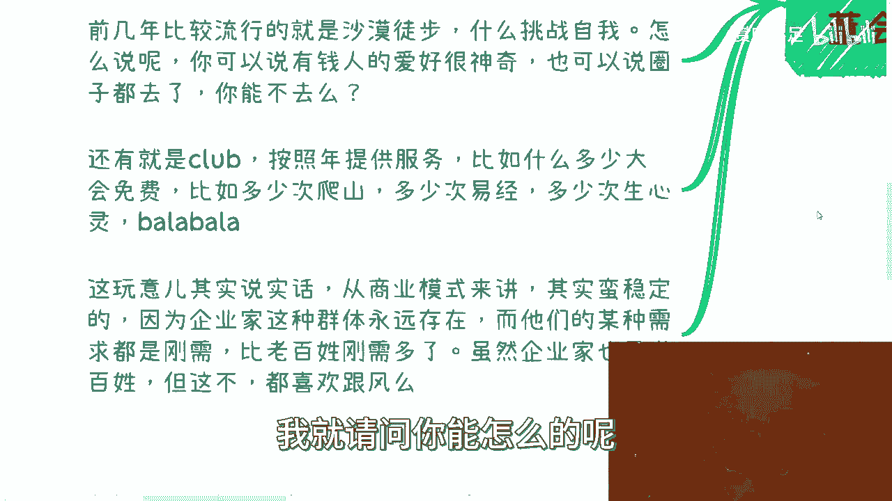

还有就是club按照免费提供服务，比如说什么一年多大会免费啊，什么爬了多少次山呢对吧。

比如说什么多少学多少次易经啊，多少次身心灵啊，巴拉巴拉巴拉巴拉写一堆啊，让你感觉好像你花了这点钱很牛逼啊，很值，但然而并没什么卵用啊，我告诉你们为什么没什么卵用，很简单，所谓我们做一个商业逻辑。

正正应该知己知彼对吧，为什么没有卵用，是因为是因为你你卖给他们东西，其实你是在做一种一种思想植入，你卖的东西其实不一定是他们想要的，但是你要让他们感觉嗯我很想要这个东西，那怎么办呢，对不对。

没有办法的呀。

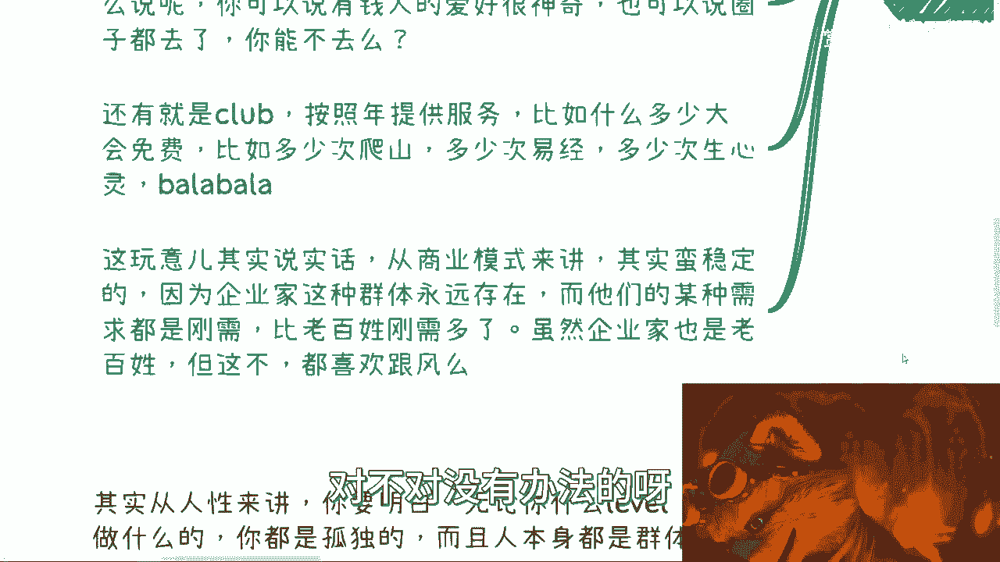

哎我跟你们讲，真的，你们一定要明白一点，你们想赚钱，你就必须这么做。

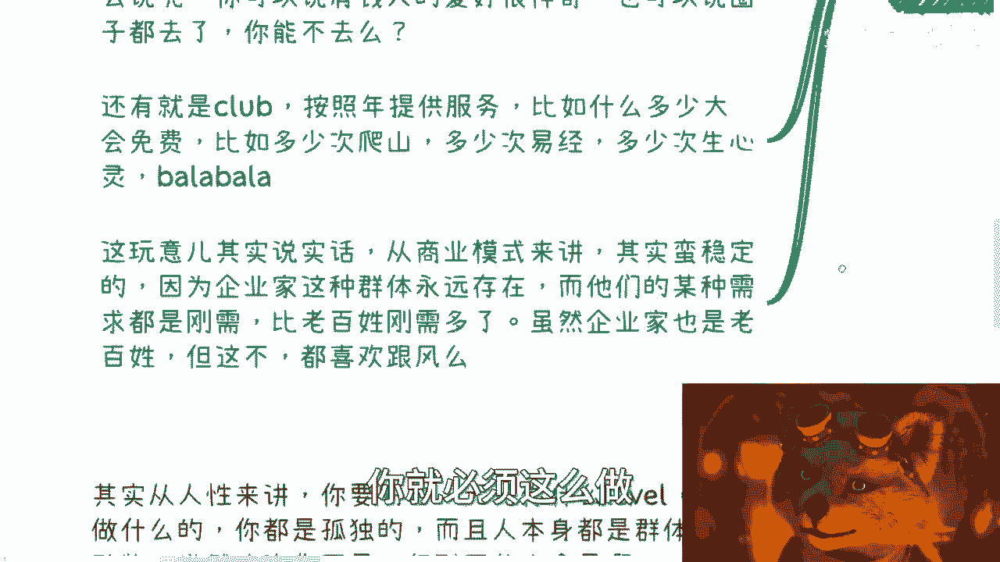

你不这么做，你赚不到钱的啊，哥哥们啊，那这玩意呢其实说实话啊。

从商业模式来讲其实蛮稳定的，因为企业家这种群体我跟你们讲啊，企业家创业者这种群体呢永远是存在的，而且他们的某种刚需啊，某种需求就是刚需诶，你们先猜猜看，你们先猜猜看他们的我说的他们的需求是什么。

我觉得大部分人猜不到的，猜不到，因为大部分人觉得企业家就我跟你们说，你们的很多认知是不对的啊，我就要慢慢慢慢来给你们纠正你们的认知啊，呃这个刚需我待会给你们讲啊，他们这种刚需比老百姓刚需要多了去了啊。

刚刚的多难啊，虽然企业家也是老百姓，但是哎这不难对吧。

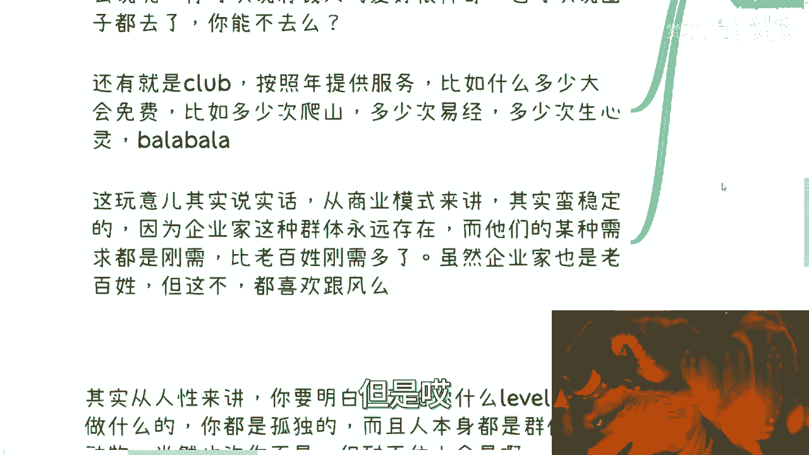

还是有点区别的啊，好我们来说企业的刚需啊，第一为什么企业家培训当中。

或者企业家的这种私董会当中，游学研学如此吸引企业家。

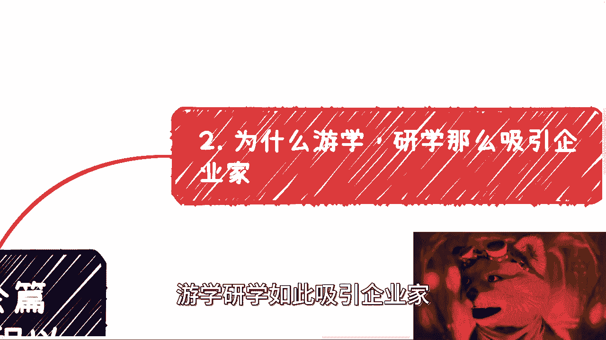

为什么你知道吗，看好啊，企业家最大的刚需没有之一，装逼结束了啊，而且我跟你讲，越low的越喜欢装逼，就这么简单没了。

我跟你讲，所有的圈子背后都是装逼，就这么简单，你要做的就是提供给他装逼的素材，就是他要往前突突突，你让他突突突啊，对不对，就这么简单啊，好你看啊，怎么装，怎么能装逼呢，啊高档的环境。

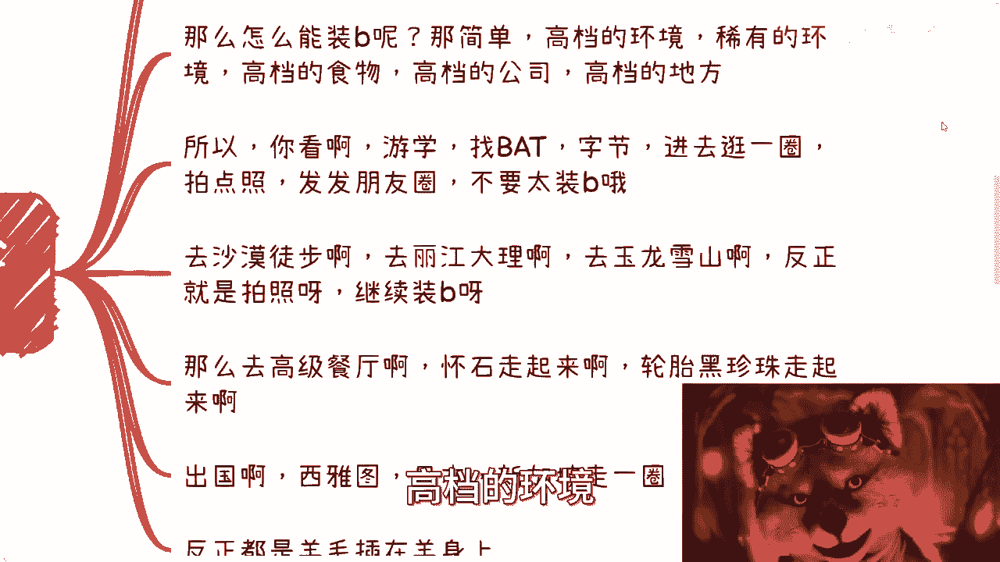

稀有的环境，高档的食物，高档公司，高档的地方，对不对，所以啊你看啊游学找BAT对不对。

找字节，找京东啊，找找亚马逊，对不对，进去逛一圈，找特斯拉拍拍照，当然特斯拉不允许你们拍，不好意思，特斯拉我已经问过了，特斯拉不允许外面人进去。

对吧啊，拍点照发发朋友圈，不要太装逼啊，这逼他妈上天了啊。

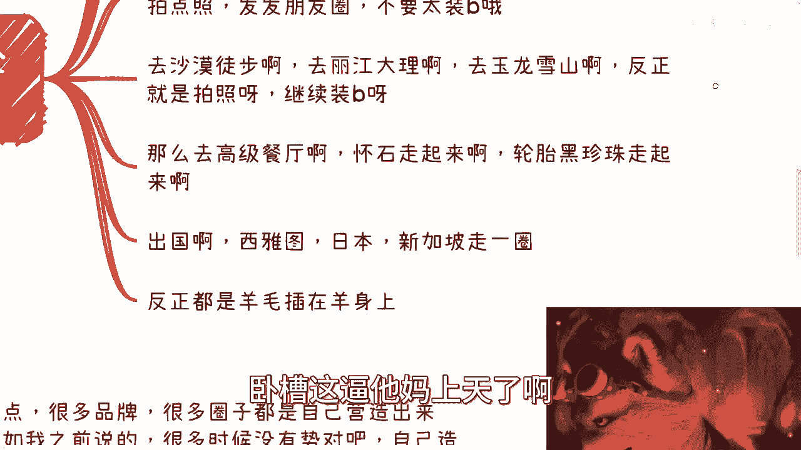

比如说去沙漠徒步啊，去丽江大理啊，去玉龙雪山啊，反正就是拍照继续装逼啊，人家去旅游，我他妈是跟随所谓的什么什么CEO，是总会过去的。

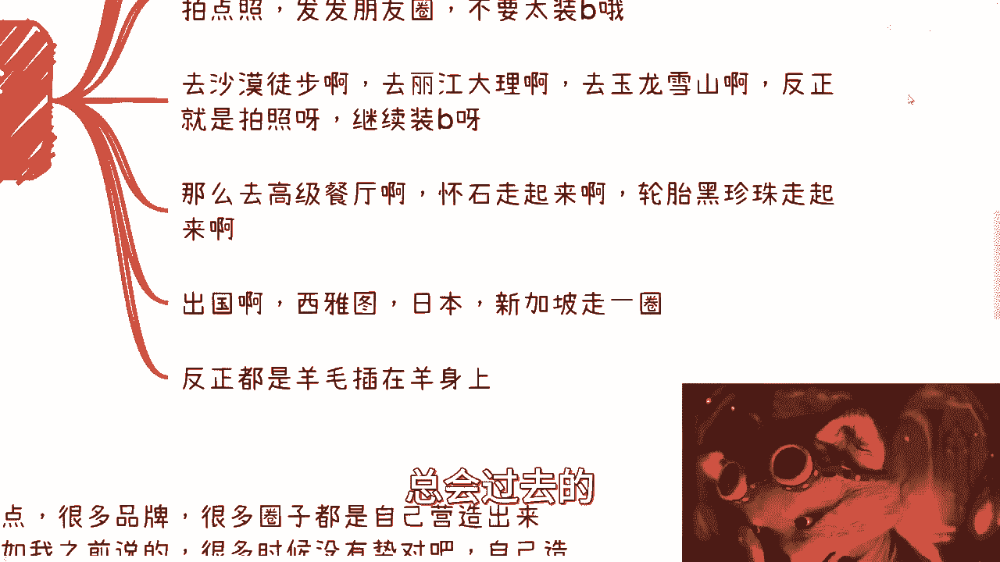

不，但其实还是旅游，对不对啊，然后呢去高档餐厅怀石走起来，轮胎黑珍珠走起来，对不对，吃还没吃呢，菜还没端上来呢，门头先他妈的一波拍照，先表示我老牛逼了对吧，大家懂不懂怀石啊，有没有吃过啊对吧。

有没有吃过没有菜单的，他妈的2000块钱的日料啊对吧，我吃过，但其实他妈的还自己付钱，对不对啊。

好然后呢出国西雅图，日本迪拜，新加坡走一圈，对不对，走一圈好，但是啊我跟你们讲，游学的逻辑很简单，就是羊毛都是插在羊身上的，为什么，因为一般游学研学它起步价也是十几万，20几万。

所以你会发现啊，这些企业家装逼，只不过是你帮他制定好一堆流程，让他去装逼，他可能low到都不知道怎么装，你明白吧，你们不要觉得企业家多么牛逼，没有用的啊。

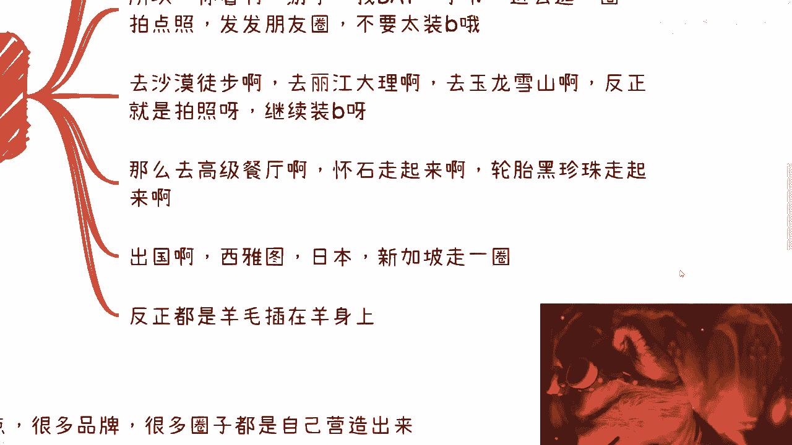

没有用的，所以说啊我这个后面我来跟你们讲啊。

所以说你会发现这个羊毛其实是插在羊身上，相当于所有的费用自己出，他还额外的给你10万到十几万的利润，还要到最后跟你说，谢谢哦。

就这样子怎么办呢，啊我跟你讲啊，说到这啊，有很多人要有很多人。

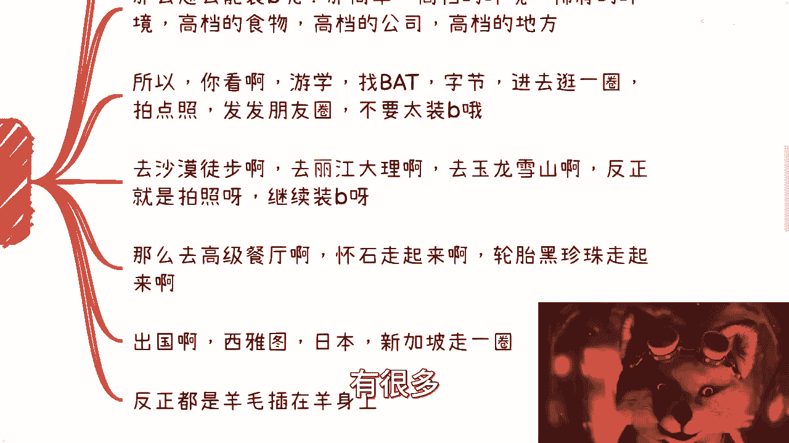

我相信很多人心里面会想一个问题，这有点过分了，企业家有这么冷吗，哎我跟你讲，不好意思，你们不懂企业家，你们你们我跟你们讲啊，你们一定要有一个叫什么叫发展中的眼光，可持续发展的眼光，你知道什么意思吗。

意思就是说比如说啊，我之前一直说35岁要失业对吧，或者我一直说大家到35岁以后吧，可能就是工作都找不到了对吧，或者怎么样，很多人就是反驳，我现在都找得到的，现在怎么找不到了，这种他妈没脑子。

为什么我说的是你们到35岁，没有说他妈的现在35岁懂吗，这他妈不是一个逻辑啊，啊什么意思呢，意思就是说你们现在都是高材生啊，你们现在都懂得很多，你们现在都有互联网。

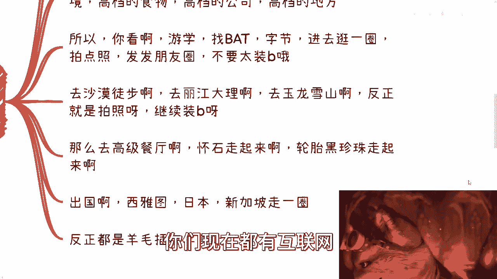

你们往后是不会变成这么low逼，但是不好意思，现在这个社会真正的有钱人，不是你们是这群low逼，懂了吧，好第二点啊。

没有圈子怎么办呢，很多热点很多品牌，很多圈子都是自己营造出来的，就如我之前说的啊，很多时候呢没有事对吧，没有关系。

你自己造啊，比如说我们举个例子，比如说你装你抓一个热点啊，比如说AIGC啊，呃这个以前的METAVERSE对吧，直接搞，你就说你说他妈的，我现在搞了个AIGC4总会啊，当然太low了吧，你随便搞个名字。

AIGC什么什么什么，我我背后有FDATION啊，我前面搞搞一个什么什么club对吧，搞一个什么东西好，大家进入一个高端圈子是吧，能第一时间知道信息能适用demo对吧，你就你就当时在3。5的时候。

你就跟他说GPT5你们马上就能用了，你怎么管他呢，的对不对，谁能懂GBT4跟GBD5的关系，谁能懂，他妈现在是GBT3。5啊，你以为他妈的这些真的付十几万的人懂啊，懂个屁啊，懂懂的人会付钱的。

你真是对不对啊，然后呢，你就跟他们说，我带你们带硅谷逛一圈，对不对，那不就都有了吗。

装逼一条龙，对不对，都2023年了，我就跟你们说，谁没有几个朋友在海外啊，你走走预约预约怎么啦，走走拜访拜访怎么了，我跟你讲，再不济我就跟你说啊，你以为是谁都知道aw google长什么样子吗。

谁都能知道aw google的办公室长什么样子吗，自己打印一个不好的，离谱吗，不离谱，我跟你们讲真的不离谱，只是你们没有看到，你们不知道啊，我跟你们讲，你们多去以前多接触接触微商，多去去二三线城市。

真的很多地方真的就他妈自己找了个地方，打了个logo，说他妈我去过啦，哎呦离谱吗，真不离谱啊，真离谱啊，如果你们觉得离谱，我就告诉你是因为你们不接地气，而是因为你们脱离群众啊。

的老师老师在下面留言说我脱离群众啊，到底谁脱离群众。

真的是啊，那么第四点归归根结底啊，你知道你想想人家为啥买单啊，首先从人性角度来讲，你要明白啊，无论什么样的level，你做什么事情，你都是孤单的，而且人本身就是个群居动物啊，那么也就是说也许你不是。

但是你耐不住大众使对吧，所以说maybe你成功了啊，或者我们说小成功对吧，你也许已经是高管了，你也赚到过一些钱，但是你会发现依然不能脱离社会，不能脱离圈子，因为你要明白啊，人越往上走。

他的危机感一定是越来越强的，那当然也许你当下的能力，你当下的圈子能够压住这个危机感，但是他存在于你的潜意识里面，一定是越来越强的，因为这两者是相辅相成的，你没有这么强的危机感，你走不上去的。

你自然走上去，你就会明白这个危机感是什么，你知道吗啊那么好，这种时候呢就是所谓的八二法则，哎我跟你们讲啊，我这地方还是说一句八二法则，八二法则不是真的说20%，80%，他指的就是一小撮跟一大撮的问题。

主要说的就是幸存者偏差啊，不要老是八二法则，八二法则，然后我说20%，80%，人家说哎这个哪里有20%，最多10%，我们不是在讨论这个问题的好吗，20%的人或者少部分人呢，他其实知道什么是圈子啊。

什么是自己要的，什么样的人跟事情是有价值的，对自己是有价值的，但是大部分的人其实分不清楚，他们依然是人来疯，从表面上看，谁营销的好，就跟着谁走，他们认为运气跟趋势赚到钱，是因为自己实力赚到钱，当然不是。

你要知道在web3世界当中有一句话很知名，叫什么叫做你凭运气赚多少钱，早晚都要凭实力亏回去，什么意思啊，因为就像我刚刚说的，你们要明白中国现在的人有钱的这些人，他通过什么东西有钱，他通过的是趋势。

它通过的是整个当年的黑暗丛林法则，他通过的是没有监管，他通过的是因为整个正在发展当中，他赚到的钱现在有吗，没有啊对吧，就像我说的，你们也许是高材生，但是你们没有经历过那段时间，你们没有红利期。

你们有钱吗没有，但是也许他们没有你们懂，因为他们那个时代没有这么强的互联网，没有这么这么多地方给你们获取信息，没有你们这么的fashion，他们都是很old fashion的人，但是不好意思。

他们很有钱，就这么简单啊，你明白吗，所以我才说你们其实是不接地气的，如果你们真的要赚钱，你们不但不接老百姓地气，你们也不接企业家地契，你懂吗，真的就是现在的这10年，20年。

这一代的人从小是被保护起来成长的，你们也没有看到过人家也是怎么演的，你们也没有看到过人家真的贫穷，真的老百姓接地气，怎么怎么个老百姓法的，属于上不上下不下，怎么个赚钱啊，我就问啊，怎么赚钱啊。

上不通政府下不接老百姓，中间不接企业家，卧槽怎么赚钱，对吧啊，我再跟你们说两个例子，第一我以前去长沙对吧，我当时参加那个活动，每个人入场费500万对吧，500嘛。

我就没看出来这些像像能够赚到500万的人啊，啊无论从他们的认知学历，从他们的谈吐各个方面，我没有看出来他们能赚到500万的人吗，对吧，但是不好意思，为什么人家能负呢，那还是因为红利期趋势能负啊。

你们能吗对吧，你们不但不能，你们能割得到吗，甚至还割不到对吧，我们再说济南，济南济南今年办了个AIGC那个活动，每个月2万块钱，来的人，连他妈开机都不会，怎么怎么样呢对吧，讲出去人家笑掉大牙。

笑掉大牙又怎么样呢，能有几个人，中国有多少人能够付2万块钱参加活动呢，你们能吗能吗。

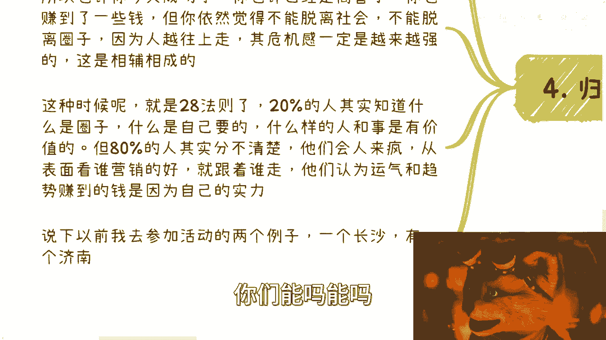

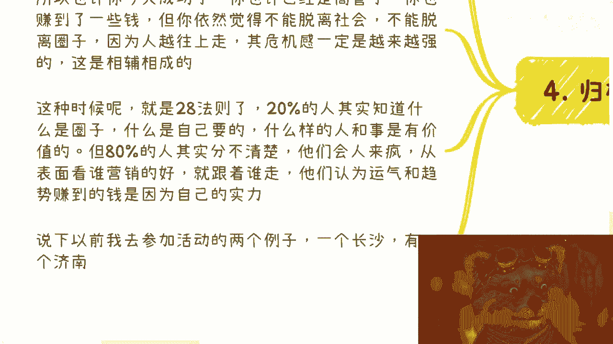

对啊，所以啊所以啊就是说核心观点啊，你们一定要明白，就是世界社会都是发展中的啊，我们的认知最多也就是贯穿我们所活的时代，我们千万不要用我们的认知去贯穿别人的时代，同样的我们的父母，我们的长辈。

也不能用他们的眼光去贯穿我们现在的时代，因为都不一样了哦，所以就像我今天跟那个咨询人说，我说如果我们用我们的观点去看待他们不对，而同时他们用他们的观点PUA我们也不对，而真正能明白这个道理的。

能有能又有能有几个人呢对吧，好吧，框架逻辑啊，流程及商业背后的商业逻辑，我跟你们讲的很清楚了啊，就这么简单好吧，然后行吧，反正其他的反正你们要有什么，你们在私信跟我说吧。

