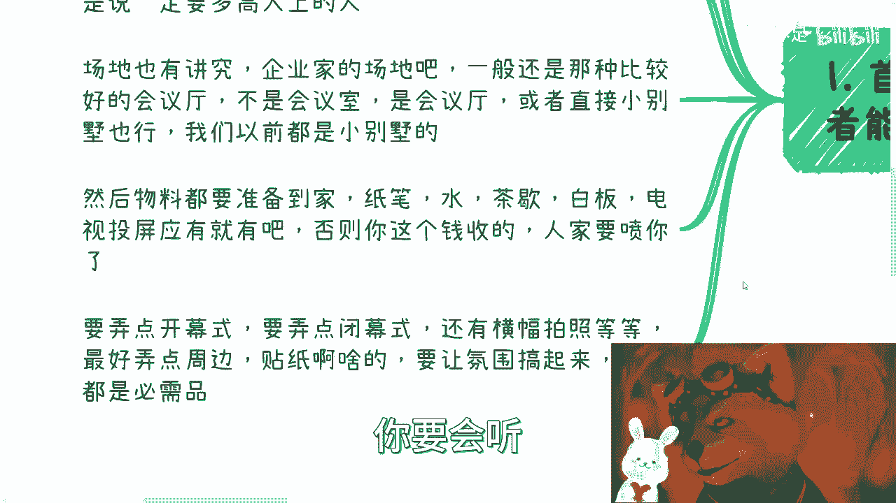
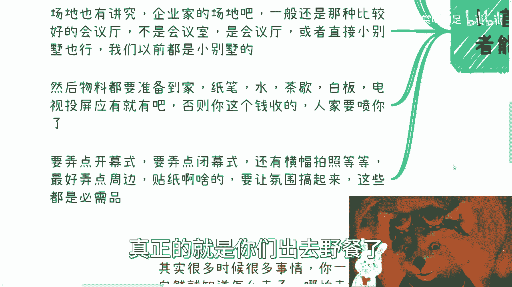
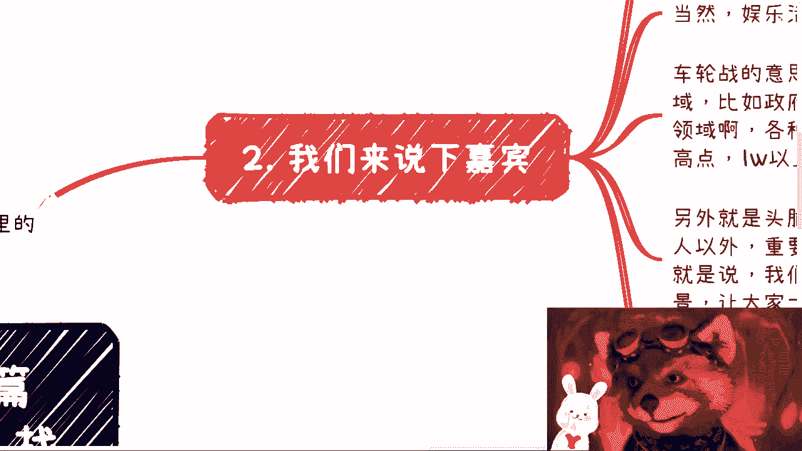
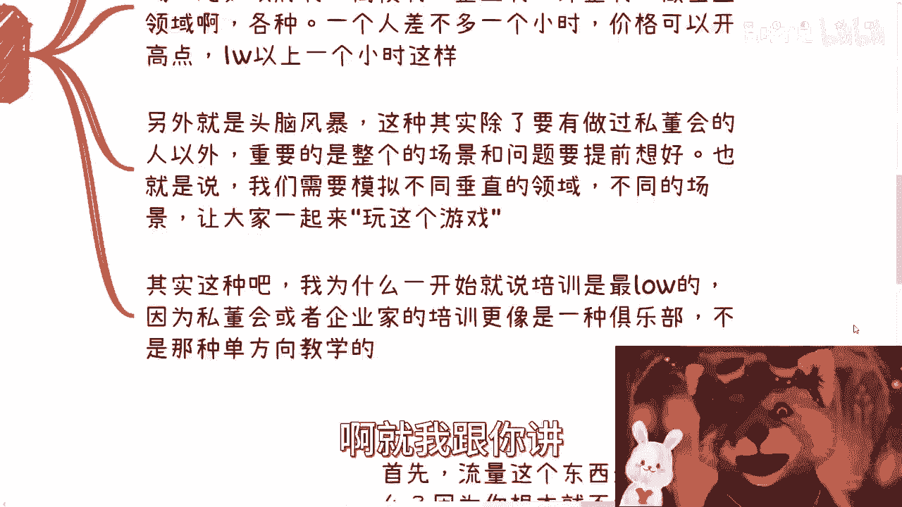
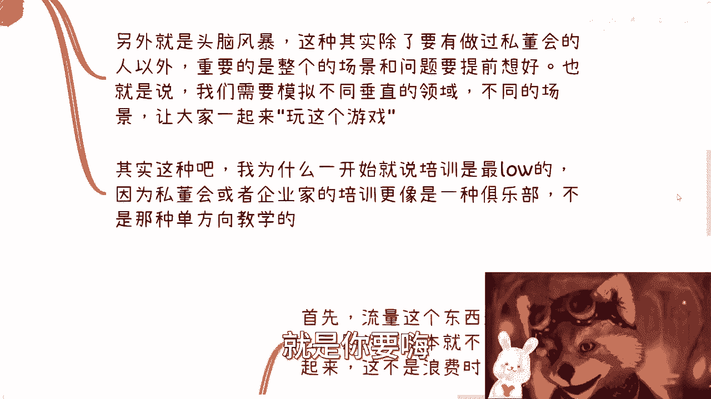
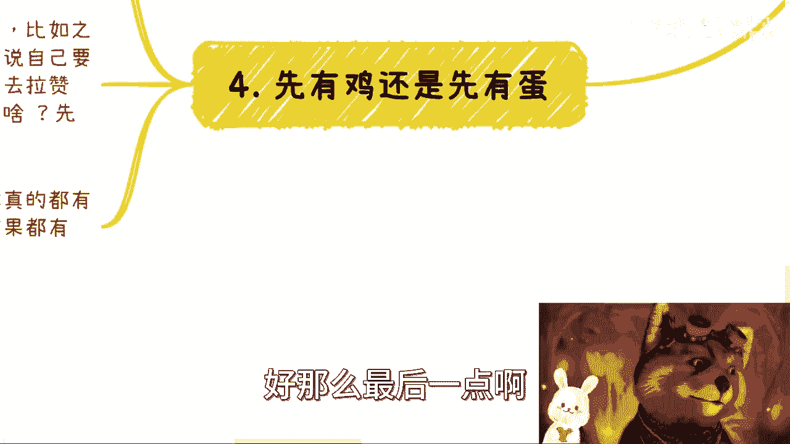
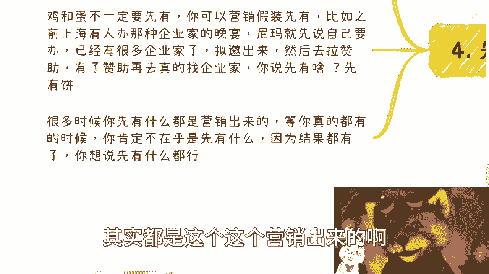

# 企业家培训私董会骗03-我们来说说怎么找到这些企业家-流量从哪儿来---P1---赏味不足---BV

在本节课中，我们将要学习如何为企业家私董会活动获取精准流量，并了解活动落地的核心要素与定价策略。这是将想法变为现实的关键一步。

上一节我们介绍了私董会的核心价值与模式，本节中我们来看看如何找到目标企业家并成功举办活动。

## 活动筹备的核心要素

成功的私董会离不开周密的筹备。以下是确保活动专业性与吸引力的几个关键点。

**1. 核心人员配置**
你需要两类核心人员：
*   **控场者**：一位有私董会经验、能应对各类企业家（如性格膨胀或故意捣乱者）并掌控现场局面的人。
*   **气氛调动者**：一位思维活跃、善于挑起气氛的人（例如经验丰富的微商团队长），负责让现场互动热烈。

**2. 场地与物料**
场地与物料直接决定活动的“质感”。
*   **场地选择**：避免使用教室或普通会议室。应选择**高品质的会议厅**或**独栋别墅**，以匹配企业家的身份预期。
*   **物料准备**：需备齐纸笔、饮用水、茶叶、白板、电视投屏等。此外，可以准备一些**AR/VR设备**或互动游戏道具，将活动从单向培训转变为深度参与的体验。

**3. 氛围营造**
氛围是私董会区别于普通培训的灵魂。
*   **仪式感**：设置开幕式、闭幕式，悬挂横幅，安排合影环节。
*   **互动感**：制作KT板、贴纸等周边物料，将气氛营造得像一场**精心策划的派对或KTV包场**，让参与者能够放松并投入其中。

## 活动内容设计：车轮战与头脑风暴

活动内容的设计决定了参与者的收获感。主要有两种模式：

**1. 车轮战模式**
此模式侧重于多领域嘉宾的密集分享。
*   **形式**：邀请来自政府、高校、企业、外企等不同领域的嘉宾轮流演讲。
*   **节奏**：每位嘉宾分享约**1小时**。
*   **嘉宾费用**：嘉宾出场费可以设定得较高，例如**每小时1万至3万元**属于正常范围。

**2. 头脑风暴模式**
此模式侧重于深度互动与场景模拟。
*   **形式**：在专业引导下，针对预设的商业场景（如“模拟运营一家跨境电商公司”）进行集体推演和讨论。
*   **关键**：引导者（Game Master）需提前设计好完整的商业场景、规则和变量，让参与者（Player）在模拟决策中获得启发。

**核心要义**：私董会的本质是**高端俱乐部**，而非单向教学。目标是创造高价值、高互动的圈层交流体验。

## 流量获取：合作而非竞争

如何找到企业家？最有效的方式是合作，而非自己从零开始做流量。

**1. 摒弃“自己做流量”的思路**
流量生意本身壁垒高、周期长，如同发射一条不知终点的射线，个人或小团队难以承受其时间与资源成本。

**2. 寻找合作伙伴**
流量存在于特定渠道中，你需要找到这些渠道的拥有者进行合作。
*   **合作对象**：**会务公司、社群代运营机构、高端俱乐部、商会、行业协会**等拥有企业家资源的组织。
*   **选择标准**：寻找**业务与你没有直接竞争**的伙伴。例如，你做私董会，可以找做企业家户外、品酒、书画等活动的社群合作。

**3. 明确合作原则：互补而非掠夺**
合作成功的关键在于厘清双方的核心诉求。
*   **对方要什么**：流量方需要**优质内容**来变现和巩固其流量，他们缺的是“子弹”。
*   **你要什么**：你需要借助他们的流量来招募学员，获得**活动收入**。
*   **合作公式**：`你的专业内容 (子弹) + 对方的精准流量 (渠道) = 共同收益`
*   **重要禁忌**：绝不能试图将对方的流量转化为自己的私域流量。这等同于商业上的“杀人父母”，会彻底破坏信任。应明确规则，让流量始终留在对方那里，追求细水长流的合作。

## 破解“先有鸡还是先有蛋”的困局

在启动阶段，很多人会纠结于先有嘉宾还是先有学员。破解之道在于营销与灵活启动。

**1. 行动优于空想**
不要过度规划未来，应集中精力完成从0到1的突破。一旦活动成功举办一两次，后续的路径自然会清晰。

**2. 善用“预售”和“资源整合”**
可以通过营销手段创造“已拥有资源”的势能。
*   **案例**：可以先发布活动预告，列出“拟邀”的重量级嘉宾名单，然后以此去寻求场地、酒水等赞助。获得赞助后，再利用这些资源去正式邀请嘉宾和招募学员，实现“空手套白狼”的启动。

**3. 区分“对外故事”与“对内执行”**
*   **对外**：活动成功后，你可以讲述任何有利于品牌塑造的故事（如靠个人魅力集结资源）。
*   **对内**：必须清醒地知道实际落地的方法和逻辑，不要被自己对外宣传的故事所迷惑。

## 活动定价策略

定价直接定位了你的私董会品牌层次。

*   **低端（3-5万元/次）**：更偏向于**知识培训**，价值感和圈层属性较弱。
*   **中端（15-25万元/次）**：通常包含**高端研学或深度考察**项目，是市场的主流区间。
*   **高端（25-35万元/次）**：核心在于**顶级圈层社交**，对嘉宾的层级和活动体验要求极高。

**定价规律**：价格越往上，卖的是**圈子与人脉**；价格越往下，卖的是**知识与信息**。

---

本节课中我们一起学习了企业家私董会流量获取的核心方法、活动落地的关键细节以及定价策略。总结起来，关键在于**找到互补的流量合作伙伴**，用**俱乐部思维而非培训思维**设计高互动体验，并通过**灵活的启动策略**破解冷启动难题。记住，你的核心是提供不可替代的圈层价值与深度互动体验。