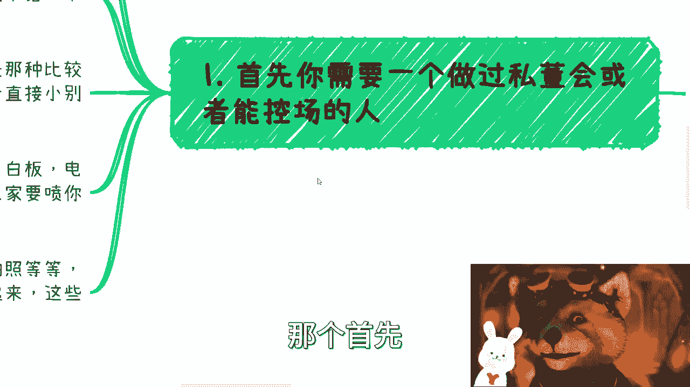
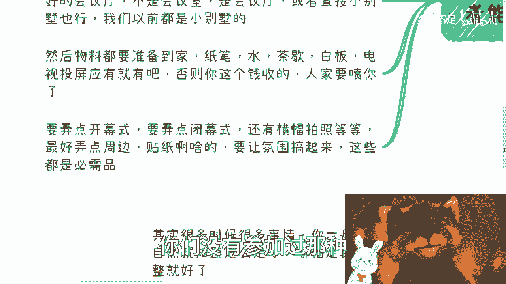
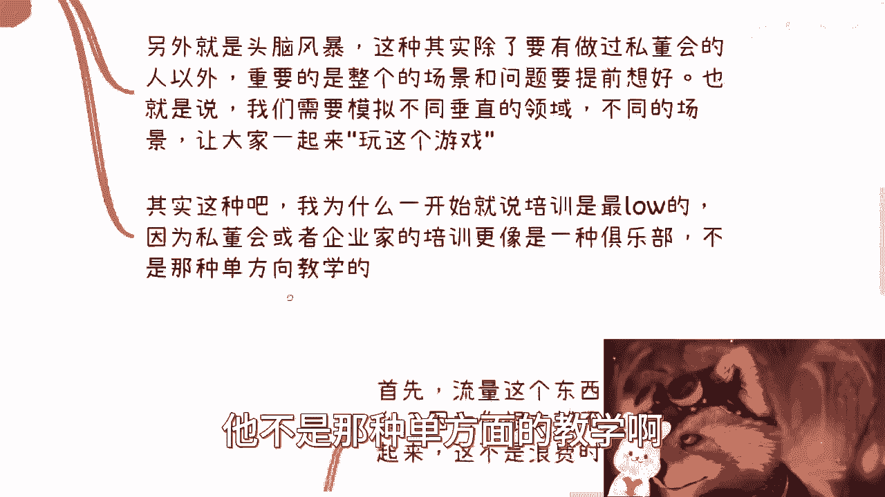
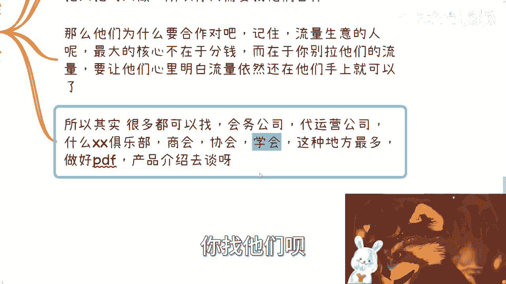
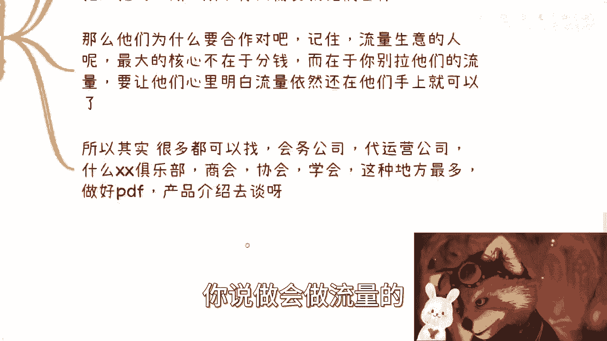
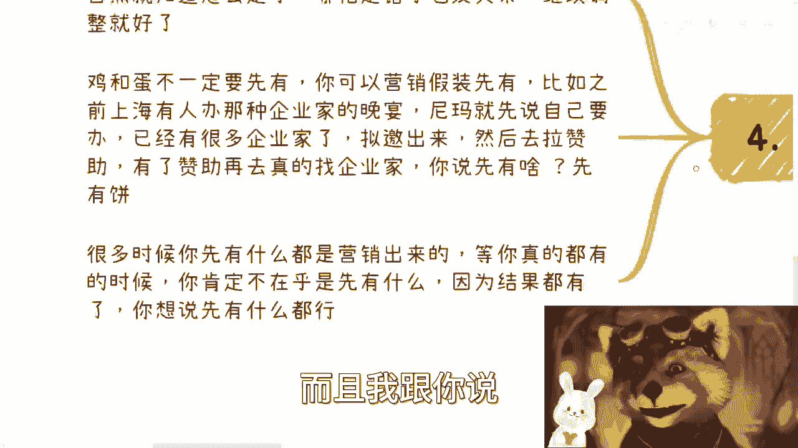
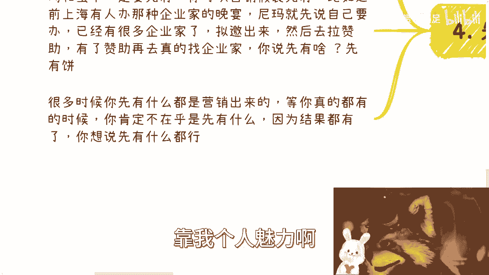

# 企业家培训私董会骗03：我们来说说怎么找到这些企业家，流量从哪儿来 - P1 - 赏味不足 - BV16e411X7My

哈喽大家好，我今天是不是很卡哇伊哈哈哈哎呀，我真的也是尝试各种各样神奇的东西啊，就这么卡哇伊，我自己都看不下去了，呃好啊，首先是这样子的啊，广州活动定了啊，25号，然后具体反正看我状态流里面好吧。

大家有兴趣的可以报名啊，呃本次活动也是第一次啊，我加入了这个topic，就以前其实都没有那个演讲啊，我这次就第一次加入topic好吧，到时候就是会有汇丰啊，这次是汇丰银行那个赞助场地。

然后我会跟他们每人讲一段topic，这样子好，那我们来讲这个第三篇啊，是四总会偏的，就像我之前说的这个东西不会长，基本上应该就三篇啊，就差不多了啊，本次啊这个内容也非常重要。

就是我们来说说怎么找到这些企业家，也就是所谓的流量对吧好，首先啊你们看啊，我把之前还有一些要补的补上啊，首先如果你是呃那个，首先你需要有一个做过四总会。

或者能够控场的人，一般现场就是我上次说的就是企业家这些人吧，性格很古怪，有的人很膨胀啊，有这个有的人呢可能会就是故意来捣乱啊，有很多人呢其实呃各种各样的，那么你需要有这么一个有经验的。

能有控场能力的人呢来给你作证啊，那么这是第一个啊，那么第二个呢就是私董会也好啊，头脑风暴也罢，你需要一个脑子活络，能够挑起气氛的，呃其实我说实话啊，很多的这种微商的leader就很不错。

因为你就不要看不起人家啊，就是整个这种微商的leader或者那种就是喊麦的，卧槽不要太牛逼啊，啊呃呃其实不是说一定要多高大上，因为多不多高大上，说直白点你知道吗，就是包装包装也能出得来啊。

好那么然后场地呢也很讲究，就是企业家的场地吧，一般都是那种比较好的会议会议厅啊，记住啊，你都企业家的这种活动了，你别再去搞什么教室或者阶梯教室，或者什么会议室，我跟你讲，我太low了啊。

人家一看就觉得这个自己钱花的不值啊，你要会听。

而且呢就呃而且呢或者说那种小别墅也可以，我们以前去小别墅的就是搞活动啊，然后物料呢你要准备到家，比如说纸笔啊，水啊，茶叶啊，白板啊，电视投屏啊，你该有约都要有啊，我我甚至我跟你们讲啊。

你们可以搞一些什么ARV啊，就大家玩嘛，因为你要明白你的这个活动，我待会会说的就是这个活动，你不要再把它看成一个啊培训，或者看成一个这种这种，单方面输知识输出的东西啊。

你要把它看成一个真正的就是你们出去野餐了。

你懂吗啊这种啊，然后呢你要弄点开幕式，弄点闭幕式，弄点横幅拍照对吧，弄最好弄点周边啊，什么什么kt板啊对吧，贴纸啊，我跟你讲，我跟你讲幸福气氛搞起来啊，就是有种什么呢。

有种就是你今天包了一个大包间的KTV啊，然后你们嗨起来，哎真的我跟你讲，真的你们没有参加过那种。

就就怎么嗨啊，怎么来，然后他们就会很爽啊，呃你可以理解啊，你可以认为他们呢可能有些人是比较压抑，他就是需要这种，然后呢他自己嗨不起来，他就需要别人带你就这么理解啊，其实很多的很多企业家都是这样子的啊。

好那么我们来说一下嘉宾啊，嘉宾是这样子的，一般呢企业家或者资本会这种呢有两种模式，一种就是车轮战加娱乐活动，另外一种呢就是少数的车轮战加，头脑风暴加娱乐活动啊，当然娱乐活动我们就不说了啊，给很多很多啊。

省略1亿字啊，好那么车轮战的意思是指什么呢，就是说你嘉宾了可以多请一点，比如说各种领域啊啊比如说政府高校企业，外企啊对吧，做垂直领域的各种各种啊，你都请一些，差不多呢一个小时一呃，一个人一个小时啊。

价格可以开高一点，比如说一个小时1万多，哎呀别觉得高啊，我们之前在上海这边办，我的一个人一个小时开3万的很正常啊，然后另外就是头脑风暴啊，这种呢其实除了要有做过私董会的人以外啊。

重要的是整个的场景和问题呢要提前想好，也就是说我们需要模拟不同的垂直领域，而不同的场景啊，你比如说你说今天我们大家已经开始，开这个会了啊，好比如说今天呢我来给大家讲一个这个场景啊。

就大家一起来做一个这种跨境电商，但是呢我们先说好受众，就是你相当于就是跟大家在玩个什么，玩大富翁吧，唉也不叫大部分就模拟模拟人生啊，你帮他把整个世界把这种上下上下级的关系，把这种就是说现在经济好不好。

怎么样，你都假设好，就是你就是个game master，然后他们就是player对吧，然后你就去玩啊啊就我跟你讲就喜欢这种啊。

呃其实这种吧我跟你讲啊，为什么一开始说培训就是最low的，我在第一期第二期的时候就说过，培训是最low的，因为私董会或者企业家的培训，它更像一种俱乐部，就像我跟你们讲的，就是你怎么还怎么来。

但是不要过分，你说什么什么啊，大家什么什么正在头脑风暴对吧，你说来每桌来个WHISKY对吧，大家可喝嗨起来的吧，什么两箱啤酒啊，这个太low了，你懂吗，就是你要high。

但是你要不是逼格的海呃，但是不管怎么样，他不是那种单方面的教学啊。

不是单方面的教学，那么第三怎么找到这些企业家，也就是大家最关心的问题啊，首先流量这个东西最傻的做法就是自己做啊，我不建议自己做，不是自己不介意了，你妈就不应该自己做啊。

因为你根本就不知道什么时候能做起来，以及能不能做起来，这本身就是浪费时间，这就好像今天有个点，你开始往前做了一根射线，你不知道这根射线的终点在什么地方，谁耗得起啊，现在除了政府，除了大企业。

谁耗得起耗不起啊对吧，你要明白流量生意竟然是个很大的生意，自然就有大把大把人做对吧，所以你需要找他们合作，而不是说我们去做流量生意对吧，你你就拿我来讲啊，我我去跟那些微商的人拼，我他妈你拼得过人家的。

卧槽，人家的功力不得十几年。

20年功力啊对吧，那不一样的听懂鼓掌啊，那么他们为什么要合作对吧，记住啊，是这样子的，流量生意的人呢，他最大的核心不在于钱啊，而在于你别去蹭他们流量，你别拉他们流量，你别去做转化，他们流量是事情。

你懂吗，你但凡有任何心里有点小九九，你说我操，我他妈要去抓他们流量，这是犹犹如什么这什么那句话怎么说来着叫啊，这个我跟你讲啊，你去拉别人流量，犹如杀人放火对吧，犹如杀人父母。

这这这你说是不啦哦你把人家流量拉了，卧槽人家不跟你拼命啊对吧，所以说就说你要明白啊，就是说流量你要让他们还是留在人家身上，细水长流，细水长流对吧，你以后还是要合作的，你又不是只合作一次啊。

你流量留在他们身上，你要跟他们跟他们说清楚，我表示你们的流量啊，你比如说什么意思呢，比如说你说我这个私董会啊，拉完群，你们群主对吧，拉完全规则，你们定啊或者怎么样子，我就是来做这个私懂会的对吧。

或者说就是说甚至这个品牌都可以给他们，无所谓啊，为什么，因为你的目的是钱，他们的目的是流量，要要流量，要品牌，而流量要什么，流量需要内容来变现，你就是他们的枪里面的子弹，你不要去当做一把枪了啊。

你不要让他们觉得你跟他们是竞争关系，那么就废了，所以其实很多时候找你要去找什么会务公司，代运营公司或者什么俱乐部，商会协会这种地方最多，反正我就跟你说，你就记住一点，你的业务要的是流量。

别人的业务要的也是流量，但是呢你要找的是什么呢，就是只要跟你业务没有冲突的，你懂吗，你不要去找那种什么哦，这个你做咨询他也做咨询，你做培训他也做培训啊，你做什么私董会，他也做私董会。

那你们就你你就别去找这种啊，你做私董会你就去找那种，就说哎我只做琴棋书画的，对不对，唉我只做这种这种企业家联盟的，你找他们呗。

他们需要你这种子弹啊对吧，因为大家都有短板，你说做会做流量的。

他们的子弹一定少啊对吧，或者他们的子弹没有你专业，对不对啊，好那么好。

那么最后一点，最后一点就是我们说的先有鸡还是先有蛋，你记住啊，很多时候你一旦0~0到一之后，后面其实自然你就知道怎么做了，你不要往后想，你看很多人做事情，我跟他聊下来，他就说哎这后面怎么做。

我说你别管后面怎么做，先把第一步做了，你管他后面怎么做呢，对不对啊，你你你你后面做，我跟你讲，哪怕走错了也没关系，因为你0~1之后，你后面就是试错，大家会陪着你，是的没关系的啊，而且我跟你说。

你要硬要去想，先有鸡，先有蛋，我就告诉你，鸡和蛋它不一定都会有，或者说鸡有，但不一定是先有的，而是什么稀有的，你看啊，那么丙先有，你知道吗，为什么，因为你可以营销，你可以假装先有啊。

因为你的目标就是你的目标就是赚钱，要把这个活动做起来，对不对，你说我在做这个活动的时候，或者说这个活动就已经开始招募了，人家来问问你是先有鸡先有蛋啊，第一人家吃饱了撑的来问你。

第二你吃饱了撑的去回答人家，对不对，有什么关系啊，跟你目标毫无关系，对不对，你比如说上海之前有个人办这种企业家晚宴，我给你们打个比方，他就是的，他现在朋友圈说什么，说我已经邀请了很多企业家，很多CEO。

然后列出你要名单，对不对，然后呢他就去拉赞助，说诶晚宴有有没有人赞助呃，红酒有没有人赞助对吧，然后晚上的这个叫什么，就比如说我吃完饭以后的酒吧有没有人赞助，他会列三个东西出来，然后价格直接列出来对吧。

他拉到赞助，他再去找企业家，因为这不是有钱了吗，你再去订酒店，再去找企业家，这有什么了，没有人赞助就不开呀，空手套白狼不行吗，对不对，就我跟你们讲啊，我其实聊下来，我真的发现就是很神奇的一件事情。

就是中国很多人啊。

他做事情是这样子的，他非要先花钱，你跟他说不用花不行，我他妈必须得花，我不花，他妈浑身难受，表示不理解啊，我就很不理解，那可能是有钱人的困扰，那么很多时候呢，我跟你讲啊，你先有什么呢。

其实都是这个这个营销出来的啊。

等你真的有了，你比如说你说我已经办了两三期了对吧，你品牌也都有了，你想想啊，你肯定不在乎是先有什么，因为结果都有了，你管他先有什么呢，你当时对外说啊，我当时都牛逼对吧，靠个人魅力啊。

然后什么拉动了多少企业家，你反正你说啥是啥，对不对，因为你只要真的做了，你能够把这个品牌做起来，那你牛逼，那你说啥是啥呀，没毛病的呀，对不对，但是还是那句话嘛，就说我们自己做做事情，你不要把自己骗进去。

你懂吗，就是对外营销是怎么说，和你自己怎么做，你别把他混为一谈对吧，这就好像很多人明明知道啊，这个外面说很多东西，哎，这都他妈的是什么什么营销出来的，或者都是他妈的资本家捏造出来的，你懂是懂的呀。

但是很多人也是懂这个道理，但是他依然会去听他们说什么没有用的呀，你明白吧，就是怎么讲出来，跟你真正怎么落地，他妈完全是两回事，啊啊好吧行，那就这么着吧，啊呃这个事我已经给你们讲的很清楚了对吧。

整个业务流程，整个业务的痛点，对方到底要的是什么，你怎么做，啊对我还差一个东西，我想起来还差一个东西，就是定价，我这么说啊，定价这样子的啊，私企业家私董会俱乐部这种东西啊，啊看你给他的东西呃。

不能太低啊，如果来说你按年算，也不要按年算吧，就是按次数算对吧，你给给每次给他这个服务啊，呃3万5万这种算低的啊，15万20万到15万到25万，我觉得比较中等呃，但是也不可能太高。

差不多30~35顶天了啊，但是20就是15~25，这种一定是有流血的，一定是有研学的，33，25~35这一档也的确肯定是有研学的，而且你请的嘉宾label得往上提。

就说白了就是说你越往上其实越走的是圈子，你越往下越走的是培训，你明白吧，就是你越往上走的是圈层的沟通，越往下走的是知识的普及啊，是这样子的，OK好，那就这么着吧好吧，然后大家反正有什么问题。

你们再总结好。