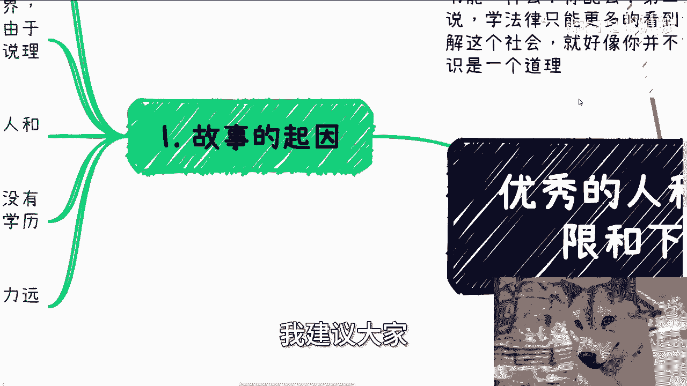
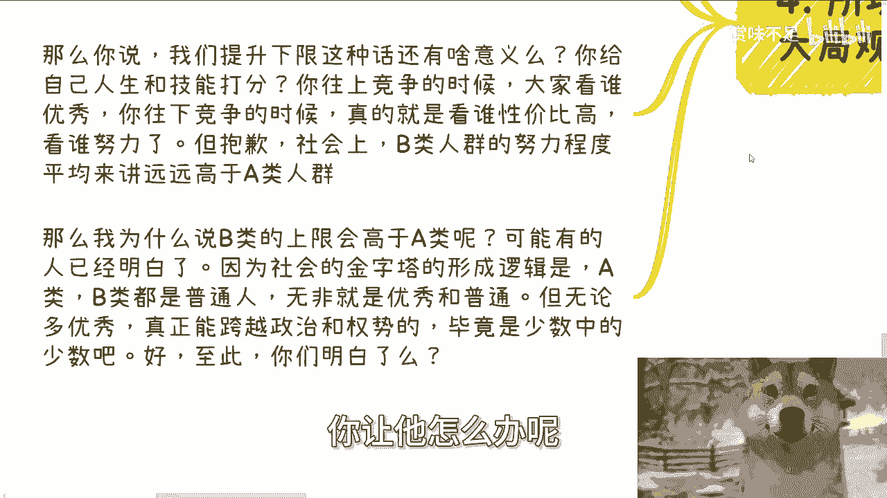
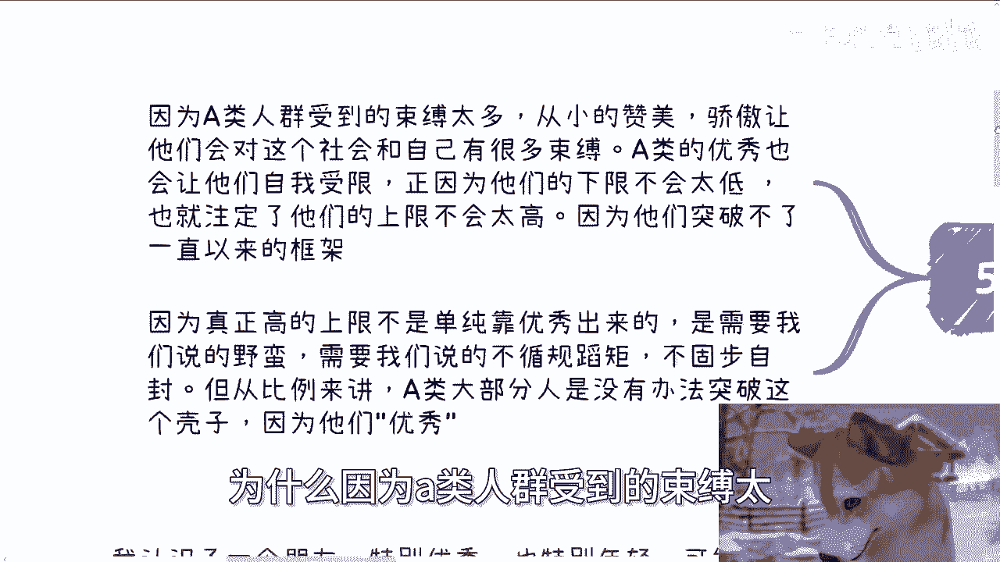
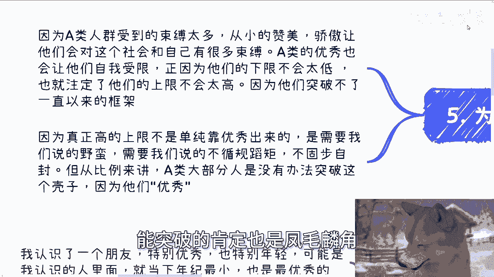

# 优秀的人和普通的人上限和下限的区别 - P1 - 赏味不足 - BV1dmpzeXEjw

啊大家好啊，今天啊这个主题和这个故事非常的有趣啊，非常的有趣，我强烈啊建议大家听完啊，听完真的啊。

我相信你们绝对会有哼不一样的想法。

嗯首先啊这个今天真的是纯粹来讲故事的，但是呢都是真实的故事啊，这个恭喜上海数字经济大会圆满成功啊，拉群呢别着急啊，明天我慢慢来拉啊，咱咱格局要大啊，不要急于这一时三刻急啊，做不了事的啊。

然后呢这个昨天有个评论啊，又他妈笑到我了，说什么说读书跟学法律能了解这个社会啊，读书怎么样怎么样，哼我就这么说啊，人家读书跟你读书能一样吗，你配吗啊，是不是你配吗啊，第二学法律怎么了，嘿奇怪了。

你要我说学法律只能更多地看到老百姓的疾苦，而不是了解这个社会，这就好像你并不能因为吃了很多苦而获得自由，或者获得自主的意识，你可能吗啊，你可能通过吃得苦中苦成为人上人吗，一个道理啊。

真的人这种生物啊就是非常的啧，怎么说呢，就固执是吧，就是封闭啊，尤其当他就是觉得自己特别正确的时候啊，就很离谱啊，我们今天来讲主题啊，叫做优秀的人跟普通的人啊。

上限跟下限的区别啊，还是那句话，我建议大家强烈建议大家听完啊。

第一故事的起因啊，我认识一个朋友特别特别优秀，也特别特别年轻啊，可能是我认识的人里面是当下年纪最小，也是最优秀的，没有之一啊，那么这种优秀呢并不是单纯的学习能力啊，当然他学习能力很强啊。

更多的是对这个社会，对事物，对世界，对人性的一种洞察力，我觉得这个可能有一定的天赋在这里面啊，当然由于年纪毕竟轻嘛啊，所以我当时也跟他讲过，我说你呢还很多东西停留在一种你的感觉，或者或者说你的本能啊。

或者说停留在你的理论上，但是呢因为你还年轻嘛，没有太多精力啊，所以你停留在这种上面，从我角度来讲已经很优秀了啊，因为因为咱咱怎么说呢，客观的评定世界跟自己嘛，就是我也跟他说，我说我在你这个年龄时。

我他妈就是个哈哈，当然这个人也很要强，虽然大家啊，比如说我跟他都能够客观的分析人和事啊，但毕竟他很优秀嘛啊，那么这种优秀的人自我骄傲肯定是存在的啊，我觉得这不是贬义啊，这也不是说褒义啊。

就是包包也不是说褒义啊，我就是一个客观的一个评价啊，那么某一天呢突然聊到了另外一类人啊，就是可能他觉得哎没有太大商业价值，或者没有什么太大的社交价值，甚至就是统称来讲，他觉得没有价值。

嗯当然啊这类人的学历和认知以及综合方面，可以说都是低远低于他的，我这里用了一个词叫远低于啊，远低于啊，也就是说他们的差别很大很大，如果来说你们同样认识这两类人，你们也会跟我一个感觉好。

那么接下来就是今天的核心的主题，接下来我们把优秀的这类人称之为A啊。

然后综合能力远低于A的人称之为B对吧好。

首先啊首先啊我先我要先跟你们说啊，我属于B啊，我不可能是A的。

我要是A的话啊，我就不可能他妈的毕业的时候找了份工作，月薪才500，对不对啊，好那么二啊，我的观点啊啊你们可以不认同我，但是你们先听我讲完啊，我的观点某一天呢我跟A是这么说的。

我说B其实并没有你想的那么不堪哦，或者B在我看来有比你优秀的地方好，那么A就非常的觉得哎很有兴趣啊，interesting对吧啊，好我说你们的上下限其实很不同啊，但我说非常的不幸，在我的世界观里面。

我认为你们普遍来讲一定是A远优秀于B的，没毛病的，就是在大家同等的条件之下，B就是垃圾，没有错的，但是从某种角度来讲，B的上限一定远远高于A啊，就在这地方，你们看到我又用了个词叫远远高于A，为什么啊。

我们接下来来看啊，我们假设你有机会选让自己变成A或者B，我相信正常人，一个正常的人，脑子正常的智商，正常的他都会选择A，因为他觉得A相对来讲很稳定对吧，也就是说A这种优秀的人。

他的下限跟他的上限无论怎么变化，因为我们说每个人都不一样嘛，对吧啊，但是从就是我们就说这个这个这个这个叫什么，就平均角度来讲，那么A的下限跟上限肯定都很高，因为我我相信大家也都这么想嘛，对吧啊。

同时A的比如说如果有，比如说呃5亿人都是A的话，那么这5亿人他的上限下限波动不会非常大，对不对啊，那么对于大家来讲，选择A相对来讲成功的概率更大哦，好但是在这点上面我就已经不认可了哦，我就已经不认可了。

我认为数据量当数据量都很比较大的时候，A跟B人群的最中的综合得分，或者他们的上下限的情况本质上是差不多的，好我们来说说为什么啊啊好为什么，首先我是这么想的，我相信大家都会觉得。

A这个人群的上限跟下限都很高，这就好像很多人觉得我去考学历，跟考一个好的学校，我不是为了大富大贵，我是为了提升我的下限，好，没问题啊，没问题，这句话看似很有道理，就是我说的逻辑上走的通，一定走得通。

你不能说他逻辑不对，你说他逻辑不对，那那你你站不住脚啊，哦那你都说A很优秀了啊，你你那人人家说我就要提升我的下限，那你要是我要是否定他，那我就在否定他的下限很高，那不就跟我自相矛盾了嘛，对不对。

好但是放到现实生活当中，在我看来这逻辑走不通，为什么啊，因为A人群的这么一个人群本身也很多，你明白吗，就是你可以认为优秀的人不多，但是这句话他是有参照物的，你如果把A这类人都综合起来。

他的人群无论那这么说吧，不管是A跟B还是说特别优秀，还是特别不优秀，对吧，哎不管他，你无论取任何一个样本出来，只要你放到这个社会上面，它的整个的比例呃，整个的量其实都不会小的对吧，因为人太多了呀。

没办法的呀，对不对，那么说白了你要这么想，就算你是A这个人群，你要记住一点，在社会上面你但凡没有天时地利人和，就我们说你没有碰到贵人，你没有很好的运气，你没有一些很好的机遇，你并不会有太高的上限。

你明白吗，就是说你上限是会很是会很高，但是你不会有突破，对不对，好，那么这个时候又有人说了，他说哎那我没说我上限突破呀，我下限要高呀，对吧好啊，我们继续来讲啊，下限是什么，我就想问大家下限是什么。

我的理解大部分人讲的下限是工资，是收入，是别人录取你的概率，对不对啊，或者说甚至或者说是一些相对，大家觉得优秀的企业入取你的概率，对不对，这叫下行，对吧好，那么我们就这么玩啊。

现实一点工作无非就是正常的大企业，中企业，小企业，外企或者来说的奶茶店和服务业的打工，这就叫工作嘛对吧，那滴滴饿了么，咱先不说啊，工资的话，那么就是起步的一些工资，就是我们说左边闭区间的这么个工资嘛。

对吧好，那么我们一个个来讲服务业奶茶店，同样的从服务业角度来讲，人家为什么不录取B类人群呢，唉我奇了怪了，你仔细想想是不是对吧，就像我说的，我们的格局要大，我们思考问题是要从大局观去考虑的。

你不能只看你自己眼前的东西，你觉得我很优秀，是我很优秀好，那不好意思，你去服务业，或者你去一些其他地方，那人家为什么不录取B呢，这世界上又不是只有A对吧，甚至还有CDEFG啊。

那么起步薪资如果相对高的话，你们要记住一点，无非也是刚起步的时候，你我不我都不说，你们30多，你们年龄但凡二十五六，二十七八对吧，你比如说毕业要这么说吧，你毕业两三年之后，大家所谓的下限还有意义吗。

对吧，你们如果今天但凡有人毕业两三年，毕业35年的，他就会明白下限是没有意义的，你懂吗，下限是没有意义的，因为你会随着时间的发展，不停的拉低你的下限，不是你的学历，你的学校保证你的下限。

而是你自己在拉低，为什么，因为你没办法，你懂吗，哦那么下限薪资高对吧好，那么我们就问啊，那资本家跟基德利益者为什么不用相对，这个这个这个下限高的薪资去寻找B类人群呢，为什么啊，就像就像我今天说。

如果我是个资本家，我心里应该门清，就是我为什么不用一个7000块钱，8000块钱找一个B类人群，唉我还能PUA他，他还容易PUA，他还努力对吧，那我为什么要去找一个A类人群。

还他妈的好像有点哎小骄傲对吧，然后他妈的你他还还不满足薪资，我干嘛，我跟自己过不去啊，对不对，就是还是那句话啊，你们一定要记住一点，在社会上它不存在对跟错，它其实不存在优秀跟不优秀。

他只存在合适不不合适，对不对，不会因为你优秀，别人给你更多的钱，他的组就是我们说的这个这个条件，他是推不出来的，就是我觉得大家可能有个误区，那就是所谓的下限高，所谓的比别人优秀。

你比别人就是比较的这个情况啊，叫做同等条件下，或者来说叫做甲方需求的同等条件下，为什么，因为无论你有你是A类还是你是B类，你和你你你都是没法定义整个规则的，你也没法定义整个社会定义。

规则和社会的一定都是甲方，或者来说就是按你们的话来讲，就是所谓的掌握那个生产资料的人，对不对好，那么你记住一点，当你无法在A类人群中出类拔萃啊，或者说竞争出那个突破平均上限的话，你并你冰子，你要这么想。

你肯定不会跟B类人群去合作，因为我相信从你们的内心来讲，你们是看不起B类人群的，但是还是我刚刚说的那句话，你竞不竞争，他妈的不是你说了算的，你懂吗，这就像当你年纪大了，当你这个降低你的薪资。

比如说从80万降到50万的时候，是你不想去竞争吗，不好意思，你想不想没有用，是资本家跟既得利益者，会强行把你跟B类人群去竞争，为什么，因为你在降低你的下限啊，同样的你在降低你的上限，对不对。

因为你自己在降级竞争，那很多人很搞笑的，他叫什么，他说叫降维，哎大哥你们仔细想看，这他妈叫降维吗，啊这叫降级啊，不要学会一个词就乱用啊，哼对不对啊，我就不跟你们，我跟你们讲个怎么说呢，也不叫笑话。

就讲一个我们以前这个上海这边讲的很大的，很多的一句话，就是你真的去做一些中层的，或者说就就是打螺丝钉的啊，工具人的，我不管是真的就是坐班的工具人，还是那种就是工地上的啊，就是你们记住一点。

一旦往下去竞争，我们这种说难听点啊，我们这种所谓自认为有文化，或者所谓自认为高学历的，我们竞争不过别人，为什么，因为我们绝对不会有人家努力，我我我我不是看不起别人，我不是看不起壁垒啊。

呃我就随便打个比方，我也不是说看不起那个工地上，这个这个这个辛辛辛苦的这个呃人民群众啊，我就打个比方，你今天把一个本科我也不说高，你把一个本科扔到工地上，他会有别人工作努力吗，用心吗，会吗，不会的。

绝对不会，就这句话对吧啊，好第四。

所以我一直说啊，考虑问题要有全局观，什么意思啊，全局观就是不要用某个特定的条件，再推出一个特定的结果，这个世界上不存在这个事情的，这就好像你考上清华就一定有美好的未来吗，绝对不是。

你只能说你有一定的概率，对不对啊，而这个概率随着时代的发展，这概率变化是很大的啊，也就是说你如果是A类人群，那么我只能说如果没有天时地利人和，没有一定的机遇，你最终也只会成为B类，因为你没有办法。

你要生存，同时你也会丧丧失，你曾经作为A类的天赋跟优势，为什么，因为这个社会是在发展的，因为A类人群本身也很多，大家其实都是你死我活，就是少他找到工作，你就少一个萝卜坑，没有办法，那这社会就这个样子啊。

而与此同时，B类人群也是一样的，每一类人群都是一样的，那么可能A类人群的普通状态你们可以理解为，比如说我们打个游戏啊，A类人群很优秀啊，他的普通状态可能就是B类人群里面。

中上层或者B类人群里面优秀的状态，但问题来了，社会不是看战斗力的，对不对啊，这就像我们说龙珠啊，龙珠这个这个叫什么，就是贝吉塔最早到地球时候啊，你说啊他的普通状态体比他妈孙悟空呃。

最牛逼的状态三倍界王拳四倍，界王界王拳都要高三倍，界王拳都要高对吧，但是哼问题是社会不是看战斗力的，是看需求的对吧，那我们打个比方来讲，大家呃贝吉塔跟孙悟空都是来打工的，那你从人类社会来讲。

人家说哎那我只需要我只需要战五渣，我只需要他妈的战斗力五的垃圾，那战斗力5万跟我又软，跟我卵关系呢，对不对对吧，更何况你战斗力5万能定义需求吗，你但凡能定义需求，没问题，你牛逼，你不能定义需求。

那么从需求来讲，B类人群更符合资本家跟企业家的需求，对不对啊，那么你说我们提升下限这种话还有什么意义，你给自己的人生跟技能打分吗，你网上正经的时候，大家看谁优秀，你要记住一点，你越是往上竞争。

大家的确看的是谁优秀，他同时会比较你的下限跟上限，但是当你往下竞争的时候，你的上限跟下限已经没了崩了，你知道吗，没有了，为什么，因为别人不看上限下限，别人看的就是谁性价比高，谁努力对吧，但抱歉。

社会上B类人群的努力程度，从平均角度来讲远远高于A类，就这句话为什么，因为B类很多，他没有A类这么优秀啊，也没有A类这么高的上限下限啊，那我不努力能怎么办呢，对不对，我不管我。

当然我我这个努力不单单只吃苦啊，就比如说啊拍马屁啊对吧，比如说什么呃呃谄媚啊对吧，或者说呃这个阿谀奉承啊对吧，或者其他各个方面，就是他没有办法，你让他怎么办呢。

对不对，这是人人人本身就是这样子好，那么我为什么说B类的上限会远高于A类，或者说呃我不能说平均啊，就就某种情况下面会远高于A类啊，可能有的人已经明白了，听到这可能有的人已经明白了。

因为社会的金字塔形成逻辑是什么，是A无论你是A类还是B类，都是在普通的范畴，那么也就是说，无非是普通范畴里面的优秀跟普通啊，或者还是垃圾吧，对吧啊，但无论你多优秀，你是不可能真正跨越政治跟权势的啊。

或者说能跨越政治跟诠释的是少数中的少数，好，说到这你是不是已经明白了，对吧好，那么我们说结论啊，为什么。

因为A类人群受到的束缚太多了，他从小的赞美骄傲，让他们对这个社会跟自己有了太多的束缚，A类的优秀也让他们自我受限，他们会觉得有些事不能做，有一些事道德观太低，有一些事太怎么说呢，不符合自己的这个身份。

但其实你有什么身份对吧，那么正因为他们的下限不会太低，同时注定了他们的上限也不会太高对吧，因为他们突突破不了一直以来整个社会家庭，学校给他们的框架，因为真正高的上限绝对不是靠优秀出来的。

是需要我们说的野蛮，需要我们说的突破，需要我们说的不循规蹈矩，不固步自封，他才有可能突破那个高上限，否则怎么可能呢，你们明白吗，想想看哦，但从比例上面来讲，A类大部分的人他是没法突破这个壳子的。

因为他们太优秀了，当然有些人听到这也会想，那陈老师，你你这个说的也许对啊，但是你从B类的比例上面来讲，能突破的肯定也是凤毛麟角。

对没有错，所以这也是我为什么说给你们那个结论是什么，就是当A跟B的整个的数据量都比较大的时候，A跟B的人群的综合比分分布是差不多的，你懂吗，就是如果他真的有分数的话，他A跟B的综合比分差不多。

因为A它相对来讲就是这个叫什么，就是生命线，或者说整个的这个波动不大，那么比如说他平均可能在那个六七十分对吧，但是壁垒他平均可能也就也在六七十分，但他六七十分是什么，最低可能他妈30分。

最高可能他妈100多分，对不对，一样的道理就是它不是一个规律分布，但是由于一定比例上面，B类是能够既突破更低的下限，又突破更高的上限，所以其实你从整个比平均角度来讲，他大差不差哦。

那么你说的我们再从这个角度再来推这个呃，工作上的事情，就是就像我们说的，大家去看怎么说呢，优秀跟不优秀，很多还是会去看学习跟应试教育啊，其实是没错，因为从小都是被这么灌输的。

但是还是回到那句那个观点上面啊，就是我们这些人都不是来制定规则的，那么你们要明白一点，所有的最终的钱一定是甲方给我们的，也就你们的老板对吧，那么老板要的是什么样的人，你们仔细想想看，对不对。

啊所以说我们以前啊一直呃就是怎么说呢，在很早互联网创业的时候，有一种逻辑叫什么叫做嗯，你可能需要一个极其优秀的人来掌舵对吧，就是做战略啊，做方向，但是剩下的你可以都用工具，人都用庸才，为什么。

因为他们不需要思考，他要需要需要思考吗，因为这是个悖论，你如果需要下面的人思考的话，那么你需要上面那个所谓的优秀的战略的人，干嘛呢，对不对，那他他就可以滚蛋了对吧，但是同样的。

如果下面的人这么多人都能思考的话，整个这个方向就不可能成为一个很好的方向，因为你放到整个社会上面，你能思考，他也能思考好了，那大家他妈都一样，那有什么竞争啊，你怎么突破重围啊，对不对。

所以说从一个公司的一个分布比例来讲，也是一个道理，就是我们叫做优秀的人要吗，要的他比例不会太高，对不对，没有办法嘛，人性就是如此嘛，哈啊三个臭皮匠顶一个诸葛亮，那不好意思。

你先看三个诸葛亮会怎么样一个道理嘛，对不对啊，哎呀难得讲这么多啊，因为我觉得这个内容可能不讲这么多。

讲不讲不明白啊，嗯言尽于此啊。

言尽于此，你们真的想想看都一样啊，大家大家在一个大环境跟大趋势里面，我们是逃脱不了，我们个人是没法去左右的，所以说我们得要很清楚的去理解到，我一直强调一点嘛，就我们得要非常客观的去评价。

我们在整个洪流里面的定位啊，不要妄自菲薄，也他妈不要过于很乐观哈，没有意义的，好吧啊行吧，就这么着吧啊，然后职业规划，商业规划就工作上面啊啊跟别人合作啊，副业啊对吧，在这里面合同啊啊合作啊等等等啊。

在这里面有哪些问题的，你们可以整理好对应的个人问题跟个人背景，好吧。

