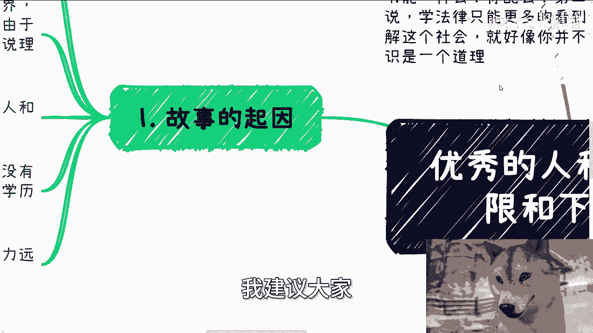
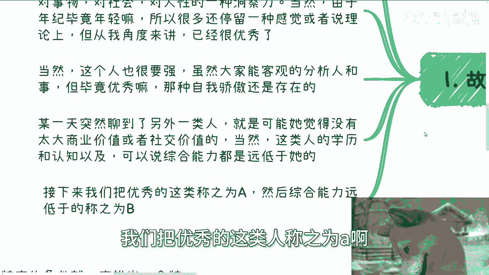
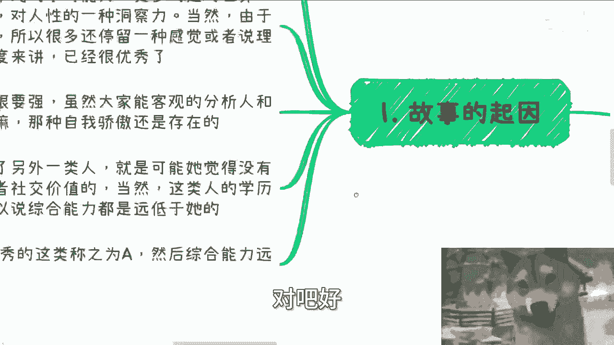
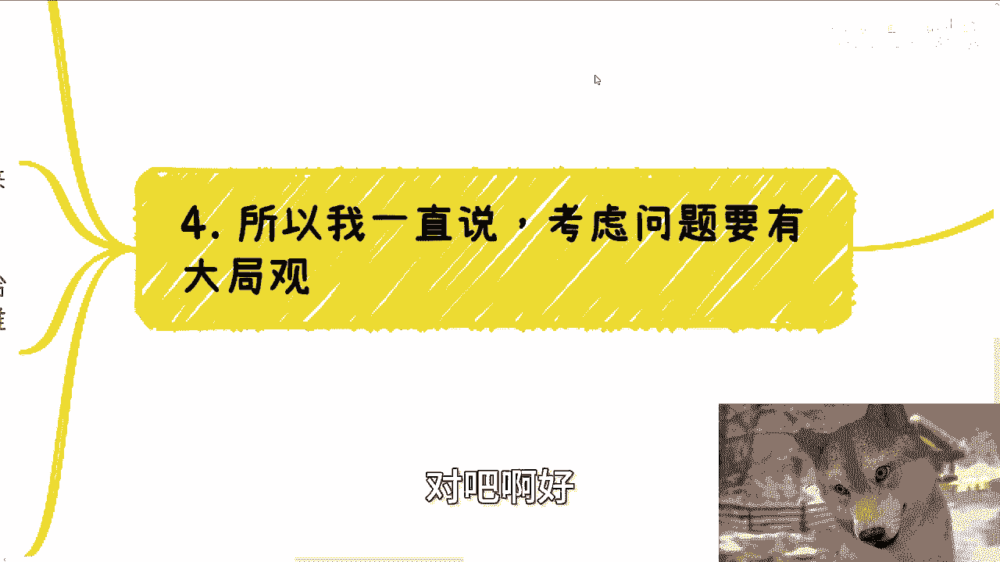
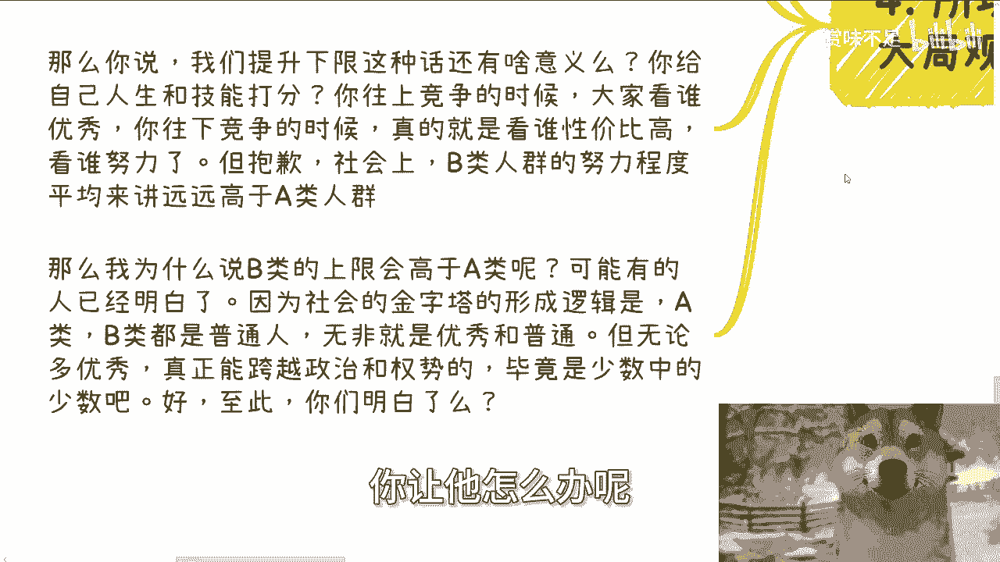
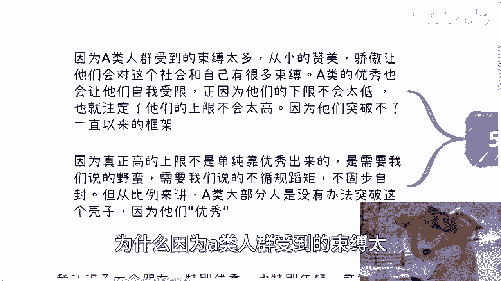
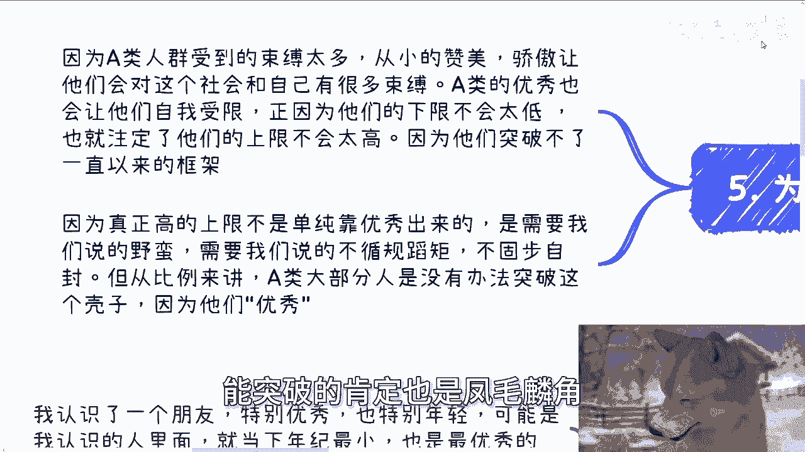
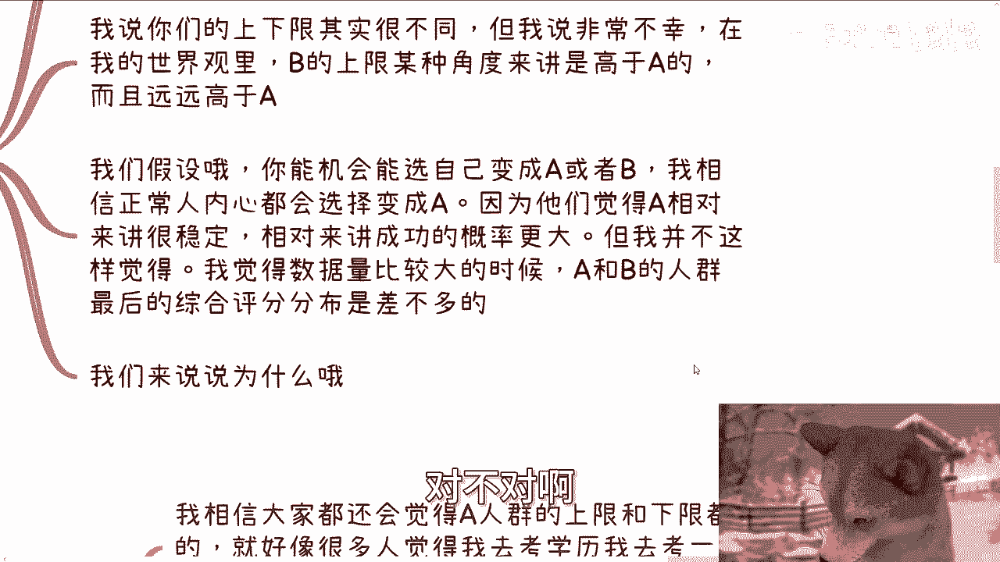
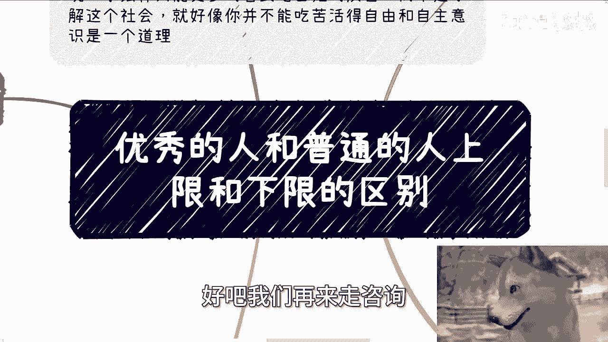

# 优秀的人和普通的人上限和下限的区别---P1---赏味不足---BV1dmpzeXEjw

在本节课中，我们将通过一个真实的故事，探讨“优秀的人”（A类）与“普通人”（B类）在个人发展上限与下限上的核心差异。我们将分析为何在特定条件下，B类人群的上限可能远超A类，并理解社会竞争的本质。

---

## 故事起因与人物定义 📖

故事的起因源于我与一位极其优秀且年轻的朋友（我们称之为A）的对话。A的卓越不仅体现在学习能力上，更在于对社会、事物和人性的深刻洞察力。某天，我们聊到了另一类人（我们称之为B），他们在学历、认知和综合能力上都远低于A。

为了便于讨论，我们做出如下定义：
*   **A类人群**：指代那些在认知、学习能力和综合素养上表现优秀的人。
*   **B类人群**：指代那些在以上方面远低于A类标准的人。

需要明确的是，我本人将自己归类为B类。如果我是A类，毕业时就不可能只找到一份月薪500元的工作。

---

## 核心观点：上下限的重新审视 ⚖️

上一节我们定义了讨论的对象，本节中我们来看看我的核心观点。我对A表达了这样一个看法：B类人群并没有他想象的那么不堪，甚至在某些方面，B的上限可能**远远高于**A。

这个观点让A感到非常有趣。通常，人们会认为A类人群的下限和上限都很高，选择成为A意味着更稳定和更高的成功概率。然而，我并不完全认同这个普遍看法。

我认为，当A和B两类人群的数量都足够大时，他们的**综合得分分布本质上是相近的**。下面我们来分析原因。

---

## 为何“提升下限”的逻辑在现实中走不通？ 🤔

许多人认为，成为A类或获取高学历是为了“提升人生的下限”，比如获得更高的起薪或进入优秀企业的机会。这个逻辑在理论上成立，但在现实社会中却可能行不通。

以下是几个关键原因：

1.  **社会竞争不看绝对优秀，只看相对合适**：社会规则由掌握资源的“甲方”制定。甲方雇佣员工时，考量的不是抽象的“优秀”，而是性价比与岗位需求的匹配度。公式可以简单理解为：
    `雇佣决策 ≠ 个人优秀度`，而是 `雇佣决策 ≈ 岗位需求契合度 × 性价比`

2.  **下限会随时间自我拉低**：所谓的“高下限”优势往往仅限于职业生涯初期。毕业几年后，个人价值由市场表现决定，初始学历的光环会迅速减弱。如果无法持续突破，所谓的下限会被自己拉低。

3.  **向下竞争时，A类可能反而不具优势**：当A类人群由于各种原因需要“降级竞争”时，他们往往竞争不过B类人群。因为B类人群通常更努力、更能吃苦、对薪资期待更低，也更容易管理。在只需要“战斗力为5”的岗位上，战斗力5万反而成了负累。

4.  **全局观的重要性**：不能用一个特定条件（如“优秀”）去推导一个特定结果（如“成功”）。就像考上清华不代表一定有美好未来，它只意味着一定的概率，而这个概率受时代洪流影响巨大。没有天时地利人和，A类最终也可能滑向B类的生存状态。

---

## B类上限更高的深层原因 🚀

那么，我为何认为B类人群的上限可能远高于A类呢？听到这里，可能有人已经明白了。

核心原因在于：**A类人群受到的束缚太多**。他们从小获得的赞美、形成的骄傲，以及社会、家庭、学校赋予的“优秀者”框架，成为了他们的隐形枷锁。他们会觉得很多事情“不能做”、“不道德”、“不符合身份”。

然而，真正的上限突破，往往需要**野蛮生长、突破常规、不固步自封**。B类人群由于没有“优秀”的包袱，在生存压力的驱动下，反而更可能打破规则，尝试各种路径，从而有机会触达惊人的高度。当然，能从B类中突破出来的人也是凤毛麟角。

正因为B类中既有极低的下限，也有可能存在的极高上限，从整个人群的概率分布来看，A类和B类的**综合平均分可能相差无几**。A类稳定在60-80分区间，B类则可能在30分到100分之间广泛分布。

---

## 从组织架构看人才需求 🏢

这个逻辑同样适用于商业组织。在早期的互联网创业思维中，有一种模式是：只需要一个极其优秀的战略制定者（A类）掌舵，其余执行层可以大量使用“庸才”（B类工具人）。

这是因为，如果执行层人人都需要深度思考，那么战略层的价值就无法体现；反之，如果战略方向明确，那么高效、听话、性价比高的执行者才是组织更需要的。这揭示了社会分工的一个残酷现实：**对“顶级思考者”的需求量很少，而对“可靠执行者”的需求量很大**。

---

## 总结与启示 💡

本节课我们一起探讨了A类（优秀者）与B类（普通人）在上限与下限上的复杂关系。我们学习了：

1.  **社会竞争的本质是需求匹配**，而非简单的优秀度排序。
2.  **“提升下限”在长期职业生涯中作用有限**，个人价值由持续的市场表现决定。
3.  **束缚越少，突破上限的可能性反而越大**。A类的框架可能成为其天花板，而B类的无拘无束可能带来意外突破。
4.  **从宏观统计来看，两类人群的综合发展分布可能趋于接近**。

最终，我们需要清醒地认识到，在时代的大洪流中，个人很难左右趋势。关键在于**客观评估自己在洪流中的位置**，不妄自菲薄，也不盲目乐观。理解规则，然后思考如何利用规则，或是在必要时勇敢打破规则，这才是更重要的课题。

---
**关于职业规划、商业合作或副业开展的具体问题，请整理好你的个人背景与详细情况。**