# 传统的职业规划已经毫无意义了 - P1 - 赏味不足 - BV1Et421T7iK

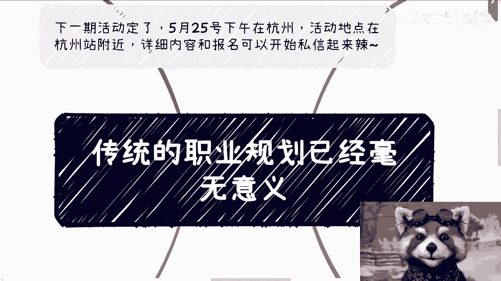

啊咳咳大家好啊，这个活动已经定了啊，下周下周六下周六二十五号下午在杭州好吧，活动地点在杭州站附近啊。

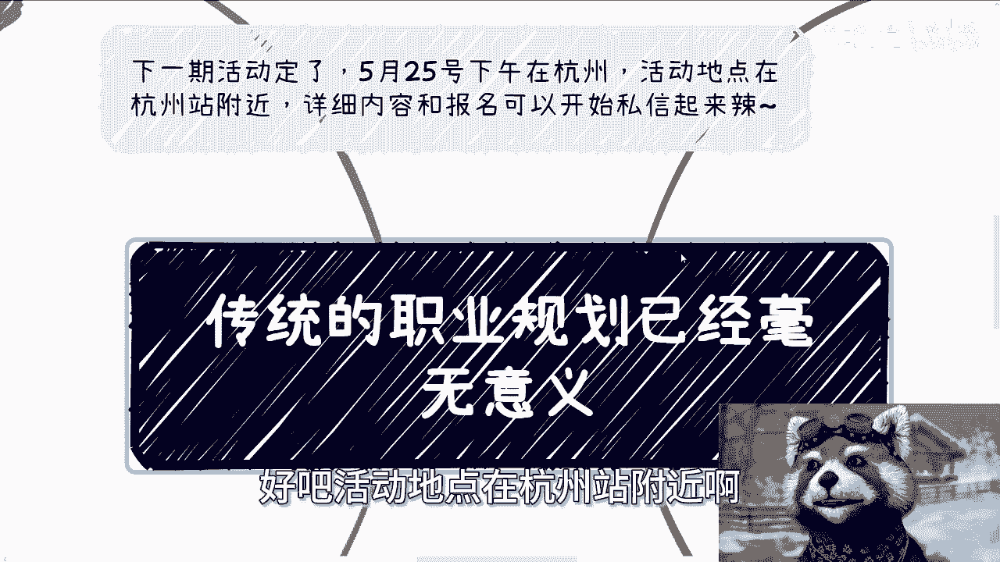

详细内容跟报名可以私信我啊，额那么今天我们来讲的呢，就充电视频我已经发了啊，然后今天这个视频呢讲的来讲的是呃，传统的职业规划已经没有意义了。

呃嗯本质上就是没有意义了啊，那么第一呢。

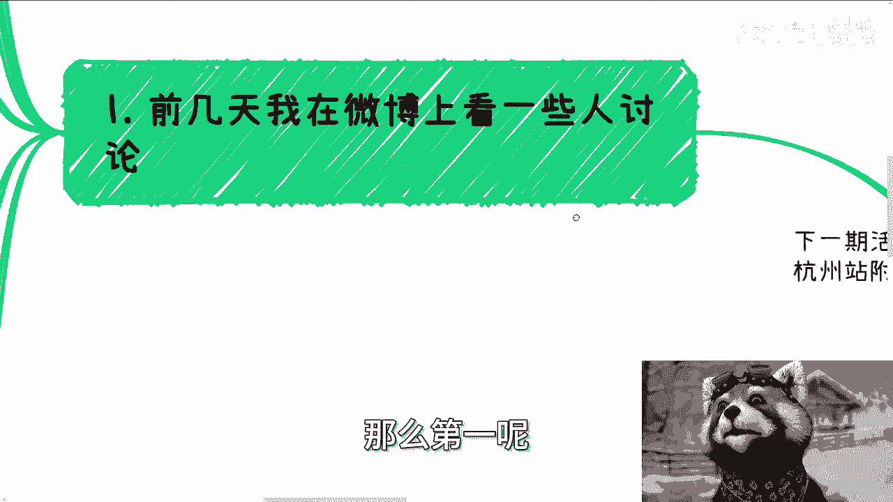

就是说前两天我在微博上看到一些讨论啊，就是说职业规划这个事呢本身要不要做，当然要做呃，因为大学出来的人呢，基本上对外界所有东西全是战争迷雾，那就像我说的，就是说看似所有的这个学校里面的呃。

还没出学校的人吧，就是活在这个国家或者活在地球上，但其实你会感觉他也没活在这个国家，没有活在地球上，因为他什么都不知道啊，那么肯定是需要规划的，但是传统的一些规划呢没有意义，因为首先为什么呃。

我们撇开所有的一些因素，核心我觉得就两点啊，当然也许有别的因因素啊，但核心就两点，一个呢，因为整体的经济形势和国内这些国情，这个东西具体不展开啊，倒逼了企业现在生存非常困难，或者说都在熬，都在拖。

那么这种资本家跟既得利益者都在拼命抓钱，都在拼命想办法存活的情况之下哦，那么我就问你们，难道你们还指望他们把员工当人看吗，他们有这个闲心吗，对不对啊，反正我是不指望的啊，你你你你们愿意谁指望谁指望啊。

那另外一点呢，就是说各行各业的变化太快，当然可能传统制造业跟工业或者园林啊，土木这些啊，这个包括室内装修对吧等等等啊，其他一些，那我觉得这些长周期的也许还好啊，但我不了解啊，也许还好。

但剩下的这些领域呢，这行业变化实在太快，真的太快，没有人能知道未来怎么变啊，你告诉我一个可能他妈一个季度两个季度对吧，他妈两三个季度一变的，一个一个一个领域或者一个东西，怎么规划啊，你妈这你你跟我说。

你能规划我，就我甚至都觉得你在骗我对吧，这就好像之前有小伙伴跟我说啊，他说他读研是读AI，我问他为什么，他说他爸呢在学校教书啊，然后说AI肯定有发展前景，卧槽我跟你讲，这他妈就离谱，为什么呢。

因为你把AI这个词去掉啊，换掉你随便把换一个变量啊，你说啊大数据以后有没有未来啊对吧，比人人人工智能有没有呃，不是那个人类永生人脑接接口。

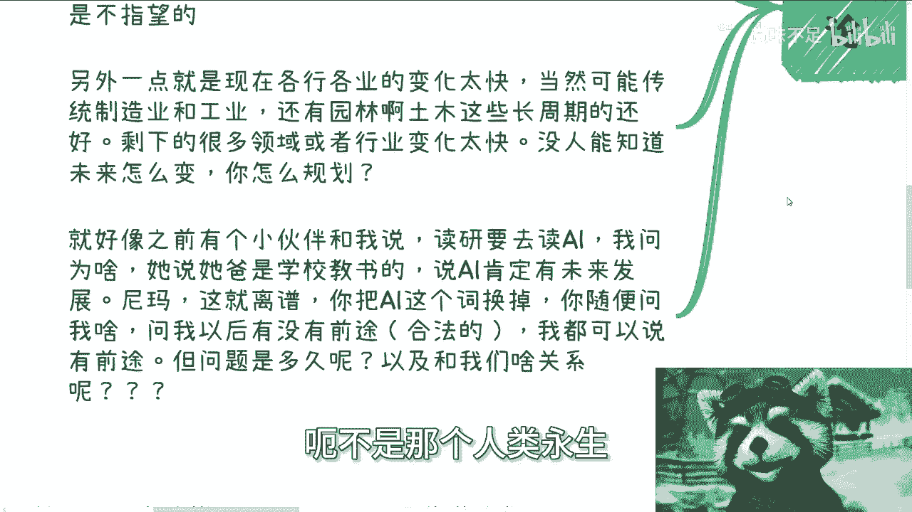

脑机接口有没有未来，你随便问我，你哪怕问我他妈的以后呃，恐龙是不是再生都有没有未来，我我我随便说对吧，我都可以说有前途啊，怎么了呢，问题是他妈多久呢，对不对，你就像你说读AI有发展未来，我多久呢对吧。

第一就说问题多久，第二就是说跟你跟我有什么关系呢。

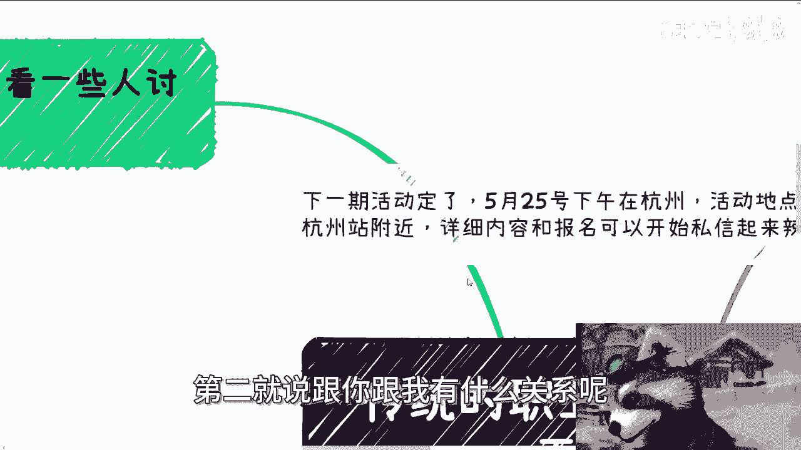

对吧，你不能说啊，因为我爸在学校里面教书啊，然后他讲的东西都是对的啊。

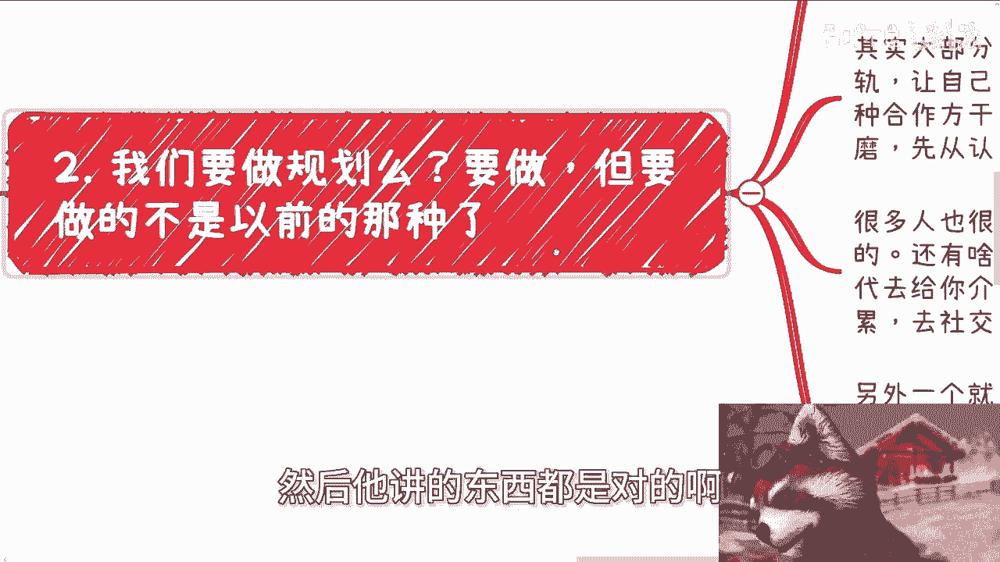

那么第二我们要做规划吗，要做，但要做的呢不是以前那种规划，也就是说我们要做规划，单纯去培训咨询是没有用的啊，我们还是要去探索更多的信息，因为你做的规划其实也是一种选择，你需要根据事实依据。

根据有一些具体的东西去做选择，你总不可能不可能让总让别人给你做选择嘛，对吧，那么其实大部分人呢掌握的就一定啊，出来的时候要掌握的就两点，第一呢先要与社会接轨，让自己不再只有自己。

就是说你们现在大部分人放眼望去，我问我问你啊，我说你能做什么，我说你有什么规划对吧，你永远想的就说你能干嘛，你有什么规划，你所有活在这个世界上，只靠你自己，有用了，没有用的呀，需要大家合作对吧。

那这些所谓的大家怎么来的呢，对吧好啧对吧，就是说怎么来的呢，你需要去社交对吧，你需要去沟通，你需要去磨合对吧，你你只能先从认识人开始，你你还能怎么办，你没有别的出路，对吧好，那么很多人呢也很搞笑。

说除了活动以外，还有没有别的哼，唉我我也不知道我说啥对吧，你你你你觉得呢有什么别的呢，对吧你你怎么滴，每天晚上去蹦迪啊，到人到上海人民公园去相亲对吧，还怎么地还是让你身边的二代给你介绍。

你有完了你没有呀，对不了，你没有，你就老老实实社交，你就老老实实积累，你但凡想走捷径，只会被割对吧啊，然后另外一个呢就是要去掌握，获取真实的有效信息的渠道，其实就是各个地方关键的一些人物。

比如说有的可能是国国央企的商务啊，有的可能是厅局的领导啊，有的可能是资本的大佬啊，有的可能是各种学校院长校长啊对吧。

那真正的渠道只有可能在人身上啊，不要再指望从网络上获取，这是不可能的好吗，那你们又要问了。

这些人怎么获取呢，参考第一点好吗，为什么，因为我们是普通人。

不要再去妄想了啊，因为第三，因为现在以及往后的规划本身。

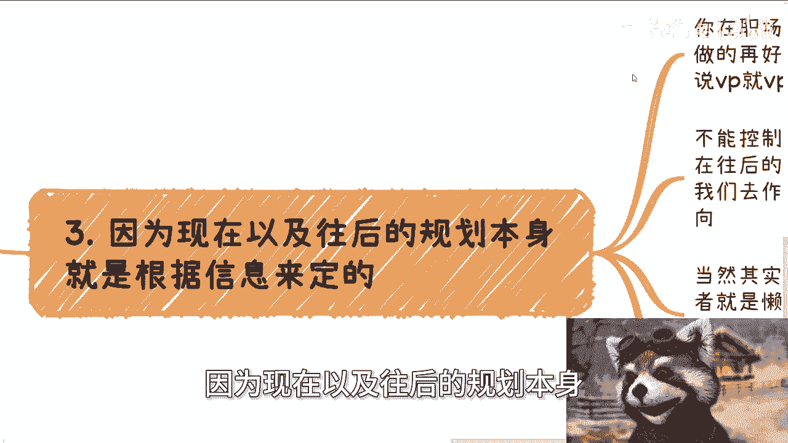

我们只必须要根据信息来定，就是你在职场里的规划，我跟你讲，其实蛮搞笑的，你你你就是你想你想过没有呃，你做规划做的再好，怎么了呢，这些规划你能控制吗，哦你说几岁，你当总监就当总监，你说当VP就当VP的。

这他妈是你能控制的吗，对不对，你不能控制东西，你去做规划，这不是PUA是什么东西啊，这不是在割你是什么东西啊，而现在往后的规划，其实更多的是我们需要有足够多的信息，让我们去做依据，做出适合自己的判断。

然后调整方向，当然啊，其实很多人要做规划的目标，他不是为了做规划，他就是为了躺平，或者就是懒，或者是不想思考，不过我跟你讲无所谓啊，真无所谓，因为我告诉你们，就不管你们现在所有人躺平也好，懒也好。

不想思考也好，反正这种规划做了都是摆做，你接下来该面对的问题都会面对对吧，包括女性的，对于女性的歧视对吧，包括对于年龄大的一些失业，包括一些优化对吧，或者若干若就是各种各样的，我们不管是哪个地方。

歧视也好，怎样也好，各种各样的问题，你早晚都会面对，你逃不掉的哦，有的人也要说了，那说不定未来又有很好的职业规划呢对吧，又跟以前一样，说能够跟企业一起一起起飞呢对吧。

人家企业说不定IPO我们也能怎么样怎么样呢，说不定又能全全全国这个全民创业呢，怎么样怎么样等等等，对我跟你讲啊，没有错，你说的有可能，但是如果真的有那一天，你是不是一样需要更快更早，更对的信息去做判断。

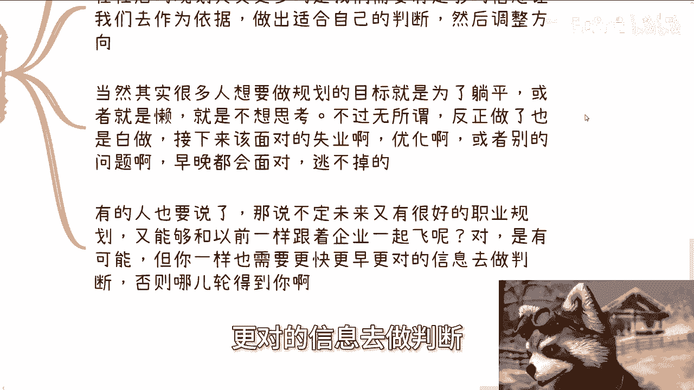

否则他妈的就这种所谓的任何一个风口，轮得到你们来，轮不到你的呀。

对不对啊，那么第四当然啊，还是那句话，你你们不要看我说了这些东西，其实最终很多人听还是听不进去的，因为社会基本面就是这样子啊。

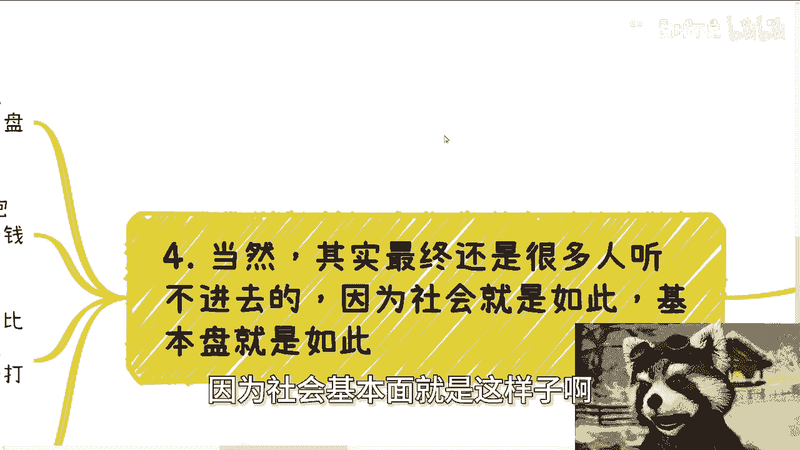

就是虽然我们这么说啊，很多人还是会抱着做职业规划，做这种死的职业规划，因为在他们心里，他们觉得这是一个很平稳的道路啊，他们觉得很平稳的道路，但是很很不平稳对吧，该割还是要被割的，就是常态。

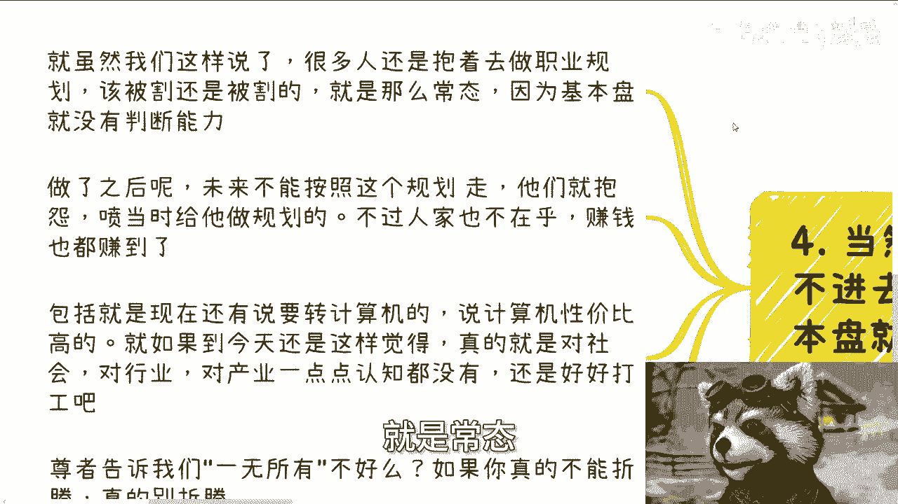

因为中国基本盘就这样子，基本盘是没有判断能力的啊，那么做了之后呢，未来不能按照这个规划走呢，他们就抱怨啊，然后去喷喷，当时给他做这个规划的啊，不过有一说一当时给他做规划的人或者机构，他也不在乎。

反正钱也赚到了对吧啊，那么包括呢就是现在还有说要转计算机的，我跟你讲，前两天评论区还有人说转计算机，我他妈都哭笑不得，你知道吗，就是你如果到今天对吧，那么2024年5月18号，今天你都还这么觉得。

我就只能说你真的是活在象牙塔里面，活在桃花源里面，真的就是对社会，对行业，对产业，对政治，对政府，对全球的经济一点点认知都没有啊，那我只能这么说，你啊说的好听一点，你就是好好打工，说的不好听点。

哎等死吧啊真的等死吧，那么呃最后开个玩笑啊，尊者告诉我们对吧，一无所有不好吗，对吧啊，如果你真的我跟你讲啊，你真的不能折腾，你觉得我的呃呃三观啊，性格啊各个方面不适合折腾。

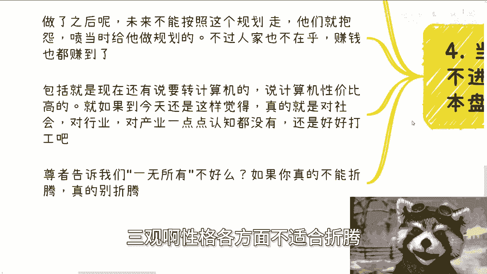

我跟你讲，你是真的别折腾，因为在当下这种情况下面啊。

你越折腾大部分的人啊，你越折腾，你要是豁不出去，你只会越来越多的被割，然后越来越多的丧失你的原本的一些财产，没有意义的，你知道吗，哦而且我顺便再最后提一点啊，就是说你们千万千万不要觉得啊。

什么等到经济好了怎么样怎么样，我跟你们讲，你们没有明白其中的问题，等到经济好，就是你们现在的积累，你们现在能呃摸索到的关系，或者说你们能做的一些事情，只有当下才适合做，一旦经济好了，你们什么都做不了啊。

真的什么都做不了，千万不要被别人忽悠说啊，经济好了对吧，我们怎么样怎么样，拉拉叉叉倒吧啊。

没没有可能性的啊，OK好，那么活动啊，5月25号啊，下午杭州在杭州站附近啊，杭州站附近好吧，然后剩下就是说职业规划，商业规划啊，然后那个商业计划书合同分润啊，那个分红对吧。

包括你们自己有些业务你们觉得吃不准的，摸不透的啊，你们可以就是说整理好，然后我们来走咨询，然后同样的就说你们手上有什么牌，你们手上哪怕没有牌啊，你们希望通过跟我的沟通，通过我的一些视野。

或者一些呃以前的经验能够给你们，就稍微来讲更准确，或者更贴近于当下社会发展的这种道路的话，那么你们也可以整理好问题。

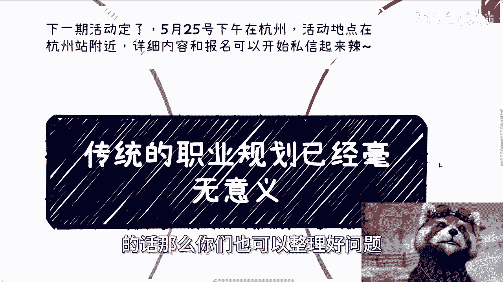

我们再来做咨询啊，好啊。