# 课程：为什么传统职业规划已失效？ - P1 🧭

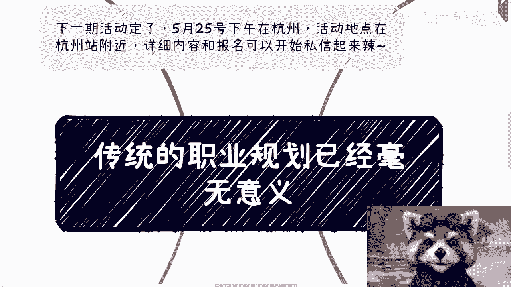

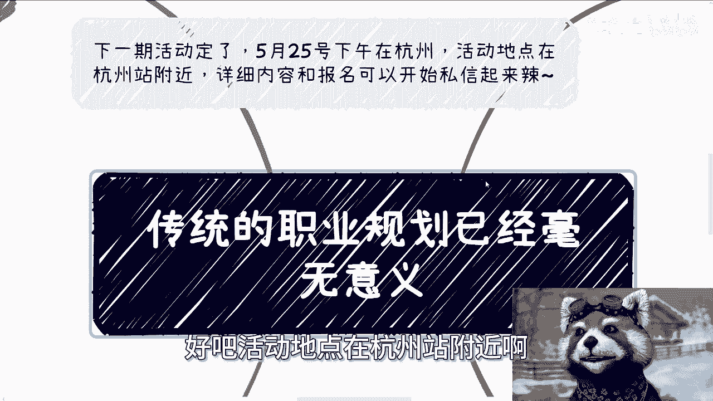

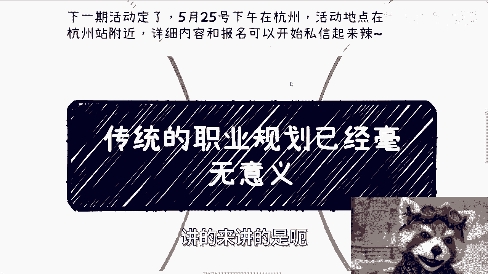

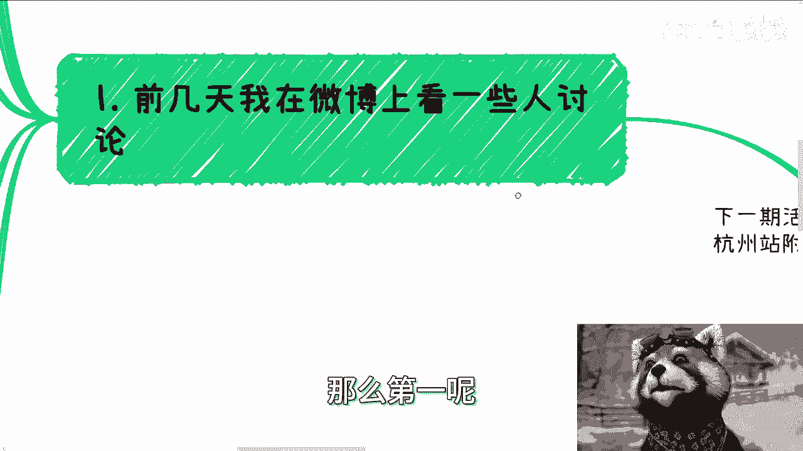

在本节课中，我们将探讨为什么传统的、线性的职业规划方法在当今时代已不再适用。我们将分析其失效的核心原因，并讨论在快速变化的职场环境中，个人应如何调整策略，以更有效的方式规划自己的职业发展路径。

## 概述：传统职业规划为何失效？ 🤔

上一节我们介绍了课程主题，本节中我们来看看传统职业规划失效的具体原因。其核心在于外部环境的剧烈变化，使得基于过去经验的长期、静态规划变得不切实际。

以下是导致传统职业规划失效的两个核心因素：

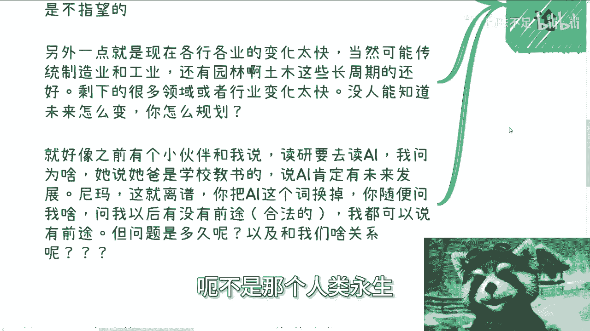

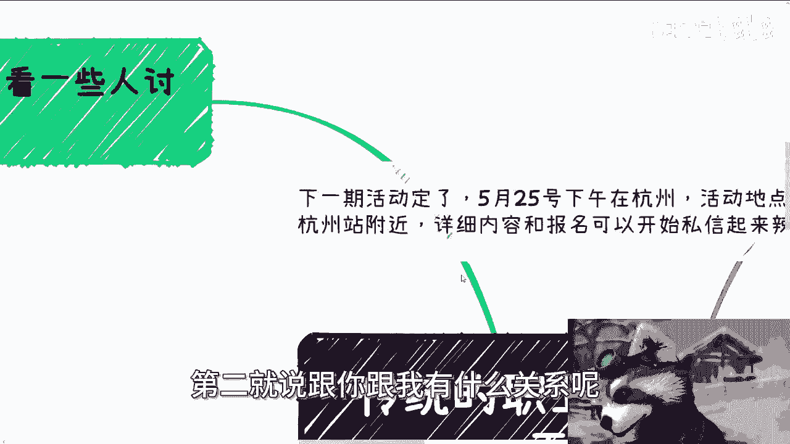

1.  **企业生存压力剧增**：整体经济形势与国情导致企业生存困难，普遍处于“熬”和“拖”的状态。在这种环境下，资本方与既得利益者首要目标是抓钱与生存，无暇顾及员工的长期发展。因此，期待企业为员工提供清晰的职业路径已不现实。
2.  **行业变化速度过快**：除部分传统长周期行业（如制造业、土木工程）外，大多数领域的变化速度极快，常以季度为单位迭代。无人能准确预测未来的具体形态。对一个快速变化的领域进行长期规划，其基础本身就不牢固。

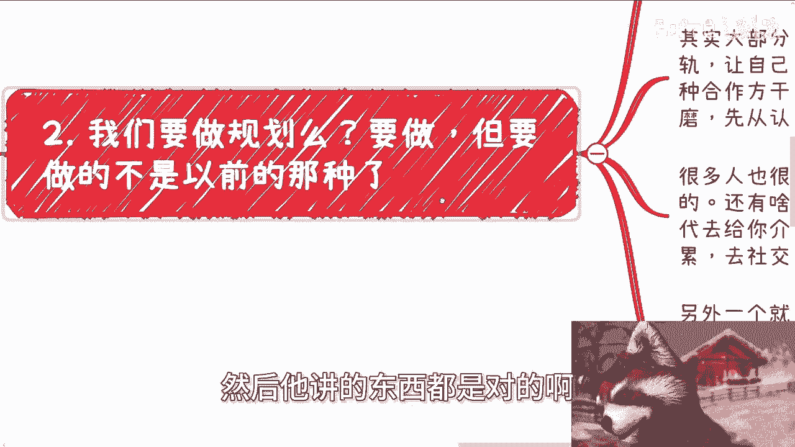

## 我们还需要规划吗？要做怎样的规划？ 🗺️

既然传统规划失效，我们是否就无需规划了？并非如此。规划依然必要，但规划的内涵和方法必须改变。核心是从依赖外部机构或固定模板，转向基于**信息**和**人际网络**的主动探索与动态调整。

以下是新时代职业规划应聚焦的两个核心任务：

1.  **与社会接轨，建立合作网络**：个人不能只依赖自身技能。必须主动社交、沟通、磨合，从认识人开始，逐步构建自己的协作网络。这是获取机会与资源的基石。试图绕过此过程的“捷径”往往会导致被收割。
2.  **掌握获取真实有效信息的渠道**：真实、关键的信息往往存在于**关键人物**身上，例如国企商务、厅局领导、资本方、院校负责人等。网络上的公开信息价值有限。获取这些信息的途径，回归到第一点：通过真实的社交与积累。

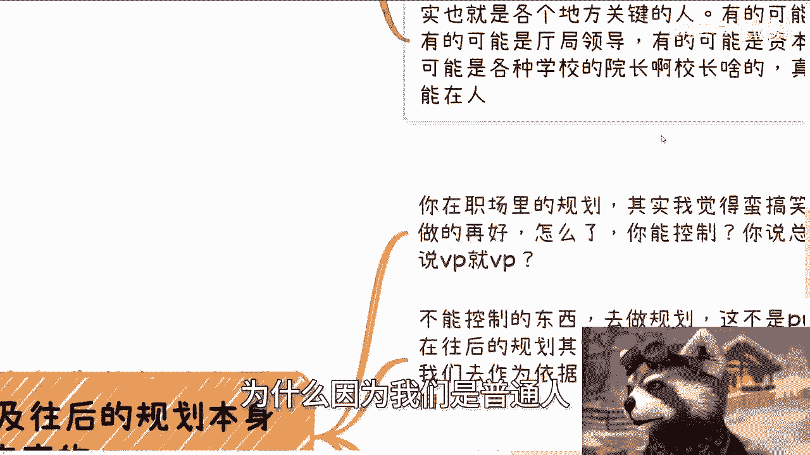

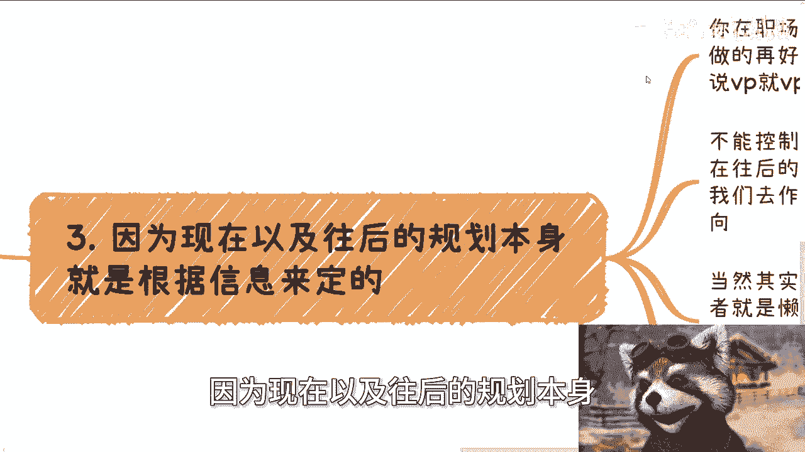

## 新时代规划的核心：基于信息的动态调整 🔄

上一节我们讨论了规划的新焦点，本节中我们来看看规划的具体执行逻辑。未来的职业规划本质上是一个**持续的信息收集、分析判断与方向调整**的过程。

其核心逻辑可以概括为以下公式：

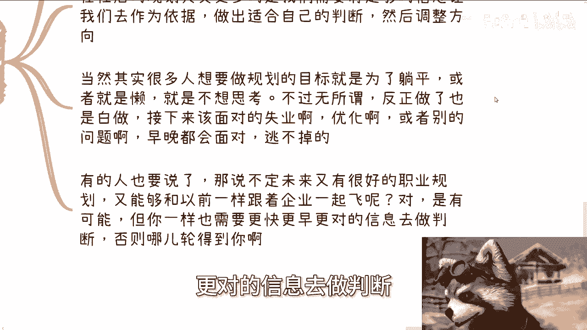

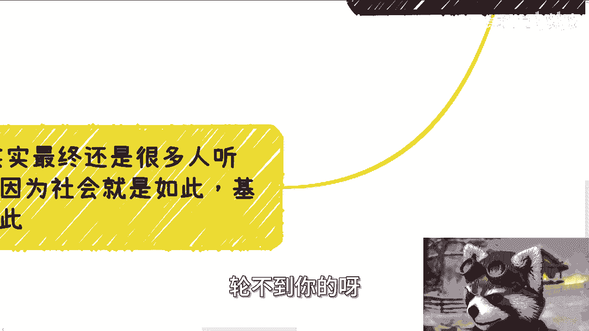

**有效规划 = 持续获取高价值信息 × 基于信息的独立判断 × 快速调整行动方向**

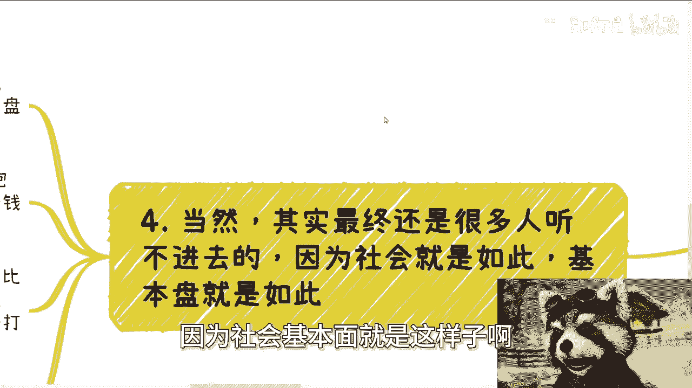

你不能控制企业是否让你当总监或VP，但你可以控制自己获取哪些信息、做出何种判断、以及如何调整路径。许多人寻求规划的本质是寻求“躺平”或逃避思考，但现实是，职场中的年龄歧视、优化裁员等问题无法逃避。即便未来出现新的行业风口，能否抓住也取决于你**是否拥有更早、更准的信息**来做判断，否则机会依然轮不到你。

## 常见误区与总结 📝

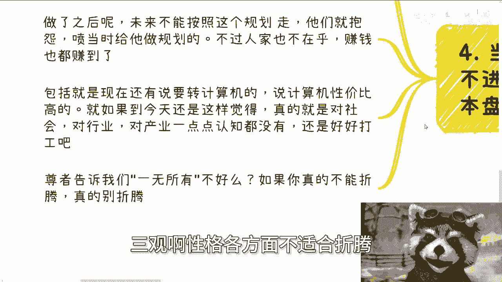

最后，我们需要警惕一些常见的认知误区，并对本节课内容进行总结。

以下是两个需要避免的误区：

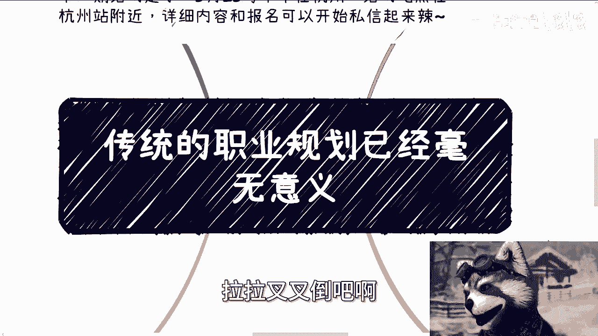

1.  **追求“平稳道路”的幻觉**：许多人仍执着于寻求一份“死”的职业规划，认为这是一条平稳道路。但在当前环境下，这恰恰是不平稳的，且极易被收割。社会基本盘缺乏独立判断能力，导致这种需求持续存在，但结果往往是规划落空后的抱怨。
2.  **脱离现实的滞后认知**：例如在2024年仍认为“转计算机”是万能解药。这反映出对社会、行业、经济缺乏基本认知。持有这种滞后观念，最好的结果是埋头打工，最坏的结果则是被动淘汰。

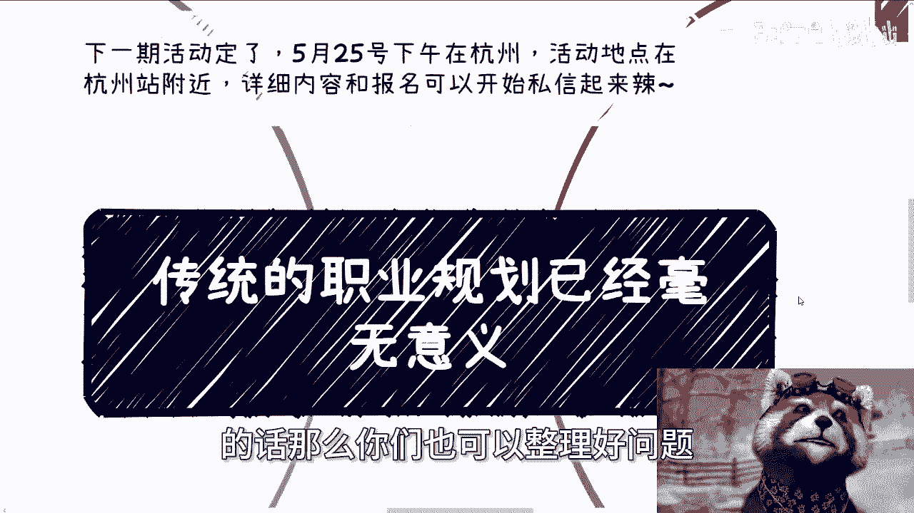

**本节课总结**：
本节课我们一起学习了传统职业规划失效的根本原因，明确了在当下环境中，静态、线性的规划已无意义。有效的职业发展策略应转向**动态规划**，其核心在于：主动构建人际网络以获取关键信息，并依据这些信息持续做出独立判断与方向调整。记住，规划的目的不是绘制一张永不更改的地图，而是培养自己**在迷雾中导航的能力**。在经济周期中，当下的积累与探索往往比等待“经济好转”后的空想更有价值。