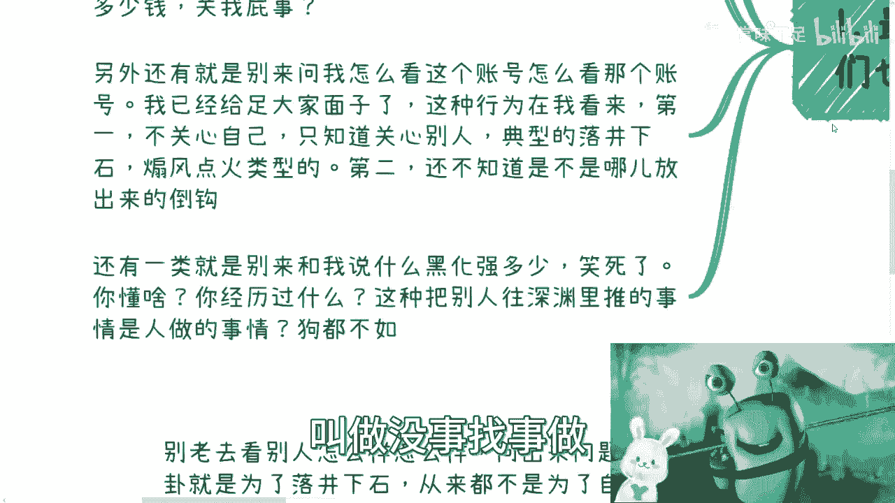
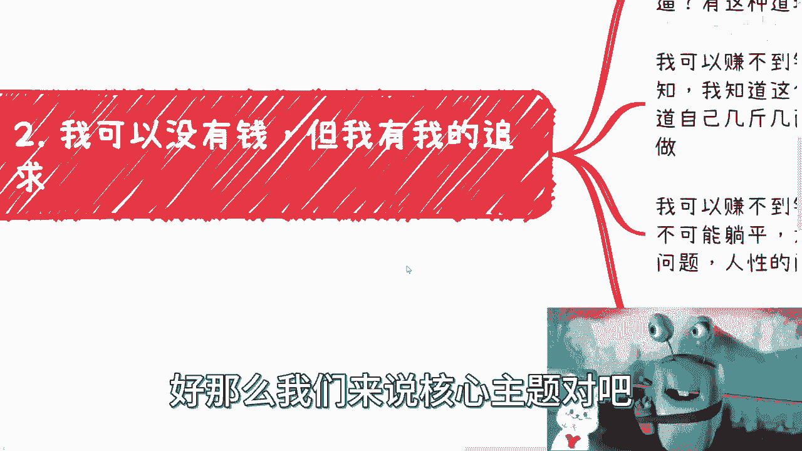
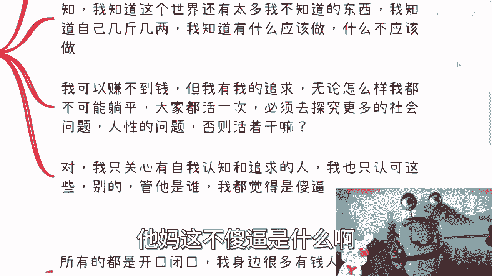
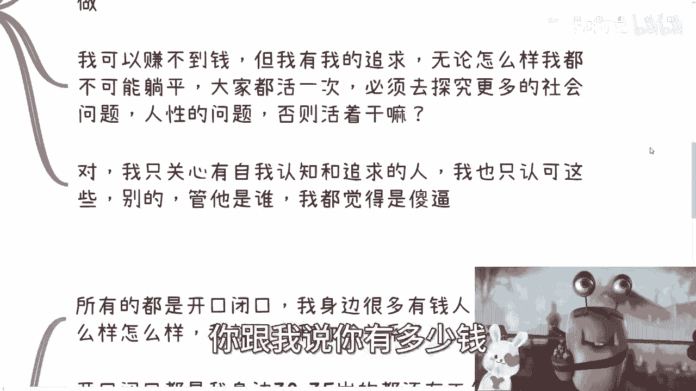
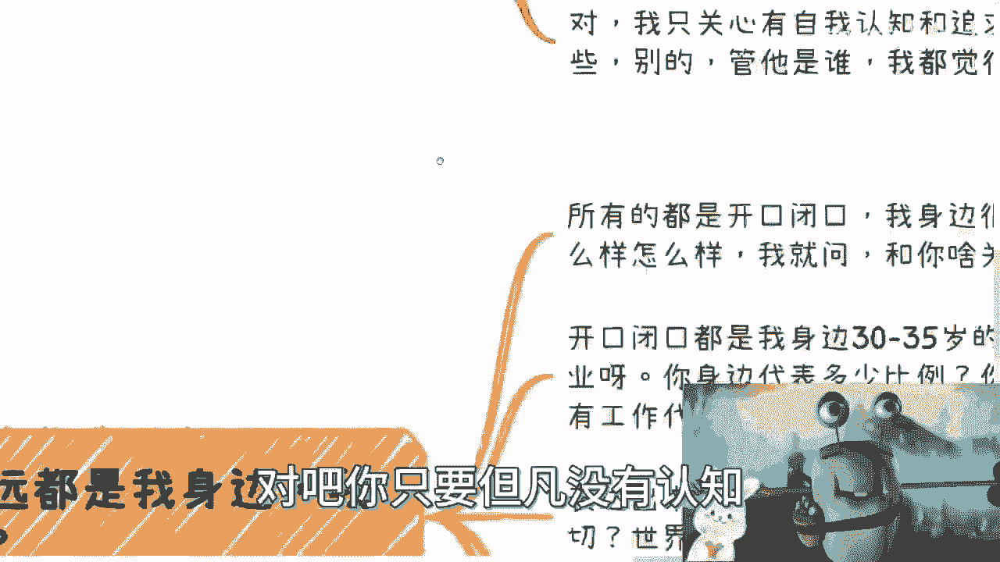
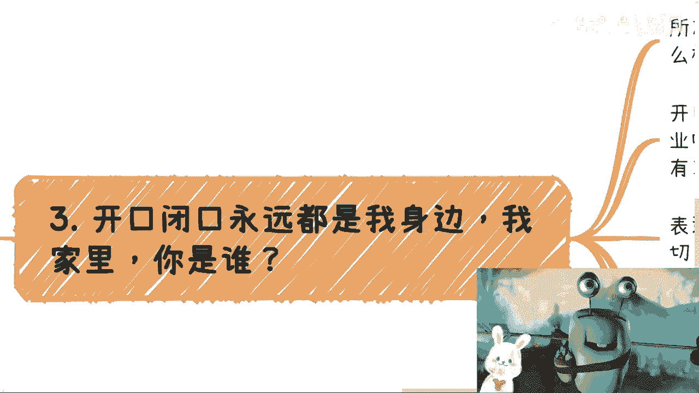
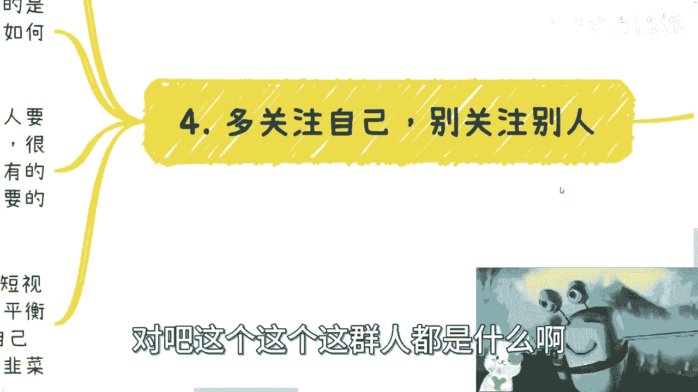
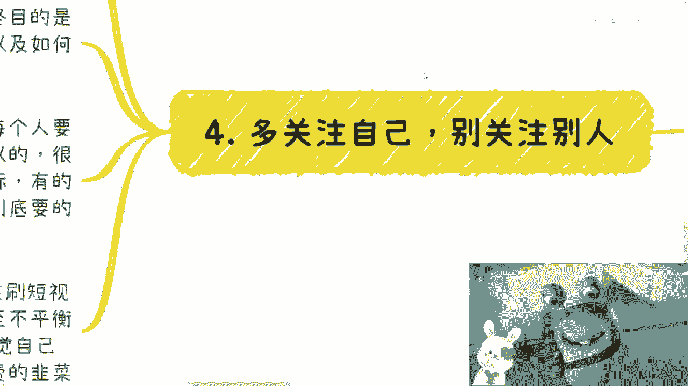
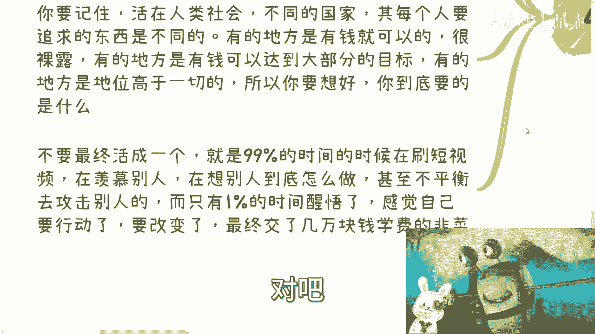
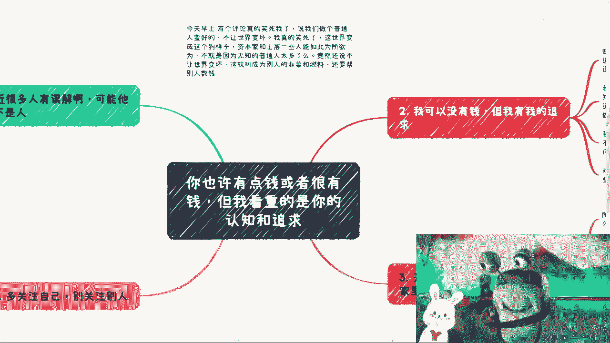

# 课程 P1：认知与追求比金钱更重要 💡

在本节课中，我们将探讨一个核心观点：个人的认知水平和精神追求，远比单纯的财富积累更为重要。我们将分析为何过度关注金钱或他人生活是无益的，并阐述建立独立认知与积极追求的价值。

## 核心观点阐述

许多人存在一种误解，认为一切问题的核心都是金钱。然而，这种看法是对社会运行逻辑缺乏深刻认知的表现。

真正的重点不在于你拥有多少财富，而在于你如何看待世界以及你的人生追求是什么。

## 需要警惕的几种思维误区

上一节我们介绍了核心观点，本节中我们来看看几种常见但有害的思维模式，这些模式会阻碍个人成长。

以下是几种需要警惕的思维和行为：

1.  **“做普通人就好”的自我安慰**：认为安于现状、不追求进步就能“不让世界变坏”。这种想法实质上是放弃了个人能动性，甘愿成为社会系统中被动的“燃料”。
2.  **唯金钱论**：认为所有问题都能用钱解决，或认为有钱就代表成功和优越。这种认知是肤浅的，**财富 ≠ 认知水平**，也无法直接兑换人生的意义。
3.  **“黑化强三分”的误导**：轻率地鼓励他人走向偏激或冷漠，这是一种不负责任的行为。其本质是 `怂恿他人承担风险，而自己置身事外`。
4.  **过度关注他人**：总是议论、评价别人的账号或生活，这种行为往往源于自身缺乏关注点，容易演变为八卦或落井下石，对自身成长毫无益处。
5.  **“我身边”式论据**：习惯用“我身边很多人都……”作为论据，但个人的社交圈样本量小，不具有普遍代表性。例如，“我身边30岁的人都有工作”并不能证明就业市场没有危机。

## 认知与追求的具体内涵

了解了需要避免的误区后，我们来看看应该建立怎样的积极认知与追求。

以下是认知与追求的几个关键层面：

1.  **承认无知与保持探索**：明白世界上有大量自己未知的领域，保持谦逊和好奇心。认知的提升是一个持续的过程，公式可以表示为：**个人成长 ∝ 认知边界扩展**。
2.  **明确追求与拒绝躺平**：人生的意义在于主动探索社会问题、人性本质，并不断自我挑战。赚钱应是这一探索过程中的**自然产物**，而非终极目的。
3.  **关注自身而非比较**：将精力集中在提升自己的认知、技能和行动上，而不是羡慕、嫉妒或攻击他人。有效的时间分配应远离 `99%时间刷短视频 + 1%时间焦虑` 的模式。
4.  **理解社会的多元规则**：认识到在不同环境（国家、圈子）中，达成目标的资源（金钱、权力、地位）权重不同。需要思考自己真正追求的是什么，以及如何利用规则。

## 总结与最终建议

本节课中，我们一起学习了认知与追求相对于金钱的优先性。

核心在于，无论经济状况如何，都应致力于培养深刻的认知和积极的人生追求。避免陷入唯金钱论、过度关注他人、自我设限等思维陷阱。多关注自身成长，理解社会运行的复杂规则，并在此过程中找到属于自己的价值实现路径。一个健康、不扭曲的三观，是比任何短期财富都更宝贵的长期资产。