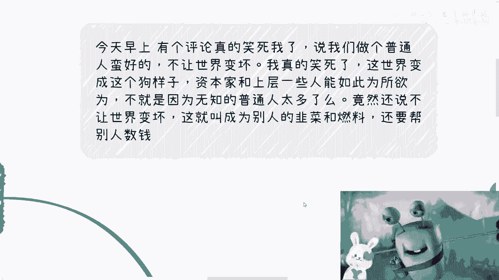
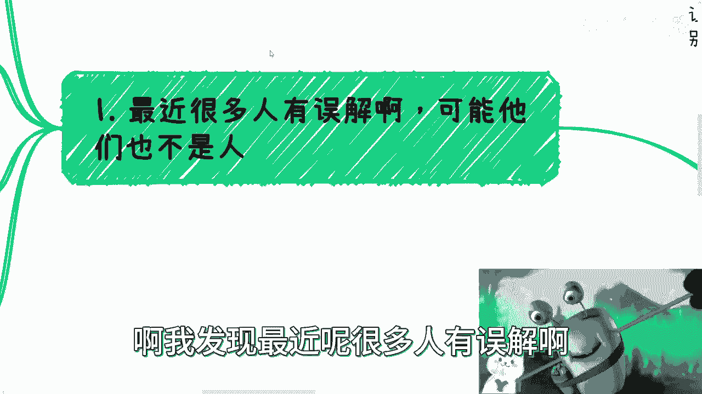
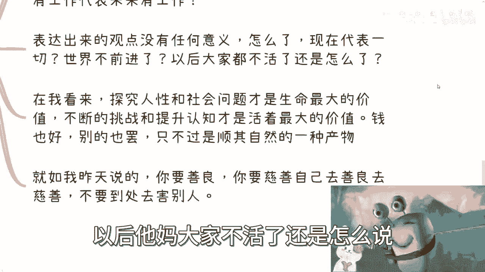
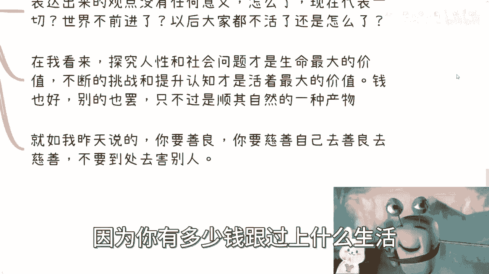
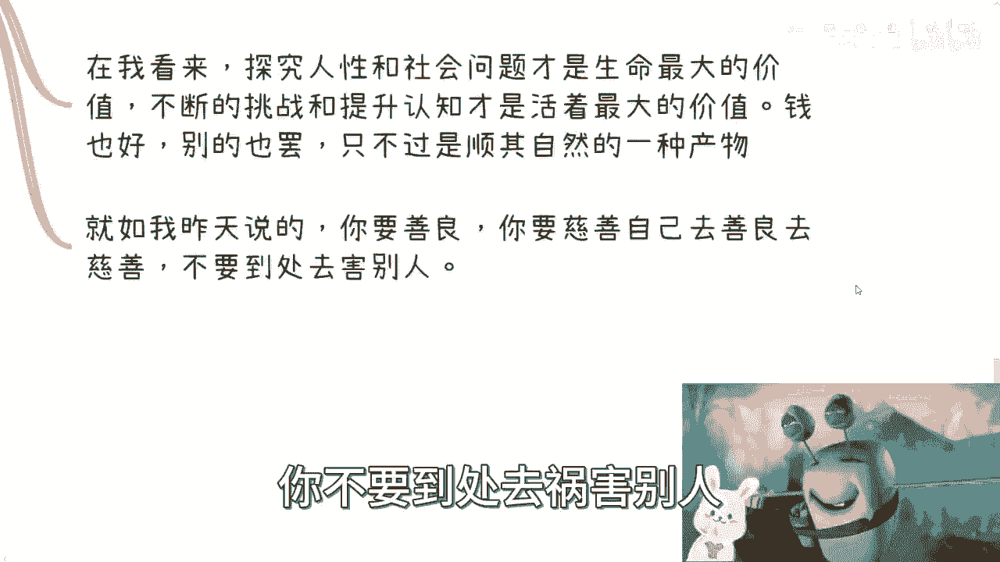
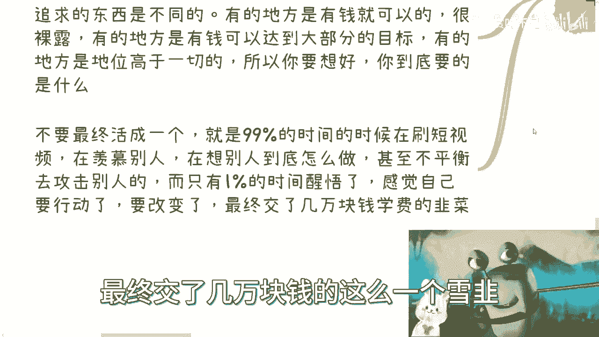

# 你也许有点钱或者很有钱，但我看重的是认知和追求 - P1 - 赏味不足 - BV1hg4y197qM

哈喽大家好，看我的眼神看到没有看到我眼神啊，今天真的，今天一早上呢拉黑了四五个人吧，有这两个我跟你讲啊，呃首先这么几件事，第一啊，今天早上有个评论也是笑到我了，说我们做个普通人蛮好的啊，不让世界变坏。

我表示我真的笑死，我只想告，我只想说这世界他妈变成这个狗样子对吧，资本家跟上层一些人能如此为所欲为，不他妈就是因为这么多无知的普通人太多了嘛，对吧，还跟我说哎我们做普通人蛮好的，不让世界变坏，对吧。

你这叫什么叫做成为别人的韭菜和燃料，还他妈帮别人数钱，还他妈在那边说嗯，蛮好的，你是蛮好的，你什么都不知道，你怎么会不好呢，对不对，我本来还想回复，后来想想算了，他妈的我回复他，我他妈是。

有什么好回复的对吧，都已经是这个样子了，还有什么好回复的，什么奇了怪了，真的是啊，然后我总结出来啊，这次的这个内容是这样子的，你也许有点钱啊，或者说很有钱啊，但是我看中的是你的认知和追求，什么意思呢。

我发现最近很多人有误解啊。

可能呢这个他们也不是人啊，也不是人啊，是我误解了啊，第一你可以家里有点钱，你也可以自己赚到点钱，但是我们不是在讨论多少钱够啊，或者多少钱可以躺平的，你要是觉得一切都是钱不钱的问题，那我就告诉你。

你根本对这个世界就不了解，你对这个社会不了解对吧啊，那么我另外我告诉你，我们又不是一图一路人，你跟中国的老百姓也不是一路人啊，我也不需要你的苟同，更不需要你的关注对吧，首先这第一点，第二点我早就说过了。

我毕业的时候对吧，所有的一切我不管什么开头的人，什么乱，什么教授鸟毛专家，我不管他啊，你只要说话没有认知，没有追求，我一律都是喷的对吧，你要么就是很简单对我的观点，我的观点是什么，就是你可以装逼。

你别在我面前装逼对吧，你但凡在我面前装逼，那我他妈指着你鼻子骂，就这么简单对吧，我不关心你，你是谁，我也不关心你有多少钱，他妈关我屁事啊啊啊，另外还有一点就是别来问我怎么看这个账号，怎么看那个账号。

我跟你们讲啊，我已经给足大家面子了，我不拉黑已经是最后的仁慈了，这种行为在我看来，第一你不关心自己，只知道关心别人，典型的有事情就落井下石，煽风点火的类型，你知道吗，这是第一点啊，第二你还不知道。

就是我还不知道你是哪放出来的，倒钩对啊，回头我要是跟你说了对吧，回头说还有人怎么让我出个视频什么的，那你到时候一举报啊，这个叫做什么叫做没事找事做。

何必呢啊还有一类人啊，就是别来跟我说什么黑化强多少，我跟你讲也是要死的啊，我今天早上也拉黑了啊，就是我想说你懂啥，你经历过什么对吧，哦你跑过来跟别人说黑化强多少，就是你是没有损失的啊。

你在我看来这种行为像什么，这种行为就相当于你把别人往深渊里去推，这他妈是人做的事吗，狗都不如狗都不如好。

那么我们来说核心主题对吧。

我可以没有钱，但是呢我需要有我的追求，首先你要明白啊，就是我们做很多努力，不是说一定会得到结果啊，就像我这边说的，你赚不赚到钱是要看天时地利人和的，这个世界不知道多少人被前所PUA对吧。

他就好像觉得哎我有钱就牛逼了，没有钱就，我跟你讲，还是那句话，这种逻辑就是他根本对社会，对国家没有认知啊，他但凡有点label，他就不会这么想啊，因为他会明白，就是我以前我之前说过。

那那些主题就是钱是不是万能的，有没有钱是万万不能的对吧，当时我说过这件事情，就是你在一定的这个级别，一定的level下面，你的确会觉得是有道理的对吧，你说你是要有钱，是的没毛病。

但是问题是你真的要往上走，你会发现钱有用吗，不是那么有用啊，你要是抱有这种想法，那随意对吧好，那么第二个对吧，我可以从我角度来讲，我可以赚不到钱，我也可以一直失败啊，但是我有我的认知。

我知道这个世界上还有太多我不知道的东西啊，我也知道自己几斤几两，我知道有什么应该做，有什么不应该做啊，就像我知道我不可能去跟跟跟一个，就是说经历过很多对吧，甚至别人做很多东西都是有精神上和。

就是就是就是就是这种圈子里面的这种呃压力，或者说更多的一些问题，你跑过去对吧，就是呃叫做什么叫做站着说话，不腰疼的跟别人说，哎你你你黑化强三分是吧，他妈这不是是什么啊。

我可以赚不到钱，但是呢我得有我的追求啊，无论怎么样，我都不可能躺平，为什么，因为大家都只活一次，在我看来，我的目标就是必须去探究更多的社会问题，个人人性问题，否则活着干什么。

你跟我说哎很多人就说很多人要说活着赚钱啊，要活着怎么样啊，但是你要明白啊，你赚钱跟所谓探究社会问题，跟人性问题密不可分的，而这两者是相辅相成的对吧。

否则你赚不到的呀，啊所以说我这个地方说的很清楚，我只关心自我认知和追求的人，我也只认可这些东西，别的我不认可，你跟我说你有多少钱，你跟我说你爸是谁。

关关我屁事对吧，你只要但凡没有认知。

没有相对应的那个三观，那你就是，我管你是谁啊，咳咳咳对吧。

那么第二点啊，开口闭口呢永远都是我身边。

我家里对吧，你谁啊，我想知道你谁啊啊所有都是开口闭口啊，我身边很多，比如说今天早上还有跟他说，我身边很多有钱人啊，他们怎么样怎么样怎么样，对吧啊好，那么我就要说啊，他们怎么样怎么样，跟你有什么关系啊。

你是能从他们身上赚到一分钱的，还是他们来包养你对吧，这是第一点，第二点，你开口闭口，就是我身边30~35岁的人都还有工作，没有事业，你身边代表多少比例，你接触过多少人对吧，另外一点。

你现在有工作代表着未来有工作吗，更何况他们有没有工作，有证明吗，你也没有证明啊，对吧，你你你能说什么呢，就永远都是张口就来啊，所以你要知道啊，表达出来这些观点没有任何意义啊对吧，因为现在代表了一切吗。

现在代表未来不代表世界不前进了吗，以后他妈大家不活了。

还是怎么说，对吧啊，在我看来啊，探究人性跟生活问题才是生命最大的价值，为什么，因为你活着，你你你是整个生物，整个这个种族的一份子，你不去探究这个问题，你探究什么东西呢，对吧。

另外就是你不去不断的自我挑战，提升认知，你活着干嘛呢，当然这是我的观点啊，我还是那句话，大家接不接受是大家的事情，我无所谓对吧，所以说钱也好，别的也罢，我觉得这是当中顺其自然的一个产物，你知道吗。

这不是说这是个目的，这是个产物，就好像我一开始说的，我们不是在讨论你有多少钱，能过上什么样的生活，这个一点都不重要，因为你有多少钱跟过上什么生活。

他没有任何因果关系对吧，你就像我昨天说的，你要善良，你要去做慈善，你要去自我PUA，那请你自己PUA去，你不要到处去祸害别人对吧。

不要到处跟别人说，哎呀我们做普通人蛮好的对吧。

这个这个这群人都是什么啊，这个何不食肉糜对吧，都是都是不接地气的，那你去不接地气就好了对吧。

在我看来，大部分的人他是上来也不接上面的底气，下呢也不接导，比老百姓的底气就这么简单，他不接地气啊对吧，你为他去想，他不接他不领人情的，就好像我跟那个大家说这么多，你看啊，还有很多人来跑到我这边跟我说。

哎呀我们做普通人蛮好的，哎我们怎么样怎么样，那你们怎么不去就去找资本家说呢，怎么不去找那些剥削你们的人说呢，你找我说干嘛对吧，啊那么第四第三点就是多关注自己，别关注别人对吧。

你比如说你别老去看别人怎么样怎么样，别老看这个账号账号对吧，怎么样怎么样，你问出来问题就是为了八卦，就是为了落井下石，他从来不是为了自己进步，那你问出这些问题干嘛呢，你问我干嘛呢对吧，这是第一点。

第二点，赚钱是第一步，但是并不是你的最终目的，因为最终目的是更多的去看到，或者去我们没有看到过的规则和做事方式，以及如何最大程度提升你赚钱的效率，这件事情我回头还会再讲哦，那么你要记住，活在人类社会。

对不同的国家，其实每个人都要追求的东西是不一样的对吧，因为有的地方有钱就是可以的，他可以一手遮天，表示他很裸露，那有的地方呢有权可以达到大部分的目标，那有的地方的地位是高于一切的。

所以你要想好你到底要的是什么对吧。

那么不要最终活成一个，就说99%的时间呢，在刷短视频对吧，在羡慕别人，在想别人到底怎么做，甚至不平衡啊，还要去攻击别人对吧，还动不动做一些小手脚，而只有1%的时间对吧，在那边那个醒悟了对吧。

感觉自己要行动了，要改变了，最终交了几万块钱的这么一个血韭菜。

何必呢，何必呢对吧，所以说我还是那句话，你们要明白啊，我看人跟上面看，我们和我们再去看别人，所有的这个关注点其实都是不一样的啊，我前两天咨询的时候，我跟我当时跟咨询我的那个人，说过一句话是什么。

我说就在我做过所有的这些case，认知的所有的人里面，我说在我做过的所有的这些商业圈子里面啊，业务当中，我说我没有碰到过一个比我更low的，为什么，因为所有的人他都是有背景的。

所有的人他可能就是说他要么家里有背景，要么就父母有背景，要么就是家里面有积蓄，富二代，我就是最low的，但是这也侧面印证了什么，印证了我们要从就是要去接触到他们，要去跟他们达成商业合作，要去怎么样。

很难，如果来说相对比较容易的话，那么至少我在过程当中，我能碰到一部分跟我一样的人，但是不好意思，没有对吧，但是问题是我没有别的选择吗，没有啊，那只能这样走啊，你能怎么走呢，跟我说考本硕博，跟我跟我说。

跟我说做个普通人，那你去做呗，跟我有什么关系啊，我我我我又不多分钱，不少钱，对不对，很多人呢他没有钱，同时呢他也没有认知，对啊，那我就要说了，你这种践踏就被践踏或者被收割，那是活该对吧。

那有很多人呢也有点钱，家里经商的，或者家里有点背景对吧，好像有个几千万啊，然后他就觉得我好像很牛逼，好像很怎么样，高人一等，用鼻孔看人，那我就跟你说，在我看来你们都是，就这类人都是，就这么简单。

何意没有意义的，有什么意义呢，对不了，多关注自己，这钱是你挣的吗，不是对吧，你有多大的认知，你对世界和国家，对社会有多大认知，这是你要去关注的对吧，那当然你命好，你说好，我爸妈留给我几千万好。

OK那是你的事情啊，你要出来做做搅屎棍对吧啊，这边评论一下那边的怎么样，这边炫耀一下那边怎么样，那OK那我也没话可说对吧，哎就这么着吧，好吧真的，我觉得嗯人吧啊你别说活到30岁了。

活到50岁能有个正确的不扭曲的三观，我就真的谢天谢地。

